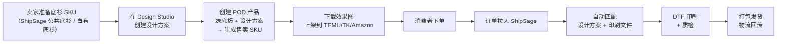
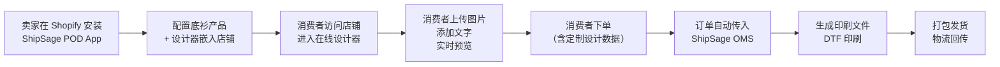
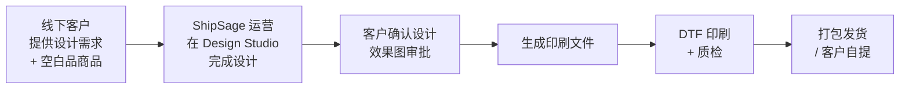
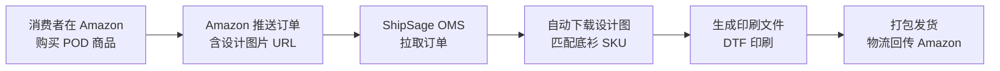
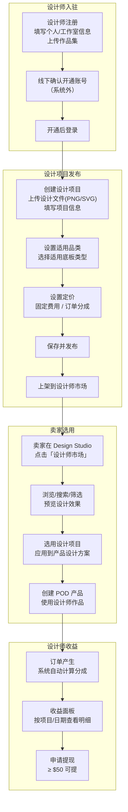
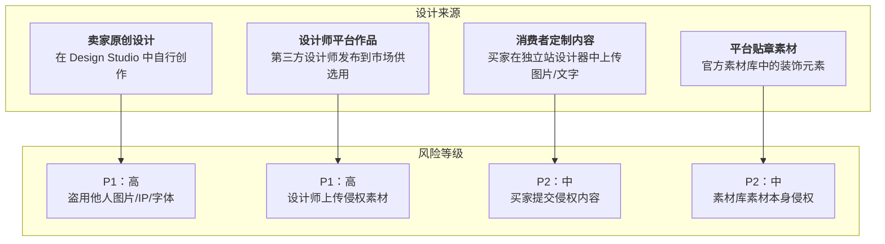

# ShipSage POD Design Studio 业务汇报

> 日期：2026-04-01
> 汇报人：Dennis
> 对应 PRD：`5-PRD-20260324-v5-ShipSage-卖家设计器.md` V6.4

---

## 一、POD 业务四大场景

### 场景 1：ShipSage 提供底衫 + 卖家设计，上架电商平台

> **关键词**：我们的底衫、我们的设计器、卖家的店铺

**业务描述**：

卖家使用 ShipSage 提供的底衫（或自有底衫），在 ShipSage POD Design Studio 中完成设计，生成效果图上架到 TEMU/TK/Amazon 等电商平台。消费者下单后，订单自动拉入 ShipSage，系统匹配设计方案，在 ShipSage 仓库完成 DTF 印刷并发货。

**两种 SKU 模式**：
- **带设计的 SKU**：卖家在设计器中完成设计 → 关联底板生成 POD 售卖 SKU → 订单进入后自动匹配设计方案打印
- **空白设计的 SKU**：卖家创建 POD 产品但不预设设计 → 订单拉入时带有平台提供的设计图片 → 卖家审核后打印发货

**参与方**：

| 角色 | 提供内容 |
|------|---------|
| ShipSage | 底衫（公共底衫库）、设计器、印刷履约、物流 |
| 卖家 | 设计方案 / 审核买家设计图、电商平台店铺运营 |
| 消费者 | 下单购买 |

**业务流程图**：



> **[系统截图区域]**
>
> _此处预留放置系统截图：_
> - [ ] POD Design Studio 设计方案列表页
> - [ ] 创建 POD 产品向导
> - [ ] 效果图下载页

---

### 场景 2：设计器嵌入独立站，消费者在线定制

> **关键词**：我们的设计器、消费者的创意、卖家的独立站

**业务描述**：

ShipSage 将 POD 设计器以 Shopify App / JS Embed Widget 形式输出，嵌入到卖家的独立站（Shopify 店铺等）。消费者在店铺内直接使用设计器进行个性化定制（上传照片、添加文字），提交订单后由 ShipSage 完成印刷和发货。

**当前状态**：规划在 **Phase 2**（Shopify App + Embed Widget）和 **Phase 3**（消费者端定制）实现。Phase 1 先完成卖家端设计能力。

**参与方**：

| 角色 | 提供内容 |
|------|---------|
| ShipSage | 底衫、设计器 Widget/App、印刷履约 |
| 卖家 | 独立站/Shopify 店铺、底衫选品、店铺运营 |
| 消费者 | **在设计器中自行创作设计**、下单 |

**业务流程图**：



> **[系统截图区域]**
>
> _此处预留放置系统截图：_
> - [ ] Shopify App 设计器嵌入效果（概念图）
> - [ ] 消费者端设计器界面（概念图）

---

### 场景 3：线下接单，ShipSage 代设计 + 印刷发货

> **关键词**：客户的商品、我们代设计、我们印刷

**业务描述**：

线下客户（如品牌商、团体订单）将空白品商品交给 ShipSage，由 ShipSage 运营团队使用 POD Design Studio 完成设计，然后在仓库进行 DTF 印刷并发货。适用于批量定制、企业团购、活动周边等场景。

**参与方**：

| 角色 | 提供内容 |
|------|---------|
| ShipSage | 设计服务、印刷履约、物流 |
| 客户 | 空白品商品（或使用 ShipSage 底衫）、设计需求描述 |

**业务流程图**：



> **[系统截图区域]**
>
> _此处预留放置系统截图：_
> - [ ] 设计器多面编辑界面
> - [ ] 效果图预览确认页

---

### 场景 4：平台底衫 + 平台设计，ShipSage 仅负责印刷发货

> **关键词**：平台的底衫、平台的设计、我们只印刷发货

**业务描述**：

Amazon Merch on Demand 等平台提供底衫和设计，ShipSage 不参与底衫供应和设计环节，仅作为 POD 印刷履约服务商。订单从平台拉入 ShipSage 时已携带设计文件（印刷图 URL），ShipSage 完成 DTF 印刷并发货。

**系统处理**：订单 SKU 关联的底板为「空白设计」模式，设计图来自订单附带的图片 URL，无需经过 Design Studio。

**参与方**：

| 角色 | 提供内容 |
|------|---------|
| 电商平台（Amazon 等）| 底衫、设计、消费者流量 |
| ShipSage | **仅印刷履约 + 物流**（不参与设计）|

**业务流程图**：



> **[系统截图区域]**
>
> _此处预留放置系统截图：_
> - [ ] OMS 订单列表（带设计图预览）
> - [ ] WMS 印刷工单界面

---

### 四大场景对比

| 维度 | 场景 1 | 场景 2 | 场景 3 | 场景 4 |
|------|--------|--------|--------|--------|
| **底衫来源** | ShipSage / 卖家 | ShipSage / 卖家 | 客户 / ShipSage | 平台 |
| **设计来源** | 卖家（Design Studio）| 消费者（嵌入设计器）| ShipSage 代设计 | 平台 |
| **订单来源** | TEMU/TK/Amazon 等 | Shopify 独立站 | 线下沟通 | Amazon 等平台 |
| **ShipSage 角色** | 全链路（底衫+设计器+印刷+物流）| 设计器+印刷+物流 | 设计+印刷+物流 | 仅印刷+物流 |
| **对应 Phase** | **Phase 1（本期）** | Phase 2-3 | Phase 1（可支持）| Phase 1（可支持）|
| **SKU 模式** | 带设计 SKU / 空白设计 SKU | 消费者实时生成 | 带设计 SKU | 空白设计 SKU + 订单图片 |

---

## 二、POD 总流程图（端到端）

> 基于 PRD V6.4 端到端流程，涵盖底板准备 → 设计方案 → POD 产品创建 → 订单匹配 → 仓库印刷 → 发货全链路。
>
> **Task 编号对照**：T1 底板管理 → T2 设计方案中心 → T3 创建 POD 产品 → T4 买家设计审核 → T7 订单匹配 → T8 仓库印刷

### 2.1 总流程图

```mermaid
flowchart TD
    subgraph Phase0 ["阶段零：店铺授权与基础配置"]
        S1["<b>卖家注册/登录 ShipSage OMS</b><br>开通 POD 功能"]
        S2["<b>店铺授权</b><br>授权 TEMU/TK/Amazon/Shopify 店铺<br>建立订单拉取通道"]
        S3["<b>Admin 配置试点仓库</b><br>标记 pod_enabled=1<br>配置 DTF 设备信息"]
        S1 --> S2 --> S3
    end

    subgraph Phase1 ["阶段一：底板 + 底衫准备"]
        A0["<b>Admin 配置试点仓库</b><br>标记 pod_enabled=1<br>配置 DTF 设备信息<br><i>角色: ShipSage Admin</i>"]
        A1["<b>准备底衫 SKU</b><br>卖家自有底衫 / ShipSage 公共底衫<br>（company_id in 卖家自己, 2）<br>创建「POD底衫」分类商品<br><i>角色: Seller</i>"]
        A2["<b>底板管理</b><br>创建底板 → 配置印刷区域/支持面<br>上传模板图/Mockup 底图<br>关联底衫 Customer SKU<br><i>角色: Seller</i><br><i>Task: T1</i>"]
        A0 --> A1 --> A2
    end

    subgraph Phase2 ["阶段二：设计方案"]
        B1["<b>设计方案中心</b><br>新建 / 编辑 / 管理设计方案<br><i>角色: Seller</i><br><i>Task: T2</i>"]
        B2["<b>多面设计器</b><br>正面/背面/左袖/右袖独立编辑<br>上传图片 / 文字 / 贴章<br>AI 抠图 / DPI 检测 / AI 超分<br><i>Task: T2</i>"]
        B3["<b>预览下载中心</b><br>Mockup 效果图预览<br>下载 TEMU/TK/Amazon/通用高清图片<br><i>Task: T2</i>"]
        B4["<b>（可选）选用设计师作品</b><br>浏览设计师市场 → 应用到 Canvas<br><i>Task: T11</i>"]
        B1 --> B2 --> B3
        B2 -.-> B4
    end

    subgraph Phase3 ["阶段三：创建 POD 产品"]
        C0{"选择创建方式"}
        C0 -- "使用现有设计方案" --> C1a["<b>选择底板 + 已有设计方案</b>"]
        C0 -- "新建设计方案" --> C1b["<b>跳转设计器完成新方案</b>"]
        C0 -- "买家定制款" --> C1c["<b>选择底板（不预设设计方案）</b>"]
        C1a --> C2["<b>确认底衫 SKU / 颜色 / 尺码</b><br>仅来自底板已关联的底衫<br>颜色取自底板 Mockup 底图"]
        C1b --> C2
        C1c --> C2
        C2 --> C3["<b>生成 POD 产品</b><br>绑定底板 + 默认方案 + SKU 映射<br><i>Task: T3</i>"]
        C3 --> C4["<b>上架电商平台</b><br>效果图上传 TEMU/TK/Amazon"]
    end

    subgraph Phase3B ["阶段三B：买家设计审核（可选）"]
        C5["<b>买家提交定制设计图</b><br>订单进入待审核状态<br><i>角色: Buyer / Seller</i><br><i>Task: T4</i>"]
        C6["<b>卖家审核设计图</b><br>DPI 检测 → 确认通过 / 替换上传<br><i>角色: Seller</i><br><i>Task: T4</i>"]
        C5 --> C6
    end

    subgraph Phase4 ["阶段四：订单匹配"]
        D1["<b>消费者下单</b><br>在 TEMU/TK/Amazon 等平台购买 POD 商品"]
        D2["<b>订单拉入 ShipSage OMS</b><br>通过店铺授权 API / CSV 导入"]
        D3["<b>SKU 自动匹配</b><br>catalog_id → POD 产品 → 底板+设计方案 → 印刷文件<br>买家定制款: 匹配买家审核通过的设计图<br><i>Task: T7</i>"]
        D4["<b>路由到 POD 仓库</b><br>SyncToWms 下发印刷文件<br>+ mockup 效果图 + 热压位置<br><i>Task: T7</i>"]
        D1 --> D2 --> D3 --> D4
    end

    subgraph Phase5 ["阶段五：仓库 DTF 印刷"]
        E1["<b>Step 1: 创建 Pick Run</b><br>扫 Cart 条码 + 选 Bin 数<br>系统分配 Bin ↔ Shipment 映射<br><i>角色: 拣货员</i>"]
        E2["<b>Step 2: 生成膜打印批次</b><br>Pick Run 创建后进入合并窗口<br>批量生成 pod_film_batch + pod_film_task<br><i>系统自动</i>"]
        E3["<b>Step 3: 膜打印</b><br>下载独立 PNG → 导入 Maintop 手动拼版<br>打印到 PET 转印膜 → 撒粉 → 固化"]
        E4["<b>Step 4: 裁切 + 贴膜条码</b><b>裁切各图案 → 贴膜条码 → 通知膜预拣</b>"]
        E5["<b>Step 5: 膜预拣</b><br>扫膜条码 → 显示 Bin 编号+效果图 → 将膜放入 Bin"]
        E6["<b>Step 6: 衣物拣货</b><br>拣空白品 → 放入对应 Bin → 衣物与膜自动匹配"]
        E7["<b>Step 7: 热压转印</b><br>参考效果图定位 → 170°C / 15s → 揭膜"]
        E8["<b>Step 8: 质检</b><br>Pass → 打包 / Fail → 单面重印（≤3次）"]
        E1 --> E2 --> E3 --> E4 --> E5 --> E6 --> E7 --> E8
    end

    subgraph Phase6 ["阶段六：发货"]
        F1["<b>打包 → 贴标 → 发运</b><br>复用现有 WMS Pack→Ship 流程"]
        F2["<b>物流单号回传平台</b><br>消费者收到发货通知"]
    end

    A2 --> B1
    S3 --> A1
    B3 --> C0
    C4 --> D1
    C6 -.-> D3
    D4 --> E1
    E8 -- "Pass" --> F1 --> F2
    E8 -- "Fail & count<3" --> E3
```



### 2.2 系统截图对照

> 按流程阶段，在下方粘贴系统实际截图。

#### 阶段零：店铺授权

> **[截图位置]**
>
> - [ ] OMS 店铺授权页面
> - [ ] TEMU/TK/Amazon 授权配置

#### 阶段一：底板 + 底衫准备

> **[截图位置]**
>
> - [ ] 产品列表（POD 底衫分类）
> - [ ] 底板管理列表页
> - [ ] 底板编辑页（印刷区域配置 + Mockup 上传）

#### 阶段二：设计方案

> **[截图位置]**
>
> - [ ] 设计方案中心列表页
> - [ ] 多面设计器编辑界面（正面/背面/袖子切换）
> - [ ] AI 抠图 / DPI 检测效果
> - [ ] 预览下载中心

#### 阶段三：创建 POD 产品

> **[截图位置]**
>
> - [ ] 创建 POD 产品向导（选方式/选底板/选 SKU）
> - [ ] POD 产品列表页

#### 阶段三B：买家设计审核

> **[截图位置]**
>
> - [ ] 买家设计审核列表页
> - [ ] 审核详情页（DPI 检测 + 确认/替换上传）

#### 阶段四：订单匹配

> **[截图位置]**
>
> - [ ] OMS 订单列表（POD 订单标识）
> - [ ] 订单详情（设计方案匹配信息 + 热压参数）

#### 阶段五：仓库印刷

> **[截图位置]**
>
> - [ ] WMS Pick Run 创建界面
> - [ ] WMS 膜打印批次列表
> - [ ] 膜预拣扫码界面
> - [ ] 热压作业界面
> - [ ] 质检确认界面

#### 阶段六：发货

> **[截图位置]**
>
> - [ ] WMS 打包发货界面
> - [ ] 物流单号回传确认

---

## 三、设计师平台

### 3.1 定位

ShipSage 独立子模块（ADMIN / POD / Designer Platform），供第三方设计师注册登录、发布设计项目、管理收益。卖家在 POD Design Studio 的设计师市场中浏览和选用设计师作品。

### 3.2 设计师平台全流程图



### 3.3 设计师平台功能模块

```
ShipSage ADMIN / POD / Designer Platform
├── 设计师端（前台）
│   ├── 注册/登录（邮箱+密码 / Google OAuth）
│   ├── Dashboard 首页
│   │   ├── 项目统计卡片（已上架 / 草稿 / 总采用数 / 本月收益）
│   │   ├── 收益趋势图（近 30 天）
│   │   └── 最新动态通知
│   ├── 我的项目（My Projects）
│   │   ├── 项目列表（筛选：全部/已上架/草稿/已下架）
│   │   ├── 发布新项目（3 步：上传文件 → 设置品类 → 设置定价）
│   │   └── 项目详情（编辑/下架/查看采用数据）
│   ├── 收益中心（Revenue）
│   │   ├── 收益概览（总收益/已结算/待结算/已提现）
│   │   ├── 收益明细（按项目/按订单/按日期）
│   │   └── 提现管理（申请提现/提现记录）
│   └── 个人设置（Profile）
│       └── 基本信息/收款账户/密码修改
│
├── Admin 端（后台管理）
│   ├── 设计师市场配置（分类管理/推荐位/Banner）
│   └── 分成规则配置（默认比例/阶梯模式）
│
└── 卖家端集成
    └── Design Studio 内「设计师市场」入口
        ├── 浏览/搜索/筛选设计项目
        ├── 预览设计效果
        └── 一键选用 → 应用到 Canvas
```

### 3.4 收益模式

| 模式 | 说明 | 适用场景 |
|------|------|---------|
| **固定费用** | 每次设计被卖家采用，设计师获得固定金额（如 $5/次）| 标准化设计、素材包 |
| **订单分成** | 使用该设计的 POD 产品每产生一笔订单，设计师获得约定比例分成（如 5-15%）| 高价值原创设计 |

### 3.5 关键数据表

| 表名 | 用途 |
|------|------|
| `pod_designers` | 设计师主表（基本信息、状态、收款账户）|
| `pod_design_projects` | 设计项目（设计文件、品类、定价、状态）|
| `pod_design_adoptions` | 采用记录（卖家+项目+时间+定价快照）|
| `pod_designer_revenues` | 收益明细（订单级别分成计算）|
| `pod_designer_withdrawals` | 提现记录（金额、状态、支付信息）|


---

## 四、版权风险与防控体系

> POD 业务涉及三方创作（卖家、设计师、消费者），ShipSage 作为平台方需建立完善的版权保护机制，在赋能创作者的同时控制平台法律风险。

### 4.1 三种版权来源与风险矩阵



| 设计来源 | 对应场景 | 侵权类型 | 平台风险 | PRD 覆盖 |
|---|---|---|---|---|
| **卖家原创设计** | 场景 1 | 盗用网络图片/IP、自行上传字体 | P1（高）| ✅ 部分（发布时勾选原创声明）|
| **设计师平台作品** | 场景 3 | 设计师上传侵权素材 | P1（高）| ✅ 注册协议+线下审核+下架冻结 |
| **消费者定制内容** | 场景 2 | 买家提交侵权图片 | P2（中）| ❌ 缺失（无声明机制）|
| **平台贴章素材** | 通用 | 官方素材侵权 | P2（中）| ✅ Risk P2（需保留授权证明）|

### 4.2 当前已做的防护措施

#### ✅ 设计师平台（T11）

| 防护节点 | 具体措施 | PRD 对应 |
|---|---|---|
| 入驻注册 | 注册协议中明确版权声明，设计师须承诺作品为原创或已获合法授权 | US-1106 |
| 发布审核 | 发布时强制勾选"我确认该设计为原创作品或已获得合法授权" | US-1106 |
| 人工审核 | 线下审核阶段重点检查设计合法性 | T11 阶段 |
| 侵权处理 | 收到投诉后立即下架 + 冻结账号 | T11 阶段 |

#### ✅ 卖家设计方案中心（T2）

| 防护节点 | 具体措施 | PRD 对应 |
|---|---|---|
| 发布声明 | 设计方案发布前须勾选"我确认该设计为原创作品或已获得合法授权" | US-1106 |

#### ✅ 平台贴章素材库

| 防护节点 | 具体措施 | PRD 对应 |
|---|---|---|
| 素材审核 | 所有官方素材须经版权确认（原创/免费商用授权） | Risk P2 |
| 证明留存 | 保留授权证明文件 | Risk P2 |

### 4.3 仍存在的风险缺口

> 以下为坦诚向老板汇报的未覆盖风险项，需在后续版本中补充。

| 风险缺口 | 影响 | 优先级 | 建议方案 |
|---|---|---|---|
| **字体版权** | 卖家在设计器上传自定义字体文件，商用授权由谁承担 ShipSage 无明确说明 | P1 | 上传自定义字体时增加弹窗提示："请确保字体已获商用授权，ShipSage 不承担字体版权责任" |
| **买家设计无声明** | 场景 2 中消费者上传定制图片，无任何原创/授权确认机制 | P1 | 买家提交设计图前强制勾选原创声明 |
| **侵权投诉机制缺失** | 目前无 DMCA Agent、无通知-删除流程，平台面临"明知侵权不处理"连带责任 | P0 | 建立投诉入口 + 配合法务建立 DMCA Agent |
| **授权证明未留存** | 设计师声称"已获授权"但平台无留存证明文件，仅靠勾选声明无法抗辩 | P1 | 发布时要求上传授权证明文件（如字体商用授权函、图片版权证明等）|
| **AI 生成图案** | AI-7 功能生成的图案，商用版权归属尚无统一定论 | P2 | 明确告知卖家：AI 生成图案的商用授权需自行确认 |

### 4.4 后续行动计划

| 优先级 | 行动计划 | 对应 PRD 补充项 |
|---|---|---|
| **P0** | 建立 DMCA Agent + 侵权投诉入口（通知-删除机制）| 新增 T11-US / Risk |
| **P1** | 卖家上传自定义字体时增加版权免责弹窗 | T2 新增 US |
| **P1** | 买家提交设计图前强制勾选原创声明 | T4 新增 US |
| **P1** | 设计师发布时留存授权证明文件 | T11 新增 US |
| **P2** | 设计文件上传后自动添加隐形溯源水印 | T11 新增 US |
| **P2** | AI 生成图案商用版权声明（法务评估后写入产品文档）| AI-7 补充说明 |

### 4.5 平台法律责任边界（管理层参考）

| 适用法律 | 适用场景 | 关键条款 | ShipSage 当前状态 |
|---|---|---|---|
| **DMCA（美国）** | 设计师/卖家在美国注册 | 平台需提供 DMCA Agent；收到投诉后删除侵权内容可免责 | ❌ 尚未建立 |
| **EU E-Commerce Directive** | 欧盟设计师 | "Hosting Provider"豁免：仅提供存储服务不知情可免责 | ⚠️ 需法务确认 |
| **中国《电子商务法》** | 中国设计师/卖家 | 平台须建立"通知-删除"机制；明知侵权不删除承担连带责任 | ⚠️ 需法务确认 |

> **底线**：ShipSage 当前定位为"设计存储与分发平台"，适用"避风港原则"豁免；但若平台明知侵权不处理，或通过推荐算法推广侵权内容，则失去免责保护。建议 P0 优先级尽快建立投诉处理机制。
