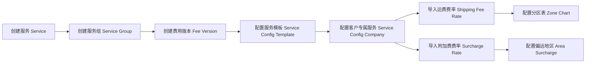
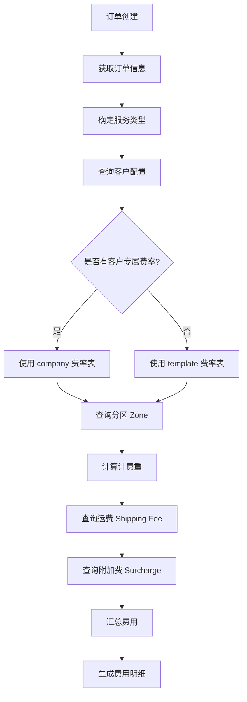
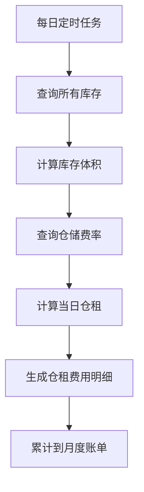
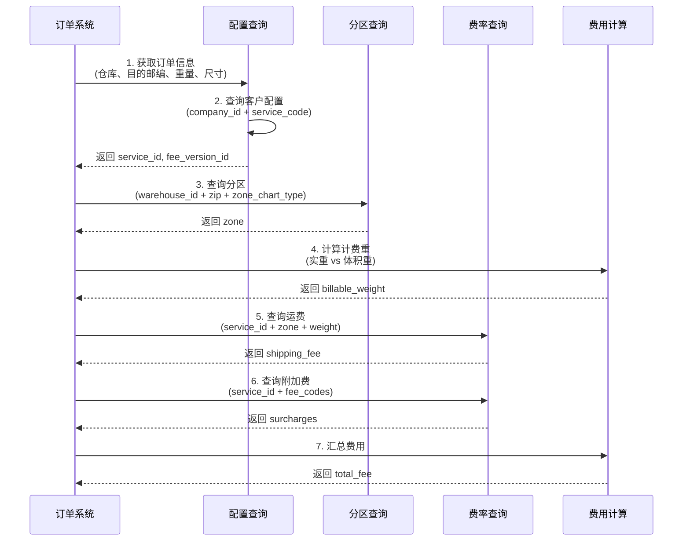

# ShipSage Billing 模块系统文档

> **文档版本**: v1.0  
> **创建日期**: 2026-03-17  
> **适用对象**: 产品经理、业务分析师、开发人员  
> **维护说明**: 本文档涵盖 ShipSage 计费系统的完整架构，包括报价配置、运费计算、附加费管理、账单生成等核心功能

---

## 目录

1. [文档概述](#一文档概述)
2. [系统架构](#二系统架构)
3. [核心业务流程](#三核心业务流程)
4. [数据模型](#四数据模型)
5. [费用类型与计算规则](#五费用类型与计算规则)
6. [报价配置体系](#六报价配置体系)
7. [运费计算流程](#七运费计算流程)
8. [系统枚举与配置](#八系统枚举与配置)
9. [实体关系图（ERD）](#九实体关系图erd)
10. [关键业务规则](#十关键业务规则)
11. [常见问题](#十一常见问题)

---

## 一、文档概述

### 1.1 文档目的

本文档为产品经理和业务分析师提供 ShipSage Billing 计费系统的完整背景知识和结构信息，帮助理解：

- 计费系统的整体架构和数据流向
- 各类费用的计算规则和配置方式
- 报价版本管理和服务配置逻辑
- 运费和附加费的计算流程
- 关键业务概念和术语定义

### 1.2 术语表

| 术语 | 英文全称 | 说明 |
|------|----------|------|
| Billing | Billing System | 计费系统 |
| Fee Rate | Fee Rate | 费率/价格 |
| Zone Chart | Zone Chart | 分区表（邮编对应区域） |
| Surcharge | Surcharge | 附加费 |
| Service | Service | 服务（如 FedEx Ground、USPS 等） |
| Service Group | Service Group | 服务组（同一类服务的集合） |
| Fee Version | Fee Version | 费用版本（不同客户等级的报价） |
| Company | Company | 客户/货主 |
| Warehouse | Warehouse | 仓库 |
| DIM Weight | Dimensional Weight | 体积重 |
| Billable Weight | Billable Weight | 计费重（实重与体积重取大） |

### 1.3 计费系统范围

ShipSage Billing 模块覆盖以下费用类型：

| 费用类型 | 说明 | 计算方式 |
|----------|------|----------|
| **运费 (Shipping Fee)** | 包裹从仓库到目的地的运输费用 | 按重量 + 分区查询费率表 |
| **附加费 (Surcharge)** | 燃油费、偏远地区费、超尺寸费等 | 按 fee_code 查询费率 |
| **操作费 (Handling Fee)** | 拣货、打包、贴标等操作费用 | 按订单或按件计费 |
| **仓储费 (Storage Fee)** | 库存占用的仓租费用 | 按体积 × 天数计费 |
| **入库费 (Receiving Fee)** | 收货、质检、上架费用 | 按托盘/箱/件计费 |
| **退货费 (Return Fee)** | 退货处理、质检、重新上架 | 按件计费 |

---

## 二、系统架构

### 2.1 计费系统模块划分

```
ShipSage Billing System
├── 报价配置层 (Quote Configuration)
│   ├── 服务定义 (Service Definition)
│   ├── 服务组管理 (Service Group)
│   ├── 费用版本 (Fee Version)
│   └── 服务配置 (Service Config)
│
├── 费率管理层 (Rate Management)
│   ├── 运费费率 (Shipping Fee Rate)
│   ├── 附加费费率 (Surcharge Fee Rate)
│   ├── 分区表 (Zone Chart)
│   └── 偏远地区配置 (Area Surcharge)
│
├── 费用计算层 (Fee Calculation)
│   ├── 运费计算引擎
│   ├── 附加费计算引擎
│   ├── 仓储费计算引擎
│   └── 操作费计算引擎
│
└── 账单管理层 (Bill Management)
    ├── 费用明细 (Charge Detail)
    ├── 账单生成 (Bill Generation)
    └── 账单调整 (Bill Adjustment)
```

### 2.2 数据流向

```
报价配置 (Service/Service Group/Fee Version)
    ↓
费率配置 (Shipping Fee Rate/Surcharge Rate)
    ↓
分区配置 (Zone Chart + Area Surcharge Zip)
    ↓
费用计算引擎
    ↓
费用明细 (Charge Detail)
    ↓
账单生成 (Bill)
```

### 2.3 数据库架构

| 数据库 | 类型 | 用途 | Billing 相关表 |
|--------|------|------|----------------|
| **app.shipsage.com** | MySQL | 业务数据库 | `app_shipsage_fee_rate*`, `app_shipsage_service*`, `app_shipsage_zone_chart*` |
| **Production** | MySQL | 仓库/客户数据 | `GT_Warehouse` |

---

## 三、核心业务流程

### 3.1 报价配置流程



### 3.2 运费计算流程



### 3.3 仓储费计算流程



---

## 四、数据模型

### 4.1 核心实体概览

| 实体 | 表名 | 说明 | 数据量 |
|------|------|------|--------|
| 费用版本 | `app_shipsage_fee_version` | 定义不同客户等级的报价版本 | 99 |
| 服务 | `app_shipsage_service` | 定义各类服务（运费、仓储、操作等） | 833 |
| 服务组 | `app_shipsage_service_group` | 将相关服务分组（如 FedEx 相关服务） | 35 |
| 服务配置模板 | `app_shipsage_service_config_template` | 标准版服务配置 | 695 |
| 客户服务配置 | `app_shipsage_service_config_company` | 客户专属服务配置 | 26,170 |
| 服务报价 | `app_shipsage_service_quote` | 非运费类服务的报价 | 7,449 |
| 客户服务报价 | `app_shipsage_service_quote_company` | 客户专属服务报价 | 61,469 |
| 运费费率 | `app_shipsage_shipping_fee_rate` | 标准版运费费率 | 389,107 |
| 客户运费费率 | `app_shipsage_shipping_fee_rate_company` | 客户专属运费费率 | 3,225,672 |
| 附加费费率 | `app_shipsage_fee_rate` | 标准版附加费费率 | 27,736 |
| 客户附加费费率 | `app_shipsage_fee_rate_company` | 客户专属附加费费率 | 137,700 |
| 附加费代码 | `app_shipsage_fee_code_condition_desc` | 附加费代码定义 | 712 |
| 分区表 | `app_shipsage_zone_chart` | 邮编到区域的映射 | 1,266,612 |
| 分区类型 | `app_shipsage_zone_chart_type` | 分区表类型定义 | 12 |
| 偏远地区邮编 | `app_shipsage_area_surcharge_zip` | 偏远地区邮编配置 | 156,874 |

### 4.2 费用版本表 (app_shipsage_fee_version)

**用途**: 定义不同客户等级（VIP/SVIP 等）的报价版本

| 字段名 | 类型 | 可空 | 说明 |
|--------|------|------|------|
| fee_version_id | int | NOT NULL | 主键，自增 |
| fee_version_name | varchar | NOT NULL | 版本名称，如 "Shipping Fee-SVIP+-CN-20221227" |
| display_name | varchar | NOT NULL | 显示名称 |
| fee_charge_method_id | int | NOT NULL | 计费方式 ID |
| service_id | int | NOT NULL | 关联服务 ID |
| display_notice | text | NULL | 显示通知/说明 |
| hidden | tinyint | NOT NULL | 是否隐藏 |
| disabled | tinyint | NOT NULL | 是否禁用 |
| deleted | tinyint | NOT NULL | 是否删除（软删除） |
| created_at | timestamp | NOT NULL | 创建时间 |
| updated_at | timestamp | NOT NULL | 更新时间 |

**索引**:
- PRIMARY: fee_version_id
- idx_service_id: service_id
- idx_fee_charge_method_id: fee_charge_method_id

### 4.3 服务表 (app_shipsage_service)

**用途**: 定义系统中的各类服务

| 字段名 | 类型 | 可空 | 说明 |
|--------|------|------|------|
| service_id | int | NOT NULL | 主键，自增 |
| service_name | varchar | NOT NULL | 服务名称，如 "Storage Fees" |
| service_code | varchar | NOT NULL | 服务代码 |
| comments | mediumtext | NULL | 服务说明/备注 |
| hidden | tinyint | NOT NULL | 是否隐藏 |
| disabled | tinyint | NOT NULL | 是否禁用 |
| deleted | tinyint | NOT NULL | 是否删除 |
| created_at | timestamp | NOT NULL | 创建时间 |
| updated_at | timestamp | NOT NULL | 更新时间 |

**索引**:
- PRIMARY: service_id
- idx_service_code: service_code
- idx_service_name: service_name

### 4.4 服务组表 (app_shipsage_service_group)

**用途**: 将相关服务分组管理

| 字段名 | 类型 | 可空 | 说明 |
|--------|------|------|------|
| service_group_id | int | NOT NULL | 主键，自增 |
| group_name | varchar | NOT NULL | 组名称，如 "SG Parcel-WarehouseBase" |
| display_name | varchar | NOT NULL | 显示名称，如 "DHL Expedited" |
| description | varchar | NOT NULL | 描述 |
| sort | int | NOT NULL | 排序字段 |
| hidden | tinyint | NOT NULL | 是否隐藏 |
| disabled | tinyint | NOT NULL | 是否禁用 |
| deleted | tinyint | NOT NULL | 是否删除 |
| created_at | timestamp | NOT NULL | 创建时间 |
| updated_at | timestamp | NOT NULL | 更新时间 |

### 4.5 服务配置模板表 (app_shipsage_service_config_template)

**用途**: 定义标准版服务的配置

| 字段名 | 类型 | 可空 | 说明 |
|--------|------|------|------|
| template_id | int | NOT NULL | 主键，自增 |
| service_code | varchar | NOT NULL | 服务代码 |
| service_group_id | int | NOT NULL | 服务组 ID |
| package_type_id | int | NOT NULL | 包裹类型 ID |
| fee_version_id | int | NOT NULL | 费用版本 ID |
| service_id | int | NOT NULL | 服务 ID |
| ship_config | json | NULL | 发货限制配置（如最大计费重量） |
| start_date | datetime | NULL | 生效开始时间 |
| end_date | datetime | NULL | 生效结束时间 |
| hidden | tinyint | NOT NULL | 是否隐藏 |
| disabled | tinyint | NOT NULL | 是否禁用 |
| deleted | tinyint | NOT NULL | 是否删除 |
| created_at | timestamp | NOT NULL | 创建时间 |
| updated_at | timestamp | NOT NULL | 更新时间 |

**索引**:
- PRIMARY: template_id
- idx_service_id: service_id
- idx_fee_version_id: fee_version_id
- idx_service_code: service_code

### 4.6 客户服务配置表 (app_shipsage_service_config_company)

**用途**: 定义客户专属的服务配置

| 字段名 | 类型 | 可空 | 说明 |
|--------|------|------|------|
| service_config_company_id | int | NOT NULL | 主键，自增 |
| company_id | int | NOT NULL | 客户 ID |
| service_code | varchar | NOT NULL | 服务代码 |
| service_group_id | int | NOT NULL | 服务组 ID |
| package_type_id | int | NOT NULL | 包裹类型 ID |
| fee_version_id | int | NOT NULL | 费用版本 ID |
| service_id | int | NOT NULL | 服务 ID |
| shipping_fee_code | varchar | NOT NULL | 运费代码 |
| shipping_fee_weight_rate | decimal | NOT NULL | 运费重量费率 |
| ship_config | json | NULL | 发货限制配置 |
| start_date | datetime | NULL | 生效开始时间 |
| end_date | datetime | NULL | 生效结束时间 |
| hidden | tinyint | NOT NULL | 是否隐藏 |
| disabled | tinyint | NOT NULL | 是否禁用 |
| deleted | tinyint | NOT NULL | 是否删除 |
| created_at | timestamp | NOT NULL | 创建时间 |
| updated_at | timestamp | NOT NULL | 更新时间 |

**索引**:
- PRIMARY: service_config_company_id
- idx_company_id: company_id
- idx_service_id: service_id
- idx_fee_version_id: fee_version_id
- idx_service_group_id: service_group_id
- idx_start_date: start_date
- idx_end_date: end_date

### 4.7 运费费率表 (app_shipsage_shipping_fee_rate)

**用途**: 存储标准版运费费率（重量 × 分区 = 费用）

| 字段名 | 类型 | 可空 | 说明 |
|--------|------|------|------|
| rate_id | int | NOT NULL | 主键，自增 |
| service_id | int | NOT NULL | 服务 ID |
| weight | int | NOT NULL | 重量（磅） |
| unit | varchar | NOT NULL | 单位（lb） |
| zone | int | NOT NULL | 区域（2-8） |
| fee | decimal | NOT NULL | 费用金额 |
| start_date | datetime | NULL | 生效开始时间 |
| end_date | datetime | NULL | 生效结束时间 |
| hidden | tinyint | NOT NULL | 是否隐藏 |
| disabled | tinyint | NOT NULL | 是否禁用 |
| deleted | tinyint | NOT NULL | 是否删除 |
| created_at | timestamp | NOT NULL | 创建时间 |
| updated_at | timestamp | NOT NULL | 更新时间 |

**索引**:
- PRIMARY: rate_id
- idx_service_id: service_id
- idx_service_id_weight_zone: (service_id, weight, zone)
- idx_weight: weight
- zone: zone
- idx_start_date: start_date
- idx_end_date: end_date

**数据量**: 389,107 条

### 4.8 客户运费费率表 (app_shipsage_shipping_fee_rate_company)

**用途**: 存储客户专属运费费率

| 字段名 | 类型 | 可空 | 说明 |
|--------|------|------|------|
| rate_company_id | int | NOT NULL | 主键，自增 |
| company_id | int | NOT NULL | 客户 ID |
| service_id | int | NOT NULL | 服务 ID |
| weight | int | NOT NULL | 重量（磅） |
| unit | varchar | NOT NULL | 单位（lb） |
| zone | int | NOT NULL | 区域 |
| fee | decimal | NOT NULL | 费用金额 |
| start_date | datetime | NULL | 生效开始时间 |
| end_date | datetime | NULL | 生效结束时间 |
| hidden | tinyint | NOT NULL | 是否隐藏 |
| disabled | tinyint | NOT NULL | 是否禁用 |
| deleted | tinyint | NOT NULL | 是否删除 |
| created_at | timestamp | NOT NULL | 创建时间 |
| updated_at | timestamp | NOT NULL | 更新时间 |

**索引**:
- PRIMARY: rate_company_id
- idx_company_id: company_id
- idx_service_id: service_id
- idx_service_id_weight_zone: (service_id, weight, zone)
- idx_weight: weight
- idx_zone: zone

**数据量**: 3,225,672 条

### 4.9 附加费费率表 (app_shipsage_fee_rate)

**用途**: 存储标准版附加费费率

| 字段名 | 类型 | 可空 | 说明 |
|--------|------|------|------|
| rate_id | int | NOT NULL | 主键，自增 |
| service_id | int | NOT NULL | 服务 ID |
| fee_group | varchar | NULL | 费用分组 |
| fee_code | varchar | NULL | 费用代码 |
| fee_code_carrier | varchar | NOT NULL | 承运商费用代码 |
| fee_type | mediumtext | NULL | 费用类型说明 |
| commercial | tinyint | NULL | 是否适用于商业地址 |
| residential | tinyint | NULL | 是否适用于住宅地址 |
| additional | tinyint | NOT NULL | 是否为附加费 |
| rate_shopping | tinyint | NOT NULL | 是否参与比价 |
| fee | decimal | NULL | 费用金额 |
| start_date | datetime | NULL | 生效开始时间 |
| end_date | datetime | NULL | 生效结束时间 |
| hidden | tinyint | NOT NULL | 是否隐藏 |
| disabled | tinyint | NOT NULL | 是否禁用 |
| deleted | tinyint | NOT NULL | 是否删除 |
| created_at | timestamp | NOT NULL | 创建时间 |
| updated_at | timestamp | NOT NULL | 更新时间 |

**索引**:
- PRIMARY: rate_id
- idx_service_id: service_id
- fee_code: fee_code
- idx_fee_code_carrier: fee_code_carrier

**数据量**: 27,736 条

### 4.10 附加费代码定义表 (app_shipsage_fee_code_condition_desc)

**用途**: 定义附加费代码的含义和描述

| 字段名 | 类型 | 可空 | 说明 |
|--------|------|------|------|
| condition_desc_id | int | NOT NULL | 主键，自增 |
| fee_group | varchar | NOT NULL | 费用分组（英文） |
| fee_group_cn | varchar | NOT NULL | 费用分组（中文） |
| fee_code | varchar | NOT NULL | 费用代码 |
| fee_code_carrier | varchar | NOT NULL | 承运商费用代码 |
| fee_type | mediumtext | NULL | 费用类型 |
| condition_desc_cn | varchar | NOT NULL | 条件描述（中文） |
| condition_desc_en | varchar | NOT NULL | 条件描述（英文） |
| hidden | tinyint | NOT NULL | 是否隐藏 |
| disabled | tinyint | NOT NULL | 是否禁用 |
| deleted | tinyint | NOT NULL | 是否删除 |
| created_at | timestamp | NOT NULL | 创建时间 |
| updated_at | timestamp | NOT NULL | 更新时间 |

**索引**:
- PRIMARY: condition_desc_id
- fee_code: fee_code
- idx_fee_code_carrier: fee_code_carrier

**数据量**: 712 条

### 4.11 分区表 (app_shipsage_zone_chart)

**用途**: 存储邮编到区域的映射关系

| 字段名 | 类型 | 可空 | 说明 |
|--------|------|------|------|
| zone_chart_id | int | NOT NULL | 主键，自增 |
| zip_range_start | varchar | NOT NULL | 邮编范围起始（如 "00500"） |
| zip_range_end | varchar | NOT NULL | 邮编范围结束（如 "00599"） |
| warehouse_id | int | NOT NULL | 仓库 ID |
| zone_chart_type_id | tinyint | NULL | 分区表类型 ID |
| zone | int | NOT NULL | 区域编号（2-8） |
| start_date | datetime | NULL | 生效开始时间 |
| end_date | datetime | NULL | 生效结束时间 |
| hidden | tinyint | NOT NULL | 是否隐藏 |
| disabled | tinyint | NOT NULL | 是否禁用 |
| deleted | tinyint | NOT NULL | 是否删除 |
| created_at | timestamp | NOT NULL | 创建时间 |
| updated_at | timestamp | NOT NULL | 更新时间 |

**索引**:
- PRIMARY: zone_chart_id
- warehouse_id: warehouse_id
- zip_range_start: zip_range_start
- zip_range_end: zip_range_end
- idx_start_end_date: (start_date, end_date)

**数据量**: 1,266,612 条

### 4.12 偏远地区邮编表 (app_shipsage_area_surcharge_zip)

**用途**: 存储偏远地区邮编及对应的附加费代码

| 字段名 | 类型 | 可空 | 说明 |
|--------|------|------|------|
| zip_id | int | NOT NULL | 主键，自增 |
| type_id | int | NOT NULL | 类型 ID（承运商） |
| zip_code | varchar | NOT NULL | 邮编 |
| fee_code_commercial | varchar | NOT NULL | 商业地址附加费代码 |
| fee_code_residential | varchar | NOT NULL | 住宅地址附加费代码 |
| start_date | datetime | NULL | 生效开始时间 |
| end_date | datetime | NULL | 生效结束时间 |
| hidden | tinyint | NOT NULL | 是否隐藏 |
| disabled | tinyint | NOT NULL | 是否禁用 |
| deleted | tinyint | NOT NULL | 是否删除 |
| created_at | timestamp | NOT NULL | 创建时间 |
| updated_at | timestamp | NOT NULL | 更新时间 |

**索引**:
- PRIMARY: zip_id
- zip_code: zip_code
- idx_carrier: type_id
- fee_code_commercial: fee_code_commercial
- fee_code_residential: fee_code_residential

**数据量**: 156,874 条

---

## 五、费用类型与计算规则

### 5.1 运费计算规则

**计算公式**:
```
运费 = ZoneChart[仓库, 目的邮编] → Zone
       ↓
      ShippingFeeRate[Service, Zone, 计费重]
```

**计费重计算**:
```
计费重 = MAX(实重, 体积重)
体积重 = (长 × 宽 × 高) / 材积系数

材积系数:
- 默认: 139 (in³/lb)
- 部分服务: 166 (in³/lb)
```

**重量进位规则**:
- 不足 1 lb 按 1 lb 计算
- 超过整数部分按进一法取整（如 1.1 lb → 2 lb）

### 5.2 附加费类型

| 附加费类型 | Fee Code | 说明 | 触发条件 |
|------------|----------|------|----------|
| 燃油附加费 | FSC | Fuel Surcharge | 所有运费订单 |
| 偏远地区费 | RDC/RDR | Delivery Area Surcharge | 邮编在偏远地区列表 |
| 超偏远地区费 | LDC/LDR | Extended Delivery Area | 邮编在超偏远地区列表 |
| 住宅配送费 | RES | Residential Delivery | 地址类型为住宅 |
| 超尺寸费 | OS | Oversize | 尺寸超过阈值 |
| 额外处理费 | AHW/AHL/AHG/AHC | Additional Handling | 重量/尺寸/形状异常 |
| 大包裹费 | LLC/LLR | Large Package Surcharge | 体积重 > 实重且超过阈值 |
| 非标准长度费 | NLL | Non-Standard Length | 长度超过阈值 |
| 签名确认费 | DCS/CSG/ADS | Signature Confirmation | 需要签名服务 |

### 5.3 仓储费计算规则

**计算公式**:
```
日仓租 = 库存体积(CBM) × 单价 × 天数

计费周期:
- 免费期: 入库后 7 天免仓租
- 计费区间: 
  - 0-30 天: 免费或低价
  - 31-60 天: 标准价
  - 61-90 天: 上浮价
  - 91-120 天: 更高价
  - 121-180 天: 高价
  - 181-365 天: 更高价
  - 365+ 天: 最高价（强制移仓风险）

结算时间: 每月 1 号结算上月仓租
```

### 5.4 操作费计算规则

| 操作类型 | 计费单位 | 说明 |
|----------|----------|------|
| Pick & Pack | 按订单/按件 | 根据重量区间定价 |
| 贴标 | 按标签 | 每件商品的贴标费用 |
| 质检 | 按件 | 入库质检费用 |
| 拍照 | 按照片 | 增值服务 |
| 换包装 | 按件 | 增值服务 |

---

## 六、报价配置体系

### 6.1 报价版本层级

```
系统支持两种报价体系:

1. 标准版本 (Template)
   - 适用于普通客户
   - 使用 app_shipsage_service_config_template
   - 使用 app_shipsage_shipping_fee_rate
   - 使用 app_shipsage_fee_rate

2. 客户专属版本 (Company)
   - 适用于 VIP/SVIP 客户
   - 使用 app_shipsage_service_config_company
   - 使用 app_shipsage_shipping_fee_rate_company
   - 使用 app_shipsage_fee_rate_company
```

### 6.2 费用版本 (Fee Version)

**CN 版本** (fee_version_id: 62-67):
| fee_version_id | 版本名称 | 说明 |
|----------------|----------|------|
| 62 | Shipping Fee-S1-2025010601-CN-VIP | S1 标准价格 |
| 63 | Shipping Fee-S2-2025010601-CN-SVIP | S2 标准价 |
| 64 | Shipping Fee-S3-2025010601-CN-SVIP-Plus | S3 标准价 |
| 65 | Shipping Fee-OE-2025010601-CN-SVIP-Plus | OE 价格 |
| 66 | Shipping Fee-S1-2025010602-CN-VIP | S1 小件折扣 |
| 67 | Shipping Fee-S2-2025010602-CN-SVIP | S2 小件折扣 |

**US 版本** (fee_version_id: 87-90):
| fee_version_id | 版本名称 | 说明 |
|----------------|----------|------|
| 87 | Shipping Fee-20250226-US-WHOLESALE | 批发价 |
| 88 | Shipping Fee-20250226-US-BEST SELLER | 畅销价 |
| 89 | Shipping Fee-20250226-US-VIP | VIP 价 |
| 90 | Shipping Fee-20250226-US-Ultra price | 超低价 |

### 6.3 服务组配置示例

**FedEx Ground 服务组**:
```
Service Group: FedEx Ground (service_group_id: 2)
├── Service: FedEx Ground S1 (service_id: 3349, fee_version_id: 62)
├── Service: FedEx Ground S2 (service_id: 3350, fee_version_id: 63)
├── Service: FedEx Ground S3 (service_id: 3351, fee_version_id: 64)
└── Service: FedEx Ground OE (service_id: 3352, fee_version_id: 65)
```

---

## 七、运费计算流程

### 7.1 计算步骤详解



### 7.2 分区查询逻辑

```sql
-- 根据目的邮编查询区域
SELECT zone 
FROM app_shipsage_zone_chart 
WHERE warehouse_id = {warehouse_id}
  AND zone_chart_type_id = {type_id}
  AND zip_range_start <= {zip_code}
  AND zip_range_end >= {zip_code}
  AND start_date <= NOW()
  AND end_date >= NOW()
  AND deleted = 0
LIMIT 1;
```

### 7.3 运费查询逻辑

```sql
-- 标准版运费查询
SELECT fee 
FROM app_shipsage_shipping_fee_rate 
WHERE service_id = {service_id}
  AND zone = {zone}
  AND weight = {billable_weight}
  AND start_date <= NOW()
  AND end_date >= NOW()
  AND deleted = 0;

-- 客户专属运费查询
SELECT fee 
FROM app_shipsage_shipping_fee_rate_company 
WHERE company_id = {company_id}
  AND service_id = {service_id}
  AND zone = {zone}
  AND weight = {billable_weight}
  AND start_date <= NOW()
  AND end_date >= NOW()
  AND deleted = 0;
```

### 7.4 附加费查询逻辑

```sql
-- 根据 fee_code 查询附加费
SELECT fee 
FROM app_shipsage_fee_rate 
WHERE service_id = {service_id}
  AND fee_code = {fee_code}
  AND start_date <= NOW()
  AND end_date >= NOW()
  AND deleted = 0;
```

---

## 八、系统枚举与配置

### 8.1 分区表类型 (Zone Chart Type)

| zone_chart_type_id | 类型名称 | 目的地国家 | 邮编长度 |
|--------------------|----------|------------|----------|
| 1 | UPS & Amazon Shipping | US | 5 |
| 2 | USPS | US | 5 |
| 3 | FedEx | US | 5 |
| 4 | DHL | US | 5 |
| 5 | OnTrac | US | 5 |

### 8.2 承运商类型 (Carrier Type)

| type_id | 承运商 | 说明 |
|---------|--------|------|
| 1 | UPS | United Parcel Service |
| 2 | FedEx | Federal Express |
| 3 | USPS | United States Postal Service |
| 4 | DHL | DHL Express |
| 5 | Amazon Shipping | Amazon Logistics |
| 6 | OnTrac | OnTrac Logistics |

### 8.3 常用附加费代码映射

| 附加费名称 | 商业地址代码 | 住宅地址代码 | 说明 |
|------------|--------------|--------------|------|
| Delivery Area Surcharge | RDC | RDR | 偏远地区配送费 |
| Extended Delivery Area | LDC | LDR | 超偏远地区配送费 |
| Large Package Surcharge | LLC | LLR | 大包裹附加费 |
| Additional Handling (Weight) | AHW-2 | AHW-2 | 超重附加费 |
| Additional Handling (Length) | AHL-2 | AHL-2 | 超长附加费 |
| Non-Standard Length | NLL-3S2 | NLL-3S2 | 非标准长度费 |

---

## 九、实体关系图 (ERD)

```mermaid
erDiagram
    FEE_VERSION ||--o{ SERVICE_CONFIG_TEMPLATE : "包含"
    FEE_VERSION ||--o{ SERVICE_CONFIG_COMPANY : "包含"
    SERVICE ||--o{ SERVICE_CONFIG_TEMPLATE : "配置"
    SERVICE ||--o{ SERVICE_CONFIG_COMPANY : "配置"
    SERVICE_GROUP ||--o{ SERVICE_CONFIG_TEMPLATE : "分组"
    SERVICE_GROUP ||--o{ SERVICE_CONFIG_COMPANY : "分组"
    
    SERVICE ||--o{ SHIPPING_FEE_RATE : "定价"
    SERVICE ||--o{ SHIPPING_FEE_RATE_COMPANY : "定价"
    SERVICE ||--o{ FEE_RATE : "附加费"
    SERVICE ||--o{ FEE_RATE_COMPANY : "附加费"
    SERVICE ||--o{ SERVICE_QUOTE : "报价"
    SERVICE ||--o{ SERVICE_QUOTE_COMPANY : "报价"
    
    WAREHOUSE ||--o{ ZONE_CHART : "分区"
    ZONE_CHART_TYPE ||--o{ ZONE_CHART : "类型"
    
    FEE_CODE_DESC ||--o{ FEE_RATE : "定义"
    FEE_CODE_DESC ||--o{ AREA_SURCHARGE_ZIP : "引用"
    
    FEE_VERSION {
        int fee_version_id PK
        varchar fee_version_name
        varchar display_name
        int fee_charge_method_id
        int service_id
    }
    
    SERVICE {
        int service_id PK
        varchar service_name
        varchar service_code
        mediumtext comments
    }
    
    SERVICE_GROUP {
        int service_group_id PK
        varchar group_name
        varchar display_name
        varchar description
    }
    
    SERVICE_CONFIG_TEMPLATE {
        int template_id PK
        varchar service_code
        int service_group_id FK
        int fee_version_id FK
        int service_id FK
        json ship_config
    }
    
    SERVICE_CONFIG_COMPANY {
        int service_config_company_id PK
        int company_id
        varchar service_code
        int service_group_id FK
        int fee_version_id FK
        int service_id FK
        json ship_config
    }
    
    SHIPPING_FEE_RATE {
        int rate_id PK
        int service_id FK
        int weight
        varchar unit
        int zone
        decimal fee
    }
    
    SHIPPING_FEE_RATE_COMPANY {
        int rate_company_id PK
        int company_id
        int service_id FK
        int weight
        varchar unit
        int zone
        decimal fee
    }
    
    FEE_RATE {
        int rate_id PK
        int service_id FK
        varchar fee_group
        varchar fee_code
        varchar fee_code_carrier
        decimal fee
    }
    
    FEE_RATE_COMPANY {
        int rate_company_id PK
        int company_id
        int service_id FK
        varchar fee_group
        varchar fee_code
        decimal fee
    }
    
    FEE_CODE_DESC {
        int condition_desc_id PK
        varchar fee_group
        varchar fee_group_cn
        varchar fee_code
        varchar fee_code_carrier
        varchar condition_desc_cn
        varchar condition_desc_en
    }
    
    ZONE_CHART {
        int zone_chart_id PK
        varchar zip_range_start
        varchar zip_range_end
        int warehouse_id FK
        int zone_chart_type_id FK
        int zone
    }
    
    ZONE_CHART_TYPE {
        int zone_chart_type_id PK
        varchar zone_chart_type
        varchar destination_country_code
        tinyint zip_length
    }
    
    AREA_SURCHARGE_ZIP {
        int zip_id PK
        int type_id
        varchar zip_code
        varchar fee_code_commercial
        varchar fee_code_residential
    }
    
    SERVICE_QUOTE {
        int service_quote_id PK
        int service_id FK
        varchar name
        varchar index
        decimal quote
        varchar unit
    }
    
    SERVICE_QUOTE_COMPANY {
        int service_quote_vip_id PK
        int company_id
        int service_id FK
        varchar name
        varchar index
        decimal quote
        varchar unit
    }
```



---

## 十、关键业务规则

### 10.1 数据隔离规则

**三维隔离模型**: `company_id` + `warehouse_id` + `service_id`

- 所有客户专属表必须包含 `company_id` 字段
- 查询时必须带上 `company_id` 条件
- 客户只能查看自己的费率配置

### 10.2 时间有效性规则

- 所有费率记录都有 `start_date` 和 `end_date`
- 查询时必须检查当前时间在有效期内
- 默认结束时间: `2099-12-31 23:59:59`
- 历史费率通过 `deleted` 软删除保留

### 10.3 费率优先级规则

```
1. 客户专属费率 (company_rate)
   - 如果存在且有效，优先使用
   
2. 标准费率 (template_rate)
   - 客户专属不存在时使用
   
3. 默认费率 (default)
   - 系统保底费率
```

### 10.4 分区查询规则

- 根据 `warehouse_id` + `zip_code` + `zone_chart_type_id` 查询
- 邮编匹配使用范围查询 (`zip_range_start <= zip <= zip_range_end`)
- 必须检查时间有效性

### 10.5 计费重计算规则

```
1. 计算体积重 = (长 × 宽 × 高) / 材积系数
2. 比较实重和体积重，取较大值
3. 重量进位：小数部分进一取整
4. 查询费率表时使用进位后的重量
```

---

## 十一、常见问题

### Q1: 如何为新客户配置专属报价？

**步骤**:
1. 在 `app_shipsage_service_config_company` 创建客户配置
2. 导入客户专属运费费率到 `app_shipsage_shipping_fee_rate_company`
3. 导入客户专属附加费费率到 `app_shipsage_fee_rate_company`
4. 设置生效时间范围

### Q2: 如何更新运费价格？

**步骤**:
1. 准备新的报价 Excel 文件
2. 生成导入文件（CSV/Excel 格式）
3. 设置新的 `start_date`（通常为未来日期）
4. 导入新费率，旧费率自动过期

### Q3: 分区表如何更新？

**步骤**:
1. 准备新的 Zone Chart Excel 文件
2. 将旧记录的 `end_date` 设置为当前时间
3. 导入新的分区记录
4. 验证邮编覆盖完整性

### Q4: 附加费代码如何映射？

参考 `app_shipsage_fee_code_condition_desc` 表：
- `fee_code`: 系统内部代码
- `fee_code_carrier`: 承运商原始代码
- `condition_desc_cn`: 中文描述
- `condition_desc_en`: 英文描述

### Q5: 如何查询某个订单的费用明细？

**查询逻辑**:
```sql
-- 1. 获取订单使用的 service_id
SELECT service_id FROM app_shipsage_service_config_company 
WHERE company_id = {company_id} AND service_code = {service_code};

-- 2. 查询运费
SELECT * FROM app_shipsage_shipping_fee_rate_company 
WHERE company_id = {company_id} AND service_id = {service_id} 
  AND zone = {zone} AND weight = {billable_weight};

-- 3. 查询附加费
SELECT * FROM app_shipsage_fee_rate_company 
WHERE company_id = {company_id} AND service_id = {service_id} 
  AND fee_code IN ({fee_codes});
```

---

## 附录：数据表汇总

| 表名 | 用途 | 数据量 | 核心字段 |
|------|------|--------|----------|
| app_shipsage_fee_version | 费用版本 | 99 | fee_version_id, fee_version_name |
| app_shipsage_service | 服务定义 | 833 | service_id, service_name, service_code |
| app_shipsage_service_group | 服务组 | 35 | service_group_id, group_name |
| app_shipsage_service_config_template | 标准服务配置 | 695 | template_id, fee_version_id, service_id |
| app_shipsage_service_config_company | 客户服务配置 | 26,170 | company_id, fee_version_id, service_id |
| app_shipsage_service_quote | 服务报价 | 7,449 | service_id, quote, unit |
| app_shipsage_service_quote_company | 客户服务报价 | 61,469 | company_id, service_id, quote |
| app_shipsage_shipping_fee_rate | 标准运费费率 | 389,107 | service_id, zone, weight, fee |
| app_shipsage_shipping_fee_rate_company | 客户运费费率 | 3,225,672 | company_id, service_id, zone, weight, fee |
| app_shipsage_fee_rate | 标准附加费费率 | 27,736 | service_id, fee_code, fee |
| app_shipsage_fee_rate_company | 客户附加费费率 | 137,700 | company_id, service_id, fee_code, fee |
| app_shipsage_fee_code_condition_desc | 附加费代码定义 | 712 | fee_code, fee_code_carrier, condition_desc |
| app_shipsage_zone_chart | 分区表 | 1,266,612 | warehouse_id, zip_range, zone |
| app_shipsage_zone_chart_type | 分区类型 | 12 | zone_chart_type_id, zone_chart_type |
| app_shipsage_area_surcharge_zip | 偏远地区邮编 | 156,874 | zip_code, fee_code_commercial, fee_code_residential |

---

**文档维护记录**:

| 版本 | 日期 | 修改人 | 修改内容 |
|------|------|--------|----------|
| v1.0 | 2026-03-17 | AI Assistant | 初始版本，包含 Billing 模块完整架构 |
