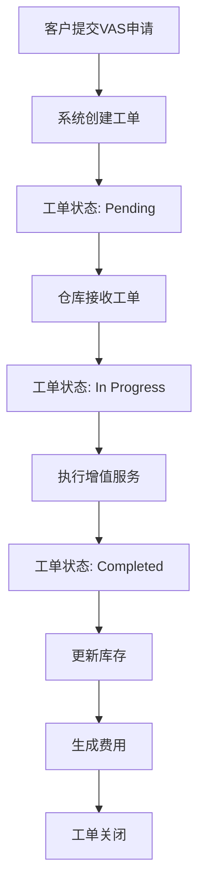
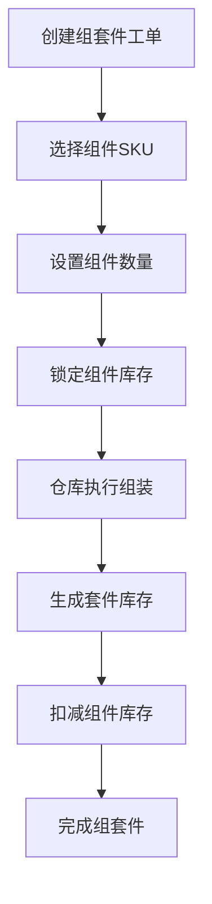
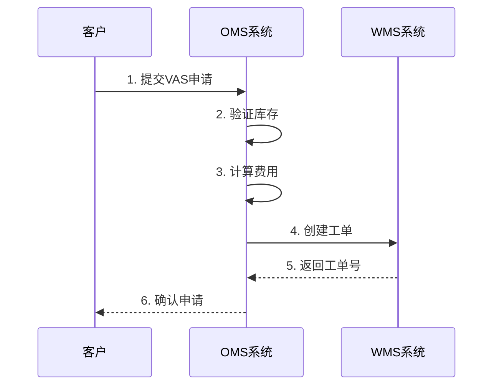
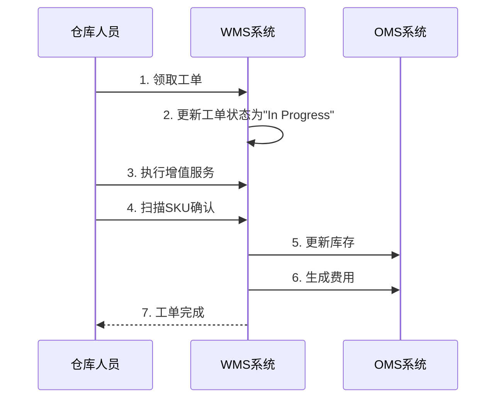
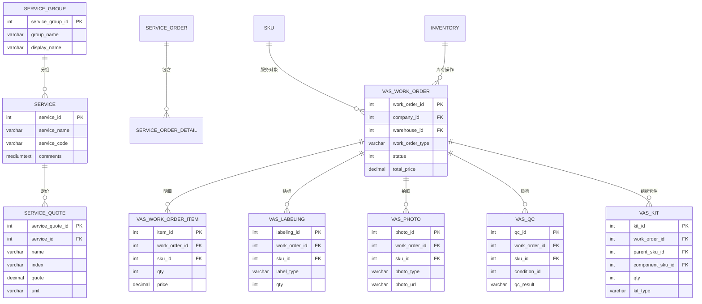

# ShipSage VAS（增值服务）模块系统文档

> **文档版本**: v1.0  
> **创建日期**: 2026-03-17  
> **适用对象**: 产品经理、业务分析师、开发人员  
> **维护说明**: 本文档聚焦 ShipSage 增值服务（VAS）系统，包括库内工单、贴标、换标、拍照、质检、组套件/拆套件等增值服务

---

## 目录

1. [文档概述](#一文档概述)
2. [系统架构](#二系统架构)
3. [核心业务流程](#三核心业务流程)
4. [数据模型](#四数据模型)
5. [增值服务类型详解](#五增值服务类型详解)
6. [库内工单系统](#六库内工单系统)
7. [系统枚举与配置](#七系统枚举与配置)
8. [实体关系图（ERD）](#八实体关系图erd)
9. [关键业务规则](#九关键业务规则)
10. [常见问题](#十常见问题)

---

## 一、文档概述

### 1.1 文档目的

本文档为产品经理和业务分析师提供 ShipSage VAS（增值服务）系统的完整背景知识和结构信息，帮助理解：

- VAS 系统的整体架构和数据流向
- 各类增值服务的定义和计费方式
- 库内工单的创建、执行、完成流程
- 增值服务与库存、订单的关系
- 关键业务概念和术语定义

### 1.2 术语表

| 术语 | 英文全称 | 说明 |
|------|----------|------|
| VAS | Value Added Service | 增值服务 |
| Work Order | Work Order | 库内工单 |
| Labeling | Labeling | 贴标/换标服务 |
| Photo Service | Photo Service | 拍照服务 |
| QC | Quality Control | 质检服务 |
| Kit Assembly | Kit Assembly | 组套件（将多个SKU组合成一个套装） |
| Kit Disassembly | Kit Disassembly | 拆套件（将套装拆分成单个SKU） |
| Repacking | Repacking | 重新包装 |
| Inventory Transfer | Inventory Transfer | 库存转移 |
| Bundle | Bundle | 商品组合 |

### 1.3 VAS 系统范围

根据 ShipSage 系统功能菜单，VAS 模块覆盖以下服务类型：

| 服务类型 | 说明 | 计费方式 |
|----------|------|----------|
| **贴标/换标** | 更换商品标签、FNSKU标签 | 按标签数量计费 |
| **拍照** | 商品拍照、质检拍照 | 按张照片计费 |
| **质检** | 商品质量检查 | 按件计费 |
| **组套件** | 将多个单品组合成套装 | 按套装数量计费 |
| **拆套件** | 将套装拆分成单品 | 按套装数量计费 |
| **重新包装** | 更换包装、加固包装 | 按件计费 |
| **销毁/处置** | 不良品销毁 | 按重量/件计费 |
| **库存转移** | 库位间转移、仓库间转移 | 按托盘/件计费 |
| **重新测量** | 商品尺寸重量重新测量 | 按件计费 |

---

## 二、系统架构

### 2.1 VAS 系统模块划分

```
ShipSage VAS System
├── 库内工单管理 (Work Order Management)
│   ├── 工单创建 (Work Order Creation)
│   ├── 工单分配 (Work Order Assignment)
│   ├── 工单执行 (Work Order Execution)
│   └── 工单完成 (Work Order Completion)
│
├── 增值服务配置 (VAS Configuration)
│   ├── 服务定义 (Service Definition)
│   ├── 服务报价 (Service Quote)
│   └── 服务计费规则 (Billing Rules)
│
├── 贴标服务 (Labeling Service)
│   ├── 贴标申请 (Label Request)
│   ├── 标签生成 (Label Generation)
│   └── 贴标执行 (Label Execution)
│
├── 拍照服务 (Photo Service)
│   ├── 拍照申请 (Photo Request)
│   ├── 照片上传 (Photo Upload)
│   └── 照片审核 (Photo Review)
│
├── 质检服务 (QC Service)
│   ├── 质检任务 (QC Task)
│   ├── 质检标准 (QC Standard)
│   └── 质检报告 (QC Report)
│
└── 组拆套件服务 (Kit Service)
    ├── 组套件 (Kit Assembly)
    ├── 拆套件 (Kit Disassembly)
    └── 套件库存管理 (Kit Inventory)
```

### 2.2 数据流向

```
客户申请增值服务
    ↓
创建库内工单 (Work Order)
    ↓
分配仓库作业人员
    ↓
执行增值服务
    ↓
更新库存状态
    ↓
生成增值服务费用
    ↓
计入客户账单
```

### 2.3 数据库架构

| 数据库 | 类型 | 用途 | VAS 相关表 |
|--------|------|------|------------|
| **app.shipsage.com** | MySQL | 业务数据库 | `app_shipsage_service*`, `app_oms_service_label*` |
| **Production** | MySQL | WMS 数据 | `GT_Relabel`, `GT_OverlabeledReport` |

---

## 三、核心业务流程

### 3.1 库内工单流程



### 3.2 贴标服务流程


### 3.3 组套件流程



---

## 四、数据模型

### 4.1 核心实体概览

| 实体 | 表名 | 说明 | 数据量 |
|------|------|------|--------|
| 服务 | `app_shipsage_service` | 服务定义 | 833 |
| 服务组 | `app_shipsage_service_group` | 服务分组 | 35 |
| 服务配置 | `app_shipsage_service_config` | 服务配置 | - |
| 服务报价 | `app_shipsage_service_quote` | 服务报价 | 7,449 |
| 客户服务报价 | `app_shipsage_service_quote_company` | 客户专属报价 | 61,469 |
| 贴标服务 | `app_oms_service_label` | 贴标服务主表 | - |
| 贴标请求 | `app_oms_service_label_request` | 贴标请求 | - |
| 贴标队列 | `app_oms_service_label_queue` | 贴标队列 | - |
| 标签追踪 | `app_oms_label_tracking` | 标签追踪 | - |
| 换标记录 | `GT_Relabel` | WMS换标记录 | - |
| 超贴报告 | `GT_OverlabeledReport` | 超贴报告 | - |

### 4.2 服务表 (app_shipsage_service)

**用途**: 定义系统中的各类服务，包括增值服务

| 字段名 | 类型 | 可空 | 说明 |
|--------|------|------|------|
| service_id | int | NOT NULL | 主键，自增 |
| service_name | varchar | NOT NULL | 服务名称 |
| service_code | varchar | NOT NULL | 服务代码 |
| comments | mediumtext | NULL | 服务说明 |
| hidden | tinyint | NOT NULL | 是否隐藏 |
| disabled | tinyint | NOT NULL | 是否禁用 |
| deleted | tinyint | NOT NULL | 是否删除 |
| created_at | timestamp | NOT NULL | 创建时间 |
| updated_at | timestamp | NOT NULL | 更新时间 |

**增值服务相关服务**:
| service_id | service_name | 说明 |
|------------|--------------|------|
| 6 | Packaging Fees | 包材费 |
| 7 | Labeling Fees | 贴标费 |
| 3003 | 4PL-Handling-Fee - No Pick & Pack for LTL | 4PL操作费 |
| 3004 | 4PL-Handling-Fee | 4PL操作费 |
| 3006 | 4PL-Handling-Fee - No Pick & Pack for LTL -ONT2 | 4PL操作费(ONT2) |

### 4.3 服务报价表 (app_shipsage_service_quote)

**用途**: 存储各类服务的报价

| 字段名 | 类型 | 可空 | 说明 |
|--------|------|------|------|
| service_quote_id | int | NOT NULL | 主键，自增 |
| service_id | int | NOT NULL | 服务 ID |
| name | varchar | NOT NULL | 报价名称 |
| index | varchar | NOT NULL | 报价索引 |
| quote | decimal | NOT NULL | 报价金额 |
| unit | varchar | NOT NULL | 单位 |
| start_date | datetime | NULL | 生效开始时间 |
| end_date | datetime | NULL | 生效结束时间 |
| hidden | tinyint | NOT NULL | 是否隐藏 |
| disabled | tinyint | NOT NULL | 是否禁用 |
| deleted | tinyint | NOT NULL | 是否删除 |
| created_at | timestamp | NOT NULL | 创建时间 |
| updated_at | timestamp | NOT NULL | 更新时间 |

**VAS 相关报价示例**:
| service_id | service_name | name | unit |
|------------|--------------|------|------|
| 3004 | 4PL-Handling-Fee | Pick & Pack | per unit |
| 3004 | 4PL-Handling-Fee | Palletizing | per pallet |
| 3004 | 4PL-Handling-Fee | Pallet Breakdown | per pallet |
| 3004 | 4PL-Handling-Fee | SFP Surcharge | per unit |
| 3003 | 4PL-Handling-Fee - No Pick & Pack for LTL | Carton Sorting | per carton |
| 3003 | 4PL-Handling-Fee - No Pick & Pack for LTL | DropShip Surcharge | per package |

### 4.4 贴标服务表 (app_oms_service_label)

**用途**: 存储贴标服务信息

| 字段名 | 类型 | 可空 | 说明 |
|--------|------|------|------|
| label_id | int | NOT NULL | 主键，自增 |
| company_id | int | NOT NULL | 客户 ID |
| warehouse_id | int | NOT NULL | 仓库 ID |
| sku_id | int | NOT NULL | SKU ID |
| label_type | varchar | NOT NULL | 标签类型 |
| qty | int | NOT NULL | 贴标数量 |
| status | tinyint | NOT NULL | 状态 |
| hidden | tinyint | NOT NULL | 是否隐藏 |
| disabled | tinyint | NOT NULL | 是否禁用 |
| deleted | tinyint | NOT NULL | 是否删除 |
| created_at | timestamp | NOT NULL | 创建时间 |
| updated_at | timestamp | NOT NULL | 更新时间 |

### 4.5 贴标请求表 (app_oms_service_label_request)

**用途**: 存储贴标请求详情

| 字段名 | 类型 | 可空 | 说明 |
|--------|------|------|------|
| request_id | int | NOT NULL | 主键，自增 |
| company_id | int | NOT NULL | 客户 ID |
| label_id | int | NOT NULL | 贴标服务 ID |
| request_type | varchar | NOT NULL | 请求类型 |
| request_data | json | NULL | 请求数据 |
| status | tinyint | NOT NULL | 状态 |
| created_at | timestamp | NOT NULL | 创建时间 |
| updated_at | timestamp | NOT NULL | 更新时间 |

### 4.6 标签追踪表 (app_oms_label_tracking)

**用途**: 追踪标签状态

| 字段名 | 类型 | 可空 | 说明 |
|--------|------|------|------|
| tracking_id | int | NOT NULL | 主键，自增 |
| label_id | int | NOT NULL | 标签 ID |
| tracking_number | varchar | NOT NULL | 追踪号 |
| status | tinyint | NOT NULL | 状态 |
| event_time | timestamp | NOT NULL | 事件时间 |
| created_at | timestamp | NOT NULL | 创建时间 |

---

## 五、增值服务类型详解

### 5.1 贴标/换标服务

**服务说明**:
- 更换商品标签（如 FNSKU 标签）
- 贴新标签
- 覆盖旧标签

**计费方式**:
- 按标签数量计费
- 单价：$0.48/标签（参考值）

**状态流转**:
```
Pending → In Progress → Completed → Closed
```

### 5.2 拍照服务

**服务说明**:
- 商品外观拍照
- 质检拍照
- 包装拍照

**计费方式**:
- 按张照片计费
- 单价：$0.48/张照片（参考值）

### 5.3 质检服务

**服务说明**:
- 商品质量检查
- 包装检查
- 数量核对

**计费方式**:
- 按件计费
- 单价根据质检复杂度定价

### 5.4 组套件服务

**服务说明**:
- 将多个单品组合成一个套装（Bundle/Kit）
- 生成新的 SKU

**计费方式**:
- 按套装数量计费
- 或按组件数量计费

**库存影响**:
```
组件 SKU 库存减少
套件 SKU 库存增加
```

### 5.5 拆套件服务

**服务说明**:
- 将套装拆分成单品
- 恢复原始 SKU

**计费方式**:
- 按套装数量计费

**库存影响**:
```
套件 SKU 库存减少
组件 SKU 库存增加
```

### 5.6 重新包装服务

**服务说明**:
- 更换破损包装
- 加固包装
- 更换包材

**计费方式**:
- 按件计费
- 包材费另计

### 5.7 销毁/处置服务

**服务说明**:
- 不良品销毁
- 过期商品处置

**计费方式**:
- 按重量计费（$/kg）
- 或按件计费

---

## 六、库内工单系统

### 6.1 工单类型

| 工单类型 | 说明 | 对应服务 |
|----------|------|----------|
| Labeling | 贴标工单 | 贴标/换标服务 |
| Photo | 拍照工单 | 拍照服务 |
| QC | 质检工单 | 质检服务 |
| Kit Assembly | 组套件工单 | 组套件服务 |
| Kit Disassembly | 拆套件工单 | 拆套件服务 |
| Repacking | 重新包装工单 | 重新包装服务 |
| Disposal | 销毁工单 | 销毁服务 |
| Inventory Transfer | 库存转移工单 | 库存转移服务 |

### 6.2 工单状态

| 状态码 | 状态 | 说明 |
|--------|------|------|
| 1 | Pending | 待处理 |
| 2 | In Progress | 进行中 |
| 3 | Completed | 已完成 |
| 4 | Cancelled | 已取消 |
| 5 | On Hold | 暂停 |

### 6.3 工单创建流程



### 6.4 工单执行流程



---

## 七、系统枚举与配置

### 7.1 服务类型枚举

| service_type_id | service_type | 说明 |
|-----------------|--------------|------|
| 1 | Storage | 仓储服务 |
| 2 | Receiving | 入库服务 |
| 3 | Handling | 操作服务 |
| 4 | Shipping | 运费服务 |
| 5 | Return | 退货服务 |
| 6 | VAS | 增值服务 |

### 7.2 VAS 子类型

| vas_type_id | vas_type | 说明 |
|-------------|----------|------|
| 1 | Labeling | 贴标 |
| 2 | Photo | 拍照 |
| 3 | QC | 质检 |
| 4 | Kit Assembly | 组套件 |
| 5 | Kit Disassembly | 拆套件 |
| 6 | Repacking | 重新包装 |
| 7 | Disposal | 销毁 |
| 8 | Inventory Transfer | 库存转移 |

### 7.3 工单优先级

| priority_id | priority | 说明 |
|-------------|----------|------|
| 1 | Low | 低 |
| 2 | Medium | 中 |
| 3 | High | 高 |
| 4 | Urgent | 紧急 |

---

## 八、实体关系图 (ERD)



---

## 九、关键业务规则

### 9.1 工单创建规则

1. **库存检查**: 创建工单前必须检查库存是否充足
2. **费用预估**: 系统自动计算预估费用
3. **余额检查**: 如开启自动扣款，需检查余额是否充足
4. **工单编号**: 自动生成唯一工单号

### 9.2 工单执行规则

1. **状态流转**: Pending → In Progress → Completed
2. **库存锁定**: 工单创建时锁定库存，执行时扣减
3. **部分完成**: 支持部分完成，剩余数量可继续执行
4. **取消规则**: 只有 Pending 状态的工单可取消

### 9.3 费用计算规则

```
VAS 费用 = 服务单价 × 数量

总费用 = Σ(各服务费用)
```

**费用类型**:
| 费用项 | 计算方式 | 说明 |
|--------|----------|------|
| 贴标费 | $0.48 × 标签数量 | 每张贴标 |
| 拍照费 | $0.48 × 照片数量 | 每张照片 |
| 质检费 | 单价 × 件数 | 按件计费 |
| 组套件费 | 单价 × 套装数 | 按套装计费 |
| 包材费 | 包材单价 × 数量 | 包材费用 |

### 9.4 库存更新规则

1. **贴标**: 库存数量不变，SKU 可能变更
2. **拍照**: 库存数量不变
3. **质检**: 库存状态可能变更（良品→不良品）
4. **组套件**: 组件库存减少，套件库存增加
5. **拆套件**: 套件库存减少，组件库存增加
6. **销毁**: 库存数量减少

### 9.5 数据隔离规则

**三维隔离**: `company_id` + `warehouse_id` + `work_order_id`

- 客户只能查看自己公司的工单
- 仓库人员只能查看所属仓库的工单
- 工单号全局唯一

---

## 十、常见问题

### Q1: 如何创建增值服务工单？

**步骤**:
1. 在 OMS 系统选择增值服务类型
2. 选择需要操作的 SKU
3. 填写数量和其他信息
4. 系统生成工单并分配仓库
5. 仓库人员执行工单

### Q2: 如何查询增值服务费用？

**查询表**:
- `app_shipsage_service_quote` - 标准报价
- `app_shipsage_service_quote_company` - 客户专属报价
- `app_shipsage_balance_handling_fees` - 操作费用明细
- `app_shipsage_balance_misc_fees` - 杂费明细

```sql
-- 查询客户增值服务报价
SELECT * FROM app_shipsage_service_quote_company 
WHERE company_id = {company_id} 
  AND service_id IN (SELECT service_id FROM app_shipsage_service 
                     WHERE service_name LIKE '%Label%' OR service_name LIKE '%Photo%');
```

### Q3: 组套件和拆套件的库存如何变化？

**组套件**:
```
组件 A 库存: 100 → 90 (减少 10)
组件 B 库存: 100 → 90 (减少 10)
套件 AB 库存: 0 → 10 (增加 10)
```

**拆套件**:
```
套件 AB 库存: 10 → 0 (减少 10)
组件 A 库存: 90 → 100 (增加 10)
组件 B 库存: 90 → 100 (增加 10)
```

### Q4: 如何追踪贴标服务状态？

**查询表**: `app_oms_label_tracking`

```sql
-- 查询标签追踪
SELECT * FROM app_oms_label_tracking 
WHERE label_id = {label_id} 
ORDER BY event_time DESC;
```

### Q5: VAS 工单支持哪些批量操作？

**支持的批量操作**:
1. 批量创建工单
2. 批量分配工单
3. 批量完成工单
4. 批量导出工单
5. 批量打印标签

---

## 附录：数据表汇总

| 表名 | 用途 | 数据量 | 核心字段 |
|------|------|--------|----------|
| app_shipsage_service | 服务定义 | 833 | service_id, service_name, service_code |
| app_shipsage_service_group | 服务组 | 35 | service_group_id, group_name |
| app_shipsage_service_config | 服务配置 | - | service_config_id, service_code, fee_version_id |
| app_shipsage_service_quote | 服务报价 | 7,449 | service_quote_id, service_id, quote, unit |
| app_shipsage_service_quote_company | 客户服务报价 | 61,469 | service_quote_vip_id, company_id, service_id |
| app_oms_service_label | 贴标服务 | - | label_id, company_id, sku_id, qty |
| app_oms_service_label_request | 贴标请求 | - | request_id, label_id, request_type |
| app_oms_service_label_queue | 贴标队列 | - | queue_id, label_id, status |
| app_oms_label_tracking | 标签追踪 | - | tracking_id, label_id, tracking_number |
| GT_Relabel | WMS换标记录 | - | - |
| GT_OverlabeledReport | 超贴报告 | - | - |

---

**文档维护记录**:

| 版本 | 日期 | 修改人 | 修改内容 |
|------|------|--------|----------|
| v1.0 | 2026-03-17 | AI Assistant | 初始版本，聚焦 VAS 增值服务模块 |

---

**注**: 本文档聚焦 ShipSage 增值服务（VAS）模块，不包括退货管理和转运计划（已在其他文档中覆盖）。如需了解退货和转运相关内容，请参考《ShipSage_订单模块系统文档》和《ShipSage_Billing_系统文档》。
