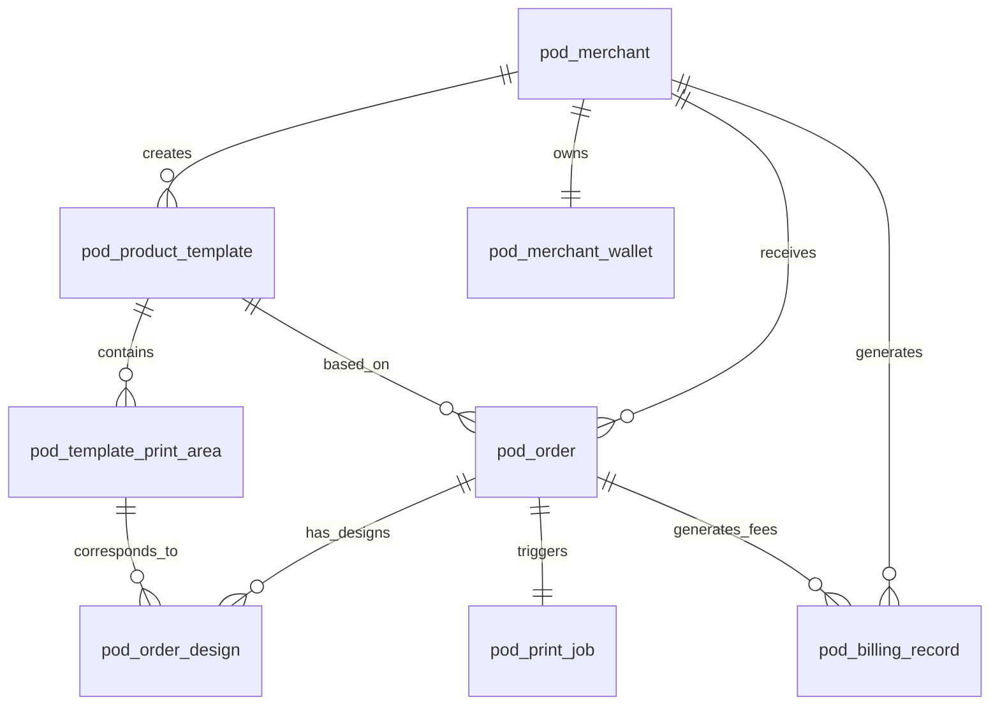

# POD产品定制设计器 — 核心方案架构设计

> **文档版本**: v1.0
> **创建日期**: 2026-03-17
> **阶段**: Phase 2 方案架构
> **依赖**: drafts/2026-03-17-POD设计器需求分析/RDD.md

---

## 一、系统架构总览

### 1.1 整体分层

```
[ 消费者端 Shopify商品页 ]
        ↓ 嵌入
[ Design Studio Widget ] ←→ [ POD Core API ]
        ↓ 定制订单+印刷参数
[ Shopify App 商家后台 ] ←→ [ POD Core API ]
        ↓ 标准化订单+印刷工单
[ ShipSage 现有系统 ]
  APP DB (app_oms_order_queue)
  ERP DB (GT_Transaction → SD流程)
  WMS DB (wms_shipment / 印刷队列)
```

### 1.2 新增表归属数据库

| 新增表 | 归属DB | 理由 |
|--------|--------|------|
| pod_merchant | APP DB | 商家账户，OMS管理域 |
| pod_merchant_wallet | APP DB | 钱包余额，计费域 |
| pod_product_template | APP DB | 商品配置，OMS管理域 |
| pod_template_print_area | APP DB | 印刷区域配置 |
| pod_template_variant | APP DB | 商品变体 |
| pod_design_asset | APP DB | 消费者上传的设计文件 |
| pod_order | APP DB | POD订单接入层 |
| pod_order_design | APP DB | 订单定制信息 |
| pod_billing_record | APP DB | 费用明细，计费域 |
| pod_print_job | WMS DB | 印刷作业，仓库执行域 |

---

## 二、核心实体数据模型

### 2.1 聚合根（DDD视角）

```
聚合根1: pod_product_template（商品模板）
  ├── pod_template_variant（尺码/颜色变体）
  └── pod_template_print_area（印刷区域配置）

聚合根2: pod_order（定制订单）
  ├── pod_order_design（各印刷面设计文件）
  └── pod_print_job（印刷作业，WMS DB）

聚合根3: pod_merchant（商家账户）
  ├── pod_merchant_wallet（钱包）
  └── pod_billing_record（费用明细）
```

---

### 2.2 pod_merchant — 商家账户表

> 存储在POD平台注册的Shopify商家信息，一个Shopify店铺对应一个merchant记录。

| 字段名 | 类型 | 必填 | 约束 | 说明 |
|--------|------|------|------|------|
| `id` | BigInt | Yes | PK | 雪花ID |
| `company_id` | Int | Yes | INDEX | ShipSage company_id，多货主隔离 |
| `merchant_no` | String(32) | Yes | UNIQUE | MCH+yyyyMMdd+6位SEQ |
| `shopify_shop_domain` | String(255) | Yes | UNIQUE,INDEX | xxx.myshopify.com |
| `shopify_access_token` | String(255) | Yes | - | 加密存储 |
| `shopify_webhook_id` | String(100) | No | - | 订单webhook注册ID |
| `contact_email` | String(255) | Yes | INDEX | 商家联系邮箱 |
| `status` | TinyInt | Yes | INDEX | 1:试用 2:活跃 3:暂停 4:注销 |
| `wallet_balance` | Decimal(20,6) | Yes | - | 钱包余额（冗余，主数据在wallet表）|
| `plan_type` | TinyInt | Yes | - | 1:免费版 2:专业版($29/月) |
| `created_at` | DateTime | Yes | - | |
| `updated_at` | DateTime | Yes | - | |
| `is_deleted` | TinyInt(1) | Yes | - | Default:0 |
| `version` | Int | Yes | - | 乐观锁 |

---

### 2.3 pod_product_template — 商品模板表

> 商家创建的可定制商品模板，定义品类、印刷工艺、定价、是否允许消费者定制。

| 字段名 | 类型 | 必填 | 约束 | 说明 |
|--------|------|------|------|------|
| `id` | BigInt | Yes | PK | 雪花ID |
| `company_id` | Int | Yes | INDEX | 多货主隔离必带 |
| `merchant_id` | BigInt | Yes | INDEX | 关联pod_merchant |
| `template_no` | String(32) | Yes | UNIQUE | TPL+yyyyMMdd+6位SEQ |
| `title` | String(255) | Yes | - | 商品标题 |
| `product_type` | TinyInt | Yes | INDEX | 1:T恤 2:马克杯 3:手机壳 4:卫衣 5:帆布包 |
| `blank_sku` | String(100) | Yes | INDEX | 仓库备货的空白品SKU |
| `shopify_product_id` | String(100) | No | INDEX | 同步Shopify后回填 |
| `print_technology` | TinyInt | Yes | - | 1:DTG直喷 2:升华转印 3:UV打印 |
| `base_price` | Decimal(20,6) | Yes | - | 基础售价（美元）|
| `custom_fee` | Decimal(20,6) | Yes | - | 定制加价（消费者定制额外收取）|
| `production_cost` | Decimal(20,6) | Yes | - | 生产成本（内部）|
| `status` | TinyInt | Yes | INDEX | 1:草稿 2:已发布 3:已下架 |
| `allow_consumer_design` | TinyInt(1) | Yes | - | 1:允许消费者定制 0:固定款 |
| `mockup_front_url` | String(500) | No | - | 正面效果图S3地址 |
| `mockup_back_url` | String(500) | No | - | 背面效果图S3地址 |
| `created_at` | DateTime | Yes | - | |
| `updated_at` | DateTime | Yes | - | |
| `is_deleted` | TinyInt(1) | Yes | - | Default:0 |
| `version` | Int | Yes | - | 乐观锁 |

**关联**: One-to-Many → `pod_template_print_area`（印刷区域）

---

### 2.4 pod_template_print_area — 印刷区域配置表

> 定义商品模板的各印刷面（正面/背面/袖子等），以及印刷区域坐标和消费者可操作范围。

| 字段名 | 类型 | 必填 | 约束 | 说明 |
|--------|------|------|------|------|
| `id` | BigInt | Yes | PK | 雪花ID |
| `template_id` | BigInt | Yes | INDEX | 关联pod_product_template |
| `company_id` | Int | Yes | INDEX | 冗余，便于隔离 |
| `face` | TinyInt | Yes | - | 1:正面 2:背面 3:左袖 4:右袖 5:领口 |
| `canvas_width` | Int | Yes | - | 编辑器画布宽(px) |
| `canvas_height` | Int | Yes | - | 编辑器画布高(px) |
| `print_area_x` | Int | Yes | - | 印刷区X坐标（相对画布左上角）|
| `print_area_y` | Int | Yes | - | 印刷区Y坐标 |
| `print_area_w` | Int | Yes | - | 印刷区宽度(px) |
| `print_area_h` | Int | Yes | - | 印刷区高度(px) |
| `print_area_w_mm` | Decimal(8,2) | Yes | - | 实际印刷宽度(mm)，换算DPI用 |
| `print_area_h_mm` | Decimal(8,2) | Yes | - | 实际印刷高度(mm) |
| `is_consumer_editable` | TinyInt(1) | Yes | - | 1:消费者可编辑此区域 |
| `is_required` | TinyInt(1) | Yes | - | 1:消费者必须上传内容才可下单 |
| `preview_image_url` | String(500) | Yes | - | 商品底图（Design Studio渲染用）|
| `sort_order` | Int | Yes | - | 多印刷面显示顺序 |
| `created_at` | DateTime | Yes | - | |
| `is_deleted` | TinyInt(1) | Yes | - | Default:0 |
| `version` | Int | Yes | - | 乐观锁 |
### 2.5 pod_order — POD定制订单表

> POD订单接入层，从Shopify Webhook接收后存入此表，再创建GT_Transaction进入SD流程。

| 字段名 | 类型 | 必填 | 约束 | 说明 |
|--------|------|------|------|------|
| `id` | BigInt | Yes | PK | 雪花ID |
| `company_id` | Int | Yes | INDEX | 多货主隔离 |
| `merchant_id` | BigInt | Yes | INDEX | 关联pod_merchant |
| `pod_order_no` | String(32) | Yes | UNIQUE | POD+yyyyMMdd+8位SEQ |
| `shopify_order_id` | String(100) | Yes | UNIQUE,INDEX | Shopify原始订单ID |
| `shopify_order_no` | String(50) | Yes | INDEX | 展示给消费者的订单号 |
| `trx_id` | String(100) | No | INDEX | GT_Transaction创建后回填 |
| `template_id` | BigInt | Yes | INDEX | 关联pod_product_template |
| `product_type` | TinyInt | Yes | - | 冗余，避免JOIN（1:T恤 2:马克杯 3:手机壳）|
| `blank_sku` | String(100) | Yes | INDEX | 消耗的空白品SKU |
| `variant_id` | BigInt | No | INDEX | 关联pod_template_variant（尺码/颜色）|
| `quantity` | Int | Yes | - | 数量 |
| `consumer_name` | String(100) | Yes | - | 消费者姓名 |
| `shipping_address` | JSON | Yes | - | {name,address1,city,state,zip,country} |
| `warehouse_id` | Int | No | INDEX | 分配的仓库，自动选仓后回填 |
| `retail_price` | Decimal(20,6) | Yes | - | 消费者实付金额（美元）|
| `production_cost` | Decimal(20,6) | Yes | - | 生产成本（空白品+印刷）|
| `shipping_cost` | Decimal(20,6) | No | - | 运费，发运后回填 |
| `platform_fee` | Decimal(20,6) | Yes | - | 平台服务费 |
| `merchant_profit` | Decimal(20,6) | No | - | 商家利润=零售价-生产成本-运费-平台费 |
| `status` | TinyInt | Yes | INDEX | 见下方枚举 |
| `file_check_status` | TinyInt | Yes | INDEX | 1:待检测 2:通过 3:DPI不足警告 4:已拦截 |
| `print_file_url` | String(500) | No | - | 生成的印刷文件S3地址 |
| `cancel_reason` | String(255) | No | - | 取消原因 |
| `created_at` | DateTime | Yes | - | |
| `updated_at` | DateTime | Yes | - | |
| `is_deleted` | TinyInt(1) | Yes | - | Default:0 |
| `version` | Int | Yes | - | 乐观锁（防并发重复处理）|

**status枚举**:
```
1: PENDING_DESIGN_CHECK  — 待文件检测
2: DESIGN_APPROVED       — 文件通过，等待生产
3: DESIGN_REJECTED       — 文件不合格，通知商家
4: IN_PRODUCTION         — 生产中（已创建print_job）
5: PRODUCTION_DONE       — 生产完成，等待发运
6: SHIPPED               — 已发运（trx_id已创建，SD流程完成）
7: DELIVERED             — 已签收
8: CANCELLED             — 已取消
9: REFUNDED              — 已退款
```

**关联**: One-to-Many → `pod_order_design`（各印刷面设计数据）

---

### 2.6 pod_order_design — 订单设计文件表

> 存储消费者在Design Studio中完成的设计数据，每个印刷面一条记录。

| 字段名 | 类型 | 必填 | 约束 | 说明 |
|--------|------|------|------|------|
| `id` | BigInt | Yes | PK | 雪花ID |
| `pod_order_id` | BigInt | Yes | INDEX | 关联pod_order |
| `company_id` | Int | Yes | INDEX | 多货主隔离 |
| `print_area_id` | BigInt | Yes | INDEX | 关联pod_template_print_area |
| `face` | TinyInt | Yes | - | 1:正面 2:背面 3:左袖 4:右袖 |
| `design_canvas_json` | JSON | Yes | - | Fabric.js画布序列化JSON（完整设计数据）|
| `design_preview_url` | String(500) | Yes | - | 消费者设计预览图S3地址 |
| `print_file_url` | String(500) | No | - | 高清印刷文件S3地址（生成后填入）|
| `print_file_dpi` | Int | No | - | 印刷文件DPI，检测后填入 |
| `original_image_urls` | JSON | No | - | 消费者上传的原始图片地址列表 |
| `text_layers` | JSON | No | - | 文字图层数据快照（便于搜索）|
| `file_check_status` | TinyInt | Yes | - | 1:待检 2:通过 3:DPI不足 4:尺寸超出 5:内容违规 |
| `file_check_message` | String(500) | No | - | 检测失败原因描述 |
| `created_at` | DateTime | Yes | - | |
| `updated_at` | DateTime | Yes | - | |
| `is_deleted` | TinyInt(1) | Yes | - | Default:0 |

---

### 2.7 pod_print_job — 印刷作业表（WMS DB）

> 存储在WMS DB，由仓库操作员执行。对应VAS模块中的工单概念，是印刷任务的执行载体。

| 字段名 | 类型 | 必填 | 约束 | 说明 |
|--------|------|------|------|------|
| `id` | BigInt | Yes | PK | 雪花ID |
| `pod_order_no` | String(32) | Yes | UNIQUE,INDEX | 冗余pod_order_no，跨库关联用 |
| `company_id` | Int | Yes | INDEX | 多货主隔离 |
| `warehouse_id` | Int | Yes | INDEX | 执行印刷的仓库ID |
| `product_type` | TinyInt | Yes | - | 1:T恤 2:马克杯 3:手机壳 |
| `blank_sku` | String(100) | Yes | INDEX | 领取的空白品SKU |
| `quantity` | Int | Yes | - | 印刷数量 |
| `print_technology` | TinyInt | Yes | - | 1:DTG 2:升华转印 3:UV打印 |
| `print_files` | JSON | Yes | - | 各印刷面文件URL列表 [{face,url,dpi}] |
| `status` | TinyInt | Yes | INDEX | 见下方枚举 |
| `assigned_to` | Int | No | INDEX | 分配的操作员user_id |
| `started_at` | DateTime | No | - | 开始印刷时间 |
| `finished_at` | DateTime | No | - | 完成印刷时间 |
| `qc_result` | TinyInt | No | - | 1:合格 2:不合格需补打 |
| `qc_notes` | String(500) | No | - | 质检备注 |
| `reprint_count` | Int | Yes | - | 补打次数，Default:0 |
| `created_at` | DateTime | Yes | - | |
| `updated_at` | DateTime | Yes | - | |
| `is_deleted` | TinyInt(1) | Yes | - | Default:0 |
| `version` | Int | Yes | - | 乐观锁 |

**status枚举**:
```
1: PENDING    — 待执行（印刷队列中）
2: IN_PROGRESS — 印刷中
3: QC_PENDING  — 待质检
4: COMPLETED   — 质检合格，等待发运
5: REPRINTING  — 质检不合格，补打中
6: FAILED      — 无法完成，需人工介入
```

---

### 2.8 pod_billing_record — 费用明细表

> 每笔POD订单产生的费用明细，可追溯到具体订单，与ShipSage计费规则一致。

| 字段名 | 类型 | 必填 | 约束 | 说明 |
|--------|------|------|------|------|
| `id` | BigInt | Yes | PK | 雪花ID |
| `company_id` | Int | Yes | INDEX | 多货主隔离 |
| `merchant_id` | BigInt | Yes | INDEX | 关联pod_merchant |
| `pod_order_no` | String(32) | Yes | INDEX | 关联pod_order |
| `fee_type` | TinyInt | Yes | INDEX | 1:空白品成本 2:印刷费 3:运费 4:平台服务费 5:退款 |
| `amount` | Decimal(20,6) | Yes | - | 金额（美元，正数为扣费，负数为退款）|
| `currency` | String(3) | Yes | - | Default:USD |
| `description` | String(255) | Yes | - | 费用说明 |
| `wallet_balance_before` | Decimal(20,6) | Yes | - | 扣费前余额（审计用）|
| `wallet_balance_after` | Decimal(20,6) | Yes | - | 扣费后余额（审计用）|
| `status` | TinyInt | Yes | INDEX | 1:待结算 2:已结算 3:已退款 |
| `settled_at` | DateTime | No | - | 结算时间 |
| `created_at` | DateTime | Yes | - | |
| `is_deleted` | TinyInt(1) | Yes | - | Default:0 |
## 三、ER关系图



**跨库关联说明**：
- `pod_order.trx_id` → `GT_Transaction.trx_id`（APP DB→ERP DB，只存ID，禁止跨库JOIN）
- `pod_print_job.pod_order_no` → `pod_order.pod_order_no`（WMS DB→APP DB，冗余字段）
- 跨库数据通过API层聚合返回
## 四、核心业务流程

### 4.1 正向流程：消费者定制下单 → 生产发运

```
[消费者] 点击「自定义设计」
   ↓
[Design Studio] 加载印刷区域配置（GET /templates/{id}/studio-config）
   ↓
[消费者] 上传图片/输入文字/调整布局，实时预览
   ↓
[消费者] 点击「Add to Cart」
   ↓
[POD API] 保存设计数据，返回 design_token
   ↓
[Shopify] 消费者完成结账（orders/paid Webhook触发）
   ↓
[POD API] 创建 pod_order（status=PENDING_DESIGN_CHECK）
   ↓
[POD API] 异步生成高清印刷文件，检测DPI
   ├── DPI >= 150 → status=DESIGN_APPROVED
   │     ↓
   │   扣减商家钱包（创建 pod_billing_record）
   │     ↓
   │   创建 GT_Transaction，进入 SD 流程
   │   Confirm → Group → AllocateInventory（锁定空白品qty_allocated）
   │   → CreateShipment → Label → SyncToWMS
   │     ↓
   │   WMS 创建 pod_print_job（status=PENDING）
   │     ↓
   │   仓库操作员：领取空白品 → 印刷 → 质检
   │   ├── 质检合格 → print_job status=COMPLETED
   │   │     ↓ 触发发运，物流单号回传
   │   │   pod_order status=SHIPPED
   │   │   Shopify订单更新物流信息，发送消费者通知邮件
   │   └── 质检不合格 → status=REPRINTING，补打
   └── DPI < 150 → status=DESIGN_REJECTED
         ↓
       通知商家处理（邮件+App内通知）
       超过24小时未处理 → 自动退款
```

### 4.2 逆向流程：取消/退款

```
消费者申请退款
   ↓
判断订单状态：
├── PENDING_DESIGN_CHECK → 直接取消，全额退款至商家钱包
├── DESIGN_APPROVED（未生产）→ 取消GT_Transaction，退款至商家钱包
├── IN_PRODUCTION
│   ├── 印刷未开始 → 取消print_job，退款生产成本
│   └── 印刷已开始 → 不可取消，仅退运费
├── SHIPPED → 走ShipSage退货流程（创建Return ASN）
└── DELIVERED → 按退货政策处理
```

### 4.3 商家配置商品模板流程

```
[商家] 安装Shopify App
   ↓
[商家] 选择品类（T恤）→ 选择空白品SKU
   ↓
[商家] 配置印刷区域（正面/背面），设置消费者可编辑范围
   ↓
[商家] 上传商品底图（Design Studio预览用）
   ↓
[商家] 设置定价：基础价$29 + 定制加价$5
   ↓
[POD API] 创建 pod_product_template + pod_template_print_area
   ↓
[POD API] 调用 Shopify API 创建商品，回填 shopify_product_id
   ↓
[商家] 商品发布完成，消费者可在店铺内看到并定制
```
## 五、风险探测报告

### P0 — MVP必须解决

| # | 风险场景 | 风险维度 | 解决方案 |
|---|---------|---------|----------|
| R01 | 消费者上传Disney/Nike等版权图案，商家面临DMCA侵权 | 合规 | 上传时调用AWS Rekognition检测已知IP；用户协议免责；建立DMCA快速响应流程 |
| R02 | 付款后印刷文件DPI不足，订单卡死无法自动处理 | 一致性 | 检测不通过立即通知商家（邮件+App）；超24小时未处理自动退款 |
| R03 | 消费者设计途中断网，设计数据丢失 | 可用性 | Design Studio每30秒LocalStorage自动保存；重新打开提示「恢复上次设计」 |
| R04 | Shopify Webhook重复推送，同一订单创建两次pod_order | 并发 | `shopify_order_id`设UNIQUE约束；Redis SETNX幂等锁（TTL=30s）|
| R05 | 商家钱包余额不足，订单无法扣款，印刷无法启动 | 业务逻辑 | 订单接入时先校验余额；余额不足立即通知补充；余额低于$50提前预警 |

### P1 — 首个迭代解决

| # | 风险场景 | 风险维度 | 解决方案 |
|---|---------|---------|----------|
| R06 | 多人同时抢购最后一件空白品，超卖 | 并发/库存 | AllocateInventory步骤SELECT FOR UPDATE + version乐观锁；库存耗尽自动下架Shopify商品 |
| R07 | 印刷设备故障，大量订单积压 | 可用性 | print_job超4小时未开始印刷触发告警；支持手动指定备用仓库重新路由 |
| R08 | 消费者上传违规内容（色情/暴力），已生产才发现 | 内容安全 | 文件检测阶段增加内容安全审核；高风险内容自动拦截+人工审核 |
| R09 | 商家卸载Shopify App，在途订单中断 | 系统集成 | 监听`app/uninstalled` Webhook；在途订单继续处理；数据保留90天 |
| R10 | 印刷颜色偏差（RGB vs CMYK），消费者投诉 | 质量 | 设计器加颜色模式提示；建立样品审核流程；退换货政策明确覆盖颜色偏差 |

### P2 — 二期解决

| # | 风险场景 | 解决方案 |
|---|---------|----------|
| R11 | 低端Android手机渲染卡顿 | 限制画布元素上限；低性能设备降级简化模式 |
| R12 | 商家删除模板，已有订单关联丢失 | 软删除模板；订单设计数据快照冗余存储 |
| R13 | S3存储成本随订单量线性增长 | 印刷完成30天后自动归档至S3 Glacier |

---

## 六、核心API接口设计

### 6.1 获取Design Studio配置
```http
GET /api/pod/templates/{template_id}/studio-config
Authorization: Bearer {shopify_session_token}

Response 200:
{
  "template_id": 123,
  "product_type": 1,
  "allow_consumer_design": true,
  "print_areas": [
    {
      "print_area_id": 1,
      "face": 1,
      "canvas_width": 1200,
      "canvas_height": 1600,
      "print_area": { "x": 200, "y": 300, "w": 800, "h": 900 },
      "print_area_mm": { "w": 280, "h": 320 },
      "preview_image_url": "https://cdn.../tshirt_front.png",
      "is_consumer_editable": true,
      "is_required": true
    }
  ]
}
```

### 6.2 保存设计数据
```http
POST /api/pod/designs
Authorization: Bearer {shopify_session_token}

Body:
{
  "template_id": 123,
  "shopify_variant_id": "456",
  "designs": [
    {
      "face": 1,
      "canvas_json": "{...fabric.js序列化JSON...}",
      "preview_image_base64": "data:image/png;base64,..."
    }
  ]
}

Response 200:
{
  "design_token": "DSN_20260317_a1b2c3d4"  // 加入购物车时作为line_item属性传递
}
```

### 6.3 Shopify Webhook接单
```http
POST /api/pod/webhooks/shopify/orders-paid
X-Shopify-Hmac-Sha256: {签名验证}

Body: {Shopify标准order对象}
// line_items[].properties中包含 { name: "_design_token", value: "DSN_xxx" }

Response 200: { "received": true }
// 异步处理，不阻塞Webhook响应
```

### 6.4 查询订单生产状态（商家端）
```http
GET /api/pod/orders/{pod_order_no}/status
Authorization: Bearer {merchant_token}

Response 200:
{
  "pod_order_no": "POD20260317000001",
  "status": 4,
  "status_label": "IN_PRODUCTION",
  "print_job": {
    "status": 2,
    "status_label": "IN_PROGRESS",
    "warehouse": "SG-ONT1",
    "started_at": "2026-03-17T10:30:00Z"
  },
  "tracking_no": null,
  "estimated_ship_date": "2026-03-18"
}
```

---

## 七、MVP技术选型确认

| 组件 | 选型 | 理由 |
|------|------|------|
| 设计编辑器 | Fabric.js 5.x | 成熟Canvas库，支持序列化/反序列化，社区活跃 |
| Mockup生成 | Dynamic Mockups API | 专为POD设计，实时渲染，无需自建 |
| 印刷文件生成 | 服务端Canvas渲染（Node.js + canvas库）| 高DPI文件生成，不依赖客户端 |
| 图片存储 | AWS S3 | 已与ShipSage现有系统一致 |
| Shopify集成 | Shopify App Bridge + Polaris | 官方SDK，符合App Store规范 |
| 幂等控制 | Redis SETNX | 已有Redis基础设施 |
| 内容审核 | AWS Rekognition | 与AWS S3同生态，集成简单 |

---

## 八、Checkpoint — 方案闭环确认

以下内容已覆盖，请确认逻辑是否闭环：

- [x] 核心实体模型（8张表，归属数据库明确）
- [x] ER关系图（含跨库关联说明）
- [x] 正向业务流程（定制→下单→生产→发运）
- [x] 逆向流程（取消/退款各状态处理）
- [x] 与ShipSage SD流程的集成点（GT_Transaction + SyncToWMS）
- [x] 风险探测（P0×5 + P1×5 + P2×3，共13条）
- [x] 核心API接口（4个）
- [x] 技术选型

**待确认**：方案逻辑是否闭环？是否可以进入 Phase 3 Specs生成阶段？


---

## 九、仓库绑定模式分析

### 9.1 当前架构是「强绑定ShipSage仓库」模式

当前设计中，订单履约链路完全在ShipSage体系内闭环：

```
pod_order 创建
   ↓
创建 GT_Transaction（ERP DB）→ ShipSage SD流程
   ↓
AllocateInventory → 锁定 ShipSage 仓库内的空白品 qty_allocated
   ↓
SyncToWMS → ShipSage WMS 执行印刷+发运
```

这意味着：**空白品必须事先在 ShipSage 仓库中存在**，商家无法绕过ShipSage使用自有仓库发货。

### 9.2 三种仓库模式对比

| 模式 | 描述 | 商家门槛 | 仓盛风险 | 仓盛毛利 | 推荐 |
|------|------|---------|---------|---------|------|
| **A：全托管（当前设计）** | 仓盛自采空白品备货，商家安装App即可开卖，无需准备库存 | 极低 | 承担库存积压风险 | 最高（空白品差价+印刷费+仓配费）| MVP |
| **B：商家转仓模式** | 商家从自有供应商采购空白品，通过ASN入库到ShipSage，仓盛负责印刷+发运 | 中（需提前转仓）| 零库存风险 | 中（印刷费+仓配费，无空白品差价）| P1 |
| **C：纯路由模式** | 仓盛只生成印刷文件，印刷和发运由第三方仓执行 | 低 | 极低 | 极低（仅软件服务费）| 不推荐 |

### 9.3 MVP阶段坚持强绑定的理由

**1. 这是护城河，不是限制**
ShipSage美国8仓+2-4天交期是核心差异化。解耦后等于主动放弃发货能力优势。Printful同样是强绑定自有仓库，这正是其定价能力的来源。

**2. 商家体验更好**
强绑定意味着商家安装App后「零操作」即可开卖：无需采购库存、无需管理仓储、无需协调物流。

**3. 质量管控是核心承诺**
印刷质量直接影响消费者评价和商家复购。自有仓库印刷才能执行统一QC标准。

**4. 商业模型完整**
仓盛盈利来自三层：空白品差价（$4成本→$8收费）+ 印刷费（每件$5）+ 仓配费。解耦会丢失前两层收入。

### 9.4 面向商家的话术建议

> "我们提供从空白品备货、印刷、打包到发运的一站式服务，全程在美国仓库完成。您只需在Shopify设置好商品，消费者下单后我们自动处理，2-4天本土送达。您不需要采购任何库存，也不需要管理仓储——和Shopify Dropshipping一样简单，但交期比海外直发快10天以上。"

### 9.5 P1阶段：开放转仓模式（可选扩展）

若商家有固定空白品供应商或指定品牌需求，P1阶段可开放模式B。

**所需系统改动**：
- `pod_product_template` 增加 `blank_sku_source` 字段（1:仓盛备货 2:商家自有）
- 商家自有空白品通过正常ASN入库流程入库，绑定到 `merchant_id`
- 订单分配时仅从该商家自有库存中扣减

---

## 十、拼版印刷软件选型分析

> 拼版印刷（Gang Printing / Nesting）是将多个订单图案智能排布在同一张印刷介质上，最大化耗材利用率的核心生产优化技术。

### 10.1 为什么需要拼版

```
不拼版（一单一打）：
  订单A：T恤正面 20x20cm → 独占一张A3膜（30x42cm）→ 利用率 47%
  订单B：T恤正面 15x15cm → 独占一张A3膜          → 利用率 27%
  平均耗材利用率：约 35-50%

拼版后：
  订单A+B+C 合并到同一张A3膜
  平均耗材利用率：约 70-85%

节省效果：月产1,000件，可节省耗材成本 30-50%，约节省$400-800/月
```

### 10.2 三种实现方案对比

| 方案 | 技术路径 | 耗材节省率 | 实现成本 | 推荐阶段 |
|------|---------|-----------|---------|----------|
| **A：固定模板拼版（自研）** | 预定义坑位模板，按坑位分配订单 | 40-60% | 低，1-2周开发 | MVP |
| **B：引入专业RIP软件** | 采购RIP软件，内置Nesting算法自动排版 | 70-85% | 中，软件采购费 | P1 |
| **C：自研Nesting算法** | 实现矩形装箱算法（BL/FFDH）| 75-85% | 高，2-3个月研发 | P2 |

### 10.3 专业RIP软件横向对比

| 软件 | 厂商 | Nesting能力 | DTF | DTG | 年费 | API集成 | 推荐度 |
|------|------|------------|-----|-----|-----|---------|--------|
| **Cadlink Digital Factory** | 加拿大 | 业界最强 | 强 | 强 | $1,500-3,000 | 完善 | 首推 |
| **Maintop RIP** | 北京美盈森 | 强 | 强 | 中 | $500-1,200 | 有限 | 性价比 |
| **Neostampa** | 西班牙 | 成熟 | 中 | 强 | $2,000-4,000 | 中等 | 纺织专精 |
| **Ergosoft RIP** | 瑞士 | 强 | 中 | 强 | $3,000-8,000 | 完善 | 大型工厂 |
| **PrintFactory** | 美国 | 中 | 中 | 强 | $99-299/月 | 强 | 云端友好 |
| **Wasatch SoftRIP** | 美国 | 有限 | 有限 | 中 | $300-800 | 有限 | 入门级 |

### 10.4 重点软件详细分析

#### Cadlink Digital Factory（首推）

**优势**：
- Nesting算法行业公认最优，支持旋转优化（自动旋转图案找最优排布角度），利用率可达85%+
- 原生支持DTF和DTG双工艺，同一软件管理两种设备
- Hot Folder功能：印刷文件拖入指定文件夹自动触发拼版+打印，可与POD系统集成
- 提供REST API，可实现「POD Core API → Cadlink → 自动打印」全自动链路
- 颜色管理完善（ICC Profile），减少屏幕与实际印刷色差
- 北美市场主流，有大量美国POD工厂使用案例

**劣势**：
- 价格偏高，年费$1,500起（单机授权），多机器授权费用线性增加
- 界面设计较老旧，操作员学习曲线约1-2周
- 主要面向北美市场，中文支持有限

**与我方系统集成方案**：
```
pod_print_job 状态变为 PENDING
   ↓
POD Core API 将印刷文件推送到 Cadlink Hot Folder（S3 → 本地挂载路径）
   ↓
Cadlink 自动检测新文件 → 执行Nesting排版 → 输出拼版文件 → 发送到印刷设备
   ↓
印刷完成后回调（文件移入完成目录）→ POD Core API 更新 print_job 状态为 COMPLETED
```

**成本分析**：
- 软件授权：$2,000/年（专业版）
- 实施培训：约$500-1,000（一次性）
- 运维成本：低（稳定成熟产品）
- 月均摊销：约$210/月
- ROI：月产500件以上即可回本（节省耗材 > 软件费用）

**推荐场景**：P1阶段，日均订单30件以上时引入。

---

#### Maintop RIP（性价比首选，尤其适合DTF）

**优势**：
- 国产软件，价格仅为Cadlink的1/3，年费$500-1,200
- 对国产DTF设备（Fedar、Hancolor、ORIC、爱普生改装DTF）兼容性最好
- 中文界面和中文技术支持，操作员培训成本低
- Nesting功能完善，利用率可达75-80%
- 国内POD工厂使用率最高，社区资源丰富

**劣势**：
- API接口文档不完善，与POD系统自动化集成需额外开发（约2-4周）
- 英文界面体验较差，国际化不足
- 技术支持主要在中国时区，美国仓库使用时跨时区响应慢
- 部分高级功能（如旋转Nesting）需手动开启，不如Cadlink智能

**成本分析**：
- 软件授权：$800/年
- 实施培训：约$200-500（中文培训，成本低）
- API集成开发：约$2,000-5,000（一次性）
- 月均摊销：约$67/月（不含集成开发摊销）
- ROI：月产200件以上即可回本

**推荐场景**：我方现有DTF设备若为国产品牌，优先评估Maintop兼容性；若能接受手动操作，MVP阶段即可引入。

---

#### PrintFactory（云端API友好，自动化首选）

**优势**：
- 云端SaaS架构，无需本地服务器安装，直接API调用
- API设计现代（REST），与POD Core API集成最简单
- 支持自动化工作流，印刷文件提交后全自动处理
- 按产量计费（$0.05-0.10/印刷文件），低产量阶段成本可控

**劣势**：
- 月费按产量计，订单量大时成本快速增加
- Nesting算法不如Cadlink精细，利用率约65-75%
- DTF支持相对较弱（主要为DTG优化）
- 云端架构依赖网络，仓库网络不稳定时有风险

**成本分析**：
- 月费：$99-299/月（基础版），产量超出后额外计费
- 月产1,000件估算总费用：约$200-400/月
- API集成开发：约$1,000-2,000（一次性，API文档完善）
- ROI：若主要用DTG且重视自动化，性价比良好

**推荐场景**：若优先级是系统全自动化（最少人工干预），且设备以DTG为主，可考虑。

### 10.5 成本汇总对比（月产1,000件基准）

| 方案 | 月度软件费 | 一次性集成开发 | 耗材节省/月 | 月净收益 | 回本周期 |
|------|-----------|--------------|------------|---------|----------|
| 不做拼版 | $0 | $0 | $0 | $0 | - |
| A：固定模板（自研）| $0 | $3,000-5,000 | $300-500 | $300-500 | 约10个月 |
| B：Cadlink | $210 | $500-1,000 | $600-800 | $390-590 | 约3个月 |
| B：Maintop | $67 | $2,000-5,000 | $500-700 | $433-633 | 约12个月 |
| B：PrintFactory | $200-400 | $1,000-2,000 | $500-700 | $100-500 | 约6个月 |
| C：自研算法 | $0 | $30,000-50,000 | $650-850 | $650-850 | 约48个月 |

> 耗材节省估算基于：月产1,000件，DTF耗材平均$2/件，拼版后节省率30-40%。

### 10.6 选型决策建议

```
MVP阶段（月产 < 300件）：
   自研固定模板拼版
   理由：产量小，软件授权费>节省额；固定模板已够用；快速上线验证
   实现：pod_print_job_batch表 + 定时任务按模板合并印刷文件

P1阶段（月产 300-2,000件）：
   引入 Cadlink Digital Factory（我方DTG/DTF双设备）
   或  Maintop RIP（如设备为国产DTF品牌）
   理由：ROI在3个月内回本；自动化程度高；操作员培训成本可控

P2阶段（月产 > 2,000件）：
   Cadlink 多机授权 + 自研补充算法（特殊品类如手机壳的异形Nesting）
   理由：规模化后软件摊销成本极低；自研算法处理边缘case更灵活
```

### 10.7 MVP拼版实现方案（自研固定模板）

MVP阶段无需购买RIP软件，用以下方案实现基础拼版：

**数据模型扩展**（WMS DB，在现有pod_print_job基础上新增）：

```sql
-- 印刷批次表
CREATE TABLE pod_print_job_batch (
  id               BIGINT PRIMARY KEY,
  warehouse_id     INT NOT NULL,
  print_technology TINYINT NOT NULL,     -- 1:DTF 2:DTG
  layout_template  VARCHAR(50) NOT NULL, -- 模板编号，如 'A3_TSHIRT_2UP'
  batch_file_url   VARCHAR(500),         -- 合并拼版文件S3地址
  job_count        INT NOT NULL DEFAULT 0,
  status           TINYINT NOT NULL DEFAULT 1,
  -- 1:待拼版 2:已拼版待印刷 3:印刷中 4:完成
  created_at       DATETIME NOT NULL,
  finished_at      DATETIME,
  INDEX idx_warehouse_status (warehouse_id, status)
);

-- pod_print_job 新增字段
ALTER TABLE pod_print_job
  ADD COLUMN batch_id       BIGINT COMMENT '所属批次ID',
  ADD COLUMN batch_position VARCHAR(20) COMMENT '坑位编号，如R1C1',
  ADD INDEX idx_batch (batch_id);
```

**预定义拼版模板**：

```
A3_TSHIRT_2UP:  A3膜（420x297mm），2坑，适合T恤正面大图（>200x200mm）
A3_TSHIRT_4UP:  A3膜，4坑，适合T恤正面中图（100-200mm）
A3_PHONE_6UP:   A3膜，6坑，适合手机壳（约80x160mm）
A3_MUG_2UP:     A3膜，2坑，适合马克杯转印膜（约280x95mm）
```

**拼版触发逻辑**：

```
定时任务（每30分钟执行）：
1. 查询 warehouse_id + print_technology + 状态=PENDING 的 pod_print_job
2. 按图案尺寸匹配拼版模板，填充坑位
3. 调用服务端合并渲染（Node.js + sharp库）
   → 按坑位坐标将各 print_file_url 合成一张高清拼版图
4. 上传拼版图到S3，创建 pod_print_job_batch
5. 更新相关 pod_print_job 的 batch_id 和 batch_position
6. WMS操作员界面展示待印刷批次列表
```

### 10.8 小结

| 决策项 | 建议 |
|--------|------|
| MVP阶段是否引入RIP软件 | 不需要，自研固定模板拼版成本最低 |
| P1阶段首选软件 | Cadlink Digital Factory（DTF+DTG双支持，API完善，北美市场主流）|
| 若设备为国产DTF | 优先评估Maintop RIP兼容性，价格优势明显 |
| 何时引入RIP | 月产稳定超300件后，ROI约3个月回本 |
| 自研算法时机 | P2阶段，月产2,000件以上时，处理特殊品类的异形Nesting需求 |
