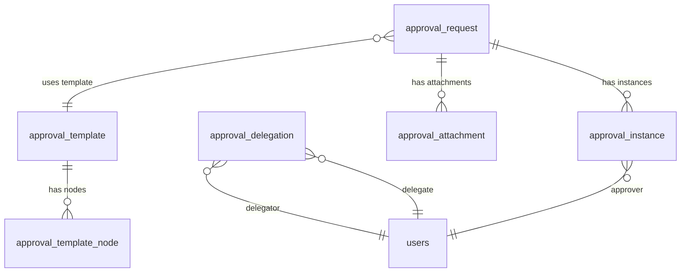
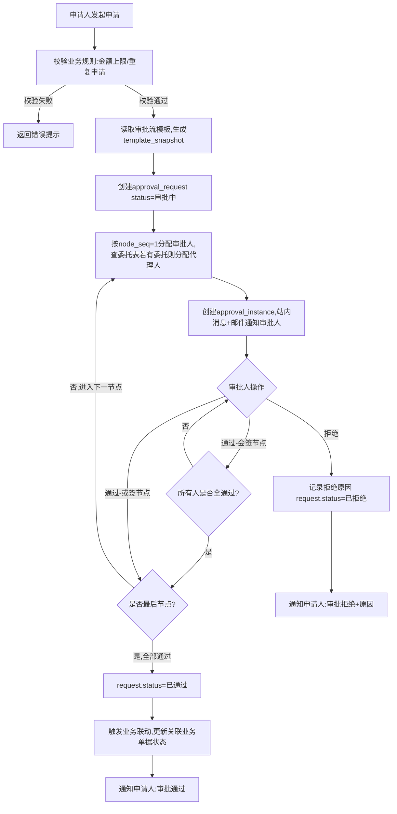
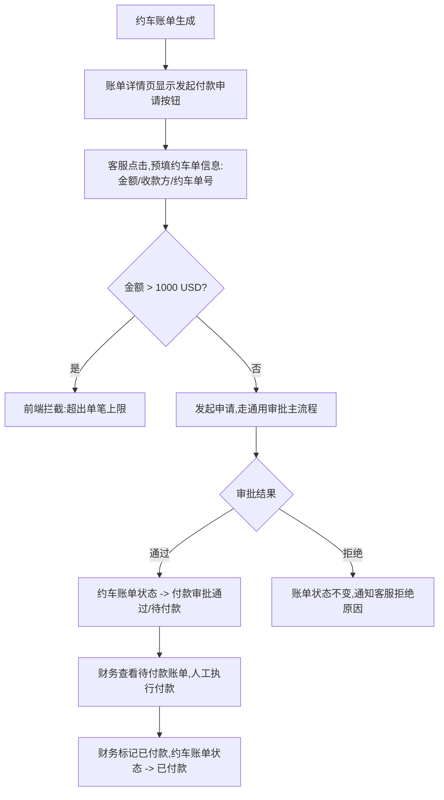
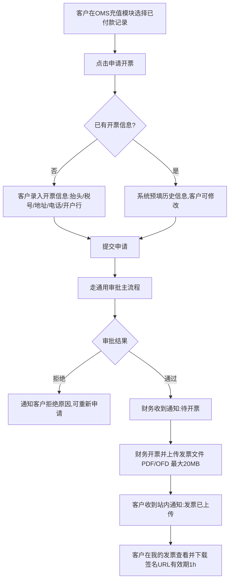
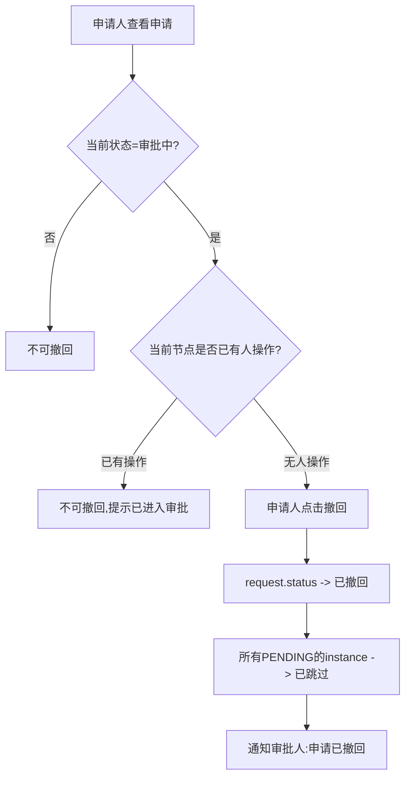
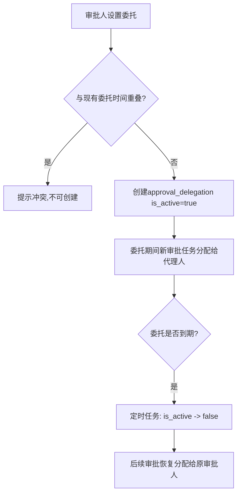

# 核心方案设计草稿 (Architecture)

> **方案ID**: ARCH-APPROVAL-001
> **关联RDD**: RDD-APPROVAL-001
> **创建日期**: 2026-03-19
> **负责人**: Dennis
> **状态**: 草稿待确认

---

## 一、实体建模 (Data Modeling)

### 1.1 DDD 聚合设计

```
聚合根：ApprovalRequest（审批申请）
  ├── ApprovalInstance（审批实例，每个节点对应一条）
  └── ApprovalAttachment（附件）

独立聚合：ApprovalTemplate（审批流模板）
  └── ApprovalTemplateNode（模板节点）

独立聚合：ApprovalDelegation（审批委托）

联动已有表（变更状态字段，不新增表）：
  - 约车账单 → 新增 pay_approval_status / pay_request_id
  - OMS充值记录 → 新增 invoice_request_id
  - 客户合同 → 新增 approval_status / approval_request_id
```

---

### 1.2 approval_template（审批流模板）

> 定义各审批类型的流程配置，管理员后台配置，变更不影响存量申请。

| 字段名 | 中文名 | 类型 | 必填 | 约束 | 枚举/备注 |
|--------|--------|------|------|------|-----------|
| `id` | 主键 | BigInt | Yes | PK | 雪花ID |
| `template_code` | 模板编码 | String(64) | Yes | UNIQUE | TRUCK_PAYMENT/INVOICE/CONTRACT/CHANNEL_RECHARGE |
| `template_name` | 模板名称 | String(128) | Yes | - | 如：约车付款审批 |
| `biz_type` | 业务类型 | TinyInt | Yes | INDEX | 1:约车付款 2:客户开票 3:合同生效 4:渠道充值 |
| `is_enabled` | 是否启用 | Boolean | Yes | - | Default: true |
| `description` | 描述 | String(512) | No | - | |
| `created_at` | 创建时间 | DateTime | Yes | - | |
| `created_by` | 创建人 | BigInt | Yes | - | |
| `updated_at` | 更新时间 | DateTime | Yes | - | |
| `updated_by` | 更新人 | BigInt | Yes | - | |
| `is_deleted` | 软删除 | Boolean | Yes | - | Default: false |
| `version` | 乐观锁 | Int | Yes | - | Default: 1 |

One-to-Many -> `approval_template_node` (id -> template_id)

---

### 1.3 approval_template_node（模板节点）

> 每个节点定义审批顺序、类型、角色和条件规则。

| 字段名 | 中文名 | 类型 | 必填 | 约束 | 枚举/备注 |
|--------|--------|------|------|------|-----------|
| `id` | 主键 | BigInt | Yes | PK | |
| `template_id` | 模板ID | BigInt | Yes | INDEX | |
| `node_seq` | 节点序号 | TinyInt | Yes | - | 1,2,3… |
| `node_name` | 节点名称 | String(64) | Yes | - | 主管审批/财务审批 |
| `node_type` | 节点类型 | TinyInt | Yes | - | 1:会签(全通过) 2:或签(任一通过) |
| `condition_type` | 条件类型 | TinyInt | No | - | 0:无条件 1:金额范围 |
| `condition_config` | 条件配置 | JSON | No | - | {"amount_min":0,"amount_max":500} |
| `role_ids` | 审批角色ID列表 | JSON | Yes | - | [roleId1,roleId2] |
| `timeout_hours` | 超时小时数 | Int | No | - | 0=不限 |
| `created_at` | 创建时间 | DateTime | Yes | - | |
| `created_by` | 创建人 | BigInt | Yes | - | |
| `updated_at` | 更新时间 | DateTime | Yes | - | |
| `updated_by` | 更新人 | BigInt | Yes | - | |
| `is_deleted` | 软删除 | Boolean | Yes | - | |

UNIQUE INDEX: `(template_id, node_seq)`

### 1.4 approval_request（审批申请 — 聚合根）

> 每条审批申请的完整信息，关联业务单据，驱动流转，template_snapshot快照防止模板变更影响存量。

| 字段名 | 中文名 | 类型 | 必填 | 约束 | 枚举/备注 |
|--------|--------|------|------|------|-----------|
| id | 主键 | BigInt | Yes | PK | 雪花ID |
| request_no | 申请单号 | String(32) | Yes | UNIQUE | APR+yyyyMMdd+6位SEQ |
| biz_type | 业务类型 | TinyInt | Yes | INDEX | 1:约车付款 2:客户开票 3:合同生效 4:渠道充值 |
| biz_id | 业务单据ID | BigInt | Yes | INDEX | 约车单/充值记录/合同/渠道 ID |
| biz_no | 业务单号 | String(64) | No | - | 冗余，方便展示 |
| template_id | 模板ID | BigInt | Yes | - | 申请时锁定 |
| template_snapshot | 模板快照 | JSON | Yes | - | 完整模板配置，防止模板变更影响存量 |
| status | 申请状态 | TinyInt | Yes | INDEX | 10:草稿 20:审批中 30:已通过 40:已拒绝 50:已撤回 |
| current_node_seq | 当前节点序号 | TinyInt | Yes | - | 当前待审批节点 |
| applicant_id | 申请人ID | BigInt | Yes | INDEX | 内部用户ID或客户ID |
| applicant_type | 申请人类型 | TinyInt | Yes | - | 1:内部员工 2:客户 |
| applicant_name | 申请人姓名 | String(64) | Yes | - | 冗余 |
| title | 申请标题 | String(256) | Yes | - | 约车付款申请-#TRK2026031901 |
| amount | 申请金额 | Decimal(20,6) | No | - | 约车付款/开票金额，禁用Float |
| currency | 货币 | String(8) | No | - | USD/CNY |
| remark | 申请说明 | Text | No | - | |
| extra_data | 扩展业务数据 | JSON | No | - | 各类型特有字段 |
| passed_at | 通过时间 | DateTime | No | - | |
| rejected_at | 拒绝时间 | DateTime | No | - | |
| withdrawn_at | 撤回时间 | DateTime | No | - | |
| created_at | 创建时间 | DateTime | Yes | INDEX | |
| created_by | 创建人 | BigInt | Yes | - | |
| updated_at | 更新时间 | DateTime | Yes | - | |
| updated_by | 更新人 | BigInt | Yes | - | |
| is_deleted | 软删除 | Boolean | Yes | - | |
| version | 乐观锁 | Int | Yes | - | 状态变更必须校验，防并发冲突 |

extra_data结构示例：
- biz_type=1: {"payee":"XX运输","payment_method":"电汇"}
- biz_type=2: {"invoice_type":"专票","invoice_title":"深圳XX","tax_no":"91440300..."}
- biz_type=3: {"contract_type":"新签","start_date":"2026-04-01","end_date":"2027-03-31"}
- biz_type=4: {"channel_name":"UPS","channel_id":456,"recharge_reason":"月度充值"}

One-to-Many -> approval_instance (id -> request_id)
One-to-Many -> approval_attachment (id -> request_id)

---

### 1.5 approval_instance（审批实例）

> 记录每个节点每个审批人的审批动作，一申请有 N节点×M审批人 条记录。

| 字段名 | 中文名 | 类型 | 必填 | 约束 | 枚举/备注 |
|--------|--------|------|------|------|-----------|
| id | 主键 | BigInt | Yes | PK | |
| request_id | 申请ID | BigInt | Yes | INDEX | |
| node_seq | 节点序号 | TinyInt | Yes | INDEX | |
| node_name | 节点名称 | String(64) | Yes | - | 冗余 |
| approver_id | 审批人ID | BigInt | Yes | INDEX | |
| approver_name | 审批人姓名 | String(64) | Yes | - | 冗余 |
| is_delegated | 是否代理 | Boolean | Yes | - | true=委托代理人操作 |
| delegator_id | 原委托人ID | BigInt | No | - | is_delegated=true时填 |
| status | 审批状态 | TinyInt | Yes | INDEX | 10:待审批 20:已通过 30:已拒绝 40:已转交 50:已跳过 |
| action_at | 操作时间 | DateTime | No | - | |
| comment | 审批意见 | Text | No | - | |
| created_at | 创建时间 | DateTime | Yes | - | |
| created_by | 创建人 | BigInt | Yes | - | |
| updated_at | 更新时间 | DateTime | Yes | - | |
| updated_by | 更新人 | BigInt | Yes | - | |
| is_deleted | 软删除 | Boolean | Yes | - | |

---

### 1.6 approval_attachment（审批附件）

> 存储申请附件和发票文件，file_type区分；存S3 Key，下载时生成签名URL。

| 字段名 | 中文名 | 类型 | 必填 | 约束 | 枚举/备注 |
|--------|--------|------|------|------|-----------|
| id | 主键 | BigInt | Yes | PK | |
| request_id | 申请ID | BigInt | Yes | INDEX | |
| file_type | 文件用途 | TinyInt | Yes | - | 1:申请附件 2:发票文件(财务上传) |
| file_name | 文件名 | String(256) | Yes | - | |
| file_key | S3存储Key | String(512) | Yes | - | 不存公开URL |
| file_size | 文件大小 | BigInt | No | - | 字节 |
| mime_type | MIME类型 | String(64) | No | - | application/pdf |
| uploaded_by | 上传人ID | BigInt | Yes | - | |
| created_at | 创建时间 | DateTime | Yes | - | |
| is_deleted | 软删除 | Boolean | Yes | - | |

---

### 1.7 approval_delegation（审批委托）

> 审批人临时委托他人代理，有时间范围，定时任务检测到期自动置失效。

| 字段名 | 中文名 | 类型 | 必填 | 约束 | 枚举/备注 |
|--------|--------|------|------|------|-----------|
| id | 主键 | BigInt | Yes | PK | |
| delegator_id | 委托人ID | BigInt | Yes | INDEX | 原审批人 |
| delegate_id | 被委托人ID | BigInt | Yes | INDEX | 代理人 |
| biz_types | 委托业务类型 | JSON | No | - | null=全部，[1,2]=指定类型 |
| start_at | 开始时间 | DateTime | Yes | - | |
| end_at | 结束时间 | DateTime | Yes | INDEX | |
| reason | 委托原因 | String(256) | No | - | |
| is_active | 是否有效 | Boolean | Yes | INDEX | 定时任务检测end_at自动置false |
| created_at | 创建时间 | DateTime | Yes | - | |
| created_by | 创建人 | BigInt | Yes | - | |
| is_deleted | 软删除 | Boolean | Yes | - | |

UNIQUE INDEX: (delegator_id, is_active) WHERE is_active=true

### 1.8 ER 关系图



---

## 二、流程设计 (Process Design)

### 2.1 审批主流程（通用）



### 2.2 约车付款申请专项流程



### 2.3 客户开票申请专项流程



### 2.4 撤回流程



### 2.5 委托代理流程



---

## 三、风险探测报告 (Edge Case Analysis)

### 深度风险探测报告

| 风险维度 | 场景描述 | 风险等级 | 解决方案 |
|----------|----------|----------|-----------|
| **并发冲突** | 审批人A通过的同时申请人B撤回，request状态不一致 | **P0** | approval_request.version乐观锁，状态变更前校验version，失败返回409提示刷新重试 |
| **重复提交幂等** | 用户疯狂点击「提交申请」，同一业务单据创建多条申请 | **P0** | DB唯一约束：(biz_type, biz_id) WHERE status IN(20,30)，同一业务单只能有一条进行中/通过的申请；前端提交后立即禁用按钮 |
| **会签并发计数** | 会签节点多个审批人同时操作，节点通过计数错误导致错误推进 | **P0** | SELECT FOR UPDATE行锁查询节点内所有instance，原子判断是否全通过后再推进下一节点 |
| **联动事务一致性** | 审批通过后触发约车账单状态更新，若联动失败request已是已通过 | **P1** | approval_request状态更新和业务联动在同一DB事务内，联动失败整体回滚，告警通知运营 |
| **水平越权(IDOR)** | 客户A构造申请ID请求查看/操作客户B的开票申请 | **P0** | 后端所有申请接口强制校验：current_user.id == request.applicant_id 或 current_user在审批人列表中，缺一不可 |
| **垂直越权** | 普通员工调用管理员配置审批流模板接口 | **P0** | 接口级RBAC：模板配置接口限Super Admin角色，审批操作接口限对应审批角色 |
| **发票文件越权下载** | 发票文件URL被未授权用户直接访问 | **P1** | S3签名URL有效期1小时，下载接口后端校验用户权限后才生成签名URL，不暴露公开地址 |
| **时区判断错误** | 委托有效期跨时区判断错误（仓库美国，管理员国内） | **P1** | 后端统一存UTC时间戳，前端按用户时区格式化展示，委托有效期判断使用UTC时间比对 |
| **模板变更影响存量** | 管理员修改审批节点，进行中申请审批逻辑混乱 | **P1** | 申请发起时保存template_snapshot快照，审批流转始终基于快照，与当前模板无关 |
| **审批人失效** | 审批节点配置的角色用户被禁用，审批任务无人接收 | **P1** | 分配审批人时过滤is_active=false用户；若角色下无有效用户，发起申请时阻止提交并通知管理员 |
| **重复开票** | 同一充值记录多次发起开票申请，收到多张发票 | **P1** | DB唯一约束：(biz_type=2, biz_id) WHERE status != 50，同一充值记录只能有一条非撤回申请 |
| **金额篡改** | 客户开票时篡改amount字段，申请金额与充值记录不一致 | **P1** | 后端校验：开票申请amount必须等于关联充值记录实付金额，不信任客户端传入金额 |
| **BigInt精度丢失** | 前端JS处理雪花ID时精度丢失（超过2^53） | **P1** | 雪花ID通过API以String类型返回，前端不做数值计算 |
| **委托循环** | A委托B，B委托A，形成委托循环导致无限路由 | **P2** | 创建委托时检查：被委托人是否已委托给委托人，若是则拒绝创建 |
| **超时无人审批** | 审批人长期不处理，申请一直挂起 | **P2** | timeout_hours配置超时时间，定时任务检查超时instance，发送催办通知；可配置超时自动通过（需业务确认）|
| **文件上传安全** | 申请附件/发票上传恶意文件（如含宏的PDF/exe伪装成PDF） | **P2** | 后端校验MIME类型和文件头magic bytes；文件大小限制20MB；S3存储隔离，不可执行 |

---

## 四、菜单配置建议

| 应用 | 菜单路径 | URL | 权限 |
|------|----------|-----|------|
| Admin | 财务 / 审批管理 / 全部申请 | /admin/approvals | Admin / 财务角色 |
| Admin | 财务 / 审批管理 / 待我审批 | /admin/approvals/pending | 审批角色用户 |
| Admin | 设置 / 审批流配置 | /admin/approval-templates | Super Admin |
| Admin | 设置 / 审批委托 | /admin/approval-delegation | 所有审批角色 |
| OMS | 计费 / 我的发票 | /invoices | 客户 |
| OMS | 计费 / 付款 / 申请开票 | /billing/apply-invoice | 客户 |

---

## 五、关键设计决策说明

1. **template_snapshot 快照机制**：审批申请发起时将当前模板完整JSON写入快照，后续模板变更只影响新申请，存量申请不受影响。这是审批引擎最核心的稳定性设计。

2. **extra_data JSON扩展字段**：各审批类型的特有字段（开票信息/合同日期等）统一存入extra_data，避免为每种类型单独建表；但主要查询字段（status/biz_type/amount）保持独立字段+索引。

3. **文件存S3 Key而非URL**：附件和发票文件只存S3 Key，下载时由后端鉴权后生成签名URL，彻底防止文件被未授权访问。签名URL有效期1小时，与现有POD文件存储策略一致。

4. **乐观锁version字段**：approval_request的所有状态变更（审批中→已通过/已拒绝/已撤回）必须携带version进行乐观锁校验，防止并发状态覆盖。

5. **委托唯一性约束**：同一委托人同时只能有一个is_active=true的委托记录，防止委托混乱；委托到期由定时任务自动置inactive，不依赖业务逻辑手动处理。

---

**文档版本**: ARCH-APPROVAL-001 V1.0
**最后更新**: 2026-03-19
**下一步**: 确认后执行 Phase 3 生成完整 PRD
