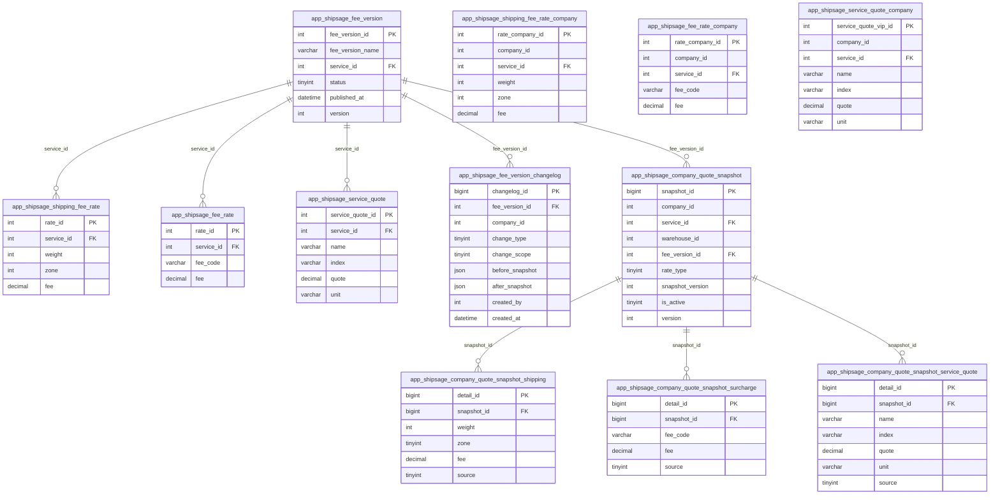
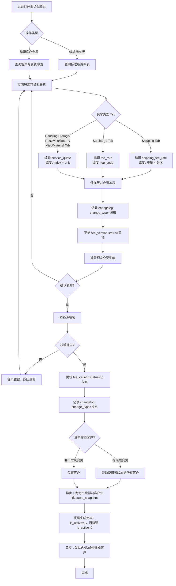
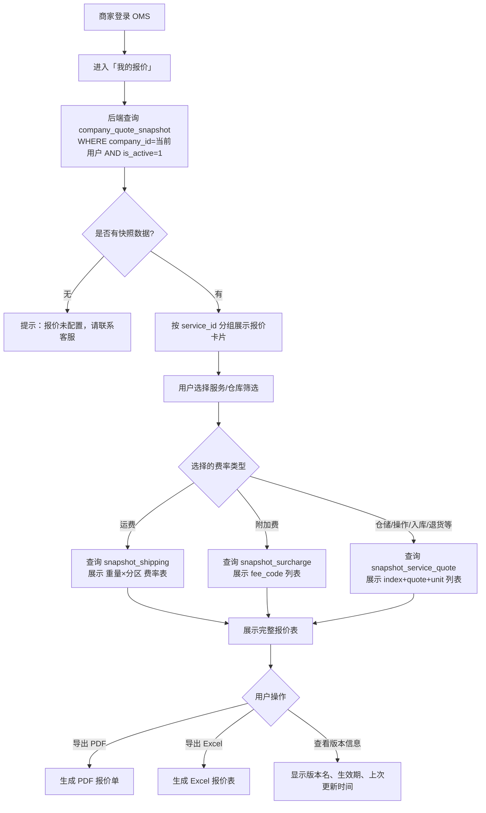
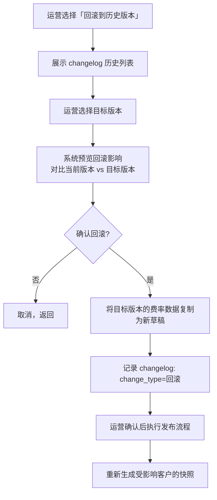

# 方案架构设计：报价配置管理 & 客户报价查询

> **文档版本**: v1.0  
> **创建日期**: 2026-03-21  
> **阶段**: Phase 2 — 方案架构  
> **关联 RDD**: 见 Phase 1 需求分析

---

## 目录

1. [业务规则合规校验](#一业务规则合规校验)
2. [现有系统能力边界](#二现有系统能力边界)
3. [核心设计决策](#三核心设计决策)
4. [数据模型设计](#四数据模型设计)
5. [业务流程设计](#五业务流程设计)
6. [风险探测报告](#六风险探测报告)
7. [API 设计概要](#七api-设计概要)

---

## 一、业务规则合规校验

| 规则 | 检查项 | 结论 |
|---|---|---|
| 多货主隔离 | 所有新表含 `company_id`，报价查询强制带租户条件 | ✅ 已纳入 |
| 金额字段 | 报价金额统一用 `Decimal(20,6)`，禁止 Float/Double | ✅ 已纳入 |
| 软删除 | 报价版本/快照不可物理删除，统一用 `is_deleted=1` | ✅ 已纳入 |
| 乐观锁 | 快照表含 `version` 字段，防并发覆盖 | ✅ 已纳入 |
| 系统边界 | 报价配置属于 APP DB（app.shipsage.com），不操作 ERP DB / WMS DB | ✅ 确认 |
| 费用可追溯 | 每笔快照可追溯到来源费率版本和 source 字段 | ✅ 已纳入 |
| ADJ 滞后费 | 报价配置不影响 ADJ 附加费的滞后结算逻辑 | ✅ 不涉及 |

---

## 二、现有系统能力边界

### 2.1 已有能力（不重复建设）

| 功能 | 现状 | 结论 |
|---|---|---|
| 客户费用账单查询（OMS） | `/oms/billing/fees/` 下已有 8 个费用 tab，展示已发生账单 | ✅ 保留现有，不改动 |
| 运营侧报价版本列表 | `admin/billing/quotation/` 已有列表页 | ✅ 在此基础上扩展 |
| 报价配置中各费用 tab 展示 | `v-table-shipping/handling/storage/...` 已只读展示 | ⚠️ 缺编辑能力 |
| 订单费用明细后端数据 | `shipping_fee_details_shipsage_estimated` 字段已存 JSON | ⚠️ 前端未渲染 |
| 标准版报价配置入口 | 无 | ❌ 需新建 |
| 客户报价直接编辑 | 无（只能导入或系数调整） | ❌ 需新建 |
| 客户自助查询报价表（非账单） | 无 | ❌ 需新建 |

### 2.2 三种费率体系（必须全部覆盖）

```
报价配置 = 3 个独立的费率表体系

体系 A: 运费费率
  标准版: app_shipsage_shipping_fee_rate
  客户版: app_shipsage_shipping_fee_rate_company
  维度:   service_id × zone × weight → fee

体系 B: 附加费费率
  标准版: app_shipsage_fee_rate
  客户版: app_shipsage_fee_rate_company
  维度:   service_id × fee_code → fee

体系 C: 服务报价（仓储/操作/入库/退货/包材/杂项）
  标准版: app_shipsage_service_quote
  客户版: app_shipsage_service_quote_company
  维度:   service_id × index → quote + unit
```

---

## 三、核心设计决策

### 决策 1：新增「客户报价快照」机制

**问题**：客户最终报价 = 标准版费率 + 客户差异覆盖，OMS 端每次查询都需要实时合并计算，性能差且逻辑复杂。

**方案**：在运营发布报价版本时，异步触发快照生成，将合并后的完整报价写入快照表，OMS 直接查快照，无需运行时合并。

**代价**：快照数据存在短暂延迟（异步生成，通常 < 30 秒），可接受。

### 决策 2：快照采用「一主三子」表结构

三种费率体系的维度字段完全不同，强行合并为单表会造成大量 NULL 字段，可读性差。改为主表存元数据，三张子表分别存运费明细、附加费明细、服务报价明细。

### 决策 3：现有费率表复用，最小改动原则

不新建运费/附加费/服务报价的核心存储表，直接在现有 `app_shipsage_shipping_fee_rate` 等表上做增删改，只新增辅助表（变更日志 + 快照）。

### 决策 4：`app_shipsage_fee_version` 扩展状态字段

现有表依赖 `hidden`/`disabled` 区分状态，语义不清晰，扩展增加 `status` 字段（草稿/已发布/已停用）。

---

## 四、数据模型设计

### 4.1 现有表扩展字段

**`app_shipsage_fee_version` 新增字段**（只加不改）：

| 新增字段 | 类型 | 必填 | 说明 |
|---|---|---|---|
| `status` | TinyInt | Yes | **0=草稿, 1=已发布, 2=已停用**；默认0 |
| `published_at` | DateTime | No | 发布时间 |
| `published_by` | Int | No | 发布人 ID |
| `version` | Int | Yes | 乐观锁，默认1 |

---

### 4.2 新增表 1：报价版本变更日志

**表名**: `app_shipsage_fee_version_changelog`

> **设计说明**: 记录每次报价版本的配置变更，支持审计追溯、版本对比和变更通知。只写不改，无需乐观锁。

| 字段名 | 中文名 | 类型 | 必填 | 约束 | 枚举/备注 |
|---|---|---|---|---|---|
| `changelog_id` | 主键 | BigInt | Yes | **PK** | 雪花ID |
| `fee_version_id` | 费用版本ID | Int | Yes | **INDEX** | 关联 `app_shipsage_fee_version` |
| `company_id` | 客户ID | Int | No | **INDEX** | NULL=标准版变更；有值=客户专属变更 |
| `change_type` | 变更类型 | TinyInt | Yes | INDEX | **1=创建, 2=编辑费率, 3=发布, 4=回滚, 5=停用** |
| `change_scope` | 变更范围 | TinyInt | Yes | - | **1=运费费率, 2=附加费费率, 3=服务报价, 4=版本信息** |
| `before_snapshot` | 变更前快照 | JSON | No | - | 变更前的关键字段快照 |
| `after_snapshot` | 变更后快照 | JSON | No | - | 变更后的关键字段快照 |
| `affected_rate_count` | 影响费率条数 | Int | No | - | 本次变更涉及的费率行数 |
| `affected_company_ids` | 影响客户列表 | JSON | No | - | 标准版变更时，受影响的 company_id 列表 |
| `change_summary` | 变更摘要 | Varchar(500) | No | - | 运营填写的变更说明 |
| `notified` | 是否已通知 | TinyInt(1) | Yes | - | **0=未通知, 1=已通知**；默认0 |
| `notified_at` | 通知时间 | DateTime | No | - | 发送通知的时间 |
| `created_by` | 操作人ID | Int | Yes | **INDEX** | 运营人员ID |
| `created_at` | 操作时间 | DateTime | Yes | **INDEX** | |
| `is_deleted` | 软删除 | TinyInt(1) | Yes | - | 默认0 |

**索引设计**:
- `PRIMARY`: changelog_id
- `idx_fee_version_id`: fee_version_id
- `idx_company_id`: company_id
- `idx_created_at`: created_at

---

### 4.3 新增表 2：客户报价快照主表

**表名**: `app_shipsage_company_quote_snapshot`

> **设计说明**: 存储某个客户在某个费率版本下，某个服务的报价元数据。由运营发布报价版本时异步生成，OMS 客户端直接查此表，无需运行时合并计算。

| 字段名 | 中文名 | 类型 | 必填 | 约束 | 枚举/备注 |
|---|---|---|---|---|---|
| `snapshot_id` | 主键 | BigInt | Yes | **PK** | 雪花ID |
| `company_id` | 客户ID | Int | Yes | **INDEX** | 租户隔离，所有查询必须带此字段 |
| `service_id` | 服务ID | Int | Yes | **INDEX** | 关联 `app_shipsage_service` |
| `warehouse_id` | 仓库ID | Int | No | **INDEX** | 运费类必填，仓储/操作类可为NULL |
| `fee_version_id` | 报价版本ID | Int | Yes | **INDEX** | 关联 `app_shipsage_fee_version` |
| `rate_type` | 费率体系类型 | TinyInt | Yes | **INDEX** | **1=运费(Shipping), 2=附加费(Surcharge), 3=服务报价(Service Quote)** |
| `snapshot_version` | 快照世代号 | Int | Yes | - | 同一 company+service+warehouse 组合每次重新生成递增 |
| `is_active` | 是否当前生效 | TinyInt(1) | Yes | **INDEX** | 每个 company+service+warehouse+rate_type 组合只有一条 is_active=1 |
| `start_date` | 生效开始时间 | DateTime | Yes | **INDEX** | 继承自费率记录 |
| `end_date` | 生效结束时间 | DateTime | Yes | **INDEX** | 继承自费率记录 |
| `generated_at` | 快照生成时间 | DateTime | Yes | - | |
| `generated_by` | 生成触发人 | Int | Yes | - | 运营人员ID 或系统ID |
| `is_deleted` | 软删除 | TinyInt(1) | Yes | - | 默认0 |
| `version` | 乐观锁 | Int | Yes | - | 防并发覆盖，默认1 |

**联合唯一索引**: `(company_id, service_id, warehouse_id, rate_type, is_active)` — 确保同一维度只有一条生效快照

**关联关系**:
- `One-to-Many` with `app_shipsage_company_quote_snapshot_shipping`（rate_type=1 时）
- `One-to-Many` with `app_shipsage_company_quote_snapshot_surcharge`（rate_type=2 时）
- `One-to-Many` with `app_shipsage_company_quote_snapshot_service_quote`（rate_type=3 时）

---

### 4.4 新增表 3：快照子表 — 运费明细

**表名**: `app_shipsage_company_quote_snapshot_shipping`

> **设计说明**: 存储快照中的运费明细，对应体系 A（重量×分区=费用）。

| 字段名 | 中文名 | 类型 | 必填 | 约束 | 备注 |
|---|---|---|---|---|---|
| `detail_id` | 主键 | BigInt | Yes | **PK** | 雪花ID |
| `snapshot_id` | 快照ID | BigInt | Yes | **INDEX** | FK → `app_shipsage_company_quote_snapshot` |
| `weight` | 重量（磅） | Int | Yes | **INDEX** | |
| `zone` | 分区 | TinyInt | Yes | **INDEX** | 2-8 |
| `fee` | 费用金额 | Decimal(20,6) | Yes | - | 合并后最终费用，禁止Float |
| `source` | 费率来源 | TinyInt | Yes | - | **1=继承标准版, 2=客户专属覆盖** |

**联合索引**: `(snapshot_id, zone, weight)`

---

### 4.5 新增表 4：快照子表 — 附加费明细

**表名**: `app_shipsage_company_quote_snapshot_surcharge`

> **设计说明**: 存储快照中的附加费明细，对应体系 B（fee_code=费用）。

| 字段名 | 中文名 | 类型 | 必填 | 约束 | 备注 |
|---|---|---|---|---|---|
| `detail_id` | 主键 | BigInt | Yes | **PK** | 雪花ID |
| `snapshot_id` | 快照ID | BigInt | Yes | **INDEX** | FK → `app_shipsage_company_quote_snapshot` |
| `fee_code` | 附加费代码 | Varchar(50) | Yes | **INDEX** | |
| `fee_code_desc_cn` | 中文说明 | Varchar(200) | No | - | 冗余存储，避免关联查询 |
| `fee_code_desc_en` | 英文说明 | Varchar(200) | No | - | 冗余存储 |
| `fee` | 费用金额 | Decimal(20,6) | Yes | - | 禁止Float |
| `source` | 费率来源 | TinyInt | Yes | - | **1=继承标准版, 2=客户专属覆盖** |

**联合索引**: `(snapshot_id, fee_code)`

---

### 4.6 新增表 5：快照子表 — 服务报价明细

**表名**: `app_shipsage_company_quote_snapshot_service_quote`

> **设计说明**: 存储快照中的服务报价明细，对应体系 C（仓储费/操作费/入库费/退货费/包材费/杂项费），对应 `app_shipsage_service_quote` 的 index+quote+unit 结构。

| 字段名 | 中文名 | 类型 | 必填 | 约束 | 备注 |
|---|---|---|---|---|---|
| `detail_id` | 主键 | BigInt | Yes | **PK** | 雪花ID |
| `snapshot_id` | 快照ID | BigInt | Yes | **INDEX** | FK → `app_shipsage_company_quote_snapshot` |
| `name` | 报价项名称 | Varchar(200) | Yes | - | 如 "0-1lb"、"31-60天"、"per pallet" |
| `index` | 费率区间标识 | Varchar(100) | Yes | **INDEX** | 对应 `service_quote.index`，作为查找 key |
| `quote` | 报价金额 | Decimal(20,6) | Yes | - | 禁止Float |
| `unit` | 计费单位 | Varchar(50) | No | - | 如 per order / per CBM / per pallet / per piece |
| `source` | 费率来源 | TinyInt | Yes | - | **1=继承标准版, 2=客户专属覆盖** |

**联合索引**: `(snapshot_id, index)`

---

### 4.7 ER 图



---

## 五、业务流程设计

### 5.1 流程 A：运营编辑并发布报价版本



### 5.2 流程 B：客户自助查询我的报价



### 5.3 流程 C：报价版本回滚



---

## 六、风险探测报告

### 🚨 深度风险探测报告

| 风险维度 | 场景描述 | 风险等级 | 解决方案 |
|---|---|---|---|
| **并发冲突** | 运营 A 和运营 B 同时编辑同一费率版本，后保存者覆盖先保存者的修改 | **P0 Critical** | 编辑页面加载时读取 `fee_version.version`，提交时校验 version 是否一致；不一致则提示「已被他人修改，请刷新后重试」 |
| **并发冲突** | 快照生成任务并发执行，同一 company+service 产生两条 is_active=1 的快照 | **P0 Critical** | 快照生成使用数据库行锁（SELECT FOR UPDATE）或唯一索引约束；生成前先将旧快照 is_active=0，再插入新快照，放在同一事务中 |
| **数据一致性** | 运营发布费率后，快照异步生成中（<30秒），客户此时查询拿到旧快照 | **P1 High** | OMS 报价查询页显示「最后更新时间」，让客户感知数据时效；若快照生成失败，告警通知运营重新触发 |
| **数据一致性** | 标准版费率变更后，受影响客户数量极大（如 1000+ 客户），快照批量生成耗时过长 | **P1 High** | 快照生成改为 MQ 异步分批处理，每批 50 个客户；提供生成进度状态查询接口 |
| **数据一致性** | 客户专属费率表（`_company`）与快照表数据不同步，出现「费率表已改但快照未更新」 | **P1 High** | 所有费率表写操作后，强制触发该客户对应服务的快照重新生成；不提供绕过快照的直接查询路径 |
| **权限安全（IDOR）** | 商家通过修改 company_id 参数查询其他客户的报价快照 | **P0 Critical** | 后端强制使用 `current_user.company_id` 覆盖请求参数中的 company_id，禁止信任前端传参 |
| **权限安全** | 普通商家调用运营侧的报价编辑接口 | **P1 High** | 接口级 RBAC 校验：编辑类接口仅限 `ROLE_ADMIN` / `ROLE_OPERATION`；OMS 客户端接口仅允许只读操作 |
| **网络异常** | 导入大量费率 Excel（如 3M 条客户运费费率）时请求超时 | **P1 High** | 导入改为异步任务：前端上传文件后获得 task_id，轮询进度，完成后通知；单次批量写入不超过 5000 条 |
| **网络异常** | 报价版本发布后触发快照生成失败（MQ 故障、DB 超时），但版本已标记为已发布 | **P1 High** | 快照生成失败时记录失败状态，运营侧展示「快照待生成」警告；提供「重新生成快照」手动触发按钮 |
| **时间有效性** | 费率记录有 start_date/end_date，快照生成时合并了「当前有效」的费率，但快照本身无过期检查机制 | **P1 High** | 快照的 end_date 取其来源费率记录中最早的 end_date；系统定时任务在费率过期前 24h 触发快照更新 |
| **数据量** | 运费费率表（3.2M 条）前端一次性加载全量数据展示 | **P1 High** | 前端强制分页（每页 100 条）+ 按 service/zone/weight 筛选；禁止全量导出到页面内存 |
| **逆向流程** | 运营回滚报价版本后，已经发出的历史订单费用是否受影响 | **P2 Medium** | 回滚只影响新订单的报价计算；历史订单费用以账单生成时的费率为准，不回溯 |
| **逆向流程** | 客户正在查看报价页面时，运营同时发布新版本，页面展示数据与实际不符 | **P2 Medium** | OMS 报价页增加「最后同步时间」展示；提供「刷新报价」按钮；快照更新后前端通过 WebSocket 或轮询感知变化 |

---

## 七、API 设计概要

### 7.1 运营侧 API（仅 ADMIN/OPERATION 角色可访问）

| 接口 | Method | 路径 | 说明 |
|---|---|---|---|
| 获取费率版本列表 | GET | `/api/billing/fee-versions` | 支持按 service_id、status 筛选 |
| 获取费率版本详情 | GET | `/api/billing/fee-versions/{id}` | 含 changelog 最近 10 条 |
| 更新费用版本基本信息 | PUT | `/api/billing/fee-versions/{id}` | 含 version 乐观锁校验 |
| 发布费率版本 | POST | `/api/billing/fee-versions/{id}/publish` | 触发快照生成 |
| 获取运费费率表 | GET | `/api/billing/fee-versions/{id}/shipping-rates` | 支持分页、按 zone/weight 筛选 |
| 更新运费费率（批量） | PUT | `/api/billing/fee-versions/{id}/shipping-rates` | 批量更新，含 version 校验 |
| 获取附加费费率表 | GET | `/api/billing/fee-versions/{id}/surcharge-rates` | 支持按 fee_code 筛选 |
| 更新附加费费率（批量） | PUT | `/api/billing/fee-versions/{id}/surcharge-rates` | 批量更新 |
| 获取服务报价表 | GET | `/api/billing/fee-versions/{id}/service-quotes` | 含 Handling/Storage/Receiving/Return/Misc/Material |
| 更新服务报价（批量） | PUT | `/api/billing/fee-versions/{id}/service-quotes` | 批量更新 |
| 获取客户专属报价版本 | GET | `/api/billing/company-quotations/{quotationId}` | 含所有费率类型 |
| 获取变更日志 | GET | `/api/billing/fee-versions/{id}/changelog` | 支持分页 |
| 手动触发快照生成 | POST | `/api/billing/snapshots/generate` | 参数：company_id 或 fee_version_id |

### 7.2 客户侧 API（OMS 商家登录后可访问）

| 接口 | Method | 路径 | 说明 |
|---|---|---|---|
| 获取我的报价概览 | GET | `/api/oms/my-quotation` | 返回当前生效的服务列表及报价版本信息；company_id 从 session 取，禁止前端传参 |
| 获取运费报价详情 | GET | `/api/oms/my-quotation/shipping` | 参数：service_id、warehouse_id；查快照子表 |
| 获取附加费报价详情 | GET | `/api/oms/my-quotation/surcharge` | 参数：service_id |
| 获取服务报价详情 | GET | `/api/oms/my-quotation/service-quote` | 参数：service_id（仓储/操作/入库/退货等） |
| 导出报价 PDF | GET | `/api/oms/my-quotation/export/pdf` | 参数：service_id（可选，不传则导出全部） |
| 导出报价 Excel | GET | `/api/oms/my-quotation/export/excel` | 同上 |

---

## 八、实现优先级

### P0（核心功能，第一阶段）

1. `app_shipsage_fee_version` 扩展 status/published_at/version 字段
2. 新建 `app_shipsage_fee_version_changelog` 表
3. 客户专属报价各 Tab（Shipping/Surcharge/Handling/Storage/Receiving/Return/Misc/Material）支持直接编辑
4. 新建快照四张表并实现快照生成逻辑
5. OMS「我的报价」查询页（查快照，含运费/附加费/所有服务报价）

### P1（完善功能，第二阶段）

6. 标准版报价配置页（当前无入口）
7. 报价版本对比功能
8. 快照生成进度状态查询
9. 报价变更客户通知（站内信/邮件）
10. 报价导出 PDF/Excel

### P2（体验优化，第三阶段）

11. 报价版本回滚
12. 批量系数调整（如全部上浮 5%）
13. 订单详情页费用计算过程展示（后端数据已有，仅前端渲染）

---

**文档维护记录**:

| 版本 | 日期 | 修改人 | 修改内容 |
|---|---|---|---|
| v1.0 | 2026-03-21 | AI Assistant | 初始版本，包含完整三种费率体系的方案架构 |
