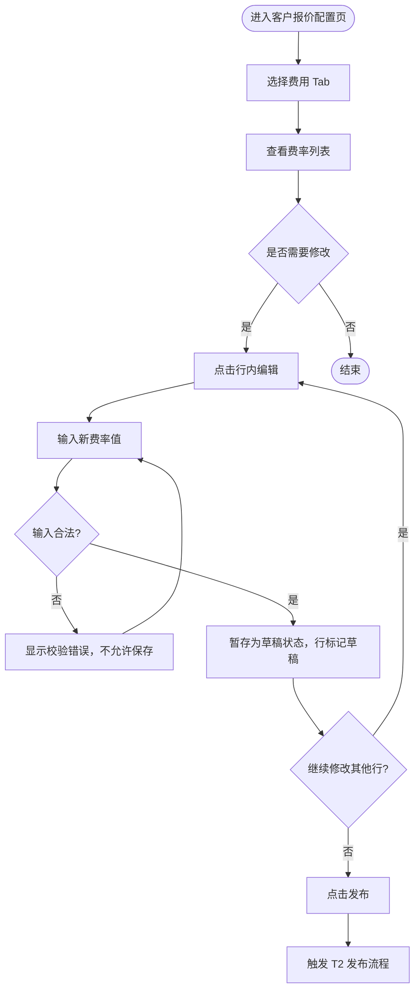
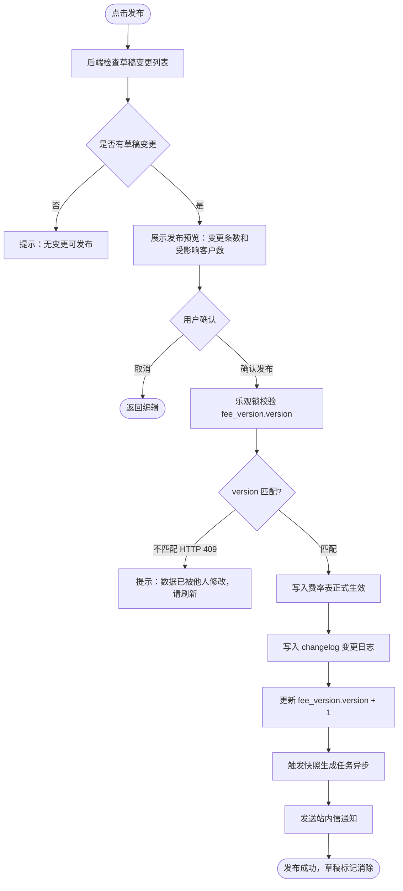
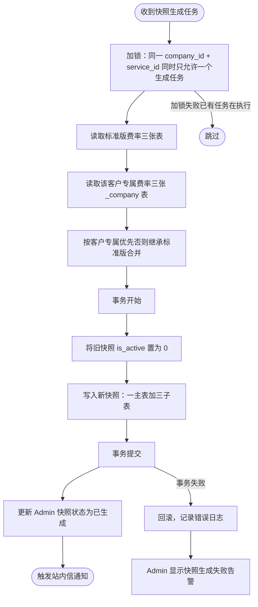
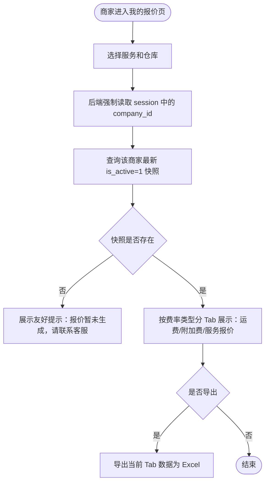
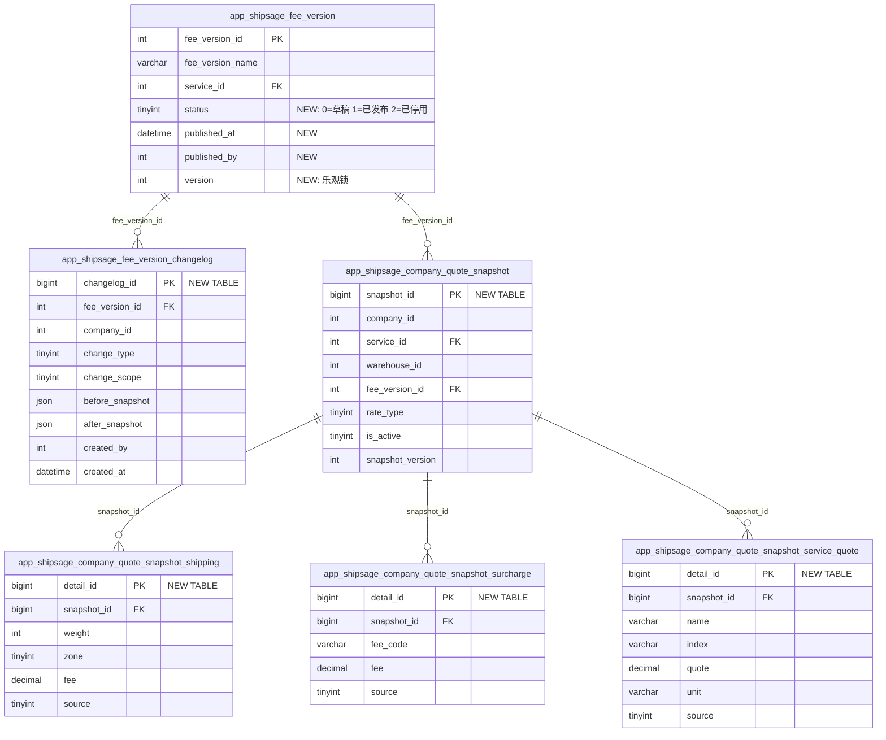

# ShipSage 报价配置管理优化 & 客户报价自助查询 PRD

## 文档信息

| 项目 | 内容 |
|------|------|
| **状态** | 草稿 |
| **负责人** | Dennis |
| **创建日期** | 2026-03-21 |
| **最后更新** | 2026-03-23 |
| **版本** | V2.0 |

---

## 版本历史

| 版本 | 作者 | 日期 | 备注 |
|------|------|------|------|
| V1.0 | AI Assistant | 2026-03-21 | 初稿，基于 RDD + Architecture 生成 |
| V2.0 | AI Assistant | 2026-03-23 | 结合代码库优化：对齐实际表结构和前端组件、修正快照/changelog 数据模型、补充 API 设计和系统能力边界 |

---

## 术语表

| 术语 | 说明 |
|------|------|
| 标准版报价 | 面向所有客户的基准报价，存储于 `app_shipsage_shipping_fee_rate`、`app_shipsage_fee_rate`、`app_shipsage_service_quote` |
| 客户专属报价 | 针对特定客户的覆盖报价，存储于对应的 `_company` 表（`shipping_fee_rate_company`、`fee_rate_company`、`service_quote_company`） |
| 最终生效报价 | 客户实际适用的报价 = 客户专属覆盖（若有）否则继承标准版 |
| 三种费率体系 | **A=运费**（service_id × zone × weight → fee）/ **B=附加费**（service_id × fee_code → fee）/ **C=服务报价**（service_id × index → quote + unit，涵盖仓储/操作/入库/退货/包材/杂项） |
| 报价快照 | 发布时异步生成的合并后完整报价记录，OMS 查询直接读快照 |
| Fee Version | 费用版本对象（`app_shipsage_fee_version`），关联一组服务配置和费率，通过 `service_id` 关联具体费率表 |
| Company Quote VIP | 客户报价等级配置（`app_shipsage_company_quote_vip`），`fee_version` 字段以 JSON 存储多个 fee_version_id |
| Service Config Company | 客户服务配置（`app_shipsage_service_config_company`），关联 `company_id` + `service_id` + `fee_version_id` |
| Zone | 分区，2-8，由仓库 + 目的邮编通过 `app_shipsage_zone_chart` 查询确定 |
| Surcharge | 附加费，按 `fee_code` 查费率（`app_shipsage_fee_rate` / `fee_rate_company`） |
| Service Quote | 服务报价，按 `index`（区间标识）查报价（`app_shipsage_service_quote` / `service_quote_company`） |

---

## 业务背景

### 背景

ShipSage Billing 底层已具备「标准版 + 客户覆盖」的双层报价能力，但产品层面存在四个核心问题：

1. **标准版报价无页面入口**：只能通过 Excel 导入或数据库操作，每次调价需 IT 介入，响应周期 2-3 天
2. **客户专属报价只能只读**：Admin 后台 `company-quotation/_detail` 页的 7 个费用 Tab 全部只读，且缺少附加费（Surcharge）Tab，修改单条费率极繁琐
3. **客户无法自助查询报价表**：OMS 账单页（`/oms/billing/fees/*`）展示的是「已发生费用」，不是「我的报价是多少」
4. **报价变更无追踪日志**：现有表仅有 `created_by`/`updated_by` 字段，无独立 changelog，出现费用争议时无证据链

### 业务目标

| 目标类型 | 目标描述 | 度量指标 | 目标值 |
|----------|----------|----------|--------|
| 运营效率 | 常规调价不再依赖 Excel 导入或 IT | 页面直编完成调价占比 | 上线 2 个月内 >= 70% |
| 客户体验 | 商家可自助查询完整报价表 | 客服报价咨询量 | 降低 30%+ |
| 合规风险 | 报价变更完整留痕 | 变更日志覆盖率 | 100% |
| 数据一致性 | 内外查询口径一致 | 快照与实际计费口径一致率 | >= 99% |

### 利益相关者

| 团队 | 角色 | 备注 |
|------|------|------|
| 计费运营 | 主要使用方，维护报价配置 | Admin 操作 |
| 客服/销售 | 对外解释报价、核价 | Admin 只读查询 |
| OMS 商家 | 查询自身报价 | OMS 只读 |
| 开发 | 前后端实现 | |
| 测试 | QA | |

### 不在本期范围

| 排除项 | 原因 |
|--------|------|
| 标准版报价页面编辑入口（新建页面） | P1，第二阶段 |
| 报价版本对比功能 | P1 |
| 批量系数调整 | P1 |
| 报价导出 PDF | P1（本期仅做 Excel） |
| 订单详情页费用计算过程展示 | P2（后端 `shipping_fee_details_shipsage_estimated` JSON 数据已有，仅需前端渲染） |
| 报价版本回滚 | P2 |
| 重构底层计费引擎 | 不在范围 |

---

## 现有系统能力边界

> 本章节说明哪些能力已有、哪些需要改造或新建，帮助开发评估改动范围。

### 已有能力（复用，不改动）

| 功能 | 现有实现 | 说明 |
|------|----------|------|
| OMS 费用账单查询 | `pages/oms/billing/fees/` 下已有 Shipping/Handling/Storage/Return/Receiving/Material/Misc/Xdock 等费用 Tab | 展示已发生账单，保留不动 |
| OMS/OE 报价只读查看 | `pages/oms/billing/quotation/company-quotation/` 和 `pages/oe/billing/quotation/company-quotation/` | 已有报价查看页面，但为管理视角非商家自助视角 |
| Admin 报价版本列表 | `pages/admin/billing/quotation/company-quotation/list.vue` | 在此基础上扩展 |
| Admin 服务报价详情 | `pages/admin/billing/quotation/service/_detail.vue`，含 VTableBaseShippingFee + VTableSurchargeShippingFee + VTableDivisor | 标准版费率展示 |
| Admin 客户报价详情 | `pages/admin/billing/quotation/company-quotation/_detail.vue`，含 7 个费用 Tab（见下表） | 只读展示，需改为可编辑 |
| Admin 定制报价 | `pages/admin/billing/quotation/customized-quotation.vue` | 定制报价管理 |
| 客户报价等级 | `app_shipsage_company_quote_vip` + `fee_version` JSON | 记录客户 VIP 等级对应的 fee_version_id 集合 |
| 报价版本追踪 | `app_shipsage_quotation_version` + `quotation_version_detail` | 记录报价版本及明细（sub_type: 1=base, 2=surcharge） |
| 时效版本管理 | 所有费率表使用 `start_date` / `end_date` 时间窗口实现版本控制 | 现有机制保留 |

### 客户报价详情页现有 Tab 组件

| Tab | 组件名 | 对应费率体系 | 对应表 |
|-----|--------|-------------|--------|
| Shipping Fee | VTableShipping | A-运费 | `shipping_fee_rate_company` |
| Handling Fee | VTableHandling | C-服务报价 | `service_quote_company` |
| Storage Fee | VTableStorage | C-服务报价 | `service_quote_company` |
| Receiving Fee | VTableReceiving | C-服务报价 | `service_quote_company` |
| Return Fee | VTableReturn | C-服务报价 | `service_quote_company` |
| Packing Material | VTablePackingMaterial | C-服务报价 | `service_quote_company` |
| Misc Fee | VTableMisc | C-服务报价 | `service_quote_company` |
| **Surcharge (缺失)** | **无** | **B-附加费** | `fee_rate_company` |

### 需新建 / 改造的能力

| 类型 | 功能 | 说明 |
|------|------|------|
| **改造** | 客户报价 7 个 Tab 从只读改为可编辑 | 改造现有组件 |
| **新增** | 客户报价页新增 Surcharge Tab | 新建 VTableSurcharge 组件 |
| **新增** | 变更日志表 `app_shipsage_fee_version_changelog` | 独立审计表 |
| **新增** | 报价快照四张表 | 一主三子：snapshot + shipping/surcharge/service_quote |
| **新增** | OMS「我的报价」页 | `pages/oms/billing/my-quotation.vue` |
| **扩展** | `app_shipsage_fee_version` 新增 status/version 等字段 | 支持草稿发布流程 |

### 关键数据量参考

| 表 | 数据量 | 影响 |
|----|--------|------|
| `app_shipsage_shipping_fee_rate` | 389,107 | 标准运费费率 |
| `app_shipsage_shipping_fee_rate_company` | 3,225,672 | 客户运费费率，前端必须分页 |
| `app_shipsage_fee_rate` | 27,736 | 标准附加费 |
| `app_shipsage_fee_rate_company` | 137,700 | 客户附加费 |
| `app_shipsage_service_quote` | 7,449 | 标准服务报价 |
| `app_shipsage_service_quote_company` | 61,469 | 客户服务报价 |
| `app_shipsage_service_config_company` | 26,170 | 客户服务配置 |
| `app_shipsage_fee_version` | 99 | 费用版本 |

---

## 用户与场景

### 用户角色

| 角色 | 描述 | 核心痛点 | 核心诉求 |
|------|------|----------|----------|
| 计费运营 | 维护标准版与客户专属报价 | 小改价也要走导入流程 | 页面直编，快速响应 |
| 客服/销售 | 对外解释报价、核价 | 找不到某客户当前生效的报价 | 快速查最终报价 |
| OMS 商家 | 查询自身报价表 | 无法自助查询，需反复联系客服 | 随时自助查完整报价 |
| 运营管理员 | 审计报价变更 | 出现争议时无法溯源 | 完整变更日志 |

### 核心场景

**场景一：运营编辑客户专属报价**
运营进入 Admin 后台 `company-quotation/_detail` 页，在 Shipping/Surcharge/Handling/Storage 等 Tab 中找到需要调整的费率行，点击「编辑」，修改金额后保存。系统记录变更日志，发布后自动生成快照，客户端报价随之更新。

**场景二：商家自助查询报价**
商家登录 OMS，在 Billing 菜单下找到「我的报价」，选择服务和仓库，查看运费、附加费、仓储费等完整报价表，核对账单后无需联系客服。

**场景三：报价变更追溯**
运营管理员收到费用争议，进入报价配置页查看变更日志，找到对应时间节点的变更记录，确认是谁、何时、将哪条费率从多少改到多少，提供完整证据链。

---

## 设计思路

### 核心设计理念

1. **三种费率体系全覆盖**：运费（service_id × zone × weight）/ 附加费（service_id × fee_code）/ 服务报价（service_id × index × unit），不能只做运费
2. **快照机制解耦查询复杂度**：发布时异步生成合并快照，OMS 直接读快照，无需运行时合并计算
3. **最小改动原则**：复用现有费率表和时效版本机制，仅新增变更日志表和快照表，扩展 `fee_version` 少量字段

### 方案选择

#### 决策点 1：客户专属报价编辑方式

| 方案 | 优点 | 缺点 | 决策 |
|------|------|------|------|
| **单格直接编辑** | 体验最好，改一条就改一条 | 前端实现略复杂 | **采用** |
| 弹窗编辑 | 实现简单 | 每次编辑需多步操作 | 放弃 |

#### 决策点 2：OMS 报价查询入口位置

| 方案 | 优点 | 缺点 | 决策 |
|------|------|------|------|
| **现有 Billing 菜单下新增 Tab** | 改动小，用户已有菜单习惯 | 需和现有费用 Tab 区分清楚 | **采用** |
| 独立菜单页 | 结构清晰 | 改动大，增加菜单层级 | 放弃 |

#### 决策点 3：报价变更通知方式

| 方案 | 优点 | 缺点 | 决策 |
|------|------|------|------|
| **站内信** | 实现简单，用户在系统内可感知 | 用户需登录才能看到 | **采用（本期）** |
| 邮件 | 覆盖率高 | 实现成本高，易被过滤 | P1 二期 |

### 关键设计决策

| # | 决策 | 理由 |
|---|------|------|
| 1 | 快照机制：发布时异步生成，OMS 查快照 | 避免运行时实时合并，性能稳定 |
| 2 | 一主三子快照表结构 | 三种费率体系维度不同（zone×weight vs fee_code vs index），不能强行合并 |
| 3 | 现有费率存储表复用 | 不新建存储表，保留 start_date/end_date 时效版本机制 |
| 4 | 客户端只展示最终生效价 | 避免信息泄露，简化客户理解负担 |
| 5 | fee_version 扩展 status 字段 | 现有 hidden/disabled 语义不清晰，新增 status（草稿/已发布/已停用） |

---

## 菜单配置

| 应用 | 菜单路径 | URL | 类型 | 图标 | 权限 |
|------|----------|-----|------|------|------|
| ShipSage Admin | Billing / Quotation / 客户报价配置 | `/admin/billing/quotation/company-quotation/_detail` | 改造现有页面 | mdi-cash-edit | 计费运营、产品运营 |
| ShipSage OMS | Billing / 我的报价 | `/oms/billing/my-quotation` | 现有 Billing 菜单下新增页面 | mdi-file-search | 商家（Merchant） |

---

## 初始化配置

| 应用 | 初始化内容 | 备注 |
|------|------------|------|
| ShipSage Admin | 报价各 Tab 编辑权限配置 | 计费运营角色 |
| ShipSage OMS | 为目标客户开通「我的报价」页 | 分批灰度开通 |
| Billing DB | 新建快照四张表 + `fee_version` 扩展字段 + `fee_version_changelog` 表 | 发布前 DDL |

---

## 风险评估

| 应用 | 模块 | 优先级 | 风险描述 | 解决方案 |
|------|------|--------|----------|----------|
| Admin | 报价编辑 | P1 | 两人同时编辑，后保存覆盖先保存 | `fee_version` 增加 `version` 乐观锁，冲突提示刷新（HTTP 409） |
| 后端 | 快照生成 | P0 | 快照并发生成，同一客户出现两条 `is_active=1` | 唯一索引 `(company_id, service_id, warehouse_id, rate_type, is_active)` + 事务，生成前先置旧快照 `is_active=0` |
| 后端 | 快照生成 | P1 | 标准版变更影响 1000+ 客户，快照生成耗时过长 | MQ 分批处理，每批 50 客户 |
| OMS | 报价查询 | P0 | 商家篡改参数查询他人报价（IDOR） | 后端强制 session 中的 company_id（注意：`company_id` 是系统保留全局变量，代码中不可作为 filter/request 参数名） |
| OMS | 报价查询 | P1 | 快照生成中，商家查询到旧快照 | 快照页展示「最后更新时间」 |
| Admin | 数据量 | P1 | 客户运费费率 3.2M 条，全量加载卡顿 | 强制分页每页 100 条 + 按 service/zone/weight 筛选 |
| 后端 | 一致性 | P1 | 费率写操作后未触发快照更新 | 费率写操作后强制触发对应客户快照重新生成 |
| 后端 | 时效性 | P1 | 费率记录有 start_date/end_date，快照生成时合并了「当前有效」的费率，但快照本身无过期检查 | 快照 `end_date` 取其来源费率记录中最早的 end_date；系统定时任务在费率过期前 24h 触发快照更新 |
| Admin | 逆向流程 | P2 | 运营回滚报价后，已发出的历史订单费用是否受影响 | 回滚只影响新订单计费；历史订单费用以账单生成时的费率为准，不回溯 |

---

## 开发范围

| 应用 | 模块 | Task # | 任务名称 | 描述 |
|------|------|--------|----------|------|
| Admin | Billing/Quotation | T1 | 客户专属报价各 Tab 支持直接编辑 | 现有 7 个 Tab 改为可编辑 + 新增 Surcharge Tab |
| Admin/后端 | Billing/Quotation | T2 | 报价版本发布流程 + 变更日志 | 草稿→发布，变更日志，快照触发，站内信通知 |
| 后端 | Billing | T3 | 客户报价快照生成机制 | 新建一主三子快照表，异步生成合并后完整报价快照 |
| OMS | Billing | T4 | 商家自助查询「我的报价」页 | Billing 菜单下新增「我的报价」页 |

---

## 任务详情

### T1：客户专属报价各 Tab 支持直接编辑

> 改造 Admin 后台 `company-quotation/_detail.vue` 页面，将现有 7 个费用 Tab 从只读改为可单格直编，并新增 Surcharge Tab 补齐附加费编辑能力。

#### 1.1 业务流程



#### 1.2 页面线框图

**Shipping Fee Tab（体系 A：运费 = service_id × zone × weight → fee）**

```text
客户报价配置 > ABC Logistics              [发布] [撤销所有草稿]
--------------------------------------------------------------------
[Shipping Fee][Surcharge][Handling Fee][Storage Fee][Receiving Fee]
[Return Fee][Packing Material][Misc Fee]
--------------------------------------------------------------------
[服务] [仓库] [搜索]
--------------------------------------------------------------------
Zone | Weight(lb) | 标准版费率 | 客户专属费率  | 最终生效  | 来源     | 操作
  2  |    1       |  $1.20     |  $1.20        |  $1.20    | 继承标准 | [编辑]
  2  |    2       |  $1.35     |  $1.50[草稿]  |  $1.50    | 客户专属 | [撤销]
  3  |    1       |  $1.50     |  -            |  $1.50    | 继承标准 | [编辑]
--------------------------------------------------------------------
[草稿] 表示有未发布变更   分页：每页 100 条
```

**Surcharge Tab（体系 B：附加费 = service_id × fee_code → fee）— 新增**

```text
客户报价配置 > ABC Logistics              [发布] [撤销所有草稿]
--------------------------------------------------------------------
[Shipping Fee][Surcharge][Handling Fee][Storage Fee]...
--------------------------------------------------------------------
[服务] [搜索]
--------------------------------------------------------------------
Fee Code | 费用说明         | 标准版费率 | 客户专属费率  | 最终生效  | 来源     | 操作
FSC      | 燃油附加费        |  $2.50     |  $2.00[草稿] |  $2.00    | 客户专属 | [撤销]
RDC      | 偏远地区配送费    |  $4.00     |  -           |  $4.00    | 继承标准 | [编辑]
RES      | 住宅配送费        |  $3.50     |  $3.50       |  $3.50    | 继承标准 | [编辑]
--------------------------------------------------------------------
分页：每页 100 条
```

**Handling/Storage/Receiving/Return/PackingMaterial/Misc Tab（体系 C：服务报价 = service_id × index → quote + unit）**

```text
客户报价配置 > ABC Logistics              [发布] [撤销所有草稿]
--------------------------------------------------------------------
[Shipping Fee][Surcharge][Handling Fee][Storage Fee]...
--------------------------------------------------------------------
[服务] [搜索]
--------------------------------------------------------------------
项目名称    | 区间标识  | 单位       | 标准版报价 | 客户专属报价  | 最终生效  | 来源     | 操作
0-1lb       | 0-1       | per order  |  $3.50     |  $3.00[草稿] |  $3.00    | 客户专属 | [撤销]
1-2lb       | 1-2       | per order  |  $3.80     |  -           |  $3.80    | 继承标准 | [编辑]
31-60天     | 31-60     | per CBM    |  $0.85     |  $0.75       |  $0.75    | 客户专属 | [编辑]
--------------------------------------------------------------------
分页：每页 100 条
```

交互说明：
- 点击「编辑」进入行内编辑，直接在「客户专属」列输入新值；输入后该行标记草稿状态
- 点击「撤销」恢复该行到上次已发布值，不影响其他行草稿
- 「来源」列明确标注「继承标准版」或「客户专属」
- 「发布」按钮触发 T2 发布流程；「撤销所有草稿」清除当前 Tab 所有未发布变更
- **三种费率体系的筛选维度不同**：运费按 service+zone+weight 筛选；附加费按 service+fee_code 筛选；服务报价按 service+index 筛选

#### 1.3 功能说明

| 功能点 | 描述 | 业务规则 |
|--------|------|----------|
| 8 Tab 直编 | 现有 7 Tab（Shipping/Handling/Storage/Receiving/Return/PackingMaterial/Misc）改为可编辑 + **新增 Surcharge Tab** | R01: 8 个 Tab 统一改造，不允许部分只读 |
| 来源列标注 | 每行明确显示「继承标准版」或「客户专属」 | R02: 来源标注必须实时准确 |
| 草稿标记 | 修改后行显示草稿状态，发布后消除 | R03: 仅在有未发布变更时显示 |
| 输入校验 | 非法值（负数、非数字、超精度）无法保存 | R04: 金额统一 Decimal(20,6)，前端同步校验 |
| 撤销单行 | 点击撤销恢复单行到上次已发布值 | R05: 撤销不影响其他行草稿 |
| 分页 | 强制分页，每页 100 条 | R06: 客户运费费率 3.2M 条，必须分页 + 筛选 |
| 附加费说明列 | Surcharge Tab 展示 fee_code 对应的中英文说明 | R07: 关联 `app_shipsage_fee_code_condition_desc` 表获取 `condition_desc_cn`/`condition_desc_en` |

#### 1.4 数据对象设计

| 对象 | 关键字段 | 说明 |
|------|----------|------|
| 草稿变更记录 | company_id, fee_version_id, tab_type, rate_type(1/2/3), row_key, old_value, new_value, editor, edit_time | 暂存草稿，发布后写入正式费率表 |
| 费率来源标签 | source = 1(继承标准版) / 2(客户专属) | 由后端合并逻辑判断后返回前端 |

#### 1.5 涉及改造的前端组件

> 组件目录：`client/ShipSage/components/pages/admin/billing/quotation/company-quotation/table/`
> 共享基类目录：`client/ShipSage/components/standard/extends/biz/billing/quotation/`
> 页面入口：`client/ShipSage/pages/admin/billing/quotation/company-quotation/_detail.vue`

| 组件 | 文件名 | 改造内容 |
|------|--------|----------|
| VTableShipping | `v-table-shipping.vue` | 从只读改为可编辑，增加草稿标记和来源列 |
| VTableHandling | `v-table-handling.vue` | 同上 |
| VTableStorage | `v-table-storage.vue` | 同上 |
| VTableReceiving | `v-table-receiving.vue` | 同上 |
| VTableReturn | `v-table-return.vue` | 同上 |
| VTablePackingMaterial | `v-table-packing-material.vue` | 同上 |
| VTableMisc | `v-table-misc.vue` | 同上 |
| **VTableSurcharge** | `v-table-surcharge.vue` **（新建）** | 新增附加费 Tab，关联 `fee_rate_company` 表 |

后端涉及改造：
| 服务 | 文件 | 改造内容 |
|------|------|----------|
| QuotationService | `app/Modules/Business/BIZ/Services/Billing/QuotationService.php` | 扩展 `store.by-save-company-quotation` 支持草稿保存和发布流程 |
| ServiceService | `app/Modules/Business/BIZ/Services/Billing/ServiceService.php` | 扩展费率编辑和附加费公司维度查询 |
| QuotationRepository | `app/Modules/Business/BIZ/Repositories/Billing/QuotationRepository.php` | 新增快照生成、changelog 写入方法 |

---

### T2：报价版本发布流程 + 变更日志

> 在客户专属报价编辑页新增草稿发布流程，发布时写入变更日志、触发快照生成、发送站内信通知。

#### 2.1 业务流程



#### 2.2 页面线框图

```text
发布确认
--------------------------------------------
本次变更摘要：
  变更费率行：5 条
  涉及 Tab：Shipping Fee, Surcharge
  受影响快照：当前客户 1 个

变更说明（可选）：
  [____________________________________]
--------------------------------------------
变更明细：
  [Shipping] Zone 3 / 1lb：$1.35 -> $1.50
  [Shipping] Zone 4 / 2lb：$1.50 -> $1.60
  [Surcharge] FSC / 燃油附加费：$2.50 -> $2.00
--------------------------------------------
                [取消]  [确认发布]
```

#### 2.3 功能说明

| 功能点 | 描述 | 业务规则 |
|--------|------|----------|
| 发布预览 | 发布前展示变更条数、涉及 Tab、受影响客户数 | R08: 发布前必须展示预览，用户二次确认后才执行 |
| 变更说明 | 发布时可选填写变更说明文字 | R09: 写入 changelog 的 `change_summary` 字段 |
| 乐观锁校验 | 提交时校验 `fee_version.version`，版本不一致返回 409 | R10: 并发编辑时后提交方必须刷新后重新提交 |
| 变更日志写入 | 每次发布写入 changelog：操作人、时间、变更范围、变更前后快照 JSON | R11: 所有发布操作 100% 写 changelog |
| 快照触发 | 发布成功后异步触发该客户快照重新生成 | R12: 发布与快照生成解耦，快照失败不阻断发布 |
| 站内信通知 | 快照生成完成后向关联运营发送站内信 | R13: 通知内容含客户名、变更摘要、生效时间 |
| 变更日志查看 | 报价配置页提供变更日志入口，支持按时间、操作人筛选 | R14: 日志仅管理员和计费运营可查看 |

#### 2.4 数据对象设计

**`app_shipsage_fee_version` 新增字段**（只加不改）：

| 新增字段 | 类型 | 必填 | 说明 |
|----------|------|------|------|
| `status` | TinyInt | Yes | **0=草稿, 1=已发布, 2=已停用**；默认 0 |
| `published_at` | DateTime | No | 发布时间 |
| `published_by` | Int | No | 发布人 ID |
| `version` | Int | Yes | 乐观锁，默认 1，每次发布 +1 |

> 注意：现有字段 `fee_version_id`、`fee_version_name`、`display_name`、`fee_charge_method_id`、`service_id`、`display_notice`、`hidden`、`disabled`、`deleted`、`created_at`、`updated_at` 保持不变。

**新增表：`app_shipsage_fee_version_changelog`**

| 字段名 | 类型 | 必填 | 说明 |
|--------|------|------|------|
| `changelog_id` | BigInt PK | Yes | 雪花 ID |
| `fee_version_id` | Int | Yes | 关联 `app_shipsage_fee_version`，INDEX |
| `company_id` | Int | No | NULL=标准版变更；有值=客户专属变更，INDEX |
| `change_type` | TinyInt | Yes | **1=创建, 2=编辑费率, 3=发布, 4=回滚, 5=停用**，INDEX |
| `change_scope` | TinyInt | Yes | **1=运费费率, 2=附加费费率, 3=服务报价, 4=版本信息** |
| `before_snapshot` | JSON | No | 变更前的关键字段快照 |
| `after_snapshot` | JSON | No | 变更后的关键字段快照 |
| `affected_rate_count` | Int | No | 本次变更涉及的费率行数 |
| `affected_company_ids` | JSON | No | 标准版变更时，受影响的 company_id 列表 |
| `change_summary` | Varchar(500) | No | 运营填写的变更说明 |
| `notified` | TinyInt(1) | Yes | **0=未通知, 1=已通知**；默认 0 |
| `notified_at` | DateTime | No | 发送通知的时间 |
| `created_by` | Int | Yes | 操作人 ID，INDEX |
| `created_at` | DateTime | Yes | 操作时间，INDEX |
| `is_deleted` | TinyInt(1) | Yes | 软删除，默认 0 |

索引：`idx_fee_version_id`、`idx_company_id`、`idx_created_at`、`idx_change_type`

---

### T3：客户报价快照生成机制

> 发布后异步生成客户完整报价快照（合并标准版 + 客户专属），OMS 查询直接读快照，无需运行时实时合并。

#### 3.1 业务流程



#### 3.2 快照表结构

**主表 `app_shipsage_company_quote_snapshot`**

| 字段名 | 类型 | 必填 | 说明 |
|--------|------|------|------|
| `snapshot_id` | BigInt PK | Yes | 雪花 ID |
| `company_id` | Int | Yes | 客户 ID，INDEX |
| `service_id` | Int | Yes | 关联 `app_shipsage_service`，INDEX |
| `warehouse_id` | Int | No | 运费类必填，仓储/操作类可为 NULL，INDEX |
| `fee_version_id` | Int | Yes | 对应费率版本，INDEX |
| `rate_type` | TinyInt | Yes | **1=运费, 2=附加费, 3=服务报价**，INDEX |
| `snapshot_version` | Int | Yes | 快照世代号，同一 company+service+warehouse+rate_type 每次重新生成递增 |
| `is_active` | TinyInt(1) | Yes | 1=当前生效，0=历史，INDEX |
| `start_date` | DateTime | Yes | 继承自费率记录的生效开始时间 |
| `end_date` | DateTime | Yes | 继承自费率记录中最早的 end_date |
| `generated_at` | DateTime | Yes | 生成时间 |
| `generated_by` | Int | Yes | 生成触发人 ID |
| `snapshot_status` | Varchar(20) | Yes | generating / active / failed |
| `is_deleted` | TinyInt(1) | Yes | 软删除，默认 0 |
| `version` | Int | Yes | 乐观锁，默认 1 |

联合唯一索引：`(company_id, service_id, warehouse_id, rate_type, is_active)` — 确保同一维度只有一条生效快照

**子表 A `app_shipsage_company_quote_snapshot_shipping`（运费）**

| 字段名 | 类型 | 必填 | 说明 |
|--------|------|------|------|
| `detail_id` | BigInt PK | Yes | 雪花 ID |
| `snapshot_id` | BigInt | Yes | FK → 主表，INDEX |
| `weight` | Int | Yes | 重量（磅），INDEX |
| `zone` | TinyInt | Yes | 分区 2-8，INDEX |
| `fee` | Decimal(20,6) | Yes | 最终生效费率 |
| `source` | TinyInt | Yes | **1=继承标准版, 2=客户专属��盖** |

联合索引：`(snapshot_id, zone, weight)`

**子表 B `app_shipsage_company_quote_snapshot_surcharge`（附加费）**

| 字段名 | 类型 | 必填 | 说明 |
|--------|------|------|------|
| `detail_id` | BigInt PK | Yes | 雪花 ID |
| `snapshot_id` | BigInt | Yes | FK → 主表，INDEX |
| `fee_code` | Varchar(50) | Yes | 附加费编码，INDEX |
| `fee_code_desc_cn` | Varchar(200) | No | 中文说明（冗余存储） |
| `fee_code_desc_en` | Varchar(200) | No | 英文说明（冗余存储） |
| `fee` | Decimal(20,6) | Yes | 最终生效费率 |
| `source` | TinyInt | Yes | 1=继承标准版, 2=客户专属覆盖 |

联合索引：`(snapshot_id, fee_code)`

**子表 C `app_shipsage_company_quote_snapshot_service_quote`（服务报价）**

| 字段名 | 类型 | 必填 | 说明 |
|--------|------|------|------|
| `detail_id` | BigInt PK | Yes | 雪花 ID |
| `snapshot_id` | BigInt | Yes | FK → 主表，INDEX |
| `name` | Varchar(200) | Yes | 报价项名称，如 "0-1lb"、"31-60天" |
| `index` | Varchar(100) | Yes | 费率区间标识，对应 `service_quote.index`，INDEX |
| `quote` | Decimal(20,6) | Yes | 报价金额 |
| `unit` | Varchar(50) | No | 计费单位，如 per order / per CBM / per pallet |
| `source` | TinyInt | Yes | 1=继承标准版, 2=客户专属覆盖 |

联合索引：`(snapshot_id, index)`

#### 3.3 功能说明

| 功能点 | 描述 | 业务规则 |
|--------|------|----------|
| 异步生成 | 发布后 MQ 触发，不阻塞发布响应 | R15: 快照生成失败不影响已发布的费率生效 |
| 合并逻辑 | 客户专属覆盖优先，无专属则继承标准版，source 字段标注来源 | R16: 每条快照记录必须有 source 字段 |
| service_id 维度 | 每个快照按 company_id + service_id + warehouse_id + rate_type 组合生成 | R17: 不同 service 生成独立快照，避免数据混淆 |
| 唯一活跃快照 | 同一维度组合只允许一条 `is_active=1` | R18: 唯一索引约束，事务保证 |
| 批量处理 | 标准版变更影响多个客户时，MQ 分批处理，每批 50 个客户 | R19: 防止大批量快照生成阻塞 MQ |
| 失败告警 | 快照生成失败时 Admin 页面显示告警，提供重新生成按钮 | R20: 失败状态在 Admin 必须可见 |
| 时效继承 | 快照 end_date 取来源费率中最早的 end_date | R21: 系统定时任务在费率过期前 24h 触发快照更新 |

---

### T4：商家自助查询「我的报价」页

> 在 OMS Billing 菜单下新增「我的报价」页面（`pages/oms/billing/my-quotation.vue`），商家可自助查看自身最终生效报价快照。

#### 4.1 业务流程



#### 4.2 页面线框图

**运费 Tab**

```text
我的报价                    [服务] [仓库] [导出 Excel]
--------------------------------------------------------------------
[运费] [附加费] [操作费] [仓储费] [入库费] [退货费] [包材] [杂项]
--------------------------------------------------------------------
说明：以下为当前账号生效报价，最后更新：2026-03-21 10:30
--------------------------------------------------------------------
Zone | Weight(lb) | 报价
  2  |    1       | $1.20
  2  |    2       | $1.15
  3  |    1       | $1.50
--------------------------------------------------------------------
分页：每页 100 条
```

**附加费 Tab**

```text
我的报价                    [服务] [导出 Excel]
--------------------------------------------------------------------
[运费] [附加费] [操作费] [仓储费] [入库费] [退货费] [包材] [杂项]
--------------------------------------------------------------------
Fee Code | 费用说明                | 报价
FSC      | Fuel Surcharge / 燃油附加费   | $2.00
RDC      | Delivery Area Surcharge       | $4.00
RES      | Residential Delivery          | $3.50
--------------------------------------------------------------------
```

**服务报价 Tab（以操作费为例）**

```text
我的报价                    [服务] [导出 Excel]
--------------------------------------------------------------------
[运费] [附加费] [操作费] [仓储费] [入库费] [退货费] [包材] [杂项]
--------------------------------------------------------------------
项目名称   | 报价     | 计费单位
0-1lb      | $3.00    | per order
1-2lb      | $3.50    | per order
per pallet | $15.00   | per pallet
--------------------------------------------------------------------
```

交互说明：
- 商家只能看到自身报价，后端强制以 session 中的 company_id 查询，不接受前端传入参数
- 无快照时显示友好提示，不展示空白表格
- 「最后更新时间」帮助商家判断报价时效性
- 导出仅导出当前 Tab 可见数据为 Excel，不包含来源等内部字段
- 不展示标准版价格和来源细节，仅展示最终生效报价

#### 4.3 功能说明

| 功能点 | 描述 | 业务规则 |
|--------|------|----------|
| 数据隔离 | 后端强制以 session company_id 查询，禁止信任前端传参 | R22: IDOR 防护，100% 后端校验 |
| 快照展示 | 按运费/附加费/服务报价分 Tab 展示最终生效价 | R23: 只展示最终价，不展示标准价和来源 |
| 时效标注 | 展示快照最后更新时间 `generated_at` | R24: 帮助商家判断报价是否为最新 |
| 无快照提示 | 快照不存在时展示友好提示，引导联系客服 | R25: 不允许展示空白表格或报错页 |
| 分页 | 强制分页，每页 100 条 | R26: 与 Admin 侧保持一致 |
| 导出 Excel | 支持导出当前 Tab 数据为 Excel | R27: 本期仅做 Excel，PDF 导出放 P1 |

#### 4.4 数据对象设计

| 对象 | 关键字段 | 说明 |
|------|----------|------|
| OMS 运费查询结果 | zone, weight, fee | 仅对外暴露最终价字段 |
| OMS 附加费查询结果 | fee_code, fee_code_desc_cn, fee_code_desc_en, fee | 含费用说明 |
| OMS 服务报价查询结果 | name, quote, unit | 含计费单位 |
| 快照元信息 | generated_at, snapshot_status | 用于展示最后更新时间和状态提示 |

---

## API 设计概要

> **路由约定**：现有系统 API 路由遵循 BIZ 模块模式（如 `/api/biz/billing/quotations`），前端通过 `biz.billing.quotations.index(params)` 调用。新增 API 应遵循同样的路由注册方式，在 `app/Modules/Business/BIZ/routes/api.php` 中注册。

### 运营侧 API（仅 ADMIN/OPERATION 角色可访问）

| 接口 | Method | 路径 | 说明 |
|------|--------|------|------|
| 获取公司报价配置 | GET | `/api/biz/billing/quotations/{id}` | 现有接口，扩展返回 changelog 最近 10 条 |
| 保存公司报价 | POST | `/api/biz/billing/quotations` | 现有 `store.by-save-company-quotation`，扩展支持草稿保存 |
| 发布费率版本 | POST | `/api/biz/billing/quotations` | 新增 `store.by-publish-fee-version`，触发快照生成 |
| 获取运费费率表 | GET | `/api/biz/billing/services` | 现有 `index.by-get-base-shipping-rate`，扩展支持编辑模式 |
| 更新运费费率（批量） | PUT | `/api/biz/billing/services/{id}` | 新增 `update.by-save-shipping-rates`，含 version 校验 |
| 获取附加费费率表 | GET | `/api/biz/billing/services` | 现有 `index.by-get-surcharge-shipping-rate`，扩展公司维度 |
| 更新附加费费率（批量） | PUT | `/api/biz/billing/services/{id}` | 新增 `update.by-save-surcharge-rates` |
| 获取服务报价表 | GET | `/api/biz/billing/services` | 现有 `index.by-get-service-quote` |
| 更新服务报价（批量） | PUT | `/api/biz/billing/services/{id}` | 新增 `update.by-save-service-quotes` |
| 获取变更日志 | GET | `/api/biz/billing/quotations` | 新增 `index.by-get-changelog`，支持分页筛选 |
| 手动触发快照生成 | POST | `/api/biz/billing/quotations` | 新增 `store.by-generate-snapshot`，参数含 service_id |

### 客户侧 API（OMS 商家登录后可访问）

| 接口 | Method | 路径 | 说明 |
|------|--------|------|------|
| 获取我的报价概览 | GET | `/api/biz/billing/quotations` | 新增 `index.by-my-quotation`；company_id 从 session 取 |
| 获取运费报价详情 | GET | `/api/biz/billing/quotations` | 新增 `index.by-my-quotation-shipping`；参数：service_id、warehouse_id |
| 获取附加费报价详情 | GET | `/api/biz/billing/quotations` | 新增 `index.by-my-quotation-surcharge`；参数：service_id |
| 获取服务报价详情 | GET | `/api/biz/billing/quotations` | 新增 `index.by-my-quotation-service-quote`；参数：service_id、service_type |
| 导出报价 Excel | GET | `/api/biz/billing/quotations` | 新增 `index.by-my-quotation-export`；参数：service_id、rate_type |

---

## 非功能需求

| 类别 | 需求描述 | 目标值 |
|------|----------|--------|
| 性能 | OMS 报价页首屏加载 | < 2s |
| 性能 | 快照生成（单客户） | < 30s |
| 性能 | 批量快照（100+ 客户） | MQ 分批，每批 < 5min |
| 性能 | Admin 报价配置页列表加载 | < 3s |
| 可用性 | 报价查询与配置功能可用性 | >= 99.5% |
| 安全 | 商家查询数据隔离 | 后端强制 session company_id，IDOR 防护 100% |
| 安全 | Admin 编辑权限 | 接口级 RBAC，编辑接口仅限 ROLE_ADMIN/ROLE_OPERATION |
| 并发 | 乐观锁防并发覆盖 | version 冲突时 HTTP 409，前端提示刷新 |
| 幂等 | 快照生成并发保护 | 唯一索引 + 事务，防重复 |
| 审计 | 变更日志覆盖率 | 100%，所有发布操作必须写 changelog |
| 数据精度 | 金额字段精度 | 统一 Decimal(20,6)，禁止 Float/Double |
| 软删除 | 所有新增表 | 统一 `is_deleted` 字段，不可物理删除 |

---

## 验收标准汇总

| Task # | 任务名称 | 关键验收标准 | 优先级 |
|--------|----------|--------------|--------|
| T1 | 客户专属报价各 Tab 直编 | 8 个 Tab（含新增 Surcharge）全部可单格编辑；保存后草稿标记正确；来源列标注「继承标准版/客户专属」 | P0 |
| T1 | 客户专属报价各 Tab 直编 | 输入非法值无法保存；撤销恢复正确；分页不超过 100 条 | P1 |
| T1 | Surcharge Tab | 新增 Surcharge Tab 正常展示并可编辑；fee_code 的中英文说明正确显示 | P0 |
| T2 | 发布流程 + 变更日志 | 发布预览正确展示变更条数和受影响客户数；发布后草稿标记消除 | P0 |
| T2 | 发布流程 + 变更日志 | 变更日志完整记录每次发布操作；站内信正确触发 | P1 |
| T2 | 乐观锁 | 并发编辑时后提交方收到 409 提示刷新 | P0 |
| T3 | 快照生成机制 | 发布后快照正确生成，is_active=1 只有一条；source 字段正确 | P0 |
| T3 | 快照生成机制 | 快照按 service_id 维度独立生成；三张子表数据完整 | P0 |
| T3 | 快照生成机制 | 快照失败时 Admin 告警显示；「重新生成」按钮可用 | P1 |
| T4 | 商家自助查询报价 | 商家只能看自己报价；IDOR 测试通过 | P0 |
| T4 | 商家自助查询报价 | 运费/附加费/各服务报价 Tab 数据正确；最后更新时间正确 | P0 |
| T4 | 商家自助查询报价 | 无快照时显示友好提示；分页正常；Excel 导出正确 | P1 |

---

## 附录

### A1 相关文档

| 索引 | 描述 | 路径 |
|------|------|------|
| A1 | RDD 需求定义卡片 | `drafts/2026-03-21-报价配置与查询方案设计/RDD.md` |
| A2 | 方案架构设计 | `drafts/2026-03-21-报价配置与查询方案设计/Architecture.md` |
| A3 | Billing 系统文档 | `docs/ShipSage_Billing_系统文档.md` |

### A2 ER 关系图（新增表与现有表）



### A3 现有费率表字段参考

**运费费率表** `app_shipsage_shipping_fee_rate` / `_company`：
- `rate_id` / `rate_company_id` (PK)、`company_id`（仅 _company）、`service_id`、`weight` (int, 磅)、`unit` (varchar)、`zone` (int, 2-8)、`fee` (decimal)、`start_date`、`end_date`、`hidden`、`disabled`、`deleted`、`created_at`、`updated_at`

**附加费费率表** `app_shipsage_fee_rate` / `_company`：
- `rate_id` / `rate_company_id` (PK)、`company_id`（仅 _company）、`service_id`、`fee_group`、`fee_code`、`fee_code_carrier`、`fee_type`、`commercial`、`residential`、`additional`、`rate_shopping`、`fee` (decimal)、`start_date`、`end_date`、`hidden`、`disabled`、`deleted`

**服务报价表** `app_shipsage_service_quote` / `_company`：
- `service_quote_id` / `service_quote_vip_id` (PK)、`company_id`（仅 _company）、`service_id`、`name`、`index`、`quote` (decimal)、`unit`、`start_date`、`end_date`、`hidden`、`disabled`、`deleted`

---

**文档版本**: V2.0 | **最后更新**: 2026-03-23