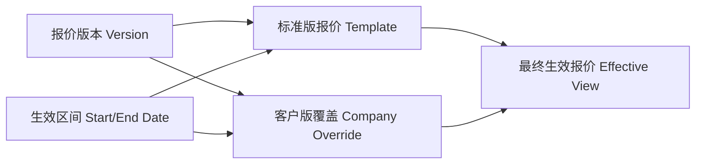
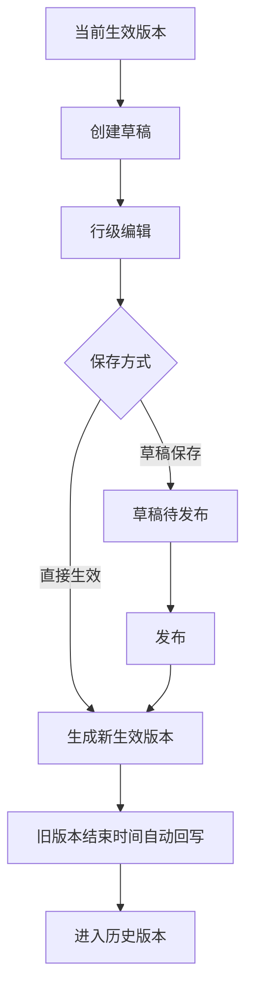
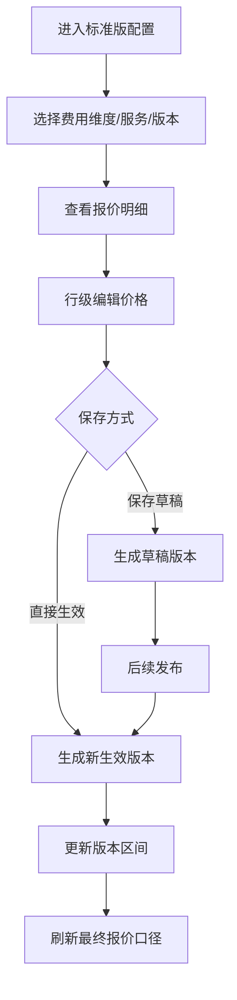
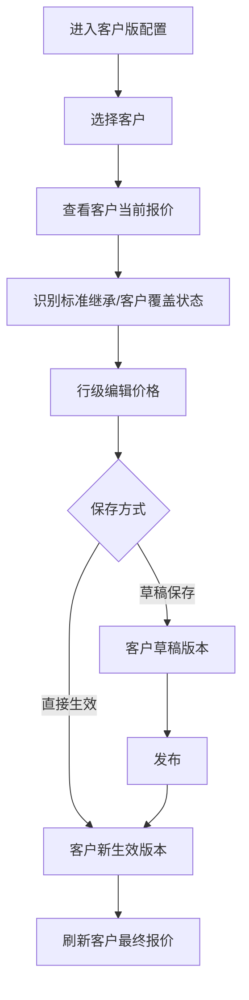
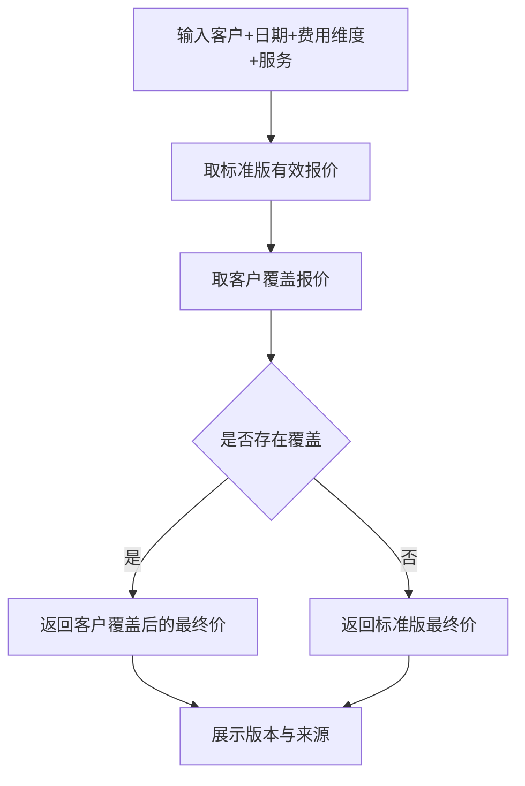
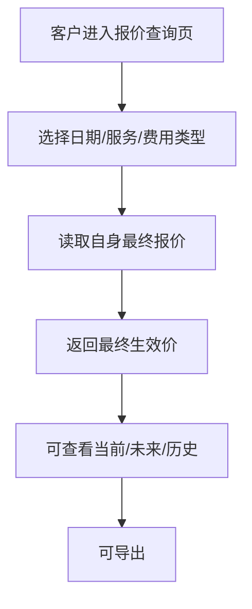

# 核心方案设计草稿（Architecture）

> **方案ID**: ARCH-BILLING-QUOTE-001\
> **关联RDD**: RDD-BILLING-QUOTE-001\
> **创建日期**: 2026-03-21\
> **负责人**: Dennis\
> **状态**: 草稿待确认\
> **依赖文档**: drafts/2026-03-21-报价配置优化与客户报价查询需求分析-v1/RDD.md

***

## 一、方案目标

本方案用于解决报价体系当前的三类核心问题：

1. 标准版报价缺少独立、显性的配置能力
2. 客户版报价过度依赖导入，不适合高频运营调整
3. 客户和内部都缺少“最终生效报价”的统一查询口径

本次方案遵循两个原则：

- **不推翻现有底层计费逻辑**：继续保留标准版底稿、客户覆盖、版本生效的既有机制
- **把隐性数据关系产品化**：标准版、客户版、最终生效价都要成为页面上可识别、可操作、可解释的对象

***

## 二、核心模型设计

### 2.1 三层报价模型

本次方案采用“三层口径、两种存储逻辑”的结构：

```text
Layer 1: 标准版报价（Template Quotation）
  - 面向内部运营维护
  - 作为客户版默认继承底稿
  - 按服务、费用维度、版本、生效时间管理

Layer 2: 客户版报价（Company Quotation）
  - 面向指定客户维护
  - 对标准版做差异覆盖
  - 仅维护已有明细项的价格变化，不改结构

Layer 3: 最终生效报价（Effective Quotation Snapshot / View）
  - 面向内部查询与客户展示
  - 对某客户、某日期、某费用维度、某服务给出最终价格结果
  - 查询口径统一，但客户与内部返回字段不同
```

### 2.2 模型关系



### 2.3 关键设计决策

| 决策点         | 方案          | 原因                         |
| ----------- | ----------- | -------------------------- |
| 标准版是否独立管理   | 是           | 标准版必须显性化，否则无法解决“只能配客户版”的痛点 |
| 客户版是否保留差异维护 | 是           | 兼容现有底层逻辑，避免重构计费链路          |
| 是否生成完整快照口径  | 是           | 解决客户展示和内部核对问题              |
| 是否开放结构变更    | 否           | 本期仅支持既有行项编辑，控制风险           |
| 页面维护方式      | 页面直编 + 导入并存 | 同时满足高频小改和批量导入两类场景          |

***

## 三、页面结构设计

### 3.1 整体页面拓扑

本期采用“配置统一、查询独立”的结构：

```text
报价配置中心
  ├─ 标准版配置
  └─ 客户版配置

客户报价查询
  ├─ 内部查询视图
  └─ 客户查询视图
```

### 3.2 配置中心

配置中心是内部运营主入口，统一承载两套配置能力：

| 视图    | 目标用户      | 核心功能                  |
| ----- | --------- | --------------------- |
| 标准版配置 | 计费运营、产品运营 | 管理标准报价、版本、生效时间、行级价格编辑 |
| 客户版配置 | 计费运营、客服   | 管理客户覆盖价、版本发布、复制、直存    |

### 3.3 查询页

查询页独立于配置中心，避免客户视角与后台维护视角混在一起：

| 查询视图 | 目标用户     | 展示口径                |
| ---- | -------- | ------------------- |
| 内部查询 | 运营、客服、销售 | 最终生效价 + 生效区间 + 来源信息 |
| 客户查询 | OMS 客户   | 最终生效价，仅展示客户可读字段     |

***

## 四、功能方案设计

### 4.1 标准版配置

#### 4.1.1 页面目标

让标准版从“底层配置数据”变成“可管理的产品对象”。

#### 4.1.2 核心能力

- 标准版报价列表
- 按费用维度查看服务报价
- 查看版本和生效区间
- 行级价格编辑
- 草稿保存
- 发布生效
- 历史版本追溯
- 导入能力保留

#### 4.1.3 交互规则

- 默认展示当前生效版本
- 可切换查看未来版本与历史版本
- 行级编辑仅允许修改已有价格值
- 发布时必须填写生效时间
- 若存在未来版本冲突，则阻止发布并提示

### 4.2 客户版配置

#### 4.2.1 页面目标

让客户报价维护由“文件导入驱动”升级为“页面可视化维护驱动”。

#### 4.2.2 核心能力

- 客户报价列表
- 客户报价详情
- 服务/费用维度查看
- 行级价格编辑
- 草稿保存
- 发布生效
- 直接保存生效
- 复制到其他客户
- 折扣复制
- 导入能力保留

#### 4.2.3 关键表达

客户版页面要明确表达每条报价的来源状态：

| 状态    | 含义                |
| ----- | ----------------- |
| 使用标准版 | 当前客户没有覆盖，最终价继承标准版 |
| 已客户覆盖 | 当前客户存在专属覆盖价       |
| 草稿待发布 | 当前存在未生效编辑内容       |
| 历史版本  | 已过期，仅支持查看         |

### 4.3 最终报价查询

#### 4.3.1 查询口径

查询逻辑统一按“某客户 + 某日期 + 某费用维度 + 某服务”返回最终价格。

最终结果生成规则：

1. 先找到该日期下有效的标准版报价
2. 再检查该客户是否存在同日期有效的覆盖价
3. 如有覆盖，以客户覆盖价为准
4. 如无覆盖，沿用标准价
5. 输出最终结果，并附带版本与来源信息供内部使用

#### 4.3.2 内部与客户差异

| 字段类型      | 内部查询  | 客户查询      |
| --------- | ----- | --------- |
| 客户信息      | 显示    | 仅显示当前登录客户 |
| 服务/费用维度   | 显示    | 显示        |
| 最终价格      | 显示    | 显示        |
| 生效区间      | 显示    | 显示        |
| 来源信息      | 显示    | 不显示       |
| 标准价/覆盖价差异 | 可扩展显示 | 不显示       |

***

## 五、版本与生效机制

### 5.1 报价生命周期



### 5.2 生效规则

| 规则编号 | 规则说明                   |
| ---- | ---------------------- |
| AR01 | 任一新版本必须有明确开始生效时间       |
| AR02 | 同一对象同一费用维度下，生效区间不得重叠   |
| AR03 | 发布新版本后，上一有效版本结束时间需自动收口 |
| AR04 | 历史版本只读，不可直接覆盖          |
| AR05 | 直接生效也必须保留版本记录和操作日志     |

### 5.3 草稿与直存并存逻辑

| 模式     | 适用场景            | 特点          |
| ------ | --------------- | ----------- |
| 草稿后发布  | 未来排期、批量修改、需确认场景 | 风险低、适合运营主流程 |
| 直接保存生效 | 紧急修价、即时生效场景     | 效率高，但需权限控制  |

建议：

- 默认主流程为“草稿后发布”
- “直接保存生效”仅对高权限角色开放

***

## 六、权限设计

### 6.1 角色建议

| 角色      | 权限                            |
| ------- | ----------------------------- |
| 产品/计费运营 | 可查看标准版、编辑标准版、查看客户版、编辑客户版、发布草稿 |
| 客服/销售   | 可查询最终报价，可查看客户版，不可改标准版         |
| 高权限管理员  | 具备直接保存生效权限                    |
| OMS 客户  | 仅可查看自身最终报价                    |

### 6.2 权限边界

| 场景      | 权限要求        |
| ------- | ----------- |
| 编辑标准版报价 | 内部运营角色      |
| 编辑客户版报价 | 内部运营/客服授权角色 |
| 直接保存生效  | 高权限角色       |
| 客户导出报价  | 仅自身数据       |

***

## 七、核心流程设计

### 7.1 标准版编辑流程



### 7.2 客户版编辑流程



### 7.3 内部查询流程



### 7.4 客户查询流程



***

## 八、异常与边界处理

### 8.1 配置侧异常

| 场景              | 风险     | 处理策略            |
| --------------- | ------ | --------------- |
| 新版本开始时间早于已有未来版本 | 版本区间冲突 | 阻止保存并提示         |
| 草稿未发布又重复创建草稿    | 运营误操作  | 限制同对象仅保留一份待发布草稿 |
| 行级编辑缺失关键价格      | 数据不完整  | 阻止提交并高亮缺失行      |
| 直接生效后需要回退       | 误操作风险  | 通过版本回滚，不做无痕恢复   |

### 8.2 查询侧异常

| 场景            | 风险     | 处理策略           |
| ------------- | ------ | -------------- |
| 指定日期无有效报价     | 查询结果为空 | 明确提示“该日期无生效报价” |
| 标准版存在但客户覆盖不完整 | 展示不一致  | 按标准版补全最终口径     |
| 历史版本缺失来源信息    | 解释困难   | 内部侧保留最低限度来源标识  |

### 8.3 权限侧异常

| 场景         | 风险    | 处理策略                    |
| ---------- | ----- | ----------------------- |
| 普通角色误用直接生效 | 高风险改价 | 仅高权限开放                  |
| 客户看到非本公司报价 | 数据泄露  | 所有客户查询强制 company\_id 隔离 |

***

## 九、风险探测

| 风险                  | 等级 | 说明                     | 缓解方案                 |
| ------------------- | -- | ---------------------- | -------------------- |
| 标准版显性化后与现有客户版逻辑耦合复杂 | P1 | 标准版长期被隐式使用，页面化后要防止口径错配 | Phase 3 中明确规则编号与页面口径 |
| 直存与草稿并存导致操作心智复杂     | P1 | 用户可能误解两种入口差异           | 默认推荐草稿，直存仅高权限显示      |
| 客户查询与内部查询字段边界不清     | P1 | 易产生信息泄露风险              | 查询口径统一，返回字段分级        |
| 历史版本逻辑不清晰           | P2 | 影响内部核价与客户追溯            | PRD 中单列历史规则章节        |

***

## 十、待确认决策点

| #  | 决策点              | 当前建议          |
| -- | ---------------- | ------------- |
| D1 | 标准版配置是否按区域/国家分视图 | 建议是           |
| D2 | 直接生效的权限开放范围      | 建议仅高权限角色      |
| D3 | 客户导出格式           | 建议 MVP 先做列表导出 |
| D4 | 内部查询是否展示覆盖标记     | 建议展示          |

***

## 十一、下一步建议

当前方案草稿确认后，可进入 Phase 3 生成正式 PRD，届时应补齐：

1. 中文 PRD 正文
2. 业务规则编号（R01、R02…）
3. Mermaid 流程图
4. ASCII 页面线框图
5. 验收标准汇总

***

**文档版本**: ARCH-BILLING-QUOTE-001 V1.0\
**最后更新**: 2026-03-21\
**说明**: 本文件为独立新草稿，用于与其他工具生成内容做对比，不覆盖任何现有文件。
