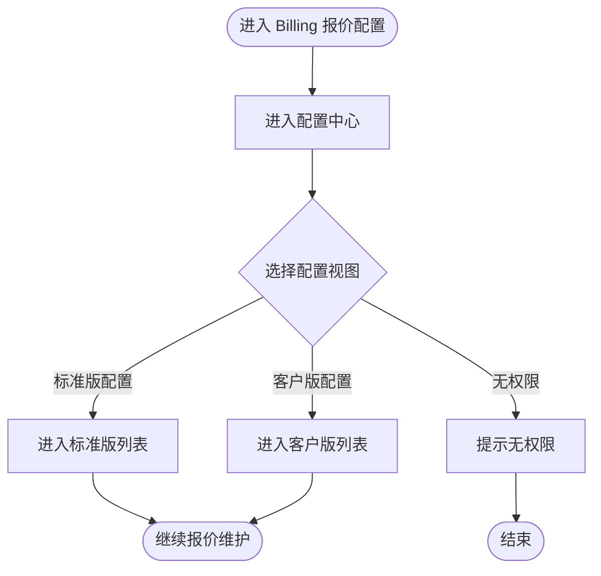
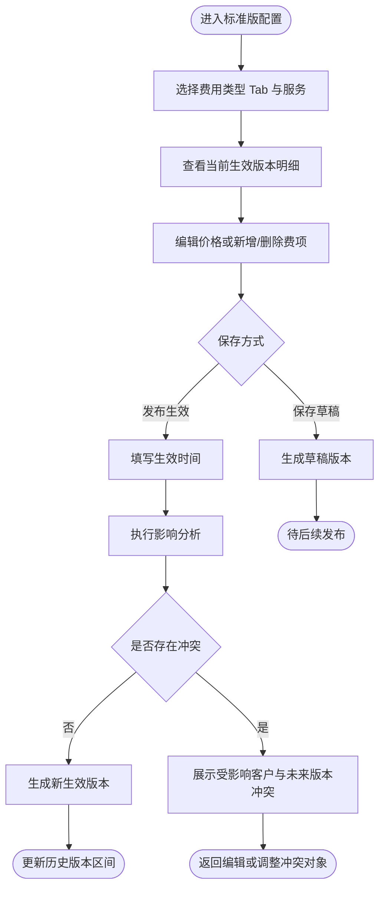
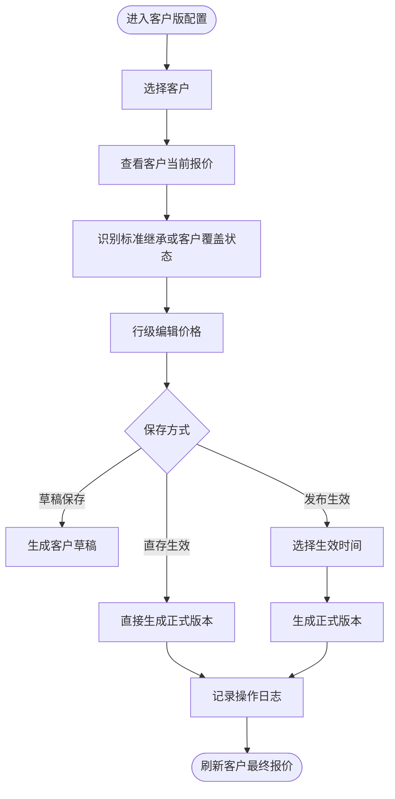
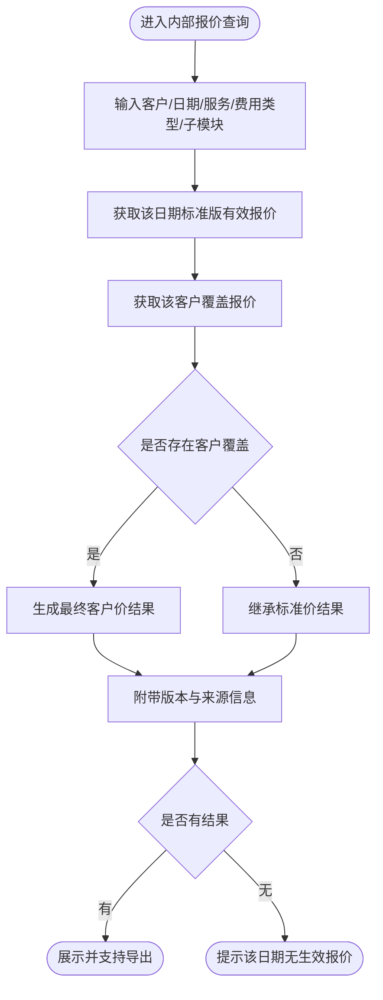
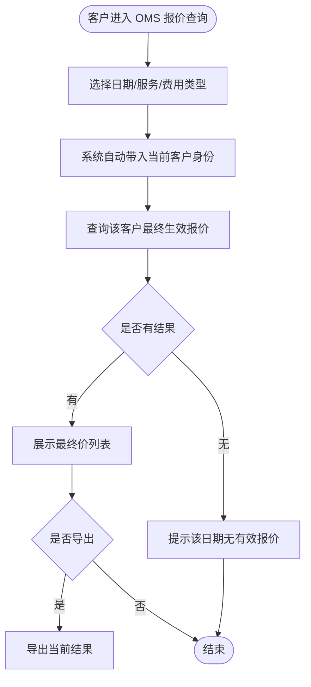

# ShipSage 报价配置页面优化与客户报价查询 PRD

## 文档信息

| 项目 | 内容 |
|------|------|
| 状态 | 草稿 |
| 负责人 | Dennis |
| 贡献者 | Codex |
| 审批人 | 待定 |
| 审批日期 | 待定 |
| 决策 | 待评审 |
| 创建日期 | 2026-03-21 |
| 最后更新 | 2026-03-21 |
| 版本 | V1.0 |

## 目录

- [版本历史](#版本历史)
- [术语表](#术语表)
- [业务背景](#业务背景)
- [用户与场景](#用户与场景)
- [设计思路](#设计思路)
- [菜单配置](#菜单配置)
- [初始化配置](#初始化配置)
- [风险评估](#风险评估)
- [开发范围](#开发范围)
- [任务详情](#任务详情)
- [非功能需求](#非功能需求)
- [验收标准汇总](#验收标准汇总)
- [附录](#附录)

---

## 版本历史

| 版本 | 作者 | 日期 | 备注 |
|------|------|------|------|
| V1.0 | Codex | 2026-03-21 | 初稿，基于 RDD 与 Architecture 组装正式 PRD |

---

## 术语表

| 术语 | 说明 |
|------|------|
| 标准版报价 | 面向内部维护的基准报价，作为客户版默认继承底稿 |
| 客户版报价 | 面向指定客户维护的报价覆盖内容 |
| 最终生效报价 | 某客户在某日期、某服务、某费用类型/子模块下真实生效的最终价格结果 |
| 草稿 | 尚未正式生效的待发布报价版本 |
| 直存生效 | 跳过等待阶段，直接生成正式生效版本的操作 |
| 费用类型 | 报价管理的一级分类，共七大费用类型，以主 Tab 承载 |
| 费用子模块 | 某费用类型下的二级分类，如运费下的基础运费、附加费、材积系数 |
| 结构变更 | 针对标准版报价明细的新增行、删除行、费项调整等结构级变化 |
| 影响分析 | 标准版结构变更发布前，对受影响客户报价、未来版本和冲突情况的系统识别结果 |

---

## 业务背景

### 背景

当前 ShipSage Billing 报价体系在底层已经具备“标准版 + 客户覆盖”的能力，但产品层面的可管理性与可展示性不足，导致报价配置效率低、客户查询体验弱、内部解释成本高。

结合现状文档与现有能力盘点，当前存在四个核心问题：

1. 标准版报价缺少独立、显性的配置入口，更多像底层数据而不是可管理对象。
2. 客户版报价强依赖导入和批量流程，不适合高频小范围调价。
3. 最终生效报价由“标准版 + 客户覆盖”叠加产生，难以直接向客户提供一份完整可读的报价结果。
4. 现有查询更偏后台清单，缺少版本、生效区间、来源口径与客户视角的结果展示。

本期希望通过报价配置中心与最终报价查询能力，完成从“底层报价能力”到“产品化报价管理”的升级。

### 业务目标

| 目标类型 | 目标描述 | 度量指标 | 目标值 |
|----------|----------|----------|--------|
| 运营效率 | 常规调价不再强依赖 Excel 导入 | 小范围调价场景页面完成占比 | 上线后 2 个月内 >= 70% |
| 数据一致性 | 内部与客户看到同一套最终报价口径 | 内外部最终价口径一致率 | >= 99% |
| 客户体验 | 客户可自助查询当前/未来/历史报价 | 客户报价自助查询覆盖率 | 上线后 2 个月内覆盖核心客户 |
| 可追溯性 | 报价版本变更可追踪可回溯 | 生效版本留痕完整率 | 100% |

### 利益相关者

| 团队 | 角色 | 备注 |
|------|------|------|
| 产品 | 产品经理 | 负责范围、规则与验收 |
| Billing 运营 | 计费运营、产品运营 | 标准版与客户版报价维护主用户 |
| 客服/销售 | 内部查询用户 | 需要对外解释报价、核价 |
| OMS 客户 | 外部查询用户 | 只查询自身最终生效价 |
| 开发 | 前后端开发 | 负责配置中心和查询能力实现 |
| 测试 | QA | 负责版本、生效口径和权限验证 |

### 不在本期范围

| 排除项 | 原因 |
|--------|------|
| 重构底层计费引擎 | 本期目标是产品化配置与查询，不改计费核心链路 |
| 客户版自由增删报价结构项 | 客户版本期仍以覆盖模式为主，不开放任意结构增删 |
| 向客户暴露标准价或覆盖差异 | 客户口径固定为最终生效价 |
| 输出代码级实现方案 | 本文用于产品评审与开发对接，不展开到代码设计稿 |

---

## 用户与场景

### 用户角色

| 角色 | 描述 | 核心痛点 | 核心诉求 |
|------|------|----------|----------|
| 计费运营 | 维护标准版与客户版报价 | 小改价也要走导入或复杂版本流 | 页面化、结构清晰、版本可控 |
| 客服/销售 | 对外解释报价、核价 | 找不到某客户某天的最终价 | 能快速查最终价并解释来源 |
| 高权限管理员 | 控制紧急生效操作 | 急调价场景缺少受控通道 | 允许直存生效但需留痕 |
| OMS 客户 | 查询自身报价 | 无法自助获取完整有效报价 | 看到可读、可信、可导出的最终价 |

### 核心场景

场景一：运营维护标准版报价  
运营进入报价配置中心，切换到标准版配置，先选择一级费用类型 Tab，再在类型内查看二级子模块和服务版本明细，不仅可以修改价格，也可以新增或删除标准版费项行；发布前系统自动识别受影响客户、未来版本冲突和继承风险，再决定是否允许发布。

场景二：运营维护客户版覆盖报价  
运营或客服进入客户版配置，选择客户后查看该客户当前继承标准价还是已有覆盖，对具体行项目做价格调整，并选择草稿发布或直存生效。

场景三：内部核价与对客解释  
内部用户按客户、日期、服务、费用类型/子模块查询最终生效价，查看当前生效口径、版本、生效区间和来源信息，用于销售报价解释、客服答复与对账。

场景四：客户自助查看报价  
OMS 客户进入报价查询页，只看到对自己生效的最终价格结果，支持按日期、服务、费用类型筛选，并导出。

---

## 设计思路

### 核心设计理念

1. 显性化模型：把标准版、客户版、最终生效价从隐性数据关系转成产品中可识别对象。
2. 双轨维护：页面直编解决高频小改，导入保留批量维护能力。
3. 统一口径：内部与客户共用同一套最终生效价口径，只在展示字段上做权限分层。
4. 先识别影响，再允许发布：凡是标准版结构变更，必须先看到对客户版和未来版本的影响分析。

### 方案选择

#### 决策点 1：配置入口结构

| 方案 | 优点 | 缺点 | 决策 |
|------|------|------|------|
| 统一配置中心，分标准版/客户版两视图 | 结构清晰，便于理解两套报价关系 | 页面改造范围较大 | 采用 |
| 分散在原有多个页面继续扩展 | 改动小 | 用户理解成本高，问题继续隐性化 | 放弃 |

#### 决策点 2：报价维护方式

| 方案 | 优点 | 缺点 | 决策 |
|------|------|------|------|
| 页面直编 + 导入并存 | 同时满足小改和批量维护 | 交互规则需清晰设计 | 采用 |
| 仅保留导入 | 与现状一致，实现成本低 | 无法解决运营效率问题 | 放弃 |

#### 决策点 3：客户查询展示口径

| 方案 | 优点 | 缺点 | 决策 |
|------|------|------|------|
| 仅展示最终生效价 | 简洁、稳定、不会泄露内部逻辑 | 客户看不到叠加过程 | 采用 |
| 展示标准价与客户覆盖差异 | 解释更完整 | 泄露内部结构，理解负担重 | 放弃 |

### 关键设计决策

| # | 决策 | 理由 |
|---|------|------|
| 1 | 标准版报价必须独立成视图 | 否则无法真正解决“只能配客户版”的现状问题 |
| 2 | 客户版继续采用覆盖式维护 | 兼容现有底层逻辑，避免重构计费链路 |
| 3 | 引入最终生效报价视图作为统一查询口径 | 支撑内部核价与客户展示 |
| 4 | 标准版支持结构增删，但发布前必须完成影响分析 | 满足真实业务维护需求，同时控制冲突风险 |
| 5 | 默认主流程为草稿后发布 | 更符合运营管理和风险控制 |
| 6 | 直存生效仅开放给高权限角色 | 满足紧急调价，同时控制误操作风险 |

---

## 菜单配置

| 应用 | 菜单路径 | URL | 类型 | 图标 | 权限 |
|------|----------|-----|------|------|------|
| ShipSage Admin | Billing / Quotation / 配置中心 | `/admin/billing/quotation/config-center` | menu | mdi-cash-edit | 计费运营、产品运营 |
| ShipSage Admin | Billing / Quotation / 最终报价查询 | `/admin/billing/quotation/effective-query` | menu | mdi-magnify | 计费运营、客服、销售 |
| ShipSage OMS | Billing / 报价查询 | `/oms/billing/quotation/query` | menu | mdi-file-search | OMS 客户 |

---

## 初始化配置

| 应用 | 初始化内容 | 备注 |
|------|------------|------|
| ShipSage Admin | 新增配置中心菜单权限、最终报价查询权限 | 发布前由后台配置 |
| ShipSage OMS | 为目标客户开通报价查询菜单 | 分客户灰度开通 |
| Billing | 初始化标准版与客户版状态映射、来源标签文案 | 由产品与运营确认 |

---

## 风险评估

| 应用 | 模块 | 优先级 | 风险描述 | 解决方案 |
|------|------|--------|----------|----------|
| ShipSage Admin | 配置中心 | P1 | 标准版显性化后与现有客户版逻辑容易混淆 | 页面中明确“标准版/客户版/最终价”关系与状态标签 |
| ShipSage Admin | 标准版结构变更 | P1 | 新增或删除标准版费项可能影响已继承该版本的客户与未来版本 | 发布前强制执行影响分析并展示冲突清单 |
| ShipSage Admin | 版本生效 | P1 | 草稿、发布、直存并存，用户可能误用 | 默认突出草稿发布，直存仅高权限可见 |
| ShipSage Admin / OMS | 查询 | P1 | 内外部字段边界不清可能造成信息泄露 | 严格区分内部字段与客户字段 |
| Billing | 历史版本 | P2 | 历史版本口径不清会影响核价与追溯 | 在 PRD 中定义统一历史查询规则 |

---

## 开发范围

| 应用 | 模块 | Task # | 任务名称 | 描述 |
|------|------|--------|----------|------|
| ShipSage Admin | Billing Quotation | T1 | 报价配置中心 | 新增统一配置中心，包含标准版配置与客户版配置两视图 |
| ShipSage Admin | Billing Quotation | T2 | 标准版报价管理 | 支持标准版列表、详情、价格编辑、增删行、影响分析、草稿发布与历史查看 |
| ShipSage Admin | Billing Quotation | T3 | 客户版报价管理 | 支持客户版列表、详情、覆盖识别、行级编辑、复制与直存 |
| ShipSage Admin | Billing Query | T4 | 内部最终报价查询 | 支持内部按客户、日期、服务、费用类型/子模块查询最终生效报价 |
| ShipSage OMS | Billing Query | T5 | 客户最终报价查询 | 支持客户侧查询自身最终生效报价并导出 |

---

## 任务详情

### T1: 报价配置中心

> 在 Billing 下新增统一配置中心，承接标准版配置与客户版配置入口。

#### 1.1 业务流程



#### 1.2 页面线框图

```text
┌──────────────────────────────────────────────────────────────────────┐
│  报价配置中心                                  [导入] [导出] [帮助] │
├──────────────────────────────────────────────────────────────────────┤
│  [标准版配置] [客户版配置]                                          │
├──────────────────────────────────────────────────────────────────────┤
│  当前视图说明：标准版作为底稿；客户版用于覆盖；最终价用于查询展示     │
├──────────────────────────────────────────────────────────────────────┤
│  ┌──────────────────────────────────────────────────────────────┐    │
│  │ 左侧导航/筛选区                                             │    │
│  │ [七大费用类型 Tab] [服务 ▼] [状态 ▼] [搜索框]              │    │
│  └──────────────────────────────────────────────────────────────┘    │
│  ┌──────────────────────────────────────────────────────────────┐    │
│  │ 右侧内容区                                                   │    │
│  │ 标题：标准版配置 / 客户版配置                                │    │
│  │ 列表或详情内容按当前视图展示                                 │    │
│  └──────────────────────────────────────────────────────────────┘    │
└──────────────────────────────────────────────────────────────────────┘
```

交互说明：
- 用户进入配置中心后，默认落在上次使用视图；首次进入默认展示标准版配置。
- 页面头部需始终展示三层关系说明，帮助用户理解“标准版、客户版、最终生效价”的关系。

#### 1.3 功能说明

| 功能点 | 描述 | 业务规则 |
|--------|------|----------|
| 配置中心入口 | 在 Billing 报价菜单下新增统一入口，承接配置类操作 | R01: 所有报价配置动作统一从配置中心进入 |
| 视图切换 | 支持标准版配置与客户版配置两个主视图切换 | R02: 用户只能看到自己有权限的视图 |
| 关系说明区 | 页面顶部展示报价三层模型的解释文案 | R03: 配置中心必须显式说明标准版、客户版、最终价关系 |
| 通用操作区 | 保留导入、导出、帮助等公共能力入口 | R04: 旧有导入能力必须保留，不因直编而移除 |

#### 1.4 数据对象设计

| 对象 | 关键字段 | 说明 |
|------|----------|------|
| 配置视图状态 | 当前视图、筛选条件、最近访问对象 | 用于提升配置中心使用连续性 |
| 报价来源标签 | 标准版、客户覆盖、草稿、历史 | 用于界面状态表达统一 |

### T2: 标准版报价管理

> 提供标准版报价的独立列表、详情、价格编辑、结构增删、影响分析与版本管理能力。

#### 2.1 业务流程



#### 2.2 页面线框图

```text
┌────────────────────────────────────────────────────────────────────────────┐
│  标准版配置                     [新增费项] [删除费项] [保存草稿] [发布] │
├────────────────────────────────────────────────────────────────────────────┤
│  [运费] [操作费] [仓储费] [关务费] [增值服务费] [包材费] [其他费用]        │
├────────────────────────────────────────────────────────────────────────────┤
│  [基础运费] [附加费] [材积系数] [分区规则]                                 │
├────────────────────────────────────────────────────────────────────────────┤
│  版本信息：当前生效版本 V2026.03.01   生效区间：2026-03-01 ~ 至今          │
├────────────────────────────────────────────────────────────────────────────┤
│  ┌──────┬──────────┬────────┬────────┬────────┬──────────┬────────────┐   │
│  │ 费项 │ 单位     │ 标准价 │ 编辑价 │ 状态   │ 结构动作 │ 操作       │   │
│  ├──────┼──────────┼────────┼────────┼────────┼──────────┼────────────┤   │
│  │ 重量费│ KG       │ 12.00  │ 12.00  │ 生效中 │ 保留     │ [编辑]     │   │
│  │ 处理费│ ORDER    │ 5.00   │ 5.20   │ 草稿中 │ 保留     │ [撤销修改] │   │
│  │ 上架费│ PALLET   │ -      │ 32.00  │ 新增中 │ 新增     │ [删除]     │   │
│  └──────┴──────────┴────────┴────────┴────────┴──────────┴────────────┘   │
├────────────────────────────────────────────────────────────────────────────┤
│  影响分析：受影响客户 23 个 ｜ 存在未来客户版本冲突 4 个 ｜ 高风险删除 1 项 │
│  [查看受影响客户] [查看冲突明细] [仅保存草稿]                               │
│  [历史版本] [未来版本] [版本对比]                                          │
└────────────────────────────────────────────────────────────────────────────┘
```

交互说明：
- 标准版表格支持新增行、删除行和价格编辑，但结构增删仅对标准版开放。
- 点击“发布”时必须先展示影响分析；若存在未来客户版本冲突或删除项冲突，则默认阻断发布。

#### 2.3 功能说明

| 功能点 | 描述 | 业务规则 |
|--------|------|----------|
| 标准版列表 | 按费用类型 Tab、费用子模块、服务、版本、生效状态查看标准版对象 | R05: 标准版必须可独立按费用类型、子模块与服务查询 |
| 当前版本查看 | 查看当前生效版本的完整明细与生效区间 | R06: 默认展示当前生效版本 |
| 历史/未来切换 | 支持查看历史版本和未来排期版本 | R07: 历史版本只读，未来版本可进入编辑 |
| 价格编辑 | 支持对既有行项目价格做页面编辑 | R08: 标准版支持价格编辑，变更需进入草稿或发布流 |
| 结构增删 | 支持新增标准版费项行或删除已有费项行 | R09: 标准版允许结构增删，客户版不开放同级自由增删 |
| 草稿保存 | 支持生成或更新待发布草稿 | R10: 同一对象同一维度仅允许存在一份待发布草稿 |
| 影响分析 | 发布前展示受影响客户、未来版本冲突和删除风险 | R11: 标准版结构变更发布前必须执行影响分析 |
| 发布生效 | 支持设置生效时间并发布为正式版本 | R12: 新版本生效区间不得与现有版本重叠；存在高风险冲突时不得直接发布 |
| 导入保留 | 支持继续使用模板导入维护标准版数据 | R13: 页面直编与导入必须并存 |

#### 2.4 数据对象设计

| 对象 | 关键字段 | 说明 |
|------|----------|------|
| 标准版报价头 | 费用类型、费用子模块、服务、版本号、生效起止时间、状态 | 用于版本级管理 |
| 标准版报价明细 | 费项、单位、价格、排序、变更标记、结构动作 | 用于价格编辑与结构变更 |
| 标准版草稿 | 草稿版本号、编辑人、编辑时间 | 用于发布前存储状态 |
| 影响分析结果 | 受影响客户数、冲突客户数、冲突版本、风险级别 | 用于发布前决策 |

### T3: 客户版报价管理

> 在客户视角下管理客户报价覆盖，明确继承标准版与客户覆盖关系。

#### 3.1 业务流程



#### 3.2 页面线框图

```text
┌────────────────────────────────────────────────────────────────────────────┐
│  客户版配置                           [导入] [保存草稿] [发布] [直存生效] │
├────────────────────────────────────────────────────────────────────────────┤
│  [客户 ▼] [运费] [操作费] [仓储费] [关务费] [增值服务费] [包材费] [其他费用] │
├────────────────────────────────────────────────────────────────────────────┤
│  [基础运费] [附加费] [材积系数] [分区规则] [服务 ▼] [版本 ▼] [状态 ▼]      │
├────────────────────────────────────────────────────────────────────────────┤
│  客户：ABC Logistics    当前口径：部分沿用标准版 / 部分客户覆盖            │
├────────────────────────────────────────────────────────────────────────────┤
│  ┌──────┬──────────┬────────┬────────┬────────────┬────────┬───────────┐ │
│  │ 费项 │ 单位     │ 标准价 │ 客户价 │ 最终结果   │ 状态   │ 操作      │ │
│  ├──────┼──────────┼────────┼────────┼────────────┼────────┼───────────┤ │
│  │ 重量费│ KG       │ 12.00  │ 12.50  │ 客户覆盖   │ 生效中 │ [编辑]    │ │
│  │ 处理费│ ORDER    │ 5.00   │ -      │ 继承标准版 │ 生效中 │ [编辑]    │ │
│  └──────┴──────────┴────────┴────────┴────────────┴────────┴───────────┘ │
│  [复制到其他客户] [应用折扣] [历史版本] [未来版本]                         │
└────────────────────────────────────────────────────────────────────────────┘
```

交互说明：
- 当某行未配置客户价时，页面应清晰展示“继承标准版”，而不是空白无解释。
- “直存生效”按钮仅高权限角色可见，且需二次确认。

#### 3.3 功能说明

| 功能点 | 描述 | 业务规则 |
|--------|------|----------|
| 客户选择 | 按客户进入客户版配置上下文 | R12: 客户版配置必须以客户为首要上下文 |
| 继承/覆盖识别 | 对每条明细展示当前是继承标准版还是客户覆盖 | R13: 页面必须显式标识价格来源状态 |
| 行级编辑 | 对客户已存在或可覆盖的既有明细项进行价格编辑 | R14: 客户版只允许覆盖既有行项目价格 |
| 草稿保存 | 支持保存客户报价草稿 | R15: 草稿不影响当前正式生效报价 |
| 发布生效 | 支持设定生效时间正式发布 | R16: 发布后需形成独立可追溯版本 |
| 直存生效 | 支持紧急调价直接生成生效版本 | R17: 直存生效必须保留版本记录和操作日志 |
| 复制与折扣 | 保留复制到其他客户、折扣复制等能力 | R18: 现有高频批量操作能力不得丢失 |
| 历史版本查看 | 支持查看历史已失效客户版本 | R19: 历史版本仅查看，不允许直接改写 |
| 标准版结构继承处理 | 当标准版新增费项或删除费项时，客户版需明确显示继承、待确认或冲突状态 | R19A: 标准版结构变更后，所有使用该标准版的客户必须重新计算继承关系 |

#### 3.4 数据对象设计

| 对象 | 关键字段 | 说明 |
|------|----------|------|
| 客户版报价头 | 客户、费用类型、费用子模块、服务、版本号、生效起止时间、状态 | 用于客户版版本治理 |
| 客户版报价明细 | 费项、标准价、客户覆盖价、最终价展示状态 | 用于客户覆盖判断 |
| 操作留痕 | 操作类型、操作人、时间、版本结果 | 用于直存和发布审计 |

### T4: 内部最终报价查询

> 提供内部统一的最终生效报价查询能力，用于核价、答复客户和对账。

#### 4.1 业务流程



#### 4.2 页面线框图

```text
┌────────────────────────────────────────────────────────────────────────────┐
│  最终报价查询（内部）                                        [导出结果]   │
├────────────────────────────────────────────────────────────────────────────┤
│  [客户 ▼] [日期] [服务 ▼] [运费] [操作费] [仓储费] [其他费用] [来源状态 ▼] │
├────────────────────────────────────────────────────────────────────────────┤
│  [基础运费] [附加费] [材积系数] [分区规则] [查询] [重置]                   │
├────────────────────────────────────────────────────────────────────────────┤
│  查询口径说明：结果为所选日期的最终生效价，内部可查看来源与版本信息         │
├────────────────────────────────────────────────────────────────────────────┤
│  ┌──────┬──────────┬────────┬────────────┬──────────────┬──────────────┐ │
│  │ 费项 │ 单位     │ 最终价 │ 来源类型   │ 来源版本     │ 生效区间     │ │
│  ├──────┼──────────┼────────┼────────────┼──────────────┼──────────────┤ │
│  │ 重量费│ KG       │ 12.50  │ 客户覆盖   │ CV2026.03.21 │ 03-21~长期   │ │
│  │ 处理费│ ORDER    │ 5.00   │ 标准版继承 │ TV2026.03.01 │ 03-01~长期   │ │
│  └──────┴──────────┴────────┴────────────┴──────────────┴──────────────┘ │
└────────────────────────────────────────────────────────────────────────────┘
```

交互说明：
- 查询按钮点击后返回统一结果集；空结果时给出明确提示，不展示空白表格。
- 内部查询结果支持按来源状态筛选，用于快速识别哪些项目存在客户覆盖。

#### 4.3 功能说明

| 功能点 | 描述 | 业务规则 |
|--------|------|----------|
| 查询条件 | 支持按客户、日期、服务、费用类型和费用子模块查询 | R20: 最终报价查询必须至少支持客户、日期、服务、费用类型四类筛选，必要时可细化到费用子模块 |
| 统一口径查询 | 按日期计算并返回最终生效报价 | R21: 查询结果必须与正式计费口径一致 |
| 来源信息展示 | 展示来源类型、来源版本和生效区间 | R22: 内部查询必须可解释最终价来源 |
| 多时间维度 | 支持当前、未来、历史查询 | R23: 查询时间口径统一按查询日期生效规则计算 |
| 导出结果 | 支持导出查询结果 | R24: 导出结果字段需与页面展示字段一致 |

#### 4.4 数据对象设计

| 对象 | 关键字段 | 说明 |
|------|----------|------|
| 最终报价查询条件 | 客户、日期、服务、费用类型、费用子模块、来源状态 | 用于内部搜索与导出 |
| 最终报价结果集 | 费项、单位、最终价、来源类型、来源版本、生效区间 | 用于内部展示 |

### T5: 客户最终报价查询

> 在 OMS 提供客户自助查询自身最终生效报价的页面。

#### 5.1 业务流程



#### 5.2 页面线框图

```text
┌──────────────────────────────────────────────────────────────────────┐
│  报价查询                                               [导出]      │
├──────────────────────────────────────────────────────────────────────┤
│  [日期] [服务 ▼] [费用类型 ▼] [查询] [重置]                         │
├──────────────────────────────────────────────────────────────────────┤
│  说明：以下为当前账号在所选日期生效的报价结果                        │
├──────────────────────────────────────────────────────────────────────┤
│  ┌──────┬──────────┬────────┬──────────────────────────────────┐    │
│  │ 费项 │ 单位     │ 最终价 │ 生效区间                         │    │
│  ├──────┼──────────┼────────┼──────────────────────────────────┤    │
│  │ 重量费│ KG       │ 12.50  │ 2026-03-21 ~ 长期               │    │
│  │ 处理费│ ORDER    │ 5.00   │ 2026-03-01 ~ 长期               │    │
│  └──────┴──────────┴────────┴──────────────────────────────────┘    │
└──────────────────────────────────────────────────────────────────────┘
```

交互说明：
- 客户页面不出现标准价、覆盖价、来源版本等内部字段。
- 查询与导出均只作用于当前登录客户，不允许切换其他客户。

#### 5.3 功能说明

| 功能点 | 描述 | 业务规则 |
|--------|------|----------|
| 客户身份隔离 | 自动按登录客户查询自身报价 | R25: 客户查询必须强制按登录客户隔离数据 |
| 最终价展示 | 仅展示最终生效价与生效区间 | R26: 客户侧不得展示标准价、覆盖差异与来源细节 |
| 时间查询 | 支持当前、未来、历史报价 | R27: 客户侧时间口径与内部统一 |
| 筛选与导出 | 支持按服务、费用类型筛选并导出 | R28: 导出内容不得超出页面可见字段 |

#### 5.4 数据对象设计

| 对象 | 关键字段 | 说明 |
|------|----------|------|
| 客户查询条件 | 日期、服务、费用类型 | 不包含可切换客户字段 |
| 客户报价结果集 | 费项、单位、最终价、生效区间 | 客户可读字段的最小集合 |

---

## 非功能需求

| 类别 | 需求描述 | 目标值 |
|------|----------|--------|
| 性能 | 配置列表与查询页首屏加载时间 | < 3s |
| 性能 | 常规查询响应时间 | < 2s |
| 可用性 | 报价查询与配置功能可用性 | >= 99.5% |
| 安全 | 客户查询按登录身份严格隔离 | 100% |
| 审计 | 草稿、发布、直存等操作完整留痕 | 100% |
| 一致性 | 页面查询结果与正式生效口径一致 | >= 99% |
| 易用性 | 常见调价场景可在页面完成 | 覆盖核心运营调价场景 |

---

## 验收标准汇总

| Task # | 任务名称 | 关键验收标准 |
|--------|----------|--------------|
| T1 | 报价配置中心 | 用户能清晰进入标准版或客户版配置视图；旧导入能力保留 |
| T2 | 标准版报价管理 | 标准版可独立查看、编辑、草稿保存、发布与历史追溯 |
| T3 | 客户版报价管理 | 客户版可识别继承/覆盖、支持行级编辑、草稿发布、直存和复制 |
| T4 | 内部最终报价查询 | 内部可按客户和日期查询最终价，并查看来源与生效区间 |
| T5 | 客户最终报价查询 | 客户只看到自身最终价，不泄露标准价或内部来源信息 |

AC 优先级说明：
- P0：标准版与客户版配置可用；最终报价查询口径正确；权限隔离正确
- P1：历史版本、未来版本、导出与异常提示完整
- P2：帮助文案、状态标签与易用性细节优化

---

## 附录

| 索引 | 描述 | 备注 |
|------|------|------|
| A1 | 背景文档：ShipSage 报价配置现状 | 用于 Phase 1 需求洞察 |
| A2 | Billing 系统文档 | 用于理解标准版与客户版模型 |
| A3 | RDD 草稿 | `drafts/2026-03-21-报价配置优化与客户报价查询需求分析-v1/RDD.md` |
| A4 | Architecture 草稿 | `drafts/2026-03-21-报价配置优化与客户报价查询方案设计-v1/Architecture.md` |

---

## 使用说明

1. 本 PRD 用于产品评审与开发对接，不等同于代码实现稿。
2. 本 PRD 为独立新草稿文件，用于与你使用其他工具生成的版本进行对比。
3. 若进入下一轮，可在此基础上继续补充接口口径稿、字段定义稿或测试 AC 清单。

---

**文档版本**: V1.0  
**最后更新**: 2026-03-21  
**说明**: 本文件为独立新草稿，用于与其他工具生成内容做对比，不覆盖任何现有文件。
