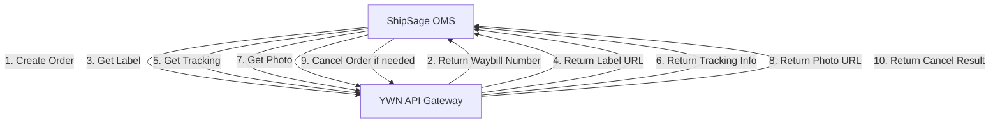

# PRD-ShipSage-OMS-YWN API Integration-2026Q1-V1.0

## History

| **Version** | **Author** | **Comment** |
| --- | --- | --- |
| 1.0 | dennis.he | 2026-03-04 |
|   |   |   |

## Background

We can integrate with YWN (YWE) express service to expand our shipping options and improve logistics efficiency for cross-border e-commerce fulfillment.

## Account

| **Column** | **Comment** |
| --- | --- |
| Service Provider | YWN (YWE) Express |
| API Gateway | /api/gateway |
| API Key | [To be provided] |
| API Token | [To be provided] |
| API Document | https://s.apifox.cn/30a6e192-2b55-47f7-b415-06e95ef5622c |

## Instruction

| **Item** | **Link/Value** |
| --- | --- |
| Instruction | https://s.apifox.cn/30a6e192-2b55-47f7-b415-06e95ef5622c |
| Authorization | API Key + Signature Required |
| API Gateway | /api/gateway |
| Signature Method | MD5 (see Signature Steps below) |

### Signature Steps

**Step 1**: Arrange the parameters in ascending order by the first letter of the dictionary

**Step 2**: Concatenate the api_token to the header and tail of the string obtained in the first step

**Step 3**: The string in the second step is MD5 encrypted

**Signature Sample**:
```
Parameters: {apiKey: "xxx", format: "json", method: "express.order.create", timestamp: 1234567890, version: "V1.0"}
Sorted: apiKey=xxx&format=json&method=express.order.create&timestamp=1234567890&version=V1.0
With Token: {api_token}apiKey=xxx&format=json&method=express.order.create&timestamp=1234567890&version=V1.0{api_token}
MD5: sign = MD5(concatenated_string)
```

## Task

### YWN Integration

#### Flow



#### Integration Flow Diagram

```
┌─────────────────────────────────────────────────────────────────┐
│                        ShipSage OMS                              │
│  ┌──────────────────────────────────────────────────────────┐  │
│  │  1. Order Ready for Shipment                             │  │
│  │     - Validate order data                                │  │
│  │     - Prepare receiver/sender/parcel info                │  │
│  └──────────────────────────────────────────────────────────┘  │
│                            ↓                                     │
│  ┌──────────────────────────────────────────────────────────┐  │
│  │  2. Call YWN Create Express Order API                    │  │
│  │     - Method: express.order.create                       │  │
│  │     - Generate signature                                 │  │
│  │     - Send order details                                 │  │
│  └──────────────────────────────────────────────────────────┘  │
│                            ↓                                     │
│  ┌──────────────────────────────────────────────────────────┐  │
│  │  3. Receive Waybill Number                               │  │
│  │     - Store waybillNumber                                │  │
│  │     - Store orderNumber                                  │  │
│  │     - Store warehouseCode                                │  │
│  └──────────────────────────────────────────────────────────┘  │
│                            ↓                                     │
│  ┌──────────────────────────────────────────────────────────┐  │
│  │  4. Get Shipping Label                                   │  │
│  │     - Method: express.order.label.get                    │  │
│  │     - Download label PDF                                 │  │
│  └──────────────────────────────────────────────────────────┘  │
│                            ↓                                     │
│  ┌──────────────────────────────────────────────────────────┐  │
│  │  5. Track Shipment (Periodic)                            │  │
│  │     - Method: express.order.tracking.get                 │  │
│  │     - Update tracking status                             │  │
│  └──────────────────────────────────────────────────────────┘  │
└─────────────────────────────────────────────────────────────────┘
```

### Function

| **API List** | **Description** | **Comment** |
| --- | --- | --- |
| Create Express Order | **Description**: Creates a new express order with YWN. This endpoint accepts order details including sender, receiver, and parcel information, and returns a waybill number for tracking.<br><br>**Authentication**: API Key + Signature<br><br>**Method**: POST<br>**Endpoint**: /api/gateway<br>**Method Parameter**: express.order.create<br><br>**Query Parameters**:<br>- apiKey: the apiKey (required)<br>- format: body type (current value: json) (required)<br>- method: fix value: express.order.create (required)<br>- timestamp: timestamp in milliseconds, effective time is 5 minutes (required)<br>- version: api version (current value: V1.0) (required)<br>- sign: signature generated based on Signature steps (required)<br><br>**Request Body**:<br>```json<br>{<br>  "orderNumber": "ORD20260304001",<br>  "productCode": "E0001",<br>  "entryWarehouseCode": "IND01",<br>  "subCustomerCode": "C000001",<br>  "ref1": "Reference 1",<br>  "ref2": "Reference 2",<br>  "receiverInfo": {<br>    "name": "John Doe",<br>    "phone": "(123) 456-7890",<br>    "mobile": "1234567890",<br>    "zipCode": "12345",<br>    "email": "john@example.com",<br>    "country": "US",<br>    "state": "CA",<br>    "city": "Los Angeles",<br>    "district": "Downtown",<br>    "address": "123 Main St",<br>    "address2": "Apt 4B"<br>  },<br>  "senderInfo": {<br>    "name": "ShipSage Warehouse",<br>    "phone": "(555) 123-4567",<br>    "mobile": "5551234567",<br>    "zipCode": "90001",<br>    "country": "US",<br>    "state": "CA",<br>    "city": "Los Angeles",<br>    "address": "456 Warehouse Blvd"<br>  },<br>  "returnInfo": {<br>    "name": "ShipSage Returns",<br>    "phone": "(555) 123-4567",<br>    "mobile": "5551234567",<br>    "zipCode": "90001",<br>    "country": "US",<br>    "state": "CA",<br>    "city": "Los Angeles",<br>    "address": "456 Warehouse Blvd"<br>  },<br>  "parcelInfo": {<br>    "length": 30,<br>    "width": 20,<br>    "height": 10,<br>    "totalPrice": 99.99,<br>    "currency": "USD",<br>    "totalWeight": 1500,<br>    "totalQuantity": 2,<br>    "productList": [<br>      {<br>        "sku": "SKU001",<br>        "goodsNameCh": "商品名称",<br>        "goodsNameEn": "Product Name",<br>        "price": 49.99,<br>        "quantity": 2,<br>        "weight": 750,<br>        "hscode": "123456",<br>        "material": "Cotton",<br>        "url": "https://example.com/product"<br>      }<br>    ]<br>  }<br>}<br>```<br><br>**Response**:<br>```json<br>{<br>  "success": true,<br>  "code": 0,<br>  "message": "ok",<br>  "data": {<br>    "waybillNumber": "TESTYWORD01000001607",<br>    "orderNumber": "ORD20260304001",<br>    "warehouseCode": "ORD01",<br>    "threeCode": "N-127",<br>    "fourCode": "N"<br>  }<br>}<br>``` | Required for creating shipments |
| Get Express Order | **Description**: Retrieves details of an existing express order using the waybill number.<br><br>**Authentication**: API Key + Signature<br><br>**Method**: POST<br>**Endpoint**: /api/gateway<br>**Method Parameter**: express.order.get<br><br>**Query Parameters**:<br>- apiKey: the apiKey (required)<br>- format: body type (current value: json) (required)<br>- method: fix value: express.order.get (required)<br>- timestamp: timestamp in milliseconds, effective time is 5 minutes (required)<br>- version: api version (current value: V1.0) (required)<br>- sign: signature generated based on Signature steps (required)<br><br>**Request Body**:<br>```json<br>{<br>  "waybillNumber": "TESTYWORD01000001607"<br>}<br>```<br><br>**Response**:<br>```json<br>{<br>  "success": true,<br>  "code": 0,<br>  "message": "ok",<br>  "data": {<br>    "waybillNumber": "TESTYWORD01000001607",<br>    "orderNumber": "ORD20260304001",<br>    "productCode": "E0001",<br>    "entryWarehouseCode": "IND01",<br>    "status": "CREATED"<br>  }<br>}<br>``` | Required for order inquiry |
| Get Express Label | **Description**: Retrieves the shipping label for an express order in base64 format. The label can be decoded and printed for package identification.<br><br>**Authentication**: API Key + Signature<br><br>**Method**: POST<br>**Endpoint**: /api/gateway<br>**Method Parameter**: express.order.label.get<br><br>**Query Parameters**:<br>- apiKey: the apiKey (required)<br>- format: body type (current value: json) (required)<br>- method: fix value: express.order.label.get (required)<br>- timestamp: timestamp in milliseconds, effective time is 5 minutes (required)<br>- version: api version (current value: V1.0) (required)<br>- sign: signature generated based on Signature steps (required)<br><br>**Request Body**:<br>```json<br>{<br>  "waybillNumber": "TESTYWORD01000001607"<br>}<br>```<br><br>**Response**:<br>```json<br>{<br>  "success": true,<br>  "code": 0,<br>  "message": "ok",<br>  "data": {<br>    "waybillNumber": "TESTYWORD01000001607",<br>    "base64String": "iVBORw0KGgoAAAANSUhEUgAA..."<br>  }<br>}<br>``` | Required for label printing |
| Get Express Tracking | **Description**: Retrieves tracking information and event history for an express order. Returns detailed tracking events with timestamps, locations, and status updates.<br><br>**Authentication**: API Key + Signature<br><br>**Method**: POST<br>**Endpoint**: /api/gateway<br>**Method Parameter**: express.order.tracking.get<br><br>**Query Parameters**:<br>- apiKey: the apiKey (required)<br>- format: body type (current value: json) (required)<br>- method: fix value: express.order.tracking.get (required)<br>- timestamp: timestamp in milliseconds, effective time is 5 minutes (required)<br>- version: api version (current value: V1.0) (required)<br>- sign: signature generated based on Signature steps (required)<br><br>**Request Body**:<br>```json<br>{<br>  "waybillNumber": "TESTYWORD01000001607"<br>}<br>```<br><br>**Response**:<br>```json<br>{<br>  "success": true,<br>  "code": 0,<br>  "message": "ok",<br>  "data": {<br>    "waybillNumber": "TESTYWORD01000001607",<br>    "events": [<br>      {<br>        "message": "Package picked up",<br>        "timestamp": 1709539200000,<br>        "timeZone": "UTC",<br>        "status": "PICKED_UP",<br>        "location": {<br>          "address1": "456 Warehouse Blvd",<br>          "address2": "",<br>          "city": "Los Angeles",<br>          "state": "CA",<br>          "zipCode": "90001",<br>          "country": "US"<br>        }<br>      },<br>      {<br>        "message": "In transit",<br>        "timestamp": 1709625600000,<br>        "timeZone": "UTC",<br>        "status": "IN_TRANSIT",<br>        "location": {<br>          "address1": "Distribution Center",<br>          "address2": "",<br>          "city": "Los Angeles",<br>          "state": "CA",<br>          "zipCode": "90001",<br>          "country": "US"<br>        }<br>      }<br>    ]<br>  }<br>}<br>``` | Required for tracking updates |
| Get Express Photo | **Description**: Retrieves delivery proof photos for an express order. Returns an array of photo groups with titles and base64-encoded PNG images.<br><br>**Authentication**: API Key + Signature<br><br>**Method**: POST<br>**Endpoint**: /api/gateway<br>**Method Parameter**: express.order.photo.get<br><br>**Query Parameters**:<br>- apiKey: the apiKey (required)<br>- format: body type (current value: json) (required)<br>- method: fix value: express.order.photo.get (required)<br>- timestamp: timestamp in milliseconds, effective time is 5 minutes (required)<br>- version: api version (current value: V1.0) (required)<br>- sign: signature generated based on Signature steps (required)<br><br>**Request Body**:<br>```json<br>{<br>  "waybillNumber": "TESTYWORD01000001607"<br>}<br>```<br><br>**Response**:<br>```json<br>{<br>  "success": true,<br>  "code": 0,<br>  "message": "ok",<br>  "data": [<br>    {<br>      "title": "Delivery Photo",<br>      "photos": [<br>        "iVBORw0KGgoAAAANSUhEUgAA...",<br>        "iVBORw0KGgoAAAANSUhEUgBB..."<br>      ]<br>    },<br>    {<br>      "title": "Signature Photo",<br>      "photos": [<br>        "iVBORw0KGgoAAAANSUhEUgCC..."<br>      ]<br>    }<br>  ]<br>}<br>``` | Optional for delivery proof |
| Cancel Express Order | **Description**: Cancels an existing express order. This operation is typically used when an order needs to be voided before pickup or shipment.<br><br>**Authentication**: API Key + Signature<br><br>**Method**: POST<br>**Endpoint**: /api/gateway<br>**Method Parameter**: express.order.cancel<br><br>**Query Parameters**:<br>- apiKey: the apiKey (required)<br>- format: body type (current value: json) (required)<br>- method: fix value: express.order.cancel (required)<br>- timestamp: timestamp in milliseconds, effective time is 5 minutes (required)<br>- version: api version (current value: V1.0) (required)<br>- sign: signature generated based on Signature steps (required)<br><br>**Request Body**:<br>```json<br>{<br>  "waybillNumber": "TESTYWORD01000001607"<br>}<br>```<br><br>**Response**:<br>```json<br>{<br>  "success": true,<br>  "code": 0,<br>  "message": "ok"<br>}<br>``` | Optional for order cancellation |
| Create Manifest Order | **Description**: Creates a manifest order that groups multiple bigbags for pickup. A manifest represents a collection of bigbags ready for warehouse pickup or delivery.<br><br>**Authentication**: API Key + Signature<br><br>**Method**: POST<br>**Endpoint**: /api/gateway<br>**Method Parameter**: manifest.order.create<br><br>**Query Parameters**:<br>- apiKey: the apiKey (required)<br>- format: body type (current value: json) (required)<br>- method: fix value: manifest.order.create (required)<br>- timestamp: timestamp in milliseconds, effective time is 5 minutes (required)<br>- version: api version (current value: V1.0) (required)<br>- sign: signature generated based on Signature steps (required)<br><br>**Request Body**:<br>```json<br>{<br>  "warehouseCode": "WH001",<br>  "externalNumber": "MF20260304001",<br>  "externalBigbagNumbers": [<br>    "BB20260304001",<br>    "BB20260304002"<br>  ],<br>  "expectedPickupTime": 1709625600000,<br>  "pickupKind": 1<br>}<br>```<br><br>**Field Descriptions**:<br>- warehouseCode: the code of warehouse that will pickup the manifest (required)<br>- externalNumber: external manifest number (required)<br>- externalBigbagNumbers: bigbag barcode list (required)<br>- expectedPickupTime: expected pickup time in UTC timestamp milliseconds (required)<br>- pickupKind: pickup type - 1 = pickup, 2 = deliveryToWarehouse (required)<br><br>**Response**:<br>```json<br>{<br>  "success": true,<br>  "code": 0,<br>  "message": "ok",<br>  "data": {<br>    "code": "YWE_MF_001"<br>  }<br>}<br>``` | Optional for bulk shipment management |
| Create Bigbag Order | **Description**: Creates a bigbag order that groups multiple express orders together. A bigbag is a container that holds multiple express packages for consolidated shipping.<br><br>**Authentication**: API Key + Signature<br><br>**Method**: POST<br>**Endpoint**: /api/gateway<br>**Method Parameter**: bigbag.order.create<br><br>**Query Parameters**:<br>- apiKey: the apiKey (required)<br>- format: body type (current value: json) (required)<br>- method: fix value: bigbag.order.create (required)<br>- timestamp: timestamp in milliseconds, effective time is 5 minutes (required)<br>- version: api version (current value: V1.0) (required)<br>- sign: signature generated based on Signature steps (required)<br><br>**Request Body**:<br>```json<br>{<br>  "manifestCode": "YWE_MF_001",<br>  "externalNumber": "BB20260304001",<br>  "externalExpressNumbers": [<br>    "TESTYWORD01000001607",<br>    "TESTYWORD01000001608"<br>  ],<br>  "warehouseCode": "WH001"<br>}<br>```<br><br>**Field Descriptions**:<br>- manifestCode: the code of manifest generated by YWE in manifest.order.create API (required)<br>- externalNumber: the bigbag barcode (required)<br>- externalExpressNumbers: express barcode list (the barcode on express label) (required)<br>- warehouseCode: the code of warehouse that will pickup the bigbag (required)<br><br>**Response**:<br>```json<br>{<br>  "success": true,<br>  "code": 0,<br>  "message": "ok",<br>  "data": {<br>    "code": "YWE_BB_001"<br>  }<br>}<br>``` | Optional for consolidated shipping |

## Test Samples

### 1. Create Express Order Test

**Request**:
```bash
POST /api/gateway?apiKey=YOUR_API_KEY&format=json&method=express.order.create&timestamp=1709539200000&version=V1.0&sign=GENERATED_SIGNATURE

{
  "orderNumber": "TEST_ORD_001",
  "productCode": "E0001",
  "entryWarehouseCode": "IND01",
  "subCustomerCode": "C000001",
  "ref1": "Test Reference 1",
  "ref2": "Test Reference 2",
  "receiverInfo": {
    "name": "Test Receiver",
    "phone": "(123) 456-7890",
    "mobile": "1234567890",
    "zipCode": "12345",
    "email": "test@example.com",
    "country": "US",
    "state": "CA",
    "city": "Los Angeles",
    "district": "Downtown",
    "address": "123 Test Street",
    "address2": "Unit 100"
  },
  "senderInfo": {
    "name": "Test Sender",
    "phone": "(555) 123-4567",
    "mobile": "5551234567",
    "zipCode": "90001",
    "country": "US",
    "state": "CA",
    "city": "Los Angeles",
    "address": "456 Sender Avenue"
  },
  "returnInfo": {
    "name": "Test Returns",
    "phone": "(555) 123-4567",
    "mobile": "5551234567",
    "zipCode": "90001",
    "country": "US",
    "state": "CA",
    "city": "Los Angeles",
    "address": "456 Sender Avenue"
  },
  "parcelInfo": {
    "length": 30,
    "width": 20,
    "height": 10,
    "totalPrice": 50.00,
    "currency": "USD",
    "totalWeight": 1000,
    "totalQuantity": 1,
    "productList": [
      {
        "sku": "TEST_SKU_001",
        "goodsNameCh": "测试商品",
        "goodsNameEn": "Test Product",
        "price": 50.00,
        "quantity": 1,
        "weight": 1000,
        "hscode": "123456",
        "material": "Cotton",
        "url": "https://example.com/product"
      }
    ]
  }
}
```

**Expected Response**:
```json
{
  "success": true,
  "code": 0,
  "message": "ok",
  "data": {
    "waybillNumber": "TESTYWORD01000001607",
    "orderNumber": "TEST_ORD_001",
    "warehouseCode": "ORD01",
    "threeCode": "N-127",
    "fourCode": "N"
  }
}
```

### 2. Get Express Label Test

**Request**:
```bash
POST /api/gateway?apiKey=YOUR_API_KEY&format=json&method=express.order.label.get&timestamp=1709539200000&version=V1.0&sign=GENERATED_SIGNATURE

{
  "waybillNumber": "TESTYWORD01000001607"
}
```

**Expected Response**:
```json
{
  "success": true,
  "code": 0,
  "message": "ok",
  "data": {
    "waybillNumber": "TESTYWORD01000001607",
    "base64String": "iVBORw0KGgoAAAANSUhEUgAA..."
  }
}
```

### 3. Get Express Tracking Test

**Request**:
```bash
POST /api/gateway?apiKey=YOUR_API_KEY&format=json&method=express.order.tracking.get&timestamp=1709539200000&version=V1.0&sign=GENERATED_SIGNATURE

{
  "waybillNumber": "TESTYWORD01000001607"
}
```

**Expected Response**:
```json
{
  "success": true,
  "code": 0,
  "message": "ok",
  "data": {
    "waybillNumber": "TESTYWORD01000001607",
    "events": [
      {
        "message": "Order created",
        "timestamp": 1709539200000,
        "timeZone": "UTC",
        "status": "CREATED",
        "location": {
          "address1": "456 Sender Avenue",
          "address2": "",
          "city": "Los Angeles",
          "state": "CA",
          "zipCode": "90001",
          "country": "US"
        }
      }
    ]
  }
}
```

### 4. Cancel Express Order Test

**Request**:
```bash
POST /api/gateway?apiKey=YOUR_API_KEY&format=json&method=express.order.cancel&timestamp=1709539200000&version=V1.0&sign=GENERATED_SIGNATURE

{
  "waybillNumber": "TESTYWORD01000001607"
}
```

**Expected Response**:
```json
{
  "success": true,
  "code": 0,
  "message": "ok"
}
```

## Implementation Notes

### Error Handling

All API responses follow a consistent error format:

```json
{
  "success": false,
  "code": 1001,
  "message": "Error description"
}
```

Common error codes:
- 1001: Invalid signature
- 1002: Missing required parameters
- 1003: Invalid timestamp (expired)
- 1004: Invalid API key
- 2001: Order not found
- 2002: Order already cancelled
- 2003: Label not available yet

### Rate Limiting

- Maximum 100 requests per minute per API key
- Timestamp must be within 5 minutes of current server time
- Implement exponential backoff for failed requests

### Data Validation

- All phone numbers should be validated before submission
- Address fields should be properly formatted
- Weight should be in grams
- Dimensions should be in centimeters
- Currency codes should follow ISO 4217 standard
- Country codes should follow ISO 3166-1 alpha-2 standard

### Integration Checklist

- [ ] Obtain API credentials (apiKey and apiToken)
- [ ] Implement signature generation logic
- [ ] Set up API gateway endpoint configuration
- [ ] Implement error handling and retry logic
- [ ] Set up webhook endpoints for status updates (if available)
- [ ] Implement label printing functionality
- [ ] Set up tracking status synchronization
- [ ] Configure warehouse codes and product codes
- [ ] Test all API endpoints in sandbox environment
- [ ] Implement logging and monitoring
- [ ] Set up alerting for API failures
- [ ] Document internal integration procedures

## Appendix

### Status Codes

| **Status** | **Description** |
| --- | --- |
| CREATED | Order created successfully |
| PICKED_UP | Package picked up from sender |
| IN_TRANSIT | Package in transit |
| OUT_FOR_DELIVERY | Package out for delivery |
| DELIVERED | Package delivered successfully |
| CANCELLED | Order cancelled |
| EXCEPTION | Exception occurred during shipping |

### Pickup Kind Values

| **Value** | **Description** |
| --- | --- |
| 1 | Pickup - YWN will pick up from warehouse |
| 2 | Delivery to Warehouse - Customer delivers to YWN warehouse |

### Product Codes

Product codes should be obtained from YWN during account setup. Common examples:
- E0001: Standard Express
- E0002: Economy Express
- E0003: Premium Express

### Warehouse Codes

Warehouse codes should be configured based on your operational locations and coordinated with YWN.
