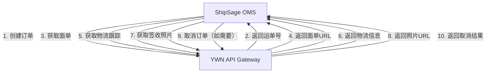

# ShipSage - YWN接口对接 PRD

## 文档信息

| 项目 | 内容 |
|------|------|
| **状态** | 草稿 |
| **负责人** | Dennis He |
| **贡献者** | Dennis He |
| **审批人** | 待定 |
| **审批日期** | 待定 |
| **决策** | 待定 |

---

## 版本历史

| 版本 | 作者 | 日期 | 备注 |
|------|------|------|------|
| V1.0 | Dennis He | 2026-03-04 | 初稿，YWN快递服务集成 |

---

## 术语表

| 术语 | 说明 |
|------|------|
| YWN | YWE快递服务提供商 |
| API Gateway | API网关，统一接口入口 |
| Waybill Number | 运单号，用于追踪包裹 |
| Manifest | 总单，用于汇总多个大包的提货信息 |
| Bigbag | 大包，用于集中运输多个快递包裹的容器 |

---

## 利益相关者

| 团队 | 用户 | 备注 |
|------|------|------|
| 产品团队 | Dennis He | 产品负责人 |
| 运营团队 | 客服、销售 | 日常订单操作人员 |
| 仓库团队 | 仓管人员 | 发货、收货操作 |
| IT开发团队 | 开发人员 | 技术实施 |

---

## 背景

### 业务背景

为了扩展ShipSage OMS的物流配送选择，提升跨境电商履约效率，需要集成YWN（YWE）快递服务。YWN提供标准化的快递API接口，支持订单创建、面单获取、物流跟踪、签收照片等功能。

### 业务目标

1. **扩展物流渠道**：增加YWN作为新的快递服务商，为客户提供更多配送选择
2. **提升物流效率**：通过API集成实现订单自动化处理，减少人工操作
3. **优化成本控制**：利用YWN的配送网络，降低跨境物流成本
4. **提升客户体验**：提供实时物流跟踪和签收照片，增强服务透明度

### 集成价值

- **自动化订单处理**：通过API自动创建订单、获取面单、跟踪物流
- **批量发货管理**：支持Manifest和Bigbag功能，实现批量发货
- **实时物流跟踪**：自动获取物流状态更新，及时通知客户
- **签收凭证**：获取配送照片和签名，作为签收凭证

---

## 账户信息

| 项目 | 内容 |
|------|------|
| 服务提供商 | YWN (YWE) Express |
| API网关 | /api/gateway |
| API Key | [待提供] |
| API Token | [待提供] |
| API文档 | https://s.apifox.cn/30a6e192-2b55-47f7-b415-06e95ef5622c |

---

## 接口说明

| 项目 | 链接/值 |
|------|---------|
| 接口文档 | https://s.apifox.cn/30a6e192-2b55-47f7-b415-06e95ef5622c |
| 认证方式 | API Key + 签名 |
| API网关 | /api/gateway |
| 签名算法 | MD5（详见签名步骤） |

### 签名步骤

**步骤1**：将请求参数按字典序升序排列

**步骤2**：在步骤1得到的字符串首尾拼接api_token

**步骤3**：对步骤2得到的字符串进行MD5加密

**签名示例**：
```
参数: {apiKey: "xxx", format: "json", method: "express.order.create", timestamp: 1234567890, version: "V1.0"}
排序后: apiKey=xxx&format=json&method=express.order.create&timestamp=1234567890&version=V1.0
拼接Token: {api_token}apiKey=xxx&format=json&method=express.order.create&timestamp=1234567890&version=V1.0{api_token}
MD5: sign = MD5(拼接后的字符串)
```

---

## 菜单配置

| 应用 | 菜单路径 | URL | 类型 | 图标 | 位置 | 权限 |
|------|----------|-----|------|------|------|------|
| ShipSage | OMS/订单/YWN订单 | /oms/order-ywn/list | menu | mdi-truck | 3 | All |
| ShipSage | OMS/订单/YWN订单/订单详情 | /oms/order-ywn/detail/:id | page | - | - | All |
| ShipSage | ADMIN/配置/YWN配置 | /admin/config/ywn | menu | mdi-cog | 5 | Admin |

---

## 初始化配置

| 应用 | 内容 | 备注 |
|------|------|------|
| ShipSage | 1. 配置YWN API连接信息（API Key、API Token）<br>2. 配置仓库代码映射<br>3. 配置产品代码映射<br>4. 配置客户代码映射 | 系统上线必需 |

---

## 风险评估

| 应用 | 模块 | 优先级 | 风险描述 | 解决方案 |
|------|------|--------|----------|----------|
| ShipSage | OMS-订单创建 | P1 | API调用失败导致订单无法创建 | 1. 增加重试机制<br>2. 记录失败日志便于排查 |
| ShipSage | OMS-面单获取 | P1 | 面单获取失败影响发货 | 1. 提供手动重试功能<br>2. 设置超时时间 |
| ShipSage | OMS-物流跟踪 | P2 | 物流状态更新延迟 | 1. 定时轮询获取最新状态<br>2. 支持手动触发更新 |
| ShipSage | OMS-签名验证 | P1 | 签名错误导致API调用失败 | 1. 严格按照签名算法实现<br>2. 增加签名验证测试 |

---

## 范围

| 应用 | 模块 | 任务名称 | 描述 |
|------|------|----------|------|
| ShipSage | OMS | YWN订单创建 | 调用YWN API创建快递订单 |
| ShipSage | OMS | 面单获取 | 获取快递面单并打印 |
| ShipSage | OMS | 物流跟踪 | 自动获取和更新物流状态 |
| ShipSage | OMS | 签收照片 | 获取配送照片作为签收凭证 |
| ShipSage | OMS | 订单取消 | 支持取消未发货的订单 |
| ShipSage | OMS | 订单查询 | 根据运单号查询订单详情 |
| ShipSage | OMS | 总单管理 | 创建总单汇总多个大包 |
| ShipSage | OMS | 大包管理 | 创建大包汇总多个订单 |
| ShipSage | ADMIN | 配置管理 | YWN API配置和映射配置 |

---

## 任务详情

### 任务 1: YWN订单创建

#### 业务流程



#### 集成流程图

```
┌─────────────────────────────────────────────────────────────────┐
│                        ShipSage OMS                              │
│  ┌──────────────────────────────────────────────────────────┐  │
│  │  1. 订单准备发货                                         │  │
│  │     - 验证订单数据                                       │  │
│  │     - 准备收件人/发件人/包裹信息                         │  │
│  └──────────────────────────────────────────────────────────┘  │
│                            ↓                                     │
│  ┌──────────────────────────────────────────────────────────┐  │
│  │  2. 调用YWN创建快递订单API                               │  │
│  │     - Method: express.order.create                       │  │
│  │     - 生成签名                                           │  │
│  │     - 发送订单详情                                       │  │
│  └──────────────────────────────────────────────────────────┘  │
│                            ↓                                     │
│  ┌──────────────────────────────────────────────────────────┐  │
│  │  3. 接收运单号                                           │  │
│  │     - 保存waybillNumber                                  │  │
│  │     - 保存orderNumber                                    │  │
│  │     - 保存warehouseCode                                  │  │
│  └──────────────────────────────────────────────────────────┘  │
│                            ↓                                     │
│  ┌──────────────────────────────────────────────────────────┐  │
│  │  4. 获取快递面单                                         │  │
│  │     - Method: express.order.label.get                    │  │
│  │     - 下载面单PDF                                        │  │
│  └──────────────────────────────────────────────────────────┘  │
│                            ↓                                     │
│  ┌──────────────────────────────────────────────────────────┐  │
│  │  5. 跟踪物流（定时）                                     │  │
│  │     - Method: express.order.tracking.get                 │  │
│  │     - 更新物流状态                                       │  │
│  └──────────────────────────────────────────────────────────┘  │
└─────────────────────────────────────────────────────────────────┘
```

#### 功能说明

| 功能点 | 描述 | 备注 |
|--------|------|------|
| API对接 | 调用YWN创建快递订单API | 支持单个订单创建 |
| 签名生成 | 按照签名算法生成请求签名 | 确保API调用安全 |
| 数据映射 | 将系统订单数据映射到YWN格式 | 收件人、发件人、包裹信息 |
| 运单号保存 | 保存返回的运单号到订单记录 | 用于后续跟踪 |
| 异常处理 | 记录创建失败的订单 | 便于人工处理 |

**创建订单字段**

| 字段名称 | 字段说明 | 数据来源 | 是否必填 |
|---------|---------|---------|---------|
| orderNumber | 订单号 | 系统生成 | 是 |
| productCode | 产品代码 | 配置映射 | 是 |
| entryWarehouseCode | 入仓代码 | 配置映射 | 是 |
| subCustomerCode | 子客户代码 | 配置映射 | 是 |
| ref1 | 参考号1 | 系统订单号 | 否 |
| ref2 | 参考号2 | 自定义 | 否 |
| receiverInfo | 收件人信息 | 系统订单 | 是 |
| senderInfo | 发件人信息 | 配置 | 是 |
| returnInfo | 退货信息 | 配置 | 是 |
| parcelInfo | 包裹信息 | 系统订单 | 是 |

---

### 任务 2: 面单获取

#### 功能说明

| 功能点 | 描述 | 备注 |
|--------|------|------|
| API调用 | 调用YWN获取面单API | 基于运单号 |
| 面单下载 | 下载base64编码的面单图片 | 支持PDF格式 |
| 面单打印 | 提供面单打印功能 | 支持批量打印 |
| 面单存储 | 保存面单URL到订单记录 | 便于后续查看 |

**API参数**

| 参数名称 | 参数说明 | 是否必填 |
|---------|---------|---------|
| waybillNumber | 运单号 | 是 |

---

### 任务 3: 物流跟踪

#### 功能说明

| 功能点 | 描述 | 备注 |
|--------|------|------|
| 定时跟踪 | 定时调用YWN跟踪API | 建议每小时一次 |
| 状态更新 | 更新订单物流状态 | 实时同步 |
| 事件记录 | 记录物流事件和时间 | 便于查询 |
| 异常告警 | 物流异常时发送告警 | 及时处理问题 |

**物流事件字段**

| 字段名称 | 字段说明 | 数据来源 |
|---------|---------|---------|
| message | 事件消息 | API返回 |
| timestamp | 时间戳 | API返回 |
| timeZone | 时区 | API返回 |
| status | 状态 | API返回 |
| location | 位置信息 | API返回 |

---

### 任务 4: 签收照片

#### 功能说明

| 功能点 | 描述 | 备注 |
|--------|------|------|
| 照片获取 | 调用YWN获取照片API | 基于运单号 |
| 照片展示 | 展示签收照片和签名 | 支持放大查看 |
| 照片下载 | 支持下载照片 | 保存作为凭证 |
| 照片分组 | 按标题分组展示照片 | 配送照片/签名照片 |

**照片分组**

| 分组标题 | 说明 |
|---------|------|
| Delivery Photo | 配送照片 |
| Signature Photo | 签名照片 |

---

### 任务 5: 订单取消

#### 功能说明

| 功能点 | 描述 | 备注 |
|--------|------|------|
| 取消订单 | 调用YWN取消订单API | 基于运单号 |
| 状态更新 | 更新订单状态为已取消 | 系统自动处理 |
| 取消限制 | 仅支持未发货订单 | 业务规则控制 |
| 取消记录 | 记录取消操作和时间 | 便于审计 |

---

### 任务 6: 订单查询

#### 功能说明

| 功能点 | 描述 | 备注 |
|--------|------|------|
| 订单查询 | 根据运单号查询订单详情 | 支持单个查询 |
| 状态查看 | 查看订单当前状态 | 实时状态 |
| 信息展示 | 展示订单完整信息 | 订单号、产品代码、仓库代码等 |

---

### 任务 7: 总单管理

#### 功能说明

| 功能点 | 描述 | 备注 |
|--------|------|------|
| 创建总单 | 调用YWN创建总单API | 汇总多个大包 |
| 提货安排 | 安排仓库提货时间 | 支持预约 |
| 提货类型 | 支持提货和送货到仓库两种模式 | 灵活配置 |
| 总单跟踪 | 跟踪总单状态 | 便于管理 |

**总单字段**

| 字段名称 | 字段说明 | 是否必填 |
|---------|---------|---------|
| warehouseCode | 仓库代码 | 是 |
| externalNumber | 外部总单号 | 是 |
| externalBigbagNumbers | 大包条码列表 | 是 |
| expectedPickupTime | 预计提货时间 | 是 |
| pickupKind | 提货类型（1=提货，2=送货到仓库） | 是 |

---

### 任务 8: 大包管理

#### 功能说明

| 功能点 | 描述 | 备注 |
|--------|------|------|
| 创建大包 | 调用YWN创建大包API | 汇总多个订单 |
| 包裹关联 | 关联总单和快递包裹 | 系统自动处理 |
| 仓库管理 | 指定提货仓库 | 配置映射 |
| 大包跟踪 | 跟踪大包状态 | 便于管理 |

**大包字段**

| 字段名称 | 字段说明 | 是否必填 |
|---------|---------|---------|
| manifestCode | 总单代码 | 是 |
| externalNumber | 外部大包号 | 是 |
| externalExpressNumbers | 快递条码列表 | 是 |
| warehouseCode | 仓库代码 | 是 |

---

### 任务 9: 配置管理

#### 功能说明

| 功能点 | 描述 | 备注 |
|--------|------|------|
| API配置 | 配置API Key和API Token | 系统必需 |
| 仓库映射 | 配置系统仓库与YWN仓库代码的映射 | 数据转换 |
| 产品映射 | 配置系统产品与YWN产品代码的映射 | 数据转换 |
| 客户映射 | 配置系统客户与YWN客户代码的映射 | 数据转换 |

**配置项**

| 配置项 | 说明 | 是否必填 |
|-------|------|---------|
| API Key | YWN提供的API Key | 是 |
| API Token | YWN提供的API Token | 是 |
| API Gateway | API网关地址 | 是 |
| 仓库代码映射 | 系统仓库ID与YWN仓库代码对应关系 | 是 |
| 产品代码映射 | 系统产品SKU与YWN产品代码对应关系 | 是 |
| 客户代码映射 | 系统客户ID与YWN客户代码对应关系 | 是 |

---

## 测试用例

### 测试用例 1: 创建快递订单

**请求**：
```bash
POST /api/gateway?apiKey=YOUR_API_KEY&format=json&method=express.order.create&timestamp=1709539200000&version=V1.0&sign=GENERATED_SIGNATURE

{
  "orderNumber": "TEST_ORD_001",
  "productCode": "E0001",
  "entryWarehouseCode": "IND01",
  "subCustomerCode": "C000001",
  "ref1": "测试参考1",
  "ref2": "测试参考2",
  "receiverInfo": {
    "name": "测试收件人",
    "phone": "(123) 456-7890",
    "mobile": "1234567890",
    "zipCode": "12345",
    "email": "test@example.com",
    "country": "US",
    "state": "CA",
    "city": "Los Angeles",
    "district": "Downtown",
    "address": "123 测试街道",
    "address2": "100单元"
  },
  "senderInfo": {
    "name": "ShipSage仓库",
    "phone": "(555) 123-4567",
    "mobile": "5551234567",
    "zipCode": "90001",
    "country": "US",
    "state": "CA",
    "city": "Los Angeles",
    "address": "456 仓库大道"
  },
  "returnInfo": {
    "name": "ShipSage退货",
    "phone": "(555) 123-4567",
    "mobile": "5551234567",
    "zipCode": "90001",
    "country": "US",
    "state": "CA",
    "city": "Los Angeles",
    "address": "456 仓库大道"
  },
  "parcelInfo": {
    "length": 30,
    "width": 20,
    "height": 10,
    "totalPrice": 50.00,
    "currency": "USD",
    "totalWeight": 1000,
    "totalQuantity": 1,
    "productList": [
      {
        "sku": "TEST_SKU_001",
        "goodsNameCh": "测试商品",
        "goodsNameEn": "Test Product",
        "price": 50.00,
        "quantity": 1,
        "weight": 1000,
        "hscode": "123456",
        "material": "Cotton",
        "url": "https://example.com/product"
      }
    ]
  }
}
```

**预期响应**：
```json
{
  "success": true,
  "code": 0,
  "message": "ok",
  "data": {
    "waybillNumber": "TESTYWORD01000001607",
    "orderNumber": "TEST_ORD_001",
    "warehouseCode": "ORD01",
    "threeCode": "N-127",
    "fourCode": "N"
  }
}
```

### 测试用例 2: 获取快递面单

**请求**：
```bash
POST /api/gateway?apiKey=YOUR_API_KEY&format=json&method=express.order.label.get&timestamp=1709539200000&version=V1.0&sign=GENERATED_SIGNATURE

{
  "waybillNumber": "TESTYWORD01000001607"
}
```

**预期响应**：
```json
{
  "success": true,
  "code": 0,
  "message": "ok",
  "data": {
    "waybillNumber": "TESTYWORD01000001607",
    "base64String": "iVBORw0KGgoAAAANSUhEUgAA..."
  }
}
```

### 测试用例 3: 获取物流跟踪

**请求**：
```bash
POST /api/gateway?apiKey=YOUR_API_KEY&format=json&method=express.order.tracking.get&timestamp=1709539200000&version=V1.0&sign=GENERATED_SIGNATURE

{
  "waybillNumber": "TESTYWORD01000001607"
}
```

**预期响应**：
```json
{
  "success": true,
  "code": 0,
  "message": "ok",
  "data": {
    "waybillNumber": "TESTYWORD01000001607",
    "events": [
      {
        "message": "订单已创建",
        "timestamp": 1709539200000,
        "timeZone": "UTC",
        "status": "CREATED",
        "location": {
          "address1": "456 仓库大道",
          "address2": "",
          "city": "Los Angeles",
          "state": "CA",
          "zipCode": "90001",
          "country": "US"
        }
      },
      {
        "message": "包裹已揽收",
        "timestamp": 1709625600000,
        "timeZone": "UTC",
        "status": "PICKED_UP",
        "location": {
          "address1": "456 仓库大道",
          "address2": "",
          "city": "Los Angeles",
          "state": "CA",
          "zipCode": "90001",
          "country": "US"
        }
      },
      {
        "message": "运输中",
        "timestamp": 1709712000000,
        "timeZone": "UTC",
        "status": "IN_TRANSIT",
        "location": {
          "address1": "分拨中心",
          "address2": "",
          "city": "Los Angeles",
          "state": "CA",
          "zipCode": "90001",
          "country": "US"
        }
      }
    ]
  }
}
```

### 测试用例 4: 获取签收照片

**请求**：
```bash
POST /api/gateway?apiKey=YOUR_API_KEY&format=json&method=express.order.photo.get&timestamp=1709539200000&version=V1.0&sign=GENERATED_SIGNATURE

{
  "waybillNumber": "TESTYWORD01000001607"
}
```

**预期响应**：
```json
{
  "success": true,
  "code": 0,
  "message": "ok",
  "data": [
    {
      "title": "配送照片",
      "photos": [
        "iVBORw0KGgoAAAANSUhEUgAA...",
        "iVBORw0KGgoAAAANSUhEUgBB..."
      ]
    },
    {
      "title": "签名照片",
      "photos": [
        "iVBORw0KGgoAAAANSUhEUgCC..."
      ]
    }
  ]
}
```

### 测试用例 5: 取消订单

**请求**：
```bash
POST /api/gateway?apiKey=YOUR_API_KEY&format=json&method=express.order.cancel&timestamp=1709539200000&version=V1.0&sign=GENERATED_SIGNATURE

{
  "waybillNumber": "TESTYWORD01000001607"
}
```

**预期响应**：
```json
{
  "success": true,
  "code": 0,
  "message": "ok"
}
```

### 测试用例 6: 创建总单

**请求**：
```bash
POST /api/gateway?apiKey=YOUR_API_KEY&format=json&method=manifest.order.create&timestamp=1709539200000&version=V1.0&sign=GENERATED_SIGNATURE

{
  "warehouseCode": "WH001",
  "externalNumber": "MF20260304001",
  "externalBigbagNumbers": [
    "BB20260304001",
    "BB20260304002"
  ],
  "expectedPickupTime": 1709625600000,
  "pickupKind": 1
}
```

**预期响应**：
```json
{
  "success": true,
  "code": 0,
  "message": "ok",
  "data": {
    "code": "YWE_MF_001"
  }
}
```

### 测试用例 7: 创建大包

**请求**：
```bash
POST /api/gateway?apiKey=YOUR_API_KEY&format=json&method=bigbag.order.create&timestamp=1709539200000&version=V1.0&sign=GENERATED_SIGNATURE

{
  "manifestCode": "YWE_MF_001",
  "externalNumber": "BB20260304001",
  "externalExpressNumbers": [
    "TESTYWORD01000001607",
    "TESTYWORD01000001608"
  ],
  "warehouseCode": "WH001"
}
```

**预期响应**：
```json
{
  "success": true,
  "code": 0,
  "message": "ok",
  "data": {
    "code": "YWE_BB_001"
  }
}
```

---

## 验收标准

### 功能验收

1. **订单创建**
   - [ ] 能成功调用YWN API创建订单
   - [ ] 能正确保存返回的运单号
   - [ ] 数据映射正确无误
   - [ ] 异常订单有错误记录

2. **面单获取**
   - [ ] 能成功获取面单
   - [ ] 面单能正常打印
   - [ ] 面单URL保存正确

3. **物流跟踪**
   - [ ] 定时任务正常执行
   - [ ] 物流状态实时更新
   - [ ] 物流事件记录完整
   - [ ] 异常情况有告警

4. **签收照片**
   - [ ] 能成功获取签收照片
   - [ ] 照片能正常展示和下载
   - [ ] 照片分组显示正确

5. **订单取消**
   - [ ] 能成功取消订单
   - [ ] 订单状态正确更新
   - [ ] 取消限制生效

6. **订单查询**
   - [ ] 能根据运单号查询订单
   - [ ] 订单详情展示完整

7. **总单管理**
   - [ ] 能成功创建总单
   - [ ] 总单状态正常跟踪

8. **大包管理**
   - [ ] 能成功创建大包
   - [ ] 大包与订单关联正确

9. **配置管理**
   - [ ] API配置保存正确
   - [ ] 映射配置生效
   - [ ] 配置修改即时生效

### 性能验收

1. **响应时间**
   - [ ] 订单创建响应时间 < 3秒
   - [ ] 面单获取响应时间 < 2秒
   - [ ] 物流跟踪响应时间 < 2秒
   - [ ] 定时任务执行时间 < 5分钟

2. **并发能力**
   - [ ] 支持100并发订单创建
   - [ ] 支持1000并发面单获取

### 安全验收

1. **API安全**
   - [ ] 签名算法实现正确
   - [ ] API Key和Token安全存储
   - [ ] 请求参数加密传输

2. **数据安全**
   - [ ] 敏感数据加密存储
   - [ ] 操作日志完整记录
   - [ ] 权限控制正确生效

---

## 附录

### 附录A: 相关文档

| 文档名称 | 链接 | 说明 |
|---------|------|------|
| YWN API文档 | https://s.apifox.cn/30a6e192-2b55-47f7-b415-06e95ef5622c | YWN接口详细说明 |
| Jira IT-13631 | ShipSage OMS order import template update | 订单模板更新 |

### 附录B: API列表汇总

| API名称 | 方法参数 | 说明 | 优先级 |
|---------|---------|------|--------|
| 创建快递订单 | express.order.create | 创建新的快递订单 | P1 |
| 查询订单 | express.order.get | 查询订单详情 | P1 |
| 获取面单 | express.order.label.get | 获取快递面单 | P1 |
| 获取物流跟踪 | express.order.tracking.get | 获取物流跟踪信息 | P1 |
| 获取签收照片 | express.order.photo.get | 获取配送照片 | P2 |
| 取消订单 | express.order.cancel | 取消快递订单 | P2 |
| 创建总单 | manifest.order.create | 创建总单 | P2 |
| 创建大包 | bigbag.order.create | 创建大包 | P2 |

### 附录C: 错误码说明

| 错误码 | 说明 | 处理建议 |
|-------|------|---------|
| 0 | 成功 | - |
| 1001 | 参数错误 | 检查请求参数 |
| 1002 | 签名错误 | 检查签名算法 |
| 1003 | API Key无效 | 检查API Key配置 |
| 1004 | Token无效 | 检查API Token配置 |
| 1005 | 订单不存在 | 检查运单号 |
| 1006 | 订单状态不允许操作 | 检查订单状态 |
| 1007 | 仓库代码无效 | 检查仓库配置 |
| 1008 | 产品代码无效 | 检查产品配置 |
| 1009 | 客户代码无效 | 检查客户配置 |

---

**文档版本**: V1.0  
**最后更新**: 2026-03-04  
**维护者**: Dennis He
