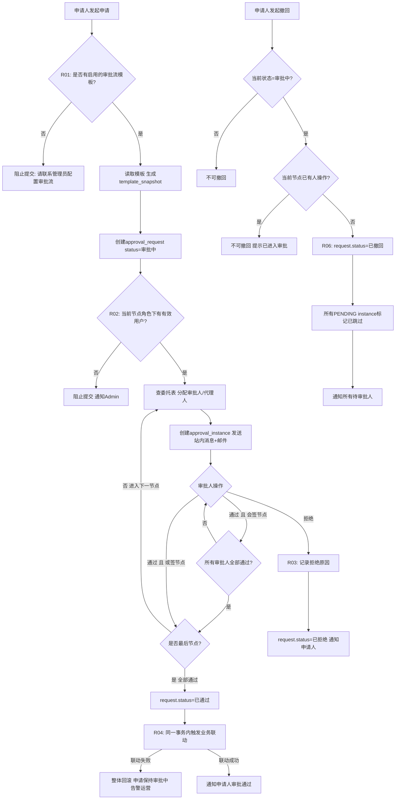
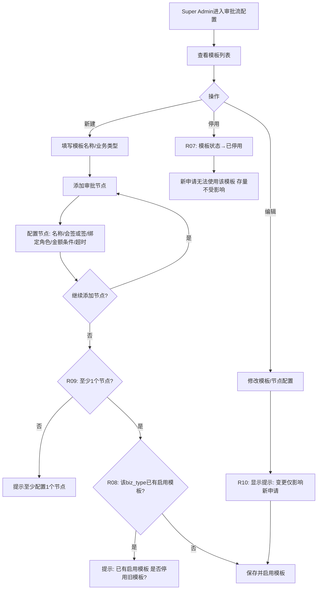
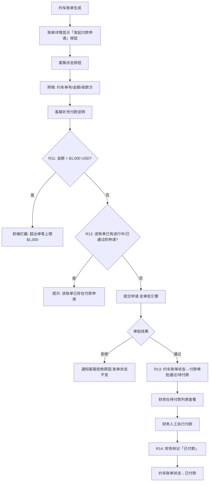
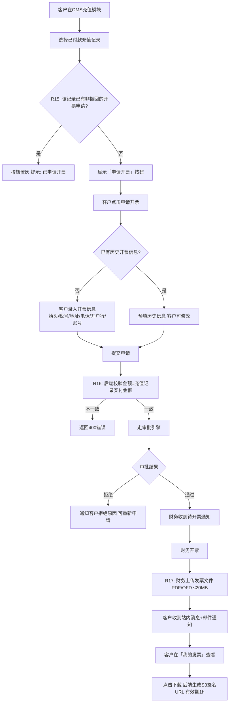
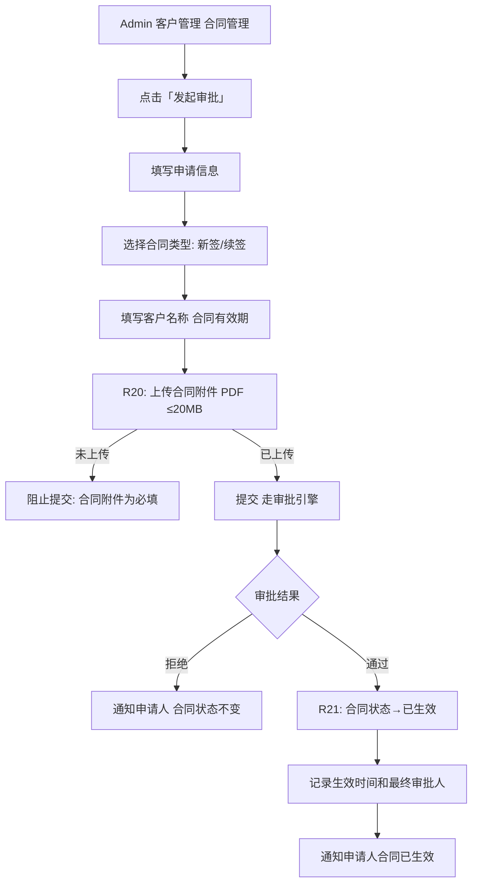
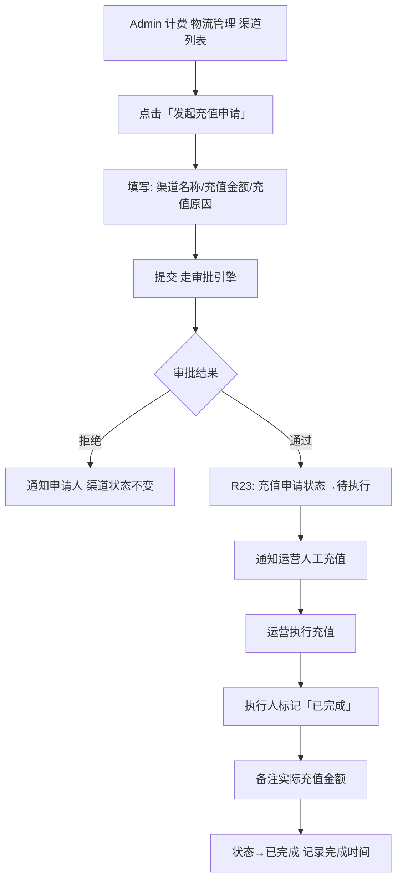
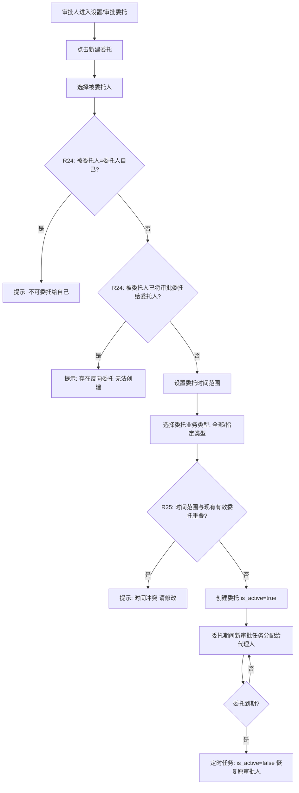
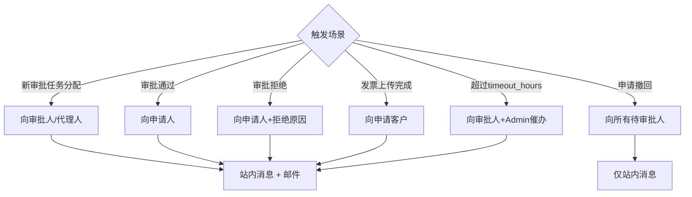

# PRD：审批电子流系统（Approval Workflow）

## 文档信息

| 项目 | 内容 |
|------|------|
| **状态** | 草稿 |
| **负责人** | Dennis |
| **贡献者** | 产品团队 |
| **审批人** | 待定 |
| **审批日期** | 待定 |
| **决策** | 待评审 |

---

## 目录

- [版本历史](#版本历史)
- [术语表](#术语表)
- [利益相关者](#利益相关者)
- [背景](#背景)
- [菜单配置](#菜单配置)
- [初始化配置](#初始化配置)
- [风险评估](#风险评估)
- [范围](#范围)
- [任务详情](#任务详情)
- [附录](#附录)

---

## 版本历史

| 版本 | 作者 | 日期 | 备注 |
|------|------|------|------|
| V1.0 | Dennis | 2026-03-19 | 初稿，基于Phase 1 RDD + Phase 2 Architecture |

---

## 术语表

| 术语 | 说明 |
|------|------|
| 审批流模板 (ApprovalTemplate) | 定义某类审批的节点顺序、审批角色、条件规则的可配置模板 |
| 审批节点 (ApprovalNode) | 审批流中的一个步骤，包含审批角色、节点类型（会签/或签）和条件 |
| 审批申请 (ApprovalRequest) | 业务人员或客户发起的一次具体审批单据，是审批流的运行实例 |
| 审批实例 (ApprovalInstance) | 每个节点每个审批人的操作记录，一个申请有 N节点×M审批人 条记录 |
| 模板快照 (template_snapshot) | 申请发起时锁定的模板JSON副本，防止后续模板变更影响存量申请 |
| 会签 | 节点内所有审批人全部通过，才算该节点通过 |
| 或签 | 节点内任一审批人通过，即算该节点通过 |
| 审批委托 (ApprovalDelegation) | 审批人临时将审批权限委托给他人代理，有时间范围限制 |
| 约车付款申请 | 内部客服为卡车派送约车费用发起的付款审批申请 |
| 客户开票申请 | 客户在OMS发起的增值税发票申请，需财务审核并上传发票 |
| 合同生效审批 | 新签/续签客户合同的内部审批，通过后合同状态变为已生效 |
| 渠道充值审批 | 物流渠道账号充值的内部审批，通过后人工执行充值 |

---

## 利益相关者

| 团队 | 用户 | 备注 |
|------|------|------|
| 产品 | Dennis | 产品负责人 |
| 仓盛运营 | 运营Admin | 审批流配置、异常处理、合同/渠道充值审批 |
| 财务 | 财务团队 | 约车付款审批、客户开票处理、发票上传 |
| 内部客服 | CS团队 | 约车付款申请发起人 |
| 商家/客户（外部）| Shopify卖家/OMS客户 | 开票申请发起人、发票下载 |
| 研发团队 | 前端/后端/测试 | 开发与测试 |

---

## 背景

仓盛内部存在多类高频业务审批（约车付款、客户开票、合同生效、渠道充值），目前全部依赖外部第三方App（如微信审批、钉钉）流转，导致以下问题：

1. **系统无记录**：审批结果无法与 ShipSage 业务数据关联，财务对账、合规审计困难
2. **联动断层**：约车账单生成后需人工跨系统发起付款，客户开票需邮件往来，效率低下
3. **权限散乱**：审批人由人工指定，无法基于角色动态路由，临时代理无法追溯
4. **客户体验差**：客户无法在 OMS 内直接发起开票申请和查看发票，需要通过客服中转

本项目通过在 ShipSage 内建设可配置审批电子流系统，将以上业务审批全部系统化，实现审批留痕、角色路由、业务联动的完整闭环。

---

## 菜单配置

| 应用 | 菜单路径 | URL | 类型 | 图标 | 位置 | 权限 |
|------|----------|-----|------|------|------|------|
| ShipSage Admin | 财务/审批管理/全部申请 | /admin/approvals | menu | mdi-check-circle | 5 | Admin、财务角色 |
| ShipSage Admin | 财务/审批管理/待我审批 | /admin/approvals/pending | menu | mdi-clock-alert | 6 | 所有审批角色 |
| ShipSage Admin | 设置/审批流配置 | /admin/approval-templates | menu | mdi-sitemap | 10 | Super Admin |
| ShipSage Admin | 设置/审批委托 | /admin/approval-delegation | menu | mdi-account-switch | 11 | 所有审批角色 |
| ShipSage OMS | 计费/我的发票 | /billing/invoices | menu | mdi-receipt | 6 | 客户 |
| ShipSage OMS | 计费/付款（申请开票入口） | /billing/payments | page | - | - | 客户 |

---

## 初始化配置

| 应用 | 内容 | 备注 |
|------|------|------|
| ShipSage Admin | 1. 创建审批流模板：约车付款（2节点：客服主管→财务）<br>2. 创建审批流模板：客户开票（1节点：财务角色）<br>3. 创建审批流模板：合同生效（可配置）<br>4. 创建审批流模板：渠道充值（可配置）<br>5. 为各审批节点绑定对应角色 | 上线前由Super Admin完成配置，确认各角色已有用户 |
| ShipSage OMS | 1. 「我的发票」菜单对客户可见<br>2. 充值记录列表新增「申请开票」按钮（已付款状态才显示）| 前端配置 |
| 约车模块 | 1. 约车账单详情新增「发起付款申请」按钮（账单生成后才显示）| 与约车模块联调 |

---

## 风险评估

| 应用 | 模块 | 优先级 | 风险描述 | 解决方案 |
|------|------|--------|----------|----------|
| Admin | 审批引擎 | P1 | 审批人通过与申请人撤回并发，状态不一致 | version乐观锁，状态变更前校验，失败返回409 |
| Admin/OMS | 审批引擎 | P1 | 同一业务单重复提交创建多条申请 | DB唯一约束(biz_type,biz_id) WHERE status IN(20,30)；前端提交后禁用按钮 |
| Admin | 审批引擎 | P1 | 会签节点并发审批计数错误 | SELECT FOR UPDATE行锁原子判断 |
| Admin | 约车付款 | P1 | 审批通过后账单状态更新失败，数据不一致 | 状态更新与联动同一事务，失败回滚并告警 |
| Admin/OMS | 权限 | P1 | 客户A访问客户B的开票申请（水平越权） | 后端强制校验 current_user.id == request.applicant_id |
| Admin | 权限 | P1 | 普通员工调用模板配置接口（垂直越权） | 接口级RBAC，模板配置限Super Admin |
| OMS | 开票申请 | P2 | 发票文件被未授权用户直接访问 | S3签名URL有效期1h，下载接口鉴权后生成 |
| Admin | 审批引擎 | P2 | 管理员修改模板影响进行中的申请 | 申请发起时保存template_snapshot快照 |
| OMS | 开票申请 | P2 | 同一充值记录重复发起开票申请 | DB唯一约束(biz_type=2,biz_id) WHERE status!=50 |
| OMS | 开票申请 | P2 | 客户篡改开票金额 | 后端校验amount必须等于充值记录实付金额 |
| Admin | 委托 | P3 | 审批委托形成循环 | 创建委托时检查反向委托是否存在 |
| Admin | 审批引擎 | P3 | 节点配置角色下无有效用户，申请无法发起 | 分配时过滤禁用用户，无用户则阻止提交并通知Admin |

---

## 范围

| 应用 | 模块 | 任务名称 | 描述 |
|------|------|----------|------|
| Admin+OMS | 审批引擎 | APPROVAL-001 审批流引擎 | 可配置节点、条件分支、角色路由、模板快照、乐观锁状态机 |
| Admin | 审批配置 | APPROVAL-002 审批流配置后台 | 管理员配置模板、节点、角色、条件规则 |
| Admin | 约车付款 | APPROVAL-003 约车付款申请 | 约车账单触发，两级审批，联动账单状态 |
| OMS | 客户开票 | APPROVAL-004 客户开票申请 | 客户OMS发起，财务上传发票，客户下载 |
| Admin | 合同生效 | APPROVAL-005 合同生效审批 | 内部发起，附件上传，合同状态联动 |
| Admin | 渠道充值 | APPROVAL-006 渠道充值审批 | 内部发起，仅做记录，人工执行 |
| Admin | 委托 | APPROVAL-007 审批委托 | 设置委托人、时间范围、防循环校验 |
| Admin+OMS | 通知 | APPROVAL-008 审批消息通知 | 站内消息+邮件（待审批/通过/拒绝/催办） |

## 任务详情

### 任务 1: APPROVAL-001 审批流引擎

#### 1.1 流程图



#### 1.2 页面线框图

**审批申请列表页（全部申请）**

```
+----------------------------------------------------------+
|  审批管理 / 全部申请                                       |
+----------------------------------------------------------+
|  [类型: 全部 v] [状态: 全部 v] [申请人] [日期范围] [搜索] |
+----------------------------------------------------------+
|  +--------+--------+--------+--------+------+----------+ |
|  | 申请单号 | 类型   | 申请人  | 状态   | 金额 | 操作     | |
|  +--------+--------+--------+--------+------+----------+ |
|  |APR001  |约车付款 | 张三   |[审批中]|$800  |[查看]    | |
|  |APR002  |客户开票 | 客户A  |[已通过]|$200  |[查看]    | |
|  |APR003  |合同生效 | 李四   |[已拒绝]| -    |[查看]    | |
|  +--------+--------+--------+--------+------+----------+ |
|  [< 上一页]  第1/5页  [下一页 >]                          |
+----------------------------------------------------------+
```

**审批申请详情页**

```
+----------------------------------------------------------+
|  申请详情 APR001 - 约车付款申请         [< 返回列表]      |
+----------------------------------------------------------+
|  状态: [审批中]   申请人: 张三   提交时间: 2026-03-19    |
+----------------------------------------------------------+
|  申请信息                                                 |
|  约车单号: TRK-2026031901   金额: $800.00 USD            |
|  收款方: XX运输公司   付款说明: 3月第2批次约车费用        |
+----------------------------------------------------------+
|  审批进度                                                 |
|  [节点1: 主管审批 - 待审批] --> [节点2: 财务审批 - 待审批]|
|                                                           |
|  节点1: 主管审批                                          |
|  审批人: 王主管   状态: [待审批]   分配时间: 10:30        |
+----------------------------------------------------------+
|  审批意见                                                 |
|  +----------------------------------------------------+  |
|  | 请输入审批意见（可选）                              |  |
|  +----------------------------------------------------+  |
|  [拒绝]                                      [通过]   |
+----------------------------------------------------------+
```

> **交互说明**：
> - 审批进度条可视化展示当前所在节点，已通过节点显示绿色勾
> - 拒绝时审批意见为必填；通过时可选填
> - 申请人查看详情时不显示审批操作按钮

#### 1.3 功能说明
#### 功能说明

| 功能点 | 描述 | 业务规则 |
|--------|------|----------|
| 模板快照 | 申请发起时读取启用模板写入template_snapshot，流转始终基于快照 | R01: 无启用模板则阻止提交并提示 |
| 审批人分配 | 按node_seq逐节点分配，查委托表若有有效委托则分配代理人 | R02: 角色下无有效用户时阻止申请并通知Admin |
| 会签/或签 | 会签(node_type=1)全部通过才推进；或签(node_type=2)任一通过即推进 | R03: 会签任一拒绝则整条申请拒绝 |
| 业务联动 | 审批通过后在同一事务内更新关联业务单据状态 | R04: 联动失败整体回滚，申请保持审批中，告警运营 |
| 状态机 | 合法流转：草稿→审批中→已通过/已拒绝/已撤回；不可逆向 | R05: 任何状态变更必须携带version乐观锁 |
| 撤回 | 仅审批中且当前节点无人操作时可撤回 | R06: 撤回后所有PENDING instance标记已跳过 |

---

### 任务 2: APPROVAL-002 审批流配置后台

#### 2.1 流程图



#### 2.2 页面线框图

**审批流模板列表页**

```
+----------------------------------------------------------+
|  设置 / 审批流配置                        [+ 新建模板]    |
+----------------------------------------------------------+
|  [业务类型: 全部 v] [状态: 全部 v]                        |
+----------------------------------------------------------+
|  +------------+----------+------+--------+------------+  |
|  | 模板名称    | 业务类型  | 节点数| 状态   | 操作       |  |
|  +------------+----------+------+--------+------------+  |
|  | 约车付款审批 | 约车付款  |  2   |[启用]  |[编辑][停用]|  |
|  | 客户开票审批 | 客户开票  |  1   |[启用]  |[编辑][停用]|  |
|  | 合同生效审批 | 合同生效  |  2   |[已停用]|[编辑][启用]|  |
|  +------------+----------+------+--------+------------+  |
+----------------------------------------------------------+
```

**创建/编辑模板 — 节点配置**

```
+----------------------------------------------------------+
|  新建审批流模板                              [x 取消]     |
+----------------------------------------------------------+
|  模板名称 *                                              |
|  +----------------------------------------------------+  |
|  | 约车付款审批                                        |  |
|  +----------------------------------------------------+  |
|  业务类型 *                                              |
|  [约车付款 v]                                            |
+----------------------------------------------------------+
|  审批节点配置                             [+ 添加节点]   |
|  +--------------------------------------------------+   |
|  | 节点1  节点名称: [主管审批      ]                 |   |
|  |        类型:    [会签 v]                          |   |
|  |        审批角色: [客服主管 x] [+ 添加角色]        |   |
|  |        金额条件: [无条件 v]                       |   |
|  |        超时提醒: [24] 小时                        |   |
|  +--------------------------------------------------+   |
|  +--------------------------------------------------+   |
|  | 节点2  节点名称: [财务审批      ]                 |   |
|  |        类型:    [或签 v]                          |   |
|  |        审批角色: [财务 x] [+ 添加角色]            |   |
|  +--------------------------------------------------+   |
+----------------------------------------------------------+
|  [取消]                                    [保存启用]   |
+----------------------------------------------------------+
```

> **交互说明**：
> - 节点可拖拽排序，节点序号自动更新
> - 编辑已启用模板时顶部显示黄色提示条「变更仅影响新申请，存量申请继续按原快照执行」
> - 停用操作需二次确认弹窗

#### 2.3 功能说明
#### 功能说明

| 功能点 | 描述 | 业务规则 |
|--------|------|----------|
| 模板列表 | Admin→设置→审批流配置，展示所有模板，支持启用/停用 | R07: 停用后新申请无法发起，存量不受影响 |
| 创建/编辑模板 | 配置名称、业务类型、节点列表（名称/类型/角色/条件/超时） | R08: 同一biz_type只能有一个启用模板 |
| 节点配置 | 每节点：会签/或签、绑定角色（多选）、金额条件、超时小时数 | R09: 节点序号不可重复，至少1个节点 |
| 变更提示 | 编辑模板时提示「变更仅影响新申请，存量按快照执行」 | R10: 模板变更不触发存量申请重新分配 |

---

### 任务 3: APPROVAL-003 约车付款申请

#### 3.1 流程图



#### 3.2 页面线框图

**约车账单详情页（新增申请入口）**

```
+----------------------------------------------------------+
|  约车账单详情 #TRK-2026031901         [< 返回账单列表]   |
+----------------------------------------------------------+
|  状态: [已生成]   创建时间: 2026-03-19 09:00             |
|  运输公司: XX运输公司   约车类型: FTL                    |
+----------------------------------------------------------+
|  费用明细                                                 |
|  运输费: $750.00   燃油附加费: $50.00   合计: $800.00    |
+----------------------------------------------------------+
|  付款状态: 待申请                                         |
|                              [发起付款申请]               |
+----------------------------------------------------------+
```

**发起付款申请弹窗**

```
+------------------------------------+
|  发起付款申请               [x]    |
+------------------------------------+
|  约车单号（只读）                   |
|  TRK-2026031901                    |
|                                    |
|  申请金额 * （只读）                |
|  $ 800.00 USD                      |
|                                    |
|  收款方 *                           |
|  XX运输公司                         |
|                                    |
|  付款说明                           |
|  +------------------------------+  |
|  | 3月第2批次约车费用...         |  |
|  +------------------------------+  |
|  ⚠ 单笔申请上限 $1,000 USD          |
+------------------------------------+
|  [取消]             [提交申请]     |
+------------------------------------+
```

> **交互说明**：
> - 约车账单状态=已生成时才显示「发起付款申请」按钮，其他状态隐藏
> - 金额字段预填且只读，不允许修改
> - 提交后按钮变为 Loading，成功后弹窗关闭，账单页刷新状态

#### 3.3 功能说明
#### 功能说明

| 功能点 | 描述 | 业务规则 |
|--------|------|----------|
| 申请入口 | 约车账单详情页，账单已生成状态显示「发起付款申请」按钮 | R11: 申请金额上限$1,000 USD，前端+后端双重校验 |
| 申请预填 | 自动预填约车单号、金额、收款方；申请人补充付款说明 | R12: 同一约车账单只能有一条进行中或已通过的付款申请 |
| 审批通过联动 | 最终审批通过后约车账单状态自动更新为「付款审批通过/待付款」 | R13: 联动失败告警，不影响审批结果展示 |
| 财务付款确认 | 财务在待付款列表执行付款后，手动标记「已付款」 | R14: 标记已付款需财务角色权限 |

---

### 任务 4: APPROVAL-004 客户开票申请

#### 4.1 流程图



#### 4.2 页面线框图

**OMS充值记录列表（新增申请开票入口）**

```
+----------------------------------------------------------+
|  计费 / 付款记录                                          |
+----------------------------------------------------------+
|  [日期范围 v] [状态: 全部 v]                              |
+----------------------------------------------------------+
|  +-----------+----------+--------+--------+-----------+  |
|  | 付款日期   | 金额      | 方式   | 状态   | 操作      |  |
|  +-----------+----------+--------+--------+-----------+  |
|  | 2026-03-18| $500.00  | 银行转账|[已到账]|[申请开票] |  |
|  | 2026-03-10| $300.00  | 银行转账|[已到账]|[已申请 -] |  |
|  | 2026-02-28| $200.00  | 银行转账|[已到账]|[申请开票] |  |
|  +-----------+----------+--------+--------+-----------+  |
+----------------------------------------------------------+
```

**申请开票弹窗**

```
+---------------------------------------+
|  申请开票                        [x]  |
+---------------------------------------+
|  开票金额（只读）                      |
|  ¥ 500.00                             |
|  发票类型 *                            |
|  ( ) 增值税专用发票  (•) 增值税普通发票|
|  开票信息                              |
|  抬头 *  [深圳XX贸易有限公司        ]  |
|  税号 *  [91440300XXXXXXXX            ]|
|  地址    [深圳市南山区...            ] |
|  电话    [0755-XXXXXXXX              ] |
|  开户行  [招商银行深圳分行           ] |
|  账号    [0000XXXXXXXXXXXX           ] |
|  [保存开票信息供下次使用 ☑]           |
+---------------------------------------+
|  [取消]                  [提交申请]   |
+---------------------------------------+
```

**我的发票页**

```
+----------------------------------------------------------+
|  计费 / 我的发票                                          |
+----------------------------------------------------------+
|  [状态: 全部 v] [日期范围 v]                              |
+----------------------------------------------------------+
|  +-----------+--------+--------+--------+------------+   |
|  | 申请日期   | 金额   | 类型   | 状态   | 操作        |   |
|  +-----------+--------+--------+--------+------------+   |
|  | 2026-03-19|$500.00 | 增值税普|[已开票]|[下载发票]  |   |
|  | 2026-03-10|$300.00 | 增值税专|[审批中]|[查看进度]  |   |
|  | 2026-02-01|$200.00 | 增值税普|[已拒绝]|[重新申请]  |   |
|  +-----------+--------+--------+--------+------------+   |
+----------------------------------------------------------+
```

> **交互说明**：
> - 已有申请的充值记录「申请开票」按钮置灰并显示「已申请」
> - 开票信息勾选「保存供下次使用」后，下次自动预填
> - 下载发票按钮点击后后端鉴权生成签名URL，1小时内有效

#### 4.3 功能说明
#### 功能说明

| 功能点 | 描述 | 业务规则 |
|--------|------|----------|
| 申请入口 | OMS充值记录列表，已付款记录显示「申请开票」按钮 | R15: 同一充值记录只能有一条非撤回状态的开票申请 |
| 开票信息 | 首次录入抬头/税号/地址/电话/开户行/账号；后续可复用历史信息 | R16: 开票金额后端强制等于充值记录实付金额，不信任客户端传入 |
| 发票上传 | 财务审批通过后在申请详情页上传发票（PDF/OFD，≤20MB） | R17: 上传后自动通知客户，文件存S3 Key，下载生成签名URL有效期1h |
| 我的发票 | OMS→计费→我的发票，展示所有申请状态和可下载发票 | R18: 客户只能查看自己的申请和发票 |

---

### 任务 5: APPROVAL-005 合同生效审批

#### 5.1 流程图



#### 5.2 页面线框图

**合同管理列表页**

```
+----------------------------------------------------------+
|  客户管理 / 合同管理                      [+ 发起审批]   |
+----------------------------------------------------------+
|  [客户 v] [合同类型 v] [状态: 全部 v] [日期范围]         |
+----------------------------------------------------------+
|  +---------+--------+--------+----------+--------+-----+ |
|  | 合同编号 | 客户   | 类型   | 有效期    | 状态   | 操作| |
|  +---------+--------+--------+----------+--------+-----+ |
|  | C-2026  | 客户A  | 新签   |2026-2027 |[已生效]|[查看]| |
|  | C-2025  | 客户B  | 续签   |2026-2027 |[审批中]|[查看]| |
|  | C-2024  | 客户C  | 新签   |2025-2026 |[已过期]|[查看]| |
|  +---------+--------+--------+----------+--------+-----+ |
+----------------------------------------------------------+
```

**发起合同生效审批弹窗**

```
+---------------------------------------+
|  发起合同生效审批               [x]   |
+---------------------------------------+
|  合同类型 *                            |
|  (•) 新签  ( ) 续签                    |
|                                        |
|  客户名称 *                            |
|  [请选择客户 v]                        |
|                                        |
|  合同有效期 *                          |
|  开始: [2026-04-01]  结束: [2027-03-31]|
|                                        |
|  合同附件 * （PDF，≤20MB）             |
|  [+ 上传合同文件]                      |
|  ✓ contract-2026.pdf  (2.3MB)  [删除] |
|                                        |
|  备注                                  |
|  [请输入备注...]                       |
+---------------------------------------+
|  [取消]                  [提交审批]   |
+---------------------------------------+
```

> **交互说明**：
> - 合同附件未上传时「提交审批」按钮禁用
> - 审批通过后合同列表状态自动变为「已生效」绿色标签

#### 5.3 功能说明

### 任务 6: APPROVAL-006 渠道充值审批

#### 6.1 流程图



#### 6.2 页面线框图

**渠道列表页（新增充值申请入口）**

```
+----------------------------------------------------------+
|  计费 / 物流管理 / 渠道列表                               |
+----------------------------------------------------------+
|  +--------+--------+----------+--------+---------------+ |
|  | 渠道名称 | 渠道类型| 当前余额  | 状态   | 操作          | |
|  +--------+--------+----------+--------+---------------+ |
|  | UPS    | 快递   | $1,200.00|[正常]  |[发起充值申请] | |
|  | FedEx  | 快递   | $80.00   |[余额低]|[发起充值申请] | |
|  | USPS   | 邮政   | $500.00  |[正常]  |[发起充值申请] | |
|  +--------+--------+----------+--------+---------------+ |
+----------------------------------------------------------+
```

**发起充值申请弹窗**

```
+---------------------------------------+
|  发起渠道充值申请               [x]   |
+---------------------------------------+
|  渠道名称（只读）                      |
|  FedEx                                 |
|                                        |
|  充值金额 *                            |
|  $ [500.00           ] USD             |
|                                        |
|  充值原因 *                            |
|  +----------------------------------+  |
|  | 月度例行充值，当前余额偏低...     |  |
|  +----------------------------------+  |
+---------------------------------------+
|  [取消]                  [提交申请]   |
+---------------------------------------+
```

> **交互说明**：
> - 余额低的渠道行背景色高亮提示
> - 审批通过后运营在充值记录列表可标记「已完成」并填写实际充值金额

#### 6.3 功能说明
#### 功能说明

| 功能点 | 描述 | 业务规则 |
|--------|------|----------|
| 申请入口 | Admin→客户管理→合同管理→「发起审批」 | R19: 支持新签/续签两种合同类型 |
| 申请内容 | 客户名称、合同类型、有效期起止、上传合同附件（PDF，≤20MB） | R20: 合同附件为必填项 |
| 审批通过 | 合同状态自动更新为「已生效」，记录生效时间和最终审批人 | R21: 暂不触发其他系统动作，Phase 2评估报价联动 |

---

### 任务 7: APPROVAL-007 审批委托

#### 7.1 流程图



#### 7.2 页面线框图

**审批委托列表页**

```
+----------------------------------------------------------+
|  设置 / 审批委托                          [+ 新建委托]   |
+----------------------------------------------------------+
|  [状态: 全部 v]                                           |
+----------------------------------------------------------+
|  +-------+--------+----------+----------+------+------+  |
|  | 委托给 | 委托类型| 开始时间  | 结束时间  | 状态 | 操作|  |
|  +-------+--------+----------+----------+------+------+  |
|  | 王副理 | 全部   |2026-03-20|2026-03-25|[有效]|[撤销]|  |
|  | 李会计 | 开票审批|2026-02-01|2026-02-05|[已过期]| - |  |
|  +-------+--------+----------+----------+------+------+  |
+----------------------------------------------------------+
```

**新建委托弹窗**

```
+---------------------------------------+
|  新建审批委托                   [x]   |
+---------------------------------------+
|  委托给 *                              |
|  [请选择用户 v]                        |
|                                        |
|  委托业务类型 *                        |
|  (.) 全部审批类型                      |
|  ( ) 指定类型:                         |
|      [约车付款 v] [客户开票 v]         |
|      [合同生效  ] [渠道充值  ]         |
|                                        |
|  委托时间 *                            |
|  开始: [2026-03-20]                    |
|  结束: [2026-03-25]                    |
+---------------------------------------+
|  [取消]                  [确认创建]   |
+---------------------------------------+
```

> **交互说明**：
> - 选择被委托人时实时校验反向委托，存在则立即提示
> - 有效委托期间，审批人的待我审批页面显示委托中提示条
> - 撤销操作需二次确认弹窗

#### 7.3 功能说明

### 任务 8: APPROVAL-008 审批消息通知

#### 8.1 流程图



#### 8.2 页面线框图

**站内消息中心**

```
+----------------------------------------------------------+
|  通知中心                          [全部标为已读]         |
+----------------------------------------------------------+
|  [全部] [待处理] [已读]                                   |
+----------------------------------------------------------+
|  * [未读] 2026-03-19 10:30                               |
|    您有一条待审批申请: 约车付款申请 #TRK2026031901        |
|    请及时处理                          [立即查看]         |
+----------------------------------------------------------+
|    [已读] 2026-03-19 09:15                               |
|    您的申请「客户开票申请」已通过审批                     |
|                                        [查看详情]         |
+----------------------------------------------------------+
|  * [未读] 2026-03-18 16:00                               |
|    您的发票已开具，请前往我的发票查看下载                 |
|                                        [前往下载]         |
+----------------------------------------------------------+
```

> **交互说明**：
> - 未读消息左侧显示蓝色圆点，顶部导航栏消息图标显示未读角标
> - 点击「立即查看」直接跳转到对应申请详情页
> - 邮件与站内消息内容一致，邮件中含直接跳转链接

#### 8.3 功能说明
#### 功能说明

| 功能点 | 描述 | 业务规则 |
|--------|------|----------|
| 设置委托 | Admin→设置→审批委托→新建，选择被委托人、时间范围、委托类型 | R24: 委托人和被委托人不可相同；检查反向委托防循环 |
| 委托范围 | 可选全部审批类型或指定业务类型 | R25: 同一委托人同时只能有一个有效委托 |
| 委托到期 | 定时任务检查end_at，到期自动置is_active=false | R26: 委托期间审批记录注明「代理审批」并记录原委托人ID |

---

## 附录

| 索引 | 描述 | 备注 |
|------|------|------|
| 1 | Phase 1 需求定义卡片（RDD） | drafts/2026-03-19-审批电子流需求分析/RDD.md |
| 2 | Phase 2 方案架构设计 | drafts/2026-03-19-审批电子流方案设计/Architecture.md |
| 3 | ShipSage系统功能菜单清单 | context/ShipSage系统功能菜单清单.md |
| 4 | PRD模板 | templates/prd-template-cn.md |

---

**模板版本**: prd-template-cn.md V1.0
**文档版本**: PRD-APPROVAL-001 V1.0
**最后更新**: 2026-03-19


