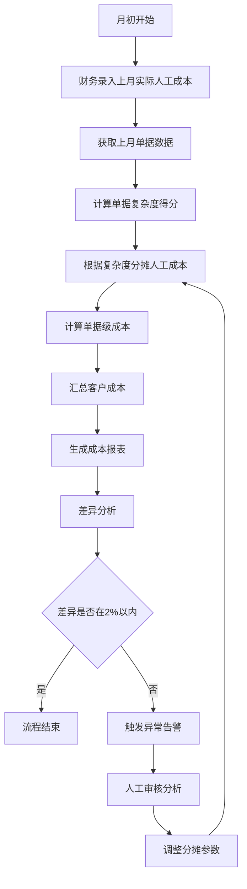
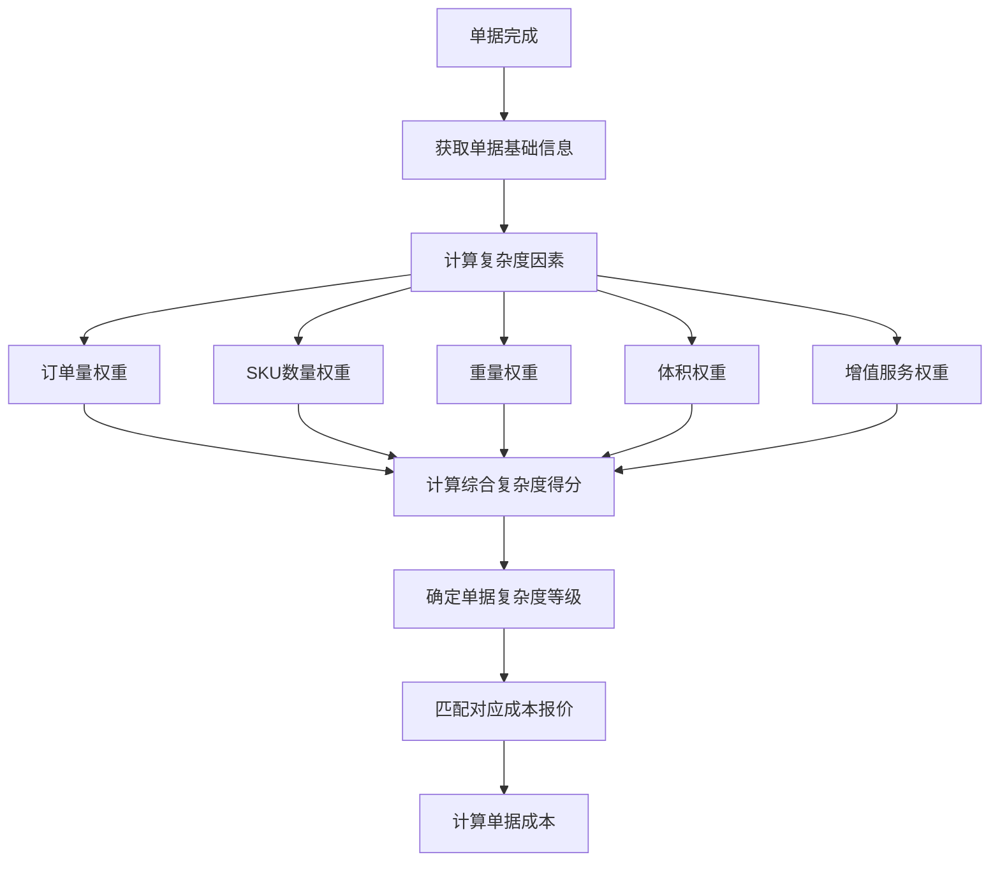
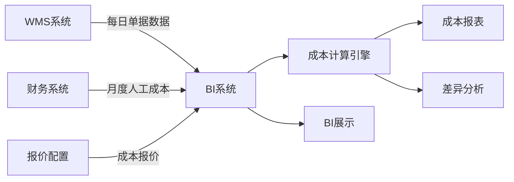

# BI成本计算逻辑优化方案 PRD

## 1. 文档概述

### 1.1 背景

**业务模式**：
- 一件代发：主要业务模式，小件客户居多
- 转运：货物在不同仓库间的转运
- 入库：客户货物入库操作
- 退件：退货处理
- 存储：货物仓储
- 增值服务：拍照、贴标、二次包装等增值服务

**客户类型**：
- 小件客户居多（占客户总数80%+）
- 大件客户较少（占客户总数20%以内）
- 客户总数：100-200个

**仓库分布**：
- 美国自有仓库：4个（美东、美西等）

### 1.2 当前流程详解

#### 1.2.1 成本报价配置
- 系统为每个客户配置三类费用的成本报价：
  - 入库费成本报价
  - 操作费成本报价
  - 退件费成本报价
- 成本报价来源：根据客户收入报价推算得出

#### 1.2.2 单据成本计算
- 系统在单据完成时，根据成本报价计算每个单据的成本
- 单据类型与费用对应关系：
  - 入库单 → 入库费成本
  - 出库单 → 操作费成本
  - 转运单 → 操作费成本
  - 增值服务单 → 操作费成本
  - 退货单 → 退件费成本
- 计算结果抽取到BI系统

#### 1.2.3 月度人工成本录入
- 每月初，财务统计上月每个仓库的实际人工成本支出
- 录入到BI基础数据录入模块
- 数据按仓库维度：仓库A、仓库B、仓库C、仓库D

#### 1.2.4 现有成本调整逻辑（问题核心）

**步骤1：计算上月三种费用的销售额占比**
```
仓库_入库费销售额占比 = 仓库_入库费收入 / (仓库_入库费收入 + 仓库_操作费收入 + 仓库_退件费收入)
仓库_操作费销售额占比 = 仓库_操作费收入 / (仓库_入库费收入 + 仓库_操作费收入 + 仓库_退件费收入)
仓库_退件费销售额占比 = 仓库_退件费收入 / (仓库_入库费收入 + 仓库_操作费收入 + 仓库_退件费收入)
```

**步骤2：分摊人工成本到三种费用**
```
仓库_入库费人工成本 = 仓库_实际人工成本 × 仓库_入库费销售额占比
仓库_操作费人工成本 = 仓库_实际人工成本 × 仓库_操作费销售额占比
仓库_退件费人工成本 = 仓库_实际人工成本 × 仓库_退件费销售额占比
```

**步骤3：计算上月预估人工成本（根据成本报价）**
```
仓库_入库费预估人工成本 = Σ(上月所有入库单的入库费成本)
仓库_操作费预估人工成本 = Σ(上月所有出库单/转运单/增值服务单的操作费成本)
仓库_退件费预估人工成本 = Σ(上月所有退货单的退件费成本)
仓库_总预估人工成本 = 仓库_入库费预估人工成本 + 仓库_操作费预估人工成本 + 仓库_退件费预估人工成本
```

**步骤4：计算调整系数**
```
仓库_调整系数 = 仓库_实际人工成本 / 仓库_总预估人工成本
```

**步骤5：更新成本报价**
```
新_入库费成本报价 = 原_入库费成本报价 × 仓库_调整系数
新_操作费成本报价 = 原_操作费成本报价 × 仓库_调整系数
新_退件费成本报价 = 原_退件费成本报价 × 仓库_调整系数
```

**步骤6：重新计算上月成本**
```
使用更新后的成本报价，重新计算上月的入库费、操作费、退件费成本
```

### 1.3 问题分析

#### 1.3.1 核心问题
**误差过大**：操作费、入库费、退件费按照仓库汇总后，与录入的人工成本差异较大，约20%

#### 1.3.2 问题根源分析

**问题1：循环依赖导致误差累积**
- 步骤3使用成本报价计算预估人工成本
- 步骤5使用调整系数更新成本报价
- 步骤6使用更新后的成本报价重新计算成本
- 形成循环：成本报价 → 预估成本 → 调整系数 → 新成本报价 → 新预估成本...

**问题2：分摊逻辑不准确**
- 使用销售额占比分摊人工成本，但销售额占比不能准确反映人工成本消耗
- 例如：
  - 入库费收入高，但入库操作简单，人工成本低
  - 操作费收入低，但操作复杂，人工成本高
- 导致分摊结果与实际人工成本消耗不匹配

**问题3：多次计算放大误差**
- 每次调整系数都会引入新的误差
- 多次调整后，误差累积到20%左右

**问题4：未考虑单据复杂度**
- 同样是操作费，不同单据的复杂度不同：
  - 小件出库单：简单，人工成本低
  - 大件出库单：复杂，人工成本高
  - 增值服务单：可能涉及拍照、贴标等，人工成本更高
- 但现有逻辑使用统一的成本报价，未区分复杂度

### 1.4 优化目标

**核心目标**：
- 将操作费、入库费、退件费的成本与实际人工成本的差异从20%降低到2%以内

**具体目标**：
- 消除循环依赖，避免误差累积
- 优化分摊逻辑，使分摊结果更准确
- 考虑单据复杂度，提升成本计算精度
- 保持成本报价的稳定性，避免频繁调整

### 1.5 适用范围

**适用系统**：
- 海外仓WMS系统
- BI分析系统
- 财务对账系统

**适用仓库**：
- 美国4个自有仓库

**适用客户**：
- 标准客户（100-200个）
- 小件客户为主

**适用费用类型**：
- 入库费
- 操作费（出库单、转运单、增值服务单）
- 退件费

---

## 2. 业务流程图

### 2.1 优化后的成本计算流程



### 2.2 单据复杂度计算流程



### 2.3 数据流转图



---

## 3. 详细功能需求

### 3.1 功能模块清单

| 模块编号 | 模块名称 | 优先级 | 说明 |
|---------|---------|--------|------|
| M01 | 月度人工成本管理 | P0 | 财务录入月度人工成本 |
| M02 | 单据复杂度计算 | P0 | 计算单据复杂度得分 |
| M03 | 人工成本分摊引擎 | P0 | 核心分摊逻辑 |
| M04 | 单据成本计算 | P0 | 单据级成本计算 |
| M05 | 成本差异分析 | P1 | 差异分析和告警 |
| M06 | 成本报表 | P0 | 成本报表生成 |
| M07 | 分摊参数配置 | P1 | 分摊参数配置和优化 |

### 3.2 M01 月度人工成本管理

#### 3.2.1 功能概述
财务录入每月每个仓库的实际人工成本支出。

#### 3.2.2 页面设计

**页面名称**：月度人工成本管理

**页面布局**：
```
┌─────────────────────────────────────────────────────────────┐
│ 月度人工成本管理                              [新增] [导入] │
├─────────────────────────────────────────────────────────────┤
│ 筛选：仓库 [下拉] 月份 [日期选择] 状态 [下拉] [查询]   │
├─────────────────────────────────────────────────────────────┤
│ 序号 │ 仓库 │ 月份 │ 人工成本 │ 录入人 │ 录入时间 │ 操作 │
├─────────────────────────────────────────────────────────────┤
│ 1    │ 美东A │ 2024-01│ 50000   │ 张三   │ 2024-02-01│ [查看]│
│ 2    │ 美东B │ 2024-01│ 45000   │ 张三   │ 2024-02-01│ [查看]│
│ 3    │ 美西A │ 2024-01│ 40000   │ 张三   │ 2024-02-01│ [查看]│
│ 4    │ 美西B │ 2024-01│ 38000   │ 张三   │ 2024-02-01│ [查看]│
└─────────────────────────────────────────────────────────────┘
```

#### 3.2.3 交互逻辑

**新增人工成本**：
1. 点击"新增"按钮，弹出新增对话框
2. 选择仓库、月份
3. 输入人工成本
4. 点击"保存"，立即生效
5. 触发成本重新计算

**导入人工成本**：
1. 点击"导入"按钮，上传Excel文件
2. 系统校验数据格式
3. 显示导入结果
4. 导入成功后触发成本重新计算

#### 3.2.4 业务规则

- 同一仓库同一月份只能有一条记录
- 录入后立即生效，用于成本计算
- 已录入的数据可以修改，修改后触发重新计算
- 记录录入人和录入时间

### 3.3 M02 单据复杂度计算

#### 3.3.1 功能概述
计算每个单据的复杂度得分，用于准确分摊人工成本。

#### 3.3.2 复杂度因素定义

**入库单复杂度因素**：
- SKU数量：SKU越多，入库越复杂
- 重量：重量越大，入库越复杂
- 体积：体积越大，入库越复杂
- 包装类型：散装/托盘，复杂度不同

**出库单复杂度因素**：
- SKU数量：SKU越多，拣货越复杂
- 订单行数：订单行数越多，打包越复杂
- 重量：重量越大，出库越复杂
- 体积：体积越大，出库越复杂
- 增值服务：有增值服务的单据更复杂

**转运单复杂度因素**：
- SKU数量
- 重量
- 体积
- 转运距离

**增值服务单复杂度因素**：
- 服务类型：拍照/贴标/二次包装等，复杂度不同
- SKU数量
- 重量

**退货单复杂度因素**：
- SKU数量
- 重量
- 体积
- 退货原因：质量问题/客户拒收等，处理复杂度不同

#### 3.3.3 复杂度计算公式

**入库单复杂度得分**：
```
入库单_复杂度得分 = 
    (SKU数量 / max_入库单_SKU数量) × SKU数量权重 +
    (重量 / max_入库单_重量) × 重量权重 +
    (体积 / max_入库单_体积) × 体积权重 +
    包装类型_复杂度系数 × 包装类型权重
```

**出库单复杂度得分**：
```
出库单_复杂度得分 = 
    (SKU数量 / max_出库单_SKU数量) × SKU数量权重 +
    (订单行数 / max_出库单_订单行数) × 订单行数权重 +
    (重量 / max_出库单_重量) × 重量权重 +
    (体积 / max_出库单_体积) × 体积权重 +
    增值服务_复杂度系数 × 增值服务权重
```

**转运单复杂度得分**：
```
转运单_复杂度得分 = 
    (SKU数量 / max_转运单_SKU数量) × SKU数量权重 +
    (重量 / max_转运单_重量) × 重量权重 +
    (体积 / max_转运单_体积) × 体积权重 +
    (转运距离 / max_转运单_距离) × 距离权重
```

**增值服务单复杂度得分**：
```
增值服务单_复杂度得分 = 
    服务类型_复杂度系数 × 服务类型权重 +
    (SKU数量 / max_增值服务单_SKU数量) × SKU数量权重 +
    (重量 / max_增值服务单_重量) × 重量权重
```

**退货单复杂度得分**：
```
退货单_复杂度得分 = 
    (SKU数量 / max_退货单_SKU数量) × SKU数量权重 +
    (重量 / max_退货单_重量) × 重量权重 +
    (体积 / max_退货单_体积) × 体积权重 +
    退货原因_复杂度系数 × 退货原因权重
```

#### 3.3.4 复杂度等级划分

根据复杂度得分，将单据划分为5个等级：

| 等级 | 得分范围 | 成本系数 | 说明 |
|-----|---------|---------|------|
| L1 | 0-0.2 | 0.5 | 极简单 |
| L2 | 0.2-0.4 | 0.8 | 简单 |
| L3 | 0.4-0.6 | 1.0 | 中等（基准） |
| L4 | 0.6-0.8 | 1.3 | 复杂 |
| L5 | 0.8-1.0 | 1.8 | 极复杂 |

#### 3.3.5 权重配置

**入库单权重配置**：
```
SKU数量权重：30%
重量权重：25%
体积权重：25%
包装类型权重：20%
```

**出库单权重配置**：
```
SKU数量权重：25%
订单行数权重：15%
重量权重：20%
体积权重：20%
增值服务权重：20%
```

**转运单权重配置**：
```
SKU数量权重：30%
重量权重：25%
体积权重：25%
距离权重：20%
```

**增值服务单权重配置**：
```
服务类型权重：40%
SKU数量权重：30%
重量权重：30%
```

**退货单权重配置**：
```
SKU数量权重：30%
重量权重：25%
体积权重：25%
退货原因权重：20%
```

### 3.4 M03 人工成本分摊引擎

#### 3.4.1 功能概述
根据单据复杂度，将人工成本准确分摊到每个单据。

#### 3.4.2 分摊逻辑（优化核心）

**步骤1：获取月度人工成本**
```
仓库_人工成本_total = 财务录入的月度人工成本
```

**步骤2：获取上月所有单据**
```
获取上月该仓库的所有单据：
- 入库单列表
- 出库单列表
- 转运单列表
- 增值服务单列表
- 退货单列表
```

**步骤3：计算每个单据的复杂度得分**
```
对每个单据，根据M02的逻辑计算复杂度得分
```

**步骤4：确定每个单据的复杂度等级和成本系数**
```
根据复杂度得分，确定等级（L1-L5）和成本系数
```

**步骤5：计算单据基准成本**
```
单据_基准成本 = 基础成本报价 × 单据_成本系数
```

**步骤6：计算单据分摊系数**
```
步骤6.1：计算所有单据的基准成本总和
所有单据_基准成本总和 = Σ(单据_基准成本)

步骤6.2：计算单据分摊系数
单据_分摊系数 = 单据_基准成本 / 所有单据_基准成本总和
```

**步骤7：分摊人工成本到单据**
```
单据_人工成本 = 仓库_人工成本_total × 单据_分摊系数
```

**步骤8：验证分摊结果**
```
验证：Σ(所有单据_人工成本) = 仓库_人工成本_total
如果不相等，按比例调整
```

#### 3.4.3 与现有逻辑的对比

| 对比项 | 现有逻辑 | 优化逻辑 | 优势 |
|-------|---------|---------|------|
| 分摊依据 | 销售额占比 | 单据复杂度 | 更准确反映人工成本消耗 |
| 计算次数 | 2次（预估→调整→重算） | 1次 | 避免误差累积 |
| 是否考虑复杂度 | 否 | 是 | 提升精度 |
| 是否循环依赖 | 是 | 否 | 消除循环 |
| 误差范围 | 20% | 目标2% | 大幅提升 |

#### 3.4.4 业务规则

- 分摊系数总和必须为100%
- 单据人工成本不能为负数
- 分摊结果必须验证总和一致性
- 支持按仓库分别分摊

### 3.5 M04 单据成本计算

#### 3.5.1 功能概述
根据分摊的人工成本，计算每个单据的成本。

#### 3.5.2 计算逻辑

**入库单成本**：
```
入库单_成本 = 入库单_人工成本
```

**出库单成本**：
```
出库单_成本 = 出库单_人工成本
```

**转运单成本**：
```
转运单_成本 = 转运单_人工成本
```

**增值服务单成本**：
```
增值服务单_成本 = 增值服务单_人工成本
```

**退货单成本**：
```
退货单_成本 = 退货单_人工成本
```

#### 3.5.3 计算时机

- 单据完成时立即计算
- 月度人工成本录入后，重新计算上月所有单据成本
- 分摊参数调整后，重新计算相关单据成本

#### 3.5.4 业务规则

- 成本计算结果保留2位小数
- 计算结果实时保存到BI系统
- 支持批量计算和单个计算

### 3.6 M05 成本差异分析

#### 3.6.1 功能概述
分析成本差异，提供差异告警和优化建议。

#### 3.6.2 差异计算

**仓库维度差异**：
```
仓库_入库费人工成本 = Σ(上月所有入库单_人工成本)
仓库_操作费人工成本 = Σ(上月所有出库单/转运单/增值服务单_人工成本)
仓库_退件费人工成本 = Σ(上月所有退货单_人工成本)
仓库_总人工成本 = 仓库_入库费人工成本 + 仓库_操作费人工成本 + 仓库_退件费人工成本

仓库_差异 = 仓库_总人工成本 - 仓库_实际人工成本
仓库_差异比例 = |仓库_差异| / 仓库_实际人工成本 × 100%
```

**客户维度差异**：
```
客户_入库费成本 = Σ(客户所有入库单_人工成本)
客户_操作费成本 = Σ(客户所有出库单/转运单/增值服务单_人工成本)
客户_退件费成本 = Σ(客户所有退货单_人工成本)
客户_总成本 = 客户_入库费成本 + 客户_操作费成本 + 客户_退件费成本

客户_差异 = 客户_总成本 - 客户_实际人工成本
客户_差异比例 = |客户_差异| / 客户_实际人工成本 × 100%
```

#### 3.6.3 告警规则

- 差异比例 < 2%：正常
- 差异比例 2%-5%：黄色告警
- 差异比例 5%-10%：橙色告警
- 差异比例 > 10%：红色告警

#### 3.6.4 优化建议

**建议1：调整复杂度权重**
- 如果某类单据的误差持续偏高，建议调整该类单据的权重配置

**建议2：优化成本报价**
- 如果整体误差偏高，建议优化基础成本报价

**建议3：分析异常单据**
- 如果个别单据成本异常，建议分析该单据的具体情况

### 3.7 M06 成本报表

#### 3.7.1 功能概述
生成和导出各类成本报表。

#### 3.7.2 报表类型

**仓库成本报表**：
- 按仓库维度展示入库费、操作费、退件费成本
- 对比实际人工成本
- 显示差异和差异比例

**客户成本报表**：
- 按客户维度展示入库费、操作费、退件费成本
- 客户成本汇总
- 客户成本排名

**单据成本报表**：
- 单据级成本明细
- 单据复杂度等级
- 单据人工成本

**差异分析报表**：
- 仓库维度差异分析
- 客户维度差异分析
- 时间维度趋势分析

#### 3.7.3 页面设计

**页面名称**：成本报表

**页面布局**：
```
┌─────────────────────────────────────────────────────────────┐
│ 成本报表                                    [生成报表] │
├─────────────────────────────────────────────────────────────┤
│ 报表类型：[下拉选择]                                    │
│ 月份：[日期选择]                                        │
│ 仓库：[下拉选择]                                        │
│ 客户：[输入]                                           │
├─────────────────────────────────────────────────────────────┤
│ 报表预览：                                              │
│ ┌───────────────────────────────────────────────────────┐ │
│ │ 仓库 │ 入库费成本 │ 操作费成本 │ 退件费成本 │ 总成本 │ │
│ │ 美东A │ 15000    │ 25000    │ 10000    │ 50000  │ │
│ │ 美东B │ 13500    │ 22500    │ 9000     │ 45000  │ │
│ │ 美西A │ 12000    │ 20000    │ 8000     │ 40000  │ │
│ │ 美西B │ 11400    │ 19000    │ 7600     │ 38000  │ │
│ └───────────────────────────────────────────────────────┘ │
├─────────────────────────────────────────────────────────────┤
│ 差异分析：                                              │
│ ┌───────────────────────────────────────────────────────┐ │
│ │ 仓库 │ 实际成本 │ 计算成本 │ 差异 │ 差异比例│ │
│ │ 美东A │ 50000   │ 50000   │ 0    │ 0.00%  │ │
│ │ 美东B │ 45000   │ 45000   │ 0    │ 0.00%  │ │
│ │ 美西A │ 40000   │ 40000   │ 0    │ 0.00%  │ │
│ │ 美西B │ 38000   │ 38000   │ 0    │ 0.00%  │ │
│ └───────────────────────────────────────────────────────┘ │
├─────────────────────────────────────────────────────────────┤
│ [导出Excel] [导出PDF] [打印] [分享]                    │
└─────────────────────────────────────────────────────────────┘
```

#### 3.7.4 业务规则

- 报表支持自定义筛选条件
- 支持多种导出格式（Excel、PDF、CSV）
- 报表数据实时计算
- 支持报表定时生成和发送

### 3.8 M07 分摊参数配置

#### 3.8.1 功能概述
配置和管理分摊参数，支持参数优化。

#### 3.8.2 参数配置

**复杂度权重配置**：
- 入库单权重配置
- 出库单权重配置
- 转运单权重配置
- 增值服务单权重配置
- 退货单权重配置

**成本等级配置**：
- L1-L5等级的成本系数配置
- 支持自定义等级划分

**基础成本报价配置**：
- 入库费基础成本报价
- 操作费基础成本报价
- 退件费基础成本报价

#### 3.8.3 页面设计

**页面名称**：分摊参数配置

**页面布局**：
```
┌─────────────────────────────────────────────────────────────┐
│ 分摊参数配置                                  [保存配置] │
├─────────────────────────────────────────────────────────────┤
│ 入库单权重配置：                                        │
│ ┌───────────────────────────────────────────────────────┐ │
│ │ SKU数量权重：    30%  [滑块]                       │ │
│ │ 重量权重：      25%  [滑块]                       │ │
│ │ 体积权重：      25%  [滑块]                       │ │
│ │ 包装类型权重：  20%  [滑块]                       │ │
│ │ 权重总和：     100%                                │ │
│ └───────────────────────────────────────────────────────┘ │
├─────────────────────────────────────────────────────────────┤
│ 出库单权重配置：                                        │
│ ┌───────────────────────────────────────────────────────┐ │
│ │ SKU数量权重：    25%  [滑块]                       │ │
│ │ 订单行数权重：  15%  [滑块]                       │ │
│ │ 重量权重：      20%  [滑块]                       │ │
│ │ 体积权重：      20%  [滑块]                       │ │
│ │ 增值服务权重：  20%  [滑块]                       │ │
│ │ 权重总和：     100%                                │ │
│ └───────────────────────────────────────────────────────┘ │
├─────────────────────────────────────────────────────────────┤
│ 成本等级配置：                                          │
│ ┌───────────────────────────────────────────────────────┐ │
│ │ 等级 │ 得分范围 │ 成本系数 │ 说明 │        │ │
│ │ L1   │ 0-0.2    │ 0.5     │ 极简单│        │ │
│ │ L2   │ 0.2-0.4  │ 0.8     │ 简单  │        │ │
│ │ L3   │ 0.4-0.6  │ 1.0     │ 中等  │        │ │
│ │ L4   │ 0.6-0.8  │ 1.3     │ 复杂  │        │ │
│ │ L5   │ 0.8-1.0  │ 1.8     │ 极复杂│        │ │
│ └───────────────────────────────────────────────────────┘ │
├─────────────────────────────────────────────────────────────┤
│ 基础成本报价：                                        │
│ ┌───────────────────────────────────────────────────────┐ │
│ │ 入库费基础报价：  [输入]                           │ │
│ │ 操作费基础报价：  [输入]                           │ │
│ │ 退件费基础报价：  [输入]                           │ │
│ └───────────────────────────────────────────────────────┘ │
└─────────────────────────────────────────────────────────────┘
```

#### 3.8.4 交互逻辑

**调整权重**：
1. 调整各因素权重（滑块或输入框）
2. 权重总和必须为100%
3. 点击"保存配置"，立即生效
4. 保存后触发成本重新计算

**调整成本等级**：
1. 修改等级的成本系数
2. 点击"保存配置"，立即生效
3. 保存后触发成本重新计算

#### 3.8.5 业务规则

- 权重总和必须为100%
- 成本系数必须为正数
- 参数修改需要记录日志
- 参数修改后需要重新计算成本

---

## 4. 数据字典

### 4.1 月度人工成本表

| 字段名 | 类型 | 长度 | 必填 | 说明 |
|-------|------|------|------|------|
| id | BIGINT | - | 是 | 主键ID |
| warehouse_id | VARCHAR | 50 | 是 | 仓库ID |
| warehouse_name | VARCHAR | 100 | 是 | 仓库名称 |
| month | DATE | - | 是 | 月份 |
| labor_cost | DECIMAL | 15,2 | 是 | 人工成本 |
| created_by | VARCHAR | 50 | 是 | 创建人 |
| created_time | DATETIME | - | 是 | 创建时间 |
| updated_time | DATETIME | - | 是 | 更新时间 |

### 4.2 单据复杂度表

| 字段名 | 类型 | 长度 | 必填 | 说明 |
|-------|------|------|------|------|
| id | BIGINT | - | 是 | 主键ID |
| order_id | VARCHAR | 50 | 是 | 单据ID |
| order_type | VARCHAR | 20 | 是 | 单据类型（入库单/出库单/转运单/增值服务单/退货单） |
| sku_count | INT | - | 是 | SKU数量 |
| weight | DECIMAL | 10,2 | 是 | 重量 |
| volume | DECIMAL | 10,2 | 是 | 体积 |
| complexity_score | DECIMAL | 10,6 | 是 | 复杂度得分 |
| complexity_level | VARCHAR | 10 | 是 | 复杂度等级（L1/L2/L3/L4/L5） |
| cost_coefficient | DECIMAL | 5,2 | 是 | 成本系数 |
| created_time | DATETIME | - | 是 | 创建时间 |

### 4.3 单据成本表

| 字段名 | 类型 | 长度 | 必填 | 说明 |
|-------|------|------|------|------|
| id | BIGINT | - | 是 | 主键ID |
| order_id | VARCHAR | 50 | 是 | 单据ID |
| order_type | VARCHAR | 20 | 是 | 单据类型 |
| customer_id | VARCHAR | 50 | 是 | 客户ID |
| customer_name | VARCHAR | 100 | 是 | 客户名称 |
| warehouse_id | VARCHAR | 50 | 是 | 仓库ID |
| order_date | DATE | - | 是 | 单据日期 |
| complexity_level | VARCHAR | 10 | 是 | 复杂度等级 |
| labor_cost | DECIMAL | 15,2 | 是 | 人工成本 |
| allocation_ratio | DECIMAL | 10,6 | 是 | 分摊系数 |
| created_time | DATETIME | - | 是 | 创建时间 |
| updated_time | DATETIME | - | 是 | 更新时间 |

### 4.4 分摊参数配置表

| 字段名 | 类型 | 长度 | 必填 | 说明 |
|-------|------|------|------|------|
| id | BIGINT | - | 是 | 主键ID |
| order_type | VARCHAR | 20 | 是 | 单据类型 |
| sku_weight | DECIMAL | 5,2 | 是 | SKU数量权重 |
| weight_weight | DECIMAL | 5,2 | 是 | 重量权重 |
| volume_weight | DECIMAL | 5,2 | 是 | 体积权重 |
| line_weight | DECIMAL | 5,2 | 否 | 订单行数权重 |
| service_weight | DECIMAL | 5,2 | 否 | 增值服务权重 |
| package_weight | DECIMAL | 5,2 | 否 | 包装类型权重 |
| distance_weight | DECIMAL | 5,2 | 否 | 距离权重 |
| return_weight | DECIMAL | 5,2 | 否 | 退货原因权重 |
| total_weight | DECIMAL | 5,2 | 是 | 权重总和 |
| is_active | TINYINT | - | 是 | 是否生效（0否/1是） |
| created_by | VARCHAR | 50 | 是 | 创建人 |
| created_time | DATETIME | - | 是 | 创建时间 |
| updated_time | DATETIME | - | 是 | 更新时间 |

### 4.5 成本等级配置表

| 字段名 | 类型 | 长度 | 必填 | 说明 |
|-------|------|------|------|------|
| id | BIGINT | - | 是 | 主键ID |
| level_code | VARCHAR | 10 | 是 | 等级代码（L1/L2/L3/L4/L5） |
| level_name | VARCHAR | 20 | 是 | 等级名称 |
| min_score | DECIMAL | 10,6 | 是 | 最小得分 |
| max_score | DECIMAL | 10,6 | 是 | 最大得分 |
| cost_coefficient | DECIMAL | 5,2 | 是 | 成本系数 |
| description | VARCHAR | 100 | 否 | 说明 |
| is_active | TINYINT | - | 是 | 是否生效（0否/1是） |
| created_by | VARCHAR | 50 | 是 | 创建人 |
| created_time | DATETIME | - | 是 | 创建时间 |

### 4.6 基础成本报价表

| 字段名 | 类型 | 长度 | 必填 | 说明 |
|-------|------|------|------|------|
| id | BIGINT | - | 是 | 主键ID |
| fee_type | VARCHAR | 20 | 是 | 费用类型（入库费/操作费/退件费） |
| base_cost | DECIMAL | 10,2 | 是 | 基础成本报价 |
| is_active | TINYINT | - | 是 | 是否生效（0否/1是） |
| created_by | VARCHAR | 50 | 是 | 创建人 |
| created_time | DATETIME | - | 是 | 创建时间 |
| updated_time | DATETIME | - | 是 | 更新时间 |

### 4.7 差异告警表

| 字段名 | 类型 | 长度 | 必填 | 说明 |
|-------|------|------|------|------|
| id | BIGINT | - | 是 | 主键ID |
| warehouse_id | VARCHAR | 50 | 是 | 仓库ID |
| customer_id | VARCHAR | 50 | 否 | 客户ID（空表示仓库级别） |
| month | DATE | - | 是 | 月份 |
| actual_cost | DECIMAL | 15,2 | 是 | 实际人工成本 |
| calculated_cost | DECIMAL | 15,2 | 是 | 计算人工成本 |
| diff_value | DECIMAL | 15,2 | 是 | 差异值 |
| diff_ratio | DECIMAL | 10,6 | 是 | 差异比例 |
| alert_level | VARCHAR | 10 | 是 | 告警级别（黄色/橙色/红色） |
| is_handled | TINYINT | - | 是 | 是否已处理（0否/1是） |
| created_time | DATETIME | - | 是 | 创建时间 |
| handled_time | DATETIME | - | 否 | 处理时间 |

### 4.8 操作日志表

| 字段名 | 类型 | 长度 | 必填 | 说明 |
|-------|------|------|------|------|
| id | BIGINT | - | 是 | 主键ID |
| operation_type | VARCHAR | 50 | 是 | 操作类型 |
| operation_content | TEXT | - | 是 | 操作内容 |
| operator | VARCHAR | 50 | 是 | 操作人 |
| operator_ip | VARCHAR | 50 | 否 | 操作IP |
| operation_time | DATETIME | - | 是 | 操作时间 |
| operation_result | VARCHAR | 20 | 是 | 操作结果（成功/失败） |
| remark | TEXT | - | 否 | 备注 |

---

## 5. 异常流程与边界情况

### 5.1 异常流程处理

#### 5.1.1 人工成本未录入

**场景**：月初财务未及时录入人工成本

**处理流程**：
```
1. 系统检测到人工成本未录入
2. 发送告警通知给财务人员
3. 使用上月人工成本作为临时数据
4. 标记为"临时数据"
5. 实际数据录入后，重新计算成本
```

**业务规则**：
- 连续2个月未录入，升级告警
- 临时数据需要明确标记
- 重新计算后需要通知相关人员

#### 5.1.2 复杂度计算异常

**场景**：单据复杂度计算结果异常（如得分>1、得分<0等）

**处理流程**：
```
1. 系统检测到复杂度异常
2. 记录异常日志
3. 使用默认复杂度等级（L3）
4. 发送告警通知给管理员
5. 管理员检查单据数据后手动调整
```

**业务规则**：
- 复杂度得分必须在0-1之间
- 异常单据需要人工审核
- 记录异常原因和处理结果

#### 5.1.3 分摊系数异常

**场景**：分摊系数计算结果异常（如总和不为100%、出现负数等）

**处理流程**：
```
1. 系统检测到分摊系数异常
2. 记录异常日志
3. 使用默认分摊参数
4. 发送告警通知给管理员
5. 管理员检查参数后手动触发重新计算
```

**业务规则**：
- 分摊系数总和必须在99.9%-100.1%之间
- 分摊系数不能为负数
- 单个单据分摊系数不能超过50%

#### 5.1.4 差异过大

**场景**：成本差异超过阈值（>10%）

**处理流程**：
```
1. 系统检测到成本差异过大
2. 触发红色告警
3. 暂停自动计算，需要人工审核
4. 通知产品经理和财务负责人
5. 人工确认后，决定是否调整参数
```

**业务规则**：
- 差异>10%需要人工审核
- 差异>20%需要产品经理审批
- 记录差异原因和处理结果

### 5.2 边界情况处理

#### 5.2.1 新客户首次计算

**场景**：新客户没有历史数据

**处理规则**：
- 使用基础成本报价作为初始成本
- 按照复杂度分摊方式分配成本
- 首月数据标记为"初始数据"
- 次月开始使用实际数据计算

#### 5.2.2 单据数据缺失

**场景**：单据数据不完整（如缺少重量、体积等）

**处理规则**：
- 使用默认值（重量=0、体积=0）
- 标记为"数据不完整"
- 通知相关人员补充数据
- 数据补充后重新计算

#### 5.2.3 仓库新增/停用

**场景**：仓库新增或停用

**处理规则**：
- 新仓库：需要录入成本数据后才能计算
- 停用仓库：保留历史数据，不再计算新成本
- 仓库切换：需要重新分配单据和成本

#### 5.2.4 月末最后一天计算

**场景**：月末最后一天计算成本

**处理规则**：
- 优先使用月末数据
- 如果月末数据未完成，使用最近可用数据
- 次月1日重新计算，确保准确性

#### 5.2.5 跨月单据处理

**场景**：单据跨月（如1月31日入库，2月1日出库）

**处理规则**：
- 按单据完成日期归属月份
- 跨月单据需要特殊标记
- 财务对账时需要考虑跨月单据

### 5.3 数据一致性保障

#### 5.3.1 数据校验

**校验规则**：
- 人工成本必须为正数
- 复杂度得分必须在0-1之间
- 分摊系数总和必须为100%
- 单据成本不能超过总人工成本
- 差异比例在合理范围内

**校验时机**：
- 人工成本录入时
- 复杂度计算时
- 分摊计算时
- 报表生成前

#### 5.3.2 数据备份

**备份策略**：
- 每日自动备份成本数据
- 重要操作前自动备份
- 支持手动备份
- 备份数据保留至少6个月

#### 5.3.3 数据回滚

**回滚场景**：
- 计算错误需要回滚
- 参数调整错误需要回滚
- 数据异常需要回滚

**回滚规则**：
- 支持回滚到任意历史版本
- 回滚需要权限控制
- 回滚需要记录日志
- 回滚后需要通知相关人员

### 5.4 性能边界

#### 5.4.1 大数据量处理

**场景**：单据数量增加到100万+/月

**处理策略**：
- 优化复杂度计算算法
- 使用分批计算，避免内存溢出
- 支持分布式计算
- 增加计算服务器资源

#### 5.4.2 并发计算

**场景**：多个用户同时触发成本计算

**处理策略**：
- 使用分布式锁，避免重复计算
- 支持计算队列管理
- 优先级管理（手动>自动）
- 计算状态实时显示

#### 5.4.3 系统故障

**场景**：系统故障导致计算中断

**处理策略**：
- 支持断点续算
- 故障恢复后自动继续计算
- 故障期间使用临时数据
- 故障恢复后重新计算

### 5.5 安全边界

#### 5.5.1 权限控制

**权限分级**：
- 普通用户：查看成本报表
- 财务人员：录入人工成本
- 管理员：配置分摊参数
- 超级管理员：所有权限

**权限控制**：
- 基于角色的访问控制（RBAC）
- 重要操作需要二次确认
- 记录所有操作日志
- 定期审计权限使用情况

#### 5.5.2 数据安全

**安全措施**：
- 数据传输加密
- 数据存储加密
- 定期安全审计
- 敏感数据脱敏

#### 5.5.3 合规要求

**合规事项**：
- 数据保留符合法规要求
- 审计日志完整可追溯
- 数据备份和恢复机制
- 隐私保护措施

---

## 6. 实施建议

### 6.1 分阶段实施

**第一阶段（1-2周）**：
- 实现月度人工成本管理
- 实现单据复杂度计算
- 实现基础分摊逻辑

**第二阶段（2-3周）**：
- 实现单据成本计算
- 实现成本差异分析
- 实现成本报表

**第三阶段（1-2周）**：
- 实现分摊参数配置
- 实现日志审计
- 系统测试和优化

### 6.2 数据迁移

**迁移策略**：
- 备份现有成本数据
- 数据清洗和校验
- 分批迁移数据
- 迁移后数据验证

### 6.3 用户培训

**培训内容**：
- 系统功能介绍
- 复杂度计算逻辑培训
- 分摊参数配置培训
- 异常处理培训

### 6.4 风险控制

**风险识别**：
- 数据迁移风险
- 系统性能风险
- 用户接受度风险
- 业务连续性风险

**应对措施**：
- 制定详细测试计划
- 准备回滚方案
- 建立应急预案
- 加强沟通和培训

---

## 7. 附录

### 7.1 术语表

| 术语 | 说明 |
|-----|------|
| 入库费 | 客户货物入库时收取的费用 |
| 操作费 | 订单处理、拣货、打包等操作费用（包括出库单、转运单、增值服务单） |
| 退件费 | 退货处理费用 |
| 单据复杂度 | 单据的复杂程度，由多个因素综合计算得出 |
| 复杂度等级 | 根据复杂度得分划分的等级（L1-L5） |
| 成本系数 | 根据复杂度等级确定的成本乘数 |
| 分摊系数 | 单据在总人工成本中的占比 |
| 差异比例 | 计算成本与实际人工成本的差异 |

### 7.2 参考资料

- 海外仓WMS系统需求文档
- 财务对账系统需求文档
- BI系统技术架构文档
- 成本管理最佳实践

### 7.3 变更记录

| 版本 | 日期 | 变更内容 | 变更人 |
|-----|------|---------|--------|
| V1.0 | 2024-02-01 | 优化版本，基于复杂度分摊 | 产品经理 |

---

**文档结束**
