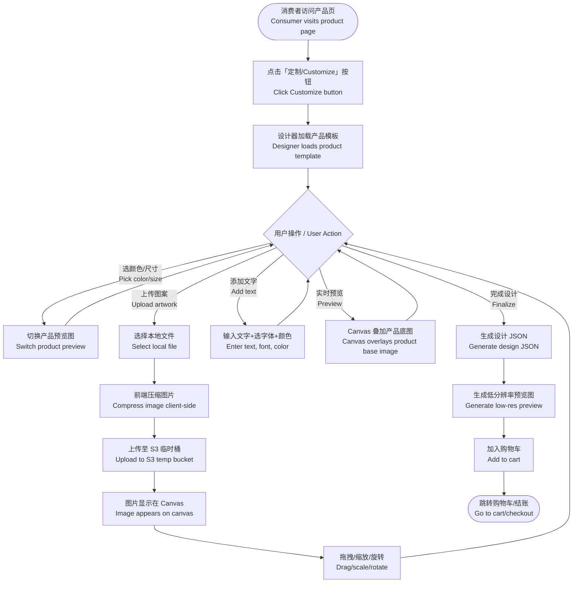
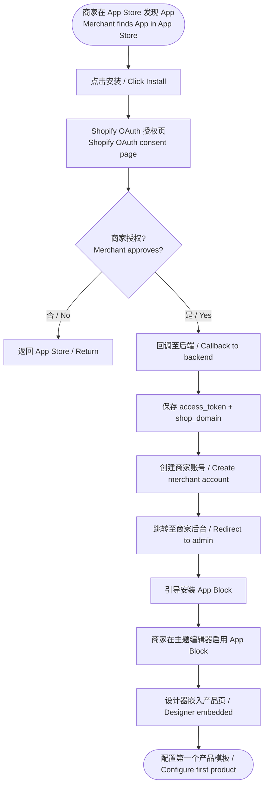
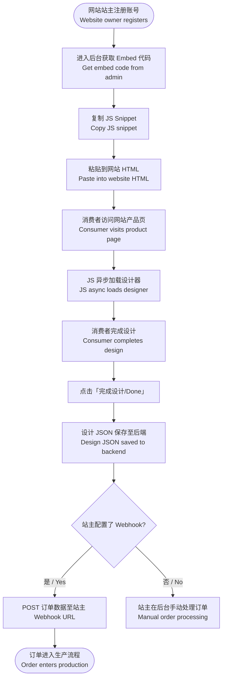
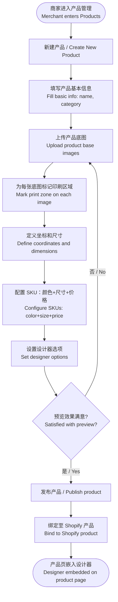
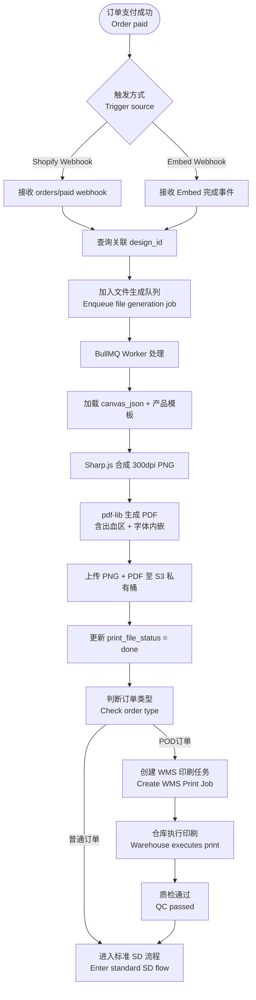
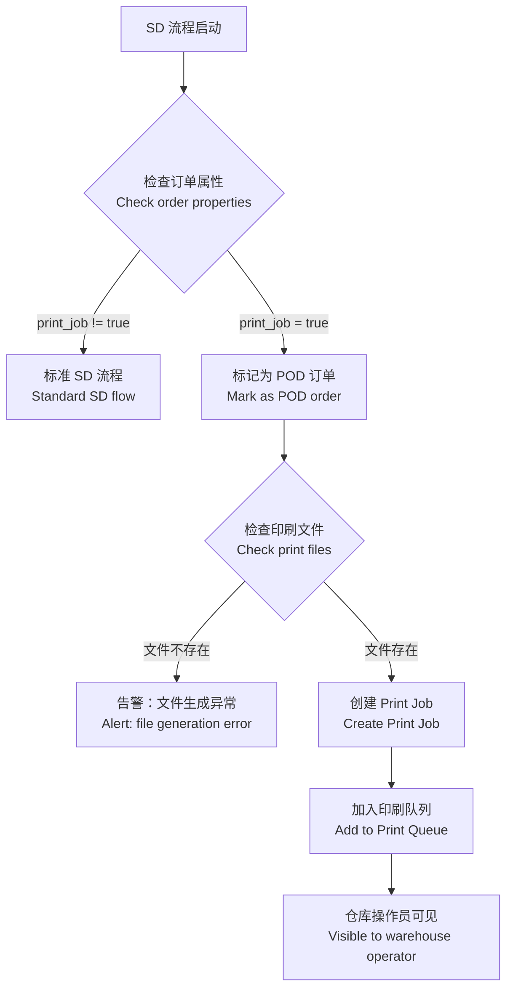
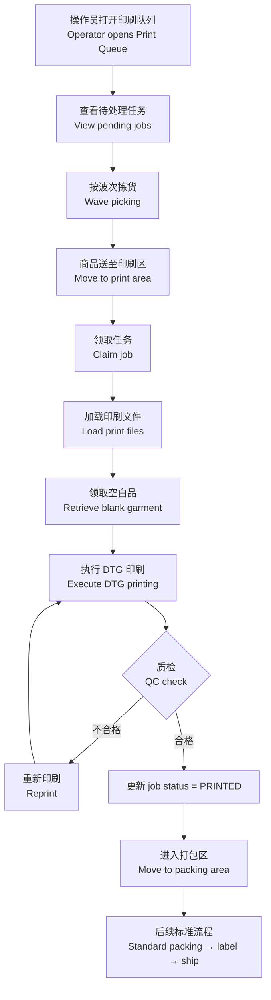
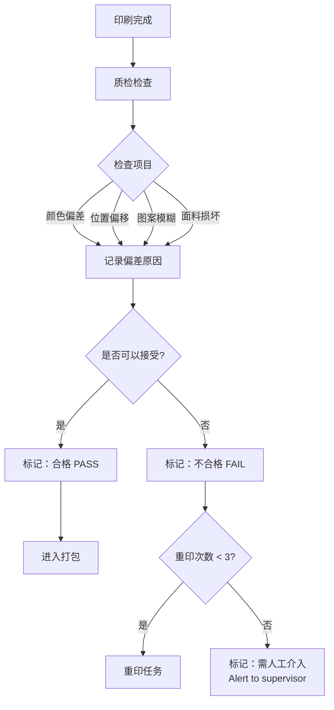
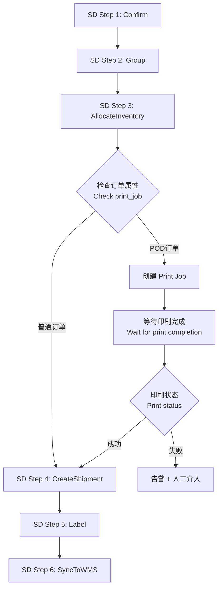

# PRD: POD 产品定制设计器（自有仓库履约版）

> | Field / 字段 | Value / 值 |
> |---|---|
> | **Status / 状态** | Draft / 草稿 |
> | **Owner / 负责人** | [产品负责人] |
> | **Contributors / 参与者** | [前端、后端、设计、仓库运营] |
> | **Approved By / 审批人** | — |
> | **Approved Date / 审批日期** | — |
> | **Decision / 审批决定** | Pending / 待审批 |
> | **Created / 创建日期** | 2026-03-19 |
> | **Last Updated / 最后更新** | 2026-03-19 |
> | **Version / 版本** | V1.0 |
> | **基于版本** | V3.0 + V2.0（自有仓库履约） |

---

## I. Glossary / 术语说明

| Term / 术语 | Definition / 定义（CN / EN） |
|---|---|
| POD | 按需印刷（Print-on-Demand），收到订单后才生产 / Print-on-Demand: produce only after order is placed |
| Design Studio / 设计器 | 供消费者在网页中定制产品图案的交互工具 / In-browser interactive tool for customers to customize product designs |
| Mockup / 效果图 | 将设计叠加到产品图上的预览图 / Preview image with design composited onto product photo |
| Shopify App | 以 Shopify OAuth 认证集成到 Shopify 商店的 SaaS 插件 / SaaS plugin integrated into Shopify store via OAuth |
| App Block | Shopify 主题中可拖拽放置的 UI 区块，用于嵌入设计器 / Draggable UI block in Shopify themes for embedding designer |
| Embed Widget | 可嵌入任意网站的 iframe/JS 脚本组件 / iframe/JS snippet embeddable in any website |
| Print-ready File / 印刷文件 | 300dpi PNG + PDF，用于工厂生产的高清设计稿 / 300dpi PNG + PDF high-res files for factory production |
| SKU | 库存单位，对应具体产品+颜色+尺寸组合 / Stock Keeping Unit: specific product+color+size combination |
| Bleed Area / 出血区 | 印刷边缘的额外区域，防止裁切偏差 / Extra margin area around print to prevent cutting misalignment |
| Fabric.js | 主流 HTML5 Canvas 设计库，支持对象模型和 SVG 导出 / Leading HTML5 Canvas library with object model and SVG export |
| POD Order / POD 订单 | 需要印刷作业的订单，通过订单属性识别 / Orders requiring print jobs, identified by order properties |
| Print Queue / 印刷队列 | WMS 中管理待印刷任务的队列 / Queue in WMS to manage pending print jobs |
| SD Flow / SD 流程 | Smart Distribution，ShipSage 自动化出库调度流程 / ShipSage's automated outbound scheduling flow |
| Handling Fee / 操作费 | 仓库作业人员执行操作的费用 / Fee for warehouse operations |

---

## II. Business Background / 业务背景

### 2.1 Background / 背景

**[CN]**
该厂商从事 POD（按需印刷）业务，产品涵盖 T恤、手机壳、马克杯等各类可定制实物商品。计划面向美国市场销售，已拥有美国仓库和物流体系。

当前市场上，Customily、Zakeke、Printful 等平台已提供成熟的产品定制工具，但：
- 均以 SaaS 订阅模式运营，成本高（月费 $29–$99）
- 依赖第三方工厂，履约周期长（7-15 天）
- 品牌控制权弱、定制空间受限

本项目旨在自研一套「产品定制设计器（Design Studio）」，作为独立 SaaS 产品销售给 Shopify 商家和非 Shopify 电商，同时利用自有仓库进行印刷生产，实现「接单→仓内印刷→2-4 天发运」的完整闭环。

**核心差异化**：
1. 商家只需安装 App 即可使用设计器，无需技术背景
2. 自有仓库印刷，履约时效快（2-4 天）
3. V1 定价 Free，快速积累用户

**[EN]**
The company operates a POD (Print-on-Demand) business covering T-shirts, phone cases, mugs, and other customizable physical products, targeting the US market with established US warehouses and logistics.

This project aims to build a proprietary "Product Design Studio" as an independent SaaS product sold to Shopify merchants and non-Shopify e-commerce sites, while using in-house warehouses for print production, achieving "order → in-warehouse printing → 2-4 day shipping" complete闭环.

### 2.2 Business Goals / 业务目标

| Goal Type / 目标类型 | Goal / 目标描述 | Metric / 衡量指标 | Target / 目标值 |
|---|---|---|---|
| 用户增长 / User Growth | Shopify App Store 安装量 | 上线后 6 个月累计 | ≥ 200 家店铺 |
| 转化率 / Conversion | 设计器使用后的订单转化率 | 进入设计器 → 加购比率 | ≥ 35% |
| 履约时效 / Fulfillment | 订单印刷到发货时效 | 印刷完成到出库时间 | ≤ 24 小时 |
| 运营效率 / Efficiency | 印刷文件生成自动化率 | 订单自动生成文件占比 | ≥ 95% |
| 生产效率 / Production | 印刷作业完成率 | 按时完成印刷占比 | ≥ 98% |
| 用户满意度 / Satisfaction | App Store 评分 | Shopify App Store 评分 | ≥ 4.5 ⭐ |

---

## III. Users & Scenarios / 用户与场景

### 3.1 User Roles / 用户角色

| Role / 角色 | Description / 描述 | Pain Points / 核心痛点 | Needs / 核心诉求 |
|---|---|---|---|
| Shopify 商家 / Merchant | 在 Shopify 上销售 POD 商品的卖家 | 现有工具贵且品牌感弱；设置复杂；印刷文件需手动处理 | 低成本、一键安装、自动出印刷文件 |
| 网站站主 / Website Owner | 使用 WordPress/Wix 等建站工具的卖家 | 无法用 Shopify App，需要独立嵌入方案 | JS 一行代码嵌入，无需技术背景 |
| 终端消费者 / Consumer | 在商品页定制产品的购买者 | 工具难用；预览不真实；上传图片慢 | 简单直觉的设计体验，所见即所得 |
| 仓库操作员 / Warehouse Operator | 执行印刷作业的仓库人员 | 任务分配不清晰；无批量处理 | 清晰的印刷任务队列 |
| 厂商管理员 / Admin | 管理产品模板、订单、仓库的运营 | 订单设计文件分散；无统一后台 | 统一订单管理、自动生成 PNG+PDF、自动分配印刷任务 |

---

### 3.2 Core Scenarios / 核心场景

**场景一 / Scenario 1：消费者定制 T恤并下单 / Consumer Customizes T-Shirt and Orders**
- Trigger / 触发条件：消费者访问 Shopify 店铺的 T恤产品页，点击「Customize / 定制」
- Expected Result / 期望结果：打开设计器，选颜色尺寸、上传图案、预览效果、加入购物车，全程 ≤ 5 分钟完成

**场景二 / Scenario 2：商家安装 Shopify App 并配置产品 / Merchant Installs App and Configures Product**
- Trigger / 触发条件：商家在 Shopify App Store 搜索到本 App 并点击安装
- Expected Result / 期望结果：OAuth 授权后进入商家后台，10 分钟内完成第一个产品的模板配置并发布上线

**场景三 / Scenario 3：POD 订单自动流转到仓库印刷 / POD Order Auto-routed to Warehouse Print**
- Trigger / 触发条件：消费者支付成功，系统自动生成 PNG+PDF 印刷文件
- Expected Result / 期望结果：5 分钟内印刷文件生成完毕，WMS 创建印刷任务，仓库操作员执行印刷

**场景四 / Scenario 4：仓库完成印刷并发出 / Warehouse Completes Print and Ship**
- Trigger / 触发条件：仓库操作员完成印刷、质检、打包
- Expected Result / 期望结果：订单进入标准 SD 流程，打印面单、发货、消费者收到物流通知

---

## IV. Design Approach / 设计思路

### 4.1 Core Design Principles / 核心设计理念

**[CN]**
1. **所见即所得**：设计器预览效果必须与最终印刷效果高度一致（颜色、位置、比例）
2. **零门槛上手**：消费者无需任何设计经验，3 步完成定制（选产品 → 上传/编辑 → 加购）
3. **嵌入即插即用**：Shopify App 一键安装；非 Shopify 网站一行 JS 代码嵌入
4. **印刷文件自动化**：订单成功后系统自动生成 PNG（位图）和 PDF（矢量/出血）双格式，无人工介入
5. **仓库作业标准化**：POD 印刷作为独立作业单元，插入现有 WMS 流程
6. **全链路可视化**：从消费者下单 → 仓库印刷 → 发货，全程可追踪

**[EN]**
1. **WYSIWYG**: Designer preview must closely match final print output (color, position, scale)
2. **Zero learning curve**: 3 steps to customize — pick product → upload/edit → add to cart
3. **Plug-and-play embedding**: Shopify App one-click install; non-Shopify sites embed with one JS line
4. **Automated print files**: Auto-generates PNG + PDF after order success, zero manual intervention
5. **Standardized warehouse operations**: POD print as independent work unit, inserted into existing WMS flow
6. **Full visibility**: From consumer order → warehouse print → shipment, trackable throughout

### 4.2 Solution Comparison / 方案选择

#### 前端设计器引擎 / Frontend Canvas Engine

| Option / 方案 | Pros / 优点 | Cons / 缺点 | Decision / 决定 |
|---|---|---|---|
| **Fabric.js** | SVG 导出支持（印刷必须）；对象模型成熟；序列化/反序列化；POD 领域案例最多 | 大量对象时性能弱于 Konva | ✅ 采用 |
| Konva.js | 高性能；TypeScript 原生 | **不支持 SVG 导出**（印刷致命缺陷）| ❌ 放弃 |
| Three.js（3D）| 3D/AR 效果震撼 | 开发成本极高，V1 过度投入 | ❌ 后续迭代 |

#### Shopify 集成方式 / Shopify Integration Method

| Option / 方案 | Pros / 优点 | Cons / 缺点 | Decision / 决定 |
|---|---|---|---|
| **Shopify Public App + App Block** | 上架 App Store；Theme Extension 无缝嵌入产品页；Shopify Billing 自动扣款 | 需通过审核（1-2周）| ✅ 采用 |
| Shopify Custom App | 无需审核，开发快 | 只能被单一店铺使用，无法上架 | ❌ 仅测试阶段 |
| 纯 iframe 嵌入 | 最简单 | 无法访问 Shopify Cart API | ❌ 放弃 |

#### 嵌入非 Shopify 网站 / Non-Shopify Embed

| Option / 方案 | Pros / 优点 | Cons / 缺点 | Decision / 决定 |
|---|---|---|---|
| **JS Snippet（异步加载）** | 一行代码嵌入；支持任意网站 | 需处理跨域通信（postMessage）| ✅ 采用 |
| WordPress Plugin | WP 用户体验更好 | 维护成本高，需单独上架 | ❌ 后续迭代 |

#### 印刷文件格式 / Print File Format ✅ 已确认

| Option / 方案 | Pros / 优点 | Cons / 缺点 | Decision / 决定 |
|---|---|---|---|
| **PNG 300dpi + PDF（双格式）** | PNG 通用；PDF 支持矢量/出血 | 生成耗时略增（约+2秒）| ✅ 采用 |
| 仅 PNG | 生成快 | 不满足部分工厂 PDF 要求 | ❌ 放弃 |

#### 后端技术栈 / Backend Tech Stack

| Option / 方案 | Pros / 优点 | Cons / 缺点 | Decision / 决定 |
|---|---|---|---|
| **Node.js + Fastify** | Shopify 官方推荐；JS 全栈统一 | CPU 密集任务需 Worker Thread | ✅ 采用 |
| Python + FastAPI | 图像处理生态好 | 与前端 JS 技术栈分离 | ❌ 放弃 |

### 4.3 WMS 印刷作业流程设计 / WMS Print Job Flow Design

#### 4.3.1 POD 订单识别

| 识别方式 | 实现方式 | 说明 |
|----------|----------|------|
| **订单属性识别** | Shopify `line_items.properties.print_job=true` | 商家配置产品时启用 POD |
| **SKU 标识** | SKU 包含特定后缀（如 `-POD`）| 备用识别方案 |

#### 4.3.2 印刷作业插入 WMS 流程位置

```
标准WMS流程:  订单入库 → 库存 → 拣货 → 打包 → 贴标 → 发运
                    ↑                    ↑          ↑
              POD订单识别            印刷作业      复用现有
                                   插入位置
```

**作业流程**：
1. **POD 订单识别**：SD 流程中识别 `print_job=true` 的订单
2. **创建印刷任务**：生成 Print Job，加入印刷队列
3. **拣货**：按波次拣货，将 POD 商品送至印刷区
4. **印刷**：操作员执行印刷（DTG 数码直喷）
5. **质检**：检查印刷质量，合格进入打包
6. **后续流程**：复用标准打包 → 贴标 → 发运

---

## V. Scope / 开发范围

| Application / 应用 | Module / 模块 | Task # | Task / 任务 | Description / 描述 |
|---|---|---|---|---|
| Design Studio | 设计器核心 | T1 | 产品定制设计器 / Product Design Studio | Fabric.js Canvas 编辑器，含上传、文字、效果、预览 |
| Design Studio | 嵌入集成 | T2 | Shopify App 集成 / Shopify App Integration | OAuth、App Block 嵌入、购物车 API、Billing |
| Design Studio | 嵌入集成 | T3 | Embed Widget（非 Shopify）/ Non-Shopify Embed | JS Snippet 生成、iframe 通信、订单回传 |
| Admin | 产品管理 | T4 | 产品模板管理后台 / Product Template Management | 上传模板图、定义印刷区域、管理 SKU |
| Admin | 订单管理 | T5 | 订单与印刷文件管理 / Order & Print File Management | 订单列表、自动生成 PNG+PDF、下载/推送 |
| Integration | WMS 集成 | T6 | WMS 印刷作业管理 / WMS Print Job Management | 印刷队列创建、波次拣货、印刷执行、质检 |
| Integration | SD 集成 | T7 | SD 流程集成 / SD Flow Integration | POD 订单识别、任务推送、状态回传 |

---

## VI. Menu Configuration / 菜单配置

| Application | Menu Path / 菜单路径 | Screen / 页面 | Type | Permission / 权限 |
|---|---|---|---|---|
| Shopify App Admin | Dashboard / 概览 | 安装状态、订单统计 | page | 商家 |
| Shopify App Admin | Products / 产品 | 产品模板列表 | page | 商家 |
| Shopify App Admin | Products / 产品 > New | 新建/编辑产品模板 | page | 商家 |
| Shopify App Admin | Orders / 订单 | 订单列表 + 印刷文件 | page | 商家 |
| Shopify App Admin | Embed / 嵌入代码 | JS Snippet 生成 | page | 商家 |
| Shopify App Admin | Settings / 设置 | 品牌色、字体、水印 | page | 商家 |
| ShipSage WMS | POD / Print Queue | 印刷任务队列 | page | 仓库操作员 |
| ShipSage WMS | POD / Print Jobs | 印刷作业详情 | page | 仓库操作员 |
| ShipSage WMS | POD / Print Stats | 印刷统计报表 | page | 仓库管理员 |
| ShipSage ADMIN | POD / Config | POD 基础配置 | page | 管理员 |

---

## VII. Initialization / 初始化配置

| Application | Content / 初始化内容 | Comment / 备注 |
|---|---|---|
| Shopify App | 以美国法人主体在 Shopify Partner 后台注册 App，配置 OAuth scopes：`write_products, read_orders, write_script_tags` | 法人已就绪 |
| Shopify App | 提交 App 至 Shopify App Store 审核，V1 定价：Free | 审核周期约 1-2 周 |
| 后端 / Backend | 初始化产品模板库：T恤(5色)、手机壳(iPhone16/15/14系列)、马克杯，各含印刷区域配置 | 上线前完成 |
| 后端 / Backend | AWS S3 Bucket 配置（模板图、用户上传图、印刷文件）| CDN + 私有桶分离 |
| 后端 / Backend | 配置 Shopify Webhook：`orders/create`, `orders/paid` | 自动触发文件生成 |
| WMS | 实验仓库安装 DTG 印刷设备（Kornit/Brother GTX）| 设备采购周期 4-8 周 |
| WMS | 配置印刷区域尺寸（T恤正面：28×32cm）| 依据产品模板 |
| WMS | 备货空白品：白色 T 恤 XS-2XL 各 50 件，黑色各 50 件 | 首单备货 |
| WMS | 创建 POD 印刷作业类型（JOB CODE）| 纳入仓库绩效考核 |
| Billing | 新增 POD 印刷服务：`POD_PRINT`（按件计费）| 现有 Billing 扩展 |
| Billing | 新增 POD 操作服务：`POD_HANDLING`（按件计费）| 含打包前处理 |

---

## VIII. Risk / 风险评估

**Risk Priority / 风险优先级：**
- **P1** — 高概率 + 高影响 / High probability + High impact
- **P2** — 低概率 + 高影响 / Low probability + High impact
- **P3** — 高概率 + 低影响 / High probability + Low impact
- **P4** — 低概率 + 低影响 / Low probability + Low impact

| Application | Module | Priority | Risk / 风险描述 | Solution / 应对方案 |
|---|---|---|---|---|
| Design Studio | 设计器 | P1 | 前端 Canvas 与服务端印刷文件颜色/位置不一致（WYSIWYG 失真）| 服务端用 headless Fabric.js 渲染同一 JSON；上线前颜色校准测试 |
| Shopify App | 审核 | P1 | Shopify App Store 审核被拒 | 提前阅读审核指南；Custom App 先内测；准备 Demo Store |
| WMS | 印刷作业 | P1 | 印刷设备故障，大量订单积压 | print_job 超 4 小时未开始触发告警；支持手动重新路由 |
| WMS | 印刷作业 | P1 | 印刷颜色偏差（屏幕 RGB vs 实际 CMYK），消费者投诉 | 设计器加颜色模式提示；建立样品审核流程 |
| T5 | 印刷文件 | P2 | PDF 字体缺失导致文字显示异常 | 服务端预加载所有字体；pdf-lib embedFont 强制内嵌 |
| Design Studio | 性能 | P2 | 用户上传大图（>10MB）导致浏览器卡顿 | 前端上传前压缩；限制最大 20MB；后端异步处理 |
| WMS | 订单识别 | P2 | POD 订单未正确识别，漏入印刷队列 | 订单创建时校验属性；异常订单自动告警 |
| Integration | SD 集成 | P2 | SD 流程异常，印刷任务无法触发 | 降级方案：邮件通知 + 手动创建任务 |
| Embed Widget | 兼容性 | P3 | 宿主网站 CSP 策略阻止 iframe 加载 | 文档注明 CSP 配置要求；提供白名单模板 |
| Design Studio | 版权 | P3 | 用户上传侵权图片 | 用户协议明确责任；DMCA 合规流程 |

---

## IX. Task Details / 任务详细设计

---

### Task 1: 产品定制设计器 / Product Design Studio

> **Brief description / 简要说明：** 基于 Fabric.js 的浏览器端设计器，消费者可选择产品颜色/尺寸、上传图案、添加文字、实时预览，并将设计数据序列化后加入购物车。

#### 1.1 Business Flow / 业务流程图

**Main Flow / 主流程：**



---

### Task 2: Shopify App 集成 / Shopify App Integration

> **Brief description / 简要说明：** 将设计器以 Shopify Public App 形式集成，支持商家 OAuth 安装、Theme App Extension 嵌入产品页、购物车 API 加购、Shopify Billing API 订阅计费。

#### 2.1 Business Flow / 业务流程图

**商家安装流程 / Merchant Install Flow:**



---

### Task 3: Embed Widget（非 Shopify 网站）/ Non-Shopify Embed Widget

> **Brief description / 简要说明：** 提供一段 JS Snippet，任意网站粘贴后可弹出设计器，订单信息通过 Webhook 回传至商家后台。

#### 3.1 Business Flow / 业务流程图



---

### Task 4: 产品模板管理后台 / Product Template Management

> **Brief description / 简要说明：** 商家在管理后台上传产品底图、配置印刷区域、管理 SKU，设计器运行时动态加载配置。

#### 4.1 Business Flow / 业务流程图



---

### Task 5: 订单与印刷文件管理 / Order & Print File Management

> **Brief description / 简要说明：** 订单支付成功后自动生成 300dpi PNG + PDF 印刷文件，商家在后台查看订单状态、下载文件。

#### 5.1 Business Flow / 业务流程图



---

### Task 6: WMS 印刷作业管理 / WMS Print Job Management

> **Brief description / 简要说明：** POD 订单识别、创建印刷任务、仓库执行印刷、质检通过的完整流程。印刷作为独立作业单元插入现有 WMS 流程。

#### 6.1 Business Flow / 业务流程图

**POD 订单识别与印刷任务创建：**



**仓库印刷作业流程：**



**质检流程：**



#### 6.2 UI Design / 界面设计

**WMS 印刷队列页 / Print Queue Page:**

```
┌─────────────────────────────────────────────────────────────────────┐
│  POD 印刷队列 / POD Print Queue           [刷新] [我的任务]        │
├─────────────────────────────────────────────────────────────────────┤
│  [仓库: 全部 ▼] [状态: 全部 ▼] [波次: 全部 ▼]    [搜索...]        │
├─────────────────────────────────────────────────────────────────────┤
│  汇总: 待拣货[12] 印刷中[5] 待质检[3] 已完成[234] 异常[2]        │
├──────────┬──────────────┬───────┬────────┬──────────┬──────────────┤
│  波次号   │ 商品         │ 颜色  │ 尺寸   │ 状态     │ 操作         │
├──────────┼──────────────┼───────┼────────┼──────────┼──────────────┤
│  POD-001 │ Classic Tee  │ 黑色  │ M      │ [待拣货] │ [查看详情]   │
│  POD-001 │ Classic Tee  │ 白色  │ L      │ [待拣货] │ [查看详情]   │
│  POD-002 │ Phone Case   │ 透明  │ iPhone15│ [印刷中]│ [查看详情]   │
│  POD-002 │ Classic Tee  │ 红色  │ S      │ [待质检] │ [质检]       │
└──────────┴──────────────┴───────┴────────┴──────────┴──────────────┘
```

**印刷作业执行页 / Print Job Execution Page:**

```
┌─────────────────────────────────────────────────────────────────────┐
│  印刷作业 #POD-20260319-001                           [开始印刷]   │
├─────────────────────────────────────────────────────────────────────┤
│  商品信息                    │  印刷文件                             │
│  ─────────────────────       │  ─────────────────────                │
│  产品: Classic Tee          │  ┌────────────────────────────┐       │
│  颜色: 黑色                 │  │                            │       │
│  尺寸: M                   │  │      [设计预览图]         │       │
│  消费者: John Doe           │  │                            │       │
│  订单号: #1001             │  └────────────────────────────┘       │
│                             │                                       │
│  印刷参数                    │  空白品信息                           │
│  ─────────────────────       │  ─────────────────────                │
│  位置: 正面居中             │  SKU: TSHIRT-BLK-M                    │
│  尺寸: 28x32cm              │  位置: A-01-03                        │
│  模式: CMYK                │                                       │
├─────────────────────────────────────────────────────────────────────┤
│  质检结果:                                                     │
│  ( ) 合格 - 进入打包                                             │
│  ( ) 不合格 - 重新印刷 (已重印 0/3 次)                          │
│                                                                     │
│                              [取消任务]        [提交质检结果]      │
└─────────────────────────────────────────────────────────────────────┘
```

---

### Task 7: SD 流程集成 / SD Flow Integration

> **Brief description / 简要说明：** 复用现有 ShipSage SD 流程（Smart Distribution），在适当节点插入 POD 订单识别和印刷任务触发逻辑。

#### 7.1 集成设计

**现有 SD 流程步骤**：
1. Confirm - 确认订单
2. Group - 订单分组
3. AllocateInventory - 分配库存
4. CreateShipment - 创建发货单
5. Label - 生成面单
6. SyncToWMS - 同步到 WMS

**POD 增强点**：



**印刷完成回调机制**：

| 触发条件 | 回调动作 | 说明 |
|----------|----------|------|
| 印刷任务状态变为 PRINTED | 触发 SD 继续执行 | 订单继续后续打包流程 |
| 印刷任务状态变为 FAILED | 发送告警至 Admin | 人工判断是否重试或取消 |
| 印刷任务超时未完成 | 发送告警至 Admin | 超过 SLA（如 4 小时） |

---

## X. Billing 模块集成 / Billing Module Integration

### 10.1 现有 Billing 架构

根据 `ShipSage_Billing_系统文档.md`，现有计费系统包含：
- 运费 (Shipping Fee)
- 附加费 (Surcharge)
- 操作费 (Handling Fee) - 拣货、打包、贴标
- 仓储费 (Storage Fee)
- 入库费 (Receiving Fee)
- 退货费 (Return Fee)

### 10.2 POD 计费扩展

#### 10.2.1 新增服务定义

在 `app_shipsage_service` 表中新增：

| service_code | service_name | 说明 |
|--------------|--------------|------|
| POD_PRINT | POD 印刷费 | DTG 数码直喷费用，按件计费 |
| POD_HANDLING | POD 操作费 | 印刷前后处理（领空白品、质检），按件计费 |

#### 10.2.2 计费规则

| 费用类型 | 计费时点 | 计费方式 | 说明 |
|----------|----------|----------|------|
| POD_PRINT | 印刷任务开始执行时 | 按件（per unit）| 从商家钱包扣款 |
| POD_HANDLING | 质检通过后 | 按件（per unit）| 包含领料、质检、打包前处理 |
| SHIPPING | SD Label 生成时 | 按重量+分区 | 复用现有运费计算 |
| 差价 | 发货完成后 | 实际运费 - 预估运费 | 多退少补 |

#### 10.2.3 商家钱包余额预警

| 阈值 | 动作 |
|------|------|
| 余额 < $50 | Banner 预警 + 邮件通知 |
| 余额 = $0 | 暂停创建新印刷任务 |
| 订单扣款失败 | 订单标记异常 + 通知商家 |

### 10.3 BI 成本核算

POD 订单成本明细：

| 成本项 | 来源 | 说明 |
|--------|------|------|
| 商品成本 | SKU 绑定 | 空白品成本 |
| 印刷成本 | POD_PRINT | 设备折旧 + 墨水 + 人工 |
| 操作成本 | POD_HANDLING | 领料 + 质检 + 打包前处理 |
| 运费成本 | SHIPPING | 物流履约费用 |
| 平台服务费 | 商户配置 | 按单固定费用 |

---

## XI. Non-Functional Requirements / 非功能需求

| Type / 类型 | Requirement / 要求（CN） | Requirement (EN) | Notes / 备注 |
|---|---|---|---|
| 性能 / Performance | 设计器初始加载 ≤ 3 秒 | Designer initial load ≤ 3s | CDN 加速 |
| 性能 / Performance | Canvas 操作响应 ≤ 50ms | Canvas operations ≤ 50ms | 60fps 目标 |
| 性能 / Performance | PNG 印刷文件生成 SLA ≤ 3 分钟 | PNG print file SLA ≤ 3 min | BullMQ 队列 |
| 性能 / Performance | PNG+PDF 印刷文件生成 SLA ≤ 5 分钟 | PNG+PDF SLA ≤ 5 min | pdf-lib 处理 |
| 性能 / Performance | 印刷任务创建延迟 ≤ 1 分钟 | Print job creation ≤ 1 min after payment | 正常网络下 |
| 安全 / Security | 所有 API 通过 JWT 或 Shopify Session Token 鉴权 | All APIs via JWT or Shopify Session Token | — |
| 安全 / Security | 用户上传文件类型白名单（PNG/JPG/SVG）+ ≤ 20MB | File upload whitelist + size limit ≤ 20MB | 防恶意文件 |
| 安全 / Security | 印刷文件存储在 S3 私有桶，通过预签名 URL 访问 | Print files in private S3 bucket, presigned URL access | — |
| 安全 / Security | 印刷文件预签名 URL 有效期 72 小时 | Print file presigned URLs valid 72h | 足够仓库下载 |
| 可用性 / Availability | API 服务可用性 ≥ 99.5%（月统计）| API availability ≥ 99.5% monthly | AWS us-east-1 |
| 兼容性 / Compatibility | 支持 Chrome 90+, Safari 14+, Firefox 88+, Edge 90+ | Same | 不支持 IE |
| 兼容性 / Compatibility | 移动端响应式（设计器在 375px+ 宽度可用）| Mobile responsive at 375px+ | — |
| 数据保留 / Data Retention | 印刷文件保留 ≥ 1 年 | Print files retained ≥ 1 year | S3 → Glacier 90 天 |
| 数据保留 / Data Retention | 印刷任务日志保留 ≥ 1 年 | Print task logs retained ≥ 1 year | 用于审计追踪 |
| 国际化 / i18n | 设计器界面支持中英文切换 | Designer UI supports CN/EN toggle | 跟随宿主页面语言 |

---

## XII. Open Questions / 待确认问题

| # | Question / 问题（CN/EN） | Owner | Due | Status / 状态 |
|---|---|---|---|---|
| 1 | ~~SaaS 定价方案？~~ **已确认：V1 为 Free，付费计划后续制定** | PM | — | ✅ Resolved |
| 2 | 品牌/App 名称确认？/ Brand name for App Store? | PM | TBD | ⬜ Open |
| 3 | 实验仓库选择？/ Which warehouse for pilot? | PM | TBD | ⬜ Open |
| 4 | ~~是否需要 PDF 输出？~~ **已确认：需要，PNG + PDF 双格式** | PM | — | ✅ Resolved |
| 5 | 印刷设备选型？DTG vs 烫画？/ Print equipment: DTG vs Heat Transfer? | 设备团队 | TBD | ⬜ Open |
| 6 | POD 商品 SKU 编码规则？/ SKU coding rule for POD products? | PM | TBD | ⬜ Open |
| 7 | 印刷 SLA 设定？/ Print SLA setting? | PM | TBD | ⬜ Open |
| 8 | 计费成本核算规则？/ Cost accounting rules? | 财务 | TBD | ⬜ Open |

---

## XIII. References / 参考资料

- [ShipSage_Billing_系统文档.md](../ShipSage_Billing_系统文档.md) — 现有 Billing 模块架构
- [ShipSage_订单模块系统文档.md](../ShipSage_订单模块系统文档.md) — 订单同步逻辑
- [PRD-v2.md](./PRD-v2.md) — 原始 POD 设计器 PRD（仓库履约版）
- [3-PRD-20260317-v3.md](./3-PRD-20260317-v3.md) — SaaS 版 PRD（工厂对接版）
- [Shopify App Design Guidelines](https://shopify.dev/docs/apps/design) — Shopify App 规范
- [Fabric.js Documentation](https://fabricjs.com/docs/) — 设计器技术文档

---

## XIV. Appendix / 附录

### 技术栈总览 / Full Tech Stack

| Layer / 层 | Technology / 技术 | Reason / 选型理由 |
|---|---|---|
| 设计器前端 | React 18 + Fabric.js 6 | SVG 导出支持印刷；对象模型成熟；POD 案例最多 |
| 设计器打包 | Vite + TypeScript | 构建速度快；ES Module 供 Widget 使用 |
| Shopify App 框架 | Remix（Shopify 官方推荐）| 内置 OAuth、Billing API、Polaris UI |
| Shopify UI 组件 | Polaris | Shopify 官方设计系统，通过审核必要 |
| 后端 API | Node.js + Fastify | 高性能；JS 全栈统一；Shopify 生态兼容 |
| 消息队列 | BullMQ + Redis | 异步文件生成 + 印刷任务队列 |
| PNG 生成 | Sharp.js（主）+ Puppeteer（备）| Sharp 高性能；Puppeteer 处理复杂 SVG |
| PDF 生成 | pdf-lib | 纯 JS；字体内嵌；出血区支持；无需 Headless Chrome |
| 数据库 | PostgreSQL 15 | JSON 字段；事务可靠；AWS RDS 托管 |
| 文件存储 | AWS S3 + CloudFront CDN | 预签名 URL；标准 POD 方案 |
| 部署 | AWS ECS (Fargate) + ALB | 容器化；弹性伸缩 |
| 监控 | AWS CloudWatch + Sentry | 服务监控 + 前端错误追踪 |

### 开发时间线参考 / Development Timeline Reference

| Phase / 阶段 | Duration / 时长 | Deliverables / 交付物 |
|---|---|---|
| P0: 设计器核心 (T1) | 6–8 周 | Fabric.js 设计器可运行 Demo |
| P1: Shopify App (T2) | 4–5 周 | App Store 可安装，Free 计划 |
| P2: 产品模板管理 (T4) | 3–4 周 | 商家可配置产品和印刷区域 |
| P3: 订单 + PNG + PDF (T5) | 4–5 周 | 自动生成 PNG+PDF 双格式文件 |
| P4: WMS 印刷作业 (T6) | 4–5 周 | 印刷队列 + 作业执行 + 质检 |
| P5: SD 流程集成 (T7) | 2–3 周 | POD 订单识别 + 状态回传 |
| P6: Embed Widget (T3) | 2–3 周 | 非 Shopify 网站可嵌入 |
| Shopify 审核 | 1–2 周 | App Store 上架（Free）|
| **总计 / Total** | **约 5–6 个月** | 1–2 名全栈工程师 |

---

**文档版本记录：**

| 版本 | 日期 | 作者 | 修改内容 |
|------|------|------|----------|
| V1.0 | 2026-03-19 | AI Assistant | 初始版本，基于 V3 + V2 整合设计 |
