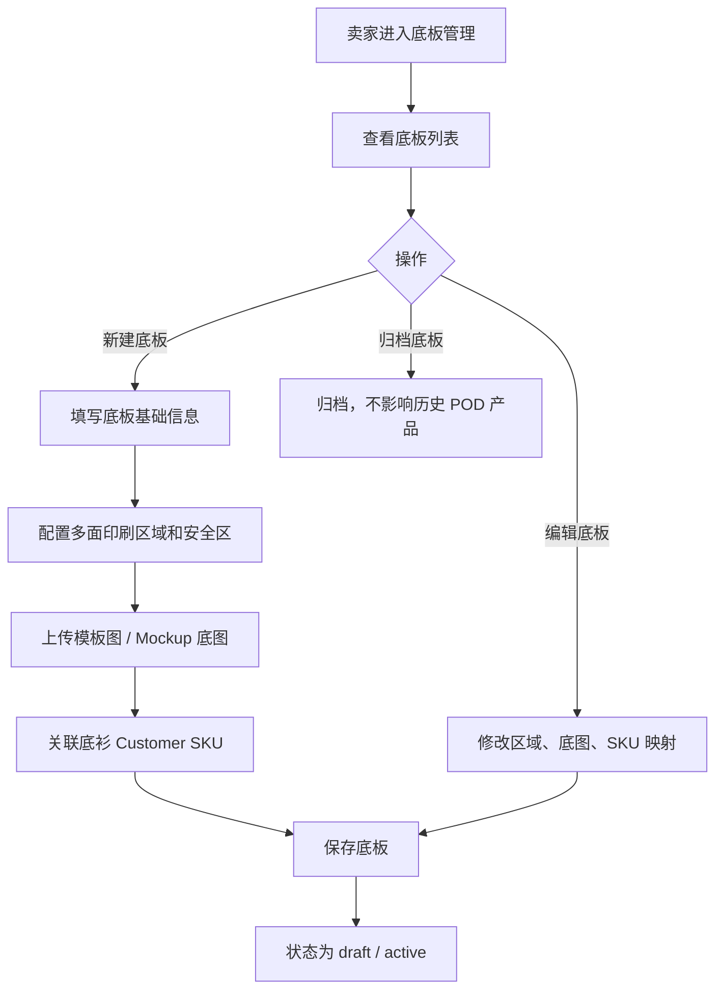
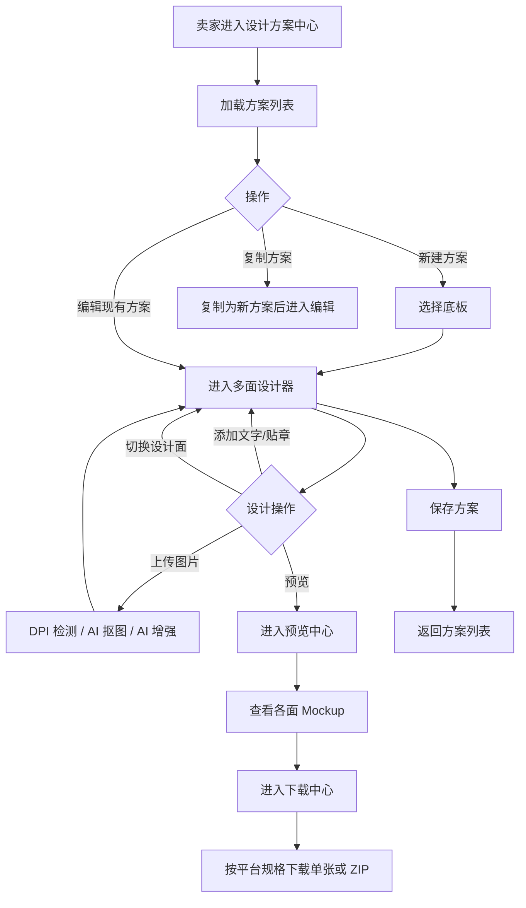
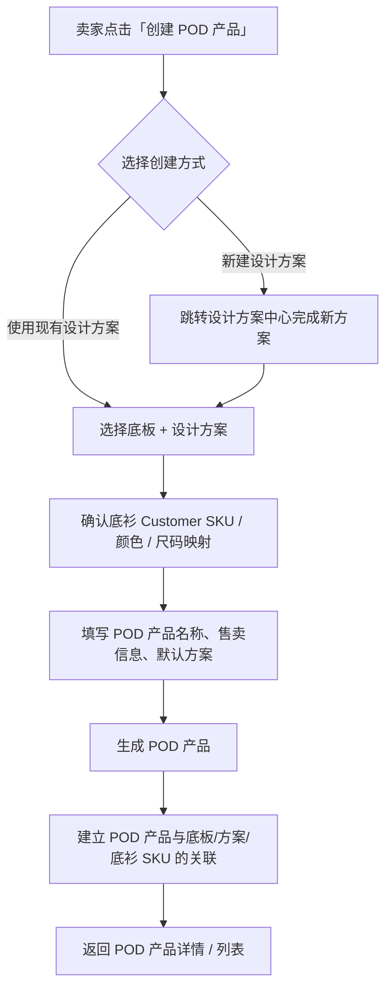
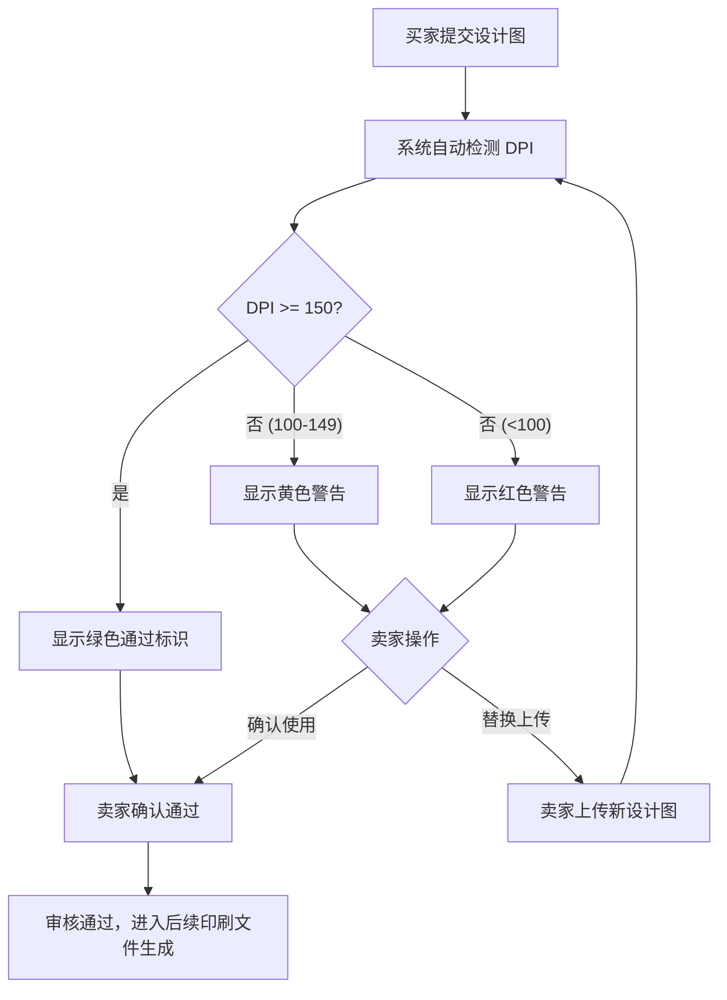
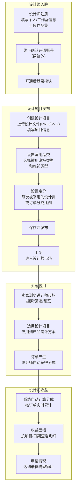
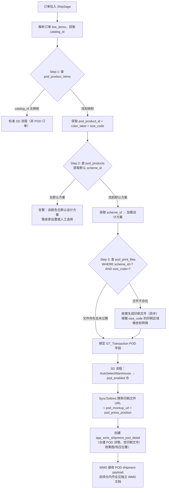
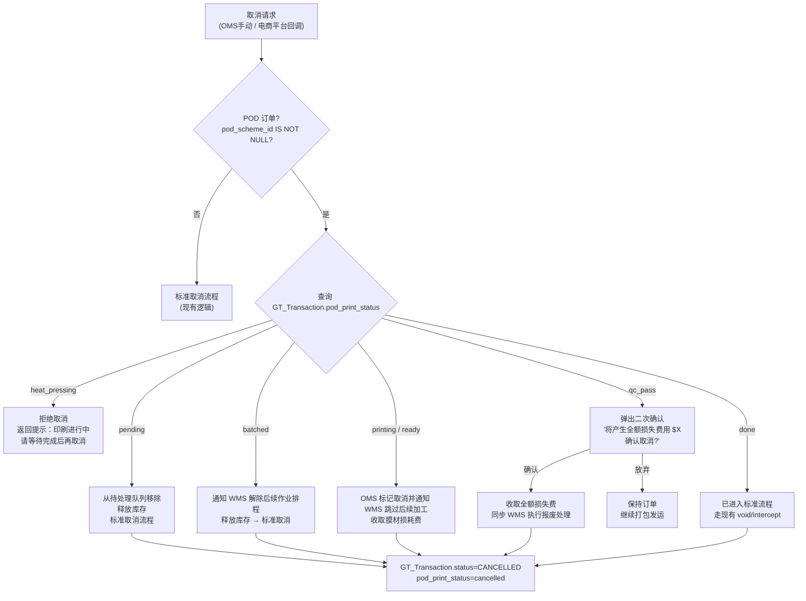
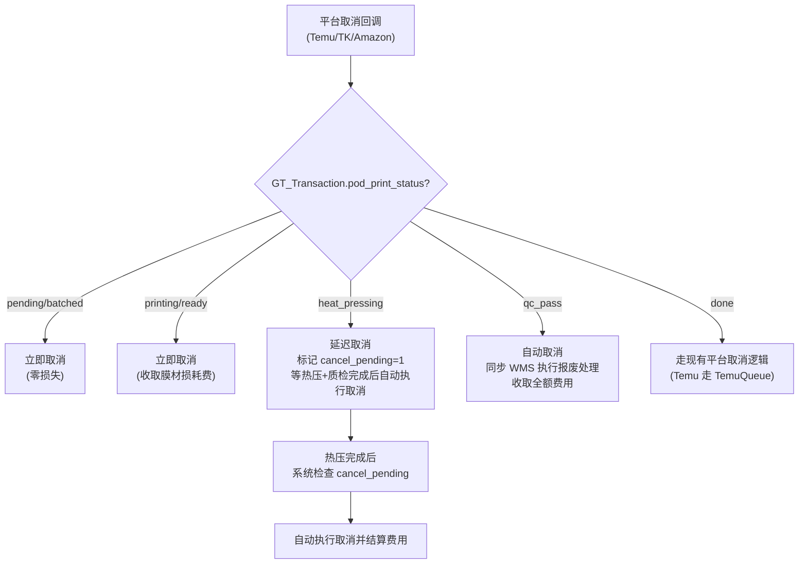

# PRD: ShipSage POD 卖家设计器 / ShipSage POD Seller Design Studio

> | Field / 字段 | Value / 值 |
> |---|---|
> | **Status / 状态** | Draft / 草稿 |
> | **Owner / 负责人** | Dennis |
> | **Contributors / 参与者** | 前端、后端、Billing |
> | **Approved By / 审批人** | — |
> | **Approved Date / 审批日期** | — |
> | **Decision / 审批决定** | Pending / 待审批 |
> | **Created / 创建日期** | 2026-03-24 |
> | **Last Updated / 最后更新** | 2026-04-01 |
> | **Version / 版本** | V6.4 |
> | **基于版本** | V4.0（PRD-v4-final）|

---

## History / 变更历史

| Version | Author | Date | Comment / 说明 |
|---------|--------|------|----------------|
| V1.0–V4.0 | Dennis | 2026-03-17~19 | 见 PRD-v4-final.md |
| **V5.0** | Dennis | 2026-03-24 | **重大调整**：(1) 设计器从独立 Shopify App 改为内嵌 ShipSage OMS 产品模块；(2) 用户从消费者改为卖家；(3) 支持多印刷区域（正面/背面/左袖/右袖）；(4) 一次设计自动适配所有尺寸；(5) 支持高清效果图下载（适配 TEMU/TK/Amazon 等平台规格）；(6) 加工费按尺寸计价；(7) 一个 SKU 可绑定多个设计方案；(8) 消费者端定制移至第三期；(9) **印刷工艺从 DTG 改为 DTF**，完整设计仓库 DTF 操作流程（拼版→膜打印→撒粉固化→热压转印→揭膜→质检） |
| **V5.4** | Dennis | 2026-03-27 | **WMS 仓库流程重大调整**：(1) SyncToWms 新增 `pod_mockup_url`（衣服+设计效果图，用于仓库热压位置参考）和 `pod_press_position`（热压位置参数）下发仓库；(2) **仓库 DTF 流程重构为基于 Tote 拣货策略**：印刷膜任务从 `shipment.status=CREATED` 时按单创建（`pod_film_task`，与 batch_picking 无关，适配 <20 件直接走 pick run 和 ≥20 件走 batch 两种路径）；(3) 新增"**膜预拣**"步骤（Film Pre-Pick）：Tote Pick Run 分配 Bin→Shipment 映射后，操作员扫描膜条码，系统显示对应 Bin 编号和效果图，操作员将膜预先放入 Bin；(4) 衣物拣货时膜已在 Bin 中，实现衣服与膜的自动匹配，热压时直接取 Bin 操作；(5) 新增 `app_wms_pod_film_task` 和 `app_wms_shipment_pod_detail` 两张表 |
| **V5.5** | Dennis | 2026-03-30 | **设计器增强 + 仓库流程优化**：(1) **设计器新增 AI 抠图**：卖家可一键去除图片背景，提取主体元素（基于 rembg 开源方案）；(2) **3D 效果图预览（P1）**：基于 Three.js + GLTF 模型实现 T 恤 360° 旋转预览；(3) **图片 DPI 分级检测 + AI 超分增强**：上传图片自动检测有效 DPI，分三档提示（优秀/一般/较差），不足时提供一键 AI 增强（Real-ESRGAN），不硬拦截；(4) **贴章/素材库**：新增官方预置素材库（Admin 维护）+ 卖家私有素材，设计器工具栏新增贴章入口；(5) **膜打印任务改为 Pick Run 后生成**：膜任务不再在 shipment CREATED 时按单创建，改为 Tote Pick Run 创建后基于 pick_run 中的 shipments 批量生成打印批次（`pod_film_batch`），新增独立裁切步骤和完成通知机制；(6) **Step 3 关联同款产品优化**：新增手动添加/删除产品 UI 控件 |
| **V5.6** | Dennis | 2026-03-31 | **仓库流程修复 + 文档澄清**：(1) T7 匹配流程移除 V5.4 旧逻辑（按单创建 film_task），改为引用 T8 处理；(2) **film_batch 生成时机明确**：Pick Run 创建后 2 分钟合并窗口，支持多 Pick Run 合并减少膜材浪费；(3) **Step 3 拼版修正为 Maintop 手动**：MVP 阶段 ShipSage 只提供独立 PNG，由操作员在 Maintop 中手动拼版；(4) `nesting_file_url` 在 MVP 为空；(5) 膜利用率在 MVP 由操作员手动录入；(6) 热压队列任务生成触发机制补充（衣物拣货完成后自动推入热压队列） |
| **V5.7** | Dennis | 2026-03-31 | **新增设计师平台（T11）**：(1) 独立子系统「设计师平台 / Designer Platform」，供第三方设计师注册登录、发布设计项目、管理项目状态；(2) 设计师收益中心：收益概览+明细+提现管理，支持固定费用和订单分成两种模式；(3) Admin 审核管理：设计师入驻审核+项目上架审核+分成规则配置；(4) 卖家端集成「设计师市场」入口，卖家可在设计器中浏览和选用设计师作品；(5) 新增 5 张数据表（pod_designers / pod_design_projects / pod_design_adoptions / pod_designer_revenues / pod_designer_withdrawals） |
| **V5.8** | Dennis | 2026-04-01 | **文档一致性修复**：(1) T10 取消流程从旧 `pod_print_jobs/pod_print_batches` 口径统一到现行 `app_wms_pod_film_batch/app_wms_pod_film_task/app_wms_shipment_pod_detail`；(2) T8 验收标准改为与 MVP 的 Maintop 手动拼版方案一致；(3) 技术能力矩阵、数据表数量、时间线和版本记录同步修正；(4) 明确 Billing 范围仅包含取消损耗费和设计师收益结算，不包含已移除的 POD 正向加工费自动计费 |
| **V6.0** | Dennis | 2026-04-01 | **架构重构 — 底板管理 + 创建POD产品 + 买家设计审核**：(1) **底板管理（Base Template）替代印刷配置模板（Print Profile）**：底板管理从 Admin 移至 OMS 卖家侧，卖家可创建/管理底板、关联底衫 SKU、上传模板图和 Mockup 底图、管理变体关联；(2) **设计方案独立管理**：设计方案不再直接生成 SKU，可被多个 POD 产品引用；(3) **创建 POD 产品双入口**：卖家可「使用现有设计方案」或「新建设计方案」，选底板→确认底衫 SKU→生成售卖 SKU；(4) **产品组概念废弃**：`pod_product_groups` / `pod_product_group_items` 不再使用，改为 POD 产品直接关联底板和设计方案；(5) **新增 T12 买家设计审核**：卖家查看买家提交的设计图、DPI 检测、替换上传；(6) **新增 T13 设计师管理**：Admin 端设计师 CRUD + 费用结算（替代 T11 中设计师平台独立注册模式，改为 Admin 后台按品类上传独立图案）；(7) 设计师从独立平台注册改为 Admin 后台管理模式 |
| **V6.1** | Dennis | 2026-04-01 | **Part A 重构 + 设计师模块收敛**：(1) Part A 重新整理为 **T1 底板管理 → T2 设计方案中心 → T3 创建 POD 产品 → T4 买家设计审核**；(2) 多面设计器、方案管理、预览下载中心统一归入 T2；(3) 删除 Part F / T13 设计师管理，保留 T11 设计师平台；(4) 总览、流程图、Scope、验收标准、时间线同步按新任务结构调整 |
| **V6.2** | Dennis | 2026-04-01 | **主 PRD 收口为 OMS/Designer 边界文档**：(1) 保留 T6/T7 中印刷文件生成、订单匹配与 SyncToWms 下发字段；(2) 将 T8 WMS POD DTF 作业详细设计从主 PRD 移出，改由独立 WMS 文档承接；(3) T10 仅保留 OMS/Billing 侧取消规则与交接边界；(4) 菜单、初始化、风险、Scope、技术矩阵、时间线删除主 PRD 不再承载的 WMS 细节 |
| **V6.3** | Dennis | 2026-04-01 | **底衫主数据与设计师模块口径调整**：(1) 删除菜单中的废弃项；(2) 设计师平台改为 ShipSage ADMIN 内模块，不再表述为独立应用；(3) 设计师审核改为线下处理，移除系统审核页面/API/US；(4) 明确底衫 SKU 创建基于现有产品功能扩展，新增 `POD底衫` 分类，并以 `company_id in (卖家自己, 2)` 作为底板关联候选范围 |
| **V6.4** | Dennis | 2026-04-01 | **底板主数据补充**：(1) 底板管理新增颜色表与尺码表，作为关联 SKU 时颜色/尺码的统一来源；(2) 两张表暂不提供页面维护能力，由数据库直接维护；(3) T1 规则、数据库设计与技术矩阵同步更新 |

---

## I. Glossary / 术语说明

| Term / 术语 | Definition / 定义 |
|---|---|
| POD | 按需印刷（Print-on-Demand），收到订单后才生产 |
| Design Studio / 设计器 | ShipSage OMS 中的独立页面，供卖家创建和管理 POD 产品设计方案 |
| DPI | Dots Per Inch（每英寸点数），衡量图片分辨率。屏幕显示通常 72dpi，印刷要求 ≥ 300dpi。上传图片 DPI 不足会导致印刷模糊 |
| Base Template / 底板 | 底板定义底衫的印刷区域、支持面、Mockup 底图等参数。底板管理在 OMS 卖家侧，卖家可自行创建和管理底板，关联底衫 SKU |
| POD Product / POD 产品 | 卖家通过「创建 POD 产品」流程，选择底板 + 关联设计方案 + 确认底衫 SKU 生成的售卖产品。一个 POD 产品引用一个底板和一个设计方案 |
| Base Garment / 底衫 | POD 设计的空白品载体，来源于产品系统中的 `POD底衫` 分类；候选范围包含 ShipSage 公共底衫（`company_id=2`）和卖家自有底衫（`company_id=当前卖家`） |
| Relative Coordinate / 相对坐标 | 设计元素位置以印刷区域百分比记录（如 x:50%, y:30%），实现一次设计多尺寸适配 |
| Mockup / 效果图 | 将设计叠加到底衫照片上的预览图，卖家可下载用于电商平台上架 |
| DTF | Direct to Film，数码转印工艺。先将图案打印到 PET 转印膜上，撒热熔胶粉并固化，再通过热压机将图案转印到成衣上 |
| PET Film / 转印膜 | DTF 印刷使用的聚酯薄膜介质，图案先打印到膜上，再热压转印到衣物 |
| Nesting / 拼版 | 将多个订单的图案排布在同一张转印膜上打印，提高膜材利用率（从 35-50% 提升到 70-85%） |
| RIP | Raster Image Processor，光栅图像处理软件。在 DTF 流程中负责色彩分离（RGB→CMYK+W）、白墨通道生成、墨量控制、拼版优化和打印机驱动 |
| Hot Folder | RIP 软件监听的本地目录，放入文件后自动触发 RIP 处理和打印，是 ShipSage 系统与 RIP 的主要集成方式 |
| ICC Profile | 国际色彩联盟标准色彩描述文件，确保设计文件的颜色在特定打印机+墨水+介质组合下准确还原 |
| AJS | Automatic Job Sorter，Cadlink 的自动作业分拣模块，可按规则自动分配打印参数和拼版 |
| Fabric.js | 主流 HTML5 Canvas 设计库，支持对象模型和 SVG 导出 |
| AI Background Removal / AI 抠图 | 基于 AI 模型（rembg / Real-ESRGAN）自动去除图片背景，提取主体元素为透明 PNG。卖家在设计器中上传图片后可一键触发 |
| AI Super Resolution / AI 超分增强 | 基于 Real-ESRGAN 等 AI 模型将低分辨率图片放大 2x-4x，提升有效 DPI 以满足印刷要求。上传图片 DPI 不足时自动提示，卖家可一键增强 |
| Sticker Library / 贴章素材库 | 系统预置的装饰素材图片库，分为官方素材库（Admin 维护，全客户共享）和卖家私有素材（卖家上传，仅自己可见）。卖家可直接拖拽到设计画布使用 |

---

## II. Business Background / 业务背景

### 2.1 Background / 背景

ShipSage 已在美国建立多个自营仓，具备完整的仓配一体化能力。现计划在 ShipSage OMS 中新增 POD Design Studio（独立页面），让卖家（ShipSage 的 company 客户）在系统内完成 POD 产品设计，生成高清效果图用于各电商平台上架，并在订单进入时自动匹配印刷文件，在 ShipSage 仓库内完成 DTF 印刷和履约发货。

**核心业务目标：卖家在 ShipSage 完成设计 → 在 ShipSage 仓库完成履约，形成设计-生产-发货闭环。**

**分期规划：**

| Phase | 内容 | 说明 |
|-------|------|------|
| **Phase 1（本期）** | ShipSage 卖家端 POD 闭环 | 卖家完成 POD 底衫 SKU 准备、底板管理、设计方案、POD 产品创建，并实现订单自动匹配印刷 |
| **Phase 1.5（本期）** | **设计师平台模块 / Designer Platform Module** | **作为 ShipSage ADMIN 内 POD 模块的一部分，承载设计项目发布、收益查看、市场配置；卖家可在设计器中选用设计师作品** |
| Phase 2 | Shopify App + Embed Widget | 将设计器以 Shopify App 和 JS Snippet 形式输出 |
| Phase 3 | 消费者端定制 | 消费者在 Shopify 店铺/网站上实时个性化定制 |

### 2.2 服装定制印刷工艺选型

> 完整工艺对比见独立文档：[附录-服装印刷工艺全景.md](附录-服装印刷工艺全景.md)
>
> **MVP 选型结论：DTF（Direct to Film）**。1件起生产、全品类兼容（棉/涤/混纺/深浅色）、单件耗材 $1.35-$2.60、设备入门 $3K-$8K，是 POD 场景性价比最优解。详见 §4.2 方案选择。

---

### 2.3 Business Goals / 业务目标

| 目标 | 说明 |
|------|------|
| **设计闭环** | 卖家在 ShipSage 内完成 POD 产品设计，生成满足各电商平台规格的高清效果图，无需使用第三方设计工具 |
| **履约闭环** | 订单进入 ShipSage 后自动匹配印刷文件，在仓库完成 DTF 印刷和发货，订单印刷到出库 ≤ 24h |
| **自动化** | POD 订单自动匹配设计方案+印刷文件，成功率 ≥ 95%（前提：卖家已完成产品关联和设计） |

---

## III. Users & Scenarios / 用户与场景

### 3.1 User Roles / 用户角色

| Role / 角色 | Description | Pain Points / 痛点 | Needs / 诉求 |
|---|---|---|---|
| 卖家 / Seller | ShipSage 的 company 客户，在 TEMU/TK/Amazon 等平台销售 POD 商品 | 设计工具与仓储系统割裂；效果图需手动制作；不同尺寸要重复设计；缺少优质设计资源；买家提交的设计图质量参差不齐 | 一次设计自动适配所有尺寸；一键下载合规效果图；订单自动匹配印刷；可直接选用专业设计师作品；可审核买家设计图 DPI 并替换 |
| ShipSage 运营 Admin | 管理设计师平台市场配置、贴章素材 | 配置分散，缺少统一运营入口 | 设计师市场配置、素材库管理 |
| **设计师 / Designer** | **在设计师平台注册的第三方图案创作者，通过发布设计项目为卖家提供专业设计** | **缺少专注 POD 领域的发布渠道；设计收益难以追踪；无法了解设计被使用的情况** | **便捷的设计发布流程；清晰的项目管理面板；透明的收益统计与提现** |
| 仓库操作员 / Warehouse Operator | 执行 DTF 印刷作业 | 印刷文件与订单匹配靠人工 | 系统自动下发印刷文件，扫码匹配订单 |

### 3.2 Core Scenarios / 核心场景

**场景一：卖家准备 POD 商品并上架**
- Trigger：卖家计划销售 POD 商品，需要在现有产品系统中创建或维护 `POD底衫` 分类商品
- Flow：基于现有产品功能维护可用底衫 SKU（来源范围为 `company_id=当前卖家` 和 `company_id=2`）→ 进入底板管理关联候选底衫 SKU → 进入设计方案中心完成多面设计和预览下载 → 创建 POD 产品 → 使用生成素材在电商平台上架
- Result：卖家完成从 POD 底衫准备、设计到 POD 商品创建的完整准备流程，商品可对外售卖

**场景二：POD 订单自动匹配并完成仓库履约**
- Trigger：消费者在电商平台下单，订单拉入 ShipSage
- Flow：系统识别订单 SKU → 匹配 POD 产品对应的设计方案和印刷文件 → 创建 WMS 印刷工单 → 仓库完成 DTF 印刷、质检和发货
- Result：订单在 ShipSage 内完成从匹配到履约出库的自动化闭环

**场景三：买家提交定制设计图并由卖家审核**
- Trigger：买家在电商平台提交定制设计图，卖家在 OMS 收到审核通知
- Flow：查看买家上传的设计图 → 系统自动检测 DPI → DPI 合格则直接确认 → DPI 不合格则显示警告，卖家可选择替换上传高清版本 → 确认通过
- Result：买家设计图通过审核，系统使用该设计图生成印刷文件

**场景四：设计师发布项目、卖家选用作品并完成收益结算**
- Trigger：设计师在设计师平台发布设计项目，卖家在设计器中浏览设计师市场
- Flow：设计师上传设计文件并发布项目 → 项目上架到设计师市场 → 卖家浏览/搜索并选用作品到当前设计方案 → 订单完成后系统自动计算设计师收益 → 设计师查看收益并申请提现
- Result：设计师作品被卖家采用形成交易闭环，平台完成项目发布、卖家选用和收益结算

### 3.3 端到端全流程图（从 POD 底衫 SKU 准备到印刷出库）

以下流程图覆盖 POD 业务从卖家准备 POD 底衫 SKU 到订单发货的**完整链路**，标注了每个环节的操作角色、涉及系统和对应 Task 编号。

```mermaid
flowchart TD
    subgraph Phase1 ["阶段一：POD 底衫 SKU 准备 + 底板配置"]
        A0["<b>卖家创建/维护 POD 底衫 Customer SKU</b><br>沿用现有产品功能并新增 `POD底衫` 分类<br>候选范围=卖家自有底衫 + ShipSage 公共底衫(company_id=2)<br><i>角色: Seller</i><br><i>系统: ShipSage 产品能力扩展</i>"]
        A1["<b>卖家管理底板</b><br>创建/编辑底板 → 配置支持面和尺寸印刷区域<br>上传模板图/Mockup → 关联底衫 Customer SKU<br><i>角色: Seller</i><br><i>Task: T1</i>"]
        A2["<b>Admin 配置试点仓库</b><br>标记 pod_enabled=1 / DTF 设备信息<br><i>角色: ShipSage Admin</i><br><i>Task: T8</i>"]
    end

    subgraph Phase2 ["阶段二：卖家管理设计方案"]
        B1["<b>进入设计方案中心</b><br>查看方案列表 / 新建设计方案 / 编辑已有方案<br><i>角色: Seller</i><br><i>Task: T2</i>"]
        B2["<b>多面设计器</b><br>正面/背面/左袖/右袖独立编辑<br>上传图片 / 文字 / 贴章 / AI 抠图 / DPI 检测<br><i>Task: T2</i>"]
        B3["<b>预览下载中心</b><br>生成 Mockup 预览<br>下载 TEMU/TK/Amazon/通用高清图片<br><i>Task: T2</i>"]
    end

    subgraph Phase3 ["阶段三：创建 POD 产品"]
        C1["<b>点击创建 POD 产品</b><br>选择创建方式：使用现有设计方案 / 新建设计方案<br><i>角色: Seller</i><br><i>Task: T3</i>"]
        C2["<b>选择底板 + 设计方案</b><br>确认底板、设计方案和印刷面<br><i>Task: T3</i>"]
        C3["<b>确认底衫 SKU / POD 售卖 SKU</b><br>为底板关联的底衫 SKU 生成 POD 售卖产品<br><i>Task: T3</i>"]
        C4["<b>卖家上架到电商平台</b><br>使用 POD 产品素材在 TEMU/TK/Amazon 上架<br><i>角色: Seller（系统外）</i>"]
    end

    subgraph Phase3B ["阶段三B：买家设计审核（可选）"]
        C5["<b>买家上传定制设计图</b><br>订单进入待审核状态<br><i>角色: Buyer / Seller</i><br><i>Task: T4</i>"]
        C6["<b>卖家审核设计图</b><br>DPI 检测 → 确认通过 / 替换上传<br><i>Task: T4</i>"]
    end

    subgraph Phase4 ["阶段四：订单匹配（每笔订单自动）"]
        D1["<b>消费者下单</b><br>在 TEMU/TK/Amazon 等平台购买 POD 产品<br><i>角色: Consumer（系统外）</i>"]
        D2["<b>订单拉入 ShipSage</b><br>通过平台 API/CSV 导入 OMS<br><i>系统: ShipSage OMS</i>"]
        D3["<b>自动匹配设计方案</b><br>SKU → 设计方案 / 买家审核图 → 印刷文件<br><i>系统自动</i><br><i>Task: T7</i>"]
        D4["<b>SD 路由 + SyncToWms</b><br>AutoSelectWarehouse → pod_enabled 仓<br>下发印刷文件 + mockup + 热压位置<br><i>Task: T7</i>"]
    end

    subgraph Phase5 ["阶段五：仓库 DTF 印刷履约"]
        E1["<b>Step 1: Tote Pick Run 创建</b><br>扫 Cart 条码 + 选 Bin 数<br>系统分配 Bin ↔ Shipment 映射<br><i>角色: 拣货员</i><br><i>Task: T8</i>"]
        E2["<b>Step 2: 生成膜打印批次</b><br>Pick Run 创建后进入合并窗口<br>批量生成 pod_film_batch + pod_film_task<br><i>系统自动</i><br><i>Task: T8</i>"]
        E3["<b>Step 3: 膜打印</b><br>下载独立 PNG ZIP → 导入 Maintop 手动拼版<br>打印到 PET 转印膜 → 撒粉 → 固化<br><i>角色: 膜打印操作员</i><br><i>Task: T8</i>"]
        E4["<b>Step 4: 裁切 + 贴膜条码</b><br>裁切各图案 → 贴膜条码 → 通知膜预拣<br><i>角色: 膜打印操作员</i><br><i>Task: T8</i>"]
        E5["<b>Step 5: 膜预拣</b><br>扫膜条码 → 显示 Bin 编号 + 效果图 + 热压位置<br>将膜放入对应 Bin<br><i>角色: 拣货员</i><br><i>Task: T8</i>"]
        E6["<b>Step 6: 衣物拣货</b><br>拣空白品 → 放入对应 Bin → 衣物与膜自动匹配<br><i>角色: 拣货员</i><br><i>Task: T8</i>"]
        E7["<b>Step 7: 热压转印</b><br>参考效果图定位 → 多面逐面热压<br><i>角色: 热压操作员</i><br><i>Task: T8</i>"]
        E8["<b>Step 8: 质检</b><br>Pass → 打包 / Fail → 单面重印(≤3次)<br><i>角色: 热压操作员</i><br><i>Task: T8</i>"]
    end

    subgraph Phase6 ["阶段六：发货 + 物流回传"]
        F1["<b>标准打包→贴标→发运</b><br>复用现有 WMS Pack→Ship 流程<br><i>系统: ShipSage WMS</i>"]
        F2["<b>物流回传</b><br>运单号回传电商平台<br>消费者收到发货通知<br><i>系统: ShipSage OMS</i>"]
    end

    A0 --> A1
    A1 --> B1
    A2 --> E2
    B1 --> B2
    B2 --> B3
    B2 --> C1
    B3 --> C4
    C1 --> C2
    C2 --> C3
    C3 --> C4
    C4 --> D1
    C5 --> C6
    C6 -.-> D3
    D1 --> D2
    D2 --> D3
    D3 --> D4
    D4 --> E1
    E1 --> E2
    E2 --> E3
    E3 --> E4
    E4 --> E5
    E5 --> E6
    E6 --> E7
    E7 --> E8
    E8 -- "Pass" --> F1
    E8 -- "Fail & count<3" --> E3
    F1 --> F2
```



**流程概要（文字版）：**

| 阶段 | 环节 | 角色 | 系统模块 | Task |
|------|------|------|----------|------|
| 一、POD 底衫 SKU 与底板准备 | 卖家基于现有产品功能创建 `POD底衫` 分类商品，候选范围包含卖家自有底衫与公共底衫（company_id=2），再进入底板管理完成关联；Admin 配置试点仓 | 卖家 + Admin | 产品系统扩展 / OMS / Admin | 产品能力扩展 / T1 / T8 |
| 二、设计方案中心 | 设计方案列表 + 多面设计器 + 预览下载中心；保存后异步预生成常用印刷原稿 | 卖家 + 系统 | OMS → POD Design Studio / 后端异步 | T2 / T6 |
| 三、创建 POD 产品 | 选择创建方式 → 选底板和方案 → 确认底衫 SKU / POD 售卖 SKU | 卖家 | OMS → POD 产品管理 | T3 |
| 三B、买家设计审核 | 买家上传设计图 → DPI 检测 → 卖家确认/替换 | 卖家 | OMS | T4 |
| 四、订单匹配 | 订单拉入 → SKU 匹配 → 设计方案/买家审核图 → 印刷文件 | 系统自动 | OMS/SD | T7 |
| 五、仓库印刷 | Pick Run 创建 → 生成膜打印批次 → 膜打印 → 裁切 → 膜预拣 → 衣物拣货 → 热压 → 质检 | 操作员 | WMS | T8 |
| 六、发货物流 | 打包发运 → 物流回传 | 系统 + 操作员 | WMS/OMS | — |
| 逆向、订单取消 | 按印刷状态分段取消 → 废料管理 | OMS 操作员 / 系统 | OMS/WMS | T10 |

---

## IV. Design Approach / 设计思路

### 4.1 Core Design Principles / 核心设计理念

1. **一次设计，全尺寸适配**：设计器使用相对坐标系，卖家在一个画布上设计一次，系统自动为 S/M/L/XL/2XL 等所有尺寸生成印刷文件
2. **多区域独立编辑**：正面、背面、左袖、右袖各为独立画布，卖家可按需设计任意面
3. **效果图即上架图**：生成的 Mockup 效果图直接满足 TEMU/TK/Amazon 等平台的产品图规格，无需二次加工
4. **最小化侵入现有系统**：设计器作为 OMS 独立页面（POD Design Studio），复用现有 GT_Catalog 产品体系
5. **设计方案与 POD 产品解耦复用**：设计方案可被多个 POD 产品复用，卖家可按产品选择默认方案并灵活切换
6. ~~一口价计费~~（此功能已从本PRD中移除，不在当前实现范围内）

### 4.2 Solution Comparison / 方案选择

#### 一次设计多尺寸适配方案

| Option | Pros | Cons | Decision |
|---|---|---|---|
| **相对坐标系（百分比定位）** | 一次设计自动适配所有尺寸；用户体验最佳 | 需在渲染印刷文件时做坐标转换 | ✅ 采用 |
| 绝对坐标 + 手动逐尺寸调整 | 实现简单 | 用户需为每个尺寸重复设计，体验差 | ❌ 放弃 |
| 绝对坐标 + 自动缩放 | 实现中等 | 不同尺寸比例不同时可能变形 | ❌ 放弃 |

**相对坐标系原理：**
```
设计器画布（统一基准尺寸，如 M 码）：
  ┌─────────────────────────┐
  │ 印刷区域 28cm × 32cm     │
  │  ┌───────────────────┐  │
  │  │ Logo: x=50% y=20% │  │  ← 位置以百分比记录
  │  │ w=40% h=15%        │  │  ← 尺寸以百分比记录
  │  └───────────────────┘  │
  └─────────────────────────┘

渲染 S 码印刷文件时（26cm × 30cm）：
  Logo 实际位置：x=13cm y=6cm, w=10.4cm h=4.5cm

渲染 XL 码印刷文件时（30cm × 34cm）：
  Logo 实际位置：x=15cm y=6.8cm, w=12cm h=5.1cm
```

#### 印刷工艺选择

| Option | Pros | Cons | Decision |
|---|---|---|---|
| **DTF（Direct to Film）** | 设备成本低（入门 $3k-$8k）；适用品类广（纯棉/涤纶/混纺）；支持拼版批量印刷降低成本；深色件表现好；单件耗材 $1.35-$2.60 | 略有膜感；需热压设备和操作空间；工艺步骤较多（打印→撒粉→固化→热压→揭膜） | ✅ 采用 |
| DTG（Direct to Garment） | 手感更自然（浅色纯棉场景）；工艺步骤少 | 设备贵（$15k-$20k 入门）；深色件成本高（$3.40-$6.80/件）；不支持涤纶；喷头易堵、维护复杂 | ❌ 后续迭代补充 |

#### 设计器集成方式

| Option | Pros | Cons | Decision |
|---|---|---|---|
| **OMS 独立页面（POD Design Studio）** | 设计器有完整页面空间；不影响产品详情页性能；与竞品体验一致 | 需新增页面和左侧导航入口 | ✅ 采用 |
| 嵌入产品详情页 Tab | 无需新增导航入口，与产品管理界面整合 | 页面空间受限；Canvas 组件影响产品详情页性能；与产品页加载耦合 | ❌ 放弃 |

#### 前端设计器引擎

| Option | Pros | Cons | Decision |
|---|---|---|---|
| **Fabric.js** | SVG 导出支持（印刷必须）；对象模型成熟；POD 案例最多 | 大量对象时性能弱于 Konva | ✅ 采用 |
| Konva.js | 高性能 | 不支持 SVG 导出（印刷致命缺陷）| ❌ 放弃 |

### 4.3 Key Design Decisions / 关键设计决策

| # | Decision / 决策 | Rationale / 理由 |
|---|---|---|
| 1 | 设计器作为 OMS 独立页面 `pod/design-studio.vue`，左侧导航新增入口 | 设计器有完整页面空间；不影响产品详情页 |
| 2 | 设计元素使用相对坐标（百分比）存储 | 一次设计自动适配所有尺寸 |
| 3 | 每个印刷面（Front/Back/L-Sleeve/R-Sleeve）独立 Canvas | 各面独立编辑，互不干扰 |
| 5 | 设计方案存入 `pod_design_schemes` 表，通过中间表与 GT_Catalog 关联 | 一个 SKU 可绑定多个设计方案 |
| 6 | 效果图生成多种平台规格（TEMU/TK/Amazon） | 卖家可直接下载用于上架 |
| 7 | 印刷文件在订单匹配时按目标尺寸动态生成 | 避免提前为所有尺寸生成大量文件 |
| 8 | ~~加工费采用一口价~~（已移除，不在实现范围） | ~~简化计费模型~~ |
| 9 | 印刷工艺采用 DTF（Direct to Film），非 DTG | 成本低、品类广、支持拼版；DTG 作为后续高端补充 |
| 11 | 多订单图案自动拼版到同一张转印膜 | 膜材利用率从 35-50% 提升到 70-85%，显著降低耗材成本 |
| 12 | RIP 分阶段策略：MVP 用设备自带 Maintop（免费），P1 升级 Cadlink v12（$399） | MVP 零成本启动，规模化后升级全自动化 |
| 13 | 印刷原稿保持 RGB 色彩空间 + 透明背景，RGB→CMYK 和白墨通道由 RIP 完成 | RIP 配合 ICC Profile 做色彩转换更准确；透明背景供 RIP 自动确定白墨范围 |
| 14 | **MVP 阶段使用 RIP（Maintop）自带拼版功能**：ShipSage 只提供各订单独立 300dpi PNG，操作员在 Maintop 中使用内置拼版手动排布后打印；ShipSage 自研拼版为后续优化方案（减少操作员手动排版工作量） | MVP 零开发成本启动；Maintop 具备基本拼版能力；自研拼版可在后期按需开发；升级 Cadlink 后全自动化 |
| 15 | 设计器提供 AI 抠图功能，卖家上传图片后可一键去除背景 | 降低素材准备门槛，卖家无需使用 PS 等专业工具；基于 rembg 开源方案零成本 |
| 16 | 图片上传采用 DPI 分级检测 + AI 超分增强，不硬拦截 | 兼容卖家各种素材质量；DPI 不足时提供一键 AI 增强（Real-ESRGAN），由卖家决定是否使用 |
| 17 | 设计器提供贴章/素材库（官方 + 卖家私有），设计器工具栏新增贴章入口 | 降低设计门槛，提供开箱即用的装饰元素；官方素材需确保版权合规 |
| 18 | 3D 效果图预览（P1）基于 Three.js + GLTF 模型 | 提升设计器体验，卖家可 360° 预览设计效果；MVP 先用 2D 正面/背面切换 |

---

## V. Menu Configuration / 菜单配置

| Application | Menu Path | URL | Type | Permission |
|---|---|---|---|---|
| ShipSage OMS | **POD / 设计方案中心 (Design Schemes)** | /oms/pod/design-schemes | menu | Seller (company) |
| ShipSage OMS | **POD / 底板管理 (Base Templates)** | /oms/pod/base-templates | menu | Seller (company) |
| ShipSage OMS | **POD / POD 产品 (POD Products)** | /oms/pod/products | menu | Seller (company) |
| ShipSage OMS | **POD / 买家设计审核 (Buyer Design Reviews)** | /oms/pod/buyer-design-reviews | menu | Seller (company) |
| ShipSage ADMIN | **POD / Sticker Library** | /admin/pod/sticker-library | menu | Admin |
| ShipSage ADMIN | **POD / Designer Platform / Dashboard** | /admin/pod/designer-platform/dashboard | menu | Designer |
| ShipSage ADMIN | **POD / Designer Platform / My Projects** | /admin/pod/designer-platform/projects | menu | Designer |
| ShipSage ADMIN | POD / Designer Platform / Publish New | /admin/pod/designer-platform/projects/create | page | Designer |
| ShipSage ADMIN | POD / Designer Platform / Project Detail | /admin/pod/designer-platform/projects/{id} | page | Designer |
| ShipSage ADMIN | **POD / Designer Platform / Revenue** | /admin/pod/designer-platform/revenue | menu | Designer |
| ShipSage ADMIN | **POD / Designer Platform / Profile** | /admin/pod/designer-platform/profile | menu | Designer |
| ShipSage ADMIN | **POD / Designer Market Config（设计师市场配置）** | /admin/pod/designer-market | menu | Admin |

---

## VI. Initialization / 初始化配置

| Application | Content / 初始化内容 | Comment / 备注 |
|---|---|---|
| ShipSage ADMIN | 为每种底衫拍摄/上传各面产品照片（正面照/背面照/侧面照）用于 Mockup 生成 | 白色背景，满足电商平台规格 |
| 后端 | 开发 ShipSage 基础拼版模块（Sharp.js 行列矩阵排布 + 裁切线 + 标记） | 预计 2-3 天开发量 |
| 后端（P1） | 月产量 >300 件后，升级安装 Cadlink Digital Factory v12 + Hot Folder + AJS 规则 | 一次买断 $399-$449 |
| 后端 | S3 Bucket 配置（Mockup 底图、设计素材、效果图、印刷文件）| CDN + 私有桶分离 |

---

## VII. Risk / 风险评估

| Application | Module | Priority | Risk / 风险 | Solution / 应对 |
|---|---|---|---|---|
| Design Studio | 多尺寸适配 | P1 | 相对坐标转换后印刷位置偏移，不同尺寸效果不一致 | 服务端用 headless Fabric.js 渲染同一 JSON，各尺寸先打样验证；上线前用 S/M/XL 三个尺寸做印刷对比测试 |
| Design Studio | 效果图质量 | P1 | Mockup 效果图与实际印刷效果色差大 | 设计器加颜色模式提示（RGB vs CMYK）；Mockup 生成使用色彩校正的底衫照片 |
| OMS 集成 | 独立页面 | P1 | 设计器 Canvas 组件加载慢 | Canvas 组件懒加载（进入设计器编辑页时才初始化） |
| System Automation | 订单匹配 | P1 | SKU 绑定多个设计方案时，订单无法确定使用哪个方案 | 设计方案设置"默认"标记；订单匹配优先使用默认方案；如无默认则告警人工选择 |
| System Automation | 印刷文件 | P2 | 按尺寸动态生成印刷文件耗时，延迟订单进入下游流程 | 印刷文件异步预生成（设计方案保存时即为常用尺寸预生成）；订单匹配时优先查找已有文件 |
| System Automation | 基础拼版 | P2 | 简单拼版算法排列不合理导致后续仓端膜材利用率不稳定 | MVP 先用简单行列排布；P1 引入 Nesting 优化算法 |
| Design Studio | 大图上传 | P3 | 卖家上传超大图片导致浏览器卡顿 | 前端上传前压缩至 ≤5MB；限制最大 20MB |
| Design Studio | AI 抠图 | P2 | 复杂图案（毛发边缘、半透明物体）抠图质量不稳定 | 支持撤销恢复原图；提示"AI 抠图结果仅供参考，建议使用专业工具处理复杂边缘" |
| Design Studio | AI 超分增强 | P2 | 极低分辨率图片（如 100×100px）放大后仍然模糊 | 增强后显示前后对比，卖家自行判断；DPI 仍不足时保持红色警告 |
| Design Studio | 3D 预览 | P3 | Three.js + 贴图渲染性能开销大，低端设备卡顿 | MVP 先用 2D 切换预览，P1 补充 3D；3D 模型做 LOD 优化 |
| Design Studio | 贴章素材库 | P2 | 官方素材版权纠纷 | 所有官方素材须经版权确认（原创/免费商用授权）；保留授权证明 |
| Designer Platform | 版权侵权 | P1 | 设计师上传侵权设计，平台承担连带责任 | 注册协议明确版权声明；发布时勾选原创/授权确认；线下审核阶段重点检查；收到侵权投诉后立即下架+冻结 |
| Designer Platform | 收益纠纷 | P2 | 设计师对收益计算有异议 | 收益明细透明化到订单级别；保留采用时定价快照；提供收益对账功能 |
| Designer Platform | 账号安全 | P2 | 设计师账号被盗导致设计泄露或收款账号被篡改 | 修改收款信息需邮箱验证码二次确认；登录异常告警 |

---

## VIII. Scope / 开发范围

| Application | Module | Task # | Task Name | Description |
|---|---|---|---|---|
| ShipSage OMS | 底板管理 | T1 | 底板管理 / Base Template Management | 卖家创建/管理底板，定义多面印刷区域，关联 `POD底衫` 分类下的候选底衫 SKU，上传模板图与 Mockup 底图，维护颜色/尺码映射；颜色/尺码来源于数据库维护的基础表 |
| ShipSage OMS | 设计方案中心 | T2 | 设计方案中心 / Design Scheme Center | 统一承载方案列表、多面设计器、预览中心、下载中心；支持 AI 抠图、DPI 分级检测、AI 超分增强、贴章/素材库、3D 预览（P1） |
| ShipSage OMS | POD 产品创建 | T3 | 创建 POD 产品 / Create POD Product | 从现有设计方案或新建设计方案创建 POD 产品，选择底板并确认 `company_id in (卖家自己, 2)` 且属于 `POD底衫` 分类的 SKU 绑定关系 |
| ShipSage OMS | 买家设计审核 | T4 | 买家设计审核 / Buyer Design Review | 卖家查看买家提交的设计图，系统自动检测 DPI，卖家可确认通过或替换上传，为消费者定制场景预留审核能力 |
| ShipSage OMS | 印刷文件生成 | T6 | 多尺寸印刷原稿生成 | 300dpi RGB 印刷原稿生成；按设计方案和目标尺寸输出订单匹配所需的印刷文件，供后续 SyncToWms 下发 |
| ShipSage OMS/SD | 订单匹配 | T7 | 订单 SKU → 设计方案 → 印刷文件自动匹配 | 订单进入时自动匹配设计方案和印刷文件，并通过 SyncToWms 下发印刷文件、效果图和热压定位字段 |
| ShipSage OMS/Billing | 逆向流程 | T10 | POD 订单取消 | 按 `pod_print_status` 聚合状态分段取消；定义膜材损耗费/全额损失费与平台回调延迟取消；仓内执行细节由独立 WMS 文档承接 |
| **ShipSage ADMIN** | **设计师平台模块** | **T11** | **设计师平台 / Designer Platform** | **ShipSage ADMIN 内 POD 模块：设计师注册登录、发布设计项目、项目管理（上架/下架/编辑）、收益统计与提现；Admin 市场配置；卖家端设计师市场集成** |

---

## IX. Task Details / 任务详细设计

> **文档结构说明：** Task 按使用角色分为三个部分：
> - **Part A: 卖家功能** — T1 底板管理 → T2 设计方案中心 → T3 创建 POD 产品 → T4 买家设计审核
> - **Part B: 设计师平台** — T11 设计师平台（注册登录、项目发布、项目管理、收益中心、Admin 市场配置）
> - **Part C: 系统自动化与交接边界** — T6 印刷文件生成 → T7 订单匹配与 SyncToWms → T10 订单取消

---

### Part A: 卖家功能 / Seller Features

---

### T1: 底板管理 / Base Template Management

> 底板管理是卖家侧的基础主数据入口。卖家在 OMS 中维护可售底衫的底板定义，包括可设计面、印刷区域、安全区、模板图、Mockup 底图，以及底衫 Customer SKU 与颜色/尺码映射关系。原 Print Profile 概念不再作为主流程对象存在。底板可关联的底衫范围不是全部 Catalog，而是**产品系统中 `POD底衫` 分类下、`company_id in (当前卖家, 2)` 的商品集合**。底板关联时可选的颜色和尺码来源于新增的基础数据表，当前阶段不提供页面维护，直接由数据库维护。

#### 1.1 业务流程



#### 1.2 核心能力

| 能力 | 说明 |
|---|---|
| 底板基础信息 | 名称、底衫类型、可设计面、启用状态 |
| 多面印刷区域 | front/back/left_sleeve/right_sleeve 的尺寸、安全区、偏移配置 |
| 模板图管理 | 各设计面的模板图、Mockup 底图上传与替换 |
| SKU 映射 | 关联底衫 Customer SKU，并维护颜色/尺码映射；可选范围仅限 `POD底衫` 分类、`company_id in (当前卖家, 2)`；颜色/尺码选项来自底板基础数据表 |
| 生命周期 | draft、active、archived；已被引用的底板只允许归档 |

#### 1.3 API

| Method | Endpoint | Description |
|---|---|---|
| GET | `/api/pod/base-templates` | 获取底板列表 |
| POST | `/api/pod/base-templates` | 创建底板 |
| GET | `/api/pod/base-templates/{id}` | 获取底板详情 |
| PUT | `/api/pod/base-templates/{id}` | 更新底板 |
| POST | `/api/pod/base-templates/{id}/archive` | 归档底板 |
| GET | `/api/pod/base-templates/{id}/catalogs` | 获取可关联底衫 SKU（过滤 `POD底衫` 分类 + `company_id in (当前卖家, 2)`）；颜色/尺码筛选值来自数据库维护的基础表 |

#### 1.4 功能需求

| US | 功能 | 验收标准 |
|---|---|---|
| US-101 | 底板创建 | Given 卖家进入底板管理 When 创建底板并填写基础信息 Then 系统生成 `base_template_id`，状态为 `draft` |
| US-102 | 多面区域配置 | Given 卖家配置印刷区域 When 保存 Then 各面的物理尺寸、安全区、偏移量正确保存 |
| US-103 | 模板图上传 | Given 卖家上传模板图或 Mockup 底图 When 上传完成 Then 文件保存到 S3 并返回可用 URL |
| US-104 | SKU 映射 | Given 底板配置完成 When 绑定底衫 Customer SKU Then 同一底板可关联多个颜色/尺码 SKU，且候选数据仅来自 `POD底衫` 分类与 `company_id in (当前卖家, 2)`，颜色/尺码选项来自数据库维护的底板基础表 |
| US-105 | 归档保护 | Given 某底板已被 POD 产品引用 When 卖家尝试删除 Then 系统仅允许归档，不允许物理删除 |

#### 1.5 数据库设计

**`pod_size_dict` 表（底板尺码基础表）：**

| Field | Type | Description |
|---|---|---|
| id | BIGINT PK | 主键 |
| size_code | VARCHAR(20) UNIQUE | 尺码编码，如 S/M/L/XL |
| size_label | VARCHAR(50) | 尺码显示名 |
| sort_order | INT | 排序 |
| status | ENUM('active','inactive') | 状态 |
| created_at | DATETIME | 创建时间 |
| updated_at | DATETIME | 更新时间 |

**`pod_color_dict` 表（底板颜色基础表）：**

| Field | Type | Description |
|---|---|---|
| id | BIGINT PK | 主键 |
| color_code | VARCHAR(50) UNIQUE | 颜色编码 |
| color_label | VARCHAR(50) | 颜色显示名 |
| hex_value | VARCHAR(20) NULL | 颜色参考值（可选） |
| sort_order | INT | 排序 |
| status | ENUM('active','inactive') | 状态 |
| created_at | DATETIME | 创建时间 |
| updated_at | DATETIME | 更新时间 |

> 说明：以上两张表当前仅作为底板管理中颜色/尺码选项来源，不提供独立页面；由 DBA 或后端通过数据库直接维护。

---

### T2: 设计方案中心 / Design Scheme Center

> 设计方案中心是卖家日常使用的主工作台，统一承载方案列表、多面设计器、预览中心和下载中心。设计方案独立于 POD 产品存在，可被多个 POD 产品复用。

#### 2.1 模块边界

| 子模块 | 说明 |
|---|---|
| 方案列表 | 方案搜索、筛选、复制、删除、默认标记 |
| 多面设计器 | 基于 Fabric.js 的 front/back/left_sleeve/right_sleeve 多面编辑 |
| 预览中心 | 2D 多面 Mockup 预览，P1 支持 3D 预览 |
| 下载中心 | 按平台规格导出效果图，支持 ZIP 打包 |
| 设计能力增强 | AI 抠图、DPI 分级检测、AI 超分增强、贴章/素材库 |

#### 2.2 业务流程



#### 2.3 平台下载规格

| Platform | Resolution | Format | Background | Max File Size | Notes |
|---|---|---|---|---|---|
| TEMU | >=1600x1600 | JPG/PNG | 纯白 | <3MB | 产品占画面 >=85% |
| TikTok Shop | >=1200x1200 | JPG/PNG | 纯白 | <5MB | 无促销文字 |
| Amazon | >=2000x2000 | JPG/PNG | 纯白 | <10MB | 主图要求需再确认是否允许 Mockup |
| 通用高清 | 2400x2400 | PNG | 透明 | - | 供卖家二次使用 |

#### 2.4 API

| Method | Endpoint | Description |
|---|---|---|
| GET | `/api/pod/design-schemes` | 获取设计方案列表 |
| POST | `/api/pod/design-schemes` | 创建设计方案 |
| GET | `/api/pod/design-schemes/{id}` | 获取方案详情 |
| PUT | `/api/pod/design-schemes/{id}` | 更新方案 |
| DELETE | `/api/pod/design-schemes/{id}` | 软删除方案 |
| POST | `/api/pod/design-schemes/{id}/duplicate` | 复制方案 |
| POST | `/api/pod/design-schemes/{id}/default` | 设为默认方案 |
| POST | `/api/pod/design-schemes/{id}/mockup` | 生成预览 / 下载效果图 |
| GET | `/api/pod/design-schemes/{id}/mockup/download` | 下载效果图（单张 / ZIP） |

#### 2.5 功能需求

| US | 功能 | 验收标准 |
|---|---|---|
| US-201 | 方案列表 | Given 卖家已有设计方案 When 进入页面 Then 正确展示方案名称、底板、默认标记、更新时间 |
| US-202 | 多面设计 | Given 卖家进入设计器 When 切换 front/back/left_sleeve/right_sleeve Then 各面状态独立保存且切换 <500ms |
| US-203 | DPI 分级检测 | Given 卖家上传图片 When 图片放入印刷区域 Then 系统实时显示有效 DPI 分级（绿色/黄色/红色） |
| US-204 | AI 抠图与增强 | Given 图片背景复杂或分辨率不足 When 卖家点击 AI 工具 Then 可完成去背景或增强，并支持撤销 |
| US-205 | 方案保存恢复 | Given 卖家保存方案 When 后续再次编辑 Then 能完整恢复各面的 Fabric.js JSON |
| US-206 | 预览中心 | Given 方案至少有一个已设计面 When 点击预览 Then 系统生成对应面的 Mockup 效果图 |
| US-207 | 下载中心 | Given 卖家选择平台规格 When 下载 Then 生成符合平台尺寸要求的图片，支持单张和 ZIP |
| US-208 | 默认方案 | Given 同一底板下存在多个方案 When 某方案设为默认 Then 后续 POD 产品和订单匹配优先使用该默认方案 |


### T3: 创建 POD 产品 / Create POD Product

> 创建 POD 产品是卖家把底板和设计方案组合成可售商品的过程。卖家不再先选起始产品再设计，而是在已有底板和设计方案基础上创建 POD 产品；创建入口支持「使用现有设计方案」和「新建设计方案」两种路径。

#### 3.1 页面与路由

| 页面 | 路由 | 说明 |
|---|---|---|
| POD 产品列表页 | `/oms/pod/products` | 展示 POD 产品列表，支持搜索、筛选、进入详情、点击创建 |
| 创建 POD 产品页 | `/oms/pod/products/create` | 创建向导页，支持“使用现有设计方案 / 新建设计方案”双入口 |
| POD 产品详情页 | `/oms/pod/products/{id}` | 查看产品绑定的底板、默认方案、SKU 映射和状态 |

#### 3.2 业务流程



#### 3.3 核心规则

1. POD 产品是卖家侧可售对象，直接关联底板和一个默认设计方案。
2. 同一个设计方案可被多个 POD 产品复用。
3. 创建 POD 产品时确认的是底衫 SKU 映射关系，而不是先通过起始产品建立产品组。
4. 可选底衫 SKU 仅来自产品系统中的 `POD底衫` 分类，且数据范围为 `company_id in (当前卖家, 2)`。
5. 已创建的 POD 产品允许后续切换默认设计方案，但需保留历史订单引用快照。

#### 3.4 数据对象

**`pod_products` 表（POD 产品主表）**

| Field | Type | Description |
|---|---|---|
| id | BIGINT PK | POD 产品 ID |
| company_id | BIGINT | 所属卖家公司 |
| product_name | VARCHAR(200) | POD 产品名称 |
| base_template_id | BIGINT FK | 关联 `pod_base_templates.id` |
| default_scheme_id | BIGINT FK | 默认设计方案 |
| status | ENUM('draft','active','archived') | 产品状态 |
| created_at | DATETIME | 创建时间 |
| updated_at | DATETIME | 更新时间 |

**`pod_product_items` 表（POD 产品 SKU 映射）**

| Field | Type | Description |
|---|---|---|
| id | BIGINT PK | 主键 |
| pod_product_id | BIGINT FK | 关联 `pod_products.id` |
| company_id | BIGINT | 所属卖家公司 |
| catalog_id | BIGINT FK | 关联 `GT_Catalog.catalog_id` |
| customer_sku | VARCHAR(100) | 卖家侧底衫 SKU |
| color_label | VARCHAR(50) | 颜色标签 |
| size_code | VARCHAR(20) | 尺码 |
| is_active | TINYINT(1) | 是否启用 |
| created_at | DATETIME | 创建时间 |
| updated_at | DATETIME | 更新时间 |

#### 3.5 API

| Method | Endpoint | Description |
|---|---|---|
| GET | `/api/pod/products` | 获取 POD 产品列表 |
| POST | `/api/pod/products` | 创建 POD 产品 |
| GET | `/api/pod/products/{id}` | 获取 POD 产品详情 |
| PUT | `/api/pod/products/{id}` | 更新 POD 产品信息 |
| PUT | `/api/pod/products/{id}/default-scheme` | 切换默认设计方案 |
| GET | `/api/pod/products/options` | 获取可选底板、方案、底衫 SKU 列表（底衫 SKU 仅返回 `POD底衫` 分类、`company_id in (当前卖家, 2)`） |

#### 3.6 功能需求

| US | 功能 | 验收标准 |
|---|---|---|
| US-301 | 双入口创建 | Given 卖家点击创建 POD 产品 When 进入向导 Then 可选择「使用现有设计方案」或「新建设计方案」 |
| US-302 | 方案选择 | Given 卖家已有多个设计方案 When 创建产品 Then 可按底板、更新时间、默认标记筛选方案 |
| US-303 | SKU 映射确认 | Given 卖家选定底板和方案 When 确认底衫 SKU 映射 Then 系统正确保存颜色/尺码与售卖 SKU 的关系，且候选底衫只来自 `POD底衫` 分类和 `company_id in (当前卖家, 2)` |
| US-304 | 产品生成 | Given 卖家完成向导 When 点击创建 Then 生成 `pod_product_id` 并返回产品详情页 |
| US-305 | 历史保护 | Given 某 POD 产品已有订单 When 卖家修改默认方案 Then 不影响历史订单已引用的方案快照 |

---

### T4: 买家设计审核 / Buyer Design Review

> 买家设计审核是为消费者端定制能力预留的卖家审核环节。卖家查看买家提交的设计图，系统自动检测 DPI，卖家可确认通过或替换上传高清版本，再进入后续印刷文件生成和履约流程。

#### 4.1 页面与路由

| 页面 | 路由 | 说明 |
|---|---|---|
| 审核列表页 | `/oms/pod/buyer-design-reviews` | 展示待审核记录，按时间倒序、状态和订单筛选 |
| 审核详情页 | `/oms/pod/buyer-design-reviews/{id}` | 查看买家设计图、DPI 结果、执行确认或替换上传 |

#### 4.2 业务流程



#### 4.3 API

| Method | Endpoint | Description |
|---|---|---|
| GET | `/api/pod/buyer-design-reviews` | 获取待审核列表 |
| GET | `/api/pod/buyer-design-reviews/{id}` | 获取审核详情 |
| POST | `/api/pod/buyer-design-reviews/{id}/approve` | 确认通过 |
| POST | `/api/pod/buyer-design-reviews/{id}/replace-upload` | 替换上传新设计图 |
| GET | `/api/pod/buyer-design-reviews/summary` | 获取审核数量和状态统计 |

#### 4.4 功能需求

| US | 功能 | 验收标准 |
|---|---|---|
| US-401 | DPI 自动检测 | Given 买家提交设计图 When 系统接收到图片 Then 自动检测有效 DPI 并按三档显示 |
| US-402 | 确认通过 | Given DPI 检测完成 When 卖家点击确认 Then 设计图状态变为 `approved` |
| US-403 | 替换上传 | Given 卖家认为图片质量不足 When 上传新图 Then 系统重新检测 DPI 并替换原文件 |
| US-404 | 审核列表 | Given 存在多个待审核设计 When 卖家进入审核页 Then 按时间倒序展示订单号、买家、DPI 状态 |
| US-405 | 审核通知 | Given 买家完成上传 When 设计图进入待审核 Then 卖家收到 OMS 站内通知 |

---

### Part B: 设计师平台 / Designer Platform

---

### T11: 设计师平台 / Designer Platform

> 设计师平台是 **ShipSage ADMIN / POD** 下的独立模块，供第三方设计师注册登录、发布和管理设计项目、查看收益。卖家可在 POD Design Studio 中浏览设计师市场，选用专业设计师作品。设计师审核不再作为系统功能实现，当前改为线下处理；系统内仅保留设计师市场配置能力。

#### 11.1 业务流程



#### 11.2 设计师平台架构

```
ShipSage ADMIN / POD / Designer Platform（模块）
├── 前台（设计师端）
│   ├── 注册/登录（设计师账号，支持邮箱+密码、Google OAuth）
│   ├── Dashboard（首页概览）
│   │   ├── 项目统计卡片（已上架/草稿中/总采用次数/本月收益）
│   │   ├── 收益趋势图（近 30 天）
│   │   └── 最新动态（项目发布结果、新订单通知）
│   ├── 我的项目（My Projects）
│   │   ├── 项目列表（状态筛选：全部/草稿/已上架/已下架）
│   │   ├── 发布新项目（Create）
│   │   ├── 编辑项目（Edit）
│   │   └── 项目详情（查看采用情况、收益明细）
│   ├── 收益中心（Revenue）
│   │   ├── 收益概览（累计收益/可提现/已提现/冻结中）
│   │   ├── 收益明细（按日期+项目的订单级别流水）
│   │   └── 提现管理（提现记录、申请提现）
│   └── 个人设置（Profile）
│       ├── 基本信息（昵称、头像、简介、擅长风格）
│       ├── 收款信息（PayPal / 银行账户）
│       └── 通知设置
├── 后台（Admin 管理）
│   ├── 设计师市场配置（推荐位、Banner、分类管理）
│   └── 分成规则配置（默认分成比例、阶梯分成）
└── 卖家端集成
    ├── 设计器内「设计师市场」入口
    ├── 浏览/搜索/筛选设计师作品
    └── 一键应用到当前设计方案
```

#### 11.3 设计师注册与登录

**设计师账号体系**（挂载在 ShipSage ADMIN / POD 模块下）：

| 功能 | 说明 |
|------|------|
| 注册方式 | 邮箱+密码注册；Google OAuth 快捷注册 |
| 注册信息 | 必填：邮箱、密码、昵称、擅长风格（多选标签）；选填：个人简介、作品集链接、工作室名称 |
| 入驻开通 | 注册后由运营线下确认并开通账号，当前不做系统审核流转 |
| 登录 | 邮箱+密码；Google OAuth；支持「记住登录」 |
| 账号状态 | active（已激活）→ suspended（已冻结）→ deactivated（已注销） |

**注册页面 Wireframe：**

```
┌──────────────────────────────────────────────┐
│    ShipSage ADMIN / POD / Designer Platform   │
│              设计师注册                         │
├──────────────────────────────────────────────┤
│                                              │
│  邮箱 *        [________________]            │
│  密码 *        [________________]            │
│  确认密码 *    [________________]            │
│  昵称 *        [________________]            │
│                                              │
│  擅长风格 *（至少选 1 个）                     │
│  [✓ 插画] [✓ 字体设计] [ 摄影] [ 涂鸦]       │
│  [ 抽象] [ 复古] [ 极简] [ 卡通] [ 国潮]     │
│                                              │
│  个人简介      [________________]            │
│               [________________]            │
│                                              │
│  作品集上传 *（至少 3 件）                     │
│  ┌─────┐ ┌─────┐ ┌─────┐ ┌─────┐           │
│  │  +  │ │  +  │ │  +  │ │  +  │           │
│  │上传  │ │上传  │ │上传  │ │上传  │           │
│  └─────┘ └─────┘ └─────┘ └─────┘           │
│                                              │
│  [  提交注册信息  ]                           │
│                                              │
│  已有账号？ [登录]                             │
└──────────────────────────────────────────────┘
```

#### 11.4 Dashboard（首页概览）

**Dashboard Wireframe：**

```
┌──────────────────────────────────────────────────────────────┐
│  🎨 ShipSage ADMIN / POD / Designer Platform  Hi, DesignerName ▼  │
├──────┬───────────────────────────────────────────────────────┤
│      │                                                       │
│ 导航  │  ┌──────────┐ ┌──────────┐ ┌──────────┐ ┌──────────┐│
│      │  │ 已上架项目 │ │ 草稿中    │ │ 总采用次数 │ │ 本月收益  ││
│ Dashboard│  │    12    │ │    2     │ │   358    │ │ $1,280  ││
│ 我的项目│  └──────────┘ └──────────┘ └──────────┘ └──────────┘│
│ 收益中心│                                                     │
│ 个人设置│  收益趋势（近 30 天）                                 │
│      │  ┌──────────────────────────────────────────┐        │
│      │  │  📈 折线图：每日收益                       │        │
│      │  │  $50 ─                    ╱╲              │        │
│      │  │  $30 ─        ╱╲   ╱╲ ╱    ╲╱╲          │        │
│      │  │  $10 ─  ╱╲╱╲╱    ╲╱                      │        │
│      │  │       ├──┼──┼──┼──┼──┼──┼──┤             │        │
│      │  │      3/1  3/5  3/10 3/15 3/20 3/25 3/30   │        │
│      │  └──────────────────────────────────────────┘        │
│      │                                                       │
│      │  最新动态                                              │
│      │  ┌────────────────────────────────────────────┐      │
│      │  │ ✅ 项目「Summer Vibes」已发布并上架          │      │
│      │  │ 🛒 项目「Retro Wave」新增 5 笔采用           │      │
│      │  │ 📝 项目「Minimal Logo Set」仍为草稿            │      │
│      │  └────────────────────────────────────────────┘      │
└──────┴───────────────────────────────────────────────────────┘
```

#### 11.5 我的项目（My Projects）

##### 11.5.1 项目列表

| 列名 | 说明 |
|------|------|
| 缩略图 | 项目主预览图（80×80） |
| 项目名称 | 设计项目标题 |
| 适用品类 | T恤/卫衣/帽子 等标签 |
| 状态 | 草稿 / 已上架 / 已下架 |
| 采用次数 | 被卖家选用的累计次数 |
| 累计收益 | 该项目产生的总收益 |
| 创建时间 | 首次创建日期 |
| 操作 | 编辑 / 上架 / 下架 / 查看详情 |

**项目状态流转：**

```
draft（草稿）
  ↓ 发布
published（已上架）
  ↓ 主动下架
unpublished（已下架）
  ↓ 重新上架
published
```

##### 11.5.2 发布新项目

**发布流程（3 步）：**

| Step | 内容 | 说明 |
|------|------|------|
| Step 1: 上传设计 | 上传设计文件（PNG/SVG，≥300dpi，透明背景）；可上传多个文件（正面/背面等） | 自动检测 DPI，不足 300dpi 提示警告 |
| Step 2: 项目信息 | 填写项目名称、描述、适用品类（多选）、风格标签（多选）、适用印刷区域（正面/背面/袖子） | 选择适用的底板类型 |
| Step 3: 定价与预览 | 设置每次采用价格（固定费用）或订单分成比例；上传/自动生成预览效果图；确认发布 | 平台默认分成比例由 Admin 配置 |

**发布页面 Wireframe：**

```
┌──────────────────────────────────────────────────────────┐
│  发布新设计项目                              Step 1 / 3  │
├──────────────────────────────────────────────────────────┤
│                                                          │
│  设计文件上传 *                                           │
│  ┌──────────┐ ┌──────────┐ ┌──────────┐ ┌──────────┐   │
│  │ 正面设计  │ │ 背面设计  │ │ 左袖设计  │ │   + 添加  │   │
│  │ [预览图]  │ │ [预览图]  │ │  (可选)   │ │          │   │
│  │ 2400×3200 │ │ 2400×3200 │ │          │ │          │   │
│  │ 350 DPI ✓ │ │ 300 DPI ✓ │ │          │ │          │   │
│  └──────────┘ └──────────┘ └──────────┘ └──────────┘   │
│                                                          │
│  支持格式：PNG / SVG    最大 20MB/文件    建议 ≥300 DPI   │
│                                                          │
│                          [下一步 →]                       │
└──────────────────────────────────────────────────────────┘

┌──────────────────────────────────────────────────────────┐
│  发布新设计项目                              Step 2 / 3  │
├──────────────────────────────────────────────────────────┤
│                                                          │
│  项目名称 *    [Summer Vibes Collection    ]             │
│                                                          │
│  项目描述 *    [充满夏日活力的系列设计，适合    ]           │
│               [年轻人群，色彩明快...          ]           │
│                                                          │
│  适用品类 *（至少选 1 个）                                 │
│  [✓ T恤] [✓ 卫衣] [ 帽子] [ 帆布袋] [ 手机壳]           │
│                                                          │
│  风格标签 *（至少选 1 个）                                 │
│  [✓ 插画] [ 字体] [✓ 夏日] [ 复古] [ 极简]              │
│                                                          │
│  适用印刷区域 *                                           │
│  [✓ 正面] [✓ 背面] [ 左袖] [ 右袖]                      │
│                                                          │
│                    [← 上一步]  [下一步 →]                 │
└──────────────────────────────────────────────────────────┘

┌──────────────────────────────────────────────────────────┐
│  发布新设计项目                              Step 3 / 3  │
├──────────────────────────────────────────────────────────┤
│                                                          │
│  定价模式 *                                               │
│  (●) 固定费用：每次被采用收取  [$__2.50__] /次            │
│  ( ) 订单分成：每笔订单按比例  [___15___] %              │
│                                                          │
│  预览效果图                                               │
│  ┌────────────┐  ┌────────────┐                         │
│  │            │  │            │                         │
│  │ 正面效果图  │  │ 背面效果图  │                         │
│  │  (自动合成) │  │  (自动合成) │                         │
│  │            │  │            │                         │
│  └────────────┘  └────────────┘                         │
│                                                          │
│  ☐ 我确认该设计为原创作品或已获得合法授权                    │
│                                                          │
│                    [← 上一步]  [发布项目]                  │
└──────────────────────────────────────────────────────────┘
```

#### 11.6 收益中心（Revenue）

##### 11.6.1 收益概览

| 指标 | 说明 |
|------|------|
| 累计收益 | 历史所有已结算收益总额 |
| 可提现余额 | 当前可申请提现的金额（已过结算冻结期） |
| 已提现 | 已成功提现的总额 |
| 冻结中 | 订单完成但未过结算冻结期（默认 15 天）的收益 |

##### 11.6.2 收益明细

| 列名 | 说明 |
|------|------|
| 日期 | 收益产生日期 |
| 项目名称 | 关联的设计项目 |
| 采用卖家 | 使用该设计的卖家（脱敏显示） |
| 订单数 | 当日该项目产生的订单数量 |
| 收益金额 | 当日该项目产生的收益 |
| 状态 | 冻结中 / 已结算 / 已提现 |

##### 11.6.3 提现管理

| 功能 | 说明 |
|------|------|
| 最低提现额 | $50（Admin 可配置） |
| 提现方式 | PayPal（MVP）；后续支持银行转账 |
| 提现周期 | 申请后 3-5 个工作日到账 |
| 提现记录 | 申请时间、金额、状态（处理中/已到账/失败）、到账时间 |

**收益中心 Wireframe：**

```
┌──────────────────────────────────────────────────────────────┐
│  收益中心                                                     │
├──────────────────────────────────────────────────────────────┤
│                                                              │
│  ┌──────────┐ ┌──────────┐ ┌──────────┐ ┌──────────┐       │
│  │ 累计收益  │ │ 可提现    │ │ 已提现    │ │ 冻结中    │       │
│  │ $5,680   │ │ $1,280   │ │ $3,800   │ │ $600     │       │
│  └──────────┘ └──────────┘ └──────────┘ └──────────┘       │
│                                          [申请提现]          │
│                                                              │
│  收益明细    筛选: [全部项目 ▼]  [2026-03 ▼]                  │
│  ┌────────┬──────────────┬────────┬──────┬────────┬──────┐  │
│  │ 日期    │ 项目名称      │ 订单数  │ 收益  │ 状态    │      │  │
│  ├────────┼──────────────┼────────┼──────┼────────┤      │  │
│  │ 03-30  │ Summer Vibes │ 8      │ $20  │ 冻结中  │      │  │
│  │ 03-29  │ Summer Vibes │ 12     │ $30  │ 冻结中  │      │  │
│  │ 03-29  │ Retro Wave   │ 5      │ $12  │ 已结算  │      │  │
│  │ 03-28  │ Summer Vibes │ 10     │ $25  │ 已结算  │      │  │
│  │ ...    │ ...          │ ...    │ ...  │ ...    │      │  │
│  └────────┴──────────────┴────────┴──────┴────────┴──────┘  │
└──────────────────────────────────────────────────────────────┘
```

#### 11.7 Admin 管理功能

##### 11.7.1 设计师市场配置

| 功能 | 说明 |
|------|------|
| 推荐位配置 | 设置首页推荐项目、Banner 和专题位 |
| 分类管理 | 维护市场中的风格、品类、标签展示规则 |
| 项目上下架配合 | 对侵权、违规或运营要求下架的项目做人工处理 |

##### 11.7.2 分成规则配置

| 配置项 | 说明 | 默认值 |
|--------|------|--------|
| 平台默认分成比例 | 设计师选择「订单分成」模式时的默认平台抽成比例 | 30%（设计师得 70%） |
| 固定费用平台服务费 | 设计师选择「固定费用」模式时平台收取的服务费比例 | 20% |
| 结算冻结期 | 订单完成后到收益可提现的等待天数 | 15 天 |
| 最低提现金额 | 设计师可申请提现的最低余额 | $50 |

#### 11.8 卖家端集成 — 设计师市场

在 POD Design Studio 设计器中新增「设计师市场」入口，卖家可浏览和选用设计师作品：

| 功能 | 说明 |
|------|------|
| 入口位置 | 设计器工具栏新增「设计师市场」按钮（与贴章素材库并列） |
| 浏览方式 | 按品类/风格/热门/最新筛选；关键词搜索；设计师主页浏览 |
| 预览 | 悬停查看效果图大图；点击查看设计详情（含设计师信息、价格、采用次数） |
| 选用 | 点击「使用此设计」→ 设计自动应用到当前 Canvas 对应区域 → 卖家可二次调整位置/大小 |
| 计费 | 固定费用模式：选用时创建 adoption charge 记录并进入卖家账单；分成模式：订单完成后写入 `pod_designer_revenues` 自动结算；两者均不属于已移除的 T9 POD 正向加工费自动计费 |

#### 11.9 数据库设计

**`pod_designers` 表（设计师）：**

| Field | Type | Description |
|---|---|---|
| id | INT AUTO_INCREMENT PK | 设计师 ID |
| email | VARCHAR(255) UNIQUE | 登录邮箱 |
| password_hash | VARCHAR(255) | 密码哈希 |
| nickname | VARCHAR(100) | 昵称 |
| avatar_url | VARCHAR(500) NULL | 头像 URL |
| bio | TEXT NULL | 个人简介 |
| studio_name | VARCHAR(200) NULL | 工作室名称 |
| style_tags | JSON | 擅长风格标签 ["插画","字体设计",...] |
| portfolio_urls | JSON | 作品集 URL 列表 |
| status | ENUM('active','suspended','deactivated') | 账号状态 |
| oauth_provider | VARCHAR(50) NULL | OAuth 提供商（google） |
| oauth_id | VARCHAR(255) NULL | OAuth 用户 ID |
| payout_method | ENUM('paypal','bank') DEFAULT 'paypal' | 收款方式 |
| payout_account | VARCHAR(255) NULL | 收款账号（加密存储） |
| created_at | DATETIME | 注册时间 |
| updated_at | DATETIME | 更新时间 |

**`pod_design_projects` 表（设计项目）：**

| Field | Type | Description |
|---|---|---|
| id | INT AUTO_INCREMENT PK | 项目 ID |
| designer_id | INT FK → pod_designers.id | 所属设计师 |
| title | VARCHAR(200) | 项目名称 |
| description | TEXT | 项目描述 |
| category_tags | JSON | 适用品类 ["T恤","卫衣",...] |
| style_tags | JSON | 风格标签 |
| print_areas | JSON | 适用印刷区域 ["front","back",...] |
| design_files | JSON | 设计文件 URL 列表 [{area:"front", url:"...", dpi:300},...] |
| preview_images | JSON | 预览效果图 URL 列表 |
| pricing_mode | ENUM('fixed','revenue_share') | 定价模式 |
| fixed_price | DECIMAL(10,2) NULL | 固定费用（每次采用） |
| revenue_share_pct | DECIMAL(5,2) NULL | 订单分成比例（设计师所得 %） |
| status | ENUM('draft','published','unpublished') | 项目状态 |
| adoption_count | INT DEFAULT 0 | 被采用次数（冗余计数） |
| total_revenue | DECIMAL(10,2) DEFAULT 0 | 累计产生收益（冗余） |
| published_at | DATETIME NULL | 上架时间 |
| created_at | DATETIME | 创建时间 |
| updated_at | DATETIME | 更新时间 |

**`pod_design_adoptions` 表（设计采用记录）：**

| Field | Type | Description |
|---|---|---|
| id | INT AUTO_INCREMENT PK | 记录 ID |
| project_id | INT FK → pod_design_projects.id | 设计项目 |
| designer_id | INT FK → pod_designers.id | 设计师 |
| company_id | INT | 采用卖家 |
| design_scheme_id | INT FK → pod_design_schemes.id | 关联的设计方案 |
| pricing_mode | ENUM('fixed','revenue_share') | 采用时的定价模式（快照） |
| fixed_price | DECIMAL(10,2) NULL | 采用时的固定费用（快照） |
| revenue_share_pct | DECIMAL(5,2) NULL | 采用时的分成比例（快照） |
| created_at | DATETIME | 采用时间 |

**`pod_designer_revenues` 表（设计师收益流水）：**

| Field | Type | Description |
|---|---|---|
| id | INT AUTO_INCREMENT PK | 记录 ID |
| designer_id | INT FK → pod_designers.id | 设计师 |
| project_id | INT FK → pod_design_projects.id | 设计项目 |
| adoption_id | INT FK → pod_design_adoptions.id | 关联采用记录 |
| order_id | INT NULL | 关联订单（分成模式） |
| amount | DECIMAL(10,2) | 设计师收益金额 |
| platform_fee | DECIMAL(10,2) | 平台服务费 |
| status | ENUM('frozen','settled','withdrawn') | 冻结中/已结算/已提现 |
| settle_at | DATETIME NULL | 预计结算时间（订单完成+冻结期） |
| settled_at | DATETIME NULL | 实际结算时间 |
| created_at | DATETIME | 创建时间 |

**`pod_designer_withdrawals` 表（提现记录）：**

| Field | Type | Description |
|---|---|---|
| id | INT AUTO_INCREMENT PK | 记录 ID |
| designer_id | INT FK → pod_designers.id | 设计师 |
| amount | DECIMAL(10,2) | 提现金额 |
| payout_method | ENUM('paypal','bank') | 提现方式 |
| payout_account | VARCHAR(255) | 提现账号（脱敏存储） |
| status | ENUM('pending','processing','completed','failed') | 提现状态 |
| requested_at | DATETIME | 申请时间 |
| completed_at | DATETIME NULL | 到账时间 |
| fail_reason | VARCHAR(500) NULL | 失败原因 |

#### 11.10 API 设计

**设计师端 API：**

| Method | Endpoint | Description |
|--------|----------|-------------|
| POST | /api/designer/register | 设计师注册 |
| POST | /api/designer/login | 设计师登录 |
| POST | /api/designer/oauth/google | Google OAuth 登录 |
| GET | /api/designer/dashboard | Dashboard 数据（统计卡片+趋势+动态） |
| GET | /api/designer/projects | 我的项目列表（支持状态筛选、分页） |
| POST | /api/designer/projects | 创建设计项目（草稿） |
| PUT | /api/designer/projects/{id} | 编辑设计项目 |
| POST | /api/designer/projects/{id}/publish | 发布 / 重新上架 |
| POST | /api/designer/projects/{id}/unpublish | 主动下架 |
| GET | /api/designer/projects/{id} | 项目详情（含采用统计） |
| GET | /api/designer/revenue/summary | 收益概览（四项指标） |
| GET | /api/designer/revenue/details | 收益明细（支持日期+项目筛选、分页） |
| POST | /api/designer/withdrawals | 申请提现 |
| GET | /api/designer/withdrawals | 提现记录列表 |
| GET | /api/designer/profile | 获取个人信息 |
| PUT | /api/designer/profile | 更新个人信息 |

**卖家端 API（设计师市场）：**

| Method | Endpoint | Description |
|--------|----------|-------------|
| GET | /api/pod/designer-market/projects | 浏览设计师市场（搜索/筛选/分页） |
| GET | /api/pod/designer-market/projects/{id} | 设计项目详情 |
| GET | /api/pod/designer-market/designers/{id} | 设计师主页（作品列表） |
| POST | /api/pod/designer-market/adopt/{project_id} | 选用设计项目（应用到设计方案） |

**Admin API：**

| Method | Endpoint | Description |
|--------|----------|-------------|
| GET | /admin/api/pod/designer-market/config | 获取市场配置 |
| PUT | /admin/api/pod/designer-market/config | 更新市场配置（分成规则等） |

#### 11.11 功能需求（User Stories）

| ID | 功能 | User Story (Given/When/Then) |
|---|---|---|
| US-1101 | 设计师注册 | Given 访问设计师平台 When 填写信息+上传作品集+提交 Then 账号创建成功，并可用于后续开通和登录 |
| US-1102 | 设计师登录 | Given 已激活账号 When 邮箱+密码登录 Then 进入 Dashboard；状态非 active 时显示对应提示 |
| US-1103 | Google OAuth | Given 点击 Google 登录 When 授权成功 Then 自动创建/关联账号并登录 |
| US-1104 | Dashboard 概览 | Given 设计师已登录 When 进入 Dashboard Then 显示四项统计卡片+收益趋势图+最新动态 |
| US-1105 | 项目列表 | Given 设计师已登录 When 进入我的项目 Then 显示所有项目，支持按状态筛选 |
| US-1106 | 发布新项目 | Given 设计师点击发布 When 完成 3 步填写并发布 Then 项目状态变为 published |
| US-1107 | 编辑项目 | Given 项目为草稿或已上架 When 编辑并保存 Then 信息更新；已上架项目允许重新发布最新版本 |
| US-1108 | 下架/上架项目 | Given 项目已上架 When 点击下架 Then 状态变为 unpublished，卖家端不再展示 |
| US-1109 | 收益概览 | Given 设计师已登录 When 进入收益中心 Then 显示累计/可提现/已提现/冻结中四项金额 |
| US-1110 | 收益明细 | Given 设计师已登录 When 查看收益明细 Then 按日期+项目显示订单级别流水 |
| US-1111 | 申请提现 | Given 可提现余额 ≥ $50 When 申请提现 Then 创建提现记录，状态为 processing |
| US-1114 | 卖家浏览设计师市场 | Given 卖家在设计器中 When 点击设计师市场 Then 展示已上架项目，支持搜索筛选 |
| US-1115 | 卖家选用设计 | Given 卖家选中设计项目 When 点击使用 Then 设计自动应用到 Canvas，创建采用记录 |
| US-1116 | 订单分成自动计算 | Given 卖家使用设计师作品的产品产生订单 When 订单完成 Then 系统按约定比例自动计算设计师收益 |

---

### Part C: 系统自动化与交接边界 / System Automation & Integration Boundaries

---

### T6: 多尺寸印刷文件生成 + RIP 软件集成 / Multi-Size Print File Generation + RIP Integration

> 根据设计方案的相对坐标和目标尺寸的印刷区域绝对值，动态生成 300dpi 印刷原稿文件（PNG/PDF），再通过 RIP 软件进行色彩分离、白墨通道生成、拼版优化，最终输出 DTF 打印机可执行的打印数据。

#### 6.1 完整图像处理链路

```
┌──────────────────────────────────────────────────────────────────────────────────────┐
│                          图像处理全链路                                                │
│                                                                                      │
│  [ShipSage 系统]                    [RIP 软件]                    [DTF 打印机]        │
│                                                                                      │
│  Design Studio                                                                       │
│  (Fabric.js)                                                                         │
│       │                                                                              │
│       ↓                                                                              │
│  印刷原稿生成                                                                         │
│  (Sharp.js + pdf-lib)                                                                │
│  · 相对坐标 → 绝对坐标转换                                                             │
│  · 300dpi PNG + PDF                                                                  │
│  · RGB 色彩空间                                                                       │
│       │                                                                              │
│       ↓                                                                              │
│  印刷原稿存入 S3             RIP 软件                                                  │
│       │                     (Cadlink / Maintop)                                      │
│       ↓                          │                                                   │
│  投递到 Hot Folder ──────→  自动监听并处理                                              │
│  (本地同步目录)                   │                                                   │
│                                  ↓                                                   │
│                           ① ICC 色彩校准                                              │
│                              RGB → CMYK 转换                                         │
│                                  ↓                                                   │
│                           ② 白墨通道生成                                              │
│                              自动检测图案区域                                          │
│                              生成白墨底层                                              │
│                                  ↓                                                   │
│                           ③ 墨量控制                                                  │
│                              各通道出墨量优化                                          │
│                              防止洇墨/过饱和                                           │
│                                  ↓                                                   │
│                           ④ 拼版排布 (Nesting)                                       │
│                              多订单图案排列                                            │
│                              裁切线 + 标记                                            │
│                                  ↓                                                   │
│                           ⑤ 输出打印数据 ──────→  DTF 打印机                           │
│                              驱动打印头                                               │
│                              控制 Pass 模式                                           │
│                                                                                      │
└──────────────────────────────────────────────────────────────────────────────────────┘
```

**职责分工：**

| 处理环节 | 负责方 | 说明 |
|----------|--------|------|
| 设计交互（拖拽/缩放/文字/图层） | Fabric.js（前端） | 卖家操作 |
| 相对坐标 → 绝对坐标转换 | Sharp.js + headless Fabric.js（后端） | 按目标尺寸渲染 |
| 300dpi 印刷原稿 PNG/PDF 生成 | Sharp.js + pdf-lib（后端） | RGB 色彩空间 |
| 效果图/Mockup 合成 | Sharp.js（后端） | 用于卖家下载上架 |
| ICC 色彩校准 | **RIP 软件** | RGB→CMYK，确保色彩准确 |
| 白墨通道自动生成 | **RIP 软件** | DTF 必须，ShipSage 系统无法完成 |
| 墨量/半色调控制 | **RIP 软件** | 影响印刷质量 |
| 拼版/Nesting | **RIP 软件**（高级）或 ShipSage 系统（基础） | 见下方方案对比 |
| 打印机驱动通信 | **RIP 软件** | 直接驱动 DTF 打印头 |

#### 6.2 RIP 软件选型对比

| 维度 | Cadlink Digital Factory v12 (DTF Edition) | Maintop RIP v6.1 (DTF) | PrintFactory Cloud RIP |
|------|------|------|------|
| **厂商** | Fiery/Cadlink（北美） | HONGSAM 鸿盛数码（中国） | PrintFactory（荷兰） |
| **定位** | 行业标杆，北美 DTF 市场占有率最高 | 性价比之选，中国 DTF 设备默认配套 | 云原生 RIP，API 友好 |
| **授权方式** | 一次买断，终身授权，无月费 | USB 加密狗 + 买断，通常随设备赠送 | 按打印机数量订阅（月/年付） |
| **价格** | Desktop 版 $399-$449；Wide Format 版需询价 | 通常随 DTF 打印机免费赠送；单独购买 $50-$150 | 按设备订阅，价格需询价（预估 $50-$100/月/台） |
| | | | |
| **白墨通道** | ✅ 高级白墨控制（Highlight White、Single Pass Underbase、白墨密度调节） | ✅ 自动/手动白墨底层生成，支持 Spot White | ✅ 支持白墨通道 |
| **色彩管理** | ✅ ICC Profile 支持；可自建 Profile；CMYK+W 精确控制 | ✅ ICC 支持，多通道墨水输出（CMYK/CMYKcm+W+光油） | ✅ 高级色彩管理，3500+ 打印机原生支持 |
| **拼版/Nesting** | ✅ 高级自动 Nesting + Gang Sheet；裁切标记；Automatic Job Sorter (AJS) | ✅ 基础 Nesting + Gang Sheet（Step & Repeat） | ✅ 高级 Nesting |
| **Hot Folder** | ✅ 完善的 Hot Folder + AJS 规则引擎（可按文件名/目录自动分配打印参数） | ✅ 支持打印队列管理，Hot Folder 能力有限 | ✅ Hot Folder + REST API 双模式 |
| **API 集成** | ❌ 无公开 REST API，仅通过 Hot Folder 文件级集成 | ❌ 无 API，仅文件级 + USB 加密狗 | ✅ 提供 REST API，支持云端远程调用 |
| **打印机兼容性** | ✅ 主流 DTF 品牌（Epson、Brother、Kornit），偏北美/日系设备 | ✅ 极广，尤其对中国产 DTF 设备（爱普生改装机、各 OEM 厂商）兼容性最好 | ✅ 3500+ 打印机原生支持 |
| **操作系统** | Windows 10/11（64位） | Windows（支持较低版本） | Windows + macOS + Linux |
| | | | |
| **集成难度** | ⭐⭐ 中等 — Hot Folder 文件投递即可，AJS 规则可自动化 | ⭐ 简单 — 随设备配套，开箱即用；但自动化能力弱 | ⭐⭐⭐ 较难 — API 功能强但需开发对接 |
| **自动化程度** | ⭐⭐⭐ 高 — AJS + Hot Folder 可实现：文件投递→自动拼版→自动打印 | ⭐ 低 — 需手动导入文件、手动拼版、手动发送打印 | ⭐⭐⭐ 最高 — API 可实现全程序化控制 |
| **适合阶段** | MVP + 规模化阶段均适用 | 仅适合 MVP 试点/低产量阶段 | 适合规模化阶段（需开发投入） |
| **总体评价** | **推荐首选**。一次性投入低（$399），自动化程度高，北美 DTF 生态标配 | **备选/试点**。成本最低（可能免费），但长期自动化受限 | **远期选项**。API 最强但订阅成本高，适合月产 >3000 件后评估 |

#### 6.3 RIP 集成分阶段方案（推荐）

根据 DTF 设备通常自带 Maintop RIP 的实际情况，推荐以下分阶段策略：

| 阶段 | RIP 方案 | 拼版方案 | 成本 | 操作员工作量 | 适合产量 |
|------|----------|----------|------|------------|----------|
| **MVP** | **设备自带 Maintop** | **RIP 内置拼版**：ShipSage 提供各订单独立 PNG，操作员在 Maintop 中手动排布 | $0（RIP 随设备免费，无需开发） | 中：手动在 Maintop 排布图案 | 月产 <100 件 |
| **优化** | **设备自带 Maintop** | **ShipSage 自研基础拼版**（后续优化）→ 输出合并 PNG → 操作员导入 Maintop 点打印 | 2-3 天开发 | 低：导入一张图+点打印 | 月产 100-300 件 |
| **P1** | **升级 Cadlink v12** | Cadlink AJS 自动拼版 + Hot Folder 全自动化 | +$399 买断 | 极低：文件自动投递 | 月产 300-1000 件 |
| **P2** | Cadlink + AJS 规则引擎 或 评估 PrintFactory API | 高级 Nesting 优化 | 视规模定 | 接近零人工 | 月产 >1000 件 |

---

##### 6.3.1 MVP 方案：Maintop 内置拼版（本期实施）

**核心思路：MVP 阶段 ShipSage 只负责生成各订单独立的 300dpi PNG 印刷原稿，拼版由操作员在 Maintop RIP 中使用其内置拼版功能完成。**

Maintop RIP 具备基本的手动拼版能力，操作员可以在 Maintop 界面中将多个 PNG 文件排布到膜幅中。MVP 阶段利用这一现有能力，无需额外开发，快速启动试点。

**MVP 图像处理链路：**

```
ShipSage 系统                         Maintop RIP（设备自带）       DTF 打印机
─────────────                         ──────────────────────       ──────────

Design Studio (Fabric.js)
     │
     ↓
印刷原稿生成 (Sharp.js / Node.js)
· 各订单独立 300dpi PNG
· RGB 色彩空间 + 透明背景
· 含订单编号 + 尺寸标记
     │
     ↓
存入 S3                              操作员批量下载
     │ ──────────────────────→       各订单独立 PNG
                                        │
                                        ↓
                                   Maintop 内置拼版：
                                   · 导入多个 PNG
                                   · 手动排布到膜幅
                                   · 设置裁切线/间距
                                        │
                                        ↓
                                   ① ICC 色彩校准
                                   ② 白墨通道自动生成
                                   ③ 墨量控制
                                        │
                                        ↓
                                   发送打印 ──────→  DTF 打印机
```

**MVP 操作员工作流程：**

| Step | 操作 | 说明 |
|------|------|------|
| 1 | 在 WMS 查看待打印膜任务列表，下载当前批次所有订单的独立 PNG | ShipSage 按批次打包下载（ZIP） |
| 2 | 打开 Maintop RIP，导入多个 PNG 文件 | 每个订单一个 PNG |
| 3 | 在 Maintop 中使用内置拼版，手动排布图案到膜幅 | Maintop 界面支持拖拽排布 |
| 4 | 确认 Maintop 自动生成的白墨底层 | 通常无需调整 |
| 5 | 点击打印 | Maintop 驱动 DTF 打印机打印到转印膜 |
| 6 | 后续撒粉→固化→贴膜条码等仓内步骤 | 详细执行见独立 WMS 文档 |

**单批次操作耗时：导入+手动排版+确认+打印 约 5-10 分钟（不含打印机打印时间）**

> **MVP 限制**：手动排版操作员工作量略高，膜材利用率依赖操作员经验（~50-65%）。当月产量超过 100 件后，建议启动 ShipSage 自研拼版（见"优化方案"）或直接升级 Cadlink。

---

##### 6.3.1b 优化方案：ShipSage 自研拼版（后续开发，按需实施）

> **注**：本方案为 MVP 之后的可选优化，不属于本期开发范围。当 Maintop 手动排版成为瓶颈时再开发。

**核心思路：ShipSage 系统代替操作员做拼版，将多个订单图案预先合并成一张大 PNG，操作员只需导入一张图点打印。**

**自研拼版算法（简单矩阵排布）：**

```
输入：一组印刷原稿 PNG（各有宽高）
约束：膜幅宽度 60cm（Admin 可配置），图案间距 5mm

算法（First Fit Decreasing Height）：
1. 按图案高度降序排列
2. 逐行放置：剩余宽度 ≥ 图案宽度 → 放入；否则换行
3. 每个图案四周添加 5mm 裁切间距（虚线）
4. 每个图案下方添加订单编号 + 尺寸文字标记
5. 合成输出一张合并 PNG（宽=膜幅宽度，高=实际使用长度）
6. 计算膜材利用率

技术实现：Sharp.js composite + text overlay
预计开发量：2-3 天
预期膜材利用率：~70-85%（vs Maintop 手动 ~50-65%）
```

---

##### 6.3.2 P1 方案：Cadlink v12 + Hot Folder 全自动化（月产 >300 件后升级）

升级到 Cadlink v12 后，ShipSage 仍只提供各订单独立 PNG，投递到 Hot Folder；Cadlink AJS 自动完成拼版+白墨+打印全流程，操作员工作量趋近于零。升级成本 $399（买断）。若已开发自研拼版模块，可保留作为降级备用。

#### 6.4 拼版职责划分总结

| 阶段 | 拼版由谁做 | ShipSage 系统职责 | RIP 职责 |
|------|-----------|------------------|---------|
| **MVP（Maintop）** | **操作员在 Maintop 手动排布** | 各订单独立 300dpi PNG + 批量下载 ZIP | 手动拼版+白墨+色彩+打印 |
| **优化（Maintop）** | **ShipSage 自研拼版**（可选） | 自研基础拼版（行列矩阵）→ 输出合并 PNG | 白墨+色彩+打印（导入一张合并图） |
| **P1（Cadlink）** | **Cadlink AJS 自动** | 投递各订单独立 PNG 到 Hot Folder | 自动拼版+白墨+色彩+打印 |
| **P2（Cadlink/PrintFactory）** | **RIP 高级 Nesting** | 仅投递文件 | 异形 Nesting+全自动化 |

#### 6.5 印刷原稿生成策略

| 策略 | 触发时机 | 说明 |
|------|----------|------|
| **预生成** | 设计方案保存/更新时 | 为所有已启用尺寸生成印刷原稿 PNG/PDF，存入 S3 |
| **按需生成** | 订单匹配时缺少目标尺寸文件 | 实时生成后缓存 |
| **重新生成** | 设计方案修改后 | 标记旧文件失效，异步重新生成 |

#### 6.6 印刷原稿文件规格

| 属性 | 值 | 说明 |
|------|------|------|
| 分辨率 | 300 DPI | RIP 处理后会转换为打印机原生分辨率 |
| 格式 | PNG（位图）+ PDF（矢量/出血区） | PNG 用于 Hot Folder 投递；PDF 用于备份和手动操作 |
| 色彩模式 | **RGB**（非 CMYK） | RGB→CMYK 转换由 RIP 的 ICC Profile 完成，确保色彩准确 |
| 出血区 | 3mm | |
| 背景 | **透明**（PNG-24 with alpha） | RIP 根据透明区域自动生成白墨底层范围 |
| 每面独立文件 | 是（正面.png + 背面.png + ...） | 各面独立投递到对应 Hot Folder |

> **重要变更**：印刷原稿色彩模式从原来的 CMYK 改为 **RGB**。原因是 RGB→CMYK 的转换必须配合打印机+墨水+膜材的 ICC Profile 才能准确，这个转换应由 RIP 完成，而非 ShipSage 系统。ShipSage 系统生成的始终是 RGB 色彩空间的原稿。

#### 6.7 数据库设计

**`pod_print_files` 表**

| Field | Type | Description |
|---|---|---|
| id | INT PK | 主键 |
| scheme_id | INT FK | 关联 pod_design_schemes.id |
| size_code | VARCHAR(10) | 尺寸代码（S/M/L/XL/2XL） |
| face | ENUM('front','back','left_sleeve','right_sleeve') | 印刷面 |
| png_url | VARCHAR(500) | 300dpi PNG S3 URL |
| pdf_url | VARCHAR(500) | PDF S3 URL |
| width_cm | DECIMAL(5,1) | 实际印刷宽度 cm |
| height_cm | DECIMAL(5,1) | 实际印刷高度 cm |
| status | ENUM('pending','generating','done','failed','expired') | 状态 |
| generated_at | DATETIME NULL | 生成时间 |
| expires_at | DATETIME NULL | 过期时间（设计方案更新后标记过期） |

**索引：**
- `idx_scheme_size_face` ON (scheme_id, size_code, face) UNIQUE

---

### T7: 订单 SKU → 设计方案 → 印刷文件自动匹配

> 订单拉入 ShipSage 后，系统自动根据订单 SKU 匹配设计方案和印刷文件，并准备下发 WMS 所需的 POD payload。

#### 7.1 匹配流程（通过 POD 产品映射表两步查找）

订单匹配从原来的"catalog_id 直接查设计方案"改为"catalog_id → POD 产品映射 → POD 产品+颜色+尺寸 → 默认设计方案"两步查找。



#### 7.2 与 WMS 的交接边界

> **重要说明**：T7 的职责截止于“订单匹配设计方案 + SyncToWms 下发仓库”。主 PRD 在此只定义**要生成哪些文件、要下发哪些字段**；WMS 收到 payload 后的作业排程、批次生成、热压与质检步骤，统一转由独立 WMS 文档承接。

**SyncToWms 下发字段：**

| 字段 | 来源 | 用途 |
|---|---|---|
| `print_file_url` / `print_file_urls` | `pod_print_files` | 仓库侧下载对应面的 300dpi 印刷原稿 |
| `pod_mockup_url` | 设计方案预览图 / Mockup 合成结果 | 提供仓库侧定位参考图 |
| `pod_press_position` | 底板配置 | 提供热压位置参数 |
| `pod_scheme_id` | `pod_design_schemes` | 追踪订单使用的设计方案版本 |
| `pod_product_item_id` | `pod_product_items` | 追踪订单命中的 POD 产品映射 |

#### 7.3 GT_Transaction 扩展字段

| 新增字段 | 类型 | 说明 |
|---|---|---|
| `pod_scheme_id` | INT NULL | 关联 pod_design_schemes.id |
| `pod_print_file_ids` | VARCHAR(500) NULL | 关联的具体印刷文件 ID 列表（JSON 数组），用于版本控制 |
| `pod_print_status` | VARCHAR(20) NULL | 聚合状态：pending / batched / printing / ready / heat_pressing / qc_pass / done / failed / cancelled |
| `pod_product_item_id` | INT NULL | 关联 pod_product_items.id（记录匹配路径，便于排查） |
| `pod_mockup_url` | VARCHAR(500) NULL | 衣服效果图 URL（设计叠加在底衫上的预览图），随 SyncToWms 下发仓库 |
| `pod_press_position` | VARCHAR(100) NULL | 热压位置参数（如 `front_center`, `front_upper_left`），从底板配置中获取，下发仓库 |

#### 7.4 SKU 匹配规则（两步查找）

```
Step 1: catalog_id → POD 产品映射
  SELECT pod_product_id, color_label, size_code
  FROM pod_product_items
  WHERE catalog_id = :order_catalog_id
    AND company_id = :company_id

  → 如果无结果：非 POD 订单，走标准 SD 流程
  → 如果有结果：进入 Step 2

Step 2: POD 产品 → 默认设计方案
  SELECT pp.default_scheme_id AS scheme_id
  FROM pod_products pp
  WHERE pp.id = :pod_product_id
    AND pp.company_id = :company_id
    AND pp.status = 'active'

  → 如果无结果：告警，需人工处理
  → 如果有结果：进入 Step 3

Step 3: 设计方案 + 尺寸 → 印刷文件
  SELECT * FROM pod_print_files
  WHERE scheme_id = :scheme_id
    AND size_code = :size_code
    AND status = 'done'
    AND expires_at IS NULL
  ORDER BY generated_at DESC LIMIT 1

  → 如果无结果：触发异步生成
  → 如果有结果：绑定到 GT_Transaction
```

**匹配失败的处理：**

| 失败场景 | 处理方式 |
|----------|----------|
| catalog_id 无映射 | 静默跳过，走标准 SD（可能是非 POD 产品） |
| 有映射但无默认设计方案 | 订单标记 `pod_print_status=pending`，发邮件通知卖家设置默认方案 |
| 有方案但印刷文件生成失败 | 订单标记 `pod_print_status=failed`，触发告警，自动重试 1 次 |
| 映射的 catalog_id 存在但已停用 | Admin 告警，提示卖家更新映射 |

> **拆分说明**：原 T8《WMS POD DTF 印刷作业》已从主 PRD 拆出，主文档不再展开仓内 Pick Run、膜打印批次、膜预拣、热压和质检细节。

---

### T10: POD 订单取消（逆向流程） / POD Order Cancellation

> POD 订单的取消比标准订单复杂，因为不同印刷阶段对应不同的损耗责任。主 PRD 在此仅定义 **OMS/Billing 侧取消规则、费用口径和与 WMS 的交接边界**；仓内的批次移除、废料暂存、操作员提示等细节由独立 WMS 文档承接。

#### 10.1 取消能力矩阵（按 Shipment POD 聚合状态分段）

```
可逆 ←────────────────────────→ 不可逆

pending → batched → printing / ready → heat_pressing → qc_pass → done
  ✅         ✅          ⚠️               ❌              ❌        ❌
可取消     可取消    物料已消耗        正在热压       成品已产出   已进入发运
无损失     无损失    收膜材费          禁止取消       收全额费     走标准取消
```

| Shipment POD 聚合状态 | 能否取消 | OMS/Billing 处理 | 物料损失 | 费用处理 |
|---|---|---|---|---|
| **pending**（尚未进入仓内实际耗材阶段） | ✅ 零损失 | 从待处理队列移除；释放库存；走标准取消 | 无 | 不收费 |
| **batched**（已进入仓内待处理队列但尚未实际消耗物料） | ✅ 零损失 | 走标准取消；同步通知 WMS 解除后续作业排程 | 无 | 不收费 |
| **printing / ready**（物料已开始消耗） | ⚠️ 有损失 | OMS 标记取消并通知 WMS 跳过后续加工 | 膜材+墨水 | **收取膜材损耗费**（$1-2/面） |
| **heat_pressing**（任一面正在热压） | ❌ **禁止取消** | OMS 手动取消直接拒绝；平台回调进入延迟取消 | — | — |
| **qc_pass**（成品已产出） | ❌ 需二次确认 | 弹出确认框提示“将产生全额损失费 $X”；确认后走报废/费用结算 | 空白品+膜材+人工全损 | **收取全额损失费**（膜材+空白品+人工） |
| **done**（已进入打包/发运） | ❌ 走标准取消 | 复用现有 ShipSage void/intercept 逻辑 | 全损 | 全额损失费 + 标准取消费用 |

#### 10.2 取消流程



#### 10.3 电商平台自动取消处理

电商平台（如 TEMU 超时未发货）可能自动发起取消回调。POD 订单需要额外的取消拦截逻辑：



**延迟取消机制：** 当订单处于 `heat_pressing` 状态时，平台取消请求不直接拒绝，而是：
1. 在 OMS/WMS 交接记录中标记 `cancel_pending = 1`
2. 向平台返回“取消处理中”状态
3. 热压+质检完成后，由系统自动检查 `cancel_pending` 并执行取消
4. 费用按 `qc_pass` 阶段口径结算

#### 10.4 取消费用结算配置（本期保留范围）

> 说明：本节属于 T10 逆向流程范围，保留的是**取消损耗费**结算能力；已移除的 POD 正向加工费自动计费（T9）仍不在本期实现范围内。

**新增 Billing service：**

| 操作 | 表 | 值 |
|---|---|---|
| 新增 service | `app_shipsage_service` | service_name='POD-Cancel-Film-Waste', service_code='POD_CANCEL_FILM' |
| 费率 | `app_shipsage_service_quote` | $1.50/面（默认，Admin 可调整） |
| 新增 service | `app_shipsage_service` | service_name='POD-Cancel-Full-Loss', service_code='POD_CANCEL_FULL' |
| 费率 | `app_shipsage_service_quote` | = 膜材损失 + 空白品 SKU 成本 + 人工损失（默认公式，Admin 可调整） |

**计费触发：**

```
取消时 pod_print_status 处于 printing/ready:
  → charge_detail(POD_CANCEL_FILM, $1.50 × 面数)

取消时 pod_print_status 处于 qc_pass:
  → charge_detail(POD_CANCEL_FULL, 膜材 + 空白品成本 + 人工损失)

取消时 pod_print_status 处于 pending/batched:
  → 不产生费用
```

#### 10.5 数据库变更

**`app_wms_shipment_pod_detail` 表新增字段：**

| Field | Type | Description |
|---|---|---|
| cancel_pending | TINYINT(1) DEFAULT 0 | 延迟取消标记（热压中收到取消请求时置 1） |
| cancelled_at | DATETIME NULL | 取消执行时间 |
| cancelled_by | INT NULL | 取消操作人（0=系统自动/平台回调） |
| cancel_reason | VARCHAR(200) NULL | 取消原因（手动填写或平台回调原因） |
| cancel_source | ENUM('manual','platform_temu','platform_tk','platform_amazon','platform_other') NULL | 取消来源 |
| cancel_fee | DECIMAL(10,2) DEFAULT 0 | 取消产生的费用 |
| cancel_fee_type | ENUM('none','film_waste','full_loss') NULL | 费用类型 |

**聚合状态机新增 `cancelled` 终态：**

```
任意可取消状态 ──→ cancelled（终态）

heat_pressing 收到取消 ──→ cancel_pending=1 ──→ 热压完成后 ──→ cancelled
```

#### 10.6 主 PRD 与 WMS 子文档边界

| 主 PRD 保留 | WMS 子文档承接 |
|---|---|
| `pod_print_status` 分段取消规则 | 仓内具体如何移除批次/跳过工单 |
| 平台回调延迟取消机制 | 热压、质检、报废执行细节 |
| 取消费用类型与 Billing 触发 | 操作员页面提示、废料区管理 |
| `cancel_pending / cancel_fee / cancel_fee_type` 字段语义 | 仓内状态机与 WMS 表设计 |

#### 10.7 功能需求

| US | 功能 | 验收标准 |
|---|---|---|
| US-1001 | OMS 手动取消 POD 订单 | Given POD 订单 When 点击取消 Then 系统根据 `pod_print_status` 聚合状态判断能否取消，显示对应提示和预估费用 |
| US-1002 | 热压中禁止取消 | Given `pod_print_status=heat_pressing` When 取消请求 Then 返回“印刷进行中，请等待完成”，禁止操作 |
| US-1003 | 成品取消二次确认 | Given `pod_print_status=qc_pass` When 点击取消 Then 弹出确认框显示“将产生全额损失费 $X，成品将报废，确认？” |
| US-1004 | 平台自动取消延迟处理 | Given `pod_print_status=heat_pressing` When 平台取消回调 Then 标记 `cancel_pending=1`，热压完成后自动执行取消 |
| US-1005 | OMS/WMS 取消联动 | Given 订单进入 WMS 阶段 When 取消 Then OMS 发送对应取消意图和状态给 WMS，由 WMS 子文档定义执行细节 |
| US-1006 | 取消费用自动计费 | Given 取消产生费用 When 取消执行 Then 订单标记取消，按已印刷状态触发对应 Billing charge |
| US-1007 | 取消字段落库 | Given 取消或延迟取消发生 When 状态更新 Then `cancel_pending/cancel_fee/cancel_fee_type` 等字段正确落库 |

---

### AI 扩展方案（预选） / AI Enhancement Roadmap

> 本章节为 POD 设计器的 AI 能力扩展预选方案，**不影响现有功能设计**。各 AI 能力按优先级和可行性分为三个梯队，可根据业务需要和资源情况择期实施。
>
> **现有 AI 基础设施（可复用）：**
> - OpenAI GPT-3.5-Turbo 对话 API（`Integration/AI/Repositories/Nlp/OpenAiRepository.php`）
> - Tesseract OCR 文字识别（`Foundation/Core/Traits/FileAwareTrait.php`）
> - AI 批处理调度系统（`Integration/AI/Jobs/AiApiScheduleJob.php`）
> - 图像处理管线：Intervention/Image + Imagick（`Foundation/Core/Traits/FileAwareTrait.php`）
> - 已有 NLP Provider 常量支持 Claude（NLP_TYPE_CLAUDE = 2，预留未启用）

#### AI-1: 智能抠图（背景移除）

**优先级：** P1（第一梯队）
**关联 Task：** T2（设计方案中心上传图片环节）
**价值：** 卖家上传的 Logo/图案经常带有白色或杂色背景，直接印刷会出现底色方块。几乎每个卖家都需要此功能。

**用户交互流程：**

```
┌──────────────────────────────────────────────────────────────┐
│ 上传图片                                                      │
│                                                               │
│  ┌─────────────┐     ┌─────────────────────────────────┐     │
│  │             │     │ ✨ 检测到图片有非透明背景          │     │
│  │  [Logo图]   │     │                                   │     │
│  │  带白底     │     │ ┌──────────┐  ┌──────────────┐   │     │
│  │             │     │ │ 原图预览  │  │ 去背景后预览  │   │     │
│  └─────────────┘     │ │ [带白底]  │  │ [透明背景]    │   │     │
│                      │ └──────────┘  └──────────────┘   │     │
│                      │                                   │     │
│                      │ [一键移除背景]     [保持原样]      │     │
│                      └─────────────────────────────────────┘   │
└──────────────────────────────────────────────────────────────┘
```

**技术方案：**

| 方案 | 实现方式 | 成本 | 质量 | 建议 |
|------|---------|------|------|------|
| **A. 自建 rembg 模型** | **Python 微服务部署 U2-Net 模型** | **零 API 成本（仅服务器）** | **接近 remove.bg** | **MVP 推荐** |
| B. remove.bg API | SaaS API 调用，按次计费 | $0.09/张（批量价） | 业界最优 | 后续质量提升备选 |
| C. Fabric.js 简单抠白底 | 前端 Canvas 像素操作 | 零成本 | 仅能处理纯白底 | 不推荐 |

**技术对接：**

```
前端: 卖家上传图片 → v-pod-designer.vue 检测图片透明度
    ↓ 非透明 → 弹出提示
    ↓ [一键移除]
后端: POST /api/pod/ai/remove-background
    ↓ FileService 上传原图到 S3 临时目录
    ↓ 调用 rembg 自建服务（或 remove.bg API 备选）
    ↓ 返回透明背景 PNG 的 S3 URL
前端: 替换 Canvas 中的图片对象为去背景版本
```

**复用现有基础设施：**
- `FileService::storeByUpload()` — 文件上传
- `FileAwareTrait::imageResize()` — 图片预处理
- S3 存储 — 临时文件和处理结果

**功能需求：**

| US | 功能 | 验收标准 |
|---|---|---|
| US-AI-01 | 背景检测 | Given 卖家上传非透明背景图片 When 图片加载到 Canvas Then 弹出"检测到背景"提示，显示原图和去背景预览对比 |
| US-AI-02 | 一键去背景 | Given 点击"一键移除背景" When 处理完成 Then Canvas 中图片替换为透明背景版本，处理时间 < 5s |
| US-AI-03 | 保持原样 | Given 点击"保持原样" When 关闭提示 Then 使用原图，不做任何处理 |
| US-AI-04 | 处理失败回退 | Given AI 去背景失败（API 超时/质量不佳） When 失败 Then 提示"处理失败，请手动使用透明背景 PNG"，保留原图 |

---

#### AI-2: 智能上架文案生成

**优先级：** P1（第一梯队）
**关联 Task：** T2（下载中心 / AI 上架文案）
**价值：** 卖家设计完成后需在 TEMU/TK/Amazon 等多平台上架，为每个平台写符合规范的标题和描述是最耗时的环节之一。直接复用现有 OpenAI 集成，开发量最小。

**用户交互流程：**

```
┌──────────────────────────────────────────────────────────────┐
│ 下载效果图 & AI 上架文案                                       │
│                                                               │
│  ┌──────────────────────────────┐                             │
│  │ 方案: Summer Sunset Logo     │                             │
│  │ 底衫: Bella Canvas 3001      │                             │
│  │ 颜色: White, Black           │                             │
│  └──────────────────────────────┘                             │
│                                                               │
│  [下载 TEMU 效果图]  [下载 TK 效果图]  [下载全部]              │
│                                                               │
│  ─────────────── AI 上架文案 ───────────────                  │
│                                                               │
│  补充关键词（可选）: [夏季 休闲 棉质 男女同款        ]          │
│                                                               │
│  [✨ AI 生成上架文案]                                          │
│                                                               │
│  ┌─ TEMU ──────────────────────────────────────────────┐      │
│  │ 标题 (≤120字符):                                     │      │
│  │ Summer Sunset Graphic Crew Neck T-Shirt - Casual    │      │
│  │ Cotton Tee for Men Women, White                     │      │
│  │                                                      │      │
│  │ 描述 (5 Bullet Points):                              │      │
│  │ • Premium 100% cotton crew neck t-shirt              │      │
│  │ • Vibrant sunset graphic print, fade-resistant       │      │
│  │ • Relaxed fit, suitable for daily wear               │      │
│  │ • Available in sizes XS-2XL                          │      │
│  │ • Machine washable, easy care                        │      │
│  │                                           [复制全部]  │      │
│  └──────────────────────────────────────────────────────┘      │
│                                                               │
│  ┌─ TikTok Shop ───────────────────────────────────────┐      │
│  │ 标题: ...                                            │      │
│  │ 描述: ...                                 [复制全部]  │      │
│  └──────────────────────────────────────────────────────┘      │
│                                                               │
│  [重新生成]   [全部复制到剪贴板]                                │
└──────────────────────────────────────────────────────────────┘
```

**技术方案：**

```
前端: 卖家点击 [AI 生成上架文案]
    ↓ 收集上下文：底衫名称、颜色、设计方案名称、用户输入关键词
后端: POST /api/pod/ai/generate-listing-copy
    ↓ 构建 Prompt（含平台规范、产品信息、关键词）
    ↓ 调用 OpenAiRepository::storeByApi() ← 直接复用现有代码
    ↓ 解析 AI 返回结构化内容
    ↓ 返回各平台的标题+描述
前端: 按平台分 Tab 展示，支持复制
```

**Prompt 模板设计：**

```
System: You are an e-commerce product listing expert. Generate product titles
and descriptions for the following platforms. Follow each platform's character
limits and style guidelines strictly.

User:
Product: {garment_name} ({brand} {model})
Colors: {color_list}
Design: {scheme_name}
Keywords: {user_keywords}
Sizes: {size_range}

Generate for:
1. TEMU: Title (≤120 chars, no special characters), 5 bullet points
2. TikTok Shop: Title (≤100 chars), Description (≤500 chars)
3. Amazon: Title (≤200 chars), 5 bullet points (≤500 chars each)

Output as JSON:
{
  "temu": { "title": "...", "bullets": ["...", ...] },
  "tiktok": { "title": "...", "description": "..." },
  "amazon": { "title": "...", "bullets": ["...", ...] }
}
```

**复用现有基础设施：**
- `OpenAiRepository::storeByApi()` — GPT-3.5-Turbo API 调用（零新增集成工作）
- `AiNlpConversationRepository` — 对话历史存储（可选，用于记录生成记录）
- API Key 管理 — `getKeyValue(50, 'open_ai_api_key')` 已有

**功能需求：**

| US | 功能 | 验收标准 |
|---|---|---|
| US-AI-11 | 一键生成文案 | Given 设计方案已保存 When 点击"AI 生成上架文案" Then 5s 内返回 TEMU/TK/Amazon 三个平台的标题和描述 |
| US-AI-12 | 自定义关键词 | Given 卖家输入补充关键词"夏季 休闲" When 生成 Then 关键词融入标题和描述 |
| US-AI-13 | 重新生成 | Given 文案已生成 When 点击"重新生成" Then 产出不同的文案版本 |
| US-AI-14 | 一键复制 | Given 文案已生成 When 点击"复制全部" Then 对应平台的标题+描述复制到剪贴板 |
| US-AI-15 | 平台规范合规 | Given 生成完成 Then TEMU 标题 ≤120 字符；TK 标题 ≤100 字符；Amazon 标题 ≤200 字符 |

---

#### AI-3: 图片高清放大（超分辨率）

**优先级：** P2（第二梯队）
**关联 Task：** T2（DPI 校验环节）
**价值：** 当 DPI 校验不通过时，不只是警告，还提供修复手段。降低卖家对素材质量的要求，减少"图片模糊"导致的印刷返工。

**用户交互流程：**

```
卖家上传 200×200px Logo
    ↓ DPI 校验：当前 42dpi，需要 ≥150dpi
    ↓ 黄色警告："图片分辨率不足，印刷可能模糊"
    ↓ [✨ AI 增强画质]   [仍然使用原图]
    ↓ AI 增强中... (3-5s)
    ↓ 输出 800×800px（4x 放大）→ 168dpi ✅
    ↓ 绿色提示："已增强至 168dpi，满足印刷要求"
```

**技术方案：**

| 方案 | 实现方式 | 放大倍数 | 成本 | 建议 |
|------|---------|---------|------|------|
| **A. Real-ESRGAN 自部署** | **Python 微服务（可与 rembg 共用）** | **2x/4x** | **零 API 成本（仅服务器）** | **MVP 推荐** |
| B. Stability AI Upscaler | REST API | 4x | $0.04/张 | 后续质量提升备选 |
| C. Topaz Gigapixel AI API | 商业 API | 6x | $0.10/张 | 质量最优但贵 |

**复用现有基础设施：**
- `FileAwareTrait::imageResize()` — 预处理和后处理
- Imagick — 放大后的锐化和优化
- Laravel Queue — 异步处理大图放大

---

#### AI-4: 印刷质量预检

**优先级：** P2（第二梯队）
**关联 Task：** T2（保存设计方案环节）
**价值：** 设计方案保存前自动检查潜在印刷问题，减少返工率。

**预检项目：**

| 检查项 | 实现方式 | 示例提示 |
|--------|---------|---------|
| 分辨率不足 | 规则引擎（已有 DPI 校验） | "正面 Logo 分辨率 72dpi，建议 ≥150dpi" |
| RGB 超色域色彩 | 规则引擎（色彩空间转换检测） | "深蓝 #0000FF 在 CMYK 印刷中会偏色，建议 #003399" |
| 文字过小 | 规则引擎（字号检测） | "8pt 文字在 DTF 印刷中可能不清晰，建议 ≥12pt" |
| 设计超出安全边距 | 规则引擎（边界检测） | "左袖设计超出安全区域 2mm，可能被裁切" |
| 整体印刷效果评估 | **AI 辅助**（OpenAI Vision） | "深色底衫+深色图案对比度不足，建议调整" |

**用户交互：**

```
卖家点击 [保存]
    ↓ 系统自动预检
    ↓
┌─ 印刷质量预检报告 ─────────────────────────────┐
│ ✅ 分辨率: 正面 310dpi ✓  背面 285dpi ✓         │
│ ⚠️ 色彩: 检测到 1 处超色域颜色（点击查看）         │
│ ⚠️ 文字: 背面"SINCE 2020" 字号 10pt，建议 ≥12pt │
│ ✅ 边距: 所有面设计均在安全区域内                   │
│                                                   │
│ [忽略并保存]              [返回修改]               │
└───────────────────────────────────────────────────┘
```

---

#### AI-5: 智能排版建议

**优先级：** P2（第二梯队）
**关联 Task：** T2（设计器操作环节）
**价值：** 新手卖家不知道设计应该放多大、放哪里，AI 提供一键优化。

**场景示例：**

```
卖家上传一个方形 Logo 到正面区域
    ↓ 图案悬浮在左下角，大小不合适
    ↓
┌─ ✨ 智能排版建议 ──────────────────────────────┐
│                                                 │
│  当前位置: 左下角，宽度占 15%                     │
│                                                 │
│  推荐方案:                                       │
│  ┌─────────┐  ┌─────────┐  ┌─────────┐         │
│  │ [居中]   │  │ [左胸]   │  │ [全幅]   │         │
│  │ 正中偏上 │  │ 左上小图 │  │ 铺满印刷区│         │
│  │ 宽40%   │  │ 宽15%   │  │ 宽95%   │         │
│  └─────────┘  └─────────┘  └─────────┘         │
│                                                 │
│  [应用"居中"]  [应用"左胸"]  [自己调整]           │
└─────────────────────────────────────────────────┘
```

**实现方式：** 规则引擎为主（基于图案宽高比判断推荐位置），不依赖外部 AI API，开发量小。

---

#### AI-6: 配色推荐

**优先级：** P3（第三梯队）
**关联 Task：** T2（文字颜色选择环节）

根据底衫颜色和已有图案主色调，推荐文字/装饰颜色，帮助没有设计经验的卖家快速出效果。

```
底衫: 黑色    图案主色调: 红色系
    ↓ AI 推荐文字颜色:
    ● #FFFFFF 白色 — 经典高对比
    ● #FFD700 金色 — 高级感
    ● #FF6B6B 浅红 — 与图案协调
```

**实现方式：** 色彩理论算法（互补色/类比色计算）+ 预设配色方案库，纯前端实现。

---

#### AI-7: AI 文字生成图案（Text-to-Image）

**优先级：** P3（第三梯队）
**关联 Task：** T2（设计器）

卖家输入描述文字，AI 生成设计图案，直接放入 Canvas。

```
卖家输入: "日落海滩 棕榈树 复古风格 暖色调"
    ↓ AI 生成 4 个候选图案（透明背景 PNG）
    ↓ 卖家选择一个 → 自动放入正面 Canvas
```

**注意事项：**
- 需接入图像生成 API（DALL-E 3 / Stability AI）
- **版权问题**：AI 生成图案的商用版权需法务评估
- 建议限制为"灵感参考"而非直接商用，或选择商用许可明确的 API

---

#### AI-8: AI 客服 POD 知识库

**优先级：** P3（第三梯队）
**关联系统：** 现有 AI 客服对话系统

在现有 OpenAI 客服对话中注入 POD 操作指南知识库，卖家可以用自然语言询问 POD 相关问题。

```
卖家: "我的设计方案怎么下载 TEMU 格式的图片？"

AI 客服: "请按以下步骤操作：
1. 进入左侧导航 → POD Design Studio
2. 在设计方案列表中找到目标方案
3. 点击方案右侧的 [下载效果图] 按钮
4. 选择 TEMU（1600×1600 JPG）格式
5. 系统会自动生成并下载"
```

**实现方式：** 在现有 `OpenAiRepository::storeByApi()` 的 system prompt 中注入 POD 操作手册内容（RAG 或 Few-shot），零代码改动。

---

#### AI 能力汇总与分期建议

| AI 能力 | 编号 | 阶段 | 复用现有 | 新增工作量 | 外部成本 |
|---------|------|------|---------|-----------|---------|
| 智能抠图 | AI-1 | **P1** | 图像管线 + S3 | rembg 微服务部署 + UI | 零 API 成本（仅服务器） |
| 上架文案生成 | AI-2 | **P1** | **OpenAI 全复用** | Prompt + UI | GPT-3.5 token 费 |
| 图片高清放大 | AI-3 | P2 | Imagick + Queue | Real-ESRGAN 微服务部署（可与 rembg 共用） | 零 API 成本（仅服务器） |
| 印刷质量预检 | AI-4 | P2 | — | 规则引擎 + UI | 无（规则引擎为主） |
| 智能排版建议 | AI-5 | P2 | — | 规则引擎 | 无（纯前端） |
| 配色推荐 | AI-6 | P3 | — | 色彩算法 | 无（纯前端） |
| AI 生成图案 | AI-7 | P3 | — | 图像生成 API | $0.04-0.08/张 |
| AI 客服知识库 | AI-8 | P3 | **对话系统全复用** | Prompt 工程 | GPT token 费 |

---

## X. Non-Functional Requirements / 非功能需求

| Category | Requirement | Target |
|---|---|---|
| 性能 | POD Design Studio 页面加载（从左侧导航进入）时间 | < 2s |
| 性能 | 设计器内操作响应 | < 50ms（60fps） |
| 性能 | 效果图生成时间（单张） | < 10s |
| 性能 | 效果图批量生成+打包（全平台×全面） | < 60s |
| 性能 | 印刷文件生成时间（单尺寸单面） | < 30s |
| 安全 | 用户上传文件 | 类型白名单（PNG/JPG/SVG）+ ≤20MB |
| 安全 | 印刷文件存储 | S3 私有桶 + 预签名 URL（72h 有效） |
| 安全 | 设计数据隔离 | 所有查询必须携带 company_id |
| 可用性 | 设计器可用性 | ≥ 99.5% |
| 兼容性 | 浏览器 | Chrome 90+, Safari 14+, Firefox 88+, Edge 90+ |
| 扩展性 | 新增电商平台图片规格 | 配置化，无需改代码 |
| 性能 | 设计师平台页面加载 | < 2s |
| 性能 | 设计师市场浏览/搜索响应 | < 1s |
| 安全 | 设计师账号体系 | 密码 bcrypt 加密；JWT Token 认证；收款信息 AES 加密存储 |
| 安全 | 设计文件存储 | S3 私有桶 + 预签名 URL；原始设计文件仅设计师和 Admin 可访问 |
| 安全 | 数据隔离 | 设计师仅可访问自己的项目和收益数据 |

---

## XI. Acceptance Criteria Summary / 验收标准汇总

| Task | Key AC |
|---|---|
| T1 底板管理 | 底板可创建/编辑/归档；多面印刷区域、安全区、SKU 映射保存正确；已被引用底板不可物理删除 |
| T2 设计方案中心 | 多面切换 <500ms；上传图片 3s 内显示；DPI 分级检测正常；方案可保存/恢复；平台图下载与 ZIP 打包正常 |
| T3 创建 POD 产品 | 支持“使用现有设计方案 / 新建设计方案”双入口；底板/方案/SKU 映射保存正确；生成 `pod_product_id` 成功 |
| T4 买家设计审核 | 买家设计图上传后自动检测 DPI 并分三档显示；卖家可确认通过或替换上传；替换后重新检测 DPI；审核列表按时间倒序展示 |
| T6 印刷原稿+拼版+RIP | 相对坐标按目标尺寸正确转换；300dpi RGB PNG 生成 <30s；**MVP：各订单独立 PNG 可批量下载**，导入 Maintop 后白墨自动生成、打印正常；（优化：自研拼版输出合并 PNG 利用率 ≥70%） |
| T7 订单匹配 | catalog_id→映射表→garment+color+size→默认方案→印刷文件 全链路自动匹配，成功率 ≥95%（前提：映射已配置）；SyncToWms 正确下发印刷文件、mockup 和热压位置字段 |
| ~~T9 计费~~ | ~~qc_pass 后按尺寸+面数自动计费~~ |
| T10 订单取消 | pending/batched 取消零损失；物料已消耗后取消收膜材费；qc_pass 取消有二次确认+全额费用；heat_pressing 禁止取消；平台回调延迟取消正常工作 |
| **T11 设计师平台** | **设计师注册登录流程完整；设计项目发布 3 步完成；Dashboard 统计数据准确；收益自动计算（固定费用+分成两种模式）；提现流程正常；Admin 市场配置正常；卖家端设计师市场可浏览/搜索/选用；选用后设计正确应用到 Canvas** |

---

## XII. Open Questions / 待确认问题

| # | Question / 问题 | Owner | Status |
|---|---|---|---|
| ~~1~~ | ~~加工费定价模型待与老板评审确认~~（已移除，不在实现范围） | ~~Dennis + CEO~~ | ~~⬜ Open~~ |
| 2 | `POD底衫` 分类规则、公共底衫（`company_id=2`）与卖家自有底衫的可见范围确认 | PM + 后端 | ⬜ Open |
| 5 | Amazon 主图要求实拍（非 Mockup），是否需要额外的实拍方案？ | PM | ⬜ Open |
| 6 | 订单 SKU 中尺寸信息的提取规则（SKU 后缀 vs variant 属性） | 后端 | ⬜ Open |
| 7 | Phase 2 消费者端的 design_scheme_id 如何通过订单属性传递 | PM + 后端 | ⬜ Future |
| 11 | 设计师分成比例是否需要支持阶梯模式（如采用次数越多，设计师分成越高）？ | PM + CEO | ⬜ Open |
| 12 | 设计师提现的支付渠道对接方案确认（PayPal Payouts API vs Stripe Connect） | PM + 后端 | ⬜ Open |
| 13 | 卖家选用设计师作品后是否可以二次修改设计（调整位置/大小），还是只能原样使用？（当前方案：允许二次调整） | PM | ⬜ Open |

---

## XIII. References / 参考资料

- **[8-PRD-20260401-v1-ShipSage-POD-WMS-履约与逆向.md](./8-PRD-20260401-v1-ShipSage-POD-WMS-履约与逆向.md)** — 从主 PRD 拆分的 WMS 子文档（T8 正向作业 + T10 WMS 执行）
- **[6-POD-操作指导手册.md](./6-POD-操作指导手册.md)** — 各角色操作步骤指导（含预留截图区）

- [PRD-v4-final.md](./PRD-v4-final.md) — V4 完整版 PRD（Shopify App 模式）
- [4-PRD-20260319-v4-WMS-履约版.md](./4-PRD-20260319-v4-WMS-履约版.md) — V4 WMS 履约版
- [CONTEXT.md](./CONTEXT.md) — 项目记忆文件
- ShipSage OMS 产品模块代码：`app.gaatu.com/client/ShipSage/pages/oms/product/`
- ShipSage 产品数据模型：`app.gaatu.com/app/Modules/DB/ERP/Models/Catalog.php`
- [TEMU Product Image Requirements](https://partner.temu.com/documentation)
- [TikTok Shop Listing Guidelines](https://seller-us.tiktok.com/university/essay?knowledge_id=481891871868714)
- [Amazon Image Requirements](https://www.sellermate.ai/post/amazon-image-requirements-product-photos)

---

## XIV–XV. Appendix / 附录

### 技术能力分析 / Tech Capability Matrix

> 基于 `app.gaatu.com` 代码库分析，明确 POD 项目中哪些技术能力可以复用现有系统，哪些需要全新开发。

### 14.1 能力矩阵

| # | 技术能力 | 现有状态 | 代码位置 | POD 需要的动作 | 开发量 |
|---|----------|----------|----------|---------------|--------|
| **前端** | | | | | |
| 1 | Vue 2 + Vuetify 2 前端框架 | ✅ **已有** | `client/ShipSage/package.json` (vue@2.6, vuetify@2.0) | 复用，POD 组件在此框架下开发 | — |
| 2 | OMS 页面框架 | ✅ **已有** | `client/ShipSage/pages/oms/product/_detail.vue` 等现有页面模式 | 新增 `pages/oms/pod/` 目录及 `base-templates`、`design-schemes`、`products`、`buyer-design-reviews` 页面路由 | 小 |
| 3 | 图片上传组件 | ✅ **已有** | `client/ShipSage/components/pages/oms/product/list/dialog/v-dialog/v-info-product-image.vue` | 可参考复用上传逻辑，但设计器内的上传需要额外的 DPI 校验 | 小 |
| 4 | **Fabric.js Canvas 设计器** | ❌ **全新** | 不存在 | **核心新增**：引入 Fabric.js 6 库，开发多面 Canvas 设计器组件 | **大** |
| 5 | 字体选择器组件 | ❌ **全新** | 不存在 | 新增字体库管理+字体选择器 UI | 中 |
| 6 | DPI 实时校验指示器 | ❌ **全新** | 不存在 | 新增图片分辨率计算和可视化指示器 | 小 |
| | | | | | |
| **后端 PHP** | | | | | |
| 7 | Laravel 模块化架构 | ✅ **已有** | `app/Modules/Application/ShipSage/OMS/` | 按模块规范新增 POD 模块（Controller/Service/Repository） | — |
| 8 | BaseRepository + filterPlus + ss() | ✅ **已有** | Foundation 层完整 CRUD + 关联查询 | POD 表的 DB Repository 按规范创建 | 小 |
| 9 | 产品管理 API (GT_Catalog) | ✅ **已有** | `Application/ShipSage/OMS/Http/Controllers/ProductController.php` | 复用现有产品 CRUD；需新增 `POD底衫` 分类和 `company_id in (当前卖家, 2)` 的候选过滤逻辑；POD Design Studio 数据走新 API | 小 |
| 10 | 图片处理（PHP GD/Imagick） | ✅ **已有** | 多个 Shipping Label Repository 中使用 Imagick 处理标签图片 | 可用于简单图片操作，但 **不足以支撑** Fabric.js JSON 渲染和高清合成 | — |
| 11 | Laravel Queue 异步任务 | ✅ **已有** | `Business/BIZ/Jobs/` (OrderJob, LabelJob 等) | 复用队列机制：印刷原稿生成、效果图生成、拼版任务均走异步 Queue | 小 |
| 12 | S3 文件存储 | ✅ **已有** | `config/filesystems.php` 已配置 S3 | 复用 S3 配置，新增 POD 专用 bucket/prefix | 小 |
| | | | | | |
| **后端 Node.js（新增服务）** | | | | | |
| 13 | **headless Fabric.js 渲染** | ❌ **全新** | 不存在 | **核心新增**：Node.js 微服务，加载 Canvas JSON → 渲染为 PNG | **大** |
| 14 | **Sharp.js 图像合成** | ❌ **全新** | 不存在 | 新增：Mockup 合成（底衫照片+设计图层）、拼版图合并 | **大** |
| 15 | **pdf-lib PDF 生成** | ❌ **全新** | 不存在（PHP 端有 DOMPDF/TCPDF 用于标签但不适合印刷级 PDF） | 新增：印刷级 PDF 输出（含出血区+字体内嵌） | 中 |
| | | | | | |
| **SD/WMS 流程** | | | | | |
| 16 | Smart Distribution 6步流程 | ✅ **已有** | `Business/BIZ/Repositories/SmartDistribution/` (7个 Step Repository) | 最小化扩展：AutoSelectWarehouse 加 pod_enabled 过滤；SyncToWms 携带印刷文件 URL 和 POD 扩展字段 | 小 |
| 17 | AutoSelectWarehouse | ✅ **已有** | `Business/BIZ/Repositories/SmartDistribution/AutoSelectWarehouseRepository.php` | 新增一个 if 判断：POD 订单只路由到 pod_enabled 仓 | 极小 |
| 18 | SyncToWms | ✅ **已有** | `Business/BIZ/Repositories/SmartDistribution/SyncToWmsRepository.php` | 追加 `pod_print_file_url` + **`pod_mockup_url`** + **`pod_press_position`** 到 WMS 同步 payload；创建 `app_wms_shipment_pod_detail` 交接记录 | 小 |
| | | | | | |
| **Billing** | | | | | |
| 22 | Handling Fee 计费框架 | ✅ **已有** | `app_shipsage_service` + `app_shipsage_service_quote` 表体系 | 复用用于 **T10 取消损耗费** 和 T11 固定费用 adoption charge；**不包含** 已移除的 POD 正向加工费自动计费 | 小 |
| 23 | 商家账单体系 | ✅ **已有** | Billing 模块 charge_detail | 复用现有账单承接卖家侧扣费；设计师收益结算走 `pod_designer_revenues / pod_designer_withdrawals` | — |
| | | | | | |
| **数据库** | | | | | |
| 24 | GT_Transaction 订单表 | ✅ **已有** | ERP DB | 新增 **5** 个 POD 字段（pod_scheme_id, pod_print_file_ids, pod_print_status, **pod_mockup_url**, **pod_press_position**）（V5.4 新增后两个） | 极小 |
| 25 | Warehouse 仓库表 | ✅ **已有** | ERP DB | 新增 pod_enabled 等配置字段，供 AutoSelectWarehouse 路由判断 | 极小 |
| 26 | **POD/Designer 新表（共 16 张）** | ❌ **全新** | 不存在 | `pod_base_templates`, `pod_base_template_sizes`, `pod_base_template_mockups`, `pod_size_dict`, `pod_color_dict`, `pod_products`, `pod_product_items`, `pod_design_schemes`, `pod_scheme_colors`, `pod_print_files`（ERP/APP DB）；`app_wms_shipment_pod_detail`（WMS 交接表）；`pod_designer_accounts`, `pod_design_projects`, `pod_design_adoptions`, `pod_designer_revenues`, `pod_designer_withdrawals`（Designer Platform） | 中 |
| | | | | | |
| **其他** | | | | | |
| 27 | 条码/ZPL | ✅ **已有** | Version 模块中有 ZPL 条码生成 | 复用用于印刷工单条码标签 | — |
| 28 | 通知/告警 | ✅ **已有** | 现有邮件+系统内通知机制 | 复用用于 POD 异常告警 | — |

### 14.2 开发量评估总结

| 分类 | 可直接复用 | 需小幅扩展 | 需全新开发 |
|------|-----------|-----------|-----------|
| 前端 | Vue/Vuetify 框架、上传组件、产品页框架 | 新增 OMS POD 页面、底板管理、POD 产品创建页 | **Fabric.js 多面设计器（最大工作量）**、字体选择器、DPI 指示器 |
| 后端 PHP | 模块架构、Queue、S3、产品 API、Billing | SD 流程 2 处扩展、GT_Transaction 新增字段 | POD 模块（Controller/Service/Repository/Migration） |
| 后端 Node.js | — | — | **headless Fabric.js 渲染服务**、**Sharp.js 图像合成**、pdf-lib PDF 生成、**可选拼版算法（后续优化）** |
| 数据库 | 现有 ERP/WMS/APP 表体系 | 2 张 ERP 表新增字段 + 1 张 WMS 交接表 | **16 张 POD/Designer 新表**（含 `pod_size_dict`、`pod_color_dict`、`app_wms_shipment_pod_detail` 及 5 张设计师平台表） |

### 14.3 PHP vs Node.js 渲染方案评估

代码库中已有 **Intervention/Image 2.7 + Imagick + DOMPDF + TCPDF** 等 PHP 图像/PDF 处理库。需要评估是否可以避免引入 Node.js 微服务：

| 能力 | PHP 方案（Intervention/Image + Imagick） | Node.js 方案（headless Fabric.js + Sharp.js） | 评估 |
|------|------|------|------|
| Fabric.js JSON → PNG 渲染 | ❌ **不可能** — PHP 无法解析 Fabric.js Canvas JSON | ✅ headless Fabric.js 原生支持 | Node.js 必须 |
| 图片合成（底衫+设计图层→Mockup） | ✅ Intervention/Image composite 可实现 | ✅ Sharp.js composite 可实现 | 均可 |
| 拼版 PNG 合并 | ✅ Imagick/GD 可拼接多张图片 | ✅ Sharp.js composite 可实现 | 均可 |
| 印刷级 PDF 生成 | ⚠ TCPDF 可生成 PDF，但出血区+字体内嵌控制弱 | ✅ pdf-lib 更精确 | Node.js 更优 |
| 相对坐标→绝对坐标转换 | ✅ 纯数学计算，任何语言均可 | ✅ 同左 | 均可 |

**结论：Node.js 微服务仍然必须**，因为 Fabric.js Canvas JSON → PNG 渲染只有 headless Fabric.js（Node.js）能完成。但以下任务可以用 PHP 现有库完成，**不必全部放到 Node.js**：

| 任务 | 推荐执行方 | 理由 |
|------|-----------|------|
| Canvas JSON → 印刷原稿 PNG | **Node.js**（必须） | 只有 headless Fabric.js 能渲染 |
| Canvas JSON → Mockup 效果图 | **Node.js** | 同上，需要先渲染设计图层 |
| 底衫照片 + 设计图层 → 合成 Mockup | **Node.js**（渲染）+ 合成可在同一步完成 | 渲染和合成放在一起更高效 |
| 多订单拼版 PNG 合并 | **PHP**（Intervention/Image） | 输入是已生成的各订单 PNG，合并操作无需 Fabric.js |
| 裁切线+标记文字 overlay | **PHP**（Intervention/Image） | 简单图形绘制 |
| 印刷级 PDF 生成 | **PHP**（TCPDF）或 **Node.js**（pdf-lib） | 视精度要求，MVP 可先用 TCPDF |

**推荐架构：**
```
PHP Laravel（主系统）
  │ 调用
  ↓
Node.js 渲染微服务（仅负责 Fabric.js JSON → PNG 渲染 + Mockup 合成）
  │ 返回 PNG 文件 URL
  ↓
PHP Laravel（拼版合并、PDF 生成、队列调度、文件存储）
```

这样 Node.js 微服务的职责最小化，仅做 PHP 无法完成的 Fabric.js 渲染，其他图像处理复用现有 PHP 库。

### 14.4 关键技术风险

| 风险 | 说明 | 应对 |
|------|------|------|
| **Node.js 渲染服务是新增组件** | ShipSage 现有后端全部是 PHP Laravel，Node.js 服务需独立部署和运维 | 最小化 Node.js 职责（仅 Fabric.js 渲染）；其他图像处理用 PHP 现有库 |
| **Fabric.js 无现有经验** | 团队可能没有 Fabric.js 开发经验 | 建议先做 2 周 POC：实现单面设计+JSON 序列化+服务端渲染 |
| **前端 Vue 2 + Fabric.js 6 兼容性** | Fabric.js 6 主要面向现代框架，Vue 2 集成需额外适配 | 方案 A: 测试 Fabric.js 5.x 在 Vue 2 下的稳定性；方案 B: 将设计器作为独立 iframe 嵌入（推荐，隔离性更好） |
| **现有字体文件有限** | 已有 msyh/simhei/simsun（中文），缺少英文设计字体 | 从 Google Fonts 下载 20-30 款英文字体部署到 S3 + `/public/fonts/` |

---

### 技术栈总览

| Layer / 层 | Technology / 技术 | Reason / 选型理由 |
|---|---|---|
| 设计器前端 | Vue 2/3 + Fabric.js 6 | 与 ShipSage 现有前端框架一致；Fabric.js SVG 导出支持印刷 |
| 设计器组件 | `pages/oms/pod/design-schemes/_editor.vue` 或同类全屏 Canvas 页面 | OMS 独立页面，作为设计方案中心的编辑器子页 |
| 后端 API | PHP Laravel（ShipSage 现有架构） | 与 OMS 模块统一，复用 BaseApiController |
| 印刷原稿生成 | Node.js Worker（Sharp.js + headless Fabric.js + pdf-lib） | 生成 RGB 色彩空间的 300dpi 印刷原稿 |
| 效果图/Mockup 合成 | Sharp.js（Node.js Worker） | 底衫照片+设计图层→Mockup 效果图 |
| **RIP 软件（MVP）** | **Maintop RIP（设备自带）** | 白墨通道生成、ICC 色彩校准、墨量控制、打印机驱动 |
| **RIP 软件（P1 升级）** | **Cadlink Digital Factory v12** | 在 Maintop 基础上增加：AJS 自动拼版、Hot Folder 全自动化 |
| RIP 集成方式（MVP） | 操作员手动排版（Maintop 内置拼版） | ShipSage 提供各订单独立 PNG，操作员在 Maintop 中手动拼版后打印 |
| RIP 集成方式（P1） | Hot Folder + AJS | ShipSage 投递独立 PNG 到 Hot Folder，Cadlink 自动处理 |
| 自研拼版模块（优化方案，非 MVP） | Sharp.js composite + text overlay | 行列矩阵排布算法，2-3 天开发量；MVP 阶段不实施 |
| 消息队列 | Laravel Queue / Redis | 异步生成印刷原稿 |
| 数据库 | MySQL（ERP DB / WMS DB） | 与现有 ShipSage 数据库架构一致 |
| 文件存储 | AWS S3 + CloudFront CDN | 预签名 URL；标准方案 |

### 开发时间线参考

| Phase / 阶段 | Duration | Deliverables |
|---|---|---|
| P1: 底板管理 (T1) | 3-4 周 | 底板、模板图、SKU 映射、归档机制 |
| P2: 设计方案中心 (T2) | 6-8 周 | 多面 Fabric.js 设计器、预览中心、下载中心、DPI/AI 工具 |
| P3: 创建 POD 产品 (T3) + 买家设计审核 (T4) | 3-4 周 | POD 产品创建向导、方案绑定、买家设计图审核 |
| P4: 印刷文件生成 (T6) | 3-4 周 | 多尺寸印刷文件 |
| P5: 订单匹配 (T7) | 2-3 周 | 订单自动匹配 + SyncToWms POD payload 下发 |
| P6: 订单取消 (T10) | 2-3 周 | 取消规则 + 损耗费结算 + 延迟取消 |
| **总计** | **约 4-6 个月** | 2 名全栈 + 1 名前端 |

---

**文档版本记录：**

| 版本 | 日期 | 作者 | 修改内容 |
|------|------|------|----------|
| V5.0 | 2026-03-24 | Dennis | 从 Shopify App 改为 ShipSage 内嵌；多面设计/多尺寸适配/效果图下载/按尺寸计费；DTF 工艺全流程；RIP 分阶段策略（MVP 用 Maintop，P1 升级 Cadlink） |
| V5.2 | 2026-03-25 | Dennis | (1) 去掉 V4 对比表格；(2) 简化业务目标为"设计闭环+履约闭环"；(3) 术语表增加 DPI；(4) **设计器从产品详情页 Tab 改为 OMS 独立页面**（POD Design Studio，左侧导航新增入口）；(5) 热压参数默认值来源说明（厂商手册+面料材质）；(6) 删除订单匹配方式 B（品类 fallback，过于粗糙）；(7) **文档结构重组**：Task 按角色分为 Part A 卖家功能 / Part B Admin 功能 / Part C 系统+WMS |
| **V5.3** | 2026-03-26 | Dennis | **新建设计引导向导从 3 步改为 4 步**：因设计器调整为左侧导航独立入口（不再从产品详情页进入），页面不携带产品上下文，新增 Step 1「选择起始产品（Customer SKU）」；区分「新建设计（创建新产品组）」和「在现有产品组下新建方案」两种操作路径；新增 US-204b（选择起始产品）、US-204c（现有产品组下新建方案）、US-3b00（选择起始产品验收）；T3b 新增 Section 3b.0 及对应 API `/api/pod/available-products` |
| **V5.4** | 2026-03-27 | Dennis | **WMS 仓库流程重大调整**：(1) 新增 `pod_mockup_url`（效果图，供仓库热压定位参考）和 `pod_press_position` 字段，随 SyncToWms 下发仓库，写入 `GT_Transaction` 和 `app_wms_shipment_pod_detail`；(2) 仓库 DTF 流程重构为 Tote 拣货策略：膜任务在 `shipment.status=CREATED` 时按单创建（`pod_film_task`），与 batch_picking 解耦，<20件和≥20件路径统一；(3) 新增"膜预拣（Film Pre-Pick）"步骤：Tote Pick Run Bin 分配完成后，操作员扫描膜条码，系统显示对应 Bin 编号+效果图，将膜放入 Bin 实现衣物与膜的预匹配；衣物拣货时放入同一 Bin 完成自动匹配；热压时直接取 Bin 操作；(4) 新增 `app_wms_pod_film_task` 和 `app_wms_shipment_pod_detail` 两张 WMS 表；(5) 新增膜条码打印和膜预拣 WMS 扫码页面功能 |
| **V5.5** | 2026-03-30 | Dennis | **设计器增强 + 仓库流程优化**：(1) 新增 AI 抠图、DPI 分级检测、AI 超分增强、贴章素材库；(2) 3D 效果图预览规划到 P1；(3) 膜打印任务改为 Pick Run 后生成 `pod_film_batch`；(4) 新增独立裁切步骤和完成通知机制 |
| **V5.6** | 2026-03-31 | Dennis | **仓库流程修复 + 文档澄清**：(1) T7 移除 V5.4 按单创建 film_task 的旧逻辑；(2) Pick Run 创建后增加 2 分钟 film_batch 合并窗口；(3) MVP 拼版改为 Maintop 手动；(4) `nesting_file_url` 在 MVP 为空；(5) 膜利用率改为操作员手动录入 |
| **V5.7** | 2026-03-31 | Dennis | **新增设计师平台（T11）**：设计师注册登录、项目发布与审核、收益中心、提现管理、卖家端设计师市场集成 |
| **V5.8** | 2026-04-01 | Dennis | **文档一致性修复**：T10 取消流程统一到 `film_batch/film_task` 现行模型；T8 验收与 MVP Maintop 手动拼版口径对齐；技术能力矩阵、数据表统计、时间线、版本记录同步修正；明确 Billing 范围仅覆盖取消损耗费和设计师收益结算 |
| **V6.0** | 2026-04-01 | Dennis | **架构重构**：底板管理替代 Print Profile；设计方案独立管理；创建 POD 产品双入口；买家设计审核与设计师平台能力补齐 |
| **V6.1** | 2026-04-01 | Dennis | **Part A 重构 + 设计师模块收敛**：Part A 调整为 T1 底板管理、T2 设计方案中心、T3 创建 POD 产品、T4 买家设计审核；删除 Part F/T13，保留 T11 设计师平台；同步修正 Scope、流程图、验收标准、时间线和订单匹配口径 |
| **V6.2** | 2026-04-01 | Dennis | **主 PRD 聚焦 OMS/Designer 边界**：保留 T6/T7 的印刷文件生成与 WMS 下发字段；T8 WMS 作业详细设计拆至独立文档；T10 收敛为 OMS/Billing 取消规则；同步清理菜单、初始化、风险、Scope、技术矩阵与时间线中的 WMS 细节 |
| **V6.3** | 2026-04-01 | Dennis | **底衫主数据与设计师模块口径调整**：删除菜单中的废弃项；设计师平台改为 ShipSage ADMIN 内模块；设计师审核改为线下处理；明确 `POD底衫` 分类和 `company_id in (卖家自己, 2)` 的底衫候选规则 |
| **V6.4** | 2026-04-01 | Dennis | **底板主数据补充**：新增 `pod_size_dict`、`pod_color_dict` 作为底板关联 SKU 时的尺码/颜色来源；两张表暂不提供页面维护，直接通过数据库维护；同步修正 T1 和技术矩阵 |

