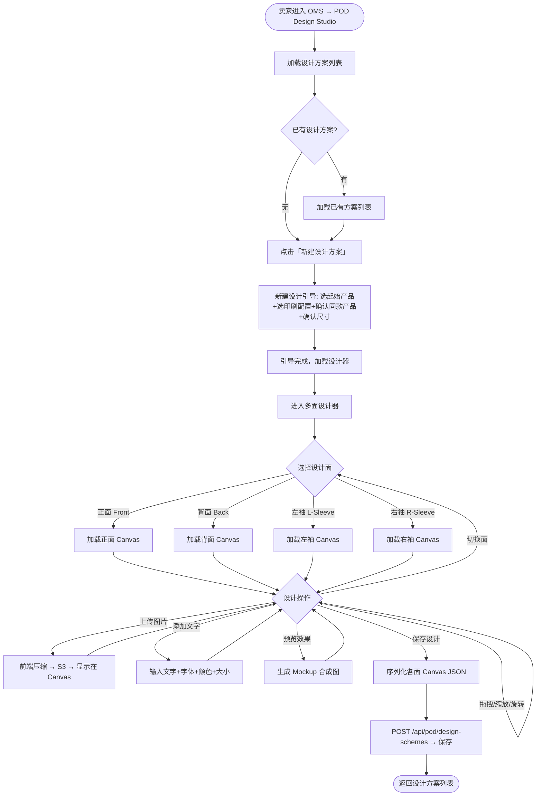
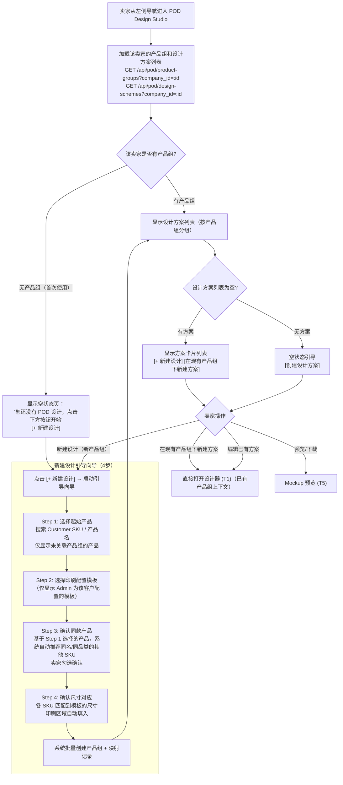
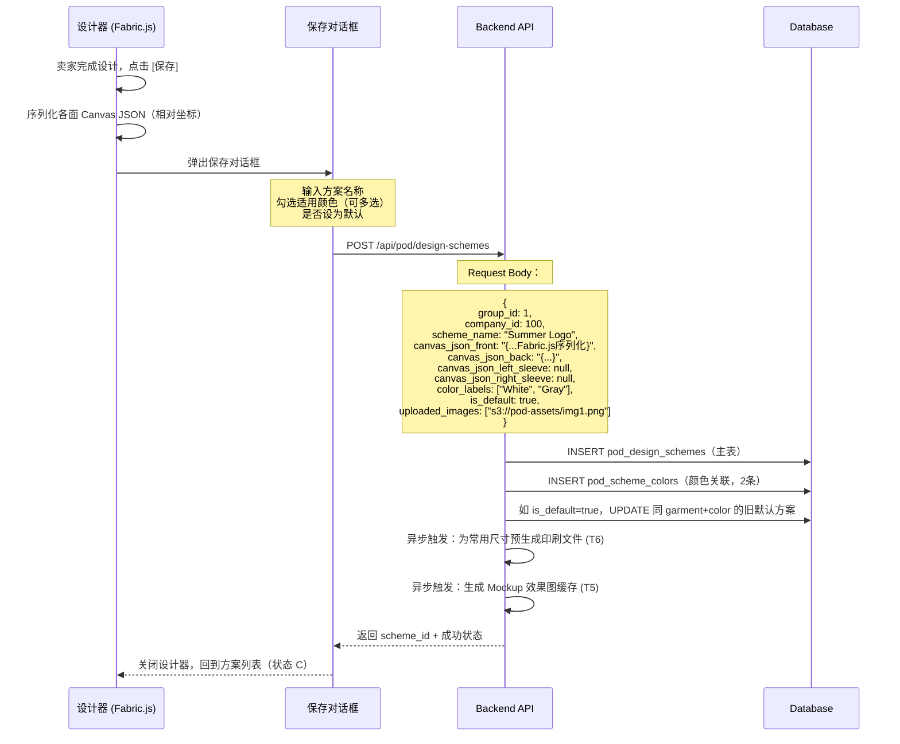
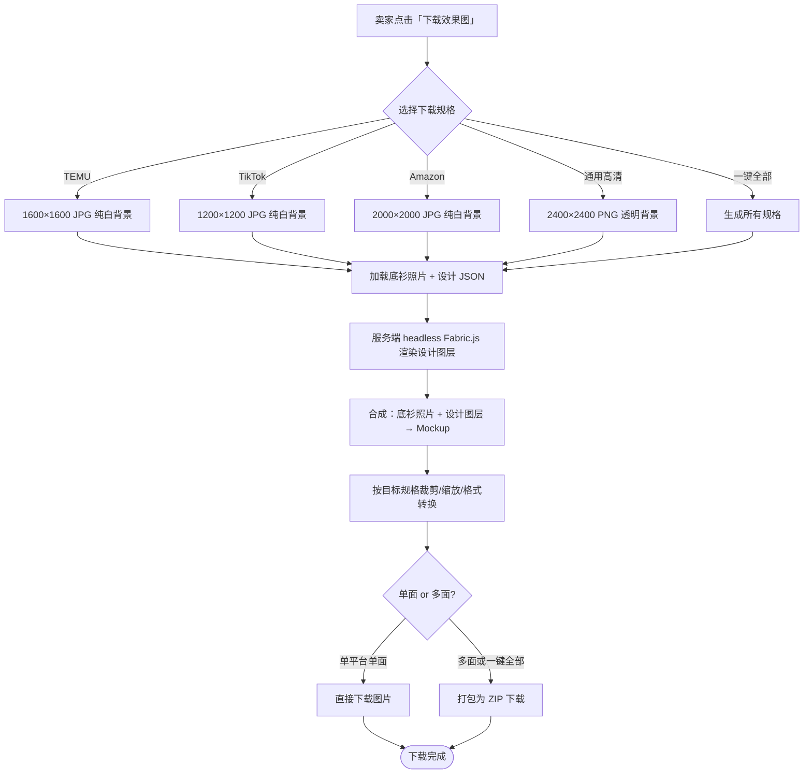
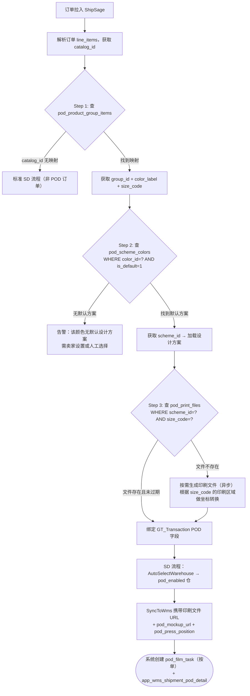
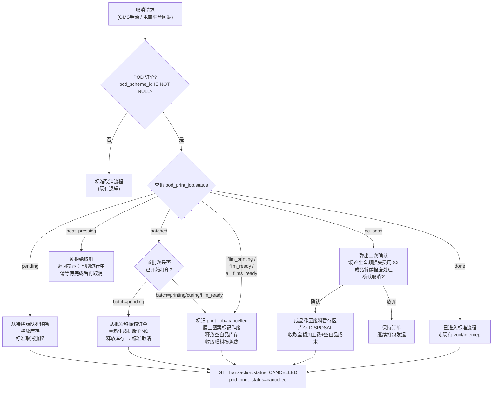
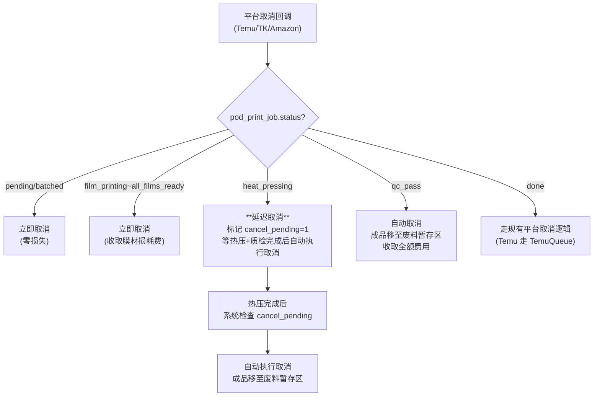

# PRD: ShipSage POD 卖家设计器 / ShipSage POD Seller Design Studio

> | Field / 字段 | Value / 值 |
> |---|---|
> | **Status / 状态** | Draft / 草稿 |
> | **Owner / 负责人** | Dennis |
> | **Contributors / 参与者** | 前端、后端、WMS、Billing |
> | **Approved By / 审批人** | — |
> | **Approved Date / 审批日期** | — |
> | **Decision / 审批决定** | Pending / 待审批 |
> | **Created / 创建日期** | 2026-03-24 |
> | **Last Updated / 最后更新** | 2026-03-30 |
> | **Version / 版本** | V5.5 |
> | **基于版本** | V4.0（PRD-v4-final）|

---

## History / 变更历史

| Version | Author | Date | Comment / 说明 |
|---------|--------|------|----------------|
| V1.0–V4.0 | Dennis | 2026-03-17~19 | 见 PRD-v4-final.md |
| **V5.0** | Dennis | 2026-03-24 | **重大调整**：(1) 设计器从独立 Shopify App 改为内嵌 ShipSage OMS 产品模块；(2) 用户从消费者改为卖家；(3) 支持多印刷区域（正面/背面/左袖/右袖）；(4) 一次设计自动适配所有尺寸；(5) 支持高清效果图下载（适配 TEMU/TK/Amazon 等平台规格）；(6) 加工费按尺寸计价；(7) 一个 SKU 可绑定多个设计方案；(8) 消费者端定制移至第三期；(9) **印刷工艺从 DTG 改为 DTF**，完整设计仓库 DTF 操作流程（拼版→膜打印→撒粉固化→热压转印→揭膜→质检） |
| **V5.4** | Dennis | 2026-03-27 | **WMS 仓库流程重大调整**：(1) SyncToWms 新增 `pod_mockup_url`（衣服+设计效果图，用于仓库热压位置参考）和 `pod_press_position`（热压位置参数）下发仓库；(2) **仓库 DTF 流程重构为基于 Tote 拣货策略**：印刷膜任务从 `shipment.status=CREATED` 时按单创建（`pod_film_task`，与 batch_picking 无关，适配 <20 件直接走 pick run 和 ≥20 件走 batch 两种路径）；(3) 新增"**膜预拣**"步骤（Film Pre-Pick）：Tote Pick Run 分配 Bin→Shipment 映射后，操作员扫描膜条码，系统显示对应 Bin 编号和效果图，操作员将膜预先放入 Bin；(4) 衣物拣货时膜已在 Bin 中，实现衣服与膜的自动匹配，热压时直接取 Bin 操作；(5) 新增 `app_wms_pod_film_task` 和 `app_wms_shipment_pod_detail` 两张表 |
| **V5.5** | Dennis | 2026-03-30 | **设计器增强 + 计费重构 + 仓库流程优化**：(1) **计费改为一口价**：底衫+设计+操作费合并为按客户×产品组的单价，替代原按尺寸×面数拆分计费；(2) **设计器新增 AI 抠图**：卖家可一键去除图片背景，提取主体元素（基于 rembg 开源方案）；(3) **3D 效果图预览（P1）**：基于 Three.js + GLTF 模型实现 T 恤 360° 旋转预览；(4) **图片 DPI 分级检测 + AI 超分增强**：上传图片自动检测有效 DPI，分三档提示（优秀/一般/较差），不足时提供一键 AI 增强（Real-ESRGAN），不硬拦截；(5) **贴章/素材库**：新增官方预置素材库（Admin 维护）+ 卖家私有素材，设计器工具栏新增贴章入口；(6) **膜打印任务改为 Pick Run 后生成**：膜任务不再在 shipment CREATED 时按单创建，改为 Tote Pick Run 创建后基于 pick_run 中的 shipments 批量生成打印批次（`pod_film_batch`），新增独立裁切步骤和完成通知机制；(7) **Step 3 关联同款产品优化**：新增手动添加/删除产品 UI 控件 |

---

## I. Glossary / 术语说明

| Term / 术语 | Definition / 定义 |
|---|---|
| POD | 按需印刷（Print-on-Demand），收到订单后才生产 |
| Design Studio / 设计器 | ShipSage OMS 中的独立页面，供卖家创建和管理 POD 产品设计方案 |
| DPI | Dots Per Inch（每英寸点数），衡量图片分辨率。屏幕显示通常 72dpi，印刷要求 ≥ 300dpi。上传图片 DPI 不足会导致印刷模糊 |
| Design Scheme / 设计方案 | 卖家完成的一套完整设计（含各印刷区域的图案/文字），可绑定到 SKU |
| Base Garment / 底衫 | 卖家的空白品产品（已在 GT_Catalog 中管理），POD 设计的载体 |
| Print Profile / 印刷配置模板 | Admin **按客户**维护的印刷技术参数模板（含各尺寸印刷区域尺寸、支持的印刷面），关联客户（company_id）和现有产品品类（category_id） |
| Print Area / 印刷区域 | 底衫上允许印刷的区域，按面分：正面(Front)、背面(Back)、左袖(Left Sleeve)、右袖(Right Sleeve) |
| Relative Coordinate / 相对坐标 | 设计元素位置以印刷区域百分比记录（如 x:50%, y:30%），实现一次设计多尺寸适配 |
| Mockup / 效果图 | 将设计叠加到底衫照片上的预览图，卖家可下载用于电商平台上架 |
| Print-ready File / 印刷文件 | 300dpi PNG + PDF，用于 DTF 印刷的高清设计稿 |
| DTF | Direct to Film，数码转印工艺。先将图案打印到 PET 转印膜上，撒热熔胶粉并固化，再通过热压机将图案转印到成衣上 |
| PET Film / 转印膜 | DTF 印刷使用的聚酯薄膜介质，图案先打印到膜上，再热压转印到衣物 |
| Nesting / 拼版 | 将多个订单的图案排布在同一张转印膜上打印，提高膜材利用率（从 35-50% 提升到 70-85%） |
| Print Batch / 印刷批次 | 一组拼版在同一张膜上打印的订单集合 |
| Heat Press / 热压机 | 将打印好的转印膜热压到成衣上的设备，温度 160-170°C，时间 10-15 秒 |
| RIP | Raster Image Processor，光栅图像处理软件。在 DTF 流程中负责色彩分离（RGB→CMYK+W）、白墨通道生成、墨量控制、拼版优化和打印机驱动 |
| Hot Folder | RIP 软件监听的本地目录，放入文件后自动触发 RIP 处理和打印，是 ShipSage 系统与 RIP 的主要集成方式 |
| ICC Profile | 国际色彩联盟标准色彩描述文件，确保设计文件的颜色在特定打印机+墨水+介质组合下准确还原 |
| AJS | Automatic Job Sorter，Cadlink 的自动作业分拣模块，可按规则自动分配打印参数和拼版 |
| Fabric.js | 主流 HTML5 Canvas 设计库，支持对象模型和 SVG 导出 |
| GT_Catalog | ShipSage 现有产品目录表，每个颜色+尺寸为一个独立 catalog_id。POD 通过 Print Profile 将多个 catalog_id 归组 |
| company_id | ShipSage 多货主隔离的租户 ID |
| SD Flow | Smart Distribution，ShipSage 自动化出库调度流程 |
| VAS Work Order | Value-Added Service 工单，WMS 中的增值服务作业机制 |
| Film Pre-Pick / 膜预拣 | Tote Pick Run 中新增的步骤：操作员扫描已打印膜的条码，系统自动显示该膜对应的 Tote Bin 编号和效果图，操作员将膜放入指定 Bin，实现膜与订单的预匹配。后续衣物拣货放入同一 Bin，热压时衣服与膜已匹配，无需额外查找。（V5.4 新增） |
| POD Film Task / 膜任务 | `app_wms_pod_film_task` 表中的记录，追踪单个 shipment 从膜印刷到热压的完整状态。V5.5 起改为在 Tote Pick Run 创建后由 `pod_film_batch` 批量生成，不再在 shipment CREATED 时按单创建。（V5.4 新增，V5.5 更新） |
| Warehouse Mockup / 仓库效果图 | 设计叠加在底衫上的预览图（`pod_mockup_url`），随 SyncToWms 下发仓库。操作员在膜预拣和热压时参考效果图确认设计位置和热压方向，不用于印刷本身。（V5.4 新增） |
| AI Background Removal / AI 抠图 | 基于 AI 模型（rembg / Real-ESRGAN）自动去除图片背景，提取主体元素为透明 PNG。卖家在设计器中上传图片后可一键触发。（V5.5 新增） |
| AI Super Resolution / AI 超分增强 | 基于 Real-ESRGAN 等 AI 模型将低分辨率图片放大 2x-4x，提升有效 DPI 以满足印刷要求。上传图片 DPI 不足时自动提示，卖家可一键增强。（V5.5 新增） |
| Sticker Library / 贴章素材库 | 系统预置的装饰素材图片库，分为官方素材库（Admin 维护，全客户共享）和卖家私有素材（卖家上传，仅自己可见）。卖家可直接拖拽到设计画布使用。（V5.5 新增） |
| 3D Preview / 3D 预览 | 基于 Three.js + GLTF 3D 模型的 T 恤 360° 旋转预览，将设计 Canvas 作为贴图映射到模型对应面。P1 阶段实现。（V5.5 新增） |
| POD Film Batch / 膜打印批次 | `pod_film_batch` 表中的记录，在 Tote Pick Run 创建后基于 pick_run 中的 shipments 批量生成，替代 V5.4 中按单创建 film_task 的方式。一个 film_batch 包含多个 film_task，对应一次拼版打印任务。（V5.5 新增） |
| Flat Rate Pricing / 一口价 | POD 订单按「底衫 + 设计 + 操作」合并为单价收费，按客户（company）× 产品组/品类配置，替代 V5.4 中按尺寸×面数拆分计费的模式。（V5.5 新增） |

---

## II. Business Background / 业务背景

### 2.1 Background / 背景

ShipSage 已在美国建立多个自营仓，具备完整的仓配一体化能力。现计划在 ShipSage OMS 中新增 POD Design Studio（独立页面），让卖家（ShipSage 的 company 客户）在系统内完成 POD 产品设计，生成高清效果图用于各电商平台上架，并在订单进入时自动匹配印刷文件，在 ShipSage 仓库内完成 DTF 印刷和履约发货。

**核心业务目标：卖家在 ShipSage 完成设计 → 在 ShipSage 仓库完成履约，形成设计-生产-发货闭环。**

**分期规划：**

| Phase | 内容 | 说明 |
|-------|------|------|
| **Phase 1（本期）** | ShipSage 卖家端设计器 | 卖家在 ShipSage POD Design Studio 设计、下载效果图、订单自动匹配印刷 |
| Phase 2 | Shopify App + Embed Widget | 将设计器以 Shopify App 和 JS Snippet 形式输出 |
| Phase 3 | 消费者端定制 | 消费者在 Shopify 店铺/网站上实时个性化定制 |

### 2.2 服装定制印刷工艺选型

> 完整工艺对比见独立文档：[附录-服装印刷工艺全景.md](附录-服装印刷工艺全景.md)
>
> **MVP 选型结论：DTF（Direct to Film）**。1件起生产、全品类兼容（棉/涤/混纺/深浅色）、单件耗材 $1.35-$2.60、设备入门 $5K-15K，是 POD 场景性价比最优解。详见 §4.2 方案选择。

---

### 2.3 Business Goals / 业务目标

| 目标 | 说明 |
|------|------|
| **设计闭环** | 卖家在 ShipSage 内完成 POD 产品设计，生成满足各电商平台规格的高清效果图，无需使用第三方设计工具 |
| **履约闭环** | 订单进入 ShipSage 后自动匹配印刷文件，在仓库完成 DTF 印刷和发货，订单印刷到出库 ≤ 24h |
| **自动化** | POD 订单自动匹配设计方案+印刷文件，成功率 ≥ 95%（前提：卖家已完成产品关联和设计） |

---

## III. Users & Scenarios / 用户与场景

### 3.1 User Roles / 用户角色

| Role / 角色 | Description | Pain Points / 痛点 | Needs / 诉求 |
|---|---|---|---|
| 卖家 / Seller | ShipSage 的 company 客户，在 TEMU/TK/Amazon 等平台销售 POD 商品 | 设计工具与仓储系统割裂；效果图需手动制作；不同尺寸要重复设计 | 一次设计自动适配所有尺寸；一键下载合规效果图；订单自动匹配印刷 |
| ShipSage 运营 Admin | 按客户维护印刷配置模板、Mockup 底图、POD 试点仓配置 | 印刷参数无统一管理入口 | 按客户（company）维护印刷配置模板（印刷区域/面数）+ Mockup 底图 |
| 仓库操作员 / Warehouse Operator | 执行 DTF 印刷作业 | 印刷文件与订单匹配靠人工 | 系统自动下发印刷文件，扫码匹配订单 |

### 3.2 Core Scenarios / 核心场景

**场景一：卖家设计 POD T恤并生成上架素材**
- Trigger：卖家进入 ShipSage OMS → 左侧导航 → POD Design Studio
- Flow：新建设计 → 搜索并选择一个 Customer SKU 作为起始产品 → 选择印刷配置模板 → 关联同款产品（系统自动推荐+卖家确认） → 确认尺寸对应 → 在正面/背面/袖子区域上传图案/输入文字 → 实时预览 Mockup → 保存设计方案 → 下载高清效果图（TEMU/TK/Amazon 格式） → 效果图上架到各电商平台
- Result：设计方案保存并绑定产品 SKU，效果图已下载

**场景二：POD 订单自动匹配印刷文件**
- Trigger：消费者在电商平台下单，订单拉入 ShipSage
- Flow：系统识别订单 SKU → 匹配该 SKU 绑定的设计方案 → 根据订单尺寸生成对应的印刷文件 → 创建 WMS 印刷工单
- Result：仓库操作员看到带有印刷文件的工单，执行印刷

**场景三：仓库操作员执行印刷并发货**
- Trigger：操作员在 WMS 看到待印刷工单
- Flow：认领任务 → 查看印刷文件（含设计预览和印刷参数） → 拣出空白品 → 执行 DTF 印刷 → 质检 → 打包发运
- Result：订单完成印刷和发货

### 3.3 端到端全流程图（从底衫维护到印刷出库）

以下流程图覆盖 POD 业务从初始配置到订单发货的**完整链路**，标注了每个环节的操作角色、涉及系统和对应 Task 编号。

```mermaid
flowchart TD
    subgraph Phase1 ["阶段一：基础配置（一次性）"]
        A1["<b>Admin 按客户维护印刷配置模板</b><br>选择客户(company) → 配置品类/品牌型号/各尺寸印刷区域/支持面/Mockup底图<br><i>角色: ShipSage Admin</i><br><i>系统: ShipSage Admin 后台</i><br><i>Task: T3</i>"]
        A2["<b>Admin 配置试点仓库</b><br>标记 pod_enabled=1 / DTF 设备信息<br><i>角色: ShipSage Admin</i><br><i>Task: T8</i>"]
        A3["<b>Admin 配置一口价</b><br>按客户×产品组配置单价（底衫+设计+操作）<br><i>角色: ShipSage Admin</i><br><i>Task: T9</i>"]
        A4["<b>仓库安装 DTF 设备+RIP</b><br>打印机/撒粉机/固化机/热压机<br>安装 Maintop RIP + ICC 校色<br><i>角色: 仓库+设备团队</i><br><i>Task: T6/T8</i>"]
    end

    subgraph Phase2 ["阶段二：卖家配置（每个卖家一次）"]
        B1["<b>卖家进入 POD Design Studio</b><br>新建设计 → 选择起始产品(Customer SKU) → 选印刷配置模板 → 确认同款产品分组 → 确认尺寸<br>系统自动建立 catalog_id 映射<br><i>角色: 卖家</i><br><i>系统: OMS 左侧导航 → POD Design Studio</i><br><i>Task: T2/T3b</i>"]
    end

    subgraph Phase3 ["阶段三：设计与上架（按需重复）"]
        C1["<b>卖家创建设计方案</b><br>选底衫+颜色 → 多面设计器<br>正面/背面/袖子独立编辑<br>上传图片(DPI校验)/添加文字(字体库)<br><i>角色: 卖家</i><br><i>系统: OMS POD Design Studio</i><br><i>Task: T1/T2</i>"]
        C2["<b>保存设计方案</b><br>选择适用颜色(可多选)/命名/设为默认<br>Canvas JSON 相对坐标序列化存储<br><i>Task: T4</i>"]
        C3["<b>下载高清效果图</b><br>TEMU 1600×1600 / TK 1200×1200<br>Amazon 2000×2000 / 通用高清 2400×2400<br>服务端 headless Fabric.js + Sharp.js 合成<br><i>Task: T5</i>"]
        C4["<b>卖家上架到电商平台</b><br>将效果图上传到 TEMU/TK/Amazon 等<br><i>角色: 卖家（系统外操作）</i>"]
        C5["<b>系统预生成印刷原稿</b><br>为各尺寸生成 300dpi RGB 透明 PNG<br>相对坐标→绝对坐标转换<br><i>系统自动/异步</i><br><i>Task: T6</i>"]
    end

    subgraph Phase4 ["阶段四：订单匹配（每笔订单自动）"]
        D1["<b>消费者下单</b><br>在 TEMU/TK/Amazon 等平台购买<br><i>角色: 消费者（系统外）</i>"]
        D2["<b>订单拉入 ShipSage</b><br>通过平台 API/CSV 导入<br><i>系统: ShipSage OMS</i>"]
        D3["<b>自动匹配设计方案</b><br>catalog_id → 产品组 → group+color+size<br>→ 默认设计方案 → 印刷文件<br><i>系统自动</i><br><i>Task: T7</i>"]
        D4["<b>SD 流程路由</b><br>AutoSelectWarehouse → pod_enabled 仓<br>SyncToWms 携带印刷文件 URL<br><i>系统: ShipSage SD</i><br><i>Task: T7</i>"]
    end

    subgraph Phase5 ["阶段五：仓库 DTF 印刷 + Tote 拣货（V5.5）"]
        E1["<b>Step 1: Tote Pick Run 创建</b><br>扫 Cart 条码 + 选 Bin 数<br>系统分配 Bin ↔ Shipment 映射<br><i>角色: 拣货员</i><br><i>Task: T8</i>"]
        E2["<b>Step 2: 系统生成膜打印批次</b><br>基于 Pick Run 中的 shipments<br>批量创建 pod_film_batch + pod_film_task<br><i>系统自动</i><br><i>Task: T8</i>"]
        E3["<b>Step 3: 膜打印（拼版印刷）</b><br>film batch 拼版 → Maintop RIP<br>打印到 PET 转印膜 → 撒粉 → 固化<br><i>角色: 膜打印操作员</i><br><i>Task: T8</i>"]
        E4["<b>Step 4: 裁切 + 贴膜条码</b><br>裁切各图案 → 每片旁贴膜条码标签<br><i>角色: 膜打印操作员</i><br><i>Task: T8</i>"]
        E5["<b>Step 5: 膜预拣（Film Pre-Pick）</b><br>系统通知裁切完成 → 扫膜条码<br>→ 显示 Bin 编号+效果图 → 膜放入 Bin<br><i>角色: 拣货员</i><br><i>Task: T8</i>"]
        E6["<b>Step 6: 衣物拣货</b><br>扫货架位置 → 拣空白品<br>放入对应 Bin（膜已在 Bin 中）<br>衣服与膜自动匹配<br><i>角色: 拣货员</i><br><i>Task: T8</i>"]
        E7["<b>Step 7: 热压转印</b><br>取 Bin 中衣服+膜（已匹配）<br>热压 170°C/15s → 冷却 → 揭膜<br>多面订单逐面完成<br><i>角色: 热压操作员</i><br><i>Task: T8</i>"]
        E8["<b>Step 8: 质检 + 扫码确认</b><br>5项检查(位置/颜色/完整/膜残留/衣物)<br>Pass → 打包 / Fail → 重印(≤3次)<br><i>角色: 热压操作员</i><br><i>Task: T8</i>"]
    end

    subgraph Phase6 ["阶段六：发货 + 计费"]
        F1["<b>标准打包→贴标→发运</b><br>复用现有 WMS Pack→Ship 流程<br><i>系统: ShipSage WMS</i>"]
        F2["<b>自动计费</b><br>qc_pass → 按一口价计费（底衫+设计+操作）<br>费用计入商家月账单<br><i>系统: ShipSage Billing</i><br><i>Task: T9</i>"]
        F3["<b>物流回传</b><br>运单号回传电商平台<br>消费者收到发货通知<br><i>系统: ShipSage OMS</i>"]
    end

    A1 --> B1
    A2 --> E2
    A3 --> F2
    A4 --> E2
    B1 --> C1
    C1 --> C2
    C2 --> C3
    C2 --> C5
    C3 --> C4
    C4 --> D1
    C5 -.-> D3
    D1 --> D2
    D2 --> D3
    D3 --> D4
    D4 --> E1
    E1 --> E2
    E2 --> E3
    E3 --> E4
    E4 --> E5
    E5 --> E6
    E6 --> E7
    E7 --> E8
    E8 -- "Pass" --> F1
    E8 -- "Fail & count<3" --> E3
    F1 --> F2
    F1 --> F3
```



**流程概要（文字版）：**

| 阶段 | 环节 | 角色 | 系统模块 | Task |
|------|------|------|----------|------|
| 一、基础配置 | 按客户维护印刷配置模板 + Mockup 底图 | Admin | ShipSage Admin | T3 |
| | 配置试点仓+DTF设备+RIP | Admin + 仓库 | Admin + 仓库 | T6/T8 |
| | 配置一口价（底衫+设计+操作） | Admin | Billing | T9 |
| 二、卖家配置 | POD Design Studio 新建设计时选择起始产品(Customer SKU)+选模板+关联同款产品+确认尺寸 | 卖家 | OMS → POD Design Studio | T2/T3b |
| 三、设计与上架 | 创建设计方案（多面设计） | 卖家 | OMS Design Studio | T1/T2/T4 |
| | 下载效果图并上架 | 卖家 | OMS + 电商平台 | T5 |
| | 预生成印刷原稿 | 系统自动 | 后端异步 | T6 |
| 四、订单匹配 | 订单拉入 → SKU 匹配 → 设计方案 → 印刷文件 | 系统自动 | OMS/SD | T7 |
| 五、仓库印刷 | Pick Run 创建 → 生成膜打印批次 → 膜打印 → 裁切 → 膜预拣 → 衣物拣货 → 热压 → 质检 | 操作员 | WMS | T8 |
| 六、发货计费 | 打包发运 → 按一口价自动计费 → 物流回传 | 系统 + 操作员 | WMS/Billing/OMS | T9 |
| 逆向、订单取消 | 按印刷状态分段取消 → 膜材损耗费/全额费用 → 废料管理 | OMS 操作员 / 系统 | OMS/WMS/Billing | T10 |

---

## IV. Design Approach / 设计思路

### 4.1 Core Design Principles / 核心设计理念

1. **一次设计，全尺寸适配**：设计器使用相对坐标系，卖家在一个画布上设计一次，系统自动为 S/M/L/XL/2XL 等所有尺寸生成印刷文件
2. **多区域独立编辑**：正面、背面、左袖、右袖各为独立画布，卖家可按需设计任意面
3. **效果图即上架图**：生成的 Mockup 效果图直接满足 TEMU/TK/Amazon 等平台的产品图规格，无需二次加工
4. **最小化侵入现有系统**：设计器作为 OMS 独立页面（POD Design Studio），复用现有 GT_Catalog 产品体系
5. **设计方案可复用**：一个 SKU 可绑定多个设计方案，卖家可灵活切换
6. **一口价计费**：底衫+设计+操作费合并为一口价，按客户×产品组配置，简化计费模型

### 4.2 Solution Comparison / 方案选择

#### 一次设计多尺寸适配方案

| Option | Pros | Cons | Decision |
|---|---|---|---|
| **相对坐标系（百分比定位）** | 一次设计自动适配所有尺寸；用户体验最佳 | 需在渲染印刷文件时做坐标转换 | ✅ 采用 |
| 绝对坐标 + 手动逐尺寸调整 | 实现简单 | 用户需为每个尺寸重复设计，体验差 | ❌ 放弃 |
| 绝对坐标 + 自动缩放 | 实现中等 | 不同尺寸比例不同时可能变形 | ❌ 放弃 |

**相对坐标系原理：**
```
设计器画布（统一基准尺寸，如 M 码）：
  ┌─────────────────────────┐
  │ 印刷区域 28cm × 32cm     │
  │  ┌───────────────────┐  │
  │  │ Logo: x=50% y=20% │  │  ← 位置以百分比记录
  │  │ w=40% h=15%        │  │  ← 尺寸以百分比记录
  │  └───────────────────┘  │
  └─────────────────────────┘

渲染 S 码印刷文件时（26cm × 30cm）：
  Logo 实际位置：x=13cm y=6cm, w=10.4cm h=4.5cm

渲染 XL 码印刷文件时（30cm × 34cm）：
  Logo 实际位置：x=15cm y=6.8cm, w=12cm h=5.1cm
```

#### 印刷工艺选择

| Option | Pros | Cons | Decision |
|---|---|---|---|
| **DTF（Direct to Film）** | 设备成本低（入门 $3k-$8k）；适用品类广（纯棉/涤纶/混纺）；支持拼版批量印刷降低成本；深色件表现好；单件耗材 $1.35-$2.60 | 略有膜感；需热压设备和操作空间；工艺步骤较多（打印→撒粉→固化→热压→揭膜） | ✅ 采用 |
| DTG（Direct to Garment） | 手感更自然（浅色纯棉场景）；工艺步骤少 | 设备贵（$15k-$20k 入门）；深色件成本高（$3.40-$6.80/件）；不支持涤纶；喷头易堵、维护复杂 | ❌ 后续迭代补充 |

#### 设计器集成方式

| Option | Pros | Cons | Decision |
|---|---|---|---|
| **OMS 独立页面（POD Design Studio）** | 设计器有完整页面空间；不影响产品详情页性能；与竞品体验一致 | 需新增页面和左侧导航入口 | ✅ 采用 |
| 独立页面 | 实现独立，不影响现有页面 | 用户体验割裂 | ❌ 放弃 |

#### 前端设计器引擎

| Option | Pros | Cons | Decision |
|---|---|---|---|
| **Fabric.js** | SVG 导出支持（印刷必须）；对象模型成熟；POD 案例最多 | 大量对象时性能弱于 Konva | ✅ 采用 |
| Konva.js | 高性能 | 不支持 SVG 导出（印刷致命缺陷）| ❌ 放弃 |

### 4.3 Key Design Decisions / 关键设计决策

| # | Decision / 决策 | Rationale / 理由 |
|---|---|---|
| 1 | 设计器作为 OMS 独立页面 `pod/design-studio.vue`，左侧导航新增入口 | 设计器有完整页面空间；不影响产品详情页 |
| 2 | 设计元素使用相对坐标（百分比）存储 | 一次设计自动适配所有尺寸 |
| 3 | 每个印刷面（Front/Back/L-Sleeve/R-Sleeve）独立 Canvas | 各面独立编辑，互不干扰 |
| 4 | Admin **按客户（company）** 维护印刷配置模板（Print Profile），存入 `pod_print_profiles` 表，关联 company_id + category_id | 不同客户可能用不同品牌空白品，印刷区域尺寸需客户级别配置；一个客户同品类可有多个模板 |
| 5 | 设计方案存入 `pod_design_schemes` 表，通过中间表与 GT_Catalog 关联 | 一个 SKU 可绑定多个设计方案 |
| 6 | 效果图生成多种平台规格（TEMU/TK/Amazon） | 卖家可直接下载用于上架 |
| 7 | 印刷文件在订单匹配时按目标尺寸动态生成 | 避免提前为所有尺寸生成大量文件 |
| 8 | 加工费采用一口价（底衫+设计+操作），按客户×产品组配置单价 | 简化计费模型，卖家一目了然；Admin 按客户维护价格模板 |
| 9 | 印刷工艺采用 DTF（Direct to Film），非 DTG | 成本低、品类广、支持拼版；DTG 作为后续高端补充 |
| 10 | DTF 印刷拆分为两个独立工位：膜打印工位 + 热压转印工位 | 膜打印可批量拼版提效；热压按单件操作保证质量 |
| 11 | 多订单图案自动拼版到同一张转印膜 | 膜材利用率从 35-50% 提升到 70-85%，显著降低耗材成本 |
| 12 | RIP 分阶段策略：MVP 用设备自带 Maintop（免费），P1 升级 Cadlink v12（$399） | MVP 零成本启动，规模化后升级全自动化 |
| 13 | 印刷原稿保持 RGB 色彩空间 + 透明背景，RGB→CMYK 和白墨通道由 RIP 完成 | RIP 配合 ICC Profile 做色彩转换更准确；透明背景供 RIP 自动确定白墨范围 |
| 14 | **MVP 阶段使用 RIP（Maintop）自带拼版功能**：ShipSage 只提供各订单独立 300dpi PNG，操作员在 Maintop 中使用内置拼版手动排布后打印；ShipSage 自研拼版为后续优化方案（减少操作员手动排版工作量） | MVP 零开发成本启动；Maintop 具备基本拼版能力；自研拼版可在后期按需开发；升级 Cadlink 后全自动化 |
| 15 | 设计器提供 AI 抠图功能，卖家上传图片后可一键去除背景 | 降低素材准备门槛，卖家无需使用 PS 等专业工具；基于 rembg 开源方案零成本 |
| 16 | 图片上传采用 DPI 分级检测 + AI 超分增强，不硬拦截 | 兼容卖家各种素材质量；DPI 不足时提供一键 AI 增强（Real-ESRGAN），由卖家决定是否使用 |
| 17 | 设计器提供贴章/素材库（官方 + 卖家私有），设计器工具栏新增贴章入口 | 降低设计门槛，提供开箱即用的装饰元素；官方素材需确保版权合规 |
| 18 | 3D 效果图预览（P1）基于 Three.js + GLTF 模型 | 提升设计器体验，卖家可 360° 预览设计效果；MVP 先用 2D 正面/背面切换 |
| 19 | 膜打印批次（pod_film_batch）在 Tote Pick Run 创建后生成，替代 V5.4 中 shipment CREATED 时按单创建 | 打印批次与 pick_run 绑定，确保打印的膜与即将拣货的订单精确匹配，避免膜打印后长时间未拣的浪费 |

---

## V. Menu Configuration / 菜单配置

| Application | Menu Path | URL | Type | Permission |
|---|---|---|---|---|
| ShipSage OMS | Products > Detail > **POD Design** Tab | /oms/product/{id}#pod-design | tab | Seller (company) |
| ShipSage OMS | Products > Detail > POD Design > **Design Schemes** | /oms/product/{id}#pod-design | sub-section | Seller |
| ShipSage OMS | Products > Detail > POD Design > **Download Center** | /oms/product/{id}#pod-design | sub-section | Seller |
| ShipSage OMS | Products > Detail > POD Design > **SKU Mapping** | /oms/product/{id}#pod-design | sub-section | Seller |
| ShipSage ADMIN | **POD / Print Profiles** | /admin/pod/print-profiles | menu | Admin |
| ShipSage ADMIN | **POD / Flat Rate Pricing** | /admin/pod/pricing | menu | Admin |
| ShipSage ADMIN | **POD / Sticker Library** | /admin/pod/sticker-library | menu | Admin |
| ShipSage ADMIN | POD / Print Jobs Monitor | /admin/pod/print-jobs | menu | Admin |
| ShipSage ADMIN | POD / Pilot Warehouse Config | /admin/pod/warehouse-config | menu | Admin |
| ShipSage WMS | POD / **Print Batches** (膜打印批次) | /wms/pod/print-batches | menu | 膜打印操作员 |
| ShipSage WMS | POD / **Heat Press Queue** (热压队列) | /wms/pod/heat-press | menu | 热压操作员 |
| ShipSage WMS | POD / My Tasks | /wms/pod/my-tasks | menu | Warehouse Operator |

---

## VI. Initialization / 初始化配置

| Application | Content / 初始化内容 | Comment / 备注 |
|---|---|---|
| ShipSage ADMIN | 按客户维护印刷配置模板：为 Company A 创建 Bella Canvas 3001 Crew Neck（T-Shirt, F/B/LS/RS），为 Company B 创建 Gildan 18500 Heavy Blend（Hoodie, F/B）等 | 运营 Admin 按客户操作 |
| ShipSage ADMIN | 为每种底衫拍摄/上传各面产品照片（正面照/背面照/侧面照）用于 Mockup 生成 | 白色背景，满足电商平台规格 |
| ShipSage ADMIN | 配置一口价模板：按客户×产品组/品类配置单价（如 Classic Tee=$8.50，Hoodie=$12.00，含底衫+设计+操作） | Billing 后台操作 |
| ShipSage OMS | 卖家在 POD Design Studio 新建设计时：选择起始产品(Customer SKU) → 选印刷配置模板 → 关联同款产品 → 确认尺寸 | 新建设计时触发 4 步引导向导 |
| ShipSage ADMIN | 标记试点仓库 `pod_enabled=1`，配置 DTF 设备信息 | 不写死代码 |
| 试点仓库 | 安装 DTF 设备套件：DTF 打印机 + 撒粉机 + 固化烘干机 + 热压机(2台) | 设备采购周期 4-8 周，入门级 DTF 套件约 $3,000-$8,000 |
| 试点仓库 | 采购 DTF 耗材：PET 转印膜（60cm 幅宽卷膜）、DTF 墨水、热熔胶粉 | 首批耗材约 $500 |
| 试点仓库 | MVP 使用设备自带 Maintop RIP；确认 Maintop 版本支持白墨自动生成和 ICC 色彩管理 | 免费随设备配套 |
| 试点仓库 | 创建 Maintop ICC Profile：针对当前 DTF 打印机+墨水+膜材组合校色 | 首次配置需 1-2 天专业调试 |
| 后端 | 开发 ShipSage 基础拼版模块（Sharp.js 行列矩阵排布 + 裁切线 + 标记） | 预计 2-3 天开发量 |
| 后端（P1） | 月产量 >300 件后，升级安装 Cadlink Digital Factory v12 + Hot Folder + AJS 规则 | 一次买断 $399-$449 |
| 试点仓库 | 备货空白品各色各码各 50 件 | — |
| 试点仓库 | 划分 DTF 生产区：文件准备区 + 膜打印区 + 热压区 + 质检分拣区 | 参见 T8 仓库功能区布局 |
| 后端 | S3 Bucket 配置（Mockup 底图、设计素材、效果图、印刷文件）| CDN + 私有桶分离 |

---

## VII. Risk / 风险评估

| Application | Module | Priority | Risk / 风险 | Solution / 应对 |
|---|---|---|---|---|
| Design Studio | 多尺寸适配 | P1 | 相对坐标转换后印刷位置偏移，不同尺寸效果不一致 | 服务端用 headless Fabric.js 渲染同一 JSON，各尺寸先打样验证；上线前用 S/M/XL 三个尺寸做印刷对比测试 |
| Design Studio | 效果图质量 | P1 | Mockup 效果图与实际印刷效果色差大 | 设计器加颜色模式提示（RGB vs CMYK）；Mockup 生成使用色彩校正的底衫照片 |
| OMS 集成 | 独立页面 | P1 | 设计器 Canvas 组件加载慢 | Canvas 组件懒加载（进入设计器编辑页时才初始化） |
| WMS | 订单匹配 | P1 | SKU 绑定多个设计方案时，订单无法确定使用哪个方案 | 设计方案设置"默认"标记；订单匹配优先使用默认方案；如无默认则告警人工选择 |
| WMS | 印刷文件 | P2 | 按尺寸动态生成印刷文件耗时，延迟发货 | 印刷文件异步预生成（设计方案保存时即为常用尺寸预生成）；订单匹配时优先查找已有文件 |
| WMS | DTF 拼版 | P2 | 拼版算法排列不合理导致膜材浪费高 | MVP 先用简单行列排布；P1 引入 Nesting 优化算法 |
| WMS | DTF 热压 | P2 | 热压温度/时间不当导致图案转印不完整或衣物损坏 | 按底衫材质预设热压参数模板；操作员培训+SOP 上墙；前 50 单全检 |
| WMS | DTF 膜暂存 | P3 | 已打印膜与订单对应关系混乱 | 每张膜标注批次号+膜编号；系统记录每个图案在膜上的位置坐标 |
| Billing | 计费 | P2 | 一口价配置错误（如未覆盖某产品组），导致漏计或多计 | 配置后需测试订单验证；兜底价兜底；Admin 审核双签 |
| Design Studio | 大图上传 | P3 | 卖家上传超大图片导致浏览器卡顿 | 前端上传前压缩至 ≤5MB；限制最大 20MB |
| Design Studio | AI 抠图 | P2 | 复杂图案（毛发边缘、半透明物体）抠图质量不稳定 | 支持撤销恢复原图；提示"AI 抠图结果仅供参考，建议使用专业工具处理复杂边缘" |
| Design Studio | AI 超分增强 | P2 | 极低分辨率图片（如 100×100px）放大后仍然模糊 | 增强后显示前后对比，卖家自行判断；DPI 仍不足时保持红色警告 |
| Design Studio | 3D 预览 | P3 | Three.js + 贴图渲染性能开销大，低端设备卡顿 | MVP 先用 2D 切换预览，P1 补充 3D；3D 模型做 LOD 优化 |
| Design Studio | 贴章素材库 | P2 | 官方素材版权纠纷 | 所有官方素材须经版权确认（原创/免费商用授权）；保留授权证明 |
| WMS | 膜打印批次时序 | P1 | Pick Run 创建后膜打印批次生成延迟，导致拣货等待 | 监控 film_batch 从创建到 cut_done 的耗时；超阈值告警 |

---

## VIII. Scope / 开发范围

| Application | Module | Task # | Task Name | Description |
|---|---|---|---|---|
| ShipSage OMS | Design Studio | T1 | POD 设计器核心 | Fabric.js 多区域 Canvas 编辑器：多面切换、上传图片、输入文字、拖拽缩放、实时预览、**AI 抠图、DPI 分级检测+AI 超分增强、贴章/素材库、3D 预览（P1）** |
| ShipSage OMS | 独立页面 | T2 | POD Design Studio 独立页面 | OMS 左侧导航新增 POD Design Studio 入口，含设计方案列表+产品组管理+新建设计 4 步引导向导+设计器编辑 |
| ShipSage ADMIN | 印刷配置 | T3 | 印刷配置模板管理后台 | Admin 按客户维护印刷配置模板：客户/品类/品牌型号/各尺寸印刷区域/支持面/Mockup 底图 |
| ShipSage OMS | 产品关联 | T3b | 产品关联（合并到 T2 新建设计流程） | 新建设计时完成：选起始产品(Customer SKU) → 选印刷配置 → 关联同款产品 → 确认尺寸 → 自动建立映射 |
| ShipSage OMS | 设计方案 | T4 | 设计方案管理 | 保存/列表/编辑/删除/设为默认；一个方案可绑定多个颜色，自动覆盖所有尺寸 |
| ShipSage OMS | 效果图 | T5 | 高清效果图生成与下载 | 按平台规格（TEMU/TK/Amazon）生成 Mockup 效果图；批量下载 |
| ShipSage OMS | 印刷文件 + 拼版 + RIP | T6 | 多尺寸印刷原稿 + RIP 拼版集成 | 300dpi RGB 印刷原稿生成；**MVP：ShipSage 提供各订单独立 PNG，操作员在 Maintop 用内置拼版**；后续优化：ShipSage 自研拼版输出合并 PNG；P1 升级 Cadlink Hot Folder 全自动 |
| ShipSage OMS/SD | 订单匹配 | T7 | 订单 SKU → 设计方案 → 印刷文件自动匹配 | 订单进入时自动匹配设计方案和印刷文件 |
| ShipSage WMS | DTF 印刷作业 | T8 | WMS POD DTF 印刷全流程 | **V5.5：Pick Run 创建后生成膜打印批次（pod_film_batch）**→ 拼版打印 → 裁切+贴码 → 通知膜预拣 → 衣物拣货 → 热压 → 质检 |
| ShipSage Billing | 计费 | T9 | **一口价** DTF 印刷加工费 | 底衫+设计+操作合并单价，按客户×产品组配置，quality check pass 后自动计费 |
| ShipSage OMS/WMS | 逆向流程 | T10 | POD 订单取消 | 按 print_job 状态分段处理；膜材损耗费/全额损失费；延迟取消机制；废料管理 |

---

## IX. Task Details / 任务详细设计

> **文档结构说明：** Task 按使用角色分为三个部分：
> - **Part A: 卖家功能** — T1 设计器核心 → T2 POD Design Studio 独立页面 → T3b 产品关联 → T4 设计方案管理 → T5 效果图下载
> - **Part B: Admin 功能** — T3 印刷配置模板管理 → T9 加工费配置
> - **Part C: 系统自动化 + WMS 仓库操作** — T6 印刷文件生成+RIP → T7 订单匹配 → T8 WMS DTF 印刷作业 → T10 订单取消

---

### Part A: 卖家功能 / Seller Features

---

### T1: POD 设计器核心 / POD Design Studio Core

> 基于 Fabric.js 的多区域设计器，卖家可在底衫的正面、背面、左袖、右袖独立设计，支持上传图片、输入文字、拖拽缩放旋转，实时 Mockup 预览。使用相对坐标系确保一次设计适配所有尺寸。

#### 1.1 业务流程



#### 1.2 界面线框图

**多面设计器主界面：**

```
┌──────────────────────────────────────────────────────────────────────────┐
│ POD Design Studio                                    [保存] [预览] [下载] │
├──────────────────┬───────────────────────────────────┬───────────────────┤
│ 工具栏            │         Canvas 编辑区              │  属性面板          │
│                  │                                   │                   │
│ 📤 上传图片       │  ┌─ 面切换 ─────────────────────┐ │ 底衫: Classic Tee  │
│ 🔤 添加文字       │  │ [正面●] [背面] [左袖] [右袖]  │ │ 颜色: ⚫⚪🔴🔵⬜ │
│ ↩ 撤销 ↪ 重做    │  └─────────────────────────────┘ │                   │
│ 🗑 删除选中       │  ┌───────────────────────────┐   │ 当前面: 正面       │
│ 📐 对齐           │  │                           │   │ 印刷区域: 28×32cm │
│ 📋 图层管理       │  │     ┌───────────────┐     │   │                   │
│                  │  │     │ [设计区域]     │     │   │ ── 选中元素 ──    │
│ ── 已使用面 ──   │  │     │  🖼️ Logo      │     │   │ 类型: 图片        │
│ ✅ 正面（3个元素）│  │     │  ABC 文字      │     │   │ 位置: x=50% y=20%│
│ ✅ 背面（1个元素）│  │     └───────────────┘     │   │ 大小: w=40% h=15%│
│ ⬜ 左袖（空）     │  │                           │   │ 旋转: 0°         │
│ ⬜ 右袖（空）     │  └───────────────────────────┘   │                   │
│                  │  缩放 ──●── / 旋转               │ [删除] [复制]      │
└──────────────────┴───────────────────────────────────┴───────────────────┘
```

**Mockup 预览模式：**

```
┌──────────────────────────────────────────────────────────────────────────┐
│ Mockup 预览                                         [返回编辑] [下载 ▼] │
├──────────────────────────────────────────────────────────────────────────┤
│                                                                          │
│  ┌──────────┐  ┌──────────┐  ┌──────────┐  ┌──────────┐                │
│  │ 正面效果  │  │ 背面效果  │  │ 左侧效果  │  │ 右侧效果  │                │
│  │          │  │          │  │          │  │          │                │
│  │ [底衫+   │  │ [底衫+   │  │ [底衫+   │  │ [底衫+   │                │
│  │  设计图]  │  │  设计图]  │  │  设计图]  │  │  设计图]  │                │
│  │          │  │          │  │          │  │          │                │
│  └──────────┘  └──────────┘  └──────────┘  └──────────┘                │
│                                                                          │
│  下载选项:                                                               │
│  ┌────────────────────────────────────────────────────────────────┐      │
│  │ 平台     │ 规格              │ 格式  │ 背景  │ 操作            │      │
│  │ TEMU     │ 1600×1600px       │ JPG   │ 纯白  │ [下载全部面]    │      │
│  │ TikTok   │ 1200×1200px       │ JPG   │ 纯白  │ [下载全部面]    │      │
│  │ Amazon   │ 2000×2000px       │ JPG   │ 纯白  │ [下载全部面]    │      │
│  │ 通用高清  │ 2400×2400px       │ PNG   │ 透明  │ [下载全部面]    │      │
│  │ 一键全部  │ 各平台 × 各面      │ ZIP   │ —    │ [打包下载]      │      │
│  └────────────────────────────────────────────────────────────────┘      │
└──────────────────────────────────────────────────────────────────────────┘
```

#### 1.3 功能需求（P0）

| US | 功能 | 验收标准 |
|---|---|---|
| US-101 | 多面切换 | Given 设计器已加载 When 点击面切换按钮 Then <500ms 切换到对应面的 Canvas，保留其他面设计状态 |
| US-102 | 图片上传定位 | Given 上传 PNG/JPG/SVG(≤20MB) When 完成上传 Then 3s 内图片出现在当前面 Canvas 中心，可拖拽/缩放/旋转 |
| US-102b | **图片 DPI 分级检测** | Given 上传图片 When 图片放置在印刷区域 Then 系统实时计算有效 DPI（图片像素 ÷ 印刷区域物理尺寸）；**≥ 300 绿色**（印刷品质优秀），**150-299 黄色**（一般，建议 AI 增强），**< 150 红色**（较差，强烈建议增强或更换）；缩放图片时 DPI 指示器实时更新 |
| US-102c | **AI 超分辨率增强** | Given 图片有效 DPI < 300 When 点击"一键 AI 增强"按钮 Then 后端调用 Real-ESRGAN 将图片放大 2x-4x → 返回增强后图片 → 展示前后对比 → 卖家选择"使用增强版"或"保留原图"。不硬拦截，卖家可选择继续使用低分辨率图片（标记 `low_resolution_warning`）|
| US-102d | **AI 智能抠图** | Given 卖家在设计器中已上传图片 When 点击工具栏"抠图"按钮 Then 后端调用 rembg AI 模型去除图片背景 → 返回透明背景 PNG → 替换画布上的原图。支持撤销恢复原图 |
| US-103 | 文字添加样式 | Given 点击添加文字 When 输入内容+字体+颜色+大小 Then 文字实时显示在 Canvas，可拖拽定位 |
| US-104 | 撤销/重做 | Given 任意操作 When Ctrl+Z Then 上一步取消；每面独立历史栈，最多 30 步 |
| US-105 | 相对坐标存储 | Given 设计元素在 Canvas 上定位 When 保存设计 Then 位置和尺寸以印刷区域百分比存入 JSON |
| US-106 | 实时 Mockup 预览 | Given 至少一面有设计内容 When 点击预览 Then 各面设计叠加到底衫照片生成合成效果图 |
| US-107 | 颜色切换 | Given 设计已完成 When 切换底衫颜色 Then 预览图更新为新颜色底衫 + 相同设计 |
| US-108 | 图层管理 | Given 多个元素 When 右键元素 Then 可置顶/置底/上移/下移图层 |
| US-109 | **贴章/素材库** | Given 卖家在设计器中 When 点击工具栏"贴章"按钮 Then 展开面板，分两个 Tab：「官方素材」（按分类浏览：图形/图标/文字/节日/标识）和「我的贴章」（卖家私有上传）；点击素材即添加到当前面 Canvas |
| US-109b | **卖家上传私有贴章** | Given 卖家在"我的贴章"Tab When 点击"上传素材" Then 可上传 PNG/SVG 到私有素材库，支持文件夹管理，仅自己可见 |
| US-110 | **3D 效果图预览（P1）** | Given 卖家在设计器中完成设计 When 点击"3D 预览"切换按钮 Then 右侧预览区切换为 Three.js 渲染的 3D T 恤模型，设计图案作为贴图映射到对应面，支持鼠标拖拽 360° 旋转。**MVP 阶段先用 2D 正面/背面切换预览** |

#### 1.4 相对坐标系规范

所有设计元素位置和尺寸以**印刷区域百分比**存储：

```json
{
  "element_type": "image",
  "relative_position": {
    "x_percent": 50.0,      // 元素中心点 X 占印刷区域宽度的百分比
    "y_percent": 20.0,      // 元素中心点 Y 占印刷区域高度的百分比
    "width_percent": 40.0,  // 元素宽度占印刷区域宽度的百分比
    "height_percent": 15.0  // 元素高度占印刷区域高度的百分比
  },
  "rotation": 0,
  "opacity": 1.0,
  "z_index": 1
}
```

**渲染为特定尺寸印刷文件的转换公式：**
```
actual_x = target_print_area_width × (x_percent / 100)
actual_y = target_print_area_height × (y_percent / 100)
actual_width = target_print_area_width × (width_percent / 100)
actual_height = target_print_area_height × (height_percent / 100)
```

#### 1.5 图片分辨率校验规范

卖家上传的图片在印刷区域中的有效 DPI 必须实时校验，防止低分辨率图片导致印刷模糊。

**有效 DPI 计算公式：**
```
effective_dpi = image_pixel_width ÷ (actual_print_width_cm ÷ 2.54)

示例：
  上传图片：800×600px
  图案在 M 码正面印刷区域中占宽度 40%
  M 码正面印刷区域宽 28cm
  图案实际印刷宽 = 28 × 40% = 11.2cm = 4.41 inch
  有效 DPI = 800 ÷ 4.41 = 181 DPI → 绿色（可接受）

  如果卖家放大图案到占宽度 80%：
  图案实际印刷宽 = 28 × 80% = 22.4cm = 8.82 inch
  有效 DPI = 800 ÷ 8.82 = 91 DPI → 红色警告
```

**DPI 指示器 UI（在属性面板中显示）：**
```
── 选中元素 ──
类型: 图片
原始尺寸: 800×600px
印刷尺寸: 11.2×8.4cm
有效 DPI: [●] 181 DPI  ✅ 推荐
           ▬▬▬▬▬▬▬▬▬●▬▬▬
           100  150  200  300

[放大图案后]
有效 DPI: [●] 91 DPI   ⚠️ 建议更换高清图
           ▬▬●▬▬▬▬▬▬▬▬▬▬
           100  150  200  300
```

**DPI 阈值（Admin 可配置）：**

| 级别 | DPI 范围 | 颜色 | 行为 |
|------|----------|------|------|
| 推荐 | ≥ 150 | 绿色 | 正常，可保存 |
| 警告 | 100-149 | 黄色 | 可保存，但弹出提示"图片可能模糊" |
| 危险 | < 100 | 红色 | 可保存，强提示"印刷效果将严重模糊，强烈建议更换高清图" |

> 注：不强制阻止低 DPI 保存（卖家可能有意使用模糊/复古效果），但必须明确警告。

#### 1.6 字体管理方案

前端（Fabric.js）和后端（headless Fabric.js 渲染）必须使用完全一致的字体，否则服务端生成的印刷文件会出现文字错位。**字体来源：Google Fonts（免费商用）**，字体文件（.woff2/.ttf）存入 S3 CDN，前后端共用同一份；前端按需动态加载 .woff2，后端渲染时加载 .ttf；Canvas JSON 中记录 `fontFamily` 字段（如 "Roboto"）。MVP 预选 20-30 款（无衬线/衬线/手写/装饰体），Admin 可在后台上传新字体扩展库。

---

### T2: POD Design Studio 独立页面

> ShipSage OMS 左侧导航新增「POD Design Studio」独立页面入口。页面包含：设计方案列表、产品关联管理、设计器编辑器。卖家所有 POD 相关操作在此页面完成。

#### 2.1 页面结构与入口

**入口位置：OMS 左侧导航独立入口**

```
┌──────────────────┬─────────────────────────────────────────┐
│ ShipSage OMS     │                                         │
│                  │  POD Design Studio                      │
│ Dashboard        │                                         │
│ Orders           │  ┌───────────────────────────────┐      │
│ Products         │  │ 设计方案列表 / 产品组管理      │      │
│ ★ POD Design     │  │ ...                           │      │
│   Studio         │  └───────────────────────────────┘      │
│ Inventory        │                                         │
│ ...              │                                         │
└──────────────────┴─────────────────────────────────────────┘
```

点击左侧导航「POD Design Studio」进入独立页面。**注意：由于从独立入口进入，页面不携带任何产品上下文，因此新建设计时需要卖家先选择起始产品（Customer SKU），再进行印刷配置和产品关联。**

**页面流转：**
```
左侧导航 → POD Design Studio → 独立页面（方案列表）
  ├── [+ 新建设计] → 4 步引导向导（选起始产品+选模板+关联同款+确认尺寸）→ 设计器编辑页
  ├── [在现有产品组下新建方案] → 直接进入设计器编辑页（已有产品组上下文）
  ├── [编辑] → 设计器编辑页（加载已有 Canvas JSON）
  ├── [下载效果图] → 效果图下载弹窗
  └── [产品组管理] → 查看/编辑已关联的产品 SKU
```

#### 2.2 页面加载逻辑（T1↔T2↔T4 串联核心）

POD Design Studio 是连接设计器（T1）、设计方案（T4）和印刷配置（T3）的枢纽。页面入口为 OMS 左侧导航独立入口，卖家进入后看到自己所有的设计方案列表。**由于从独立入口进入不携带产品上下文**，新建设计时会触发 4 步引导向导：先选择起始产品（Customer SKU），再选模板、关联同款产品、确认尺寸。已有产品组后，在该产品组下新建方案则可直接进入设计器。

**完整加载流程：**



**新建设计引导向导线框图（4 步）：**

```
+--------------------------------------------------------------+
| POD Design - 新建设计                               Step 1/4  |
+--------------------------------------------------------------+
|                                                              |
|  请选择一个产品作为设计起点:                                    |
|                                                              |
|  🔍 [搜索 Customer SKU 或产品名称...              ]           |
|                                                              |
|  搜索结果:                                                    |
|  +------------------------------------------------------+    |
|  | o CT-W-M   Classic Tee White M     (T-Shirt)         |    |
|  | o CT-B-L   Classic Tee Black L     (T-Shirt)         |    |
|  | o HW-G-S   Hoodie Winter Gray S    (Hoodie)          |    |
|  +------------------------------------------------------+    |
|                                                              |
|  (i) 仅显示尚未关联产品组的产品                                |
|  (i) 系统将基于您选择的产品，自动推荐同款不同尺寸/颜色的产品    |
|                                            [下一步 ->]        |
+--------------------------------------------------------------+

+--------------------------------------------------------------+
| POD Design - 新建设计                               Step 2/4  |
+--------------------------------------------------------------+
|                                                              |
|  起始产品: Classic Tee White M (SKU: CT-W-M)                  |
|                                                              |
|  请选择此产品对应的印刷配置:                                     |
|  （以下为 Admin 为您公司配置的可用模板）                           |
|  +------------------------------------------------------+    |
|  | * Bella Canvas 3001 Crew Neck (T-Shirt)              |    |
|  |   支持面: F/B/LS/RS                                  |    |
|  | o Bella Canvas 3413 Triblend  (T-Shirt)              |    |
|  |   支持面: F/B/LS/RS                                  |    |
|  | o Gildan 18500 Heavy Blend    (Hoodie)               |    |
|  |   支持面: F/B                                        |    |
|  +------------------------------------------------------+    |
|  (i) 如未看到合适的模板，请联系 ShipSage 运营配置               |
|                                  [<- 上一步] [下一步 ->]      |
+--------------------------------------------------------------+

+--------------------------------------------------------------+
| POD Design - 新建设计                               Step 3/4  |
+--------------------------------------------------------------+
|                                                              |
|  系统在您的产品库中找到以下可能是同款不同尺寸/颜色的产品:        |
|  （同款产品将共享设计方案，一次设计覆盖所有尺寸）                |
|                                                              |
|  White 系列:                                                  |
|  [x] CT-W-XS  Classic Tee White XS                      [x]  |
|  [x] CT-W-S   Classic Tee White S                        [x]  |
|  [x] CT-W-M   Classic Tee White M  <-- 起始产品          [x]  |
|  [x] CT-W-L   Classic Tee White L                        [x]  |
|  [x] CT-W-XL  Classic Tee White XL                       [x]  |
|                                                              |
|  Black 系列:                                                  |
|  [x] CT-B-S   Classic Tee Black S                        [x]  |
|  [x] CT-B-M   Classic Tee Black M                        [x]  |
|  [x] CT-B-L   Classic Tee Black L                        [x]  |
|  ...                                                         |
|       （每行右侧 [x] 为删除按钮，点击可移除该产品）             |
|                                                              |
|  [+ 手动添加产品]                                              |
|  ┌─────────────────────────────────────────────────────────┐  |
|  │ 搜索 Customer SKU / 产品名称...                         │  |
|  └─────────────────────────────────────────────────────────┘  |
|  (i) 匹配依据: 产品名称相似度 + 同一品类（基于 Step 1 选择的产品）|
|                                  [<- 上一步] [下一步 ->]      |
+--------------------------------------------------------------+

+--------------------------------------------------------------+
| POD Design - 新建设计                               Step 4/4  |
+--------------------------------------------------------------+
|                                                              |
|  请为每个 SKU 确认尺寸（用于印刷区域匹配）:                     |
|                                                              |
|  +----------------+--------+--------------------------+      |
|  | Customer SKU   | 尺寸    | 正面印刷区域              |      |
|  | CT-W-XS        | XS v   | 24cm x 28cm（自动）       |      |
|  | CT-W-S         | S  v   | 26cm x 30cm（自动）       |      |
|  | CT-W-M         | M  v   | 28cm x 32cm（自动）       |      |
|  | CT-W-L         | L  v   | 30cm x 34cm（自动）       |      |
|  | CT-W-XL        | XL v   | 32cm x 36cm（自动）       |      |
|  | CT-B-S         | S  v   | 26cm x 30cm（自动）       |      |
|  | ...            | ...    | ...                      |      |
|  +----------------+--------+--------------------------+      |
|                                                              |
|  (i) 尺寸从 SKU 名称中自动识别，印刷区域根据印刷配置模板自动填入 |
|  (i) 如自动识别有误，请手动选择正确的尺寸                       |
|                                                              |
|                           [<- 上一步] [完成，开始设计 ->]      |
+--------------------------------------------------------------+
```

**引导完成后系统自动执行：**
1. 创建 `pod_product_groups` 记录（产品组，关联 profile_id + company_id）
2. 批量创建 `pod_product_group_items` 记录（每个勾选的 catalog_id 一条，含 size_code 和 color 标签）
3. 后续进入 Design Studio 时，已关联的产品组直接显示设计方案列表

**关键行为说明（优化后）：**

| 场景 | 行为 |
|------|------|
| 卖家首次点击「新建设计」 | 触发 4 步引导向导（选起始产品 → 选模板 → 关联同款 → 确认尺寸），完成产品关联后进入设计器 |
| 卖家再次进入 Design Studio | 直接加载设计方案列表（已有产品组和设计方案） |
| 卖家在已有产品组下新建方案 | 直接进入设计器（产品组上下文已有，无需重新选产品） |
| 卖家查看 "Classic Tee" 产品组的方案 | 同一产品组下所有 SKU 的设计方案共享 |
| 卖家为新产品创建 POD 设计 | 点击「新建设计」→ 触发 4 步引导向导（需重新选择起始产品） |
| 卖家想修改产品组（增删 SKU） | 方案列表页 [设置] 按钮 -> 重新编辑产品组 |

#### 2.3 设计器保存 → 方案创建/更新的完整数据流

**创建新方案（从设计器保存）：**



> **编辑已有方案**的数据流相同，区别：入口先 `GET /api/pod/design-schemes/{scheme_id}` 加载现有 Canvas JSON → 修改 → `PUT` 更新；异步触发旧印刷文件失效标记 + 重新预生成。

#### 2.4 API 接口汇总（T1/T2/T4 涉及）

| Method | Endpoint | 描述 | 关联 Task |
|--------|----------|------|-----------|
| GET | `/api/pod/product-group?catalog_id={id}` | 根据 catalog_id 查询产品组（返回 group_id, profile_id, size_code, color_label） | T2 加载 |
| GET | `/api/pod/print-profiles?company_id={id}` | 获取该客户的所有印刷配置模板列表 | T2/T3 |
| GET | `/api/pod/print-profiles/{profile_id}` | 获取印刷配置模板详情（支持面、各尺寸印刷区域、Mockup 底图） | T1/T2 |
| GET | `/api/pod/design-schemes?group_id={id}&company_id={id}` | 获取该产品组下的设计方案列表 | T4 列表 |
| GET | `/api/pod/design-schemes/{scheme_id}` | 获取单个方案详情（含各面 Canvas JSON） | T4 编辑 |
| POST | `/api/pod/design-schemes` | 创建设计方案（含 Canvas JSON + 颜色绑定） | T1 保存 → T4 创建 |
| PUT | `/api/pod/design-schemes/{scheme_id}` | 更新设计方案（修改设计/颜色/默认状态） | T1 保存 → T4 更新 |
| DELETE | `/api/pod/design-schemes/{scheme_id}` | 删除方案（软删除，已关联订单的方案不可删除） | T4 管理 |
| PATCH | `/api/pod/design-schemes/{scheme_id}/default` | 设置/取消默认方案（按颜色维度） | T4 管理 |
| POST | `/api/pod/design-schemes/{scheme_id}/mockup` | 生成 Mockup 效果图（指定平台格式） | T5 |
| GET | `/api/pod/design-schemes/{scheme_id}/mockup/download` | 下载效果图（单张/ZIP 打包） | T5 |

#### 2.5 功能需求

| US | 功能 | 验收标准 |
|---|---|---|
| US-201 | 页面入口 | Given 卖家账号已开通 POD 功能 When 点击左侧导航「POD Design Studio」 Then 进入 POD Design Studio 独立页面 |
| US-202 | 懒加载 | Given 进入 Design Studio 列表页 When 未打开设计器编辑 Then Canvas 组件不初始化，不影响页面性能 |
| US-203 | 产品关联 | Given 新建设计时完成产品关联 When 方案保存 Then 自动关联产品组（group_id）和 company_id |
| US-204 | 新建设计引导 | Given 卖家点击「新建设计」 When 需要创建新产品组 Then 启动 4 步引导向导（选起始产品 → 选印刷配置 → 关联同款产品 → 确认尺寸） |
| US-204b | 选择起始产品 | Given 卖家在引导向导 Step 1 When 搜索 Customer SKU 或产品名 Then 仅显示尚未关联产品组的产品；选择后作为后续步骤的产品上下文 |
| US-204c | 在现有产品组下新建方案 | Given 卖家已有产品组 When 在该产品组下点击「新建方案」 Then 直接进入设计器，无需重新走引导向导 |
| US-205 | 产品组方案一致性 | Given "Classic Tee White M" 和 "Classic Tee White L" 在同一产品组中 When 进入 Design Studio Then 在同一产品组下看到相同的设计方案 |
| US-206 | 创建方案数据完整性 | Given 卖家在设计器完成设计并点击保存 When 填写方案名称+选择颜色+确认保存 Then pod_design_schemes 写入各面 Canvas JSON（相对坐标），pod_scheme_colors 写入颜色关联，异步触发印刷文件预生成和 Mockup 缓存 |
| US-207 | 编辑方案恢复设计 | Given 已有设计方案 When 点击编辑 Then 设计器加载各面 Canvas JSON，完整恢复所有元素的位置/样式/图层/文字，可继续编辑 |
| US-208 | 保存后自动刷新列表 | Given 设计器中保存/更新方案 When 保存成功 Then 自动关闭设计器，方案列表刷新显示最新数据 |

---


### Part B-1: Admin 功能 — 印刷配置模板 / Admin Features — Print Profile

> **注意：** T3b（产品关联）虽编号在 T3 之后，但属于卖家功能（Part A），在下方 T3b 节标注。

---

### T3: 印刷配置模板管理后台 / Print Profile Management

> Admin **按客户（company）** 维护印刷配置模板，定义各品类服装的印刷技术参数（支持面、各尺寸印刷区域尺寸）和 Mockup 底图。不同客户可能使用不同品牌的空白品，因此印刷区域尺寸需要**客户级别配置**。一个客户在同一品类下可以有多个模板（对应不同品牌空白品）。

#### 3.1 核心设计原则

| 原则 | 说明 |
|------|------|
| **按客户隔离** | 每个印刷配置模板归属特定 company_id，不同客户的模板互不可见 |
| **复用现有品类** | 品类使用 ShipSage 现有的 category_id，不新建 POD 专用品类体系 |
| **一客户多模板** | 同一客户同一品类可有多个模板（如 T-Shirt 品类下有 Bella Canvas 3001 和 Gildan 5000 两个模板） |
| **客户级别印刷参数** | 印刷区域尺寸按客户配置，因为不同客户使用的空白品品牌/型号可能不同 |
| **订单匹配维度** | company_id + category_id → 找到该客户该品类下的印刷配置模板 |

#### 3.2 界面线框图

```
+------------------------------------------------------------------------+
| POD Print Profiles                                                      |
|                                                                         |
| 客户筛选: [▼ Company A - ABC Trading Co.     ]  [+ New Profile]         |
|                                                                         |
+-------------------------------+----------+----------+------+------+-----+
| 名称                          | 品牌/型号 | 品类      | 支持面 | 尺寸 | 操作 |
+-------------------------------+----------+----------+------+------+-----+
| Bella Canvas 3001 Crew Neck  | BC/3001  | T-Shirt  | F/B/LS/RS| 6 | [Edit]|
| Bella Canvas 3413 Triblend   | BC/3413  | T-Shirt  | F/B/LS/RS| 6 | [Edit]|
| Gildan 18500 Heavy Blend     | GD/18500 | Hoodie   | F/B      | 6 | [Edit]|
+-------------------------------+----------+----------+------+------+-----+
|                                                                         |
| 客户筛选: [▼ Company B - XYZ Fashion LLC     ]  [+ New Profile]         |
| （切换客户后显示该客户的模板列表）                                          |
+------------------------------------------------------------------------+
```

**新建/编辑印刷配置模板：**

```
+---------------------------------------------------------------------+
| New Print Profile                                              [x]  |
+---------------------------------------------------------------------+
| 基本信息                                                            |
|   所属客户: [▼ Company A - ABC Trading Co.  ] （必选，不可更改）      |
|   名称: [Bella Canvas 3001 Crew Neck   ]                             |
|   品牌: [Bella Canvas    ]   型号: [3001        ]                    |
|   品类: [▼ T-Shirt        ] （使用 ShipSage 现有品类）               |
|                                                                     |
| 支持的印刷面                                                         |
|   [x] 正面 (Front)    [x] 背面 (Back)                                |
|   [x] 左袖 (L-Sleeve) [x] 右袖 (R-Sleeve)                           |
|                                                                     |
| 各尺寸印刷区域配置                                  [+ Add Size]     |
|   +------+----------------+----------------+----------------+       |
|   | 尺寸  | 正面 (cm)      | 背面 (cm)      | 袖子 (cm)      |       |
|   | XS   | 24 x 28        | 24 x 28        | 8 x 10         |       |
|   | S    | 26 x 30        | 26 x 30        | 9 x 11         |       |
|   | M    | 28 x 32        | 28 x 32        | 10 x 12        |       |
|   | L    | 30 x 34        | 30 x 34        | 11 x 13        |       |
|   | XL   | 32 x 36        | 32 x 36        | 12 x 14        |       |
|   | 2XL  | 34 x 38        | 34 x 38        | 13 x 15        |       |
|   +------+----------------+----------------+----------------+       |
|                                                                     |
| Mockup 底图（按颜色上传，用于生成效果图）            [+ Add Color]    |
|   +--------+-----------------------------------------------------+ |
|   | 颜色    | 底图（各面）                                        | |
|   | White  | [正面.jpg] [背面.jpg] [左侧.jpg] [右侧.jpg]         | |
|   | Black  | [正面.jpg] [背面.jpg] [左侧.jpg] [右侧.jpg]         | |
|   | Gray   | [正面.jpg] [背面.jpg] [左侧.jpg] [右侧.jpg]         | |
|   +--------+-----------------------------------------------------+ |
|   (i) 底图建议: 纯白背景，满足电商平台规格                           |
|   (i) 卖家在设计时可替换为自己的产品照片                              |
|                                                                     |
| 热压参数（默认值，仓库操作员可按实际情况微调）                          |
|   温度: [170] C    时间: [15] 秒    压力: [中等 v]                    |
|   (i) 默认值参考来源:                                                 |
|   · DTF 设备厂商随机附带的推荐参数手册                                 |
|   · 空白品材质决定: 纯棉 160-170°C/15s，涤纶 130-140°C/10s，         |
|     棉涤混纺 150-160°C/15s                                           |
|   · 仓库首批上线前应使用各材质+各尺寸样品实测确认最佳参数               |
|   · Admin 配置的为该印刷配置模板的默认值，操作员在 WMS 界面可微调       |
|                                                                     |
|                                              [取消]    [保存]        |
+---------------------------------------------------------------------+
```

#### 3.3 功能需求

| US | 功能 | 验收标准 |
|---|---|---|
| US-301 | 创建印刷配置模板 | Given Admin 选择客户后点击新建 When 填写名称+品类(category_id)+品牌+型号+勾选面+配置各尺寸印刷区域 Then 模板保存成功，关联该 company_id |
| US-306 | 客户筛选 | Given Admin 打开印刷配置模板列表 When 切换客户筛选下拉框 Then 仅显示该客户的模板 |
| US-307 | 同品类多模板 | Given 客户 A 已有 T-Shirt 品类的模板 When Admin 为同客户同品类再创建一个模板 Then 允许创建，列表中同品类显示多条 |
| US-302 | 各尺寸印刷区域 | Given 模板支持 6 个尺寸 When 每个尺寸配置各面的宽高(cm) Then 数据正确存储，供印刷文件生成使用 |
| US-303 | Mockup 底图上传 | Given 需要支持 White/Black/Gray 颜色 When 上传各面底图 Then 图片存入 S3，供效果图生成使用 |
| US-304 | 卖家底图替换 | Given 卖家有自己的产品照片 When 在设计器中替换底图 Then 使用卖家照片生成 Mockup（仅影响该卖家） |
| US-305 | 热压参数默认值 | Given Admin 配置温度/时间/压力 Then WMS 热压界面默认显示此值，操作员可微调 |

#### 3.4 数据库设计

**`pod_print_profiles` 表（印刷配置模板主表，按客户维护）**

| Field | Type | Description |
|---|---|---|
| id | INT PK AUTO_INCREMENT | 主键 |
| **company_id** | **INT FK** | **所属客户（关联 GT_Company），核心隔离字段** |
| **category_id** | **INT FK** | **产品品类（关联 ShipSage 现有品类表），用于订单匹配** |
| profile_name | VARCHAR(100) | 模板名称（如 "Bella Canvas 3001 Crew Neck"） |
| brand | VARCHAR(100) NULL | 空白品品牌（如 Bella Canvas, Gildan） |
| model | VARCHAR(100) NULL | 空白品型号（如 3001, 18500） |
| supported_faces | JSON | 支持的印刷面，如 ["front","back","left_sleeve","right_sleeve"] |
| heat_press_temp | INT DEFAULT 170 | 默认热压温度(C) |
| heat_press_time | INT DEFAULT 15 | 默认热压时间(秒) |
| heat_press_pressure | VARCHAR(20) DEFAULT 'medium' | 默认压力 |
| status | ENUM('active','draft','archived') DEFAULT 'draft' | 状态 |
| created_at | DATETIME | 创建时间 |
| updated_at | DATETIME | 更新时间 |

索引：
- `idx_company_category` ON (company_id, category_id) — 加速订单匹配和 POD Design Studio 加载
- `idx_company_status` ON (company_id, status) — Admin 列表筛选

**`pod_profile_sizes` 表（各尺寸印刷区域配置）**

| Field | Type | Description |
|---|---|---|
| id | INT PK AUTO_INCREMENT | 主键 |
| profile_id | INT FK | 关联 pod_print_profiles.id |
| size_code | VARCHAR(10) | 尺寸代码（XS/S/M/L/XL/2XL） |
| front_width_cm | DECIMAL(5,1) NULL | 正面印刷区域宽 |
| front_height_cm | DECIMAL(5,1) NULL | 正面印刷区域高 |
| back_width_cm | DECIMAL(5,1) NULL | 背面印刷区域宽 |
| back_height_cm | DECIMAL(5,1) NULL | 背面印刷区域高 |
| sleeve_width_cm | DECIMAL(5,1) NULL | 袖子印刷区域宽 |
| sleeve_height_cm | DECIMAL(5,1) NULL | 袖子印刷区域高 |
| sort_order | INT DEFAULT 0 | 排序 |

**`pod_profile_mockup_photos` 表（Mockup 底图）**

| Field | Type | Description |
|---|---|---|
| id | INT PK AUTO_INCREMENT | 主键 |
| profile_id | INT FK | 关联 pod_print_profiles.id |
| color_name | VARCHAR(50) | 颜色名称（White / Black / Gray） |
| color_hex | VARCHAR(7) | 颜色色值（#FFFFFF） |
| photo_front | VARCHAR(500) NULL | 正面底图 S3 URL |
| photo_back | VARCHAR(500) NULL | 背面底图 S3 URL |
| photo_left | VARCHAR(500) NULL | 左侧底图 S3 URL |
| photo_right | VARCHAR(500) NULL | 右侧底图 S3 URL |

---

### Part A（续）: 卖家功能 — 产品关联+设计方案+效果图

---

### T3b: 产品关联（合并到 T2 新建设计流程） / Product Grouping via Onboarding Wizard

> 产品关联已合并到 T2 新建设计流程中。卖家在 POD Design Studio 新建设计时通过 **4 步向导**完成产品关联。**由于设计器从独立入口进入不携带产品上下文，第 1 步需要卖家先选择起始产品（Customer SKU）。** 本节定义向导过程中创建的数据结构。

#### 3b.0 选择起始产品（Step 1）

由于 POD Design Studio 作为独立页面从左侧导航进入，不再从某个具体产品详情页触发，因此引导向导的第 1 步需要卖家主动选择一个起始产品，为后续步骤建立产品上下文。

**搜索规则：**
- 搜索范围：当前 company_id 下的所有 Basic 类型产品
- 搜索字段：Customer SKU（模糊匹配）、catalog_name（模糊匹配）
- 过滤条件：排除已关联到 `pod_product_group_items` 的 catalog_id（避免重复建组）
- 展示格式：`Customer SKU | 产品名称 | 品类`

**API：**
```
GET /api/pod/available-products?company_id={id}&keyword={search_term}
Response: [{ catalog_id, customer_sku, catalog_name, category_id, category_name }]
```

#### 3b.1 自动推荐同款产品的算法

系统在 Step 3 基于 Step 1 选择的起始产品，自动推荐"可能是同款不同尺寸/颜色"的产品。推荐逻辑：

```
输入: Step 1 卖家选择的 catalog_id 对应的产品信息 (catalog_name, category_id, company_id)

Step 1: 在同一 company_id + category_id 下搜索所有 Basic 类型产品
Step 2: 计算 catalog_name 相似度（去除尺寸/颜色关键词后比较）
        例: "Classic Tee White M" -> 提取 "Classic Tee" 作为核心名
             匹配 "Classic Tee White S", "Classic Tee Black L" 等
Step 3: 按颜色分组展示，相似度 >= 80% 的自动勾选
Step 4: 卖家确认/取消勾选
```

**尺寸自动识别规则：**
从 SKU 或 catalog_name 中提取尺寸关键词：
- 精确匹配: XS, S, M, L, XL, 2XL, 3XL, XXL, XXXL
- 前缀/后缀匹配: -S, -M, /S, /M, _S, _M
- 如无法自动识别，尺寸下拉框默认为空，卖家手动选择

#### 3b.2 功能需求

| US | 功能 | 验收标准 |
|---|---|---|
| US-3b00 | 选择起始产品 | Given 卖家在 Step 1 When 搜索 Customer SKU 或产品名 Then 仅显示当前公司下未关联产品组的产品；选择后进入 Step 2 |
| US-3b01 | 自动推荐同款产品 | Given 卖家在 Step 3 When 系统基于 Step 1 选择的产品搜索同 company+品类产品 Then 名称相似度 >=80% 的自动勾选，其余展示但不勾选 |
| US-3b02 | 手动添加产品 | Given 自动推荐未包含某产品 When 点击 [+ 手动添加产品] Then 展开搜索框，可通过 Customer SKU / 产品名称搜索 → 点击搜索结果添加到列表 |
| US-3b02b | 删除产品 | Given 产品列表中有推荐/已添加的产品 When 点击该行右侧的 [x] 删除按钮 Then 该产品从列表中移除（不影响 GT_Catalog 原始数据），起始产品不可删除 |
| US-3b03 | 尺寸自动识别 | Given SKU 含尺寸信息 When 进入 Step 4 Then 尺寸自动填入；如无法识别则为空，卖家手动选 |
| US-3b04 | 批量创建映射 | Given 卖家完成 4 步引导 When 点击"完成" Then 系统批量创建 pod_product_groups + pod_product_group_items 记录 |
| US-3b05 | 修改产品组 | Given 已完成引导 When 在方案列表页点击 [设置] Then 可重新编辑产品组（增删 SKU、修改尺寸） |
| US-3b06 | 跨 SKU 一致性 | Given 同一产品组内的 catalog_id When 在 Design Studio 查看 Then 看到相同的设计方案列表 |

#### 3b.3 数据库设计

**`pod_product_groups` 表（产品组主表）**

| Field | Type | Description |
|---|---|---|
| id | INT PK AUTO_INCREMENT | 主键 |
| company_id | INT | 所属公司 |
| profile_id | INT FK | 关联 pod_print_profiles.id（选择的印刷配置模板） |
| group_name | VARCHAR(200) | 产品组名称（自动取核心产品名，如 "Classic Tee"） |
| created_at | DATETIME | 创建时间 |
| updated_at | DATETIME | 更新时间 |

**`pod_product_group_items` 表（产品组成员）**

| Field | Type | Description |
|---|---|---|
| id | INT PK AUTO_INCREMENT | 主键 |
| group_id | INT FK | 关联 pod_product_groups.id |
| catalog_id | INT FK | 关联 GT_Catalog.catalog_id |
| company_id | INT | 所属公司（冗余，加速查询） |
| size_code | VARCHAR(10) | 尺寸代码（XS/S/M/L/XL/2XL） |
| color_label | VARCHAR(50) | 颜色标签（White / Black，从产品名中提取或卖家手动填写） |
| customer_sku | VARCHAR(100) | 冗余存储 Customer SKU（方便展示） |
| created_at | DATETIME | 创建时间 |

索引：
- `uk_group_catalog` ON (group_id, catalog_id) UNIQUE
- `idx_catalog_company` ON (catalog_id, company_id) -- 加速订单匹配时的反向查找
- `idx_group_company` ON (group_id, company_id)

**数据关系图（优化后）：**

```
GT_Company (现有客户表)
  | company_id
  |
pod_print_profiles (印刷配置模板，Admin 按客户维护)
  | profile_id, company_id, category_id
  +-- pod_profile_sizes (各尺寸印刷区域)
  +-- pod_profile_mockup_photos (各颜色 Mockup 底图)
  |
  +-- pod_product_groups (产品组，卖家通过引导创建)
        | group_id, company_id
        +-- pod_product_group_items (组内成员: catalog_id + size + color)
        |     <-> catalog_id 关联 GT_Catalog
        |
        +-- pod_design_schemes (设计方案，卖家设计)
              | scheme_id
              +-- pod_scheme_colors (方案适用的颜色)
              +-- pod_print_files (印刷文件)

订单匹配链路:
  订单 catalog_id=1002, company_id=100
    -> pod_product_group_items WHERE catalog_id=1002 AND company_id=100
    -> 得到 group_id=1, size_code=M, color_label=White
    -> pod_design_schemes WHERE group_id=1 AND is_default=1
       AND 关联颜色包含 White
    -> 找到设计方案 -> 按 size_code=M 查找/生成印刷文件
    -> 如果 catalog_id 无产品组记录 → 非 POD 订单，走标准 SD 流程
```

---

### T4: 设计方案管理 / Design Scheme Management

> 卖家保存、管理、编辑设计方案。一个产品 SKU 可绑定多个设计方案，需设置默认方案用于订单自动匹配。

#### 4.1 设计方案列表界面

设计方案绑定到**产品组（product_group）** 维度，而非单个 catalog_id/SKU。一个方案可以关联多个颜色，自动覆盖该颜色下所有尺寸的 SKU。

```
┌───────────────────────────────────────────────────────────────────────────────┐
│ Design Schemes for: Classic Tee (Garment Template)        [+ New Design]     │
├──────┬──────────────┬─────────┬────────────────┬─────────┬───────┬───────────┤
│ #    │ 方案名称      │ 印刷面   │ 适用颜色        │ 默认    │ 状态   │ 操作       │
├──────┼──────────────┼─────────┼────────────────┼─────────┼───────┼───────────┤
│ DS-1 │ Summer Logo  │ F+B     │ White, Gray    │ ⭐ 默认  │ Active│ [编辑][↓] │
│ DS-2 │ Brand Slogan │ F+LS+RS │ White          │         │ Active│ [编辑][↓] │
│ DS-3 │ Holiday Ed.  │ F       │ Black, Red     │         │ Draft │ [编辑][↓] │
└──────┴──────────────┴─────────┴────────────────┴─────────┴───────┴───────────┘
  注：DS-1 绑定了 White 和 Gray 两个颜色，自动覆盖 White 的 S/M/L/XL/2XL
      和 Gray 的 S/M/L/XL/2XL，共 12 个 catalog_id（通过映射表关联）
```

**保存设计方案时选择适用颜色：**

```
┌──────────────────────────────────────────────────────┐
│ 保存设计方案                                      [×] │
├──────────────────────────────────────────────────────┤
│  方案名称: [Summer Logo Edition          ]           │
│                                                      │
│  适用颜色（可多选，设计将应用到所选颜色的所有尺寸）：    │
│  ☑ White     ☑ Gray                                  │
│  ☐ Black     ☐ Red      ☐ Blue                       │
│                                                      │
│  ⚠ 提示：深色底衫上的浅色设计可能需要更厚的白墨底层，    │
│     建议不同底色分别创建方案以获得最佳效果               │
│                                                      │
│  设为默认方案: ☑ （同一颜色下仅一个默认方案）           │
│                                                      │
│                          [取消]        [保存]         │
└──────────────────────────────────────────────────────┘
```

#### 4.2 功能需求

| US | 功能 | 验收标准 |
|---|---|---|
| US-401 | 创建设计方案 | Given 卖家在 Design Studio When 完成设计并保存 Then 方案出现在列表，关联当前 group_id |
| US-402 | 多颜色绑定 | Given 保存方案时 When 勾选 White + Gray 两种颜色 Then 方案关联两个 color_id，自动覆盖两种颜色下的所有尺寸 SKU |
| US-403 | 设为默认 | Given 同一颜色下有多个方案 When 点击设为默认 Then 该方案对该颜色标记为默认，原默认取消；订单匹配优先使用默认方案 |
| US-404 | 编辑方案 | Given 已有方案 When 点击编辑 Then 加载原有设计 JSON，可修改后重新保存 |
| US-405 | 方案命名 | Given 保存设计 When 弹出保存对话框 Then 卖家可输入方案名称 + 选择适用颜色 |
| US-406 | 多方案互斥提示 | Given White 颜色已有默认方案 DS-1 When 新建 DS-2 也选择 White 并设为默认 Then DS-1 对 White 的默认被取消，DS-2 成为 White 的默认 |

#### 4.3 数据库设计

> **核心设计变更**：设计方案的绑定维度从单个 `catalog_id`（SKU）改为 `group_id`（产品组），通过中间表 `pod_scheme_colors` 关联多个颜色，通过 `pod_product_group_items` 关联到实际的 catalog_id。
>
> 这样实现了：一个设计方案 → 多个颜色 → 每个颜色的所有尺寸 → 对应的所有 catalog_id。卖家通过新建设计的 4 步引导一次性完成产品分组，无需逐 SKU 绑定。

**`pod_design_schemes` 表（设计方案主表）**

| Field | Type | Description |
|---|---|---|
| id | INT PK AUTO_INCREMENT | 主键 |
| scheme_uuid | VARCHAR(36) UNIQUE | UUID v4 唯一标识 |
| company_id | INT | 所属公司（货主隔离） |
| group_id | INT FK | 关联 pod_product_groups.id（**绑定产品组，非单个 SKU**） |
| scheme_name | VARCHAR(200) | 方案名称（卖家自定义） |
| canvas_json_front | JSON NULL | 正面 Canvas Fabric.js 序列化 JSON（相对坐标） |
| canvas_json_back | JSON NULL | 背面 Canvas JSON |
| canvas_json_left_sleeve | JSON NULL | 左袖 Canvas JSON |
| canvas_json_right_sleeve | JSON NULL | 右袖 Canvas JSON |
| print_faces | SET('front','back','left_sleeve','right_sleeve') | 实际使用的印刷面 |
| preview_front_url | VARCHAR(500) NULL | 正面效果图预览 URL |
| preview_back_url | VARCHAR(500) NULL | 背面效果图预览 URL |
| preview_left_url | VARCHAR(500) NULL | 左侧效果图预览 URL |
| preview_right_url | VARCHAR(500) NULL | 右侧效果图预览 URL |
| status | ENUM('draft','active','archived') | 状态 |
| created_at | DATETIME | 创建时间 |
| updated_at | DATETIME | 更新时间 |

**索引：**
- `idx_group_company` ON (group_id, company_id)

---

**`pod_scheme_colors` 表（设计方案 ↔ 颜色 多对多关联）**

一个设计方案可以绑定多个颜色，每个颜色可独立设置是否为默认方案。

| Field | Type | Description |
|---|---|---|
| id | INT PK AUTO_INCREMENT | 主键 |
| scheme_id | INT FK | 关联 pod_design_schemes.id |
| color_label | VARCHAR(50) | 颜色标签（与 pod_product_group_items.color_label 一致） |
| is_default | TINYINT(1) DEFAULT 0 | 该颜色下是否为默认方案 |
| created_at | DATETIME | 创建时间 |

**索引：**
- `uk_scheme_color` ON (scheme_id, color_id) UNIQUE — 同一方案不重复绑定同一颜色
- `idx_color_default` ON (color_id, is_default) — 加速按颜色查找默认方案

**业务规则：**
- 同一 group_id + company_id + color_label 下仅一个 is_default=1
- 设为默认时自动将该颜色下原默认方案的 is_default 置 0
- 一个方案可绑定多个颜色（如 White + Gray），每个颜色的 is_default 独立控制

---

**`pod_product_group_items` 表（底衫颜色尺寸 → catalog_id 映射）**

将底衫模板的每个颜色+尺寸组合映射到 ShipSage 现有的产品 SKU。页面上以 Customer SKU 展示和搜索，系统通过 catalog_id 关联。

| Field | Type | Description |
|---|---|---|
| id | INT PK AUTO_INCREMENT | 主键 |
| company_id | INT | 所属公司（货主隔离） |
| group_id | INT FK | 关联 pod_product_groups.id |
| color_label | VARCHAR(50) | 颜色标签（与 pod_product_group_items.color_label 一致） |
| size_code | VARCHAR(10) | 尺寸代码（S/M/L/XL/2XL） |
| catalog_id | INT FK | 关联 GT_Catalog.catalog_id（现有 SKU） |
| customer_sku | VARCHAR(100) | 冗余存储客户 SKU（方便显示和排查） |
| created_at | DATETIME | 创建时间 |
| updated_at | DATETIME | 更新时间 |

**索引：**
- `uk_group_color_size_company` ON (group_id, color_label, size_code, company_id) UNIQUE
- `idx_catalog_company` ON (catalog_id, company_id) — 加速订单匹配时的反向查找

**示例数据：**

| group_id | color_label | size_code | catalog_id | customer_sku |
|---|---|---|---|---|
| 1 (Classic Tee) | 1 (White) | S | 1001 | CT-WHT-S |
| 1 (Classic Tee) | 1 (White) | M | 1002 | CT-WHT-M |
| 1 (Classic Tee) | 1 (White) | L | 1003 | CT-WHT-L |
| 1 (Classic Tee) | 1 (White) | XL | 1004 | CT-WHT-XL |
| 1 (Classic Tee) | 2 (Black) | S | 1005 | CT-BLK-S |
| 1 (Classic Tee) | 2 (Black) | M | 1006 | CT-BLK-M |
| ... | ... | ... | ... | ... |

**数据关系总览：**

```
pod_design_schemes (设计方案)
  │ group_id
  ↓
pod_print_profiles (底衫模板)
  │
  ├── pod_profile_mockup_photos (颜色)
  │     │
  │     ├── pod_scheme_colors (方案↔颜色，多对多)
  │     │     scheme_id + color_id + is_default
  │     │
  │     └── pod_product_group_items (颜色+尺寸 → catalog_id)
  │           color_id + size_code → catalog_id
  │
  └── pod_profile_sizes (尺寸+印刷区域)

订单匹配路径：
  订单 catalog_id=1002
    → mapping: group_id=1, color_label=White, size_code=M
    → scheme_colors: 找 color_id=1 且 is_default=1 的 scheme_id
    → design_scheme: 获取设计 JSON
    → print_files: 按 size_code=M 的印刷区域生成/查找印刷文件
```

---

### T5: 高清效果图生成与下载 / Mockup Generation & Download

> 根据设计方案和底衫照片，生成适配各电商平台规格的高清 Mockup 效果图，卖家可直接下载用于上架。

#### 5.1 各平台产品图规格

| Platform | Resolution | Format | Background | Max File Size | Aspect Ratio | Notes |
|----------|------------|--------|------------|---------------|--------------|-------|
| **TEMU** | ≥1600×1600px | JPG/PNG | 纯白 #FFFFFF | <3MB | 1:1 | 产品占画面 ≥85%；无水印/文字；主图纯白背景 |
| **TikTok Shop** | ≥800×800px（推荐 1200×1200） | JPG/PNG | 纯白（主图）| <5MB | 1:1 | ≥5 张图片评为 Good 级别；无促销文字 |
| **Amazon** | ≥1000×1000px（推荐 2000×2000） | JPG/PNG | 纯白 RGB(255,255,255) | <10MB | 1:1 或 5:6 | 主图必须为实拍（非 mockup）；sRGB 色彩模式 |
| **通用高清** | 2400×2400px | PNG | 透明 | — | 1:1 | 卖家自行二次加工用 |

#### 5.2 效果图生成流程



**ZIP 文件命名规范：**
```
{SchemaName}_{Color}_{Platform}/
  ├── front.jpg
  ├── back.jpg
  ├── left_sleeve.jpg (如有)
  └── right_sleeve.jpg (如有)
```

#### 5.3 功能需求

| US | 功能 | 验收标准 |
|---|---|---|
| US-501 | TEMU 格式下载 | Given 设计方案已保存 When 选择 TEMU 格式下载 Then 生成 1600×1600 JPG 纯白背景图，产品居中占比 ≥85%，文件 <3MB |
| US-502 | TK 格式下载 | Given 同上 When TikTok 格式 Then 1200×1200 JPG 纯白背景 <5MB |
| US-503 | Amazon 格式下载 | Given 同上 When Amazon 格式 Then 2000×2000 JPG 纯白背景 <10MB |
| US-504 | 通用高清下载 | Given 同上 When 通用格式 Then 2400×2400 PNG 透明背景 |
| US-505 | 一键全部下载 | Given 同上 When 一键全部 Then 生成所有平台 × 所有已设计面的图片，打包 ZIP |
| US-506 | 多面独立下载 | Given 设计含正面+背面 When 下载 Then 正面和背面分别生成独立图片 |

---

### Part C: 系统自动化 + WMS 仓库操作 / System Automation + WMS Operations

---

### T6: 多尺寸印刷文件生成 + RIP 软件集成 / Multi-Size Print File Generation + RIP Integration

> 根据设计方案的相对坐标和目标尺寸的印刷区域绝对值，动态生成 300dpi 印刷原稿文件（PNG/PDF），再通过 RIP 软件进行色彩分离、白墨通道生成、拼版优化，最终输出 DTF 打印机可执行的打印数据。

#### 6.1 完整图像处理链路

```
┌──────────────────────────────────────────────────────────────────────────────────────┐
│                          图像处理全链路                                                │
│                                                                                      │
│  [ShipSage 系统]                    [RIP 软件]                    [DTF 打印机]        │
│                                                                                      │
│  Design Studio                                                                       │
│  (Fabric.js)                                                                         │
│       │                                                                              │
│       ↓                                                                              │
│  印刷原稿生成                                                                         │
│  (Sharp.js + pdf-lib)                                                                │
│  · 相对坐标 → 绝对坐标转换                                                             │
│  · 300dpi PNG + PDF                                                                  │
│  · RGB 色彩空间                                                                       │
│       │                                                                              │
│       ↓                                                                              │
│  印刷原稿存入 S3             RIP 软件                                                  │
│       │                     (Cadlink / Maintop)                                      │
│       ↓                          │                                                   │
│  投递到 Hot Folder ──────→  自动监听并处理                                              │
│  (本地同步目录)                   │                                                   │
│                                  ↓                                                   │
│                           ① ICC 色彩校准                                              │
│                              RGB → CMYK 转换                                         │
│                                  ↓                                                   │
│                           ② 白墨通道生成                                              │
│                              自动检测图案区域                                          │
│                              生成白墨底层                                              │
│                                  ↓                                                   │
│                           ③ 墨量控制                                                  │
│                              各通道出墨量优化                                          │
│                              防止洇墨/过饱和                                           │
│                                  ↓                                                   │
│                           ④ 拼版排布 (Nesting)                                       │
│                              多订单图案排列                                            │
│                              裁切线 + 标记                                            │
│                                  ↓                                                   │
│                           ⑤ 输出打印数据 ──────→  DTF 打印机                           │
│                              驱动打印头                                               │
│                              控制 Pass 模式                                           │
│                                                                                      │
└──────────────────────────────────────────────────────────────────────────────────────┘
```

**职责分工：**

| 处理环节 | 负责方 | 说明 |
|----------|--------|------|
| 设计交互（拖拽/缩放/文字/图层） | Fabric.js（前端） | 卖家操作 |
| 相对坐标 → 绝对坐标转换 | Sharp.js + headless Fabric.js（后端） | 按目标尺寸渲染 |
| 300dpi 印刷原稿 PNG/PDF 生成 | Sharp.js + pdf-lib（后端） | RGB 色彩空间 |
| 效果图/Mockup 合成 | Sharp.js（后端） | 用于卖家下载上架 |
| ICC 色彩校准 | **RIP 软件** | RGB→CMYK，确保色彩准确 |
| 白墨通道自动生成 | **RIP 软件** | DTF 必须，ShipSage 系统无法完成 |
| 墨量/半色调控制 | **RIP 软件** | 影响印刷质量 |
| 拼版/Nesting | **RIP 软件**（高级）或 ShipSage 系统（基础） | 见下方方案对比 |
| 打印机驱动通信 | **RIP 软件** | 直接驱动 DTF 打印头 |

#### 6.2 RIP 软件选型对比

| 维度 | Cadlink Digital Factory v12 (DTF Edition) | Maintop RIP v6.1 (DTF) | PrintFactory Cloud RIP |
|------|------|------|------|
| **厂商** | Fiery/Cadlink（北美） | HONGSAM 鸿盛数码（中国） | PrintFactory（荷兰） |
| **定位** | 行业标杆，北美 DTF 市场占有率最高 | 性价比之选，中国 DTF 设备默认配套 | 云原生 RIP，API 友好 |
| **授权方式** | 一次买断，终身授权，无月费 | USB 加密狗 + 买断，通常随设备赠送 | 按打印机数量订阅（月/年付） |
| **价格** | Desktop 版 $399-$449；Wide Format 版需询价 | 通常随 DTF 打印机免费赠送；单独购买 $50-$150 | 按设备订阅，价格需询价（预估 $50-$100/月/台） |
| | | | |
| **白墨通道** | ✅ 高级白墨控制（Highlight White、Single Pass Underbase、白墨密度调节） | ✅ 自动/手动白墨底层生成，支持 Spot White | ✅ 支持白墨通道 |
| **色彩管理** | ✅ ICC Profile 支持；可自建 Profile；CMYK+W 精确控制 | ✅ ICC 支持，多通道墨水输出（CMYK/CMYKcm+W+光油） | ✅ 高级色彩管理，3500+ 打印机原生支持 |
| **拼版/Nesting** | ✅ 高级自动 Nesting + Gang Sheet；裁切标记；Automatic Job Sorter (AJS) | ✅ 基础 Nesting + Gang Sheet（Step & Repeat） | ✅ 高级 Nesting |
| **Hot Folder** | ✅ 完善的 Hot Folder + AJS 规则引擎（可按文件名/目录自动分配打印参数） | ✅ 支持打印队列管理，Hot Folder 能力有限 | ✅ Hot Folder + REST API 双模式 |
| **API 集成** | ❌ 无公开 REST API，仅通过 Hot Folder 文件级集成 | ❌ 无 API，仅文件级 + USB 加密狗 | ✅ 提供 REST API，支持云端远程调用 |
| **打印机兼容性** | ✅ 主流 DTF 品牌（Epson、Brother、Kornit），偏北美/日系设备 | ✅ 极广，尤其对中国产 DTF 设备（爱普生改装机、各 OEM 厂商）兼容性最好 | ✅ 3500+ 打印机原生支持 |
| **操作系统** | Windows 10/11（64位） | Windows（支持较低版本） | Windows + macOS + Linux |
| | | | |
| **集成难度** | ⭐⭐ 中等 — Hot Folder 文件投递即可，AJS 规则可自动化 | ⭐ 简单 — 随设备配套，开箱即用；但自动化能力弱 | ⭐⭐⭐ 较难 — API 功能强但需开发对接 |
| **自动化程度** | ⭐⭐⭐ 高 — AJS + Hot Folder 可实现：文件投递→自动拼版→自动打印 | ⭐ 低 — 需手动导入文件、手动拼版、手动发送打印 | ⭐⭐⭐ 最高 — API 可实现全程序化控制 |
| **适合阶段** | MVP + 规模化阶段均适用 | 仅适合 MVP 试点/低产量阶段 | 适合规模化阶段（需开发投入） |
| **总体评价** | **推荐首选**。一次性投入低（$399），自动化程度高，北美 DTF 生态标配 | **备选/试点**。成本最低（可能免费），但长期自动化受限 | **远期选项**。API 最强但订阅成本高，适合月产 >3000 件后评估 |

#### 6.3 RIP 集成分阶段方案（推荐）

根据 DTF 设备通常自带 Maintop RIP 的实际情况，推荐以下分阶段策略：

| 阶段 | RIP 方案 | 拼版方案 | 成本 | 操作员工作量 | 适合产量 |
|------|----------|----------|------|------------|----------|
| **MVP** | **设备自带 Maintop** | **RIP 内置拼版**：ShipSage 提供各订单独立 PNG，操作员在 Maintop 中手动排布 | $0（RIP 随设备免费，无需开发） | 中：手动在 Maintop 排布图案 | 月产 <100 件 |
| **优化** | **设备自带 Maintop** | **ShipSage 自研基础拼版**（后续优化）→ 输出合并 PNG → 操作员导入 Maintop 点打印 | 2-3 天开发 | 低：导入一张图+点打印 | 月产 100-300 件 |
| **P1** | **升级 Cadlink v12** | Cadlink AJS 自动拼版 + Hot Folder 全自动化 | +$399 买断 | 极低：文件自动投递 | 月产 300-1000 件 |
| **P2** | Cadlink + AJS 规则引擎 或 评估 PrintFactory API | 高级 Nesting 优化 | 视规模定 | 接近零人工 | 月产 >1000 件 |

---

##### 6.3.1 MVP 方案：Maintop 内置拼版（本期实施）

**核心思路：MVP 阶段 ShipSage 只负责生成各订单独立的 300dpi PNG 印刷原稿，拼版由操作员在 Maintop RIP 中使用其内置拼版功能完成。**

Maintop RIP 具备基本的手动拼版能力，操作员可以在 Maintop 界面中将多个 PNG 文件排布到膜幅中。MVP 阶段利用这一现有能力，无需额外开发，快速启动试点。

**MVP 图像处理链路：**

```
ShipSage 系统                         Maintop RIP（设备自带）       DTF 打印机
─────────────                         ──────────────────────       ──────────

Design Studio (Fabric.js)
     │
     ↓
印刷原稿生成 (Sharp.js / Node.js)
· 各订单独立 300dpi PNG
· RGB 色彩空间 + 透明背景
· 含订单编号 + 尺寸标记
     │
     ↓
存入 S3                              操作员批量下载
     │ ──────────────────────→       各订单独立 PNG
                                        │
                                        ↓
                                   Maintop 内置拼版：
                                   · 导入多个 PNG
                                   · 手动排布到膜幅
                                   · 设置裁切线/间距
                                        │
                                        ↓
                                   ① ICC 色彩校准
                                   ② 白墨通道自动生成
                                   ③ 墨量控制
                                        │
                                        ↓
                                   发送打印 ──────→  DTF 打印机
```

**MVP 操作员工作流程：**

| Step | 操作 | 说明 |
|------|------|------|
| 1 | 在 WMS 查看待打印膜任务列表，下载当前批次所有订单的独立 PNG | ShipSage 按批次打包下载（ZIP） |
| 2 | 打开 Maintop RIP，导入多个 PNG 文件 | 每个订单一个 PNG |
| 3 | 在 Maintop 中使用内置拼版，手动排布图案到膜幅 | Maintop 界面支持拖拽排布 |
| 4 | 确认 Maintop 自动生成的白墨底层 | 通常无需调整 |
| 5 | 点击打印 | Maintop 驱动 DTF 打印机打印到转印膜 |
| 6 | 后续撒粉→固化→贴膜条码→膜预拣→热压→质检 | 同 T8 仓库操作流程 |

**单批次操作耗时：导入+手动排版+确认+打印 约 5-10 分钟（不含打印机打印时间）**

> **MVP 限制**：手动排版操作员工作量略高，膜材利用率依赖操作员经验（~50-65%）。当月产量超过 100 件后，建议启动 ShipSage 自研拼版（见"优化方案"）或直接升级 Cadlink。

---

##### 6.3.1b 优化方案：ShipSage 自研拼版（后续开发，按需实施）

> **注**：本方案为 MVP 之后的可选优化，不属于本期开发范围。当 Maintop 手动排版成为瓶颈时再开发。

**核心思路：ShipSage 系统代替操作员做拼版，将多个订单图案预先合并成一张大 PNG，操作员只需导入一张图点打印。**

**自研拼版算法（简单矩阵排布）：**

```
输入：一组印刷原稿 PNG（各有宽高）
约束：膜幅宽度 60cm（Admin 可配置），图案间距 5mm

算法（First Fit Decreasing Height）：
1. 按图案高度降序排列
2. 逐行放置：剩余宽度 ≥ 图案宽度 → 放入；否则换行
3. 每个图案四周添加 5mm 裁切间距（虚线）
4. 每个图案下方添加订单编号 + 尺寸文字标记
5. 合成输出一张合并 PNG（宽=膜幅宽度，高=实际使用长度）
6. 计算膜材利用率

技术实现：Sharp.js composite + text overlay
预计开发量：2-3 天
预期膜材利用率：~70-85%（vs Maintop 手动 ~50-65%）
```

---

##### 6.3.2 P1 方案：Cadlink v12 + Hot Folder 全自动化（月产 >300 件后升级）

升级到 Cadlink v12 后，ShipSage 仍只提供各订单独立 PNG，投递到 Hot Folder；Cadlink AJS 自动完成拼版+白墨+打印全流程，操作员工作量趋近于零。升级成本 $399（买断）。若已开发自研拼版模块，可保留作为降级备用。

#### 6.4 拼版职责划分总结

| 阶段 | 拼版由谁做 | ShipSage 系统职责 | RIP 职责 |
|------|-----------|------------------|---------|
| **MVP（Maintop）** | **操作员在 Maintop 手动排布** | 各订单独立 300dpi PNG + 批量下载 ZIP | 手动拼版+白墨+色彩+打印 |
| **优化（Maintop）** | **ShipSage 自研拼版**（可选） | 自研基础拼版（行列矩阵）→ 输出合并 PNG | 白墨+色彩+打印（导入一张合并图） |
| **P1（Cadlink）** | **Cadlink AJS 自动** | 投递各订单独立 PNG 到 Hot Folder | 自动拼版+白墨+色彩+打印 |
| **P2（Cadlink/PrintFactory）** | **RIP 高级 Nesting** | 仅投递文件 | 异形 Nesting+全自动化 |

#### 6.5 印刷原稿生成策略

| 策略 | 触发时机 | 说明 |
|------|----------|------|
| **预生成** | 设计方案保存/更新时 | 为所有已启用尺寸生成印刷原稿 PNG/PDF，存入 S3 |
| **按需生成** | 订单匹配时缺少目标尺寸文件 | 实时生成后缓存 |
| **重新生成** | 设计方案修改后 | 标记旧文件失效，异步重新生成 |

#### 6.6 印刷原稿文件规格

| 属性 | 值 | 说明 |
|------|------|------|
| 分辨率 | 300 DPI | RIP 处理后会转换为打印机原生分辨率 |
| 格式 | PNG（位图）+ PDF（矢量/出血区） | PNG 用于 Hot Folder 投递；PDF 用于备份和手动操作 |
| 色彩模式 | **RGB**（非 CMYK） | RGB→CMYK 转换由 RIP 的 ICC Profile 完成，确保色彩准确 |
| 出血区 | 3mm | |
| 背景 | **透明**（PNG-24 with alpha） | RIP 根据透明区域自动生成白墨底层范围 |
| 每面独立文件 | 是（正面.png + 背面.png + ...） | 各面独立投递到对应 Hot Folder |

> **重要变更**：印刷原稿色彩模式从原来的 CMYK 改为 **RGB**。原因是 RGB→CMYK 的转换必须配合打印机+墨水+膜材的 ICC Profile 才能准确，这个转换应由 RIP 完成，而非 ShipSage 系统。ShipSage 系统生成的始终是 RGB 色彩空间的原稿。

#### 6.7 数据库设计

**`pod_print_files` 表**

| Field | Type | Description |
|---|---|---|
| id | INT PK | 主键 |
| scheme_id | INT FK | 关联 pod_design_schemes.id |
| size_code | VARCHAR(10) | 尺寸代码（S/M/L/XL/2XL） |
| face | ENUM('front','back','left_sleeve','right_sleeve') | 印刷面 |
| png_url | VARCHAR(500) | 300dpi PNG S3 URL |
| pdf_url | VARCHAR(500) | PDF S3 URL |
| width_cm | DECIMAL(5,1) | 实际印刷宽度 cm |
| height_cm | DECIMAL(5,1) | 实际印刷高度 cm |
| status | ENUM('pending','generating','done','failed','expired') | 状态 |
| generated_at | DATETIME NULL | 生成时间 |
| expires_at | DATETIME NULL | 过期时间（设计方案更新后标记过期） |

**索引：**
- `idx_scheme_size_face` ON (scheme_id, size_code, face) UNIQUE

---

### T7: 订单 SKU → 设计方案 → 印刷文件自动匹配

> 订单拉入 ShipSage 后，系统自动根据订单 SKU 匹配设计方案和印刷文件，创建 WMS 印刷工单。

#### 7.1 匹配流程（通过映射表两步查找）

订单匹配从原来的"catalog_id 直接查设计方案"改为"catalog_id → 映射表 → 底衫+颜色+尺寸 → 设计方案"两步查找。



#### 7.2 GT_Transaction 扩展字段

| 新增字段 | 类型 | 说明 |
|---|---|---|
| `pod_scheme_id` | INT NULL | 关联 pod_design_schemes.id |
| `pod_print_file_ids` | VARCHAR(500) NULL | 关联的具体印刷文件 ID 列表（JSON 数组），用于版本控制（见 T8.12） |
| `pod_print_status` | VARCHAR(20) NULL | pending/done/failed |
| `pod_garment_mapping_id` | INT NULL | 关联 pod_product_group_items.id（记录匹配路径，便于排查） |
| `pod_mockup_url` | VARCHAR(500) NULL | **V5.4 新增**：衣服效果图 URL（设计叠加在底衫上的预览图），随 SyncToWms 下发仓库，供膜预拣和热压操作员参考热压位置 |
| `pod_press_position` | VARCHAR(100) NULL | **V5.4 新增**：热压位置参数（如 `front_center`, `front_upper_left`），从 Print Profile 中获取，下发仓库辅助定位 |

#### 7.3 SKU 匹配规则（两步查找）

```
Step 1: catalog_id → 底衫信息
  SELECT group_id, color_label, size_code
  FROM pod_product_group_items
  WHERE catalog_id = :order_catalog_id
    AND company_id = :company_id

  → 如果无结果：非 POD 订单，走标准 SD 流程
  → 如果有结果：进入 Step 2

Step 2: 底衫信息 → 默认设计方案
  SELECT ds.id AS scheme_id
  FROM pod_scheme_colors sc
  JOIN pod_design_schemes ds ON ds.id = sc.scheme_id
  WHERE sc.color_id = :color_id
    AND sc.is_default = 1
    AND ds.group_id = :group_id
    AND ds.company_id = :company_id
    AND ds.status = 'active'

  → 如果无结果：告警，需人工处理
  → 如果有结果：进入 Step 3

Step 3: 设计方案 + 尺寸 → 印刷文件
  SELECT * FROM pod_print_files
  WHERE scheme_id = :scheme_id
    AND size_code = :size_code
    AND status = 'done'
    AND expires_at IS NULL
  ORDER BY generated_at DESC LIMIT 1

  → 如果无结果：触发异步生成
  → 如果有结果：绑定到 GT_Transaction
```

**匹配失败的处理：**

| 失败场景 | 处理方式 |
|----------|----------|
| catalog_id 无映射 | 静默跳过，走标准 SD（可能是非 POD 产品） |
| 有映射但无默认设计方案 | 订单标记 `pod_print_status=pending`，发邮件通知卖家设置默认方案 |
| 有方案但印刷文件生成失败 | 订单标记 `pod_print_status=failed`，触发告警，自动重试 1 次 |
| 映射的 catalog_id 存在但已停用 | Admin 告警，提示卖家更新映射 |

---

### T8: WMS POD DTF 印刷作业 / WMS POD DTF Print Work Order

> DTF（Direct to Film）工艺与 DTG 有本质区别：DTF 先将图案打印到 PET 转印膜上，撒粉固化后，再通过热压机将图案转印到成衣。这意味着仓库操作流程更长、工位更多，但同时支持批量拼版印刷，效率更高。

#### 8.1 DTF 工艺流程与仓库工位设计

**DTF 完整工艺链路（6 步）：**

```
Step 1        Step 2        Step 3        Step 4        Step 5        Step 6
打印转印膜 →  撒粉 →        固化烘干 →    热压转印 →    揭膜冷却 →    质检
(DTF Printer) (Powder)     (Curing Oven) (Heat Press)  (Peel)       (QC)
```

**仓库功能区划分：**

```
┌──────────────────────────────────────────────────────────────────────────────────────────┐
│                                  POD DTF 生产区布局                                       │
├──────────────┬──────────────┬──────────────────┬──────────────────┬──────────────────────┤
│              │              │                  │                  │                      │
│  [A] 文件    │  [B] 膜打印  │  [C] Tote 拣货   │  [D] 热压区      │  [E] 质检/分拣区      │
│  准备区      │  区          │  & 膜预拣区       │                  │                      │
│              │              │                  │                  │                      │
│  - 膜任务    │  - DTF 打印  │  - Tote 小车      │  - 热压机(1-N台) │  - 质检工位           │
│    查看      │    机        │  - 膜预拣扫码     │  - 效果图参考     │  - 合格品暂存         │
│  - 拼版文件  │  - 撒粉机    │    工位           │    屏幕          │  - 不合格品暂存       │
│    下载      │  - 固化烘    │  - 货架(空白品)   │                  │  - 扫码确认工位       │
│  - 批次创建  │    干机      │  - 打印膜暂存架   │                  │                      │
│              │  - 膜贴码    │                   │                  │                      │
│              │    工位      │                   │                  │                      │
└──────────────┴──────────────┴──────────────────┴──────────────────┴──────────────────────┘
                                                                            ↓
                                                                  [F] 标准打包区（复用现有）
```

#### 8.2 WMS 完整作业流程

**总体流程对比：**

```
标准流程：SyncToWms → Pick → Pack → 称重 → 贴标 → Ship

POD DTF Tote 流程（V5.5）：
  SyncToWms → shipment_pod_detail 创建（携带印刷文件+效果图+热压位置）
           → [Step 1] Tote Pick Run 创建（扫 Cart 条码 + 分配 Bin ↔ Shipment）
           → [Step 2] 系统基于 Pick Run 中的 shipments 生成膜打印批次（pod_film_batch + pod_film_task）
           → [Step 3] 膜打印（film batch 拼版 → DTF 打印 → 撒粉 → 固化）
           → [Step 4] 裁切 + 贴膜条码（裁切各图案 → 每片旁贴膜条码标签）
           → [Step 5] 膜预拣（Film Pre-Pick）：系统通知裁切完成 → 扫膜条码 → 显示 Bin → 膜放入 Bin
           → [Step 6] 衣物拣货：拣空白品放入 Bin（膜已在 Bin 中，自动匹配）
           → [Step 7] 热压转印（取 Bin 中衣服+膜 → 热压 → 揭膜）
           → [Step 8] 质检（5项检查 + 扫码确认）
           → Pack → 称重 → 贴标 → Ship（复用标准流程）
```

> **关于 Batch Picking**：当 POD 订单累计达到阈值（默认 ≥20 件）时，系统会将这些 shipment 标记为 `batch_picking` 状态，通过 app.gaatu.com 创建批次后再进入 wms.shipsage.com 生成 Tote Pick Run。订单量少于阈值时（如 3-5 件），shipment 直接进入 Tote Pick Run，不经过 batch_picking。两种路径最终都会生成 Tote Pick Run。**V5.5 变更：膜打印批次（pod_film_batch）在 Pick Run 创建后才生成**，确保打印的膜与即将拣货的订单精确匹配。

**详细流程图：**

```mermaid
flowchart TD
    A[SyncToWms 接收 POD 订单\n携带: print_file_url + mockup_url + press_position] --> A1[系统创建 app_wms_shipment_pod_detail\n存储印刷文件+效果图+热压位置]

    subgraph Step1 [Step 1: Tote Pick Run 创建]
        A1 --> I[操作员在 WMS 创建 Tote Pick Run\n扫 Cart 条码 + 选 Bin 数量]
        I --> J[系统将各 Shipment 分配到各 Bin\nBin#1=ORD-001, Bin#2=ORD-002...]
    end

    subgraph Step2 [Step 2: 系统生成膜打印批次]
        J --> B1[系统基于 Pick Run 中的 shipments\n批量创建 pod_film_batch]
        B1 --> B2[为每个 shipment 创建 pod_film_task\n关联 film_batch_id]
    end

    subgraph Step3 [Step 3: 膜打印]
        B2 --> D[系统自动拼版\n按印刷面分组 → 行列矩阵排布]
        D --> E[生成拼版文件 + 裁切线 + 订单标记]
        E --> F[操作员认领批次\n下载拼版 PNG → 导入 Maintop RIP]
        F --> G[打印到 PET 转印膜 → 撒粉 → 固化]
    end

    subgraph Step4 [Step 4: 裁切 + 贴膜条码]
        G --> G1[裁切各图案分离]
        G1 --> H[**每个裁切图案旁贴膜条码标签**\n条码对应 pod_film_task.barcode]
        H --> H1[扫码确认裁切完成\n系统通知拣货员可以来拣膜]
    end

    subgraph Step5 [Step 5: 膜预拣 Film Pre-Pick]
        H1 --> K[拣货员收到通知\n从膜暂存架取出已打印的膜]
        K --> L[扫描膜条码]
        L --> M[系统查 pod_film_task → 找到 shipment\n→ 找到对应 Bin 编号]
        M --> N[屏幕显示: Bin#X + 效果图 + 热压位置]
        N --> O[操作员将膜放入指定 Bin\n同时显示订单号/SKU/尺寸]
        O --> P{该 shipment 所有面的膜\n都已放入 Bin?}
        P -- 否 --> K
        P -- 是 --> Q[标记该 shipment 膜预拣完成]
    end

    subgraph Step6 [Step 6: 衣物拣货]
        Q --> R[系统引导: 扫货架位置条码]
        R --> S[拣取对应空白品]
        S --> T[放入对应 Bin\nBin 中已有匹配的膜]
        T --> U[扫码确认: 衣物 SKU 匹配 Bin 中订单]
    end

    subgraph Step7 [Step 7: 热压转印]
        U --> V[操作员取出 Bin 中衣服+膜\n膜与衣服已匹配，无需额外查找]
        V --> X[参考效果图定位对准印刷区域]
        X --> Y[热压机热压 160-170°C / 10-15秒]
        Y --> Z[取出冷却 5-10秒 → 揭去 PET 膜]
        Z --> AA{需要印刷多面?}
        AA -- 是 --> AB[翻转衣物 取下一面的膜]
        AB --> X
        AA -- 否 --> AC[热压完成]
    end

    subgraph Step8 [Step 8: 质检]
        AC --> AD{5项质检检查\n位置/颜色/完整/膜残留/衣物}
        AD -- 合格 --> AE[标记 qc_pass\n进入标准打包流程]
        AD -- 不合格 --> AF{重印次数 < 3?}
        AF -- 是 --> AG[记录原因\n重新触发该膜任务]
        AF -- 否 --> AH[升级告警 人工介入]
        AG --> D
    end
```



#### 8.3 拼版策略详细设计

拼版是 DTF 工艺的核心效率优势。将多个订单的图案排布在同一张膜上，可显著降低膜材浪费和打印时间。

**MVP 阶段拼版由操作员在 Maintop RIP 中完成**（见 T6.3.1）。ShipSage 系统负责将待打印膜任务按批次分组，并提供各订单独立 PNG 下载；拼版排布在 Maintop 中手动操作。

**ShipSage 系统批次分组规则（MVP 不含自动拼版）：**

| 规则 | 说明 |
|------|------|
| 按面分组 | 正面膜任务统一下载、背面膜任务统一下载、袖子膜任务统一下载（操作员分批在 Maintop 处理） |
| 批次上限 | 单批次建议不超过 15-20 个订单（Maintop 手动操作上限） |
| 触发条件 | (1) 累积待打印膜任务 ≥5 个时自动创建批次；(2) 最早膜任务等待超过 2h 时强制创建（即使不足 5 个）|
| 系统输出 | 批次内所有订单的独立 PNG 文件列表 + 批量下载 ZIP |
| 拼版 | **由操作员在 Maintop 中手动排布**（MVP）；后续优化可切换为 ShipSage 自研输出合并 PNG |

**批次参数（Admin 可配置）：**

| 参数 | 默认值 | 说明 |
|------|--------|------|
| max_batch_size | 15 | 单批次最大订单数（Maintop 手动操作推荐上限） |
| min_batch_trigger | 5 | 触发自动建批次的最小订单数 |
| max_wait_hours | 2 | 最早订单最大等待时间（小时），超时强制建批次 |
| film_width_cm | 60 | DTF 打印机膜幅宽度（cm，供操作员参考） |

> **后续优化说明：** 当 Maintop 手动排版成为瓶颈（月产 >100 件）时，可启动 ShipSage 自研拼版（见 T6.3.1b），输出合并 PNG，操作员只需导入一张图点打印，利用率从 ~60% 提升到 ~75%。升级 Cadlink v12（P1）后，ShipSage 仍只需提供独立 PNG，Cadlink AJS 负责自动拼版（见 T6.3.2）。

**批次文件列表示意（MVP：操作员在 Maintop 中手动排布）：**

```
Batch #B20260324-001 (正面，6 个订单)
下载 ZIP 包含：
  ├── ORD-001_Front_M_28x32cm.png
  ├── ORD-002_Front_L_30x34cm.png
  ├── ORD-003_Front_S_26x30cm.png
  ├── ORD-004_Front_XL_32x36cm.png
  ├── ORD-005_Front_M_28x32cm.png
  └── ORD-006_Front_2XL_34x38cm.png

操作员在 Maintop 中导入以上 6 个 PNG → 手动排布到 60cm 膜幅 → 打印
```

#### 8.4 操作员界面 — 印刷批次管理

**印刷批次列表 /wms/pod/print-batches**

```
┌──────────────────────────────────────────────────────────────────────────────┐
│ POD Print Batches                                        [↻ Refresh]        │
├────────────────┬───────────┬─────────┬──────────┬──────────┬────────────────┤
│ Batch ID       │ 印刷面    │ 订单数   │ 膜利用率  │ 状态     │ 操作            │
├────────────────┼───────────┼─────────┼──────────┼──────────┼────────────────┤
│ B20260324-001  │ 正面      │ 6       │ 78%      │ 待打印   │ [预览][认领]    │
│ B20260324-002  │ 背面      │ 4       │ 65%      │ 待打印   │ [预览][认领]    │
│ B20260324-003  │ 正面      │ 8       │ 82%      │ 打印中   │ [查看进度]      │
│ B20260324-004  │ 左袖+右袖 │ 10      │ 71%      │ 已完成   │ [查看详情]      │
└────────────────┴───────────┴─────────┴──────────┴──────────┴────────────────┘
```

**批次详情 & 拼版预览：**

```
┌──────────────────────────────────────────────────────────────────────────────┐
│ Batch #B20260324-001 (正面)                       [下载 ZIP（6 个 PNG）]    │
├──────────────────────────────────────────────────────────────────────────────┤
│                                                                              │
│  印刷文件（操作员在 Maintop 中手动排布）:                                    │
│  ┌──────────────────────────────────────────────────────────┐                │
│  │  6 个独立 PNG 文件 / 膜幅参考: 60cm                        │                │
│  │  [下载 ZIP 包]  可在 Maintop 中导入并排版打印               │                │
│  └──────────────────────────────────────────────────────────┘                │
│                                                                              │
│  包含订单:                                                                   │
│  ┌───────────┬──────────────┬──────┬──────┬──────────┬────────────────────┐  │
│  │ 订单号     │ 设计方案      │ 尺寸  │ 颜色  │ 图案尺寸  │ 订单条码           │  │
│  │ ORD-88901 │ Summer Logo  │ M    │ White│ 28×32cm │ [条码图]            │  │
│  │ ORD-88902 │ Summer Logo  │ L    │ White│ 30×34cm │ [条码图]            │  │
│  │ ORD-88903 │ Brand Slogan │ S    │ Black│ 26×30cm │ [条码图]            │  │
│  │ ORD-88904 │ Summer Logo  │ XL   │ White│ 32×36cm │ [条码图]            │  │
│  │ ORD-88905 │ Holiday Ed.  │ M    │ Red  │ 28×32cm │ [条码图]            │  │
│  │ ORD-88906 │ Brand Slogan │ 2XL  │ White│ 34×38cm │ [条码图]            │  │
│  └───────────┴──────────────┴──────┴──────┴──────────┴────────────────────┘  │
│                                                                              │
│  操作流程:                                                                   │
│  [1.认领批次] → [2.确认打印] → [3.标记撒粉完成] → [4.标记固化完成]            │
│  → [5.贴膜条码] → [6.标记膜就绪] → 批次完成，可开始膜预拣                     │
│                                                                              │
│  当前状态: [待打印]                              [认领此批次]                  │
└──────────────────────────────────────────────────────────────────────────────┘
```

> **V5.4 新增**：步骤5"贴膜条码"：打印完成并固化后，操作员使用系统打印的条码标签（每个图案对应一张），粘贴到拼版膜上每个裁切图案的空白边框处。条码与 `pod_film_task.barcode` 对应，用于后续膜预拣扫码。

#### 8.4b 操作员界面 — 膜预拣扫码 / Film Pre-Pick

**膜预拣页面 /wms/pod/film-pre-pick（V5.4 新增）**

```
┌──────────────────────────────────────────────────────────────────────────────┐
│ Film Pre-Pick                                        Pick Run #PR-2001        │
│                                                      Cart: CT-001  Bins: 6   │
├──────────────────────────────────────────────────────────────────────────────┤
│                                                                              │
│  扫描膜条码:                                                                  │
│  ┌────────────────────────────────────────┐                                  │
│  │  [扫码输入框]                           │  [手动输入]                       │
│  └────────────────────────────────────────┘                                  │
│                                                                              │
├──────────────────────────────────────────────────────────────────────────────┤
│  扫码结果:                                                                    │
│                                                                              │
│  ┌──────────────────┐   订单信息              → 放入                          │
│  │                  │   ─────────────                                        │
│  │  [效果图预览]     │   订单号: ORD-88901                                     │
│  │  (衣服+设计图)    │   SKU: CT-WHT-M                                        │
│  │                  │   尺寸: M / 白色                                         │
│  │  热压位置:        │   印刷面: 正面+背面                                      │
│  │  ⬛ 正面居中      │                        ┌──────────────────────┐         │
│  │                  │                        │                      │         │
│  └──────────────────┘                        │   ★  BIN  #3  ★      │         │
│                                              │                      │         │
│                                              └──────────────────────┘         │
│                                                                              │
│  [确认放入 Bin #3]                                                            │
│                                                                              │
├──────────────────────────────────────────────────────────────────────────────┤
│  进度: 4 / 6 个 Bin 已完成膜预拣                                              │
│  ████████████████░░░░░░░░  67%                                               │
│  ✅ Bin#1 ✅ Bin#2 ✅ Bin#4 ✅ Bin#6  ⏳ Bin#3  ⏳ Bin#5                    │
└──────────────────────────────────────────────────────────────────────────────┘
```

**业务规则：**

| 规则 | 说明 |
|------|------|
| 前置条件 | Pick Run 已创建，Bin↔Shipment 映射已完成 |
| 扫码识别 | 扫膜条码 → 查 `pod_film_task.barcode` → 找 shipment_id → 找 Bin 编号 |
| 效果图来源 | `app_wms_shipment_pod_detail.mockup_url`，页面显示方便操作员定位热压位置 |
| 多面膜处理 | 同一订单有正面+背面膜时，两张膜扫完后该 Bin 才标记"膜预拣完成" |
| 错误膜扫码 | 若膜对应的 shipment 不在当前 Pick Run，系统报错提示换 Pick Run |
| 完成条件 | 所有 Bin 膜预拣完成后，系统解锁"开始衣物拣货"按钮 |

#### 8.5 操作员界面 — 热压转印作业

**热压任务队列 /wms/pod/heat-press**

```
┌──────────────────────────────────────────────────────────────────────────────┐
│ POD Heat Press Queue                         [↻ Refresh] [我的任务]          │
├──────────┬──────────────┬──────┬──────┬─────────┬────────┬─────────────────┤
│ Job ID   │ 订单号        │ 尺寸  │ 颜色  │ 印刷面   │ 等待    │ 操作             │
├──────────┼──────────────┼──────┼──────┼─────────┼────────┼─────────────────┤
│ HP-2001  │ ORD-88901    │ M    │ White│ F+B     │ 15min  │ [认领]           │
│ HP-2002  │ ORD-88902    │ L    │ White│ F+B     │ 12min  │ [认领]           │
│ HP-2003  │ ORD-88903    │ S    │ Black│ F       │ 10min  │ [认领]           │
│ HP-2004  │ ORD-88904    │ XL   │ White│ F+B+LS  │ 8min   │ [认领]           │
└──────────┴──────────────┴──────┴──────┴─────────┴────────┴─────────────────┘
```

**热压作业执行面板：**

```
┌──────────────────────────────────────────────────────────────────────────────┐
│ Heat Press — Bin #3                                    Pick Run #PR-2001      │
├──────────────────────────────────────────────────────────────────────────────┤
│                                                                              │
│  ┌──────────────────┐  订单信息                  空白品                       │
│  │                  │  ─────────────             ─────────────               │
│  │  [效果图]         │  订单号: #ORD-88901        底衫: Classic Tee / White   │
│  │  (衣服+设计位置)  │  SKU: CT-WHT-M             SKU: BC-3001-WHT-M         │
│  │  ↑ 热压位置参考   │  设计方案: Summer Logo     （衣物和膜已在 Bin #3 中）   │
│  │                  │  热压位置: 正面居中                                     │
│  └──────────────────┘                                                        │
│                                                                              │
│  印刷面清单 (需按顺序完成):                                                   │
│  ┌────┬──────────┬──────────┬──────────────────┬────────────────────────┐    │
│  │ #  │ 印刷面    │ 图案尺寸  │ 印刷文件          │ 热压参数 & 状态          │    │
│  ├────┼──────────┼──────────┼──────────────────┼────────────────────────┤    │
│  │ 1  │ 正面 F   │ 28×32cm  │ [查看/放大]       │ 170°C / 15s / 中压     │    │
│  │    │          │          │                  │ ✅ 已完成               │    │
│  ├────┼──────────┼──────────┼──────────────────┼────────────────────────┤    │
│  │ 2  │ 背面 B   │ 28×32cm  │ [查看/放大]       │ 170°C / 15s / 中压     │    │
│  │    │          │          │                  │ ⏳ 待热压               │    │
│  └────┴──────────┴──────────┴──────────────────┴────────────────────────┘    │
│                                                                              │
│  操作提示:                                                                    │
│  1. 从 Bin #3 取出衣服和膜（已匹配，无需查找）                                 │
│  2. 参考左侧效果图确认热压位置                                                 │
│  3. 热压 170°C / 15秒 / 中等压力                                              │
│  4. 取出等待 5-10 秒冷却                                                      │
│  5. 缓慢揭去 PET 膜                                                           │
│                                                                              │
│  [标记当前面完成] [下一面 →]                                                  │
│                                                                              │
├──────────────────────────────────────────────────────────────────────────────┤
│  全部面完成后 — 质检:                                                         │
│  ┌────────────────────────────────────────────────────────────┐              │
│  │ 检查项目:                                                  │              │
│  │ □ 图案位置居中，无明显偏移（±5mm 以内）                      │              │
│  │ □ 颜色饱和度正常，无明显色差                                 │              │
│  │ □ 图案完整，无缺角/断裂/气泡                                │              │
│  │ □ 膜完全揭除，无残留                                       │              │
│  │ □ 衣物无烫伤/变色/变形                                     │              │
│  └────────────────────────────────────────────────────────────┘              │
│                                                                              │
│  质检结果:                                                                   │
│  ○ Pass — 全部检查通过，进入打包                                              │
│  ○ Fail — 不合格 (已重印 0/3 次)                                             │
│     失败原因: [图案偏移 ▼] [颜色偏差 ▼] [图案不完整 ▼]                        │
│              [膜残留 ▼] [衣物损坏 ▼] [其他 ▼]                                │
│     备注: [________________________]                                          │
│                                                                              │
│  扫码匹配:                                                                   │
│  订单条码: [扫码输入] ✅ 匹配成功                                             │
│                                                                              │
│                          [取消任务]            [提交质检结果]                  │
└──────────────────────────────────────────────────────────────────────────────┘
```

#### 8.6 操作员 SOP（标准作业指导）

**SOP-1: 膜打印操作员（MVP：Maintop 内置拼版）**

| Step | 操作 | 系统动作 | 耗时参考 |
|------|------|----------|----------|
| 1 | 在 WMS 认领印刷批次 | 状态→claimed，锁定批次 | — |
| 2 | 下载批次 ZIP 包（含批次内各订单独立 PNG） | 系统提供批次所有订单的独立 PNG 打包下载 | — |
| 3 | 打开 Maintop RIP，批量导入 PNG 文件 | — | 1-2 min |
| 4 | **在 Maintop 中手动排布**图案到膜幅（利用 Maintop 内置拼版） | — | 3-5 min |
| 5 | 确认 Maintop 自动生成的白墨底层（通常无需调整） | — | 30s |
| 6 | 在 Maintop 中点击打印，发送到 DTF 打印机 | — | 6-10 min/张膜 |
| 7 | 膜过撒粉机（自动/手动撒热熔胶粉） | — | 1-2 min |
| 8 | 膜过固化烘干机（160°C，2-3 分钟） | — | 2-3 min |

**SOP-1b: 膜打印操作员（贴膜条码，V5.4 新增步骤）**

| Step | 操作 | 系统动作 | 耗时参考 |
|------|------|----------|----------|
| 8 | 已固化的膜放在操作台，打开 WMS 批次详情页 | 系统显示本批次各图案对应的条码标签列表 | — |
| 9 | 系统打印膜条码标签（每个图案一张） | 条码对应 `pod_film_task.barcode` | 10s/张 |
| 10 | 将条码标签粘贴到拼版膜上对应图案的空白边框处 | — | 5s/张 |
| 11 | 在 WMS 标记批次"膜就绪" | 各 film_task 状态 → `film_ready`，可开始膜预拣 | — |

**SOP-2: 膜预拣操作员（Film Pre-Pick，V5.4 新增）**

| Step | 操作 | 系统动作 | 耗时参考 |
|------|------|----------|----------|
| 1 | 在 WMS 打开膜预拣页面，确认当前 Pick Run 编号 | 显示 Pick Run 中各 Bin 的 Shipment 分配情况 | — |
| 2 | 从膜暂存架取出已打印并贴好条码的膜 | — | — |
| 3 | 扫描膜上的条码 | 系统查找对应 film_task → 找到 shipment → 找到 Bin 编号 | 2s |
| 4 | 屏幕显示：Bin 编号 + 效果图（衣服+设计）+ 热压位置 + 订单信息 | 操作员参考效果图了解最终成品样式 | — |
| 5 | 将膜放入指定 Bin | 系统记录膜已放入 Bin，更新 film_task 状态 → `pre_picked` | 5s |
| 6 | 重复 Step 2-5，直到所有膜都放入对应 Bin | 进度条显示完成比例 | — |
| 7 | 全部完成后，系统解锁"开始衣物拣货"按钮 | Pick Run 状态更新为可拣货 | — |

**SOP-3: 热压转印操作员**

| Step | 操作 | 系统动作 | 耗时参考 |
|------|------|----------|----------|
| 1 | 从 Tote 小车取出 Bin（衣服和膜均已在 Bin 中，已匹配） | — | — |
| 2 | 参考屏幕上的效果图确认热压位置 | 系统显示 pod_mockup_url 效果图 + pod_press_position | — |
| 3 | 用裁刀沿裁切线裁下当前面的图案膜 | — | 30s |
| 4 | 预热热压机至目标温度（170°C） | — | — |
| 5 | **定位对准**：参考效果图将图案膜对准衣物印刷区域 | — | 15s |
| 6 | 闭合热压机，按设定参数热压 | — | 10-15s |
| 7 | 打开热压机，取出衣物+膜 | — | — |
| 8 | 等待冷却（5-10 秒） | — | 5-10s |
| 9 | 缓慢揭去 PET 膜 | — | 10s |
| 10 | 如有多面，翻转衣物重复 Step 3-9 | — | 同上 |
| 11 | 逐项质检（位置/颜色/完整性/膜残留/衣物状态） | — | 30s |
| 12 | 扫码确认订单条码 | 系统校验匹配（衣服与膜在 Bin 中已匹配，此步为最终确认） | — |
| 13 | 在 WMS 提交质检结果 | Pass→进入打包；Fail→重印膜任务 | — |

**单件 DTF 热压参考耗时：** 单面约 2-3 分钟/件，双面约 4-5 分钟/件

#### 8.7 状态机设计

**pod_film_task 状态机（V5.5，基于 Pick Run 生成）：**

每个 shipment 的 `pod_film_task` 在 **Tote Pick Run 创建后**由 `pod_film_batch` 批量生成（不再在 shipment CREATED 时按单创建），追踪从印刷到热压的完整生命周期。

```
Tote Pick Run 创建
       │
       ↓ 系统批量创建 pod_film_batch + pod_film_task
  ┌─────────┐
  │ pending  │  等待膜打印（film_batch 已就绪）
  └─────────┘
       │
       ↓ film_batch 拼版完成 → 打印
  ┌──────────┐
  │ printing  │  膜正在打印
  └──────────┘
       │
       ↓ 膜打印完成
  ┌──────────────┐
  │ printed       │  膜已打印，等待裁切
  └──────────────┘
       │
       ↓ 裁切完成 + 贴好膜条码
  ┌──────────────┐
  │ cut_done      │  膜已裁切贴码，系统通知拣货员，等待膜预拣
  └──────────────┘
       │
       ↓ 操作员扫膜条码放入 Bin（Film Pre-Pick）
  ┌──────────────┐
  │ pre_picked    │  膜已放入 Tote Bin，等待衣物拣货
  └──────────────┘
       │
       ↓ 衣物拣货完成（衣服和膜在同一 Bin）
  ┌──────────────┐
  │ pick_done     │  Bin 中衣服+膜已就绪，等待热压
  └──────────────┘
       │
       ↓ 操作员热压
  ┌──────────────┐
  │ heat_pressing │  热压进行中
  └──────────────┘
       │
       ↓ 热压完成 + 质检
    ↙       ↘
┌──────────┐ ┌──────────┐
│ qc_pass  │ │ qc_fail  │
└──────────┘ └──────────┘
     │             │
  进入打包     count<3? → 重回 pending（重新拼版打印膜）
     │             │
┌─────────┐    count=3 → 升级告警，人工介入
│  done   │
└─────────┘
```

**多面膜处理规则：**

| 规则 | 说明 |
|------|------|
| 各面独立拼版 | 正面和背面分别加入不同的拼版批次，各自有独立的 film_task 记录（或 film_task 有多个面） |
| 膜预拣完成判定 | 同一 shipment 所有面的膜都扫入 Bin 后，该 Bin 才标记"膜预拣完成" |
| 热压顺序 | 同一件衣物的所有面由同一个热压操作员连续完成，Bin 中有该订单全部面的膜 |
| 部分面重印 | 如果正面质检合格但背面不合格，仅将背面 film_task 重回 pending，正面不需要重印 |

**Print Batch 状态机：**

```
  ┌─────────┐  认领    ┌──────────┐  打印中   ┌────────────┐  撒粉固化  ┌───────────┐
  │ pending  │ ─────→ │ claimed   │ ──────→ │ printing    │ ───────→ │ curing     │
  └─────────┘         └──────────┘          └────────────┘           └───────────┘
                                                                          │
                                                                    固化完成
                                                                          ↓
                                                                    ┌───────────┐
                                                                    │ film_ready│
                                                                    └───────────┘
                                                                          │
                                                                    所有订单热压完成
                                                                          ↓
                                                                    ┌───────────┐
                                                                    │ completed │
                                                                    └───────────┘
```

#### 8.8 数据库设计

**`pod_print_batches` 表（WMS DB 新建）— 印刷批次/拼版**

| Field | Type | Description |
|---|---|---|
| id | INT PK AUTO_INCREMENT | 主键 |
| batch_code | VARCHAR(20) UNIQUE | 批次编号（如 B20260324-001） |
| print_face | ENUM('front','back','left_sleeve','right_sleeve') | 本批次印刷面 |
| job_count | SMALLINT | 包含的订单/图案数 |
| nesting_file_url | VARCHAR(500) | 拼版文件 S3 URL |
| film_width_cm | DECIMAL(5,1) | 膜幅宽度 |
| film_length_cm | DECIMAL(5,1) | 膜使用长度 |
| utilization_rate | DECIMAL(4,1) | 膜材利用率（%） |
| status | ENUM('pending','claimed','printing','curing','film_ready','completed') | 批次状态 |
| print_operator_id | INT NULL | 膜打印操作员 |
| claimed_at | DATETIME NULL | 认领时间 |
| film_ready_at | DATETIME NULL | 膜就绪时间 |
| completed_at | DATETIME NULL | 完成时间 |
| created_at | DATETIME | 创建时间 |

**`pod_print_jobs` 表（WMS DB 新建）— 单个订单印刷任务**

| Field | Type | Description |
|---|---|---|
| id | INT PK AUTO_INCREMENT | 主键 |
| wms_shipment_id | INT FK | 关联 wms_shipment |
| gt_transaction_id | INT | 关联 GT_Transaction |
| pod_scheme_id | INT | 关联 pod_design_schemes |
| print_faces | SET('front','back','left_sleeve','right_sleeve') | 需印刷的面 |
| print_file_front_url | VARCHAR(500) NULL | 正面印刷文件 URL |
| print_file_back_url | VARCHAR(500) NULL | 背面印刷文件 URL |
| print_file_left_url | VARCHAR(500) NULL | 左袖印刷文件 URL |
| print_file_right_url | VARCHAR(500) NULL | 右袖印刷文件 URL |
| blank_sku | VARCHAR(100) | 空白品 SKU |
| color | VARCHAR(50) | 颜色 |
| size | VARCHAR(10) | 尺寸 |
| status | ENUM('pending','batched','film_printing','film_ready','**all_films_ready**','heat_pressing','qc_pass','qc_fail','done') | 状态（all_films_ready = 所有面的膜都已就绪，可进入热压） |
| batch_id_front | INT NULL FK | 正面所在批次 |
| batch_id_back | INT NULL FK | 背面所在批次 |
| batch_id_left | INT NULL FK | 左袖所在批次 |
| batch_id_right | INT NULL FK | 右袖所在批次 |
| nesting_position | JSON NULL | 各面在拼版膜上的位置 `{front: {row:1, col:1}, back: {row:2, col:3}}` |
| heat_press_operator_id | INT NULL | 热压操作员 |
| claimed_at | DATETIME NULL | 热压认领时间 |
| completed_at | DATETIME NULL | 完成时间 |
| reprint_count | TINYINT DEFAULT 0 | 重印次数（上限 3） |
| fail_reason | VARCHAR(200) NULL | 失败原因 |
| fail_detail | TEXT NULL | 失败详情/备注 |
| created_at | DATETIME | 创建时间 |

**索引：**
- `idx_batch_status` ON pod_print_batches(status)
- `idx_job_status` ON pod_print_jobs(status)
- `idx_job_shipment` ON pod_print_jobs(wms_shipment_id)

**业务规则：**
- 同一 print_job 的不同面可能属于不同 batch（正面和背面分别拼版）
- batch 内所有 job 的膜打印完成后，batch 状态才变为 film_ready
- job 的所有面都完成热压+质检后，job 状态变为 qc_pass → done
- 超 4h pending 未拼版 → Admin 告警
- 超 8h film_ready 未热压 → Admin 告警
- 多面 Job：所有面的 batch 均 film_ready 后，Job 状态才变为 all_films_ready，才能进入热压队列

---

**`app_wms_pod_film_batch` 表（WMS DB 新建，V5.5）— 膜打印批次**

> V5.5 新增：在 Tote Pick Run 创建后基于 pick_run 中的 shipments 批量生成。一个 film_batch 对应一次拼版打印任务。

| Field | Type | Description |
|---|---|---|
| id | INT PK AUTO_INCREMENT | 主键 |
| pick_run_id | INT FK NOT NULL | 关联 wms pick_run（创建 film_batch 的 pick_run） |
| batch_picking_id | INT FK NULL | 可选，关联 batch_picking（≥20件路径） |
| warehouse_id | INT NOT NULL | 仓库 ID |
| status | ENUM('pending','nesting','printing','printed','cutting','cut_done','completed') | 批次状态 |
| nesting_file_url | VARCHAR(500) NULL | 拼版文件 URL |
| printed_at | DATETIME NULL | 膜打印完成时间 |
| cut_at | DATETIME NULL | 裁切完成时间 |
| notified_at | DATETIME NULL | 通知拣货员时间（裁切完成后） |
| created_at | DATETIME NOT NULL | 创建时间 |
| updated_at | DATETIME NOT NULL | 更新时间 |

**索引：**
- `idx_film_batch_pick_run` ON app_wms_pod_film_batch(pick_run_id)
- `idx_film_batch_status` ON app_wms_pod_film_batch(status)

---

**`app_wms_pod_film_task` 表（WMS DB 新建，V5.4；V5.5 更新）— 按单膜任务**

> 核心设计原则：每个 shipment 对应一条（或多条，按印刷面）记录。**V5.5 变更：不再在 shipment CREATED 时按单创建，改为在 Tote Pick Run 创建后由 pod_film_batch 批量生成。**

| Field | Type | Description |
|---|---|---|
| id | INT PK AUTO_INCREMENT | 主键 |
| film_batch_id | INT FK NOT NULL | **关联 pod_film_batch（V5.5 新增）** |
| wms_shipment_id | INT FK NOT NULL | 关联 wms_shipment（唯一锚点） |
| print_face | ENUM('front','back','left_sleeve','right_sleeve') | 印刷面 |
| barcode | VARCHAR(50) UNIQUE NOT NULL | 膜条码（打印到标签上，扫码识别） |
| print_file_url | VARCHAR(500) NOT NULL | 该面的印刷文件 URL |
| status | ENUM('pending','printing','printed','cut_done','pre_picked','pick_done','heat_pressing','qc_pass','qc_fail','done') | 膜任务状态（V5.5 更新） |
| nesting_position | JSON NULL | 在拼版膜上的位置 `{row:1, col:2}` |
| pick_run_id | INT NOT NULL | 关联 wms pick_run（从 film_batch 继承） |
| tote_bin_no | SMALLINT NULL | 分配的 Bin 编号（Pick Run 分配后写入） |
| pre_picked_at | DATETIME NULL | 膜预拣完成时间 |
| reprint_count | TINYINT DEFAULT 0 | 重印次数（上限 3） |
| fail_reason | VARCHAR(200) NULL | 失败原因 |
| created_at | DATETIME | 创建时间（= film_batch 创建时刻） |
| updated_at | DATETIME | 更新时间 |

**索引：**
- `idx_film_task_batch` ON app_wms_pod_film_task(film_batch_id)
- `idx_film_task_shipment` ON app_wms_pod_film_task(wms_shipment_id)
- `idx_film_task_barcode` ON app_wms_pod_film_task(barcode)
- `idx_film_task_status` ON app_wms_pod_film_task(status)
- `idx_film_task_pick_run` ON app_wms_pod_film_task(pick_run_id, tote_bin_no)

---

**`app_wms_shipment_pod_detail` 表（WMS DB 新建，V5.4）— 订单 POD 详情**

> 存储仓库操作所需的展示信息：效果图、热压位置、订单包裹信息。由 SyncToWms 写入。

| Field | Type | Description |
|---|---|---|
| id | INT PK AUTO_INCREMENT | 主键 |
| wms_shipment_id | INT FK NOT NULL UNIQUE | 关联 wms_shipment（一对一） |
| mockup_url | VARCHAR(500) NOT NULL | 效果图 URL（衣服+设计叠加图），用于仓库操作员参考热压位置 |
| press_position | VARCHAR(100) NULL | 热压位置描述（如 `front_center`, `front_upper_left`） |
| press_position_note | VARCHAR(200) NULL | 热压位置补充说明（如"距领口 5cm 居中"） |
| order_no | VARCHAR(100) NULL | 来源平台订单号（展示用） |
| platform | VARCHAR(50) NULL | 来源平台（TEMU/Amazon/TikTok 等） |
| design_scheme_name | VARCHAR(200) NULL | 设计方案名称（展示用） |
| blank_sku | VARCHAR(100) NULL | 空白品 SKU |
| size_code | VARCHAR(20) NULL | 尺寸 |
| color_label | VARCHAR(50) NULL | 颜色 |
| print_faces | SET('front','back','left_sleeve','right_sleeve') | 需印刷的面 |
| created_at | DATETIME | 创建时间 |
| updated_at | DATETIME | 更新时间 |

**索引：**
- `idx_shipment_pod_detail_shipment` ON app_wms_shipment_pod_detail(wms_shipment_id)

#### 8.9 热压定位辅助方案

操作员将裁切好的图案膜对准衣物印刷区域时，需要定位辅助工具，防止图案偏移。

**MVP 方案：物理定位板 + 中心标记**

| 辅助工具 | 说明 |
|----------|------|
| **定位板/夹具** | 为每种底衫尺寸制作一块硅胶/塑料定位板，板上标记印刷区域的中心十字线和边界框。将衣物平铺在定位板上，领口对准基准点，印刷区域即自动对齐 |
| **中心十字标记** | 在拼版 PNG 的每个图案中心添加淡色十字标记（热压后不可见或可水洗），操作员将十字标记对准定位板的中心线 |
| **激光定位器（P1）** | 热压机上方安装红色激光十字线投射器，将十字线投射到衣物上标记印刷区域中心，操作员将图案膜的中心对准激光交叉点 |

**定位精度要求：** ±5mm 以内（在质检 Checklist 中检查）

#### 8.10 空白品库存扣减与报废处理

| 时机 | 动作 | 说明 |
|------|------|------|
| **Pick 拣货时** | 扣减空白品库存（InventoryActionType = ORDER_SHIPMENT） | 与标准订单拣货一致 |
| **热压失败需重印时** | 对报废空白品做库存调整（InventoryActionType = ADJUSTMENT），原因标记为 "POD_QC_FAIL" | 同时扣减新空白品库存（重新 Pick） |
| **重印 3 次仍失败** | 人工介入：决定是否退款或更换 SKU | 报废品做 DISPOSAL 处理 |
| **空白品库存预警** | 空白品可用库存 < safety_stock_qty 时 | 触发 Admin 告警 + 通知采购补货 |

---

### Part B-2: Admin 功能 — 加工费配置 / Admin Features — Fee Config

---

### T9: POD 一口价计费 / POD Flat Rate Pricing（V5.5 重构）

> ShipSage 向卖家收取 POD 加工费，采用**一口价模式**：底衫 + 设计 + 操作费合并为单价，按客户（company）× 产品组/品类配置。卖家一目了然，Admin 维护简单。替代 V5.4 中按尺寸×面数拆分计费的模式。

#### 9.1 一口价配置（Admin 后台）

```
┌──────────────────────────────────────────────────────────────────┐
│ POD Flat Rate Pricing                           [+ 新增价格]     │
├─────────────┬────────────────┬──────────────┬────────────────────┤
│ Company     │ 产品组/品类     │ 一口价(USD)   │ 说明              │
├─────────────┼────────────────┼──────────────┼────────────────────┤
│ Company A   │ Classic Tee    │ $8.50        │ 底衫+设计+单面操作 │
│ Company A   │ Premium Hoodie │ $12.00       │ 底衫+设计+单面操作 │
│ Company B   │ Classic Tee    │ $9.00        │ 客户定制价         │
│ (默认)      │ T-Shirt 品类   │ $8.50        │ 未配置客户的兜底价 │
│ (默认)      │ Hoodie 品类    │ $12.00       │ 未配置客户的兜底价 │
└─────────────┴────────────────┴──────────────┴────────────────────┘
[Edit] [Delete]
注：一口价含底衫成本+设计费+操作费（含印刷+热压+质检）
    如需多面加收，可在一口价基础上按面数加收（可选配置）
```

**价格匹配优先级：**
1. company_id + group_id（精确到产品组）
2. company_id + category_id（精确到品类）
3. category_id 默认价（兜底）

#### 9.2 Billing 配置

| 操作 | 表 | 值 |
|---|---|---|
| 新增 service | `app_shipsage_service` | service_name='POD-Flat-Rate', service_code='POD_FLAT_RATE' |
| 一口价配置 | `pod_flat_rate_pricing` | company_id + group_id/category_id + unit_price |
| 多面加收（可选） | `pod_flat_rate_pricing.extra_face_fee` | 额外面数附加费，默认 $0（已含在一口价中） |

**`pod_flat_rate_pricing` 表（APP DB 新建）**

| Field | Type | Description |
|---|---|---|
| id | INT PK AUTO_INCREMENT | 主键 |
| company_id | INT DEFAULT 0 | 客户 ID，0=默认/兜底 |
| group_id | INT NULL FK | 关联 pod_product_groups.id（精确到产品组） |
| category_id | INT NULL | 产品品类 ID（group_id 为空时按品类匹配） |
| unit_price | DECIMAL(10,2) NOT NULL | 一口价单价（含底衫+设计+操作） |
| extra_face_fee | DECIMAL(10,2) DEFAULT 0 | 多面附加费/面（可选，默认 0 表示一口价已含所有面） |
| is_enabled | TINYINT DEFAULT 1 | 是否启用 |
| created_at | DATETIME | 创建时间 |
| updated_at | DATETIME | 更新时间 |

#### 9.3 计费触发

```
pod_film_task.status = qc_pass
  → 查找 pod_flat_rate_pricing（按 company_id + group_id/category_id 匹配）
  → 费用 = unit_price + extra_face_fee × max(0, 面数 - 1)
  → Billing API → charge_detail
  → 关联 gt_transaction_id
  → 计入商家当月账单
```

---

### Part C（续）: 逆向流程

---

### T10: POD 订单取消（逆向流程） / POD Order Cancellation

> POD 订单的取消比标准订单复杂，因为 DTF 印刷过程中存在多个**不可逆的物料消耗节点**（膜材+墨水、空白品），需要按 print_job 所处状态分段处理，并根据物料消耗情况决定是否收取损耗费用。

#### 10.1 取消能力矩阵（按 Print Job 状态分段）

```
可逆 ←──────────────────────────────→ 不可逆

pending → batched → film_printing → film_ready → all_films_ready → heat_pressing → qc_pass → done
  ✅         ✅          ⚠️            ⚠️            ⚠️                ❌              ❌        ❌
可取消     可取消    膜材已消耗     膜材已消耗     膜材已消耗        正在热压       成品已产出   已进入发运
无损失     无损失    收膜材费      收膜材费       收膜材费         禁止取消       收全额费     走标准取消
```

| Print Job 状态 | 能否取消 | 取消操作 | 物料损失 | 费用处理 |
|---|---|---|---|---|
| **pending**（待拼版） | ✅ 零损失 | 从待拼版队列移除；释放库存；走标准取消 | 无 | 不收费 |
| **batched**（已拼版未打印） | ✅ 零损失 | 从拼版批次中移除；重新生成拼版 PNG（剔除该订单图案）；释放库存 | 无 | 不收费 |
| **film_printing**（膜正在打印） | ⚠️ 有损失 | 不中断打印；膜打印完成后该订单图案区域标记"作废"，热压时跳过；释放空白品库存 | 膜材+墨水 | **收取膜材损耗费**（$1-2/面） |
| **film_ready**（膜已就绪） | ⚠️ 有损失 | 膜上该订单图案标记"作废"，热压时跳过；释放空白品库存 | 同上 | **收取膜材损耗费** |
| **all_films_ready**（所有面膜就绪） | ⚠️ 有损失 | 所有面的膜区域均标记"作废"；释放空白品库存 | 多面膜材 | **收取膜材损耗费 × 面数** |
| **heat_pressing**（正在热压） | ❌ **禁止取消** | 热压过程 10-15 秒不可中断；等热压+质检完成后再处理 | — | — |
| **qc_pass**（成品已产出） | ❌ 需二次确认 | 弹出确认框提示"将产生全额损失费 $X"；确认后成品做 DISPOSAL 报废 | 空白品+膜材+人工全损 | **收取全额加工费 + 空白品成本** |
| **done**（已进入打包/发运） | ❌ 走标准取消 | 复用现有 ShipSage void/intercept 逻辑 | 全损 | 全额加工费 + 标准取消费用 |

#### 10.2 取消流程



#### 10.3 电商平台自动取消处理

电商平台（如 TEMU 超时未发货）可能自动发起取消回调。POD 订单需要额外的取消拦截逻辑：



**延迟取消机制：** 当 print_job 处于 `heat_pressing` 状态时，平台取消请求不直接拒绝（防止平台侧超时报错），而是：
1. 在 pod_print_jobs 中标记 `cancel_pending = 1`
2. 向平台返回"取消处理中"状态
3. 热压+质检完成后，系统自动检查 `cancel_pending` 标记，执行取消流程
4. 成品移至废料暂存区，收取全额费用

#### 10.4 拼版批次影响处理

| 批次状态 | 取消处理 |
|----------|----------|
| batch = pending（未打印） | 从批次中移除该订单图案；如批次剩余订单 ≥ 1 则重新生成拼版 PNG；如剩余 0 则删除整个批次 |
| batch = claimed/printing/curing（打印中） | 不中断打印。膜打印完成后，该订单图案区域在系统中标记"skip"，热压操作员跳过 |
| batch = film_ready（已打印完成） | 膜上该订单图案区域标记"skip"，热压操作员在任务列表中看不到已取消的订单 |

**批次中取消订单后的操作员提示（WMS 界面）：**

```
┌──────────────────────────────────────────────────────────┐
│ Batch #B20260324-001 (正面)                               │
│ 原有 6 个订单，1 个已取消                                  │
│                                                           │
│  ┌───────────┬──────┬──────────┬──────────────────────┐   │
│  │ 订单号     │ 尺寸  │ 膜上位置  │ 状态                 │   │
│  │ ORD-88901 │ M    │ 1行1列   │ ✅ 待热压             │   │
│  │ ORD-88902 │ L    │ 1行2列   │ ✅ 待热压             │   │
│  │ ORD-88903 │ S    │ 1行3列   │ ❌ 已取消（跳过）     │   │
│  │ ORD-88904 │ XL   │ 2行1列   │ ✅ 待热压             │   │
│  │ ...       │ ...  │ ...      │ ...                  │   │
│  └───────────┴──────┴──────────┴──────────────────────┘   │
│  ⚠ 热压时请跳过已取消订单的膜区域，不要裁切该区域           │
└──────────────────────────────────────────────────────────┘
```

#### 10.5 废料管理

取消产生的废料（已印刷的膜片段、已热压的成品）统一暂存到**废料区**，月底统一处理：

| 废料类型 | 来源 | 暂存处理 | 月底处理 |
|----------|------|----------|----------|
| 作废膜片段 | 膜已打印后取消 | 膜暂存架专用废料格 | 统一丢弃 |
| 已热压成品 | qc_pass 后取消 | 成品废料暂存区（独立货架） | 可作为样品/内部使用/统一丢弃 |
| 不合格品 | 质检 Fail 且重印 3 次失败 | 同上 | 同上 |

**库存处理：**

| 取消阶段 | 空白品 | 成品 | 库存动作 |
|----------|--------|------|----------|
| pending / batched（未拣货） | 未分配 | — | 无需处理 |
| film_printing ~ all_films_ready（已拣货未热压） | **释放回可用** | — | `InventoryActionType = ADJUSTMENT`，备注 "POD_CANCEL_RELEASE" |
| qc_pass（已热压成成品） | 已消耗 | **DISPOSAL 报废** | `InventoryActionType = DISPOSAL`，备注 "POD_CANCEL_WASTE" |

#### 10.6 取消费用 Billing 配置

**新增 Billing service：**

| 操作 | 表 | 值 |
|---|---|---|
| 新增 service | `app_shipsage_service` | service_name='POD-Cancel-Film-Waste', service_code='POD_CANCEL_FILM' |
| 费率 | `app_shipsage_service_quote` | $1.50/面（默认，Admin 可调整） |
| 新增 service | `app_shipsage_service` | service_name='POD-Cancel-Full-Loss', service_code='POD_CANCEL_FULL' |
| 费率 | `app_shipsage_service_quote` | = 加工费(按尺寸) + 空白品 SKU 成本 |

**计费触发：**

```
取消时 print_job 处于 film_printing/film_ready/all_films_ready:
  → charge_detail(POD_CANCEL_FILM, $1.50 × 面数)

取消时 print_job 处于 qc_pass:
  → charge_detail(POD_CANCEL_FULL, 加工费 + 空白品成本)

取消时 print_job 处于 pending/batched:
  → 不产生费用
```

#### 10.7 数据库变更

**`pod_print_jobs` 表新增字段：**

| Field | Type | Description |
|---|---|---|
| cancel_pending | TINYINT(1) DEFAULT 0 | 延迟取消标记（热压中收到取消请求时置 1） |
| cancelled_at | DATETIME NULL | 取消执行时间 |
| cancelled_by | INT NULL | 取消操作人（0=系统自动/平台回调） |
| cancel_reason | VARCHAR(200) NULL | 取消原因（手动填写或平台回调原因） |
| cancel_source | ENUM('manual','platform_temu','platform_tk','platform_amazon','platform_other') NULL | 取消来源 |
| cancel_fee | DECIMAL(10,2) DEFAULT 0 | 取消产生的费用 |
| cancel_fee_type | ENUM('none','film_waste','full_loss') NULL | 费用类型 |

**Print Job 状态机新增 `cancelled` 终态：**

```
任意可取消状态 ──→ cancelled（终态）

heat_pressing 收到取消 ──→ cancel_pending=1 ──→ 热压完成后 ──→ cancelled
```

#### 10.8 功能需求

| US | 功能 | 验收标准 |
|---|---|---|
| US-1001 | OMS 手动取消 POD 订单 | Given POD 订单 When 点击取消 Then 系统根据 print_job 状态判断能否取消，显示对应提示和预估费用 |
| US-1002 | 热压中禁止取消 | Given print_job=heat_pressing When 取消请求 Then 返回"印刷进行中，请等待完成"，禁止操作 |
| US-1003 | 成品取消二次确认 | Given print_job=qc_pass When 点击取消 Then 弹出确认框显示"将产生全额损失费 $X，成品将报废，确认？" |
| US-1004 | 平台自动取消延迟处理 | Given print_job=heat_pressing When 平台取消回调 Then 标记 cancel_pending=1，热压完成后自动执行取消 |
| US-1005 | 批次中取消订单 | Given 订单在拼版批次中 When 取消 Then 批次未打印→移除并重新拼版；已打印→标记 skip，操作员跳过 |
| US-1006 | 取消费用自动计费 | Given 取消产生费用 When 取消执行 Then 自动生成 charge_detail，计入商家账单 |
| US-1007 | 废料暂存管理 | Given 取消产生废料 When 成品报废 Then 成品移至废料暂存区，库存做 DISPOSAL |

---

### AI 扩展方案（预选） / AI Enhancement Roadmap

> 本章节为 POD 设计器的 AI 能力扩展预选方案，**不影响现有功能设计**。各 AI 能力按优先级和可行性分为三个梯队，可根据业务需要和资源情况择期实施。
>
> **现有 AI 基础设施（可复用）：**
> - OpenAI GPT-3.5-Turbo 对话 API（`Integration/AI/Repositories/Nlp/OpenAiRepository.php`）
> - Tesseract OCR 文字识别（`Foundation/Core/Traits/FileAwareTrait.php`）
> - AI 批处理调度系统（`Integration/AI/Jobs/AiApiScheduleJob.php`）
> - 图像处理管线：Intervention/Image + Imagick（`Foundation/Core/Traits/FileAwareTrait.php`）
> - 已有 NLP Provider 常量支持 Claude（NLP_TYPE_CLAUDE = 2，预留未启用）

#### AI-1: 智能抠图（背景移除）

**优先级：** P1（第一梯队）
**关联 Task：** T1（设计器上传图片环节）
**价值：** 卖家上传的 Logo/图案经常带有白色或杂色背景，直接印刷会出现底色方块。几乎每个卖家都需要此功能。

**用户交互流程：**

```
┌──────────────────────────────────────────────────────────────┐
│ 上传图片                                                      │
│                                                               │
│  ┌─────────────┐     ┌─────────────────────────────────┐     │
│  │             │     │ ✨ 检测到图片有非透明背景          │     │
│  │  [Logo图]   │     │                                   │     │
│  │  带白底     │     │ ┌──────────┐  ┌──────────────┐   │     │
│  │             │     │ │ 原图预览  │  │ 去背景后预览  │   │     │
│  └─────────────┘     │ │ [带白底]  │  │ [透明背景]    │   │     │
│                      │ └──────────┘  └──────────────┘   │     │
│                      │                                   │     │
│                      │ [一键移除背景]     [保持原样]      │     │
│                      └─────────────────────────────────────┘   │
└──────────────────────────────────────────────────────────────┘
```

**技术方案：**

| 方案 | 实现方式 | 成本 | 质量 | 建议 |
|------|---------|------|------|------|
| A. remove.bg API | SaaS API 调用，按次计费 | $0.09/张（批量价） | 业界最优 | **MVP 推荐** |
| B. 自建 rembg 模型 | Python 微服务部署 U2-Net 模型 | 服务器成本 | 接近 remove.bg | P2 替换降本 |
| C. Fabric.js 简单抠白底 | 前端 Canvas 像素操作 | 零成本 | 仅能处理纯白底 | 不推荐 |

**技术对接：**

```
前端: 卖家上传图片 → v-pod-designer.vue 检测图片透明度
    ↓ 非透明 → 弹出提示
    ↓ [一键移除]
后端: POST /api/pod/ai/remove-background
    ↓ FileService 上传原图到 S3 临时目录
    ↓ 调用 remove.bg API（或自建 rembg 服务）
    ↓ 返回透明背景 PNG 的 S3 URL
前端: 替换 Canvas 中的图片对象为去背景版本
```

**复用现有基础设施：**
- `FileService::storeByUpload()` — 文件上传
- `FileAwareTrait::imageResize()` — 图片预处理
- S3 存储 — 临时文件和处理结果

**功能需求：**

| US | 功能 | 验收标准 |
|---|---|---|
| US-AI-01 | 背景检测 | Given 卖家上传非透明背景图片 When 图片加载到 Canvas Then 弹出"检测到背景"提示，显示原图和去背景预览对比 |
| US-AI-02 | 一键去背景 | Given 点击"一键移除背景" When 处理完成 Then Canvas 中图片替换为透明背景版本，处理时间 < 5s |
| US-AI-03 | 保持原样 | Given 点击"保持原样" When 关闭提示 Then 使用原图，不做任何处理 |
| US-AI-04 | 处理失败回退 | Given AI 去背景失败（API 超时/质量不佳） When 失败 Then 提示"处理失败，请手动使用透明背景 PNG"，保留原图 |

---

#### AI-2: 智能上架文案生成

**优先级：** P1（第一梯队）
**关联 Task：** T5（效果图下载环节）
**价值：** 卖家设计完成后需在 TEMU/TK/Amazon 等多平台上架，为每个平台写符合规范的标题和描述是最耗时的环节之一。直接复用现有 OpenAI 集成，开发量最小。

**用户交互流程：**

```
┌──────────────────────────────────────────────────────────────┐
│ 下载效果图 & AI 上架文案                                       │
│                                                               │
│  ┌──────────────────────────────┐                             │
│  │ 方案: Summer Sunset Logo     │                             │
│  │ 底衫: Bella Canvas 3001      │                             │
│  │ 颜色: White, Black           │                             │
│  └──────────────────────────────┘                             │
│                                                               │
│  [下载 TEMU 效果图]  [下载 TK 效果图]  [下载全部]              │
│                                                               │
│  ─────────────── AI 上架文案 ───────────────                  │
│                                                               │
│  补充关键词（可选）: [夏季 休闲 棉质 男女同款        ]          │
│                                                               │
│  [✨ AI 生成上架文案]                                          │
│                                                               │
│  ┌─ TEMU ──────────────────────────────────────────────┐      │
│  │ 标题 (≤120字符):                                     │      │
│  │ Summer Sunset Graphic Crew Neck T-Shirt - Casual    │      │
│  │ Cotton Tee for Men Women, White                     │      │
│  │                                                      │      │
│  │ 描述 (5 Bullet Points):                              │      │
│  │ • Premium 100% cotton crew neck t-shirt              │      │
│  │ • Vibrant sunset graphic print, fade-resistant       │      │
│  │ • Relaxed fit, suitable for daily wear               │      │
│  │ • Available in sizes XS-2XL                          │      │
│  │ • Machine washable, easy care                        │      │
│  │                                           [复制全部]  │      │
│  └──────────────────────────────────────────────────────┘      │
│                                                               │
│  ┌─ TikTok Shop ───────────────────────────────────────┐      │
│  │ 标题: ...                                            │      │
│  │ 描述: ...                                 [复制全部]  │      │
│  └──────────────────────────────────────────────────────┘      │
│                                                               │
│  [重新生成]   [全部复制到剪贴板]                                │
└──────────────────────────────────────────────────────────────┘
```

**技术方案：**

```
前端: 卖家点击 [AI 生成上架文案]
    ↓ 收集上下文：底衫名称、颜色、设计方案名称、用户输入关键词
后端: POST /api/pod/ai/generate-listing-copy
    ↓ 构建 Prompt（含平台规范、产品信息、关键词）
    ↓ 调用 OpenAiRepository::storeByApi() ← 直接复用现有代码
    ↓ 解析 AI 返回结构化内容
    ↓ 返回各平台的标题+描述
前端: 按平台分 Tab 展示，支持复制
```

**Prompt 模板设计：**

```
System: You are an e-commerce product listing expert. Generate product titles
and descriptions for the following platforms. Follow each platform's character
limits and style guidelines strictly.

User:
Product: {garment_name} ({brand} {model})
Colors: {color_list}
Design: {scheme_name}
Keywords: {user_keywords}
Sizes: {size_range}

Generate for:
1. TEMU: Title (≤120 chars, no special characters), 5 bullet points
2. TikTok Shop: Title (≤100 chars), Description (≤500 chars)
3. Amazon: Title (≤200 chars), 5 bullet points (≤500 chars each)

Output as JSON:
{
  "temu": { "title": "...", "bullets": ["...", ...] },
  "tiktok": { "title": "...", "description": "..." },
  "amazon": { "title": "...", "bullets": ["...", ...] }
}
```

**复用现有基础设施：**
- `OpenAiRepository::storeByApi()` — GPT-3.5-Turbo API 调用（零新增集成工作）
- `AiNlpConversationRepository` — 对话历史存储（可选，用于记录生成记录）
- API Key 管理 — `getKeyValue(50, 'open_ai_api_key')` 已有

**功能需求：**

| US | 功能 | 验收标准 |
|---|---|---|
| US-AI-11 | 一键生成文案 | Given 设计方案已保存 When 点击"AI 生成上架文案" Then 5s 内返回 TEMU/TK/Amazon 三个平台的标题和描述 |
| US-AI-12 | 自定义关键词 | Given 卖家输入补充关键词"夏季 休闲" When 生成 Then 关键词融入标题和描述 |
| US-AI-13 | 重新生成 | Given 文案已生成 When 点击"重新生成" Then 产出不同的文案版本 |
| US-AI-14 | 一键复制 | Given 文案已生成 When 点击"复制全部" Then 对应平台的标题+描述复制到剪贴板 |
| US-AI-15 | 平台规范合规 | Given 生成完成 Then TEMU 标题 ≤120 字符；TK 标题 ≤100 字符；Amazon 标题 ≤200 字符 |

---

#### AI-3: 图片高清放大（超分辨率）

**优先级：** P2（第二梯队）
**关联 Task：** T1（DPI 校验环节）
**价值：** 当 DPI 校验不通过时，不只是警告，还提供修复手段。降低卖家对素材质量的要求，减少"图片模糊"导致的印刷返工。

**用户交互流程：**

```
卖家上传 200×200px Logo
    ↓ DPI 校验：当前 42dpi，需要 ≥150dpi
    ↓ 黄色警告："图片分辨率不足，印刷可能模糊"
    ↓ [✨ AI 增强画质]   [仍然使用原图]
    ↓ AI 增强中... (3-5s)
    ↓ 输出 800×800px（4x 放大）→ 168dpi ✅
    ↓ 绿色提示："已增强至 168dpi，满足印刷要求"
```

**技术方案：**

| 方案 | 实现方式 | 放大倍数 | 成本 | 建议 |
|------|---------|---------|------|------|
| A. Stability AI Upscaler | REST API | 4x | $0.04/张 | **推荐** |
| B. Real-ESRGAN 自部署 | Python 微服务 + GPU | 2x/4x | GPU 服务器 | 大量使用时降本 |
| C. Topaz Gigapixel AI API | 商业 API | 6x | $0.10/张 | 质量最优但贵 |

**复用现有基础设施：**
- `FileAwareTrait::imageResize()` — 预处理和后处理
- Imagick — 放大后的锐化和优化
- Laravel Queue — 异步处理大图放大

---

#### AI-4: 印刷质量预检

**优先级：** P2（第二梯队）
**关联 Task：** T4（保存设计方案环节）
**价值：** 设计方案保存前自动检查潜在印刷问题，减少返工率。

**预检项目：**

| 检查项 | 实现方式 | 示例提示 |
|--------|---------|---------|
| 分辨率不足 | 规则引擎（已有 DPI 校验） | "正面 Logo 分辨率 72dpi，建议 ≥150dpi" |
| RGB 超色域色彩 | 规则引擎（色彩空间转换检测） | "深蓝 #0000FF 在 CMYK 印刷中会偏色，建议 #003399" |
| 文字过小 | 规则引擎（字号检测） | "8pt 文字在 DTF 印刷中可能不清晰，建议 ≥12pt" |
| 设计超出安全边距 | 规则引擎（边界检测） | "左袖设计超出安全区域 2mm，可能被裁切" |
| 整体印刷效果评估 | **AI 辅助**（OpenAI Vision） | "深色底衫+深色图案对比度不足，建议调整" |

**用户交互：**

```
卖家点击 [保存]
    ↓ 系统自动预检
    ↓
┌─ 印刷质量预检报告 ─────────────────────────────┐
│ ✅ 分辨率: 正面 310dpi ✓  背面 285dpi ✓         │
│ ⚠️ 色彩: 检测到 1 处超色域颜色（点击查看）         │
│ ⚠️ 文字: 背面"SINCE 2020" 字号 10pt，建议 ≥12pt │
│ ✅ 边距: 所有面设计均在安全区域内                   │
│                                                   │
│ [忽略并保存]              [返回修改]               │
└───────────────────────────────────────────────────┘
```

---

#### AI-5: 智能排版建议

**优先级：** P2（第二梯队）
**关联 Task：** T1（设计器操作环节）
**价值：** 新手卖家不知道设计应该放多大、放哪里，AI 提供一键优化。

**场景示例：**

```
卖家上传一个方形 Logo 到正面区域
    ↓ 图案悬浮在左下角，大小不合适
    ↓
┌─ ✨ 智能排版建议 ──────────────────────────────┐
│                                                 │
│  当前位置: 左下角，宽度占 15%                     │
│                                                 │
│  推荐方案:                                       │
│  ┌─────────┐  ┌─────────┐  ┌─────────┐         │
│  │ [居中]   │  │ [左胸]   │  │ [全幅]   │         │
│  │ 正中偏上 │  │ 左上小图 │  │ 铺满印刷区│         │
│  │ 宽40%   │  │ 宽15%   │  │ 宽95%   │         │
│  └─────────┘  └─────────┘  └─────────┘         │
│                                                 │
│  [应用"居中"]  [应用"左胸"]  [自己调整]           │
└─────────────────────────────────────────────────┘
```

**实现方式：** 规则引擎为主（基于图案宽高比判断推荐位置），不依赖外部 AI API，开发量小。

---

#### AI-6: 配色推荐

**优先级：** P3（第三梯队）
**关联 Task：** T1（文字颜色选择环节）

根据底衫颜色和已有图案主色调，推荐文字/装饰颜色，帮助没有设计经验的卖家快速出效果。

```
底衫: 黑色    图案主色调: 红色系
    ↓ AI 推荐文字颜色:
    ● #FFFFFF 白色 — 经典高对比
    ● #FFD700 金色 — 高级感
    ● #FF6B6B 浅红 — 与图案协调
```

**实现方式：** 色彩理论算法（互补色/类比色计算）+ 预设配色方案库，纯前端实现。

---

#### AI-7: AI 文字生成图案（Text-to-Image）

**优先级：** P3（第三梯队）
**关联 Task：** T1（设计器）

卖家输入描述文字，AI 生成设计图案，直接放入 Canvas。

```
卖家输入: "日落海滩 棕榈树 复古风格 暖色调"
    ↓ AI 生成 4 个候选图案（透明背景 PNG）
    ↓ 卖家选择一个 → 自动放入正面 Canvas
```

**注意事项：**
- 需接入图像生成 API（DALL-E 3 / Stability AI）
- **版权问题**：AI 生成图案的商用版权需法务评估
- 建议限制为"灵感参考"而非直接商用，或选择商用许可明确的 API

---

#### AI-8: AI 客服 POD 知识库

**优先级：** P3（第三梯队）
**关联系统：** 现有 AI 客服对话系统

在现有 OpenAI 客服对话中注入 POD 操作指南知识库，卖家可以用自然语言询问 POD 相关问题。

```
卖家: "我的设计方案怎么下载 TEMU 格式的图片？"

AI 客服: "请按以下步骤操作：
1. 进入左侧导航 → POD Design Studio
2. 在设计方案列表中找到目标方案
3. 点击方案右侧的 [下载效果图] 按钮
4. 选择 TEMU（1600×1600 JPG）格式
5. 系统会自动生成并下载"
```

**实现方式：** 在现有 `OpenAiRepository::storeByApi()` 的 system prompt 中注入 POD 操作手册内容（RAG 或 Few-shot），零代码改动。

---

#### AI 能力汇总与分期建议

| AI 能力 | 编号 | 阶段 | 复用现有 | 新增工作量 | 外部成本 |
|---------|------|------|---------|-----------|---------|
| 智能抠图 | AI-1 | **P1** | 图像管线 + S3 | 1 个 API 对接 + UI | $0.09/张 |
| 上架文案生成 | AI-2 | **P1** | **OpenAI 全复用** | Prompt + UI | GPT-3.5 token 费 |
| 图片高清放大 | AI-3 | P2 | Imagick + Queue | 1 个 API 对接 | $0.04/张 |
| 印刷质量预检 | AI-4 | P2 | — | 规则引擎 + UI | 无（规则引擎为主） |
| 智能排版建议 | AI-5 | P2 | — | 规则引擎 | 无（纯前端） |
| 配色推荐 | AI-6 | P3 | — | 色彩算法 | 无（纯前端） |
| AI 生成图案 | AI-7 | P3 | — | 图像生成 API | $0.04-0.08/张 |
| AI 客服知识库 | AI-8 | P3 | **对话系统全复用** | Prompt 工程 | GPT token 费 |

---

## X. Non-Functional Requirements / 非功能需求

| Category | Requirement | Target |
|---|---|---|
| 性能 | POD Design Studio 页面加载（从左侧导航进入）时间 | < 2s |
| 性能 | 设计器内操作响应 | < 50ms（60fps） |
| 性能 | 效果图生成时间（单张） | < 10s |
| 性能 | 效果图批量生成+打包（全平台×全面） | < 60s |
| 性能 | 印刷文件生成时间（单尺寸单面） | < 30s |
| 安全 | 用户上传文件 | 类型白名单（PNG/JPG/SVG）+ ≤20MB |
| 安全 | 印刷文件存储 | S3 私有桶 + 预签名 URL（72h 有效） |
| 安全 | 设计数据隔离 | 所有查询必须携带 company_id |
| 可用性 | 设计器可用性 | ≥ 99.5% |
| 兼容性 | 浏览器 | Chrome 90+, Safari 14+, Firefox 88+, Edge 90+ |
| 扩展性 | 新增印刷配置模板 | Admin 按客户后台配置，无需改代码 |
| 扩展性 | 新增电商平台图片规格 | 配置化，无需改代码 |

---

## XI. Acceptance Criteria Summary / 验收标准汇总

| Task | Key AC |
|---|---|
| T1 设计器核心 | 多面切换 <500ms；上传图片 3s 内显示；相对坐标正确存储 |
| T2 产品页集成 | Design Studio 懒加载不影响产品页性能；设计方案与产品组（group_id）正确关联 |
| T3 印刷配置 | Admin 可按客户创建印刷配置模板（客户+品类+品牌型号+各尺寸印刷区域+支持面+Mockup底图）；客户筛选正常；同品类多模板支持 |
| T3b 产品关联（合并到 T2 引导） | 引导 4 步内完成（选起始产品+选模板+关联同款+确认尺寸）；系统自动推荐同款产品正确率 ≥80%；卖家可手动调整；引导完成后自动建立 catalog_id 映射 |
| T4 设计方案 | 一个方案可绑定多颜色；每颜色独立设为默认；编辑方案可恢复原设计 |
| T5 效果图下载 | TEMU 格式 1600×1600 JPG <3MB；TK 1200×1200；Amazon 2000×2000；一键 ZIP 下载 |
| T6 印刷原稿+拼版+RIP | 相对坐标按目标尺寸正确转换；300dpi RGB PNG 生成 <30s；**MVP：各订单独立 PNG 可批量下载**，导入 Maintop 后白墨自动生成、打印正常；（优化：自研拼版输出合并 PNG 利用率 ≥70%） |
| T7 订单匹配 | catalog_id→映射表→garment+color+size→默认方案→印刷文件 全链路自动匹配，成功率 ≥95%（前提：映射已配置） |
| T8 WMS DTF 作业 | 拼版自动生成且利用率 ≥65%；**膜任务在 shipment CREATED 时自动创建**；膜条码打印正常；**膜预拣扫码正确显示 Bin 编号和效果图**；膜预拣完成后才能开始衣物拣货；热压面板显示 mockup 效果图；质检扫码匹配成功率 100%；支持 <20 件直接 pick run 和 ≥20 件走 batch 两种路径 |
| T9 计费 | qc_pass 后按尺寸+面数自动计费；费用出现在商家账单 |
| T10 订单取消 | pending/batched 取消零损失；膜已打印后取消收膜材费；qc_pass 取消有二次确认+全额费用；heat_pressing 禁止取消；平台回调延迟取消正常工作 |

---

## XII. Open Questions / 待确认问题

| # | Question / 问题 | Owner | Status |
|---|---|---|---|
| 1 | 加工费定价模型待与老板评审确认（当前方案：按尺寸+面数组合计费） | Dennis + CEO | ⬜ Open |
| 2 | 底衫空白品供应商和 SKU 编码规则确认 | 采购团队 | ⬜ Open |
| 3 | 试点仓库选择确认 | 运营 Admin | ⬜ Open |
| 4 | DTF 设备套件选型确认（打印机型号/幅宽、热压机数量、固化烘干机型号） | 设备团队 | ⬜ Open |
| 4b | RIP 软件最终选型确认：Cadlink v12（推荐） vs Maintop（如果 DTF 打印机自带则可先用） | 设备团队 + PM | ⬜ Open |
| 4c | 如果 DTF 打印机已配套 Maintop，是否仍需额外购买 Cadlink？或先用 Maintop 试点再升级？ | PM + 运营 | ⬜ Open |
| 5 | Amazon 主图要求实拍（非 Mockup），是否需要额外的实拍方案？ | PM | ⬜ Open |
| 6 | 订单 SKU 中尺寸信息的提取规则（SKU 后缀 vs variant 属性） | 后端 | ⬜ Open |
| 7 | Phase 2 消费者端的 design_scheme_id 如何通过订单属性传递 | PM + 后端 | ⬜ Future |
| 8 | 膜预拣是否要求所有膜都预拣完成才能开始衣物拣货，还是允许并行？（当前方案：全部完成后解锁） | PM + 运营 | ⬜ Open |
| 9 | 多面订单（正面+背面）的两张膜是否需要同时绑定到同一 Bin，还是分别扫码顺序放入？（当前方案：分别扫码，同一 Bin 收集完所有面后标记完成） | PM + 后端 | ⬜ Open |

---

## XIII. References / 参考资料

- **[6-POD-操作指导手册.md](./6-POD-操作指导手册.md)** — 各角色操作步骤指导（含预留截图区）

- [PRD-v4-final.md](./PRD-v4-final.md) — V4 完整版 PRD（Shopify App 模式）
- [4-PRD-20260319-v4-WMS-履约版.md](./4-PRD-20260319-v4-WMS-履约版.md) — V4 WMS 履约版
- [CONTEXT.md](./CONTEXT.md) — 项目记忆文件
- ShipSage OMS 产品模块代码：`app.gaatu.com/client/ShipSage/pages/oms/product/`
- ShipSage 产品数据模型：`app.gaatu.com/app/Modules/DB/ERP/Models/Catalog.php`
- [TEMU Product Image Requirements](https://partner.temu.com/documentation)
- [TikTok Shop Listing Guidelines](https://seller-us.tiktok.com/university/essay?knowledge_id=481891871868714)
- [Amazon Image Requirements](https://www.sellermate.ai/post/amazon-image-requirements-product-photos)

---

## XIV–XV. Appendix / 附录

### 技术能力分析 / Tech Capability Matrix

> 基于 `app.gaatu.com` 代码库分析，明确 POD 项目中哪些技术能力可以复用现有系统，哪些需要全新开发。

### 14.1 能力矩阵

| # | 技术能力 | 现有状态 | 代码位置 | POD 需要的动作 | 开发量 |
|---|----------|----------|----------|---------------|--------|
| **前端** | | | | | |
| 1 | Vue 2 + Vuetify 2 前端框架 | ✅ **已有** | `client/ShipSage/package.json` (vue@2.6, vuetify@2.0) | 复用，POD 组件在此框架下开发 | — |
| 2 | 产品详情页框架 | ✅ **已有** | `client/ShipSage/pages/oms/product/_detail.vue` + 6步创建向导 | 新增 `pages/oms/pod/` 目录和路由 | 小 |
| 3 | 图片上传组件 | ✅ **已有** | `client/ShipSage/components/pages/oms/product/list/dialog/v-dialog/v-info-product-image.vue` | 可参考复用上传逻辑，但设计器内的上传需要额外的 DPI 校验 | 小 |
| 4 | **Fabric.js Canvas 设计器** | ❌ **全新** | 不存在 | **核心新增**：引入 Fabric.js 6 库，开发多面 Canvas 设计器组件 | **大** |
| 5 | 字体选择器组件 | ❌ **全新** | 不存在 | 新增字体库管理+字体选择器 UI | 中 |
| 6 | DPI 实时校验指示器 | ❌ **全新** | 不存在 | 新增图片分辨率计算和可视化指示器 | 小 |
| | | | | | |
| **后端 PHP** | | | | | |
| 7 | Laravel 模块化架构 | ✅ **已有** | `app/Modules/Application/ShipSage/OMS/` | 按模块规范新增 POD 模块（Controller/Service/Repository） | — |
| 8 | BaseRepository + filterPlus + ss() | ✅ **已有** | Foundation 层完整 CRUD + 关联查询 | POD 表的 DB Repository 按规范创建 | 小 |
| 9 | 产品管理 API (GT_Catalog) | ✅ **已有** | `Application/ShipSage/OMS/Http/Controllers/ProductController.php` | 复用现有产品 CRUD；POD Design Studio 数据走新 API | — |
| 10 | 图片处理（PHP GD/Imagick） | ✅ **已有** | 多个 Shipping Label Repository 中使用 Imagick 处理标签图片 | 可用于简单图片操作，但 **不足以支撑** Fabric.js JSON 渲染和高清合成 | — |
| 11 | Laravel Queue 异步任务 | ✅ **已有** | `Business/BIZ/Jobs/` (OrderJob, LabelJob 等) | 复用队列机制：印刷原稿生成、效果图生成、拼版任务均走异步 Queue | 小 |
| 12 | S3 文件存储 | ✅ **已有** | `config/filesystems.php` 已配置 S3 | 复用 S3 配置，新增 POD 专用 bucket/prefix | 小 |
| | | | | | |
| **后端 Node.js（新增服务）** | | | | | |
| 13 | **headless Fabric.js 渲染** | ❌ **全新** | 不存在 | **核心新增**：Node.js 微服务，加载 Canvas JSON → 渲染为 PNG | **大** |
| 14 | **Sharp.js 图像合成** | ❌ **全新** | 不存在 | 新增：Mockup 合成（底衫照片+设计图层）、拼版图合并 | **大** |
| 15 | **pdf-lib PDF 生成** | ❌ **全新** | 不存在（PHP 端有 DOMPDF/TCPDF 用于标签但不适合印刷级 PDF） | 新增：印刷级 PDF 输出（含出血区+字体内嵌） | 中 |
| | | | | | |
| **SD/WMS 流程** | | | | | |
| 16 | Smart Distribution 6步流程 | ✅ **已有** | `Business/BIZ/Repositories/SmartDistribution/` (7个 Step Repository) | 最小化扩展：AutoSelectWarehouse 加 pod_enabled 过滤；SyncToWms 携带印刷文件 URL | 小 |
| 17 | AutoSelectWarehouse | ✅ **已有** | `Business/BIZ/Repositories/SmartDistribution/AutoSelectWarehouseRepository.php` | 新增一个 if 判断：POD 订单只路由到 pod_enabled 仓 | 极小 |
| 18 | SyncToWms | ✅ **已有** | `Business/BIZ/Repositories/SmartDistribution/SyncToWmsRepository.php` | 追加 `pod_print_file_url` + **`pod_mockup_url`** + **`pod_press_position`** 到 WMS 同步 payload；触发 wms.shipsage.com 创建 `pod_film_task` + `shipment_pod_detail`（V5.4） | 小 |
| 19 | VAS 工单机制 | ✅ **已有** | `DB/WMS/Enum/VasType.php` (10 种类型: GENERAL~LABEL) | 新增 `TYPE_POD_PRINT = 11`，复用 VAS 工单流转机制 | 小 |
| 20 | 批次拣货 (Batch Picking) | ✅ **已有** | `Application/ShipSage/WMS/Http/Controllers/BatchPicking/` | 复用批次拣货逻辑，POD 空白品拣货走 Tote 拣货策略（V5.4：film pre-pick 前置步骤新增） | 小 |
| 21 | Shipment 状态追踪 | ✅ **已有** | `DB/WMS/Repositories/ShipmentRepository.php` | 复用；POD 订单在印刷完成后进入标准 Pack→Ship 流程 | — |
| | | | | | |
| **Billing** | | | | | |
| 22 | Handling Fee 计费框架 | ✅ **已有** | `app_shipsage_service` + `app_shipsage_service_quote` 表体系 | 新增 POD_DTF_PRINT service + 按尺寸费率配置 | 小 |
| 23 | 商家账单体系 | ✅ **已有** | Billing 模块 charge_detail | 复用现有账单，POD 费用自动计入 | — |
| | | | | | |
| **数据库** | | | | | |
| 24 | GT_Transaction 订单表 | ✅ **已有** | ERP DB | 新增 **5** 个 POD 字段（pod_scheme_id, pod_print_file_ids, pod_print_status, **pod_mockup_url**, **pod_press_position**）（V5.4 新增后两个） | 极小 |
| 25 | Warehouse 仓库表 | ✅ **已有** | ERP DB | 新增 pod_enabled 等配置字段 | 极小 |
| 26 | **POD 新表（共 12 张）** | ❌ **全新** | 不存在 | pod_print_profiles, pod_profile_sizes, pod_profile_mockup_photos, pod_product_groups, pod_product_group_items, pod_design_schemes, pod_scheme_colors, pod_print_files, pod_print_batches, pod_print_jobs（ERP/APP DB）；**app_wms_pod_film_task, app_wms_shipment_pod_detail**（WMS DB，V5.4 新增） | 中 |
| 29 | **膜预拣 WMS 页面** | ❌ **全新** | 不存在 | **V5.4 新增**：wms.shipsage.com 新增 Film Pre-Pick 扫码页面（`/wms/pod/film-pre-pick`）；扫膜条码 → 查 pod_film_task → 显示 Bin 编号+效果图；需在 PickGroupMultiSerialNumberType 前置膜预拣门禁检查 | 中 |
| 30 | **膜条码打印** | ❌ **全新** | 不存在 | **V5.4 新增**：印刷批次详情页新增"生成膜条码标签"功能，为每个 pod_film_task 生成可打印条码（ZPL/PDF），复用现有条码生成能力 | 小 |
| | | | | | |
| **其他** | | | | | |
| 27 | 条码/ZPL | ✅ **已有** | Version 模块中有 ZPL 条码生成 | 复用用于印刷工单条码标签 | — |
| 28 | 通知/告警 | ✅ **已有** | 现有邮件+系统内通知机制 | 复用用于 POD 异常告警 | — |

### 14.2 开发量评估总结

| 分类 | 可直接复用 | 需小幅扩展 | 需全新开发 |
|------|-----------|-----------|-----------|
| 前端 | Vue/Vuetify 框架、上传组件、产品页框架 | 新增 POD Design Studio 独立页面 | **Fabric.js 设计器（最大工作量）**、字体选择器、DPI 指示器 |
| 后端 PHP | 模块架构、Queue、S3、产品 API、Billing | SD 流程 2 处扩展、VAS 新增类型、GT_Transaction 新增字段 | POD 模块（Controller/Service/Repository/Migration） |
| 后端 Node.js | — | — | **headless Fabric.js 渲染服务**、**Sharp.js 图像合成**、pdf-lib PDF 生成、**拼版算法** |
| WMS | 批次拣货、Shipment 状态、Pack→Ship 流程 | Tote Pick Run 策略适配 | 膜打印批次管理页、**膜预拣扫码页（新增）**、热压作业页（新增效果图）、质检扫码匹配页 |
| 数据库 | 现有 ERP/WMS/APP 表体系 | 2 张 ERP 表新增字段 | **11 张 POD 新表**（含 V5.4 新增 `app_wms_pod_film_task` + `app_wms_shipment_pod_detail`） |

### 14.3 PHP vs Node.js 渲染方案评估

代码库中已有 **Intervention/Image 2.7 + Imagick + DOMPDF + TCPDF** 等 PHP 图像/PDF 处理库。需要评估是否可以避免引入 Node.js 微服务：

| 能力 | PHP 方案（Intervention/Image + Imagick） | Node.js 方案（headless Fabric.js + Sharp.js） | 评估 |
|------|------|------|------|
| Fabric.js JSON → PNG 渲染 | ❌ **不可能** — PHP 无法解析 Fabric.js Canvas JSON | ✅ headless Fabric.js 原生支持 | Node.js 必须 |
| 图片合成（底衫+设计图层→Mockup） | ✅ Intervention/Image composite 可实现 | ✅ Sharp.js composite 可实现 | 均可 |
| 拼版 PNG 合并 | ✅ Imagick/GD 可拼接多张图片 | ✅ Sharp.js composite 可实现 | 均可 |
| 印刷级 PDF 生成 | ⚠ TCPDF 可生成 PDF，但出血区+字体内嵌控制弱 | ✅ pdf-lib 更精确 | Node.js 更优 |
| 相对坐标→绝对坐标转换 | ✅ 纯数学计算，任何语言均可 | ✅ 同左 | 均可 |

**结论：Node.js 微服务仍然必须**，因为 Fabric.js Canvas JSON → PNG 渲染只有 headless Fabric.js（Node.js）能完成。但以下任务可以用 PHP 现有库完成，**不必全部放到 Node.js**：

| 任务 | 推荐执行方 | 理由 |
|------|-----------|------|
| Canvas JSON → 印刷原稿 PNG | **Node.js**（必须） | 只有 headless Fabric.js 能渲染 |
| Canvas JSON → Mockup 效果图 | **Node.js** | 同上，需要先渲染设计图层 |
| 底衫照片 + 设计图层 → 合成 Mockup | **Node.js**（渲染）+ 合成可在同一步完成 | 渲染和合成放在一起更高效 |
| 多订单拼版 PNG 合并 | **PHP**（Intervention/Image） | 输入是已生成的各订单 PNG，合并操作无需 Fabric.js |
| 裁切线+标记文字 overlay | **PHP**（Intervention/Image） | 简单图形绘制 |
| 印刷级 PDF 生成 | **PHP**（TCPDF）或 **Node.js**（pdf-lib） | 视精度要求，MVP 可先用 TCPDF |

**推荐架构：**
```
PHP Laravel（主系统）
  │ 调用
  ↓
Node.js 渲染微服务（仅负责 Fabric.js JSON → PNG 渲染 + Mockup 合成）
  │ 返回 PNG 文件 URL
  ↓
PHP Laravel（拼版合并、PDF 生成、队列调度、文件存储）
```

这样 Node.js 微服务的职责最小化，仅做 PHP 无法完成的 Fabric.js 渲染，其他图像处理复用现有 PHP 库。

### 14.4 关键技术风险

| 风险 | 说明 | 应对 |
|------|------|------|
| **Node.js 渲染服务是新增组件** | ShipSage 现有后端全部是 PHP Laravel，Node.js 服务需独立部署和运维 | 最小化 Node.js 职责（仅 Fabric.js 渲染）；其他图像处理用 PHP 现有库 |
| **Fabric.js 无现有经验** | 团队可能没有 Fabric.js 开发经验 | 建议先做 2 周 POC：实现单面设计+JSON 序列化+服务端渲染 |
| **前端 Vue 2 + Fabric.js 6 兼容性** | Fabric.js 6 主要面向现代框架，Vue 2 集成需额外适配 | 方案 A: 测试 Fabric.js 5.x 在 Vue 2 下的稳定性；方案 B: 将设计器作为独立 iframe 嵌入（推荐，隔离性更好） |
| **现有字体文件有限** | 已有 msyh/simhei/simsun（中文），缺少英文设计字体 | 从 Google Fonts 下载 20-30 款英文字体部署到 S3 + `/public/fonts/` |

---

### 技术栈总览

| Layer / 层 | Technology / 技术 | Reason / 选型理由 |
|---|---|---|
| 设计器前端 | Vue 2/3 + Fabric.js 6 | 与 ShipSage 现有前端框架一致；Fabric.js SVG 导出支持印刷 |
| 设计器组件 | `pages/oms/pod/designer.vue` 全屏 Canvas | OMS 独立页面，全屏设计器空间 |
| 后端 API | PHP Laravel（ShipSage 现有架构） | 与 OMS 模块统一，复用 BaseApiController |
| 印刷原稿生成 | Node.js Worker（Sharp.js + headless Fabric.js + pdf-lib） | 生成 RGB 色彩空间的 300dpi 印刷原稿 |
| 效果图/Mockup 合成 | Sharp.js（Node.js Worker） | 底衫照片+设计图层→Mockup 效果图 |
| **RIP 软件（MVP）** | **Maintop RIP（设备自带）** | 白墨通道生成、ICC 色彩校准、墨量控制、打印机驱动 |
| **RIP 软件（P1 升级）** | **Cadlink Digital Factory v12** | 在 Maintop 基础上增加：AJS 自动拼版、Hot Folder 全自动化 |
| RIP 集成方式（MVP） | 操作员手动排版（Maintop 内置拼版） | ShipSage 提供各订单独立 PNG，操作员在 Maintop 中手动拼版后打印 |
| RIP 集成方式（P1） | Hot Folder + AJS | ShipSage 投递独立 PNG 到 Hot Folder，Cadlink 自动处理 |
| 自研拼版模块（优化方案，非 MVP） | Sharp.js composite + text overlay | 行列矩阵排布算法，2-3 天开发量；MVP 阶段不实施 |
| 消息队列 | Laravel Queue / Redis | 异步生成印刷原稿 |
| 数据库 | MySQL（ERP DB / WMS DB） | 与现有 ShipSage 数据库架构一致 |
| 文件存储 | AWS S3 + CloudFront CDN | 预签名 URL；标准方案 |

### 开发时间线参考

| Phase / 阶段 | Duration | Deliverables |
|---|---|---|
| P0: 印刷配置模板 (T3) + Design Studio 页面 (T2/T3b) | 2-3 周 | Admin 按客户配置印刷模板；Design Studio 页面+新建引导 |
| P1: 设计器核心 (T1) | 6-8 周 | 多面 Fabric.js 设计器（含 DPI 校验+字体管理） |
| P2: 产品页集成 (T2) + 设计方案 (T4) | 3-4 周 | Tab 嵌入，方案多颜色绑定 CRUD |
| P3: 效果图下载 (T5) | 3-4 周 | 多平台格式效果图 |
| P4: 印刷文件生成 (T6) | 3-4 周 | 多尺寸印刷文件 |
| P5: 订单匹配 (T7) + WMS 工单 (T8) | 4-5 周 | 订单自动匹配 + 仓内印刷 |
| P6: 计费 (T9) + 订单取消 (T10) | 3 周 | 按尺寸计费 + 逆向流程 + 延迟取消 + 废料管理 |
| **总计** | **约 5-7 个月** | 2 名全栈 + 1 名前端 |

---

**文档版本记录：**

| 版本 | 日期 | 作者 | 修改内容 |
|------|------|------|----------|
| V5.0 | 2026-03-24 | Dennis | 从 Shopify App 改为 ShipSage 内嵌；多面设计/多尺寸适配/效果图下载/按尺寸计费；DTF 工艺全流程；RIP 分阶段策略（MVP 用 Maintop，P1 升级 Cadlink） |
| V5.1 | 2026-03-25 | Dennis | 新增 T10 订单取消逆向流程；新增 AI 扩展方案（8 项）；印刷配置模板精确到空白品品牌型号；印刷工艺全景（Section 2.2）；印刷配置模板改为按客户维护+品类关联 category_id+同品类多模板 |
| V5.2 | 2026-03-25 | Dennis | (1) 去掉 V4 对比表格；(2) 简化业务目标为"设计闭环+履约闭环"；(3) 术语表增加 DPI；(4) **设计器从产品详情页 Tab 改为 OMS 独立页面**（POD Design Studio，左侧导航新增入口）；(5) 热压参数默认值来源说明（厂商手册+面料材质）；(6) 删除订单匹配方式 B（品类 fallback，过于粗糙）；(7) **文档结构重组**：Task 按角色分为 Part A 卖家功能 / Part B Admin 功能 / Part C 系统+WMS |
| **V5.3** | 2026-03-26 | Dennis | **新建设计引导向导从 3 步改为 4 步**：因设计器调整为左侧导航独立入口（不再从产品详情页进入），页面不携带产品上下文，新增 Step 1「选择起始产品（Customer SKU）」；区分「新建设计（创建新产品组）」和「在现有产品组下新建方案」两种操作路径；新增 US-204b（选择起始产品）、US-204c（现有产品组下新建方案）、US-3b00（选择起始产品验收）；T3b 新增 Section 3b.0 及对应 API `/api/pod/available-products` |
| **V5.4** | 2026-03-27 | Dennis | **WMS 仓库流程重大调整**：(1) 新增 `pod_mockup_url`（效果图，供仓库热压定位参考）和 `pod_press_position` 字段，随 SyncToWms 下发仓库，写入 `GT_Transaction` 和 `app_wms_shipment_pod_detail`；(2) 仓库 DTF 流程重构为 Tote 拣货策略：膜任务在 `shipment.status=CREATED` 时按单创建（`pod_film_task`），与 batch_picking 解耦，<20件和≥20件路径统一；(3) 新增"膜预拣（Film Pre-Pick）"步骤：Tote Pick Run Bin 分配完成后，操作员扫描膜条码，系统显示对应 Bin 编号+效果图，将膜放入 Bin 实现衣物与膜的预匹配；衣物拣货时放入同一 Bin 完成自动匹配；热压时直接取 Bin 操作；(4) 新增 `app_wms_pod_film_task` 和 `app_wms_shipment_pod_detail` 两张 WMS 表；(5) 新增膜条码打印和膜预拣 WMS 扫码页面功能 |
