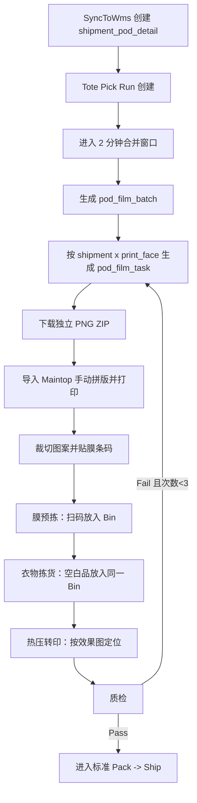

# PRD: ShipSage POD WMS 履约与逆向 / ShipSage POD WMS Fulfillment & Reverse Flow

> | Field / 字段 | Value / 值 |
> |---|---|
> | **Status / 状态** | Draft / 草稿 |
> | **Owner / 负责人** | Dennis |
> | **Contributors / 参与者** | WMS、后端、Billing |
> | **Created / 创建日期** | 2026-04-01 |
> | **Last Updated / 最后更新** | 2026-04-01 |
> | **Version / 版本** | V1.0 |
> | **Source / 来源** | 从主 PRD `5-PRD-20260324-v5-ShipSage-卖家设计器.md` 的 T8/T10 WMS 部分拆分 |

---

## I. 文档定位 / Purpose

本文件承接 ShipSage POD 项目的 **WMS 详细设计**，聚焦以下两类内容：

1. `T8` WMS 正向履约作业
2. `T10` 在 WMS 侧的取消执行、废料与报废处理

主 PRD 保留 OMS/Designer 侧能力、印刷文件生成、订单匹配和 `SyncToWms` 下发字段；本文件只展开 **WMS 接到 payload 之后** 的仓内流程。

---

## II. 与主 PRD 的边界 / Scope Boundary

### 2.1 主 PRD 保留

- 卖家侧底板管理、设计方案中心、POD 产品创建、买家设计审核
- `T6` 印刷原稿生成与 RIP 方案
- `T7` 订单匹配与 `SyncToWms` payload 定义
- `T10` 的 OMS/Billing 取消规则与费用口径

### 2.2 本文承接

- WMS 页面与作业角色
- Pick Run 后的膜打印批次生成
- 膜打印、裁切贴码、膜预拣、衣物拣货、热压、质检
- WMS 状态机与数据表
- 取消请求落到 WMS 后的执行规则
- 废料管理、报废、重印、延迟取消

---

## III. OMS → WMS 交接契约 / OMS to WMS Contract

### 3.1 SyncToWms 下发字段

| 字段 | 来源 | 用途 |
|---|---|---|
| `print_file_url` / `print_file_urls` | `pod_print_files` | 仓库下载每个印刷面的 300dpi 原稿 |
| `pod_mockup_url` | Mockup 合成结果 | 热压和预拣时查看效果图 |
| `pod_press_position` | 底板配置 | 提供热压定位参数 |
| `pod_scheme_id` | `pod_design_schemes` | 追踪订单使用的设计方案版本 |
| `pod_product_item_id` | `pod_product_items` | 追踪命中的 POD 产品映射 |
| `order_no` | 订单主数据 | 仓内展示来源单号 |
| `platform` | 订单主数据 | 标记 TEMU/TK/Amazon 等来源 |
| `blank_sku` | SKU/映射结果 | 拣货与异常排查 |
| `size_code` | 订单属性 | 选择对应尺寸印刷文件 |
| `color_label` | 订单属性 | 仓内展示和拣货辅助 |
| `print_faces` | 设计方案 | 标记需处理的印刷面集合 |

### 3.2 WMS 交接落表

`SyncToWms` 到达 WMS 后，先创建 `app_wms_shipment_pod_detail` 作为 **交接锚点**。  
后续 Pick Run、膜打印批次、膜任务、取消标记等都围绕该记录展开。

---

## IV. T8: WMS POD DTF 正向作业 / Forward Fulfillment

### 4.1 页面与角色

| 页面 | URL | 角色 | 用途 |
|---|---|---|---|
| 印刷批次列表 | `/wms/pod/print-batches` | 膜打印操作员 | 查看待打印批次、下载 PNG、标记打印与裁切完成 |
| 膜预拣页面 | `/wms/pod/film-pre-pick` | 拣货员 | 扫膜条码，显示 Bin 编号与效果图 |
| 热压队列 | `/wms/pod/heat-press` | 热压操作员 | 查看待热压订单、参考效果图执行热压 |
| My Tasks | `/wms/pod/my-tasks` | Warehouse Operator | 汇总个人待处理 POD 任务 |

### 4.2 总体流程

### 4.3 Step 级执行说明

| Step | 环节 | 系统动作 | 操作员动作 |
|---|---|---|---|
| 1 | Tote Pick Run 创建 | 建立 Bin ↔ Shipment 映射 | 扫 Cart 条码，选择 Bin 数量 |
| 2 | 生成膜打印批次 | Pick Run 创建后进入 2 分钟合并窗口，生成 `pod_film_batch` | 无 |
| 3 | 膜任务生成 | 按每个 shipment 的每个印刷面生成 `pod_film_task` | 无 |
| 4 | 膜打印 | WMS 提供当前批次独立 PNG ZIP | 在 Maintop 中导入并手动拼版打印 |
| 5 | 裁切 + 贴膜条码 | 系统打印/生成条码标签 | 裁切图案，在每片旁贴膜条码 |
| 6 | 膜预拣 | 扫条码后显示 Bin 编号、效果图、热压位置 | 将膜放入对应 Bin |
| 7 | 衣物拣货 | 校验当前 Bin 订单与空白品 SKU | 将衣物放入同一 Bin |
| 8 | 热压 | 根据 `mockup_url + press_position` 展示定位参考 | 多面逐面热压 |
| 9 | 质检 | 记录通过/失败并决定是否重印 | 扫码提交 QC 结果 |

### 4.4 `film_batch` 生成规则

| 规则 | 说明 |
|---|---|
| 触发时机 | Tote Pick Run 创建后触发 |
| 合并窗口 | 默认 2 分钟 |
| 提前出批 | 当窗口内订单数达到阈值时可立即建批 |
| 合并范围 | 同仓库、同窗口内的 Pick Run 可合并 |
| MVP 拼版 | ShipSage 只提供各订单独立 PNG，Maintop 手动拼版 |

### 4.5 MVP 拼版策略

**MVP 口径：ShipSage 不在 WMS 内完成自动拼版。**

- WMS 按批次提供独立 PNG ZIP 下载
- 操作员在 Maintop 内拖拽排版
- 白墨、ICC、打印机驱动由 RIP 完成
- `nesting_file_url` 在 MVP 为空
- 膜利用率先允许人工录入

### 4.6 多面订单与重印

| 场景 | 规则 |
|---|---|
| 多面订单 | 正面/背面/袖子按面拆分为独立 `pod_film_task` |
| 预拣入 Bin | 同一订单多个面可分别扫码，但最终归入同一 Bin |
| 热压顺序 | 按效果图和 `press_position` 逐面处理 |
| QC Fail | 仅失败的面回到 `pending` / 重新生成打印任务 |
| 最大重印次数 | 默认 3 次，超过后人工介入 |

### 4.7 WMS 状态机

#### `app_wms_pod_film_batch.status`

`pending -> nesting -> printing -> printed -> cutting -> cut_done -> completed`

#### `app_wms_pod_film_task.status`

`pending -> printing -> printed -> cut_done -> pre_picked -> pick_done -> heat_pressing -> qc_pass/qc_fail -> done`

### 4.8 WMS 数据模型

#### `app_wms_pod_film_batch`

| 字段 | 说明 |
|---|---|
| `pick_run_id` | 关联 Tote Pick Run |
| `batch_picking_id` | 大单路径下可选关联 |
| `warehouse_id` | 仓库 ID |
| `status` | 批次状态 |
| `nesting_file_url` | 拼版文件 URL，MVP 可为空 |
| `printed_at` / `cut_at` / `notified_at` | 打印、裁切、通知时间 |

#### `app_wms_pod_film_task`

| 字段 | 说明 |
|---|---|
| `film_batch_id` | 所属膜打印批次 |
| `wms_shipment_id` | 锚定 shipment |
| `print_face` | front/back/left_sleeve/right_sleeve |
| `barcode` | 膜条码 |
| `print_file_url` | 该面的印刷文件 |
| `status` | 任务状态 |
| `pick_run_id` | 所属 Pick Run |
| `tote_bin_no` | 对应 Bin 编号 |
| `reprint_count` | 重印次数 |

#### `app_wms_shipment_pod_detail`

| 字段 | 说明 |
|---|---|
| `wms_shipment_id` | WMS shipment 一对一 |
| `mockup_url` | 效果图 |
| `press_position` | 热压位置 |
| `order_no` / `platform` | 展示来源订单信息 |
| `design_scheme_name` | 展示当前设计方案 |
| `blank_sku` / `size_code` / `color_label` | 拣货与展示辅助 |
| `print_faces` | 本订单需印刷的面 |
| `cancel_pending` | 延迟取消标记 |
| `cancel_fee` / `cancel_fee_type` | 取消费用信息 |

---

## V. T10: WMS 侧取消执行 / Reverse Execution in WMS

### 5.1 输入来源

WMS 不负责判断“是否允许取消”，该判断由 OMS 基于 `GT_Transaction.pod_print_status` 完成。  
WMS 只负责接收 OMS 下发的取消意图，并按当前仓内状态执行。

### 5.2 WMS 执行规则

| OMS 状态 | WMS 处理 |
|---|---|
| `pending` | 直接终止后续仓内流程，无物料处理 |
| `batched` | 从未开工的后续作业队列中移除 |
| `printing / ready` | 不打断已开始打印；标记对应图案区域 `skip`，后续热压跳过 |
| `heat_pressing` + `cancel_pending=1` | 当前热压完成后再执行取消 |
| `qc_pass` | 执行成品报废或废料暂存，并将结果回写 OMS |

### 5.3 批次中取消订单

| 批次阶段 | WMS 处理 |
|---|---|
| 未打印 | 从批次中移除该 shipment |
| 打印中 | 不中断打印，图案区域标记 `skip` |
| 已裁切/待热压 | 热压页面隐藏或标记为“跳过” |
| 已完成热压 | 转废料区，等待报废处理 |

### 5.4 延迟取消

当平台取消发生在 `heat_pressing`：

1. OMS 标记 `cancel_pending = 1`
2. WMS 完成当前热压动作，避免中途停机
3. QC 完成后检查 `cancel_pending`
4. 若标记存在，则不进入正常发货，转入报废/费用流程

### 5.5 废料与报废

| 类型 | 来源 | 处理方式 |
|---|---|---|
| 作废膜片段 | 打印后取消 / QC fail | 膜废料区暂存，月底统一处理 |
| 已热压成品 | `qc_pass` 后取消 | 成品废料区暂存，做 DISPOSAL |
| 重印失败品 | 重印上限后仍失败 | 人工判定退款/报废 |

---

## VI. WMS 侧验收建议 / Acceptance

| 模块 | 验收点 |
|---|---|
| 批次生成 | Pick Run 创建后能正确进入合并窗口并生成 `pod_film_batch` |
| 膜任务 | 多面订单能拆分出正确数量的 `pod_film_task` |
| 膜预拣 | 扫条码能正确显示 Bin、效果图和热压位置 |
| 热压 | 操作员能看到 `mockup_url + press_position` 参考信息 |
| QC | Fail 时仅重触发失败面，Pass 时进入标准 Pack -> Ship |
| 取消 | `skip / cancel_pending / 报废` 等分支执行正确 |

---

## VII. 待确认问题 / Open Questions

| # | 问题 |
|---|---|
| 1 | Pick Run 合并窗口的默认阈值和“立即建批”阈值分别是多少？ |
| 2 | 多面订单是否要求所有面的膜都预拣完成后才能解锁衣物拣货？ |
| 3 | `print_file_url` 是否最终统一为数组字段，还是保留单面/多面两种 payload 形式？ |
| 4 | WMS 页面是否需要显示 OMS 侧的取消费用结果，还是只显示“取消/跳过/报废”状态？ |
| 5 | 膜条码打印是复用现有条码能力还是新建 POD 专用模板？ |

---

## VIII. References / 参考资料

- [5-PRD-20260324-v5-ShipSage-卖家设计器.md](./5-PRD-20260324-v5-ShipSage-卖家设计器.md)
- [6-POD-操作指导手册.md](./6-POD-操作指导手册.md)
- [ShipSage_POD_WMS_Mobile_Demo.html](./ShipSage_POD_WMS_Mobile_Demo.html)
