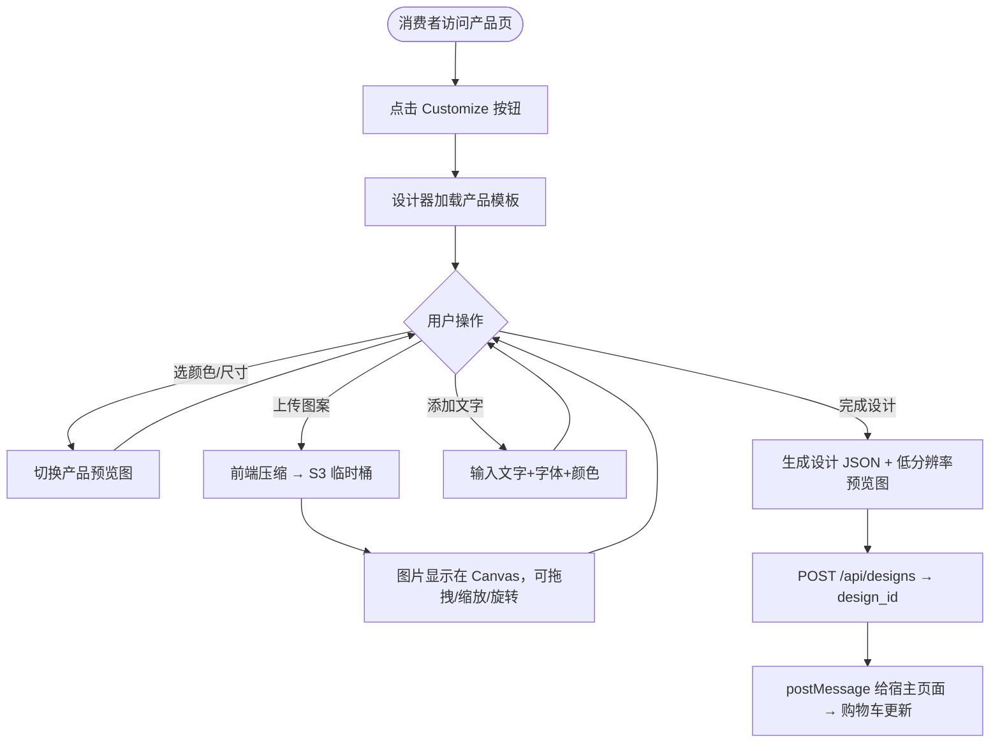
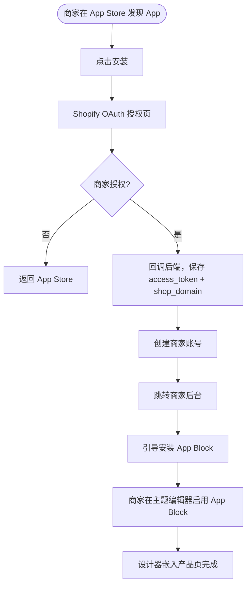
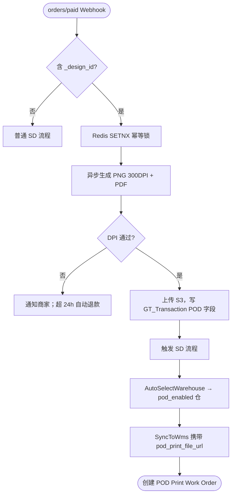

# PRD: POD 产品定制设计器 / POD Product Design Studio

> | Field / 字段 | Value / 值 |
> |---|---|
> | **Status / 状态** | Draft / 草稿 |
> | **Owner / 负责人** | Dennis |
> | **Contributors / 参与者** | 前端、后端、WMS、Billing、BI |
> | **Approved By / 审批人** | — |
> | **Approved Date / 审批日期** | — |
> | **Decision / 审批决定** | Pending / 待审批 |
> | **Created / 创建日期** | 2026-03-17 |
> | **Last Updated / 最后更新** | 2026-03-19 |
> | **Version / 版本** | v4.0 |

---

## History / 变更历史

| Version | Author | Date | Comment / 说明 |
|---------|--------|------|----------------|
| V1.0 | PM | 2026-03-17 | 初稿，基于 Phase 1 RDD + Phase 2 Architecture |
| V2.0 | PM | 2026-03-17 | 新增 ShipSage SD流程、WMS印刷队列、Billing钱包模块 |
| V3.0 | PM | 2026-03-17 | 新增工厂API对接（方案A）；确认Fabric.js方案；确认Free定价 |
| V4.0 | Dennis | 2026-03-19 | **整合版**：V3为主骨架，融合V2的ShipSage仓内印刷履约。核心调整：(1)履约走ShipSage自营仓而非外部工厂API；(2)选仓不写死，Admin配置POD试点仓；(3)SD流程最小化扩展；(4)印刷作业作为WMS VAS工单插入Pick→Pack之间；(5)计费复用现有Billing Handling Fee，新增DTG印刷收费项；(6)BI毛利分析新增POD成本维度 |

---

## I. Glossary / 术语说明

| Term / 术语 | Definition / 定义 |
|---|---|
| POD | 按需印刷（Print-on-Demand），收到订单后才生产 / Produce only after order is placed |
| Design Studio | 供消费者在网页中定制产品图案的交互工具 / In-browser tool for customers to customize product designs |
| Fabric.js | 主流 HTML5 Canvas 设计库，支持对象模型和 SVG 导出 |
| Mockup | 将设计叠加到产品图上的预览图 / Preview image with design composited onto product photo |
| Shopify App | 以 Shopify OAuth 认证集成到 Shopify 商店的 SaaS 插件 |
| App Block | Shopify 主题中可拖拽放置的 UI 区块，用于嵌入设计器 |
| Embed Widget | 可嵌入任意网站的 iframe/JS 脚本组件 |
| Print-ready File | 300dpi PNG + PDF，用于仓内 DTG 印刷的高清设计稿 |
| DTG | Direct to Garment，数码直喷印刷工艺 |
| Design Token / design_id | 消费者完成设计后生成的唯一标识，随 Shopify 订单传递至 ShipSage |
| SD 流程 | Smart Distribution，ShipSage 自动化出库调度流程（6步：Confirm→Group→AllocateInventory→CreateShipment→Label→SyncToWMS） |
| POD Print Work Order | POD 专属 WMS 工单，复用 VAS Work Order 机制，插入 Pick→Pack 之间 |
| Blank SKU | 空白品，未印刷的原始商品（如白色 T 恤毛坯）|
| Print Area | 印刷区域，商品上允许印刷的坐标范围 |
| pod_enabled 仓库 | Admin 后台标记可执行 POD 印刷的试点仓库，AutoSelectWarehouse 只路由至此类仓库 |
| Handling Fee | ShipSage Billing 中的操作费，按订单/件计费；POD 印刷费作为新收费项添加至此 |
| company_id | ShipSage 多货主隔离的租户 ID，所有查询必须携带 |
| HMAC-SHA256 | 用于 Webhook/API 请求签名验证的加密算法 |

---

## II. Business Background / 业务背景

### 2.1 Background / 背景

**[CN]**
ShipSage 已在美国建立多个自营仓，具备完整的仓配一体化能力，但目前仅提供纯仓储+发运服务，缺乏前端流量入口，POD 业务无法启动。当前 POD 行业（Printful/Printify/Customily/Zakeke）核心痛点：
- SaaS 订阅费用高（$29–$99/月），商家品牌控制权弱
- 均无美国本土生产能力，交期 7–15 天
- 消费者只能选择预设款，无法在店铺内自主定制

POD Design Studio 是 ShipSage 切入 POD 市场的核心产品：
1. **前端**：自研 SaaS 设计器，以 **Shopify App** 形式上架 Shopify App Store，同时支持 **Embed Widget**（JS Snippet）嵌入任意第三方电商网站，供商家客户安装使用
2. **后端履约**：消费者下单后，设计文件通过 ShipSage 现有 SD/WMS 流程在**仓内完成 DTG 印刷和发运**，实现「接单 → 仓内生产 → 2–4 天发运」完整闭环

MVP 范围：T 恤品类 × 一个 POD 试点仓（Admin 后台配置）× Shopify 平台

**[EN]**
ShipSage operates multiple US fulfillment centers with full warehousing and shipping capability, but currently lacks a consumer-facing product customization entry point. POD Design Studio fills this gap by providing a SaaS design tool (Shopify App + Embed Widget) that routes fulfilled orders to ShipSage's in-house DTG printing operations, achieving a complete loop: order → in-warehouse print → 2–4 day ship.

### 2.2 Business Goals / 业务目标

| Goal Type | Goal / 目标 | Metric / 指标 | Target / 目标值 |
|---|---|---|---|
| 用户增长 | Shopify App Store 安装量 | 上线后 6 个月 | ≥ 200 家店铺 |
| 转化率 | 设计器进入后加购转化 | 进入设计器 → 加购 | ≥ 35% |
| 收入 | POD 订单月收入 | 上线后 12 个月 | ≥ $10,000 MRR |
| 运营效率 | 印刷文件生成自动化率 | 订单自动生成文件占比 | ≥ 95% |
| 履约效率 | 仓内印刷作业准时完成率 | 4h 内开始印刷 | ≥ 90% |
| 用户满意度 | App Store 评分 | Shopify App Store | ≥ 4.5 ⭐ |

### 2.3 Stakeholders / 相关方

| Team / 团队 | Role / 角色 | Comment / 备注 |
|---|---|---|
| 产品 | Dennis (PM) | 产品负责人 |
| ShipSage 运营 Admin | 仓盛运营管理员 | POD 试点仓配置、异常处理、生产监控 |
| 仓库团队 | WMS 操作员 | 执行 DTG 印刷作业、质检、发运 |
| 商家（外部）| Shopify 卖家 / 非 Shopify 网站站主 | 安装 App，管理定制商品 |
| 消费者（外部）| 终端购物者 | 在 Shopify/网站定制并购买商品 |
| 研发团队 | 前端/后端/测试 | 设计器、SD扩展、WMS工单、Billing新增项 |

### 2.4 Out of Scope / 不在本期范围

| Excluded / 排除项 | Reason / 原因 |
|---|---|
| 3D / AR 产品预览 | 复杂度高，后续迭代 |
| AI 图案自动生成（文生图）| V1 专注基础设计器 |
| 移动端原生 App 设计器 | Web 响应式优先 |
| 多语言（非英/中）| 美国市场优先 |
| 直接对接外部 Printful/Printify 履约 | ShipSage 自营仓优先 |
| 外部工厂 REST API 对接 | 作为后备降级方案，非 MVP 必须项 |
| 独立钱包/充值模块 | 复用现有 ShipSage Billing Handling Fee，无需新建钱包 |

---

## III. Users & Scenarios / 用户与场景

### 3.1 User Roles / 用户角色

| Role / 角色 | Description | Pain Points / 痛点 | Needs / 诉求 |
|---|---|---|---|
| Shopify 商家 | 在 Shopify 上销售 POD 商品的卖家 | 现有工具贵；印刷文件需手动处理；交期长 | 低成本安装、自动出印刷文件、仓内快速发运 |
| 非 Shopify 站主 | 使用 WordPress/Wix 等建站的卖家 | 无法用 Shopify App | 一行 JS 代码嵌入，无需技术背景 |
| 终端消费者 | 在商品页定制产品的购买者 | 工具难用；预览不真实 | 简单直觉体验，所见即所得 |
| ShipSage 运营 Admin | 管理 POD 试点仓、监控印刷作业 | 无统一监控后台 | 印刷作业监控、异常告警、选仓配置 |
| 仓库操作员 | 执行 DTG 印刷作业 | 无系统化操作入口 | WMS 印刷队列、作业认领、质检提交 |

### 3.2 Core Scenarios / 核心场景

**场景一**：消费者在 Shopify 店铺 T 恤商品页点击「Customize」，打开设计器，上传图案，预览效果，加入购物车，完成支付。系统自动生成 300DPI 印刷文件，通过 ShipSage SD 流程路由至 POD 试点仓，WMS 操作员认领印刷工单，完成 DTG 印刷→质检→打包→发运，消费者 2–4 天收货。

**场景二**：商家在 Shopify App Store 安装本 App，OAuth 授权后进入后台，10 分钟内完成第一个产品模板配置并发布上线。

**场景三**：非 Shopify 网站站主注册账号，获取 Embed JS Snippet，粘贴到自有网站，设计器正常弹出，订单回传到管理后台，同样走 ShipSage 履约。

**场景四**：WMS 操作员登录 WMS，查看 POD 印刷队列，认领作业，按印刷文件执行 DTG 印刷，质检合格后提交，系统自动触发打包发运流程。

---

## IV. Design Approach / 设计思路

### 4.1 Core Design Principles / 核心设计理念

1. **所见即所得**：设计器预览必须与最终印刷效果高度一致
2. **零门槛上手**：3 步完成定制（选产品 → 上传/编辑 → 加购）
3. **嵌入即插即用**：Shopify App 一键安装；非 Shopify 网站一行 JS
4. **印刷文件全自动化**：订单支付后系统自动生成 PNG + PDF，零人工介入
5. **最小化侵入现有系统**：SD 流程不改，WMS VAS 机制复用，Billing 新增一个收费项
6. **选仓灵活**：POD 试点仓通过 Admin 配置 `pod_enabled=1`，不写死任何仓库代码

### 4.2 Solution Comparison / 方案选择

#### 前端设计器引擎

| Option | Pros | Cons | Decision |
|---|---|---|---|
| **Fabric.js** | SVG 导出支持（印刷必须）；对象模型成熟；POD 领域案例最多 | 大量对象时性能弱于 Konva | ✅ 采用 |
| Konva.js | 高性能 | **不支持 SVG 导出**（印刷致命缺陷）| ❌ 放弃 |

#### 履约方式

| Option | Pros | Cons | Decision |
|---|---|---|---|
| **ShipSage 自营仓内 DTG 印刷** | 利用现有仓配能力；2–4 天交期；成本可控 | 需在 WMS 新增 Print Work Order | ✅ 采用 |
| 外部工厂 REST API 对接 | 无需仓内设备 | 交期长；依赖第三方 | ❌ 降级备案 |

#### Shopify 集成方式

| Option | Pros | Cons | Decision |
|---|---|---|---|
| **Shopify Public App + App Block** | 上架 App Store；Theme Extension 无缝嵌入 | 需通过审核（1–2 周）| ✅ 采用 |
| Custom App | 无需审核，快 | 只能单一店铺使用 | ❌ 仅测试阶段 |

#### 非 Shopify 嵌入

| Option | Pros | Cons | Decision |
|---|---|---|---|
| **JS Snippet（异步加载）** | 一行代码嵌入；任意网站 | 需处理跨域（postMessage）| ✅ 采用 |

#### 计费方式

| Option | Pros | Cons | Decision |
|---|---|---|---|
| **复用 ShipSage Billing Handling Fee** | 无需新建模块；与现有账单体系统一 | 需新增 DTG 印刷收费 service_id | ✅ 采用 |
| 独立钱包充值模块 | 独立清晰 | 重复建设，增加开发量 | ❌ 放弃 |

### 4.3 Key Design Decisions / 关键设计决策

| # | Decision / 决策 | Rationale / 理由 |
|---|---|---|
| 1 | 设计器以 React + Fabric.js 实现，构建为独立 Web App | 同时服务 Shopify App Block 和 Embed Widget，代码最大复用 |
| 2 | Shopify App 使用 Remix 框架 | 内置 OAuth、Billing API、Polaris UI 组件库 |
| 3 | 印刷文件服务端生成（Sharp.js + pdf-lib）| 质量一致，不依赖客户端性能 |
| 4 | 设计数据以 JSON 序列化存储 | 支持随时重新渲染和文件重新生成 |
| 5 | 选仓通过 Admin 后台 `pod_enabled=1` 标记，不写死仓库代码 | 灵活扩展，新增试点仓只需改配置 |
| 6 | SD 流程不改，仅在 Webhook 接单层增加 `_design_id` 提取，GT_Transaction 新增 3 个 POD 字段 | 最小化对现有系统的侵入 |
| 7 | 印刷作业作为 WMS VAS Print Work Order，插入 Pick→Pack 之间 | 复用 VAS 工单机制，无需新建系统 |
| 8 | DTG 印刷费通过 ShipSage Billing Handling Fee 新增 service 收费，成本计入 BI 毛利分析 | 与现有计费和 BI 体系对齐 |
| 9 | Embed Widget 通过 postMessage 通信 | 跨域安全，传递加购事件和设计数据 |
| 10 | V1 定价：Free；服务器 AWS us-east-1 | 快速积累用户 |

---

## V. Menu Configuration / 菜单配置

| Application | Menu Path | URL | Type | Icon | Permission |
|---|---|---|---|---|---|
| POD Platform (Shopify App) | Dashboard | /admin/dashboard | page | mdi-view-dashboard | Merchant |
| POD Platform (Shopify App) | Products / Templates | /admin/products | menu | mdi-tshirt-crew | Merchant |
| POD Platform (Shopify App) | Products / New | /admin/products/new | page | — | Merchant |
| POD Platform (Shopify App) | Orders | /admin/orders | menu | mdi-package-variant | Merchant |
| POD Platform (Shopify App) | Orders / Detail | /admin/orders/:id | page | — | Merchant |
| POD Platform (Shopify App) | Embed Code | /admin/embed | menu | mdi-code-tags | Merchant |
| POD Platform (Shopify App) | Settings | /admin/settings | menu | mdi-cog | Merchant |
| ShipSage ADMIN | POD / Print Jobs Monitor | /admin/pod/print-jobs | menu | mdi-printer | Admin |
| ShipSage ADMIN | POD / Pilot Warehouse Config | /admin/pod/warehouse-config | menu | mdi-warehouse | Admin |
| ShipSage WMS | POD / Print Queue | /wms/pod/print-queue | menu | mdi-printer-check | Warehouse Operator |
| ShipSage WMS | POD / My Tasks | /wms/pod/my-tasks | menu | mdi-clipboard-check | Warehouse Operator |
| ShipSage BI | Gross Margin / POD Cost | /bi/gross-margin?module=pod | page | mdi-chart-bar | Admin / Finance |

---

## VI. Initialization / 初始化配置

| Application | Content / 初始化内容 | Comment / 备注 |
|---|---|---|
| Shopify App | 以美国法人主体在 Shopify Partner 后台注册 App，配置 OAuth scopes：`write_products, read_orders, write_script_tags` | 法人已就绪 |
| Shopify App | 提交 App 至 Shopify App Store 审核，V1 定价：Free | 审核周期约 1–2 周 |
| POD Platform 后端 | 初始化产品模板库：T恤（5色，XS–2XL），含印刷区域配置（正面：28×32cm）| 上线前完成 |
| POD Platform 后端 | AWS S3 Bucket 配置（模板图、用户上传图、印刷文件；CDN + 私有桶分离）| 上线前完成 |
| POD Platform 后端 | 配置 Shopify Webhook：`orders/paid`（触发印刷文件生成 + SD 流程）| 上线前完成 |
| ShipSage ADMIN | 在 Admin 后台将指定试点仓库标记 `pod_enabled=1`，配置 DTG 设备型号、印刷区域尺寸 | 由运营 Admin 配置，不写死代码 |
| ShipSage OMS | 在 app.shipsage.com 创建 POD 专属 company_id；配置商家账户模板（默认费率）| 与现有账户体系对齐 |
| ShipSage Billing | 在 `app_shipsage_service` 中新增 service：`POD-DTG-Print-Fee`（DTG 印刷费，$5/件）| 通过 Admin Billing 配置界面操作 |
| ShipSage Billing | 在 `app_shipsage_service_quote` 中配置 DTG 印刷费报价 | 试点仓报价先配模板，后可按 company 定制 |
| 试点仓库 | 安装 DTG 印刷设备（Kornit/Brother GTX）；备货空白品：白色/黑色 T恤各 XS–2XL 各 50 件 | 设备采购周期 4–8 周，需提前启动 |
| Embed Widget | CDN 部署 `widget.js`；生成默认 JS Snippet 模板 | 上线前部署 |

---

## VII. Risk / 风险评估

| Application | Module | Priority | Risk / 风险描述 | Solution / 应对方案 |
|---|---|---|---|---|
| Design Studio | 设计器 | P1 | Canvas 与服务端印刷文件颜色/位置不一致（WYSIWYG 失真）| 服务端用 headless Fabric.js 渲染同一 JSON；上线前颜色校准测试 |
| POD Platform | 订单接入 | P1 | Shopify Webhook 重复推送，同一订单创建两次印刷文件 | `shopify_order_id` UNIQUE 约束 + Redis SETNX 幂等锁（TTL=30s）|
| POD Platform | 印刷文件 | P1 | 印刷文件 DPI 不足，付款后订单卡死 | 检测不通过立即通知商家；超 24h 未处理自动退款 |
| Shopify App | 审核 | P1 | Shopify App Store 审核被拒 | 提前阅读审核指南；Custom App 先内测；准备 Demo Store |
| ShipSage WMS | 印刷设备 | P1 | 试点仓 DTG 设备故障，订单积压 | Print Work Order 超 4h 未开始触发告警；支持手动重新路由至备用设备或降级外发 |
| ShipSage | 选仓 | P2 | 试点仓库存空白品耗尽，订单无法分配 | AllocateInventory 步骤乐观锁；库存耗尽自动下架 Shopify 商品；提前预警 |
| POD Platform | 内容安全 | P2 | 消费者上传侵权/违规图案 | 上传时调用 AWS Rekognition 检测；用户协议免责；建立 DMCA 响应流程 |
| ShipSage Billing | 计费 | P2 | DTG 印刷费收费项配置错误，导致漏计或多计 | Billing 配置后需测试订单验证费用明细；Admin 审核双签 |
| POD Platform | 性能 | P2 | 用户上传大图（>10MB）导致浏览器卡顿 | 前端上传前压缩至 ≤5MB；限制最大 20MB；后端异步处理 |
| Embed Widget | 兼容性 | P3 | 宿主网站 CSP 策略阻止 iframe 加载 | 文档注明 CSP 配置要求；提供白名单模板 |
| SG 仓库 | 颜色偏差 | P3 | 屏幕 RGB vs 实际 DTG 印刷颜色偏差，消费者投诉 | 设计器加颜色模式提示；建立样品审核流程 |
| POD Platform | 数据安全 | P3 | 消费者上传图片泄露 | S3 签名 URL（有效期 1h）；S3 SSE-AES256 加密存储 |

---

## VIII. Scope / 开发范围

| Application | Module | Task # | Task Name | Description |
|---|---|---|---|---|
| POD Platform | Design Studio | T1 | 产品定制设计器 | Fabric.js Canvas 编辑器：上传、文字、效果、实时预览、加购 |
| POD Platform | Shopify App | T2 | Shopify App 集成 | OAuth、App Block 嵌入、Cart API、Billing API |
| POD Platform | Embed Widget | T3 | Embed Widget（非 Shopify）| JS Snippet 生成、iframe 通信、订单回传 |
| POD Platform | 产品管理 | T4 | 商家后台 — 产品模板管理 | 上传模板图、定义印刷区域、管理 SKU、发布 |
| POD Platform | 订单接入 | T5 | 订单接入与印刷文件生成 | Shopify Webhook 接单、DPI 检测、PNG+PDF 生成、绑定 GT_Transaction |
| ShipSage OMS/SD | SD 流程扩展 | T6 | SD 流程最小化扩展 | GT_Transaction 新增 POD 字段；AutoSelectWarehouse 过滤 pod_enabled 仓；SyncToWms 携带印刷文件 URL |
| ShipSage WMS | 印刷作业 | T7 | WMS POD Print Work Order | 复用 VAS 工单机制；印刷队列、操作员认领、执行、质检提交；插入 Pick→Pack 之间 |
| ShipSage Billing | 计费 | T8 | Billing — DTG 印刷收费项 | 在 Handling Fee 中新增 POD-DTG-Print-Fee service；自动触发计费；成本写入 BI |
| ShipSage Admin | 监控 | T9 | Admin — POD 生产监控 | 印刷作业监控面板、异常告警、试点仓配置 |
| ShipSage BI | 成本分析 | T10 | BI — POD 成本维度 | 毛利分析新增 DTG 印刷成本维度；PL4 成本纳入 POD |

---

## IX. Task Details / 任务详细设计

---

### T1: 产品定制设计器 / Product Design Studio

> 基于 Fabric.js 的浏览器端设计器，消费者可选择产品颜色/尺寸、上传图案、添加文字、实时预览，并将设计数据序列化后加入购物车。

#### 1.1 业务流程



#### 1.2 界面线框图

```
┌──────────────────────────────────────────────────────────────────┐
│ ← 返回商店                              [Brand Logo]             │
├──────────────────┬────────────────────────────┬──────────────────┤
│ 工具栏            │     Canvas 预览区            │  产品选项         │
│                  │                            │                  │
│ 📤 Upload Image  │  ┌──────────────────────┐  │ 产品: [T恤 ▼]    │
│ 🔤 Add Text      │  │   ~~~产品底图~~~      │  │                  │
│ 🎨 Background    │  │  ┌──────────────┐   │  │ 颜色: ⚫ ⚪ 🔴   │
│ ↩ Undo  ↪ Redo  │  │  │  设计区域     │   │  │                  │
│ 🗑 Delete        │  │  │ [图案/文字层] │   │  │ 尺寸: S M L XL  │
│ 📐 Align         │  │  └──────────────┘   │  │                  │
│                  │  └──────────────────────┘  │ 数量: [−][1][+]  │
│                  │  缩放 ──●── / 旋转          │                  │
│                  │                            │ $24.99           │
│                  │                            │ [🛒 Add to Cart] │
└──────────────────┴────────────────────────────┴──────────────────┘
```

#### 1.3 功能需求（P0）

| US | 功能 | 验收标准（Given/When/Then）|
|---|---|---|
| US-101 | 产品模板加载 | Given 点击 Customize When 设计器加载 Then 3s 内显示产品底图和虚线印刷区域 |
| US-102 | 图片上传定位 | Given 上传 PNG/JPG/SVG(≤20MB) When 完成上传 Then 3s 内图片出现在 Canvas 中心，可拖拽/缩放/旋转 |
| US-103 | 文字添加样式 | Given 点击 Add Text When 输入内容+字体+颜色 Then 文字实时显示在 Canvas，可拖拽定位 |
| US-104 | 撤销/重做 | Given 任意操作 When Ctrl+Z Then 上一步取消，最多 20 步历史 |
| US-105 | 加入购物车 | Given 设计区域有内容 When 点击加购 Then design_id 写入购物车 line_item 属性，购物车更新 |
| US-106 | 空设计拦截 | Given 设计区域为空 When 点击加购 Then 弹出提示「请先添加图案或文字」|

#### 1.4 数据库设计

**`pod_designs` 表**（新建，POD Platform DB）

| Field | Type | Description |
|---|---|---|
| id | INT PK | 主键 |
| design_uuid | VARCHAR(36) UNIQUE | 设计唯一标识（UUID v4）|
| shop_id | INT FK | 所属商店 |
| product_template_id | INT FK | 产品模板 |
| variant_color | VARCHAR(50) | 选择的颜色 |
| variant_size | VARCHAR(20) | 选择的尺寸 |
| canvas_json | JSON | Fabric.js Canvas 序列化 JSON |
| preview_image_url | VARCHAR(500) | 低分辨率预览图 S3 URL |
| print_file_png_url | VARCHAR(500) | 300DPI PNG 印刷文件 S3 URL |
| print_file_pdf_url | VARCHAR(500) | PDF 印刷文件 S3 URL |
| print_file_status | ENUM | pending/processing/done/failed |
| shopify_order_id | VARCHAR(100) UNIQUE | 关联 Shopify 订单 ID（幂等键）|
| gt_transaction_id | INT | 关联 GT_Transaction.transaction_id |
| created_at | DATETIME | 创建时间 |
| expires_at | DATETIME | 过期时间（未下单 7 天后清理）|

---

### T2: Shopify App 集成 / Shopify App Integration

> OAuth 安装、Theme App Extension App Block 嵌入产品页、Cart API 加购、Shopify Billing API。

#### 2.1 商家安装流程



#### 2.2 功能需求（P0）

| US | 功能 | 验收标准 |
|---|---|---|
| US-201 | OAuth 安装 | Given 商家点击安装 When OAuth 完成 Then access_token 保存，跳转后台，<30s |
| US-202 | App Block 嵌入 | Given 商家在主题编辑器启用 App Block When 消费者访问商品页 Then Customize 按钮正常显示 |
| US-203 | 购物车写入 | Given design_id 生成 When postMessage 触发 Then line_item 携带 `_design_id` 属性加入购物车 |
| US-204 | Webhook 监听 | Given 消费者支付 When orders/paid 触发 Then 后端 5 分钟内生成印刷文件 |

---

### T3: Embed Widget（非 Shopify）

> JS Snippet 一行代码嵌入任意网站，通过 postMessage 跨域通信，订单回传到 POD Platform 管理后台。

```html
<!-- 商家在自有网站粘贴此代码 -->
<script src="https://cdn.shipsage-pod.com/widget.js"
        data-shop-id="YOUR_SHOP_ID"
        data-product-id="PRODUCT_ID"></script>
```

#### 3.1 功能需求（P0）

| US | 功能 | 验收标准 |
|---|---|---|
| US-301 | Widget 加载 | Given 商家粘贴 JS Snippet When 消费者访问页面 Then 设计器 Widget 正常弹出，<3s |
| US-302 | 订单回传 | Given 消费者完成设计并提交 When 宿主页面收到 postMessage When design_id 回传 POD Platform 后端 |
| US-303 | 多网站隔离 | Given 不同 shop_id When Widget 加载 Then 各自加载对应产品模板和品牌配置 |

---

### T4: 商家后台 — 产品模板管理

> 商家在 Shopify App Admin 中配置定制商品模板：上传产品底图、定义印刷区域坐标、管理 SKU、设置价格、发布至 Shopify 商品页。

#### 4.1 界面线框图

```
┌────────────────────────────────────────────────────────┐
│ Products / Templates                    [+ New Template]│
├────────────────────────────────────────────────────────┤
│ 产品名称          │ Blank SKU       │ 状态    │ 操作    │
│ Classic Tee      │ B+C 3001        │ Active  │ Edit   │
│ Eco Tee          │ B+C 3413        │ Draft   │ Edit   │
└────────────────────────────────────────────────────────┘

新建模板弹窗：
┌──────────────────────────────────────┐
│ New Template                      [×]│
│ 产品分类: [T-Shirt ▼]                │
│ Blank SKU: [Bella+Canvas 3001 ▼]    │
│ 印刷区域: 左 [0] 上 [0] 宽 [28] 高 [32] cm │
│ 零售价: [$] [29.99]                  │
│ [Cancel]              [Create]       │
└──────────────────────────────────────┘
```

#### 4.2 数据库设计

**`pod_product_templates` 表**

| Field | Type | Description |
|---|---|---|
| id | INT PK | 主键 |
| shop_id | INT FK | 所属商店 |
| name | VARCHAR(100) | 模板名称 |
| blank_sku | VARCHAR(50) | 空白品 SKU（如 B+C-3001-WHITE）|
| print_area_json | JSON | 印刷区域配置 {left, top, width, height, unit} |
| base_image_url | VARCHAR(500) | 产品底图 S3 URL |
| retail_price | DECIMAL(10,2) | 零售价 |
| status | ENUM | draft/active/archived |
| shopify_product_id | VARCHAR(50) | 关联 Shopify 商品 ID |
| created_at | DATETIME | 创建时间 | 
---

### T5: 订单接入与印刷文件生成

#### 5.1 业务流程



#### 5.2 GT_Transaction 扩展字段（仅新增，不改 SD 步骤）

| 新增字段 | 类型 | 说明 |
|---|---|---|
| `pod_design_id` | INT NULL | 关联 pod_designs.id |
| `pod_print_file_url` | VARCHAR(500) NULL | 印刷文件 PNG S3 URL |
| `pod_print_status` | VARCHAR(20) NULL | pending/done/failed |

---

### T6: SD 流程最小化扩展

SD 流程 6 步**不改动**，仅在两个节点扩展：

**AutoSelectWarehouse**：当 `pod_design_id IS NOT NULL` 时，仅候选 `pod_enabled=1` 的仓库。`AutoSelectWarehouseRepository.php` 新增一个 if 判断。

**SyncToWms**：当 `pod_print_file_url` 不为空时，将其追加到 WMS 同步 payload。`SyncToWmsRepository.php` 追加 pod 字段。

**试点仓配置（Admin 后台，不写死代码）**

| 配置项 | 说明 |
|---|---|
| `pod_enabled` | 1=参与 POD 选仓，0=不参与 |
| `pod_print_area` | 支持的印刷区域尺寸 JSON |
| `pod_device_type` | DTG 设备型号 |

---

### T7: WMS POD Print Work Order

#### 7.1 WMS 作业流程（插入 POD 印刷节点）

```
标准：SyncToWms → Pick → Pack → 称重 → 贴标 → Ship

POD：SyncToWms → [创建 Print Work Order]
              → Pick（拣出空白品）
              → *** DTG 印刷（操作员认领→执行→质检）***
              → Pack → 称重 → 贴标 → Ship
```

#### 7.2 操作员界面

**印刷队列 /wms/pod/print-queue**

```
┌────────────────────────────────────────────────┐
│ POD Print Queue              [↻ Refresh]       │
├─────────┬────────────┬────────┬────────┬───────┤
│ Job ID  │ Product    │Color/Sz│Waiting │Action │
├─────────┼────────────┼────────┼────────┼───────┤
│ #P1004  │ Classic Tee│White/M │2h 15m  │[Claim]│
│ #P1003  │ Classic Tee│Black/L │3h 50m  │[Claim]│
│ #P1002  │ Classic Tee│White/S │4h 10m⚠ │[Claim]│
└─────────┴────────────┴────────┴────────┴───────┘
超 4h 未认领标红预警
```

**作业执行面板**

```
┌──────────────────────────────────────────────┐
│ Print Job #P1004                             │
├──────────────────┬───────────────────────────┤
│ [产品底图]        │ 产品: Classic Tee/M/White  │
│                  │ 印刷区域: 28×32cm 正面      │
│                  │ 印刷文件: [查看 300DPI PNG] │
│                  │ DPI: 300 ✓                │
├──────────────────┴───────────────────────────┤
│ QC 结果                                      │
│ ○ Pass — 通过，进入打包                       │
│ ○ Fail — 重印（0/3 次）                       │
├──────────────────────────────────────────────┤
│ [Cancel]              [Submit QC Result]     │
└──────────────────────────────────────────────┘
```

#### 7.3 pod_print_job 表（WMS DB 新建）

| Field | Type | Description |
|---|---|---|
| id | INT PK | 主键 |
| wms_shipment_id | INT FK | 关联 wms_shipment |
| gt_transaction_id | INT | 关联 GT_Transaction |
| pod_design_id | INT | 关联 pod_designs |
| print_file_url | VARCHAR(500) | 印刷文件 S3 URL |
| product_sku | VARCHAR(100) | 空白品 SKU |
| color | VARCHAR(50) | 颜色 |
| size | VARCHAR(20) | 尺寸 |
| status | ENUM | pending/claimed/printing/qc_pass/qc_fail/done |
| operator_id | INT NULL | 操作员 ID |
| claimed_at | DATETIME NULL | 认领时间 |
| completed_at | DATETIME NULL | 完成时间 |
| reprint_count | TINYINT | 重印次数（上限 3）|
| created_at | DATETIME | 创建时间 |

**业务规则：**
- 超 4h pending → Admin 告警
- qc_fail + count < 3 → 重置 pending，count+1
- qc_fail + count = 3 → 升级告警，人工介入
- qc_pass → done，触发打包，自动计费

---

### T8: Billing — DTG 印刷收费项

#### 8.1 Billing 配置（Admin 操作，无需改代码）

| 操作 | 表 | 值 |
|---|---|---|
| 新增 service | `app_shipsage_service` | service_name='POD-DTG-Print-Fee', service_code='POD_DTG_PRINT' |
| 标准报价 | `app_shipsage_service_quote` | quote=$5.00, unit='per_item' |
| 客户定制报价 | `app_shipsage_service_quote_company` | 按 company_id 定制费率 |

#### 8.2 计费触发

```
pod_print_job.status = qc_pass
  → Billing API
  → charge_detail（service_code=POD_DTG_PRINT, amount=$5.00）
  → 关联 gt_transaction_id
  → 计入商家当月账单
```

#### 8.3 成本结构

| 费用项 | 金额 | 方向 |
|---|---|---|
| DTG 印刷材料+人工（内部成本）| ~$4.00/件 | 写入 BI 成本字段 |
| DTG 印刷收费（向商家）| $5.00/件 | 计入商家账单 |
| 平台服务费 | $1.00/单 | 现有逻辑，无需改动 |
| 运费 | 按重量/区域 | 现有 Billing，无需改动 |

---

### T9: Admin — POD 生产监控

#### 9.1 监控面板 /admin/pod/print-jobs

```
┌──────────────────────────────────────────────────────┐
│ POD Print Jobs Monitor              [↻ Refresh]      │
├───────────┬──────────────┬────────────┬──────────────┤
│ Pending   │ In Progress  │ Done/Today │ Abnormal     │
│    12     │      5       │     38     │    2 ⚠       │
├───────────┴──────────────┴────────────┴──────────────┤
│ Job ID │ Warehouse │ Status      │ Waiting │ Action   │
│ #P1001 │ SG-XXX1   │ Abnormal ⚠  │ 5h 10m  │[Reroute] │
│ #P1003 │ SG-XXX1   │ In Progress │ 1h 20m  │[Detail]  │
│ #P1004 │ SG-XXX1   │ Pending     │ 2h 15m  │[Detail]  │
└────────┴───────────┴─────────────┴─────────┴──────────┘
```

#### 9.2 试点仓配置 /admin/pod/warehouse-config

```
┌──────────────────────────────────────────────────┐
│ POD Pilot Warehouse Config                       │
├─────────────┬────────────┬──────────┬────────────┤
│ Warehouse   │ POD Enabled│ Device   │ Print Area │
├─────────────┼────────────┼──────────┼────────────┤
│ SG-XXX1     │ ✓ Yes      │ Kornit   │ 28×32cm    │
│ SG-XXX2     │ — No       │ —        │ —          │
└─────────────┴────────────┴──────────┴────────────┘
[Edit] 按钮开启/关闭 pod_enabled，配置设备型号和印刷区域
```

---

### T10: BI — POD 成本维度

> 在现有 ShipSage BI Gross Margin 和 PL4 Cost 模块中新增 POD 印刷成本维度。

#### 10.1 新增数据字段

| BI 指标 | 来源 | 说明 |
|---|---|---|
| POD Print Revenue | charge_detail（POD_DTG_PRINT）| 向商家收取的印刷费收入 |
| POD Print Cost | pod_print_job 内部成本字段 | DTG 印刷材料+人工成本 |
| POD Gross Margin | Revenue - Cost | POD 业务毛利 |
| POD Order Count | pod_print_job 完成数 | 每日/月 POD 订单量 |
| POD Reprint Rate | reprint_count > 0 / total | 重印率（质量指标）|

#### 10.2 ETL 流程

```
pod_print_job（WMS DB）
  → ETL Repository
  → shipsage_sales_fees（BI Redshift）
  → Gross Margin Dashboard 新增 POD 筛选维度
```

---

## X. Non-Functional Requirements / 非功能需求

| Category | Requirement | Target |
|---|---|---|
| 性能 | 设计器加载时间 | < 3s（4G 网络）|
| 性能 | 印刷文件生成 SLA | < 5min（支付后）|
| 性能 | 实时预览刷新 | < 500ms |
| 可用性 | POD Platform 可用性 | ≥ 99.5% |
| 安全 | 用户上传文件 | S3 签名 URL（1h 有效）+ SSE-AES256 加密 |
| 安全 | Shopify Webhook 验证 | HMAC-SHA256 签名验证 |
| 幂等 | Webhook 重复推送 | Redis SETNX + shopify_order_id UNIQUE 约束 |
| 扩展性 | 新增 POD 试点仓 | Admin 后台配置 pod_enabled，无需改代码 |
| 扩展性 | 新增产品品类 | 上传模板图 + 配置印刷区域，无需改代码 |

---

## XI. Acceptance Criteria Summary / 验收标准汇总

| Task | Key AC |
|---|---|
| T1 Design Studio | 上传图片 3s 内显示；加购后 design_id 正确写入购物车 line_item |
| T2 Shopify App | OAuth 安装 <30s；App Block 正常嵌入产品页 |
| T3 Embed Widget | JS Snippet 粘贴后设计器正常弹出，订单回传成功 |
| T4 产品模板管理 | 商家 10min 内完成模板配置并发布 |
| T5 订单接入 | 支付后 5min 内生成 300DPI PNG+PDF；幂等测试通过 |
| T6 SD 扩展 | POD 订单仅路由至 pod_enabled=1 仓库；非 POD 订单不受影响 |
| T7 WMS 工单 | 操作员认领→印刷→质检全流程可操作；超 4h 告警触发 |
| T8 Billing | qc_pass 后自动生成 POD_DTG_PRINT charge_detail；费用出现在账单 |
| T9 Admin 监控 | 印刷作业状态实时可见；异常作业可手动 Reroute |
| T10 BI | Gross Margin 可按 POD 维度筛选；POD 毛利数据正确 |

---

*文档版本 v4.0 — 整合 PRD-v2（ShipSage 仓内履约）与 3-PRD-20260317-v3（Design Studio SaaS）*
