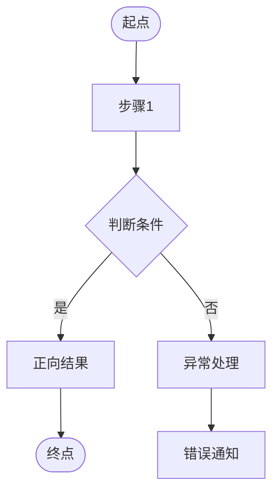
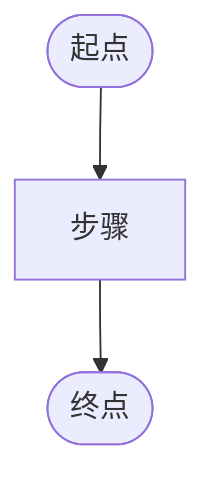

# PRD 模板

## 文档信息

| 项目 | 内容 |
|------|------|
| **状态** | [草稿/审核中/已批准] |
| **负责人** | [产品负责人姓名] |
| **贡献者** | [贡献者列表] |
| **审批人** | [审批人姓名] |
| **审批日期** | YYYY-MM-DD |
| **决策** | [决策结果] |
| **创建日期** | YYYY-MM-DD |
| **最后更新** | YYYY-MM-DD |
| **版本** | V1.0 |

## 目录

- [版本历史](#版本历史)
- [术语表](#术语表)
- [业务背景](#业务背景)
- [用户与场景](#用户与场景)
- [设计思路](#设计思路)
- [菜单配置](#菜单配置)
- [初始化配置](#初始化配置)
- [风险评估](#风险评估)
- [开发范围](#开发范围)
- [任务详情](#任务详情)
- [非功能需求](#非功能需求)
- [验收标准汇总](#验收标准汇总)
- [附录](#附录)

---

## 版本历史

| 版本 | 作者 | 日期 | 备注 |
|------|------|------|------|
| V1.0 | [作者] | YYYY-MM-DD | 初稿 |
| V1.1 | [作者] | YYYY-MM-DD | [更新内容] |

---

## 术语表

| 术语 | 说明 |
|------|------|
| [术语1] | [详细说明] |
| [术语2] | [详细说明] |

---

## 业务背景

### 背景

[描述项目背景、业务现状与痛点，说明为什么要做这个产品/功能]

### 业务目标

| 目标类型 | 目标描述 | 度量指标 | 目标值 |
|----------|----------|----------|--------|
| [用户增长/转化率/收入/效率] | [具体目标] | [可测量的指标] | [量化目标，含时间范围] |
| [用户增长/转化率/收入/效率] | [具体目标] | [可测量的指标] | [量化目标，含时间范围] |

**示例：**

| 目标类型 | 目标描述 | 度量指标 | 目标值 |
|----------|----------|----------|--------|
| 用户增长 | App Store 安装量 | 上线后6个月累计 | >=200家店铺 |
| 运营效率 | 文件生成自动化率 | 订单自动生成文件占比 | >=95% |

### 利益相关者

| 团队 | 角色 | 备注 |
|------|------|------|
| [团队名称] | [用户名/角色] | [相关说明] |

### 不在本期范围

| 排除项 | 原因 |
|--------|------|
| [排除功能1] | [不做的理由] |
| [排除功能2] | [不做的理由] |

---

## 用户与场景

### 用户角色

| 角色 | 描述 | 核心痛点 | 核心诉求 |
|------|------|----------|----------|
| [角色名] | [角色描述] | [当前面临的痛点] | [最希望解决的问题] |
| [角色名] | [角色描述] | [当前面临的痛点] | [最希望解决的问题] |

**示例：**

| 角色 | 描述 | 核心痛点 | 核心诉求 |
|------|------|----------|----------|
| 商家 | 在平台上销售商品的卖家 | 手动处理文件耗时；交期长 | 低成本安装、自动化处理、快速发运 |
| 仓库操作员 | 执行仓内作业的员工 | 无系统化操作入口 | 队列化任务、扫码操作、状态实时更新 |

### 核心场景

**场景一**：[描述最主要的用户使用路径，从触发点到完成，端到端叙述]

**场景二**：[第二个核心场景]

**场景三**：[第三个核心场景，如有]

---

## 设计思路

### 核心设计理念

1. **[理念名称]**：[说明该理念的含义和目标]
2. **[理念名称]**：[说明该理念的含义和目标]
3. **[理念名称]**：[说明该理念的含义和目标]

### 方案选择

> 对每个关键技术/业务决策点，列出候选方案并说明选型依据。

#### [决策点1，如：前端框架选型]

| 方案 | 优点 | 缺点 | 决策 |
|------|------|------|------|
| **[方案A]** | [优点] | [缺点] | 采用 |
| [方案B] | [优点] | [缺点] | 放弃 |

#### [决策点2，如：履约方式]

| 方案 | 优点 | 缺点 | 决策 |
|------|------|------|------|
| **[方案A]** | [优点] | [缺点] | 采用 |
| [方案B] | [优点] | [缺点] | 放弃 |

### 关键设计决策

| # | 决策 | 理由 |
|---|------|------|
| 1 | [决策描述] | [选择这个方向的核心理由] |
| 2 | [决策描述] | [选择这个方向的核心理由] |
| 3 | [决策描述] | [选择这个方向的核心理由] |

---

## 菜单配置

| 应用 | 菜单路径 | URL | 类型 | 图标 | 权限 |
|------|----------|-----|------|------|------|
| [应用名] | [菜单层级] | [路径] | [menu/page] | [图标] | [权限角色] |

**示例：**

| 应用 | 菜单路径 | URL | 类型 | 图标 | 权限 |
|------|----------|-----|------|------|------|
| ShipSage OMS | Order / All Orders | /oms/order/list | menu | mdi-package-variant | Merchant |
| ShipSage Admin | POD / Print Jobs | /admin/pod/print-jobs | menu | mdi-printer | Admin |

---

## 初始化配置

| 应用 | 初始化内容 | 备注 |
|------|------------|------|
| [应用名] | [具体配置操作] | [执行时机/负责人] |

---

## 风险评估

| 应用 | 模块 | 优先级 | 风险描述 | 解决方案 |
|------|------|--------|----------|----------|
| [应用名] | [模块] | [P1-P4] | [风险说明] | [应对措施] |

**优先级说明：**
- **P1**：高发生概率 + 高影响
- **P2**：低发生概率 + 高影响
- **P3**：高发生概率 + 低影响
- **P4**：低发生概率 + 低影响

---

## 开发范围

| 应用 | 模块 | Task # | 任务名称 | 描述 |
|------|------|--------|----------|------|
| [应用名] | [模块] | T1 | [任务名] | [一句话说明该任务做什么] |
| [应用名] | [模块] | T2 | [任务名] | [一句话说明该任务做什么] |

**示例：**

| 应用 | 模块 | Task # | 任务名称 | 描述 |
|------|------|--------|----------|------|
| POD Platform | Design Studio | T1 | 产品定制设计器 | Fabric.js Canvas编辑器：上传、文字、预览、加购 |
| ShipSage WMS | 印刷作业 | T2 | WMS Print Work Order | 复用VAS工单；印刷队列、认领、质检；插入Pick->Pack之间 |

---

## 任务详情

> **AI生成规范**：每个任务必须包含以下四个部分，缺一不可：
> 1. **流程图**：使用Mermaid flowchart语法，覆盖正向流程 + 关键异常分支
> 2. **页面线框图**：使用ASCII字符绘制关键页面布局，含交互说明
> 3. **功能说明**：功能点表格，每行含业务规则编号
> 4. **数据库设计**：新增或扩展的表结构，含字段名、类型、说明

### T1: [任务名称]

> [一句话描述该任务的职责和范围]

#### 1.1 业务流程



#### 1.2 页面线框图

```
+---------------------------------------------+
|  页面标题                        [主操作按钮] |
+---------------------------------------------+
|  [筛选项1] [筛选项2] [搜索框]                |
+---------------------------------------------+
|  +--------+--------+--------+------+------+  |
|  | 列标题  | 列标题  | 列标题  | 状态 | 操作 |  |
|  +--------+--------+--------+------+------+  |
|  |  数据   |  数据   |  数据   | 标签 | 按钮 |  |
|  |  数据   |  数据   |  数据   | 标签 | 按钮 |  |
|  +--------+--------+--------+------+------+  |
|  [上一页]  第1/10页  [下一页]                |
+---------------------------------------------+
```

> **交互说明**：
> - [描述关键交互行为，如：点击「主操作按钮」打开新建弹窗]
> - [描述状态变化，如：列表行 hover 显示操作按钮；超时行标红]

#### 1.3 功能说明

| 功能点 | 描述 | 业务规则 |
|--------|------|----------|
| [功能名称] | [详细描述功能需求、UI设计、交互逻辑] | R01: [规则描述] |
| [功能名称] | [详细描述功能需求、UI设计、交互逻辑] | R02: [规则描述] |

#### 1.4 数据库设计

> 说明：新建表标注「新建，[所属DB]」；扩展现有表标注「扩展 [表名]，仅新增字段」。

**`[table_name]` 表**（新建，[POD Platform DB / WMS DB / APP DB]）

| 字段名 | 类型 | 必填 | 说明 |
|--------|------|------|------|
| id | INT PK | Yes | 主键，自增 |
| company_id | INT FK | Yes | 租户隔离，所有查询必须带此条件 |
| [字段名] | [VARCHAR/INT/JSON/ENUM/DECIMAL(10,2)] | Yes/No | [字段含义，ENUM需列出所有值] |
| status | ENUM | Yes | [枚举值1/枚举值2/枚举值3] |
| created_at | DATETIME | Yes | 创建时间 |
| updated_at | DATETIME | Yes | 更新时间 |
| is_deleted | TINYINT(1) | Yes | 软删除，默认0 |
| version | INT | Yes | 乐观锁版本号（涉及库存/余额的表必须有）|

**扩展字段**（扩展 `[现有表名]`，仅新增，不改现有字段）

| 新增字段 | 类型 | 说明 |
|----------|------|------|
| [字段名] | [类型] NULL | [含义] |

---

### T2: [任务名称]

> [一句话描述该任务的职责和范围]

#### 2.1 业务流程



#### 2.2 页面线框图

```
+------------------------------------------+
|  [页面标题]                               |
+------------------------------------------+
|  [页面主要内容区域]                        |
+------------------------------------------+
```

> **交互说明**：[描述关键交互]

#### 2.3 功能说明

| 功能点 | 描述 | 业务规则 |
|--------|------|----------|
| [功能名称] | [详细描述] | R01: [规则描述] |

#### 2.4 数据库设计

**`[table_name]` 表**（新建，[所属DB]）

| 字段名 | 类型 | 必填 | 说明 |
|--------|------|------|------|
| id | INT PK | Yes | 主键 |
| company_id | INT FK | Yes | 租户隔离 |
| [字段名] | [类型] | Yes/No | [说明] |

---

## 非功能需求

| 类别 | 需求描述 | 目标值 |
|------|----------|--------|
| 性能 | [页面/接口加载时间] | < [X]s |
| 性能 | [异步任务处理 SLA] | < [X]min |
| 可用性 | 系统可用性 | >= 99.X% |
| 安全 | [敏感数据存储/传输方式] | [具体措施，如 S3 签名URL + SSE-AES256] |
| 安全 | [Webhook/API 签名验证] | [如 HMAC-SHA256] |
| 幂等 | [重复请求/重试场景] | [如 Redis SETNX + UNIQUE 约束] |
| 扩展性 | [新增配置无需改代码] | [如 Admin 后台配置驱动] |

---

## 验收标准汇总

> 汇总所有任务的关键验收标准，供测试团队使用。详细 AC 见各任务功能说明。

| Task # | 任务名称 | 关键验收标准 |
|--------|----------|--------------|
| T1 | [任务名] | [1-2条最关键的可测试标准] |
| T2 | [任务名] | [关键AC] |
| T3 | [任务名] | [关键AC] |

**AC 优先级说明：**
- **P0（必测）**：核心流程验收，上线前必须全部通过
- **P1（重要）**：边界场景和异常处理，上线前尽量覆盖
- **P2（可选）**：非核心路径，可灰度验证

---

## 附录

| 索引 | 描述 | 备注 |
|------|------|------|
| [附录1] | [相关文档、参考资料等] | [说明] |

---

## 使用说明

1. **状态标识**：使用 [草稿/审核中/已批准] 标记文档状态
2. **版本管理**：每次重大更新需在版本历史中记录
3. **优先级**：风险评估使用P1-P4标识；验收标准使用P0/P1/P2
4. **流程图**：使用Mermaid flowchart语法，必须覆盖异常分支
5. **数据库设计**：金额字段必须用Decimal，状态字段必须列出所有枚举值，所有表必须含company_id
6. **任务编号**：Task #（T1/T2/T3...）贯穿「开发范围 -> 任务详情 -> 验收标准汇总」三节，保持一致

---

**模板版本**: V2.0
**最后更新**: 2026-03-19
**维护者**: Dennis
